# Design Unique ID Generator in Distributed Systems

> **Difficulty:** Easy | **Frequency:** ★★★★☆ | **Companies:** Twitter, Meta, Uber
> **Source:** Alex Xu Vol 1 Chapter 7

---

## 1. Requirements

- Generate unique IDs across multiple servers
- IDs should be sortable by time (roughly)
- 64-bit numeric IDs
- 10,000+ IDs per second
- No single point of failure

---

## 2. Approaches

### Approach 1: UUID
```
  128-bit random identifier
  Example: 550e8400-e29b-41d4-a716-446655440000
  
  Pros: Simple, no coordination needed, each server generates independently
  Cons: 128 bits (not 64), not sortable by time, not numeric
  
  Verdict: Doesn't meet our requirements (64-bit, time-sortable)
```

### Approach 2: Database Auto-Increment
```
  Single DB: auto_increment → 1, 2, 3, 4, ...
  
  Pros: Simple, unique, sortable
  Cons: Single point of failure, can't scale
  
  Multi-master with offset:
  Server 1: 1, 3, 5, 7, ...  (increment by 2, start at 1)
  Server 2: 2, 4, 6, 8, ...  (increment by 2, start at 2)
  
  Cons: Hard to add/remove servers, IDs across servers not time-ordered
```

### Approach 3: Ticket Server (Flickr's Approach)

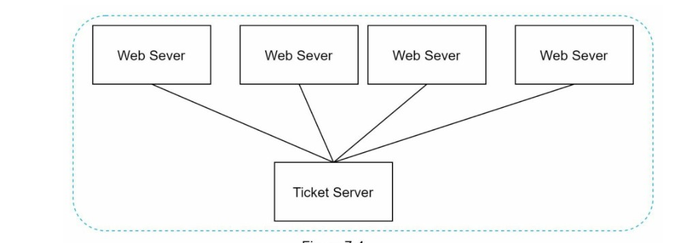

*Figure 7-4 — Flickr's ticket-server design: a centralized service that hands out ID ranges to many web servers.*

```
  Centralized service hands out ID ranges.
  
  ┌──────────────┐
  │ Ticket Server│    Server A: "Give me IDs" → gets range [1, 1000]
  │              │    Server B: "Give me IDs" → gets range [1001, 2000]
  │ Next Range:  │    Server C: "Give me IDs" → gets range [2001, 3000]
  │ [3001, 4000] │    
  └──────────────┘    Each server uses IDs from its range locally.
  
  Pros: Simple, 64-bit, roughly sortable
  Cons: Ticket server is SPOF (mitigate with multiple ticket servers)
```

**How it works (step by step):**

1. A single **Ticket Server** owns a monotonic counter (often a DB `auto_increment` column on a special `Tickets` table).
2. Each **Web Server** on startup (or when its local range is exhausted) calls the ticket server: *"give me the next batch of IDs."*
3. The ticket server atomically advances the counter by `BATCH_SIZE` (e.g., `UPDATE Tickets SET id = id + 1000`) and returns the new range, e.g., `[1001, 2000]`.
4. The web server caches that range **in memory** and assigns IDs locally (zero RPC per ID) until the range is drained, then repeats step 2.
5. For HA, run the ticket server **active-passive** with a replicated DB, or use two ticket servers with odd/even offsets (as Flickr did: one with `auto_increment_offset=1`, the other `=2`, both with `auto_increment_increment=2`).

### Approach 4: Snowflake (Twitter) — RECOMMENDED
```
  64-bit ID composed of multiple fields:

  ┌─────────┬──────────────────────────┬────────────┬──────────────┐
  │ Sign(1) │  Timestamp (41 bits)     │Machine(10) │Sequence(12)  │
  │   0     │  milliseconds since      │ ID         │ per ms       │
  │         │  custom epoch            │ (1024      │ (4096        │
  │         │  (~69 years)             │  machines) │  IDs/ms)     │
  └─────────┴──────────────────────────┴────────────┴──────────────┘
   Bit:  63    62────────────────22      21──────12   11──────────0

  How it works:
  ─────────────
  1. Timestamp: Current time in ms since custom epoch (e.g., 2020-01-01)
  2. Machine ID: Assigned when server starts (from ZooKeeper/config)
  3. Sequence: Increments per millisecond, resets when ms changes
  
  Example:
  Time: 1623456789000 ms (41 bits)
  Machine: 5 (10 bits)
  Sequence: 0 (12 bits)
  
  ID = (timestamp << 22) | (machine_id << 12) | sequence
  
  Properties:
  ✓ 64-bit
  ✓ Time-sortable (timestamp is the most significant bits!)
  ✓ Unique (machine_id + sequence prevents collision)
  ✓ No coordination needed (each machine generates independently)
  ✓ ~4 million IDs per second per machine (4096 IDs/ms × 1000)
  
  Used by: Twitter, Discord, Instagram
```

### Comparison
```
┌──────────────────┬──────────┬───────────┬──────────┬──────────────┐
│ Approach         │ Unique?  │ Sortable? │ 64-bit?  │ Distributed? │
├──────────────────┼──────────┼───────────┼──────────┼──────────────┤
│ UUID             │ Yes      │ No        │ No (128) │ Yes          │
│ DB Auto-incr     │ Yes      │ Yes       │ Yes      │ No (SPOF)    │
│ Ticket Server    │ Yes      │ Roughly   │ Yes      │ Partial      │
│ Snowflake        │ Yes      │ Yes       │ Yes      │ Yes          │
└──────────────────┴──────────┴───────────┴──────────┴──────────────┘
```

---

## 3. Snowflake — Visual Deep Dive

### 3.1 Bit Layout (64-bit ID)

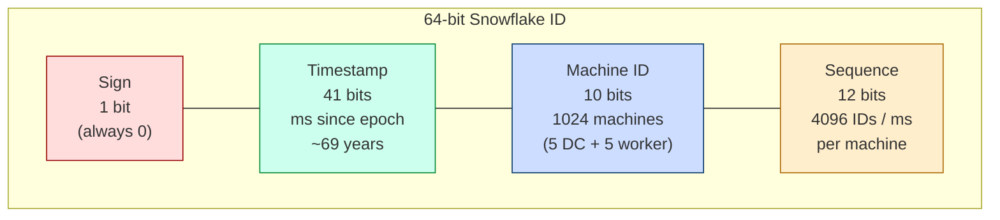

Formula:
```
ID = (timestamp << 22) | (machine_id << 12) | sequence
```

### 3.2 How One Node Generates an ID (Algorithm)

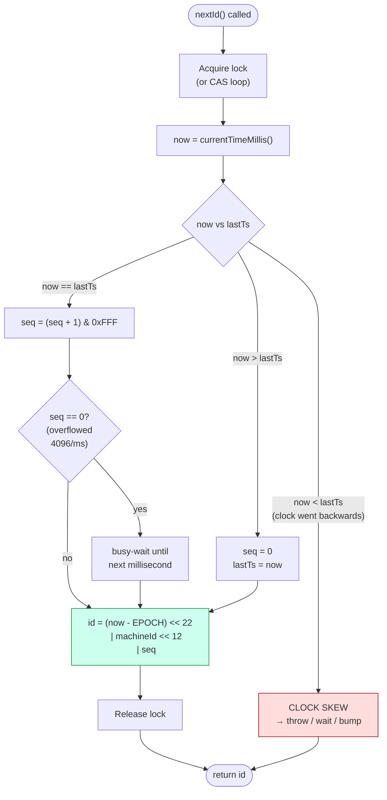

### 3.3 Why IDs Never Collide Across Machines

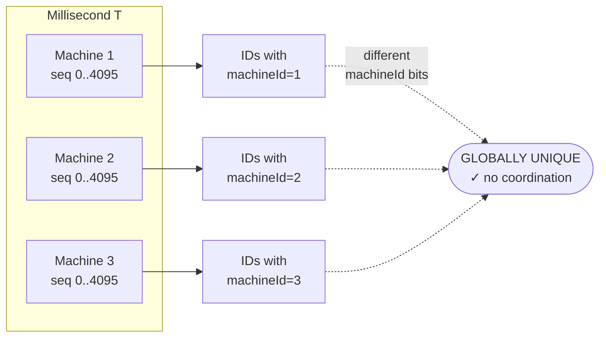

**Uniqueness guarantee rests on three pillars:**
- **Same machine, same ms** → different `sequence`
- **Same machine, different ms** → different `timestamp`
- **Different machine, same ms, same seq** → different `machine_id`

---

## 4. Multi-Server ID Generation — End-to-End

### 4.1 Topology

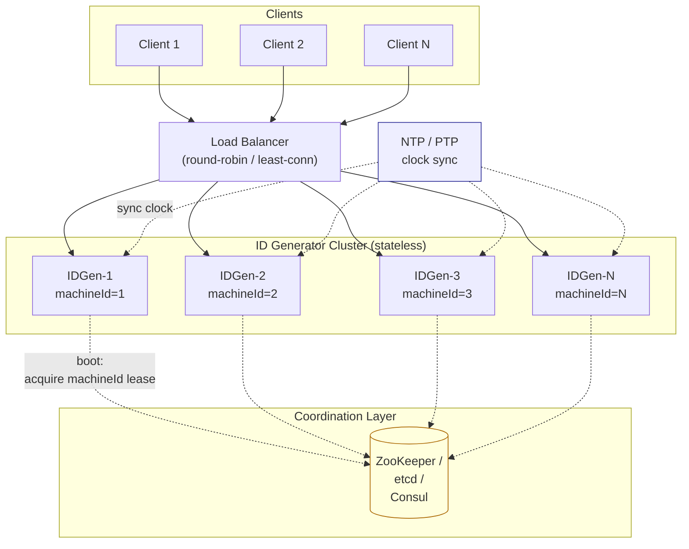

### 4.2 Step-by-Step: How Multiple Servers Generate IDs Without Collisions

1. **Boot-time machine-ID assignment**
   - Each generator boots and asks ZooKeeper/etcd for a **unique `machineId`** (0–1023).
   - Using an **ephemeral sequential znode** (`/idgen/machine-000000N`) guarantees uniqueness and auto-releases on crash.
   - The `machineId` is then baked into every ID for that process's lifetime.

2. **Independent, lock-free generation**
   - After boot, each node runs the algorithm in §3.2 **locally** — zero RPC, zero cross-node coordination.
   - Throughput = 4096 IDs/ms × N nodes ≈ **4M × N IDs/sec** (linearly scalable).

3. **Client request flow**
   - Client → Load balancer → any healthy generator (stateless, so any works).
   - Generator returns the 64-bit ID in < 1 ms; typical latency p99 < 5 ms.

4. **Clock drift protection**
   - All nodes run NTP (or PTP for tighter sync).
   - If local clock skews backwards, node either refuses (Twitter) or waits it out.

5. **Scale-out / scale-in**
   - Add a node → it grabs the next free `machineId` from ZK → starts serving.
   - Remove a node → ephemeral znode dies → `machineId` becomes reusable after a safety window (avoid duplicates from straggling in-flight requests).

6. **Failure isolation**
   - A generator crash affects only its in-flight requests; no other node is blocked (no shared state on the hot path).

### 4.3 Request Timeline (Sequence Diagram)

```mermaid
sequenceDiagram
    autonumber
    participant C as Client
    participant LB as Load Balancer
    participant G as IDGen-3 (machineId=3)
    participant ZK as ZooKeeper
    participant NTP as NTP

    Note over G,ZK: --- boot time ---
    G->>ZK: create ephemeral /idgen/machine- (sequential)
    ZK-->>G: assigned machineId = 3
    G->>NTP: sync clock

    Note over C,G: --- steady state ---
    C->>LB: POST /newId
    LB->>G: forward
    G->>G: ts = now(); seq = nextSeq(ts)
    G->>G: id = (ts<<22) | (3<<12) | seq
    G-->>LB: 1623456789000_3_0
    LB-->>C: id

    Note over G,ZK: --- crash ---
    G--xZK: session expires
    ZK->>ZK: ephemeral node deleted → id=3 reusable
```

---

## 5. Leader Election — When & Why You Need It

### 5.1 Does Snowflake need a leader?

**No — for ID generation itself.** Each node generates independently once it has a unique `machineId`. That's the beauty of Snowflake.

**Yes — you need leader-ish coordination for:**
- **Assigning unique `machineId`s** at boot (avoid two nodes picking the same ID).
- **Ticket server approach** (§2.3) — the active ticket server must be a singleton to hand out monotonic ranges.
- **Reclaiming `machineId`s** after crashes safely.
- **Config / epoch changes** (e.g., changing custom epoch or bit layout — rare, but leader serializes the switch).

### 5.2 Leader Election via ZooKeeper (ephemeral sequential znodes)

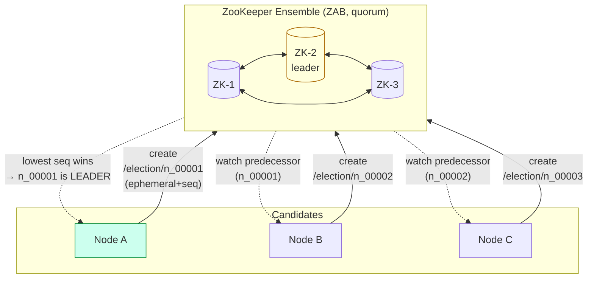

**Algorithm (folklore recipe):**
1. Every candidate creates an **ephemeral sequential** znode under `/election/`.
2. The candidate with the **lowest sequence number** is the leader.
3. Every other candidate puts a **watch on its immediate predecessor** (not on the leader — thundering-herd avoidance).
4. When the leader dies → its ephemeral znode is deleted → next-in-line wakes up via watch → becomes leader.

### 5.3 Failover Timeline

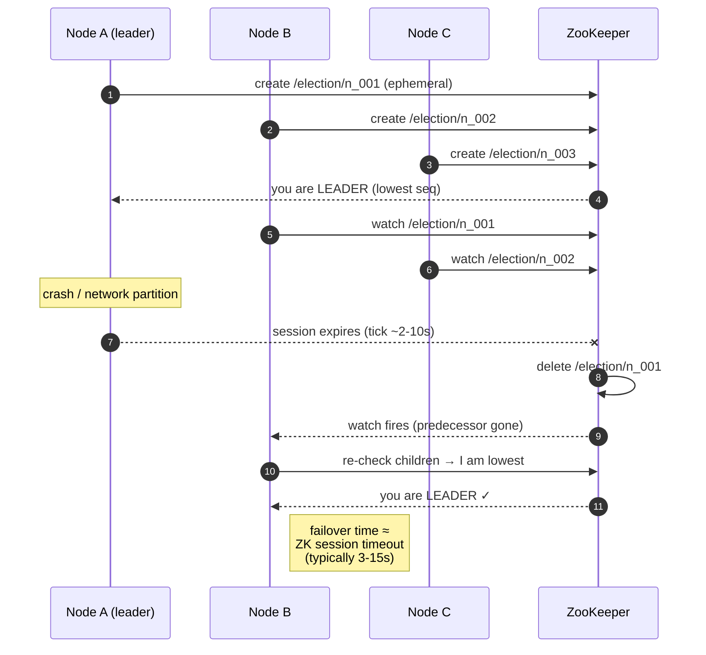

### 5.4 Alternatives to ZooKeeper

| Mechanism | How it elects | Where it shines |
|---|---|---|
| **Raft (etcd / Consul)** | Log replication + leader term | Modern Kubernetes-native stacks (etcd) |
| **Paxos (Chubby, Spanner)** | Multi-Paxos | Google-scale global locks |
| **Redis Redlock** | Multiple Redis masters + quorum | Simple, approximate; not for strict safety |
| **DB row lock** | `SELECT … FOR UPDATE` on a singleton row | Small scale, already have a DB |
| **Kubernetes Lease API** | `coordination.k8s.io/Lease` CRD | K8s-native controllers |

---

## 6. What Happens After ~69 Years? (Epoch Exhaustion)

41 bits of millisecond timestamp = `2^41` ms ≈ **69.7 years**. With Twitter's epoch of **2010-11-04**, the counter overflows around **2080**. You must plan for this long before it hits — or inherit a nasty migration.

### 6.1 The Strategies (best → worst)

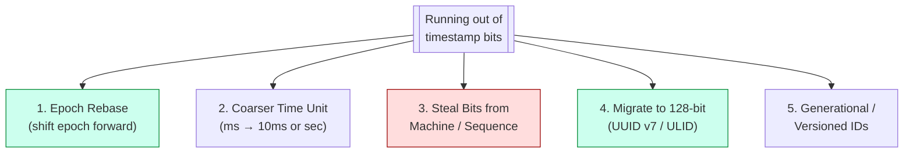

### 6.2 Strategy Details

| # | Strategy | How | Pros | Cons |
|---|---|---|---|---|
| **1** | **Epoch rebase** | Ship a new generator version that uses a **later epoch** (e.g., 2080 instead of 2010). All *new* IDs have smaller raw timestamp values but the same bit layout. | Zero schema change; buys another 69 years instantly. | **Breaks global sort order** — new IDs (ts=0) are numerically *smaller* than old IDs (ts≈2^41). You must add a 1-bit "generation" prefix or segregate old/new data. |
| **2** | **Coarser time unit** | Switch from ms to 10 ms (Sonyflake) or 1 s. 41 bits of 10ms = **697 years**; 41 bits of seconds = **69 000 years**. | Huge runway, same bit count. | Lower per-machine throughput (fewer IDs per tick). Need to grow sequence bits to compensate. Requires a coordinated flag day. |
| **3** | **Steal bits from machine/sequence** | E.g., drop machine bits 10 → 8 (256 machines) and give 2 bits to timestamp → `2^43` ms ≈ **279 years**. | No format change externally (still 64 bits). | Reduces max machine count or per-ms throughput; very hard to undo; may not be enough headroom. |
| **4** | **Migrate to 128-bit IDs** (**UUID v7 / ULID / KSUID**) | Dual-write new IDs as 128-bit; lazy-migrate old rows; eventually drop 64-bit column. | 48-bit timestamp → **8 900 years**. Future-proof. Client-generated → no coordination at all. | 2× storage per ID; every index, foreign key, API contract must change. Multi-year migration for large systems. |
| **5** | **Generational / versioned IDs** | Reserve 1–2 top bits for a **generation number**. Gen 0 = original epoch, Gen 1 = next 69 years, etc. Comparator becomes `(gen, ts, machine, seq)`. | Preserves sort order across generations. Pay the cost once. | Loses 1 timestamp bit up front (~35 years per gen, 8 gens × 35 = 280 years). Every consumer must know how to decode. |

### 6.3 Recommended Playbook

```mermaid
sequenceDiagram
    autonumber
    participant Now as Today
    participant T10 as T-10 years
    participant T2 as T-2 years
    participant T0 as Overflow Day

    Now->>Now: Pick Strategy 4 (UUID v7) for ALL new services
    Note over Now: Avoid inheriting the problem

    Now->>T10: Existing systems: add "id_v2" column (128-bit)
    T10->>T10: Dual-write (old 64-bit + new 128-bit)
    T10->>T2: Backfill + switch reads to id_v2
    T2->>T0: Drop old column; 64-bit IDs are history
    T0->>T0: No incident — migration already complete
```

**Rule of thumb for interviews:**
1. **Greenfield systems (2026+)** → start with **UUID v7** or **ULID**. 128 bits is cheap now; you never hit the wall.
2. **Existing Snowflake deployments** → combine **Strategy 1 (epoch rebase)** with **Strategy 5 (generation bit)** so sort order is preserved across the transition.
3. **Never** pick Strategy 3 (steal bits) unless you have a throwaway system — it just defers the problem a few decades.

### 6.4 Real-world examples

- **Twitter** originally used Snowflake with a 2010 epoch → has moved to a newer internal scheme well before 2080.
- **Discord** uses Snowflake-style IDs with a 2015 epoch → they get ~69 years from then, until ~2084.
- **Sonyflake** deliberately chose **10 ms ticks + 16-bit machine + 8-bit sequence** → **174 years** of timestamp runway on purpose.
- **UUID v7** (RFC 9562, 2024) uses a **48-bit unix-ms timestamp** → **8 925 years** of runway. This is where the industry is heading.

---

## 7. Snowflake Clock Issues (Clock Skew)

```
CLOCK SKEW PROBLEM:
  If system clock goes backwards (NTP step correction),
  we could generate duplicate IDs for the same timestamp.

  Solutions:
  1. Wait until clock catches up (block nextId)
  2. Use sequence number to bridge the gap (virtual-clock trick)
  3. Detect clock regression and throw error (Twitter's approach)
  4. Use NTP slew mode + monotonic clock (CLOCK_MONOTONIC) for delta
  5. Use PTP (Precision Time Protocol) in-DC for sub-millisecond sync
```

### 7.1 Clock Skew Handling (decision diagram)

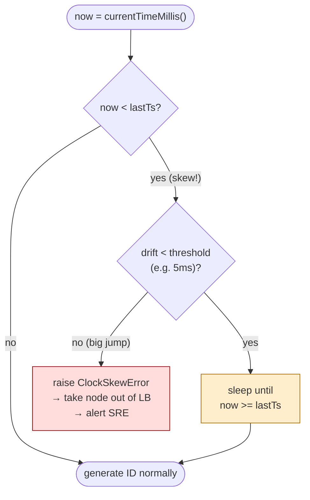

---

## 8. Other HLD Patterns Worth Knowing

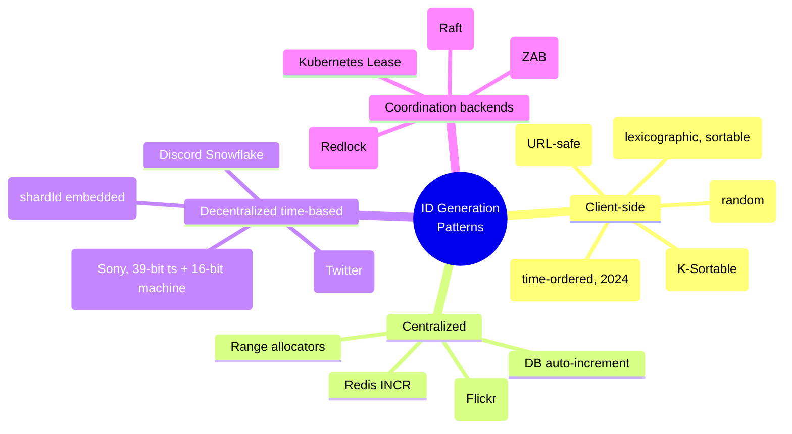

### 8.1 Pattern Cheat Sheet

| Pattern | Use when | Trade-off |
|---|---|---|
| **UUID v7 / ULID** | Client-generated, sortable, no server round-trip | 128-bit (storage ↑), slightly less compact than Snowflake |
| **Snowflake** | High throughput, 64-bit, time-sortable, multi-DC | Needs machine-ID assignment + clock sync |
| **Sonyflake** | Longer lifetime (174 years), fewer machines | Lower per-ms throughput (256 vs 4096) |
| **Instagram ID** | Shard-aware IDs (shardId embedded) | IDs tied to sharding strategy; hard to reshard |
| **Ticket server** | Simple, small scale | SPOF unless active-passive with failover |
| **Redis INCR** | Need strictly monotonic + already using Redis | Redis becomes a dependency + SPOF without HA |

### 8.2 Related HLD Patterns Powering This Design

1. **Leader Election** — ZooKeeper ephemeral sequential znodes, Raft leader term (etcd), Redlock.
2. **Service Discovery & Registration** — generators register themselves in ZK/Consul so LB can find them.
3. **Load Balancing** — L4 (round-robin, least-conn) in front of stateless generator fleet.
4. **Stateless Horizontal Scaling** — the per-node algorithm has no shared hot path → linear scale.
5. **Bulkhead / Failure Isolation** — one generator crash ≠ cluster outage; clients just hit another node.
6. **Circuit Breaker at Client** — if a generator returns errors (clock skew), client retries elsewhere.
7. **Heartbeat + Ephemeral Lease** — ZK session heartbeat releases `machineId` automatically on crash.
8. **Clock Synchronization** — NTP/PTP is foundational; **assume clocks drift**, design accordingly.
9. **Idempotency Keys** — downstream services use the generated ID as the idempotency token.
10. **Content-Addressable / Time-Sortable Keys** — time-prefixed IDs enable efficient B-tree/LSM range scans and natural partitioning by time.
11. **Monotonic Writes** — same-user IDs from same generator are strictly increasing → simpler "newest-first" queries.
12. **Observability** — expose metrics: `ids_generated_total`, `sequence_saturation_ratio`, `clock_skew_events`, `machine_id_conflicts`.

---

## 9. Deep Dive: UUID v7 — The Modern Alternative

**Standardized in May 2024** via **[RFC 9562](https://www.rfc-editor.org/rfc/rfc9562)** (which obsoleted the old RFC 4122). It's what you should reach for in 2026+ when you need IDs in a new system.

### 9.1 The Big Idea

UUID v7 combines the best of two worlds:
- **UUID v4's** benefits: 128-bit, client-generated, no coordination needed, globally unique.
- **Snowflake's** benefit: **time-ordered** — newer IDs sort *after* older ones.

It fixes UUID v4's worst sin: **random IDs destroy database B-tree performance** because every insert lands in a random leaf page → page splits, cache misses, fragmentation. UUID v7 inserts land at the *end* of the index like an auto-increment, but without a centralized counter.

### 9.2 Bit Layout (128 bits)

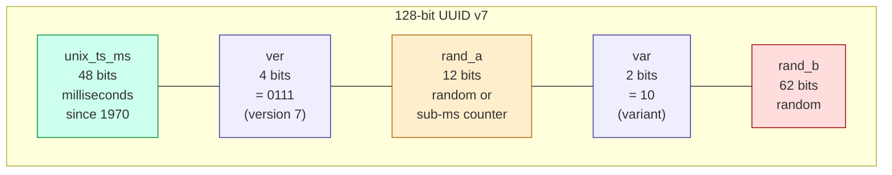

**Total: 48 + 4 + 12 + 2 + 62 = 128 bits**

Example: `018f6a7b-4c8d-7a3e-9f12-abcdef123456`
- `018f6a7b4c8d` = 48-bit timestamp (ms since epoch)
- `7` = version
- `a3e` = 12 bits of randomness / sub-ms counter
- `9` = starts with `10` (variant bits)
- `f12abcdef123456` = 62 bits random

### 9.3 How Generation Works (Algorithm)

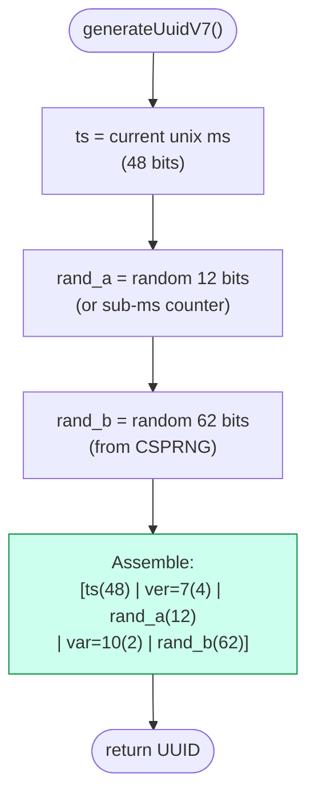

That's it — **no ZooKeeper, no machineId, no leader election**. Every service, every client, every mobile app can generate these independently.

### 9.4 Why It's Better Than UUID v4 (for Databases)

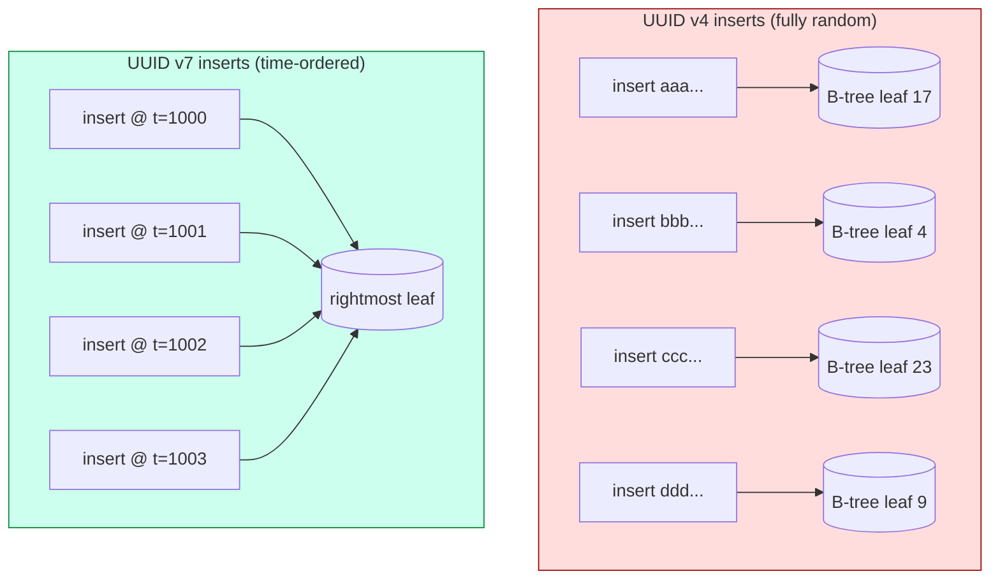

**Concrete benefits over v4:**

| Concern | UUID v4 | UUID v7 |
|---|---|---|
| Insert location | Random leaf → page splits | Rightmost leaf → append-only |
| Index fragmentation | High | Very low |
| Cache hit rate | Poor (random working set) | Excellent (hot rightmost page) |
| Range queries by time | Impossible | `WHERE id BETWEEN ...` works |
| `ORDER BY id` | Random order | Time order ✓ |
| Sortable in storage | No | Yes, lexicographically |

**Real measurements:** PostgreSQL benchmarks show **2–10× faster INSERT throughput** with UUID v7 vs v4 on large tables, and significantly smaller indexes after VACUUM.

### 9.5 Uniqueness Guarantee

You might ask: *"if it's mostly a timestamp, won't two generations at the same millisecond collide?"*

**No — 62 random bits make collisions statistically impossible within the same ms.**

```
Probability of collision in same millisecond ≈ 1 - e^(-n² / 2^63)

At 1 MILLION IDs in the SAME millisecond:  ≈ 1.08 × 10⁻⁷  (about 1 in 9 million)
At 100 IDs / ms (typical):                  ≈ 5.4 × 10⁻¹⁶ (effectively never)
```

For extra safety, RFC 9562 allows **rand_a** to act as a **sub-millisecond monotonic counter** instead of random bits, giving you strict monotonicity even within a single ms on one process.

### 9.6 Comparison with Snowflake

| Feature | Snowflake (64-bit) | UUID v7 (128-bit) |
|---|---|---|
| Size | 8 bytes | 16 bytes |
| Time-sortable | ✅ | ✅ |
| Coordination needed | Yes (machineId at boot) | **No** (pure client-side) |
| Clock skew sensitive | Yes (per-node) | Less (random bits tolerate same-ms collisions) |
| Runway | 69 years | **~8 925 years** |
| Throughput | 4096 IDs/ms/node | Unlimited (CSPRNG bound) |
| Storage overhead | Compact | 2× bigger |
| Exposes info? | Leaks machine ID + precise timestamp | Leaks only ms-precision timestamp |
| Standard? | De-facto (Twitter) | **IETF RFC 9562** ✓ |

**The 2× storage tax is almost always worth it** given modern storage costs and the elimination of all coordination complexity.

### 9.7 Sibling Formats (for comparison)

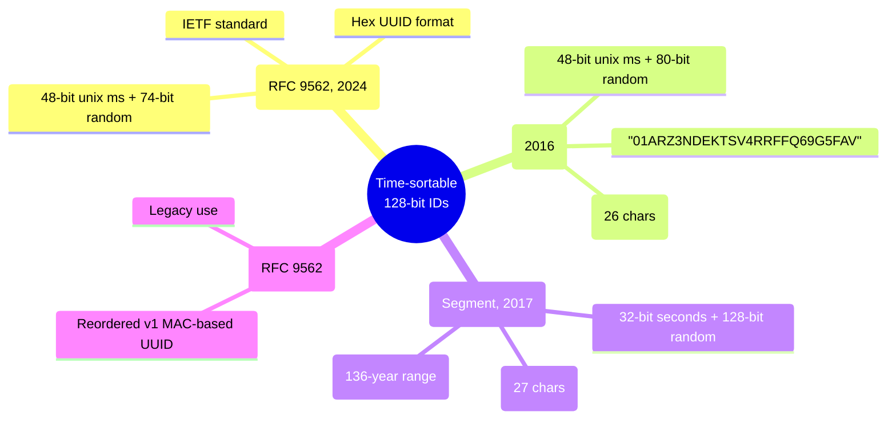

All four are time-ordered and 128-ish bits. **UUID v7 is the one to bet on** because:
1. It's now an **IETF RFC** (official standard).
2. Uses the familiar UUID format (works in every language / DB that already supports UUIDs).
3. Defined to be **database-friendly** by design.
4. Includes sub-ms monotonicity option for high-throughput scenarios.

### 9.8 Language / DB Support (as of 2026)

| Platform | Status |
|---|---|
| **PostgreSQL 18+** | Native `uuidv7()` function |
| **PostgreSQL 14–17** | Extension (`uuidv7-sql`) or client-side |
| **MySQL 8.0+** | Client-side libraries; ordered storage via `BINARY(16)` |
| **Java** | Libs like **UUID Creator**, **JUG**, or Spring's `UuidCreator` (stdlib support pending) |
| **Python** | `uuid6` or `uuid-utils` on PyPI; `uuid.uuid7()` coming to stdlib |
| **Node.js** | `uuid` npm package (v10+) has `v7()` |
| **Go** | `github.com/google/uuid` has `NewV7()` |
| **Rust** | `uuid` crate with `v7` feature |
| **.NET** | `Guid.CreateVersion7()` in .NET 9 |

### 9.9 When to Use What (Decision Tree)

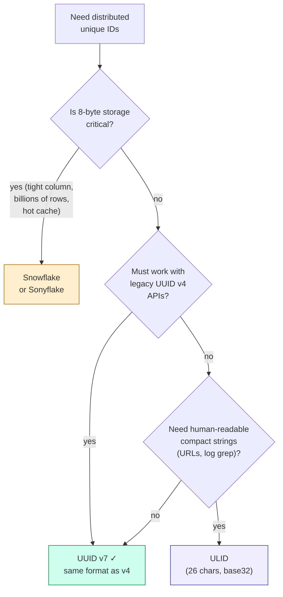

### 9.10 TL;DR

UUID v7 is a 128-bit, time-ordered UUID with a 48-bit unix-millisecond prefix and 74 random bits. It's the new industry default (RFC 9562, May 2024) for distributed IDs because it:

- ✅ Needs **zero coordination** — any process, any device can generate one.
- ✅ Is **time-sortable** — fixes the DB index fragmentation of UUID v4.
- ✅ Has **~8 900 years of runway** — no epoch-exhaustion problem.
- ✅ Uses the **standard UUID format** — drop-in replacement for v4 everywhere.
- ✅ Is **cryptographically random** for the non-time bits — no machine-ID leakage like Snowflake.

**The only reason to pick Snowflake over UUID v7 in 2026 is when those extra 8 bytes per ID actually matter** (ultra-hot primary key on a multi-trillion row table). For everything else, start with UUID v7.

---

## 10. Architecture at a Glance

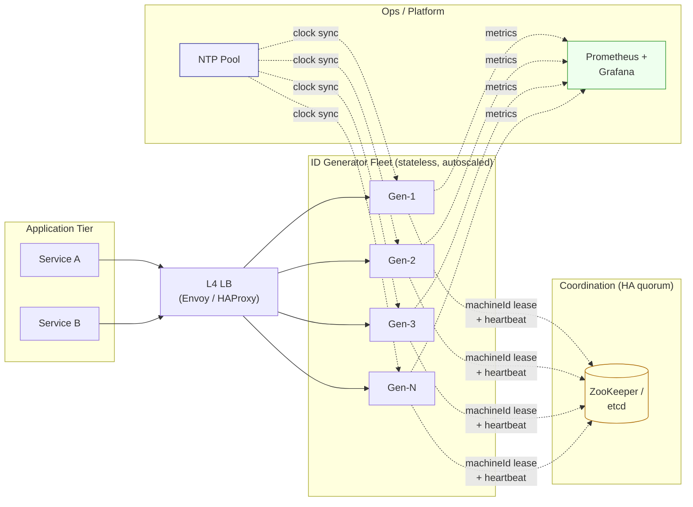

---

## 11. Key Points for Interview

1. **Snowflake is the answer** for distributed ID generation — explain the bit layout (1 + 41 + 10 + 12).
2. **41 bits for timestamp** → ~69 years from a custom epoch.
3. **10 bits for machine ID** → 1024 machines (often split 5 DC + 5 worker).
4. **12 bits for sequence** → 4096 IDs per millisecond per machine → ~4M IDs/sec/node.
5. **No coordination on the hot path** — only at **boot time** to grab a unique `machineId` (via ZooKeeper/etcd).
6. **Leader election is NOT needed for ID generation** — only for `machineId` assignment and the ticket-server variant.
7. **Time-sorted IDs** enable efficient DB range scans, newest-first queries, and natural time-based sharding.
8. Mention **clock skew** (NTP step-back, VM pauses) and solutions: wait / error out / monotonic clock / PTP.
9. Compare with **UUID v7 / ULID** (client-side, 128-bit, also sortable) for modern alternatives.
10. Call out **failure modes**: machine-ID collision, sequence overflow, clock skew — each has a mitigation.
11. **Epoch exhaustion (~69 years)** — plan for it: rebase epoch + generation bit, or migrate to UUID v7 (48-bit ts = 8 900 years). Greenfield → just start with UUID v7.
