# Design Key-Value Store

> **Difficulty:** Easy | **Frequency:** ★★★★☆ | **Companies:** Amazon, Google, Meta
> **Source:** Alex Xu Vol 1 Chapter 6, Amazon Dynamo Paper

---

## 1. Requirements

### Functional
- `put(key, value)` — store a key-value pair
- `get(key)` — retrieve value for a key
- `delete(key)` — remove a key-value pair

### Non-Functional
- High availability (AP system, like DynamoDB)
- High scalability (handle petabytes of data)
- Low latency (< 10ms for reads/writes)
- Tunable consistency

---

## 2. Single-Server KV Store

```
Simple approach: In-memory hash map

  HashMap<String, String>
  ┌───────────┬────────────────┐
  │ Key       │ Value          │
  ├───────────┼────────────────┤
  │ user:123  │ {"name":"John"}│
  │ sess:abc  │ {"token":"xyz"}│
  └───────────┴────────────────┘

  Limitations:
  - Memory is limited (can't store everything)
  - Single point of failure
  - Can't scale beyond one machine

  Optimizations:
  1. LRU eviction for memory management
  2. Persist to disk (WAL + SSTable)
```

---

## 3. Distributed KV Store Architecture

### 3.1 High-level component view

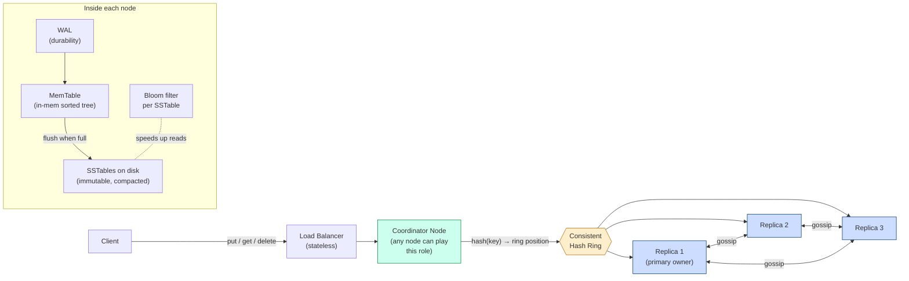
```mermaid
flowchart LR
    C["Client"] -->|"put / get / delete"| LB["Load Balancer<br/>(stateless)"]
    LB --> Coord["Coordinator Node<br/>(any node can play<br/>this role)"]

    Coord -->|"hash(key) → ring position"| Ring{{"Consistent<br/>Hash Ring"}}

    Ring --> N1["Replica 1<br/>(primary owner)"]
    Ring --> N2["Replica 2"]
    Ring --> N3["Replica 3"]

    N1 <-->|"gossip"| N2
    N2 <-->|"gossip"| N3
    N1 <-->|"gossip"| N3

    subgraph Each_Node["Inside each node"]
        direction TB
        WAL["WAL<br/>(durability)"] --> MT["MemTable<br/>(in-mem sorted tree)"]
        MT -->|"flush when full"| SST["SSTables on disk<br/>(immutable, compacted)"]
        BF["Bloom filter<br/>per SSTable"] -. "speeds up reads" .- SST
    end

    style Coord fill:#cfe,stroke:#083
    style Ring fill:#fec,stroke:#a60
    style N1 fill:#cdf,stroke:#036
    style N2 fill:#cdf,stroke:#036
    style N3 fill:#cdf,stroke:#036
```

### 3.2 Consistent hash ring (data placement)

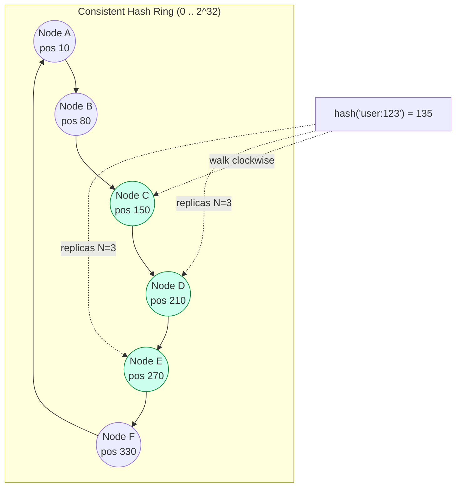
```mermaid
flowchart TB
    subgraph Ring["Consistent Hash Ring (0 .. 2^32)"]
        A(("Node A<br/>pos 10")) --> B(("Node B<br/>pos 80"))
        B --> C(("Node C<br/>pos 150"))
        C --> D(("Node D<br/>pos 210"))
        D --> E(("Node E<br/>pos 270"))
        E --> F(("Node F<br/>pos 330"))
        F --> A
    end

    K1["hash('user:123') = 135"] -. "walk clockwise" .-> C
    K1 -. "replicas N=3" .-> D
    K1 -. "replicas N=3" .-> E

    style C fill:#cfe,stroke:#083
    style D fill:#cfe,stroke:#083
    style E fill:#cfe,stroke:#083
```

- `hash(key)` lands the key on a point in the ring.
- Walk **clockwise** → first node is the **coordinator / primary**.
- The next `N-1` distinct physical nodes become replicas.
- Adding/removing a node only remaps `K/N` keys (minimal reshuffle).
- Use **virtual nodes** (each physical node owns many ring positions) to avoid hotspots.

### 3.3 Write path (`put`) — quorum write

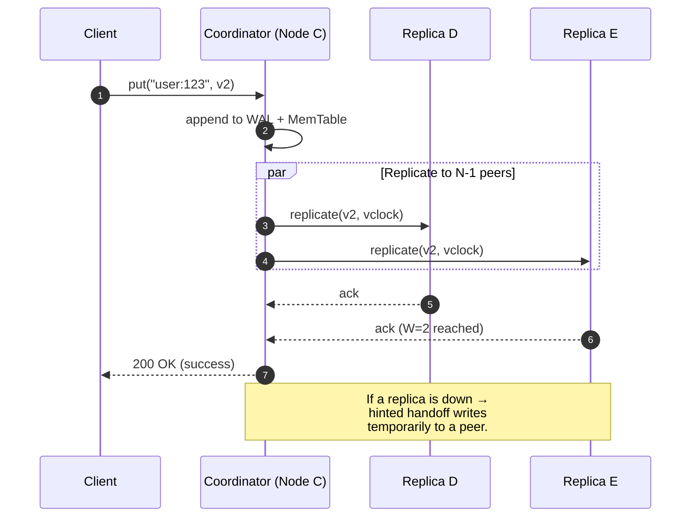
```mermaid
sequenceDiagram
    autonumber
    participant C as Client
    participant Co as Coordinator (Node C)
    participant R1 as Replica D
    participant R2 as Replica E

    C->>Co: put("user:123", v2)
    Co->>Co: append to WAL + MemTable
    par Replicate to N-1 peers
        Co->>R1: replicate(v2, vclock)
        Co->>R2: replicate(v2, vclock)
    end
    R1-->>Co: ack
    R2-->>Co: ack (W=2 reached)
    Co-->>C: 200 OK (success)
    Note over Co,R2: If a replica is down →<br/>hinted handoff writes<br/>temporarily to a peer.
```

### 3.4 Read path (`get`) — quorum read + read repair

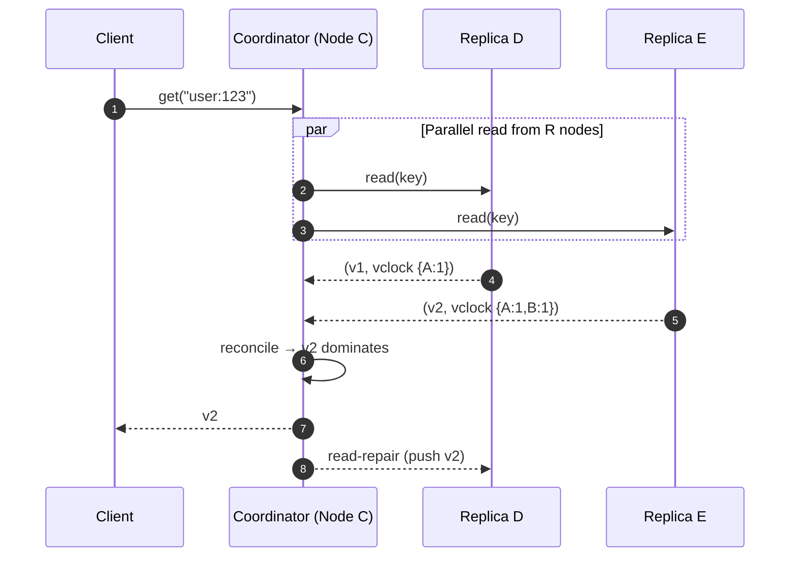
```mermaid
sequenceDiagram
    autonumber
    participant C as Client
    participant Co as Coordinator (Node C)
    participant R1 as Replica D
    participant R2 as Replica E

    C->>Co: get("user:123")
    par Parallel read from R nodes
        Co->>R1: read(key)
        Co->>R2: read(key)
    end
    R1-->>Co: (v1, vclock {A:1})
    R2-->>Co: (v2, vclock {A:1,B:1})
    Co->>Co: reconcile → v2 dominates
    Co-->>C: v2
    Co-->>R1: read-repair (push v2)
```

### 3.5 Quorum math (tunable consistency)

| Setting | Latency | Consistency | Use case |
|---|---|---|---|
| `N=3, W=3, R=1` | slow writes | strong read | read-heavy, must be fresh |
| `N=3, W=1, R=3` | slow reads  | strong read | write-heavy |
| `N=3, W=2, R=2` | balanced    | **strong** (`W+R > N`) | general purpose (Dynamo default) |
| `N=3, W=1, R=1` | fastest     | eventual | AP, shopping cart, analytics |

---

## 4. Storage Engine (How Data Is Stored on Disk)

LSM-Tree (Log-Structured Merge Tree) — used by Cassandra, RocksDB, LevelDB, HBase.

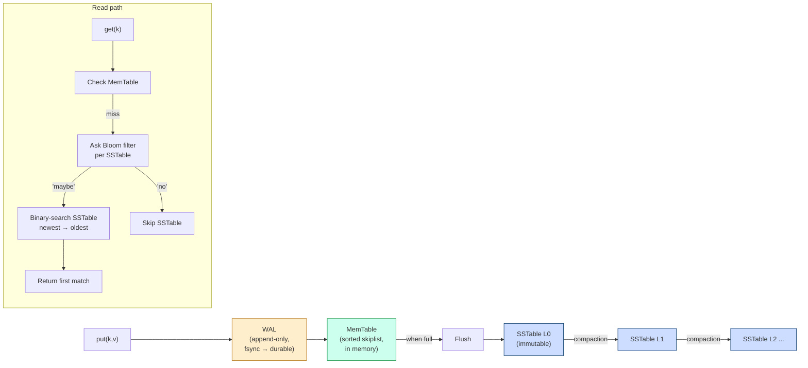
```mermaid
flowchart LR
    W["put(k,v)"] --> WAL["WAL<br/>(append-only,<br/>fsync → durable)"]
    WAL --> MT["MemTable<br/>(sorted skiplist,<br/>in memory)"]
    MT -- "when full" --> F["Flush"]
    F --> S0["SSTable L0<br/>(immutable)"]
    S0 -- "compaction" --> S1["SSTable L1"]
    S1 -- "compaction" --> S2["SSTable L2 ..."]

    subgraph Read["Read path"]
        direction TB
        G["get(k)"] --> M2["Check MemTable"]
        M2 -- miss --> BL["Ask Bloom filter<br/>per SSTable"]
        BL -- "'maybe'" --> SEEK["Binary-search SSTable<br/>newest → oldest"]
        BL -- "'no'" --> SKIP["Skip SSTable"]
        SEEK --> DONE["Return first match"]
    end

    style WAL fill:#fec,stroke:#a60
    style MT fill:#cfe,stroke:#083
    style S0 fill:#cdf,stroke:#036
    style S1 fill:#cdf,stroke:#036
    style S2 fill:#cdf,stroke:#036
```

**Why LSM-Tree instead of B-Tree?**

- Writes are sequential (WAL + flush) → great for SSD/HDD throughput.
- B-Trees do random in-place writes → slower under heavy write load.
- Trade-off: reads may touch multiple SSTables; **Bloom filters** cheaply rule out most of them.
- Deletes are **tombstones**; compaction physically removes them later.

---

## 5. Conflict Resolution

When `W < N` (high availability), two clients can update the same key on different replicas → divergence.

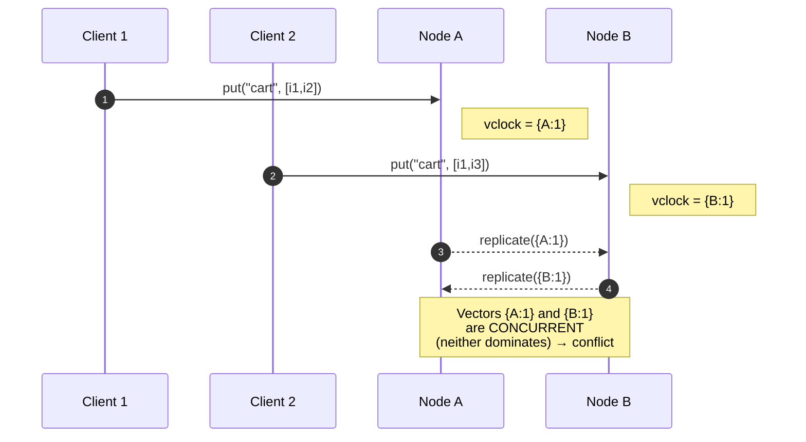
```mermaid
sequenceDiagram
    autonumber
    participant C1 as Client 1
    participant C2 as Client 2
    participant A as Node A
    participant B as Node B

    C1->>A: put("cart", [i1,i2])
    Note right of A: vclock = {A:1}
    C2->>B: put("cart", [i1,i3])
    Note right of B: vclock = {B:1}

    A-->>B: replicate({A:1})
    B-->>A: replicate({B:1})

    Note over A,B: Vectors {A:1} and {B:1}<br/>are CONCURRENT<br/>(neither dominates) → conflict
```

**Resolution strategies**

| Strategy | How it works | Use when |
|---|---|---|
| **Last-Write-Wins (LWW)** | Keep version with largest timestamp | Idempotent values, loss tolerable |
| **Vector clocks + app merge** | Return siblings to client, app decides | Shopping cart (Dynamo) |
| **CRDTs** | Structures that mathematically merge (OR-Set, G-Counter, LWW-Register) | Carts, counters, collaborative docs |
| **Quorum (W+R > N)** | Prevent conflict by construction | Strong-consistency requirement |

Example with a shopping-cart OR-Set CRDT → union of both writes → `[i1, i2, i3]`. No data lost.

### 5.1 Concurrent writes on the **same** coordinator (mid-flight)

> *Scenario: `put(k, v1)` is still being replicated from C to D and E (waiting for `W=2` acks). While that is in flight, a second client sends `put(k, v2)` to the same Node C. Does the second call wait?*

**Short answer — no.** The coordinator does not hold a per-key lock for the duration of replication. Both writes proceed in parallel; their order is reconstructed via versioning.

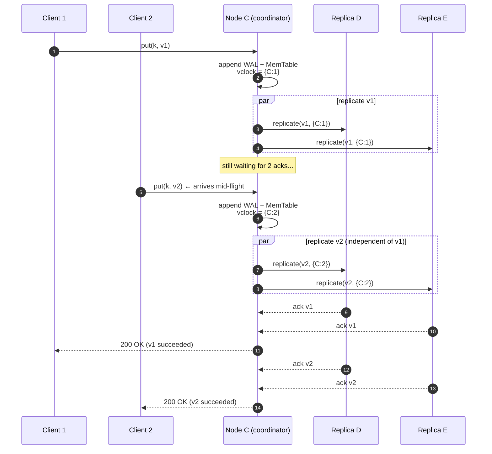
```mermaid
sequenceDiagram
    autonumber
    participant C1 as Client 1
    participant C2 as Client 2
    participant C as Node C (coordinator)
    participant D as Replica D
    participant E as Replica E

    C1->>C: put(k, v1)
    C->>C: append WAL + MemTable<br/>vclock = {C:1}
    par replicate v1
        C->>D: replicate(v1, {C:1})
        C->>E: replicate(v1, {C:1})
    end
    Note over C: still waiting for 2 acks...

    C2->>C: put(k, v2)  ← arrives mid-flight
    C->>C: append WAL + MemTable<br/>vclock = {C:2}
    par replicate v2 (independent of v1)
        C->>D: replicate(v2, {C:2})
        C->>E: replicate(v2, {C:2})
    end

    D-->>C: ack v1
    E-->>C: ack v1
    C-->>C1: 200 OK (v1 succeeded)

    D-->>C: ack v2
    E-->>C: ack v2
    C-->>C2: 200 OK (v2 succeeded)
```

- Each write gets its own version from C's atomic counter: `{C:1}`, `{C:2}`.
- Because `{C:2}` strictly **descends from** `{C:1}` (monotonic on the same node), `v2` dominates `v1` → **no conflict**.
- Replication RPCs race over the network; if D receives `v2` before `v1`, D simply drops the later-arriving older write.
- Both clients get `200 OK`; a subsequent `get(k)` returns `v2`.

**Conflict only appears across coordinators** — i.e. Client 1 hits Node A, Client 2 hits Node B → `{A:1}` vs `{B:1}` → concurrent → needs LWW / siblings / CRDT (see the diagram above).

### 5.2 What if both puts hit the **same** coordinator at "exactly" the same time?

"Exactly simultaneous" is impossible in practice on a single node — somewhere in the path a **single shared resource** forces a total order.

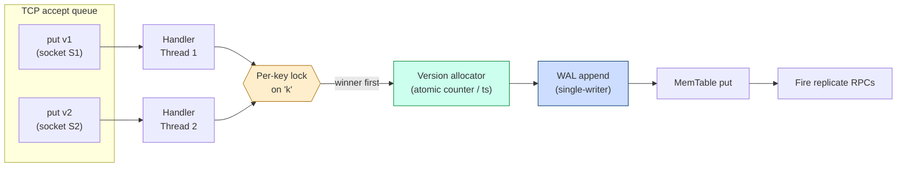
```mermaid
flowchart LR
    subgraph TCP["TCP accept queue"]
        P1["put v1<br/>(socket S1)"]
        P2["put v2<br/>(socket S2)"]
    end

    P1 --> T1["Handler<br/>Thread 1"]
    P2 --> T2["Handler<br/>Thread 2"]

    T1 --> LK{{"Per-key lock<br/>on 'k'"}}
    T2 --> LK

    LK -- "winner first" --> SEQ["Version allocator<br/>(atomic counter / ts)"]
    SEQ --> WAL["WAL append<br/>(single-writer)"]
    WAL --> MT["MemTable put"]
    MT --> REPL["Fire replicate RPCs"]

    style LK fill:#fec,stroke:#a60
    style SEQ fill:#cfe,stroke:#083
    style WAL fill:#cdf,stroke:#036
```

Three serialization points pick a winner even when packets land in the same nanosecond:

| Serialization point | What it does | Example |
|---|---|---|
| **Per-key lock / stripe mutex** | Only one writer per key at a time inside the coordinator | Cassandra's `LockStripe`, Riak's FSM-per-key |
| **Atomic version allocator** | `AtomicLong.incrementAndGet()` hands out distinct versions even within the same ns | Vector-clock counter `{C:1}`, `{C:2}` |
| **WAL append point** | The commit log has a single writer (or mutex-protected ring buffer); whoever appends first is "earlier" | RocksDB WAL, Cassandra CommitLog |

**Step-by-step:**

1. OS delivers the two TCP segments to different sockets — the kernel already picked an order.
2. Two handler threads try to **acquire the per-key lock** on `k`. One wins (say T1), the other blocks for a few μs.
3. T1 calls the **atomic version allocator** → `{C:1}`. Appends to WAL, updates MemTable, releases the key lock, fans out replication.
4. T2 immediately acquires the lock, allocates `{C:2}`, appends to WAL, replicates.
5. Writes are now strictly ordered `v1 → v2`. Both clients receive `200 OK`; `v2` is the surviving value. The "loser" simply paid a few microseconds of extra latency.

**Systems without a per-key lock** (some Cassandra paths) rely on timestamp ordering alone. Two writes can then share the same μs timestamp; tie-breakers differ by system:

- **Cassandra LWW** — compares values lexicographically when timestamps tie (deterministic, but can pick the "wrong" one).
- **DynamoDB** — uses `(timestamp, serverRequestId)` where `requestId` is a server-side monotonic id → never truly a tie.
- **Riak / Dynamo** — the vector-clock counter is atomically incremented per write on the coordinator → two writes on C can never both get `{C:1}`. Same trick as the per-ms sequence counter in the Snowflake ID design.

### 5.3 When you actually want "wait / fail" semantics

Default leaderless behavior silently serializes and overwrites. If you need the second writer to **observe** the first, use one of:

| Technique | How | Cost |
|---|---|---|
| **Compare-And-Set / conditional put** | `put(k, v2, ifVersion={C:1})` — fails if someone else wrote in between | Optimistic, client retries on conflict |
| **Single-leader (Raft) per key/shard** | Leader serializes writes through its log | Strong consistency, leader bottleneck |
| **Distributed lock** (ZooKeeper / Redlock) | Client acquires lock on `k` before `put` | Extra round-trip, lock-management complexity |
| **Linearizable quorum (read-before-write)** | Coordinator reads latest version, then writes | Extra RTT, still races under partitions |

**TL;DR:** a Dynamo-style KV store never *blocks* one writer behind another based on "the previous request isn't done replicating." It **versions** them and lets the version lattice decide who wins. Blocking semantics (CAS, leader, lock) are opt-in.

---

## 6. Failure Handling

### 6.1 Hinted handoff (temporary failure) — deep dive

**Problem.** In an `N=3, W=2` store, replicas die / reboot / have network blips all the time. Two bad options *without* hinted handoff:

| Option | Problem |
|---|---|
| Fail the write until the replica recovers | Hurts availability — one flaky node stalls writes |
| Skip the replica permanently | Under-replication → risk of data loss |

**Hinted handoff = "accept the write anyway, stash a durable reminder on a healthy node, deliver it later."** It's the *sloppy-quorum* technique from the Dynamo paper.

#### What a hint actually is

A small, durable record stored on a healthy node (not the target):

```
Hint {
  target_node:   "D"             // who this write was FOR
  key:           "user:123"
  value:         <payload bytes>
  vector_clock:  {C: 42}         // preserves causality at replay time
  timestamp:     1712000123456
  ttl:           3h               // expire if not delivered in time
  hint_id:       <uuid>
}
```

Hints live in a **separate keyspace / log** (e.g., Cassandra's `hints/` directory) so they don't pollute normal reads. A `get` on the helper node will *not* surface the hinted payload to clients.

#### Write path when a replica is down

Preference list for `user:123` is `[C, D, E]`. **D is down.**

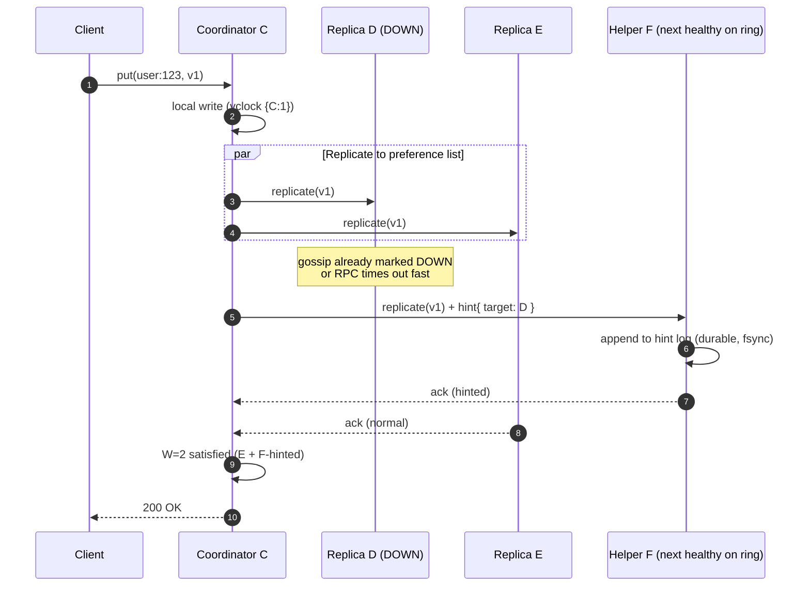
```mermaid
sequenceDiagram
    autonumber
    participant Cl as Client
    participant Co as Coordinator C
    participant D as Replica D (DOWN)
    participant E as Replica E
    participant F as Helper F (next healthy on ring)

    Cl->>Co: put(user:123, v1)
    Co->>Co: local write (vclock {C:1})
    par Replicate to preference list
        Co->>D: replicate(v1)
        Co->>E: replicate(v1)
    end
    Note over D: gossip already marked DOWN<br/>or RPC times out fast

    Co->>F: replicate(v1) + hint{ target: D }
    F->>F: append to hint log (durable, fsync)
    F-->>Co: ack (hinted)
    E-->>Co: ack (normal)

    Co->>Co: W=2 satisfied (E + F-hinted)
    Co-->>Cl: 200 OK
```

- The coordinator picks the **next healthy node on the ring** (`F`) as the stand-in — this is what makes it a *sloppy* quorum: the write lands on a node not in D's natural replica set.
- `F` writes to its **hint log**, not its regular data store. Clients reading `user:123` from `F` still miss.
- The hinted write counts toward `W` under sloppy-quorum mode. Strict-quorum mode rejects instead.

#### Hint log storage

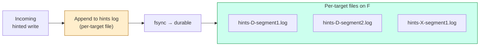
```mermaid
flowchart LR
    IN["Incoming<br/>hinted write"] --> APP["Append to hints log<br/>(per-target file)"]
    APP --> DISK["fsync → durable"]

    subgraph Files["Per-target files on F"]
        H1["hints-D-segment1.log"]
        H2["hints-D-segment2.log"]
        HX["hints-X-segment1.log"]
    end
    DISK --> Files

    style APP fill:#fec,stroke:#a60
    style Files fill:#cfe,stroke:#083
```

- **Segmented append-only logs** (like Kafka) — rotated on size/time thresholds; whole segments deleted once drained.
- **Indexed per target** so replay can stream D's hints without scanning everyone else's.
- **fsync'd** so hints survive helper-node crashes (otherwise we'd silently lose an already-ack'd write).

#### Replay when D comes back

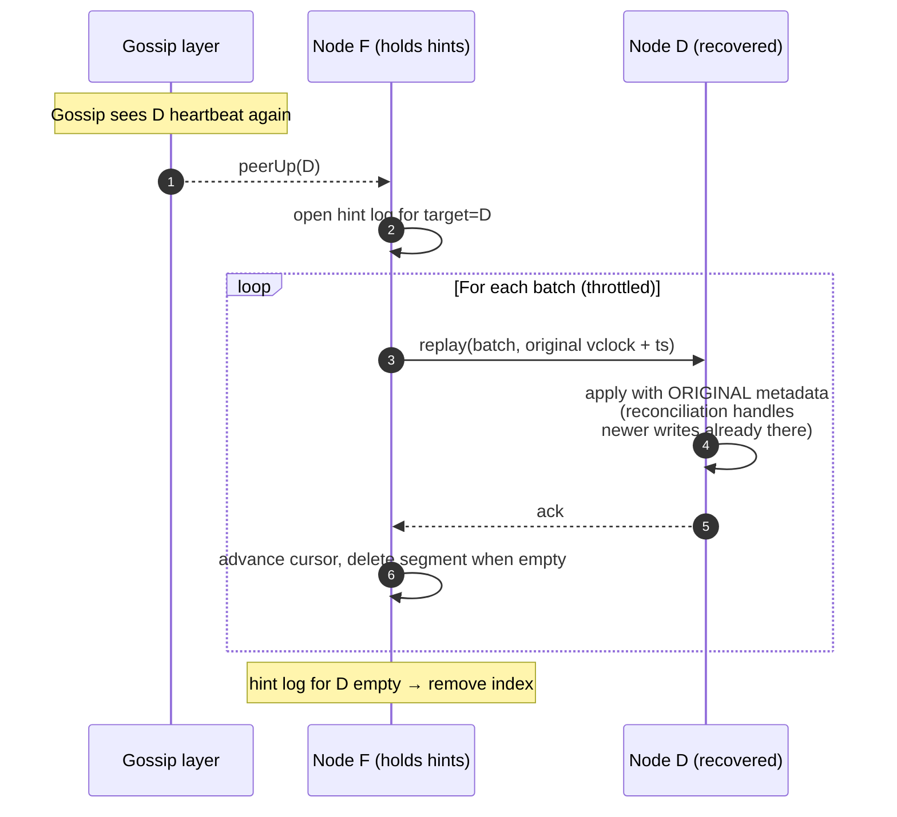
```mermaid
sequenceDiagram
    autonumber
    participant G as Gossip layer
    participant F as Node F (holds hints)
    participant D as Node D (recovered)

    Note over G: Gossip sees D heartbeat again
    G-->>F: peerUp(D)
    F->>F: open hint log for target=D
    loop For each batch (throttled)
        F->>D: replay(batch, original vclock + ts)
        D->>D: apply with ORIGINAL metadata<br/>(reconciliation handles<br/>newer writes already there)
        D-->>F: ack
        F->>F: advance cursor, delete segment when empty
    end
    Note over F: hint log for D empty → remove index
```

Critical details:

1. **Apply with original vclock/timestamp** — causal order is preserved. If D already received a newer write via normal replication, D's merge rule keeps the newer value.
2. **Throttled replay** (Cassandra default ~1 MB/s per node) so we don't DoS a just-recovered node.
3. **Back-pressure** — if D says "slow down," F pauses and retries.
4. **Cursor + segment deletion** bounds hint-log disk usage.

#### Hint lifecycle

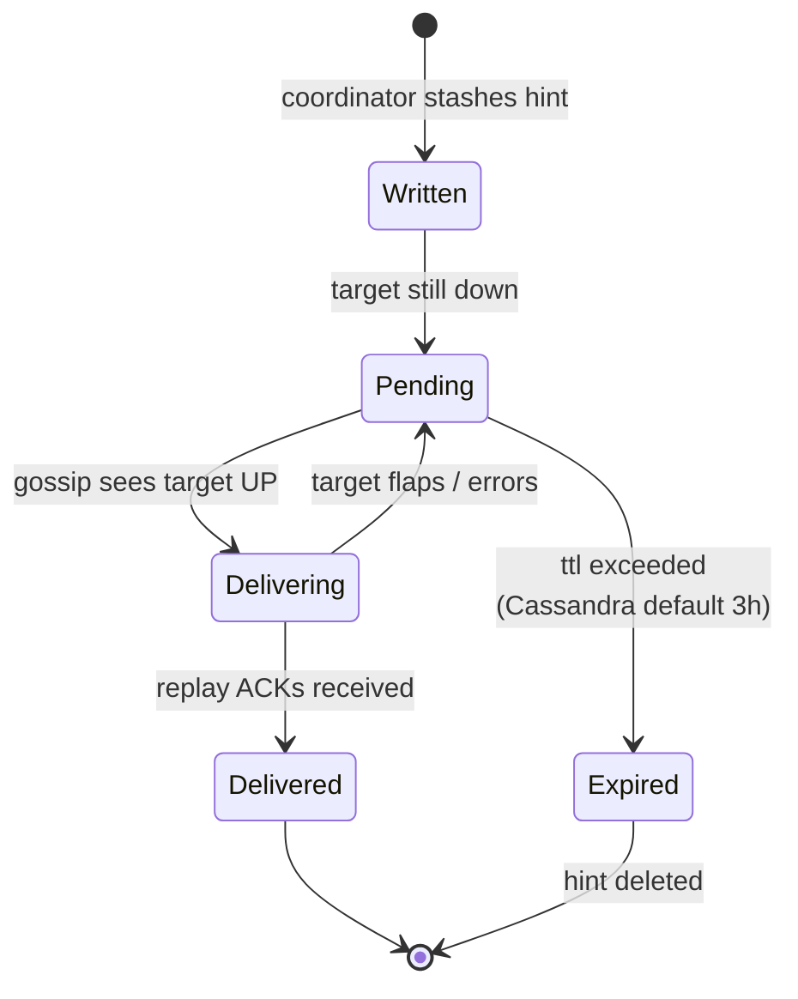
```mermaid
stateDiagram-v2
    [*] --> Written: coordinator stashes hint
    Written --> Pending: target still down
    Pending --> Delivering: gossip sees target UP
    Delivering --> Delivered: replay ACKs received
    Delivered --> [*]
    Pending --> Expired: ttl exceeded<br/>(Cassandra default 3h)
    Delivering --> Pending: target flaps / errors
    Expired --> [*]: hint deleted
```

**What happens if a hint expires?** The hint is dropped, and D never sees that write. At that point the key is under-replicated on D, and **anti-entropy / Merkle-tree repair** (§6.2) is what heals the drift. Hints are a short-term patch; Merkle sync is the permanent cure.

So: **hints ≠ guarantee**. Durability is still the `W` nodes we ack'd at write time (counting the hinted copy on F).

#### Coordinator-local vs sloppy-quorum handoff

| Variant | Where the hint lives | Used by |
|---|---|---|
| **Coordinator-local hints** | Coordinator keeps the hint on *its own* disk, replays directly to target | Cassandra 3.0+ (simpler; survives helper-node death) |
| **Sloppy-quorum handoff** | Hint stored on the next healthy ring node (our diagram above) | Original Dynamo paper |

#### Edge cases

| Case | What happens |
|---|---|
| Coordinator dies before replay | Hints are durable; coordinator resumes replay after restart |
| Target flaps UP/DOWN/UP | Cursor saved; replay pauses and resumes |
| Multiple writes queued for same key | Applied in order at replay; vclocks preserve causality |
| Partition between F and D | F keeps retrying; drains when connectivity returns |
| Hint log fills disk | Per-target/per-node caps → new hints dropped → fall back to strict quorum or error |

#### Tuning knobs (Cassandra-style)

| Knob | Default | Meaning |
|---|---|---|
| `max_hint_window` | 3 h | Stop storing hints for a node down longer than this |
| `hinted_handoff_throttle` | 1 MB/s | Replay throttle per target |
| `max_hints_delivery_threads` | 2 | Parallel replay streams |
| `hints_flush_period` | 10 s | How often in-memory hint buffer is fsync'd |

#### Trade-offs

| Pro | Con |
|---|---|
| Writes stay available during transient failures | TTL-bounded — not a long-term durability mechanism |
| Replicas self-heal without operator action | Replay storms can overload a recovering node (mitigated by throttle) |
| Composes with sloppy quorum for high availability | Under strict quorum, hints don't count toward `W` |
| Preserves causality via original vclock/timestamp | Can't repair permanently lost writes (needs Merkle repair) |

**TL;DR:** hinted handoff + sloppy quorum + anti-entropy is the trio that makes Dynamo/Cassandra's "always writeable" guarantee work in practice.

### 6.2 Anti-entropy with Merkle trees (permanent drift)

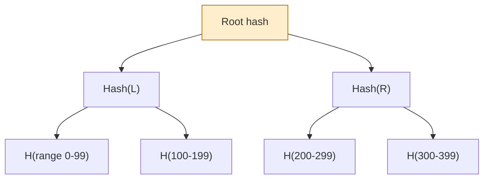
```mermaid
flowchart TB
    R["Root hash"]
    R --> L["Hash(L)"]
    R --> Rt["Hash(R)"]
    L --> H1["H(range 0-99)"]
    L --> H2["H(100-199)"]
    Rt --> H3["H(200-299)"]
    Rt --> H4["H(300-399)"]

    style R fill:#fec,stroke:#a60
```

- Each replica builds a Merkle tree over its keyspace.
- Compare **root hashes** between replicas: equal → already consistent, skip.
- If different, recurse only into the sub-trees whose hashes differ.
- Transfer only the **differing key ranges** → O(log N) discovery cost instead of scanning all data.

### 6.3 Gossip protocol — deep dive

**Core idea.** Gossip (a.k.a. *epidemic protocol*) is how nodes share cluster information *without* a central coordinator. Each node periodically contacts a few **random peers** and exchanges state. Information spreads like a rumor — exponentially, yet no one is in charge.

> Analogy: 100 people at a party. One learns a rumor. Every minute each person who knows it tells 2 random people. After ~7 minutes everyone knows. No megaphone required.

#### Why use it (vs. alternatives)

| Alternative | Problem |
|---|---|
| Central coordinator broadcasts state | SPOF; O(N) load on coordinator |
| All-to-all broadcast every round | O(N²) messages — melts at scale |
| Consensus (Paxos/Raft) for membership | Overkill; too slow for frequent "who is alive?" |
| **Gossip** | O(N·k) msgs/round, converges in O(log N) rounds, no SPOF |

Gossip accepts **eventual consistency of metadata** in exchange for simplicity, resilience, and scalability.

#### What gets gossiped (control plane, not data plane)

- Membership list (who is in the cluster)
- Heartbeats / liveness timestamps
- Node state (`UP / DOWN / JOINING / LEAVING`, load, token ranges, version)
- Schema / config versions

User `put` payloads are **not** gossiped — they go directly to the preference list. Gossip is the cluster *control plane*.

#### One round — push-pull handshake

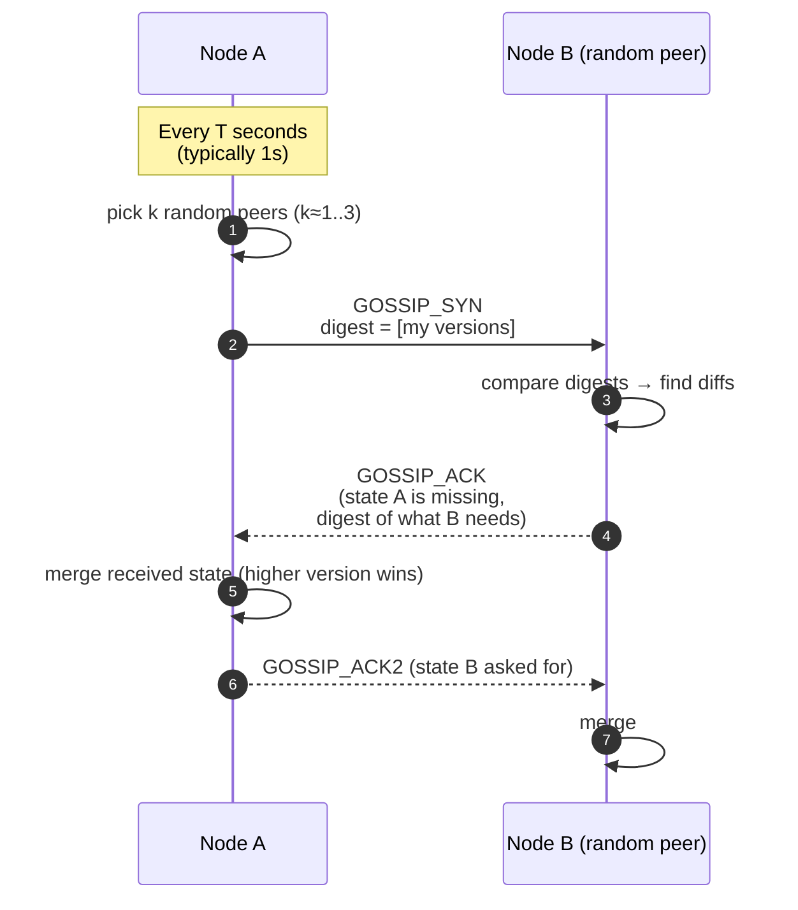
```mermaid
sequenceDiagram
    autonumber
    participant A as Node A
    participant B as Node B (random peer)

    Note over A: Every T seconds<br/>(typically 1s)
    A->>A: pick k random peers (k≈1..3)
    A->>B: GOSSIP_SYN<br/>digest = [my versions]
    B->>B: compare digests → find diffs
    B-->>A: GOSSIP_ACK<br/>(state A is missing,<br/>digest of what B needs)
    A->>A: merge received state (higher version wins)
    A-->>B: GOSSIP_ACK2 (state B asked for)
    B->>B: merge
```

**Digests first, payloads only for the diff** → bandwidth proportional to change, not cluster size.

#### Convergence math

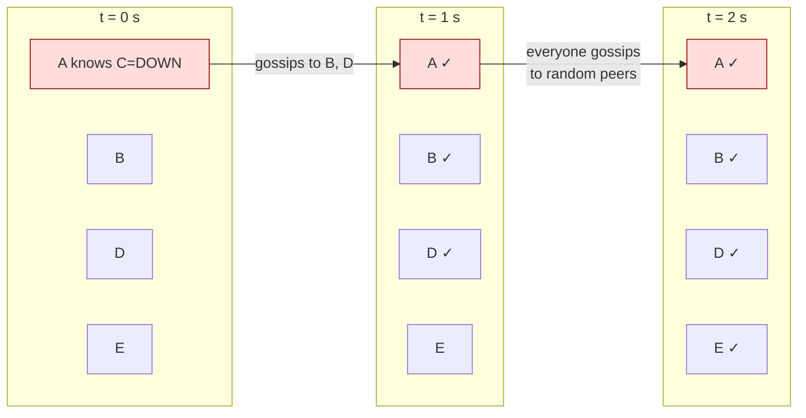
```mermaid
flowchart LR
    subgraph R0["t = 0 s"]
        A0["A knows C=DOWN"]
        B0["B"]
        D0["D"]
        E0["E"]
    end
    subgraph R1["t = 1 s"]
        A1["A ✓"]
        B1["B ✓"]
        D1["D ✓"]
        E1["E"]
    end
    subgraph R2["t = 2 s"]
        A2["A ✓"]
        B2["B ✓"]
        D2["D ✓"]
        E2["E ✓"]
    end
    A0 -- "gossips to B, D" --> A1
    A1 -- "everyone gossips<br/>to random peers" --> A2

    style A0 fill:#fdd,stroke:#900
    style A1 fill:#fdd,stroke:#900
    style A2 fill:#fdd,stroke:#900
```

With fan-out `k=3`, a 1,000-node cluster converges in ≈ `log₃(1000) ≈ 7` rounds (~7 seconds at T=1s). **Time-to-convergence grows *logarithmically* with cluster size** — the killer property.

#### Failure detection — heartbeat counter + phi-accrual

Every node keeps a view like:

```
view = {
  A: { heartbeat: 1_712_000_100, generation: 7, status: UP },
  B: { heartbeat: 1_712_000_101, generation: 7, status: UP },
  C: { heartbeat: 1_711_999_050, generation: 7, status: ? },  // stale!
  ...
}
```

- Each node **bumps its own heartbeat counter** every gossip round. Peers see it advance via merging.
- If `now - heartbeat(C) > threshold` → locally mark C `DOWN`.
- **Phi-accrual detector** (Cassandra): instead of a hard timeout, compute suspicion `φ = -log10(P(heartbeat arrives after this long))`. Fires at `φ ≥ 8` — adapts to network jitter and avoids false positives during latency spikes.

Each field is **owned by exactly one node** (C owns its own heartbeat) → during merge, the higher version always wins → no real conflict, this is effectively an **LWW-Register CRDT** per field.

#### SWIM — the modern production gossip

Used by Consul, HashiCorp Serf, AWS S3, Uber Ringpop.

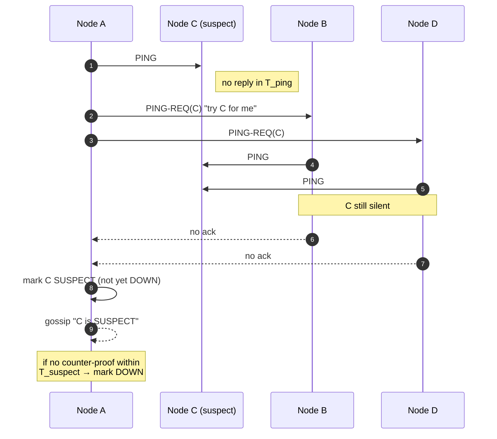
```mermaid
sequenceDiagram
    autonumber
    participant A as Node A
    participant C as Node C (suspect)
    participant B as Node B
    participant D as Node D

    A->>C: PING
    Note right of C: no reply in T_ping
    A->>B: PING-REQ(C) "try C for me"
    A->>D: PING-REQ(C)
    B->>C: PING
    D->>C: PING
    Note over B,D: C still silent
    B-->>A: no ack
    D-->>A: no ack
    A->>A: mark C SUSPECT (not yet DOWN)
    A-->>A: gossip "C is SUSPECT"
    Note over A: if no counter-proof within<br/>T_suspect → mark DOWN
```

Key SWIM ideas:
1. **Indirect probing** (`PING-REQ`) rules out false positives from an A↔C link issue.
2. **Suspect → Confirm** state avoids flapping.
3. **Membership updates piggyback** on every ping/ack → near-zero extra bandwidth.
4. **Failure-detection time is O(1)** (direct ping round-trip), independent of cluster size.

#### Gossip variants

| Variant | How | Pros / cons |
|---|---|---|
| **Push** | "Here's everything I know" | Simple; wastes bandwidth when idle |
| **Pull** | "Tell me what's new" | Good when updates rare |
| **Push-pull** | 3-way digest handshake | Cassandra default; bandwidth ≈ diffs |
| **Anti-entropy** | Full reconciliation (Merkle-tree) | Periodic repair of long-term drift |
| **Rumor-mongering** | Stop gossiping an item after a few rounds | Saves bandwidth; risk of missing slow nodes |

#### Where it's used in real systems

| System | Gossip used for |
|---|---|
| **Cassandra** | Membership, schema, load, token ranges, endpoint state |
| **DynamoDB / Dynamo** | Ring membership, preference lists |
| **Consul / Serf** | SWIM for health + membership across DCs |
| **Redis Cluster** | Cluster bus: node IPs, slots, failure reports |
| **Riak** | Ring state, claimant elections |
| **CockroachDB** | Node liveness, range-leaseholder hints, cluster settings |

#### Trade-offs

| Pro | Con |
|---|---|
| Decentralized, no SPOF | Only *eventual* metadata consistency |
| O(log N) convergence | Convergence is probabilistic, not tightly bounded |
| O(k) messages per node per round | Stale views possible for seconds in big clusters |
| Graceful under partial failures | Bad for anything requiring strict agreement (use Raft/Paxos) |
| Bandwidth independent of cluster size | Harder to debug ("why does F think E is down?") |

**One-liner:** *gossip = every node periodically tells a couple of random peers everything interesting it knows, and listens back.* From that one rule you get scalable membership, failure detection, and metadata propagation — no leader, no broadcast, no SPOF.

---

## 7. Leader Election

Most Dynamo-style stores are **leaderless** (any replica can coordinate). But a KV store still needs a leader for **cluster-wide coordination**: ring-membership changes, schema changes, assigning token ranges, running repairs, electing a "seed" node on boot. Strongly consistent KV stores (etcd, ZooKeeper, Spanner) go further: **every write goes through the leader**.

### 7.1 When do we need a leader?

| Scenario | Leader needed? | Algorithm |
|---|---|---|
| Dynamo-style (AP, leaderless writes) | Only for coordination tasks | Gossip + Bully / Paxos lease |
| Single-master replication (MySQL) | Yes, for all writes | ZooKeeper / Raft |
| Strong-consistency KV (etcd, Consul) | Yes, for every write | **Raft** |
| Spanner / CockroachDB per-range | Per-shard leader | Paxos / Raft |

### 7.2 Raft leader election (the standard answer in interviews)

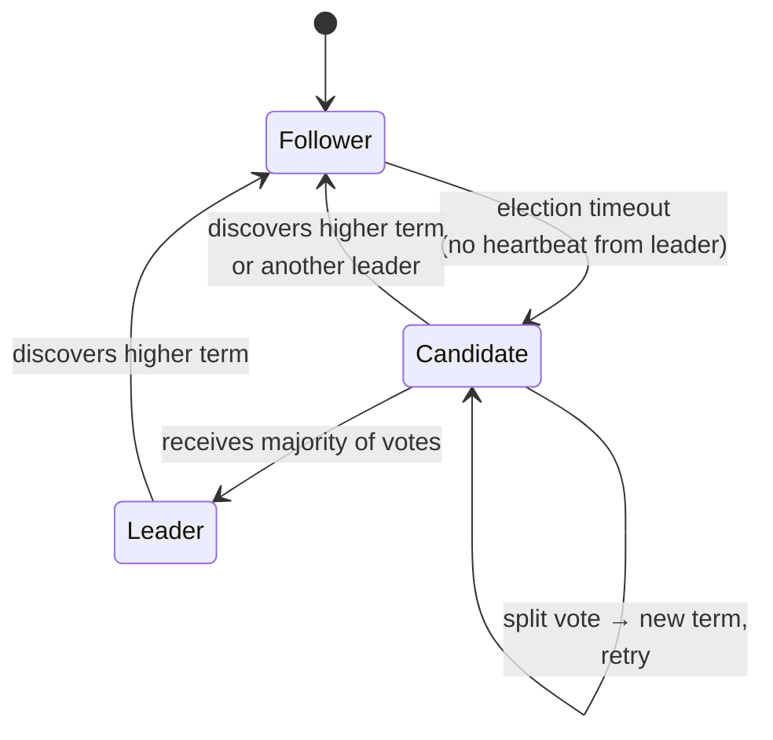
```mermaid
stateDiagram-v2
    [*] --> Follower
    Follower --> Candidate: election timeout<br/>(no heartbeat from leader)
    Candidate --> Candidate: split vote → new term,<br/>retry
    Candidate --> Leader: receives majority of votes
    Candidate --> Follower: discovers higher term<br/>or another leader
    Leader --> Follower: discovers higher term
```

**Steps (in bullets):**

1. Every node starts as a **Follower** with a random election timeout (150–300 ms).
2. If no heartbeat (AppendEntries) from a leader arrives before the timeout, the follower becomes a **Candidate**, increments its `currentTerm`, votes for itself, and sends `RequestVote` RPCs to all peers.
3. Each peer grants the vote **at most once per term**, and only if the candidate's log is **at least as up-to-date** as its own (log-completeness check).
4. A candidate that receives **a majority of votes** (N/2 + 1) becomes the **Leader** for that term.
5. The new leader immediately sends periodic **heartbeats** (empty AppendEntries) to suppress new elections.
6. If votes split, no one wins → timers expire, a new term starts with fresh random timeouts. Randomization breaks the tie with high probability.
7. If a candidate or leader learns of a **higher term** (from any RPC), it steps down to Follower.
8. All client writes now go through the leader → the leader appends to its log, replicates to a majority, then commits.

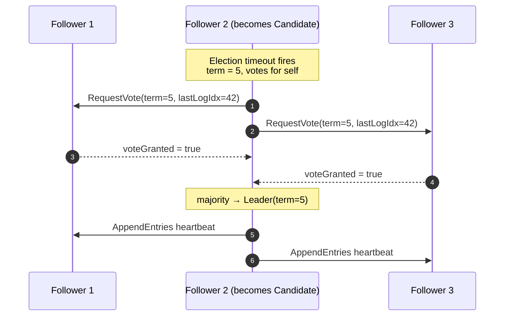
```mermaid
sequenceDiagram
    autonumber
    participant F1 as Follower 1
    participant F2 as Follower 2 (becomes Candidate)
    participant F3 as Follower 3

    Note over F2: Election timeout fires<br/>term = 5, votes for self
    F2->>F1: RequestVote(term=5, lastLogIdx=42)
    F2->>F3: RequestVote(term=5, lastLogIdx=42)
    F1-->>F2: voteGranted = true
    F3-->>F2: voteGranted = true
    Note over F2: majority → Leader(term=5)
    F2->>F1: AppendEntries heartbeat
    F2->>F3: AppendEntries heartbeat
```

### 7.3 Other leader-election approaches (for contrast)

- **Bully algorithm** — highest node ID wins; simple, used in small clusters; O(N²) messages worst case.
- **ZooKeeper / Chubby ephemeral znodes** — everyone creates an `ephemeral_sequential` node; the one with the **lowest sequence** is leader; others watch the next-lowest znode. Used by HBase, Kafka (pre-KRaft), older Cassandra tools.
- **Paxos lease** — a node acquires a time-bounded lease via Paxos; must renew before expiry. Used in Spanner, Chubby.
- **Etcd/Consul session + lock** — app takes a distributed lock with a TTL; losing the session releases the lock automatically.

### 7.4 Split-brain prevention

- Always require **strict majority** (`N/2 + 1`) — impossible to have two majorities.
- Use **fencing tokens** / monotonically-increasing epochs — stale leader's writes are rejected by storage.
- Run an **odd** number of voters (3, 5, 7) to make majority unambiguous.
- Use **lease timeouts** so a partitioned leader self-demotes.

---

## 8. Other HLD Patterns in a KV Store

This section is a quick cross-reference of the reusable distributed-systems patterns the KV store is built from.

### 8.1 Consistent Hashing + Virtual Nodes

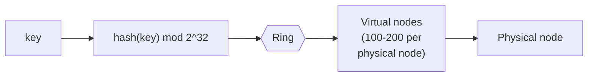
```mermaid
flowchart LR
    K["key"] --> H["hash(key) mod 2^32"]
    H --> R{{"Ring"}}
    R --> VN["Virtual nodes<br/>(100-200 per<br/>physical node)"]
    VN --> PN["Physical node"]
```

- Solves: **data placement + minimal reshuffle** when nodes join/leave.
- Virtual nodes spread load evenly and let heterogeneous hardware carry more weight.

### 8.2 Quorum Consensus (N, W, R)

- Solves: **tunable consistency** without full consensus overhead.
- Rule of thumb: `W + R > N` ⇒ at least one replica in every read intersects every write → strong consistency.

### 8.3 Replication (master-less multi-leader)

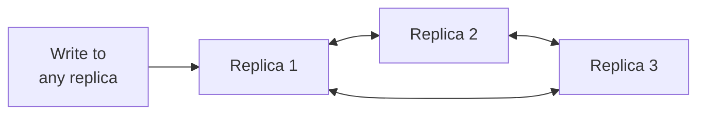
```mermaid
flowchart LR
    W["Write to<br/>any replica"] --> R1["Replica 1"]
    R1 <--> R2["Replica 2"]
    R2 <--> R3["Replica 3"]
    R1 <--> R3
```

- Solves: **availability and geo-locality**. All nodes accept writes; reconcile asynchronously.

### 8.4 Write-Ahead Log (WAL)

- Solves: **crash durability** — once the WAL `fsync`s, we can acknowledge the client.
- Same pattern in Postgres, MySQL, Kafka, HDFS NameNode.

### 8.5 LSM-Tree + Compaction

- Solves: **write-heavy workloads on block storage**.
- Compaction strategies: size-tiered (Cassandra default), leveled (RocksDB, LevelDB).

### 8.6 Bloom Filter

- Solves: **"definitely-not-present" lookups** to avoid disk I/O.
- Space: ~10 bits/key for ~1% false-positive rate. No false negatives.

### 8.7 Merkle Tree (Anti-Entropy)

- Solves: **efficient divergence detection** between replicas over huge datasets.
- Same pattern in Git, BitTorrent, Dynamo, Cassandra, blockchains.

### 8.8 Vector Clock / Version Vector

- Solves: **causality tracking** across distributed writes — distinguishes "newer" from "concurrent".

### 8.9 Gossip Protocol (SWIM / Phi-accrual)

- Solves: **decentralized failure detection and membership** in O(log N) rounds.

### 8.10 Hinted Handoff + Read Repair

- Solves: **short-term + long-term drift** between replicas.
- Hinted handoff: write-time. Read repair: read-time. Anti-entropy: background.

### 8.11 Leader Election (Raft / Paxos / ZAB)

- Solves: **one-writer guarantee** for coordination tasks, schema changes, and strongly-consistent shards.

### 8.12 Sloppy Quorum + Hinted Handoff

- Solves: **availability during partitions** — accept writes on *any* N reachable nodes, not just the preference list; hand off later. Used by Dynamo.

### 8.13 CAP Trade-off

```mermaid
flowchart LR
    C["Consistency"] --- P["Partition tolerance"]
    A["Availability"] --- P
    C -. "CP:<br/>etcd, ZooKeeper,<br/>HBase, Spanner" .- P
    A -. "AP:<br/>DynamoDB, Cassandra,<br/>Riak" .- P
```

- During a network partition you must choose **C** (reject writes) or **A** (accept, reconcile later). A good KV store makes this choice **per operation / per key** via tunable N/W/R.

### 8.14 Back-pressure & Load Shedding

- Coordinator tracks per-replica latency; if a replica slows down, read requests are sent to a different replica (dynamic snitching).
- Under overload, shed non-critical reads and prefer leader/replica local reads.

---

## 9. Key Points for Interview

1. **Consistent hashing + virtual nodes** for data distribution.
2. **Tunable consistency** with `N, W, R` (W+R > N ⇒ strong).
3. **LSM-Tree + WAL** as the on-disk storage engine; **Bloom filter** for fast negative lookups.
4. **Vector clocks / LWW / CRDTs** for conflict resolution.
5. **Hinted handoff** for transient failures, **Merkle-tree anti-entropy** for long-term drift.
6. **Gossip protocol** for membership and failure detection.
7. **Raft (or Paxos)** for leader election whenever a single coordinator is required — always require a **strict majority** and **fencing tokens** to avoid split-brain.
8. Know the **CAP / PACELC** trade-off and which side your design lives on (Dynamo = AP, etcd = CP).
