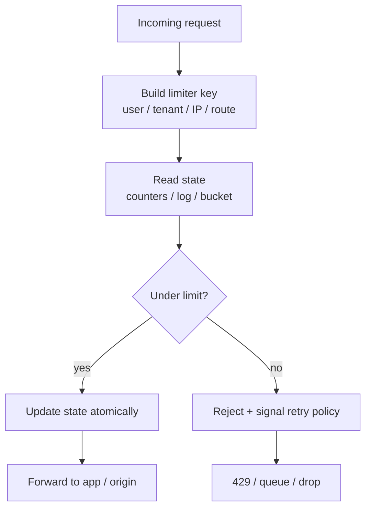
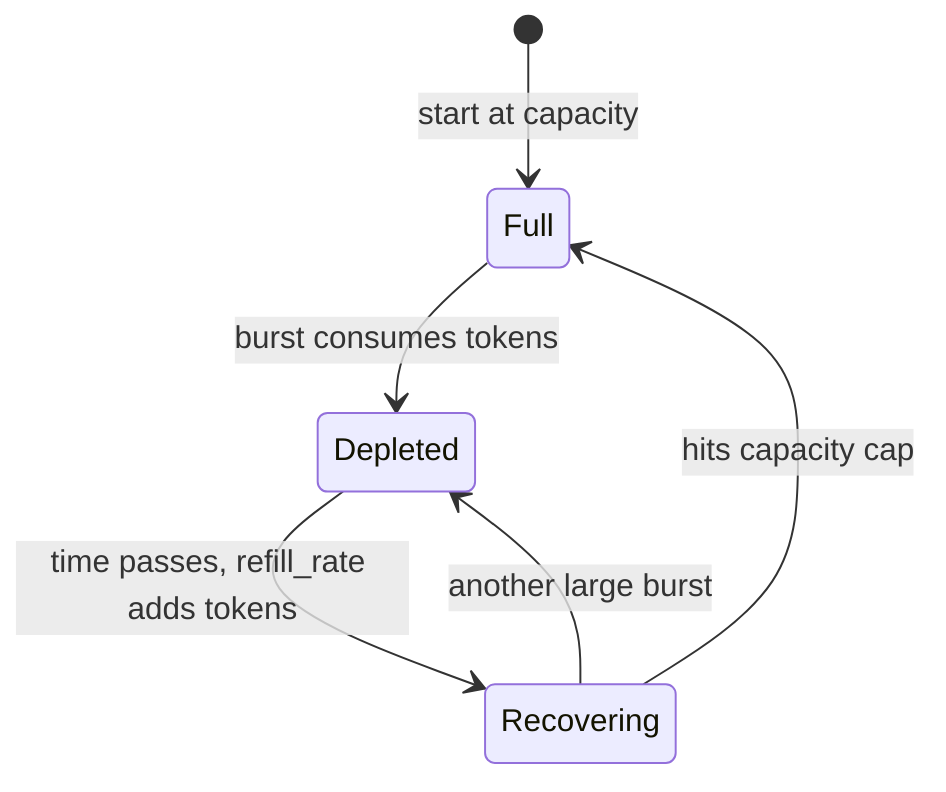
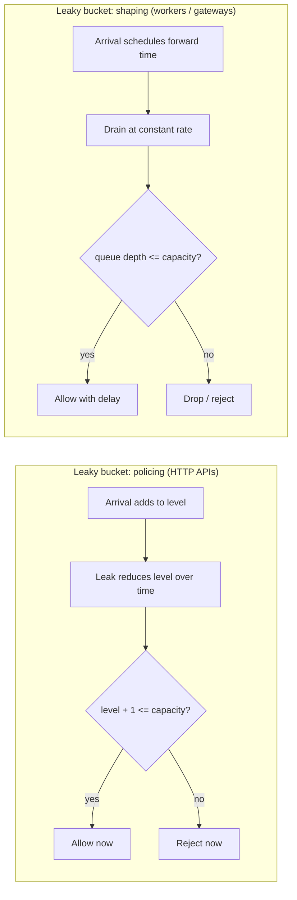
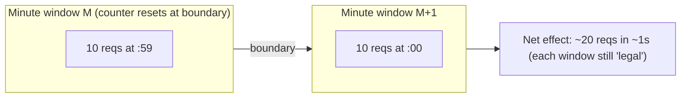
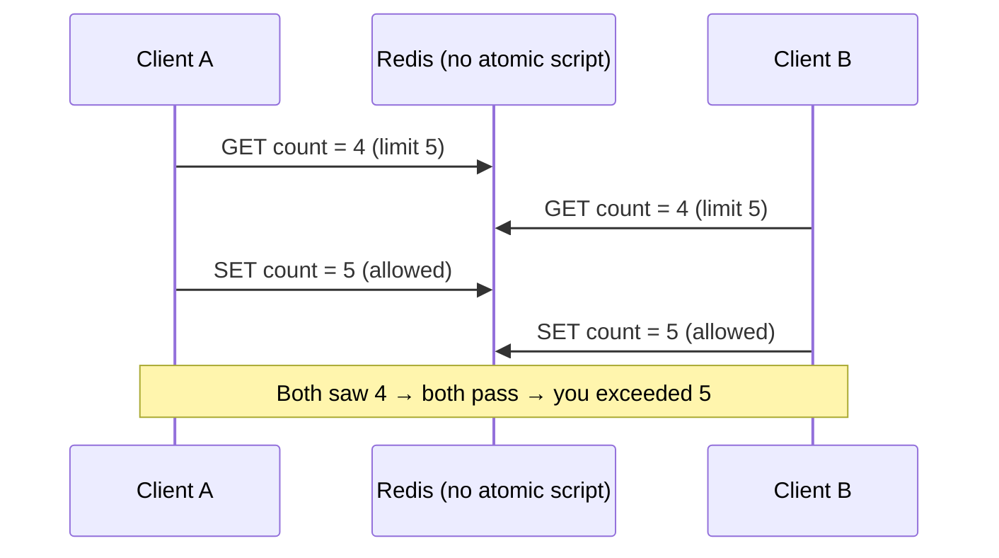

# Rate Limiting Algorithms

> **Difficulty:** Easy–Medium | **Interview frequency:** Very high  
> **Canonical design:** [Design Rate Limiter](../04-DesignEasy/03-RateLimiter.md)

This note explains the algorithms you actually implement behind a rate limiter, when to pick each one, how they behave under bursts, and what breaks when you scale out. It is intentionally **implementation-shaped** (Redis/Lua, keys, atomicity), not just definitions.

---

## Contents

- [1. Why interviewers (and production) care](#1-why-interviewers-and-production-care)
- [2. What you are limiting (dimensions)](#2-what-you-are-limiting-dimensions)
- [3. Algorithm zoo (deep dive + examples)](#3-algorithm-zoo-deep-dive--examples)
  - [3.1 Token bucket](#31-token-bucket)
  - [3.2 Leaky bucket](#32-leaky-bucket)
  - [3.3 Fixed window counter](#33-fixed-window-counter)
  - [3.4 Sliding window log](#34-sliding-window-log)
  - [3.5 Sliding window counter (hybrid)](#35-sliding-window-counter-hybrid)
- [4. Master comparison (accuracy, memory, bursts)](#4-master-comparison-accuracy-memory-bursts)
- [5. HTTP / client contract (429, Retry-After, RateLimit headers)](#5-http--client-contract-429-retry-after-ratelimit-headers)
- [6. Distributed rate limiting (what works in the real world)](#6-distributed-rate-limiting-what-works-in-the-real-world)
- [7. Failure modes and sharp edges](#7-failure-modes-and-sharp-edges)
- [8. Interview prompts (expanded)](#8-interview-prompts-expanded)
- [9. Further reading](#9-further-reading)

---

## 1. Why interviewers (and production) care

Public APIs and multi-tenant platforms need:

- **Fair usage:** one tenant cannot crowd out others.
- **Abuse control:** credential stuffing, scraping, accidental infinite loops.
- **Backpressure:** protect databases, payment providers, and human-review queues.

Interviewers rarely ask you to recite definitions. They want:

- **Pick an algorithm** that matches **burst tolerance vs smoothing**, **memory vs accuracy**, and **distributed correctness** (often **approximate is fine**).
- **Explain boundary behavior** (fixed windows) and **hot keys** (Redis).
- **Describe atomicity**: why naive `INCR` races lose limits, and why **Lua / single-owner execution** is the common fix in Redis.



---

## 2. What you are limiting (dimensions)

Before choosing an algorithm, be explicit about the **key** and the **window**.

| Dimension | Examples | Why it matters |
|---|---|---|
| **Identity** | `user_id`, `api_key`, `tenant_id` | Fairness vs privacy (IP can harm NAT/campus Wi‑Fi). |
| **Scope** | per route, per service, global | A user might be fine overall but abusive on `/search`. |
| **Action cost** | uniform “1 request”, weighted units | `POST /export` should cost more than `GET /health`. |
| **Sync decision** | allow/deny now | Most HTTP APIs; shaping delays are harder to expose. |
| **Clock** | app time vs Redis time | Affects token refill math; keep consistent and testable. |

---

## 3. Algorithm zoo (deep dive + examples)

### 3.1 Token bucket

**Idea:** a bucket holds up to `capacity` tokens. Tokens refill continuously at `refill_rate` (tokens per second). Each approved request consumes **one** token. If tokens \< 1, reject (or wait, if you intentionally add queueing client-side).

**State (typical):** `tokens`, `last_refill_ts` (often stored in a Redis **HASH**).

**Update sketch:**

```text
elapsed = now - last_refill_ts
tokens = min(capacity, tokens + elapsed * refill_rate)

if tokens >= 1:
  tokens -= 1
  ALLOW
else:
  REJECT
```



#### Worked example (numbers)

- **Capacity** = 10 tokens  
- **Refill** = 1 token / sec  
- **t=0:** bucket starts full → you can approve **10** requests immediately (controlled burst).  
- **t=0+:** tokens hit ~0 → you approve ~**1 req/sec** on average.  
- A mobile app “launch spike” can batch calls **as long as** the short burst fits the bucket.

#### Pros / cons

| Pros | Cons |
|---|---|
| Controlled **bursts** (good UX for legit clients) | Needs careful time math (floats, monotonic clocks) |
| Smooth **long-run average** rate | Per-key state; distributed systems need shared store or sticky routing |

**Common placements:** edge proxies, API gateways, “average QPS + burst” product limits.

---

### 3.2 Leaky bucket

**Idea:** traffic “fills” a bucket and “leaks” at a fixed rate. Classic implementations split into two practical modes:

1. **Policing (meter):** compute virtual fill level; if a new request would overflow capacity, **reject immediately** (HTTP-friendly).
2. **Shaping (queue):** accept into a FIFO and **forward at fixed rate** (adds delay; great for workers/outbound client pacing).



#### Worked example (policing)

- **Capacity** = 5 (max simultaneous “water level”)  
- **Leak rate** = 1 / sec  
- A burst of 5 quick requests can be accepted if the level stays within capacity; sustained arrivals faster than the leak rate **clamp** acceptance to roughly the leak rate over time.

#### Token bucket vs leaky bucket (one sentence)

- **Token bucket:** “You may spend saved credits in a burst.”  
- **Leaky bucket:** “Downstream sees (approximately) a smoothed rate; bursts are not a product feature.”

---

### 3.3 Fixed window counter

**Idea:** for each window id `W = floor(now / window_seconds)`, keep `count(W)`. If `count > limit`, reject.

This is the easiest Redis pattern (`INCR` + `EXPIRE`), but it has a famous flaw.

#### Boundary spike (the classic interview trap)

Assume **limit = 10 / minute**.

```text
Window A:  |.................|  (minute 1)
Window B:                   |.................|  (minute 2)

Client sends 10 reqs at 12:00:59
Client sends 10 reqs at 12:01:00

Each window is "legal", but the client sent 20 requests in ~1 second.
```



#### Pros / cons

| Pros | Cons |
|---|---|
| Minimal memory, very fast | **2× burst** across boundary (coarse fairness) |

**Good enough when:** coarse protection matters more than tight fairness (some login throttles, internal admin tools).

---

### 3.4 Sliding window log

**Idea:** store timestamps of accepted requests in the last `T` seconds. On each attempt:

1. delete timestamps older than `now - T`
2. if remaining count \< limit → insert `now` and allow
3. else reject (optionally compute a precise retry time from the oldest entry)

**Data structure (Redis):** **sorted set** keyed by time (score), unique member per event.

#### Worked example

- **Limit** = 3 requests / 10 seconds  
- Requests at t = 0, 2, 4 → log size 3 → full  
- At t = 5, a new request arrives: prune \<= t-10 (none yet), still 3 entries → **reject**  
- At t = 10.1: entry at 0 is older than 10s → prune → 2 entries → **allow** and insert 10.1

#### Pros / cons

| Pros | Cons |
|---|---|
| **Exact** rolling window (no boundary doubling) | Memory **O(n)** in requests per key (expensive at high RPS × many keys) |

**Best when:** strict fairness for **low-ish** cardinality/volume, audits, high-value endpoints.

---

### 3.5 Sliding window counter (hybrid)

**Idea:** keep **two fixed-window counters**: previous window `prev` and current window `curr`. Let `p ∈ [0,1]` be progress through the current window (0 at start, 1 at end). Estimate:

```text
estimate = prev * (1 - p) + curr
allow if estimate < limit (then increment curr)
```

Intuition: early in the new window, the previous window still “counts partially,” which **smooths** the boundary spike without storing every timestamp.

#### Worked example (smooth the spike)

- **Limit** = 10 / minute, **prev** minute had **10** requests, **curr** minute so far has **0**  
- You are **6s** into a 60s window → `p = 6/60 = 0.1`  
- `estimate = 10*(1-0.1) + 0 = 9` → still under 10 → **allow**  
This is exactly the behavior you want: you do not instantly grant a fresh “10” just because the clock crossed a minute boundary.

#### Pros / cons

| Pros | Cons |
|---|---|
| Low memory (two counters / two keys) | **Approximate** (tiny error vs exact log; usually acceptable) |

**Redis Cluster note:** the two keys must be in the same hash slot; the standard fix is a **hash tag** on the user portion of the key (only the substring inside `{...}` participates in slot hashing).

---

## 4. Master comparison (accuracy, memory, bursts)

This table is aligned with how Redis documents production trade-offs (STRING vs ZSET vs HASH, burst behavior, and “best for”). See Redis’s guide: [Build 5 Rate Limiters with Redis](https://redis.io/learn/howtos/ratelimiting).

| Algorithm | Typical Redis shape | Memory / key | Accuracy | Burst behavior | Best for |
|---|---|---:|---|---|---|
| Fixed window | STRING + Lua (`INCR`, `EXPIRE`) | ~1 key | approximate | **2× at edges** | simplest limits, login throttle (coarse) |
| Sliding window log | ZSET + Lua (`ZREMRANGEBYSCORE`, `ZCARD`) | **O(n)** entries | exact | no boundary doubling | strict fairness, audits, lower volume |
| Sliding window counter | STRING×2 + Lua | ~2 keys | near-exact | smoothed | **default** for many HTTP APIs |
| Token bucket | HASH + Lua (`tokens`, `last_refill`) | ~1 key | exact (given clock model) | **controlled bursts** | mobile launches, “avg + burst” products |
| Leaky bucket | HASH + Lua | ~1 key | exact (given mode) | **no burst** (policing/shaping) | protect fragile downstreams, pacing workers |

**Practical selection heuristic (good interview answer):**

- Start from **sliding window counter** unless you have a strong reason otherwise.
- Switch to **token bucket** if bursts are a **product requirement**.
- Switch to **leaky bucket** if downstream **cannot tolerate bursts** even briefly.
- Use **sliding window log** only when **exactness** is worth the memory.
- Use **fixed window** when you truly want the simplest thing and can accept edge doubling (or you layer another guard).

---

## 5. HTTP / client contract (429, Retry-After, RateLimit headers)

Rate limiting is not only “allow/deny”; it is also **how clients backoff**.

Common patterns:

- **`429 Too Many Requests`** for synchronous rejections (some systems use `403` or `503`; be consistent and documented).
- **`Retry-After`:** seconds (or HTTP-date) until retry is sensible ([MDN: Retry-After](https://developer.mozilla.org/en-US/docs/Web/HTTP/Headers/Retry-After)).
- **Quota visibility:** many gateways expose `X-RateLimit-Limit`, `X-RateLimit-Remaining`, `X-RateLimit-Reset` (ecosystem convention; not one universal RFC for the `X-` triplet).

Standardization effort (as of 2026, still an **Internet-Draft**, not a finalized RFC): **RateLimit** header fields for HTTP, which aim to standardize policy/remaining semantics for interoperability. See IETF datatracker: [draft-ietf-httpapi-ratelimit-headers](https://datatracker.ietf.org/doc/html/draft-ietf-httpapi-ratelimit-headers).

**Interview talking point:** returning **`429` + `Retry-After`** reduces retry storms; without it, clients often exponential-backoff blindly and still hammer you.

---

## 6. Distributed rate limiting (what works in the real world)

### 6.1 Why `INCR` alone is not enough

The classic bug pattern is **read-decide-write** across multiple commands/processes:



Redis mitigations (common production order):

1. **Lua script (`EVAL`)** for read/modify/write in one atomic step on the server ([Redis ratelimiting guide rationale](https://redis.io/learn/howtos/ratelimiting)).
2. Care with **Cluster**: multi-key scripts must be **same hash slot** (hash tags).
3. Keep scripts **short** (no `KEYS`, no heavy work) to avoid blocking the Redis event loop.

Demo implementations (official tutorial repo): [`redis-developer/redis-ratelimiting-js`](https://github.com/redis-developer/redis-ratelimiting-js).

### 6.2 Deployment patterns

- **Sticky routing:** same user → same edge node → local bucket. Simple, but uneven under hot keys / uneven routing.
- **Central Redis / Redis Cluster:** global enforcement; watch **hot keys** and shard carefully.
- **Hierarchical limits:** per-user cap + per-tenant cap + global safety valve (prevents one key from consuming all Redis CPU).

### 6.3 “Global exact fairness”

Exact global fairness under partition/replication is **hard**; many products choose **approximate** global limits + **strong** protection on the expensive operations (writes, payments) with tighter per-user controls.

### 6.4 Idempotency (do not confuse with rate limiting)

A rate limiter is not a correctness tool for duplicates. For writes, combine limits with **idempotency keys** / dedupe stores where needed.

---

## 7. Failure modes and sharp edges

| Symptom | Likely cause | Mitigation |
|---|---|---|
| Limits “randomly” too strict/loose across regions | clock skew / using wrong clock source | NTP discipline; consistent `now` strategy; avoid mixing client time |
| Redis CPU spikes | huge ZSET per key, Lua doing too much | prefer sliding counter/token bucket; cap cardinality; shard hot tenants |
| Thundering herd on reject | many clients retry instantly | jittered backoff; `Retry-After`; token buckets on clients |
| “Double spend” under concurrency | non-atomic check/increment | Lua / atomic single-op design |
| Fail-open vs fail-closed debate | Redis down | product choice: degrade safely vs hard stop (each has cost) |

---

## 8. Interview prompts (expanded)

1. **Token bucket vs leaky bucket?**  
   Token bucket **permits bursts** (credits). Leaky bucket **smoothes** arrivals (policing rejects; shaping delays). Pick based on whether bursts are acceptable to downstream and UX.

2. **Why not fixed window for a paid API?**  
   Boundary doubling can let clients exceed intended steady QPS without “cheating” in any single window. Sliding log/counter fixes this at different cost points.

3. **How to implement sliding window log in Redis?**  
   ZSET timestamps; prune by score; `ZCARD`; conditional `ZADD`; Lua for atomicity; unique member per event (`ts:rand`) to avoid collisions.

4. **How to do this globally?**  
   Prefer **partitioned counters** + **approximation** where needed; avoid a single global choke unless necessary; mitigate hot keys.

5. **What breaks at scale?**  
   Hot keys, Lua/event-loop blocking, cluster slot constraints, retry storms, clock skew, and failover behavior (limiter state vs origin state).

---

## 9. Further reading

- **Redis (official):** [Build 5 Rate Limiters with Redis: Algorithm Comparison Guide](https://redis.io/learn/howtos/ratelimiting) — includes Lua atomicity rationale, cluster hash tags for dual-key sliding counter, and implementation-level trade-offs.  
- **Reference implementations:** [`redis-developer/redis-ratelimiting-js`](https://github.com/redis-developer/redis-ratelimiting-js)  
- **HTTP semantics:** [MDN `Retry-After`](https://developer.mozilla.org/en-US/docs/Web/HTTP/Headers/Retry-After)  
- **Standardization (draft):** [IETF `draft-ietf-httpapi-ratelimit-headers`](https://datatracker.ietf.org/doc/html/draft-ietf-httpapi-ratelimit-headers)  
- **Course tie-in:** [Design Rate Limiter](../04-DesignEasy/03-RateLimiter.md)
