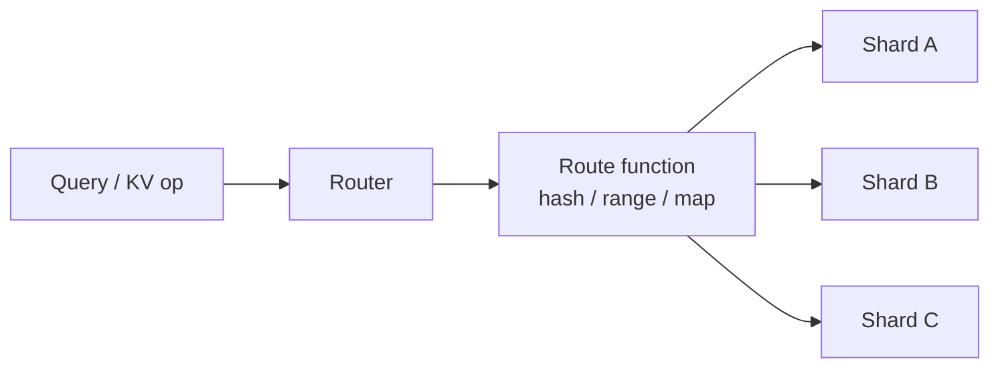
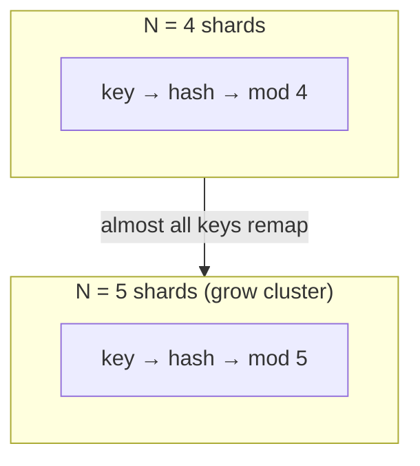
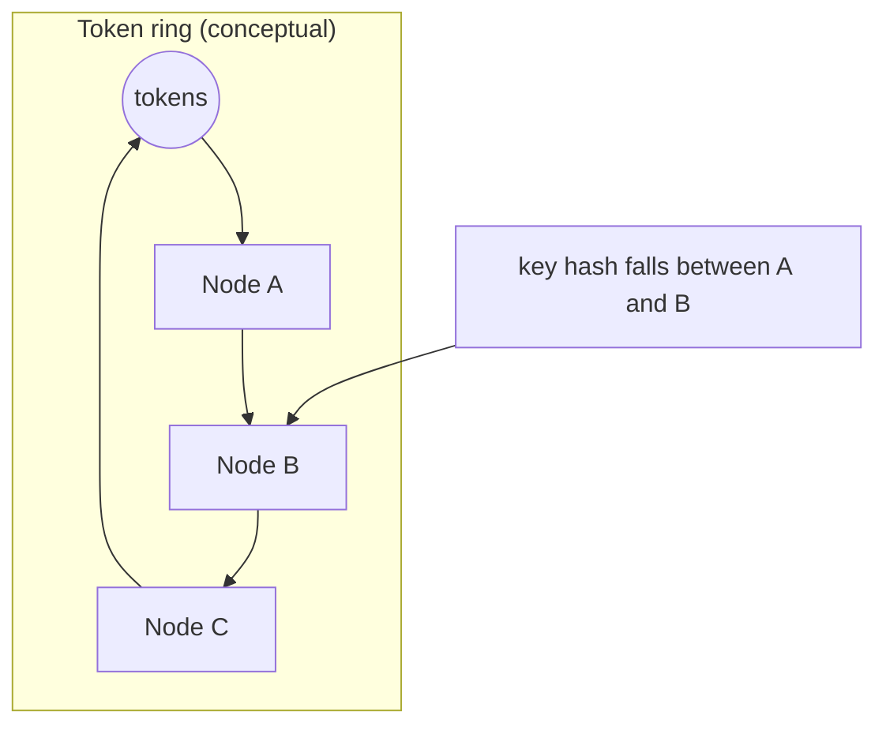
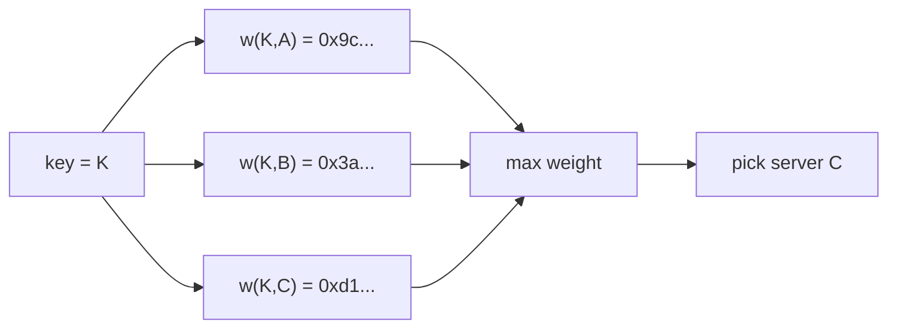
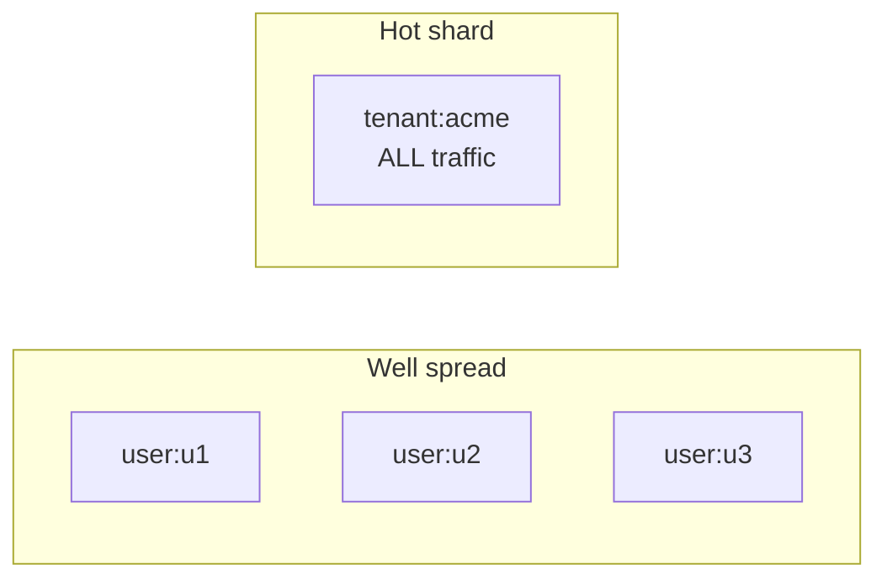
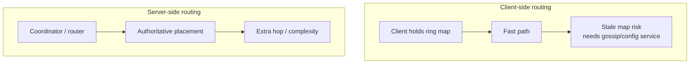

# Hashing & Partitioning Algorithms

> **Difficulty:** Medium | **Interview frequency:** Very high  
> **Deep dive:** [Consistent Hashing](../02-BuildingBlocks/03-ConsistentHashing.md)

Partitioning answers: **which machine owns this key?** Hashing is the usual routing function, but **not all hashes behave the same** when the cluster size changes. This note separates **routing math** (modulo vs ring vs HRW vs jump hash) from **data modeling** (shard keys, hot partitions, scatter‑gather), because interviews mix them on purpose.

---

## Contents

- [1. Vocabulary (shard key vs partition vs replica)](#1-vocabulary-shard-key-vs-partition-vs-replica)
- [2. Plain modulo sharding](#2-plain-modulo-sharding)
- [3. Consistent hashing + virtual nodes](#3-consistent-hashing--virtual-nodes)
- [4. Rendezvous hashing (HRW)](#4-rendezvous-hashing-hrw)
- [5. Jump consistent hashing](#5-jump-consistent-hashing)
- [6. Sharding strategies (range, hash, directory)](#6-sharding-strategies-range-hash-directory)
- [7. Hot keys & hot partitions (almost always asked)](#7-hot-keys--hot-partitions-almost-always-asked)
- [8. Client vs server-side routing](#8-client-vs-server-side-routing)
- [9. Interview prompts (expanded)](#9-interview-prompts-expanded)
- [10. Further reading](#10-further-reading)

---

## 1. Vocabulary (shard key vs partition vs replica)

| Term | Meaning | Why it matters |
|---|---|---|
| **Shard / partition** | A subset of the dataset on one failure domain | Limits blast radius; enables horizontal scale. |
| **Shard key / partition key** | Input to the routing function | Wrong key → irreversible hot spots and expensive migrations. |
| **Replica** | Copy of a partition for HA / read scale | Replication ≠ sharding: replicas share the same keyspace slice. |
| **Resharding / rebalance** | Change ownership when `N` nodes or ranges change | Dominates operational risk (data movement, dual-writes). |
| **Scatter‑gather** | Query many shards, merge | Often the hidden cost of “we’ll just shard.” |



---

## 2. Plain modulo sharding

**Idea:**

```text
shard_index = hash(key) mod N
```

### Pros / cons

| Pros | Cons |
|---|---|
| O(1) routing, trivial to implement | **Changing `N` remaps almost every key** (full resharding) |
| Uniform if `hash` is good and keys are well distributed | No graceful membership changes |

### Worked example (why modulo hurts when `N` changes)

Assume 4 shards (`N=4`) and a toy hash that already outputs small integers (in reality you use 64‑bit hashes; the logic is identical).

| key | `hash(key)` | `mod 4` | `mod 5` (after adding a shard) |
|---|---:|---:|---:|
| alice | 10 | 2 | **0** |
| bob | 11 | 3 | **1** |
| carol | 12 | 0 | **2** |

Almost every key changes shard when you go from 4 → 5. In production that implies **mass data movement**, **dual writes**, or **long migrations** — not a quick knob turn.



**Where modulo is still OK:** prototypes, fixed shard counts with no planned growth, or when a **directory** (mapping table) sits above modulo so clients never see raw remaps.

---

## 3. Consistent hashing + virtual nodes

**Idea:** Map **both keys and servers** into the same token space (a ring). A key owns to the **first server ≥ key** walking clockwise (with wrap‑around). When a server joins/leaves, only keys in **localized arcs** move — not the whole dataset.

A classic theoretical statement (informal): when slots change, consistent hashing aims for **O(keys / slots)** expected remaps on average, versus modulo’s **O(keys)** “everything moves” behavior. See [Wikipedia: Consistent hashing](https://en.wikipedia.org/wiki/Consistent_hashing) for the `n/m` average remap intuition vs classic hashing.



### Virtual nodes (vnodes)

Without enough points on the ring, a physical node can own a **fat arc** by accident and hotspots appear. **Virtual nodes** place many tokens per physical machine:

- **Better load balance** when membership changes (failure load spreads to multiple successors instead of one unlucky neighbor).
- **Heterogeneous hardware:** give bigger machines more vnodes (higher weight).

Amazon’s **Dynamo** describes partitioning on a ring and the use of **virtual nodes** for incremental scalability and more even load during recovery. See the Dynamo paper: [Dynamo: Amazon’s Highly Available Key-value Store (SOSP 2007)](https://www.allthingsdistributed.com/files/amazon-dynamo-sosp2007.pdf).

### Tiny numeric intuition (not exact placement)

3 physical nodes might expose **90 vnodes** (30 each). A key still maps to one vnode position, but each physical host’s load is the sum of many small arcs → **smoother totals**.

### Complexity (typical interview framing)

Ring maintenance + lookup is often **O(log N)** per query with sorted token structures (or similar), versus **O(1)** for modulo — you pay routing structure to buy **cheap rebalances**.

**Where:** Dynamo‑family systems (Cassandra, Riak, Voldemort), many distributed caches, CDNs, gRPC subset load balancing patterns.

---

## 4. Rendezvous hashing (HRW)

**Idea (Highest Random Weight):** For object `o` and servers `S`, compute a weight `w(o,s)` (hash of `(o,s)`), pick:

```text
chosen = argmax_{s in S} w(o,s)
```

When **one** server drops out of `S`, only objects that previously picked that server need re‑assignment; everything else stays put.



### Pros / cons

| Pros | Cons |
|---|---|
| **Minimal movement** on small membership changes | Naive cost **O(|S|)** per lookup |
| Simple concept; no ring token maintenance | Less ubiquitous in “memcached client” ecosystems than consistent hashing |

**Practical note:** HRW is attractive when `|S|` is modest, when you cache decisions, or when you want a clean “max hash wins” rule in P2P / CDN origin selection.

Wikipedia notes rendezvous hashing as an older, general alternative; some references even frame relationships between ring hashing and HRW‑style thinking: [Rendezvous hashing](https://en.wikipedia.org/wiki/Rendezvous_hashing).

---

## 5. Jump consistent hashing

**Idea:** A **stateless** function `jump(key, num_buckets)` mapping a 64‑bit key to a bucket index in **`0 .. num_buckets-1`**, designed so that when `num_buckets` increases, only a **small fraction** of keys move — and load stays balanced.

**Primary reference:** John Lamping & Eric Veach, *A Fast, Minimal Memory, Consistent Hash Algorithm*, arXiv:1406.2294 ([arXiv PDF](https://arxiv.org/pdf/1406.2294)).

### Pros / cons (what to say in interviews)

| Pros | Cons |
|---|---|
| **Tiny memory** (no giant vnode tables) | Does **not** model arbitrary node failures cleanly |
| Very fast, good balance properties in the paper’s model | Best when buckets are **numbered shards** you grow/shrink algorithmically — not “random churn” membership like flaky laptops in a DHT |

**Related advanced note:** later work like *Multi-probe consistent hashing* discusses ring hashing’s peak/average load tradeoffs and limitations of jump hashing for arbitrary removals ([arXiv:1505.00062](https://arxiv.org/abs/1505.00062)) — useful if an interviewer goes “what’s imperfect about jump?”

**Where:** Google‑style sharded services where you want a deterministic mapping without shipping huge routing tables, under controlled scaling assumptions.

---

## 6. Sharding strategies (range, hash, directory)

Partitioning is bigger than “pick a hash.” At the database layer you commonly see:

| Strategy | Routing rule | Writes | Range queries | Membership change |
|---|---|---|---|---|
| **Range** | intervals of shard key | can hotspot (“last range”) if keys correlate with time | **cheap** (prune shards) | split/merge ranges (operational tooling) |
| **Hash / modulo** | `hash(key) mod N` | usually spread | **expensive** (scatter‑gather) | **bad** (almost all keys move) |
| **Consistent hash ring** | token ownership on ring | spread (with vnodes) | still not “free” ranges | **good** localized moves |
| **Directory** | lookup table: key range → shard | flexible | depends on mapping | flexible but needs **highly available map + cache** |

A compact “router view”:

```mermaid
flowchart TB
  subgraph Range["Range sharding"]
    RQ["WHERE id BETWEEN ..."] --> RS[1–2 shards touched"]
  end
  subgraph HashN["Hash(mod N) sharding"]
    HQ["WHERE id BETWEEN ..."] --> HS["many shards\n(scatter‑gather)"]
  end
```

**Interview line:** “Hash spreads writes; range keeps scans local; consistent hashing reduces migration pain; directory sharding trades flexibility for a critical metadata service.”

For a longer comparison narrative (SQL/NoSQL examples), see: [Sharding approaches: range, hash, directory](https://www.abstractalgorithms.dev/sharding-approaches-sql-and-nosql).

---

## 7. Hot keys & hot partitions (almost always asked)

**Hot partition** = one shard/token range absorbs a disproportionate share of read/write traffic, so **adding shards does not help** if the traffic is still keyed the same way.

### Common anti‑patterns (examples)

| Pattern | What goes wrong |
|---|---|
| **Low cardinality key** (`status=ACTIVE`) | Most rows / ops hit one partition. |
| **Time‑as‑only‑shard key** (`YYYY-MM-DD`) | “Today” becomes a global write funnel. |
| **Celebrity object** (viral tweet, big‑name tenant) | one `tenant_id` or `object_id` saturates a node. |
| **Global counter** | every increment serializes on one hot key. |
| **Monotonic insert keys** without splitting | last range hotspots in range‑sharded stores. |



### Mitigations (toolkit, not silver bullets)

- **Better partition key:** high cardinality + aligned with access paths (often `tenant_id + entity_id`, not `tenant_id` alone for huge tenants).
- **Application caches** for read‑heavy hot keys.
- **Sub‑key splitting / salting** for writes (e.g., fan out to `hotKey#i` then merge reads carefully).
- **Dedicated isolation** for known whales (separate cluster / cell / rate limits).
- **Auto‑splitting** in range systems (when supported) once ranges detect skew.

DynamoDB‑oriented anti‑pattern framing (partition throughput limits, throttling, retries): [Hot partitions anti‑pattern (ddb-lib)](https://ddb-lib.dev/anti-patterns/hot-partitions/).

---

## 8. Client vs server-side routing



**Tradeoff summary**

- **Client routing:** lower latency at steady state; harder correctness during membership churn; careful versioned configs.
- **Server routing:** simpler clients; coordinator can be a bottleneck; still needs caching and HA.

---

## 9. Interview prompts (expanded)

1. **“Modulo vs consistent hashing?”**  
   Modulo is O(1) but **reshards brutally** when `N` changes. Consistent hashing targets **localized moves**; vnodes reduce skew and smooth failure recovery.

2. **“Why virtual nodes?”**  
   More token points per physical node → **better balance** and **less successor overload** when a node disappears (Dynamo motivation).

3. **“When is rendezvous hashing attractive?”**  
   When membership sets are moderate and you want **minimal remaps** with a simple rule; accept O(N) unless you optimize/cache.

4. **“When is jump consistent hashing attractive?”**  
   When you want **no big routing table**, sequential bucket growth assumptions fit, and you are not trying to model arbitrary removals (per Lamping/Veach).

5. **“How does Cassandra place replicas?”**  
   Partition key → token on ring → **vnodes** + replication placement strategy (rack/DC awareness). (Details belong in Cassandra docs + your deep dive note.)

6. **“Client vs server-side routing?”**  
   Flexibility + authority vs latency + config churn; production systems often blend (thin client + metadata service).

7. **“What breaks at scale besides algorithm choice?”**  
   **Hot keys**, cross‑shard queries, schema migrations, dual‑write resharding, operational tooling, and failure modes of the routing metadata itself.

---

## 10. Further reading

- **Course deep dive:** [Consistent Hashing](../02-BuildingBlocks/03-ConsistentHashing.md)  
- **Classic paper:** Karger et al., *Consistent Hashing and Random Trees* (STOC 1997) — [ACM DOI `10.1145/258533.258660`](https://doi.org/10.1145/258533.258660)  
- **Dynamo (partitioning + vnodes):** [Amazon Dynamo (SOSP 2007 PDF)](https://www.allthingsdistributed.com/files/amazon-dynamo-sosp2007.pdf)  
- **Jump consistent hash:** Lamping & Veach, arXiv:1406.2294 — [PDF](https://arxiv.org/pdf/1406.2294)  
- **Ring hashing background:** [Wikipedia: Consistent hashing](https://en.wikipedia.org/wiki/Consistent_hashing)  
- **HRW background:** [Wikipedia: Rendezvous hashing](https://en.wikipedia.org/wiki/Rendezvous_hashing)  
- **Sharding strategies primer:** [Abstract Algorithms — range vs hash vs directory](https://www.abstractalgorithms.dev/sharding-approaches-sql-and-nosql)  
- **Hot partitions framing:** [ddb-lib hot partitions](https://ddb-lib.dev/anti-patterns/hot-partitions/)
