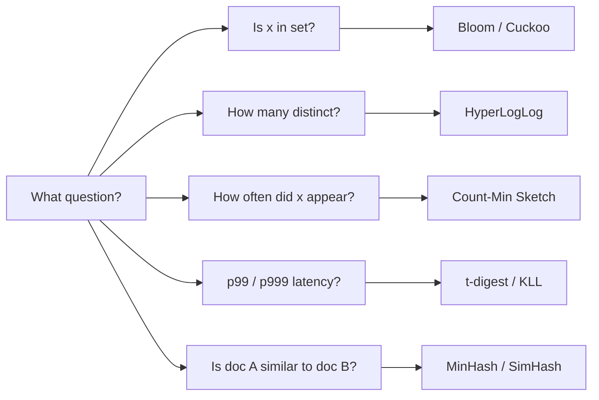
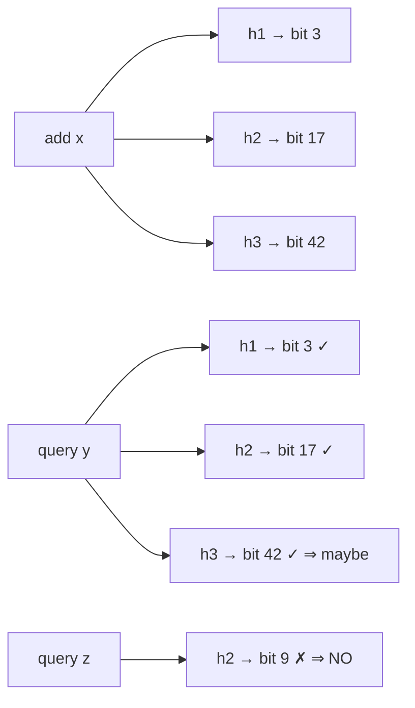
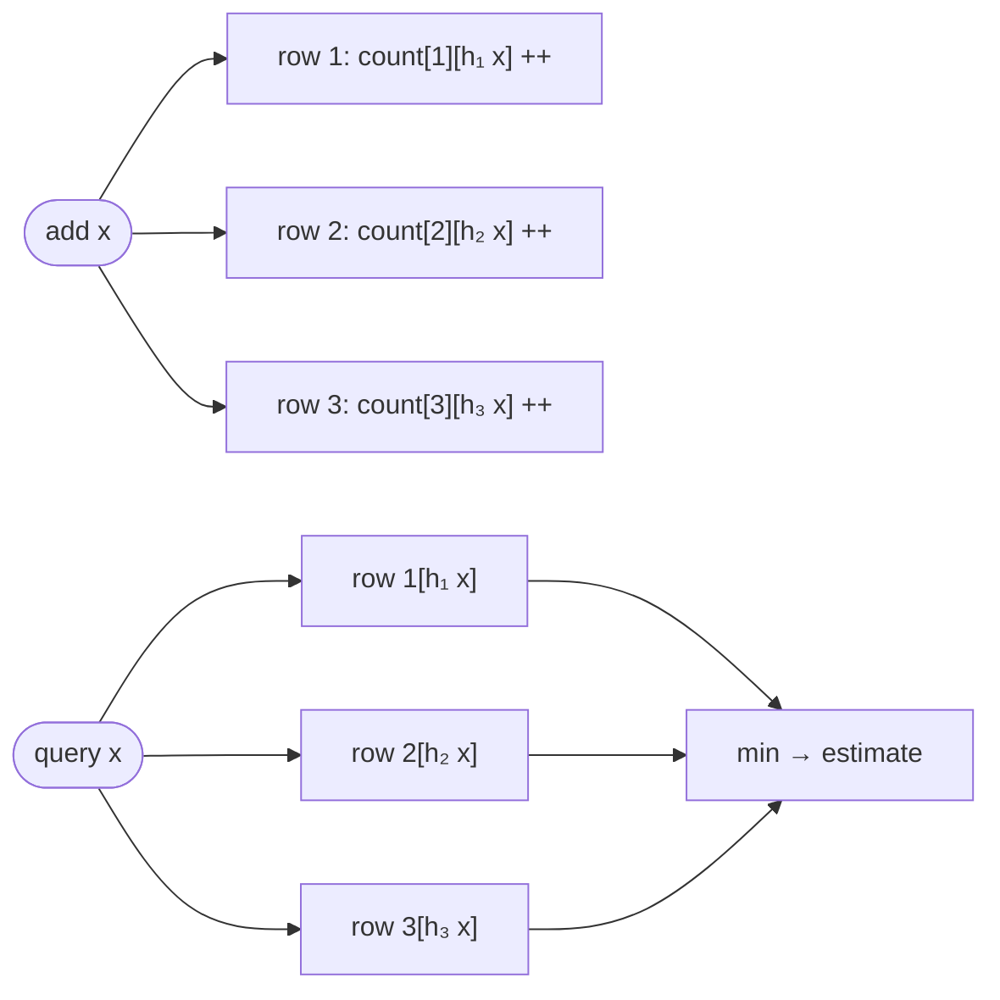

# Probabilistic Data Structures

> **Difficulty:** Easy–Medium | **Interview frequency:** High  
> **Bloom deep dive:** [Bloom Filters](../02-BuildingBlocks/07-BloomFilters.md)

Probabilistic data structures trade **exactness** for **orders-of-magnitude less memory** and/or CPU. They answer the **right** question *approximately*: membership, cardinality, frequency, quantiles, similarity. In interviews, you get credit for (1) picking the right one, (2) sizing it, and (3) explaining the error model.

---

## Contents

- [1. When to reach for a sketch](#1-when-to-reach-for-a-sketch)
- [2. Bloom filter](#2-bloom-filter)
- [3. Counting Bloom & Cuckoo filter (deletes)](#3-counting-bloom--cuckoo-filter-deletes)
- [4. Count-Min Sketch (frequencies)](#4-count-min-sketch-frequencies)
- [5. HyperLogLog (distinct count)](#5-hyperloglog-distinct-count)
- [6. Top-K / heavy hitters](#6-top-k--heavy-hitters)
- [7. t-digest / quantile sketches (latency SLOs)](#7-t-digest--quantile-sketches-latency-slos)
- [8. MinHash / SimHash (similarity, dedup)](#8-minhash--simhash-similarity-dedup)
- [9. Master comparison](#9-master-comparison)
- [10. Interview prompts](#10-interview-prompts)
- [11. Further reading](#11-further-reading)

---

## 1. When to reach for a sketch

Use a sketch when **any** of these is true:

- Exact state would not fit in RAM (or blows your cost budget).
- You need **O(1)** or **O(log m)** updates at line-rate streaming.
- Downstream can tolerate **bounded error** (and you can state the bound).
- You need a compact structure that is **mergeable** across shards (most sketches are).



---

## 2. Bloom filter

**Question answered:** “Is `x` in set?” → **never false negative**, occasional **false positive**.

### How it works

- Bit array of size `m` (start all zeros).
- On `add(x)`: set bits at positions `h1(x), h2(x), …, hk(x)`.
- On `contains(x)`: **all** those bits set → “maybe”; any zero → **definitely not**.



### Sizing math (memorize)

Let `n` = expected distinct inserts, `p` = target false-positive rate:

- **Bits:** `m = -n · ln(p) / (ln 2)²`
- **Hashes:** `k = (m / n) · ln 2 ≈ 0.693 · m/n`
- **With optimal k:** `p ≈ 0.6185^(m/n)`

(Formulas match [Wikipedia: Bloom filter](https://en.wikipedia.org/wiki/Bloom_filter) and the commonly cited StackOverflow derivation.)

### Worked example (numbers)

Target: `n = 1,000,000`, `p = 1%`.

- `m = −1e6 · ln(0.01) / (ln 2)² ≈ 9,585,059 bits ≈ 1.20 MB`
- `k = (m/n) · ln 2 ≈ 6.64 → 7 hashes`

That is: ~**9.6 bits per element** for ~1% FP. Push to ~0.1% and it’s ~**14.4 bits per element** (≈ 1.8 MB for 1M entries).

### Double hashing trick

You typically do **not** need `k` independent hash functions. Compute two hashes `g1, g2` and synthesize: `hi(x) = g1(x) + i · g2(x) mod m`. Standard in production libraries.

### Where

- **Cassandra / RocksDB / LevelDB:** per-SSTable Bloom filters skip disk reads on “definitely not here”.
- **CDNs / Chrome Safe Browsing:** cheap pre-check before a remote lookup.
- **Web crawlers / dedup:** “have I seen this URL lately?”
- **Big Query / Parquet column stats:** row-group pruning.

### Pitfalls

- **No deletes** (classic form). Overfilling past the target `n` degrades `p` fast.
- **Append-only** works great; **churn** needs Counting Bloom or Cuckoo.
- **Wrong hash** (non-uniform, correlated) defeats the math.

---

## 3. Counting Bloom & Cuckoo filter (deletes)

**Counting Bloom:** replace each bit with a small counter (e.g., 4 bits). `add` increments, `delete` decrements. Cost: ~4× memory.

**Cuckoo filter:** store a **fingerprint** per item in one of two candidate buckets (cuckoo hashing). Supports `delete`, and at similar FP rates can be **more space-efficient** than Bloom above ~3% FP. Limitations: bounded `insert` failure probability at high load; slightly more complex.

**Rule of thumb:**  
- Static / append-only → **Bloom**.  
- High churn with deletes → **Cuckoo filter** (or Counting Bloom if simplicity matters).

---

## 4. Count-Min Sketch (frequencies)

**Question answered:** “About how many times did we see `x`?” with **overestimate-only** error.

### Structure

A 2-D table with `d` rows (one per hash) and `w` columns (buckets). Each row uses an independent hash `h_i` that maps an item to one column in that row.

- **add(x):** for each row `i`, do `count[i][h_i(x)] += 1` (one bump per row).
- **query(x):** return `min over i of count[i][h_i(x)]`. The minimum cancels the noise from collisions.

#### Worked example (d = 3 rows, w = 6 columns)

We have inserted `x` **5 times**. Some other items happened to also hash to the same bucket as `x` **only in row 2** (`+2` noise).

```text
                  col0  col1  col2  col3  col4  col5
row 1   h₁(x)=2 →   0     0    [5]    0     0     0
row 2   h₂(x)=5 →   0     0     0     0     0    [7]   ← inflated by collisions
row 3   h₃(x)=0 →  [5]    0     0     0     0     0

add(x):    bump the bracketed cell in every row (3 increments total).
query(x):  read those 3 cells and take the minimum.

           min( row1[2]=5 ,  row2[5]=7 ,  row3[0]=5 )  =  5   ✓
```

Why this works:

- A collision can only **inflate** a counter (other items add into the same cell), never shrink it.
- So every row gives an **upper bound** on the true count.
- Taking the **min** picks the row least polluted by collisions → estimate is **≥ true count** and usually very close to it.



### Error bound (standard)

For width `w = ⌈e/ε⌉` and depth `d = ⌈ln(1/δ)⌉`: estimate is within **additive ε·N** with probability **1−δ**, where `N` is the total count. Memory is `O(w·d)` counters — **independent of key universe size**.

### Worked example

Tracking API path counts across 1B requests, want ±0.01% absolute error with 99.9% confidence:

- `ε = 1e-4`, so `w = ⌈e/ε⌉ ≈ 27,183`.
- `δ = 1e-3`, so `d = ⌈ln(1000)⌉ = 7`.
- ~**190K counters** total → trivially fits in memory.

### Where

- **Heavy hitters** (top IPs, top URLs) paired with a min-heap.
- **Network telemetry** (NetFlow samplers).
- **Ad tech** coarse impression counts before exact reconciliation.

### Pitfall

Only overcounts (never undercounts) — do **not** use where a small overestimate can trigger billing/compliance actions.

---

## 5. HyperLogLog (distinct count)

**Question answered:** “How many **distinct** items?” in kilobytes instead of megabytes or gigabytes.

### Intuition

Hash each item uniformly. Look at the **leading zero run** in the hash prefix; intuitively, seeing a rare long zero-run implies a large set. Split items into `m = 2^p` **registers** using the first `p` bits; in each register keep the **max** leading-zero count observed. Combine using the harmonic mean to estimate cardinality.

**Standard error:** `≈ 1.04 / √m`.

### Redis HLL in practice

Redis uses `m = 16384` (`p = 14`), costing a **fixed ~12 KB** per HLL with **~0.81%** standard error — see [Redis: HyperLogLog](https://redis.io/docs/latest/develop/data-types/probabilistic/hyperloglogs/).

### Worked intuition

To count 100M uniques:

- Storing a plain set → ~**6+ GB**.
- Bitmap of hashes (64 bits) → still huge and fragile.
- HLL → **~12 KB** with ≲1% error. Also **mergeable** across shards by register-wise max.

### Where

- Unique visitors, unique devices, unique queries.
- Massive `COUNT DISTINCT` in analytics (BigQuery, Druid, ClickHouse all ship HLL variants).
- Per-minute unique counts emitted from stream processors.

### Pitfalls

- Small cardinalities: pure HLL is biased → **HyperLogLog++** uses small-range correction and sparse representation.
- HLL is an **estimator**, not a list — cannot enumerate the items.

---

## 6. Top-K / heavy hitters

Ideas you should combine freely:

- **Min-heap of size K** over a streaming score → classic top-K.
- **Count-Min Sketch + heap:** sketch estimates frequency; heap keeps candidate top-K.
- **Space-Saving / Misra-Gries:** deterministic top-K with bounded error for **fixed K**.


Canonical interview scenarios: trending hashtags, hottest products, abusive IPs.

---

## 7. t-digest / quantile sketches (latency SLOs)

Measuring **p99 / p999** exactly would require all samples. Sketches like **t-digest** and **KLL** approximate quantiles with tight error bounds using kilobytes:

- **Mergeable** across shards → per-pod sketches merge to a cluster-wide p99.
- Biased toward the tails → good error at p99/p999 where ops cares most.

Used in **observability** (monitoring pipelines), **adaptive rate limiting**, and **A/B test** dashboards.

---

## 8. MinHash / SimHash (similarity, dedup)

- **MinHash:** estimate **Jaccard** similarity between sets via the probability that minimum hashes agree; used in **LSH** (Locality-Sensitive Hashing) for near-duplicate documents.
- **SimHash:** map features to bits such that similar inputs have small Hamming distance. Used historically by Google for near-duplicate web page detection.

**Where:** plagiarism detection, news clustering, crawler dedup, retrieval short-lists.

---

## 9. Master comparison

| Sketch | Question | Error model | Supports delete | Typical memory |
|---|---|---|---|---:|
| **Bloom** | membership | FP only; no FN | ✗ | ~**9.6 bits/item** at 1% FP |
| **Counting Bloom** | membership | FP only | ✓ | ~4× Bloom |
| **Cuckoo filter** | membership | FP only | ✓ | competitive with Bloom, better at ≥3% FP |
| **Count-Min** | frequency | overestimate only | n/a | width × depth counters |
| **HyperLogLog** | distinct count | ~1.04/√m std err | n/a | **~12 KB** (Redis default) |
| **t-digest / KLL** | quantiles | bounded tail error | n/a | KB range, mergeable |
| **MinHash / LSH** | similarity | probabilistic recall | n/a | dozens of bytes per item |

Interview move: **name the question first**, then match to a sketch, then **state the error**.

---

## 10. Interview prompts

1. **“How big is your Bloom filter for 100M items at 0.1% FP?”**  
   `m ≈ −1e8 · ln(0.001) / (ln 2)² ≈ 1.44e9 bits ≈ 180 MB`; `k ≈ 10`.

2. **“Count unique visitors per day across 1000 shards.”**  
   Per-shard HLL → nightly merge by register-wise max → ~12 KB per shard; error ≲1%.

3. **“Top 100 heavy hitters at 1M events/sec?”**  
   Count-Min Sketch feeding a min-heap of size 100. Size CMS for a small absolute-error budget.

4. **“Why Bloom in an SSTable?”**  
   Skip disk IO when a key is definitely not in that SSTable; pair with index blocks (Cassandra, RocksDB).

5. **“When would HLL mislead you?”**  
   Very small cardinalities without HLL++ correction; or when you need to enumerate the items (HLL cannot).

6. **“Counting vs Cuckoo for deletes?”**  
   Counting Bloom = simplest but 4× memory. Cuckoo = tighter space at higher FP rates, slightly more code.

---

## 11. Further reading

- Wikipedia — [Bloom filter](https://en.wikipedia.org/wiki/Bloom_filter) (formulas, variants).
- Redis — [HyperLogLog](https://redis.io/docs/latest/develop/data-types/probabilistic/hyperloglogs/) (default `p=14`, ~12 KB, ~0.81% std err).
- Cormode & Muthukrishnan — [An improved data stream summary: the Count-Min sketch](https://dimacs.rutgers.edu/~graham/pubs/papers/cm-latin.pdf).
- Flajolet et al. — HyperLogLog paper (2007) and Heule et al. — **HLL++**.
- Dunning — [t-digest paper](https://arxiv.org/abs/1902.04023).
- Fan et al. — [Cuckoo Filter: Practically Better Than Bloom](https://www.cs.cmu.edu/~dga/papers/cuckoo-conext2014.pdf).
- Repo cross-refs: [Bloom Filters deep dive](../02-BuildingBlocks/07-BloomFilters.md), [Search & Indexing](../03-AdvancedConcepts/04-SearchAndIndexing.md).
