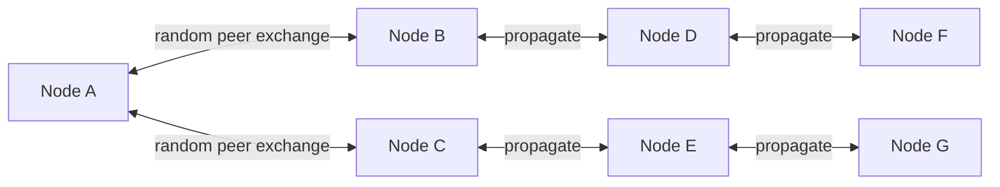
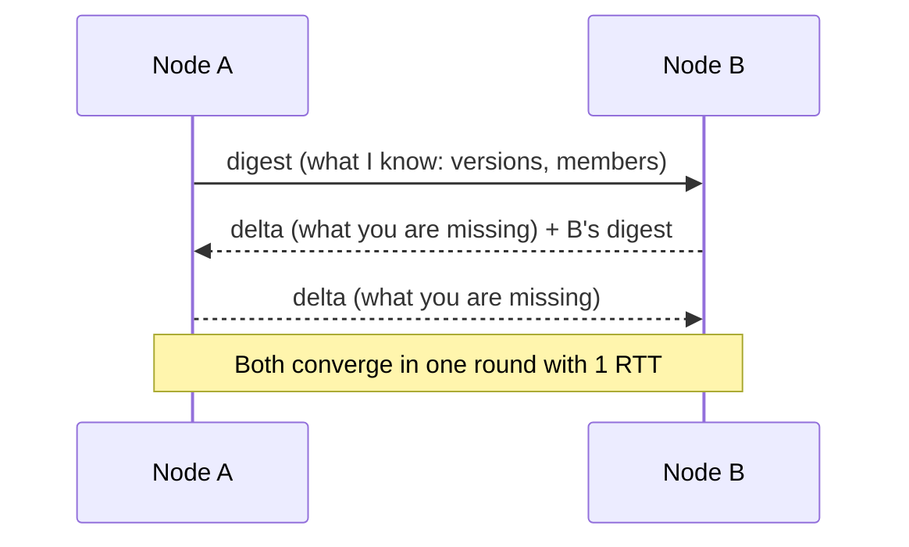
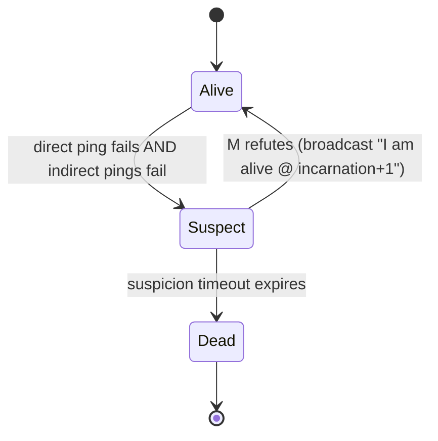
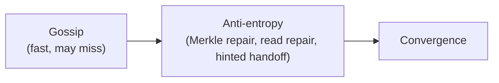

# Gossip Protocols & Cluster Membership

> **Difficulty:** Medium | **Interview frequency:** Medium–High for distributed roles  
> **Deep dive:** [Failure Detection](../03-AdvancedConcepts/DistributedSystems/04-FailureDetection.md)

Gossip (a.k.a. **epidemic**) protocols let a cluster **agree approximately** on membership, health, and metadata **without** a central coordinator. They are how large peer-to-peer systems stay alive when clean RPC fails and when hundreds of nodes join and leave per hour.

---

## Contents

- [1. Why gossip exists](#1-why-gossip-exists)
- [2. Epidemic spreading basics (push, pull, push-pull)](#2-epidemic-spreading-basics-push-pull-push-pull)
- [3. SWIM — the modern failure detector](#3-swim--the-modern-failure-detector)
- [4. Lifeguard: SWIM for noisy networks](#4-lifeguard-swim-for-noisy-networks)
- [5. Phi-accrual failure detection](#5-phi-accrual-failure-detection)
- [6. Anti-entropy & state dissemination](#6-anti-entropy--state-dissemination)
- [7. Gossip vs consensus — when to use which](#7-gossip-vs-consensus--when-to-use-which)
- [8. Where it’s used in production](#8-where-its-used-in-production)
- [9. Operational pitfalls](#9-operational-pitfalls)
- [10. Interview prompts](#10-interview-prompts)
- [11. Further reading](#11-further-reading)

---

## 1. Why gossip exists

Design goals in large clusters:

- **Scalable membership:** `O(log N)` rounds to reach every node with a new rumor.
- **Fault tolerant:** no single coordinator; a single lost message is fine.
- **Bounded bandwidth:** each round only talks to a handful of peers.
- **WAN friendly:** tolerant to occasional partition and loss.

Trade-off: **eventual** agreement — you will briefly disagree about who is up.



Rumor reaches all `N` nodes with high probability in **`O(log N)`** rounds (epidemic spread).

---

## 2. Epidemic spreading basics (push, pull, push-pull)

Each round, every node picks **fanout** random peers:

- **Push:** “here is my new data.” Cheap when a rumor is hot and everyone is missing it.
- **Pull:** “what do you know that I don’t?” Efficient when few nodes have the rumor.
- **Push–pull (most production systems):** exchange digests both ways. Best of both.



**Fanout tuning:** fanout 3–5 is common. Larger = faster convergence, more bandwidth.

### Key property: logarithmic rounds

Once a rumor has `k` infected nodes, next round infects roughly `k · fanout` new nodes until saturation — classic **SI epidemic** model.

---

## 3. SWIM — the modern failure detector

**SWIM** = *Scalable Weakly-consistent Infection-style process group Membership* (Das, Gupta, Motivala, 2002). It separates:

- **Failure detection:** direct + indirect pings.
- **Dissemination:** piggybacking membership updates onto every message.

### The protocol loop (each node, each period T)

1. Pick a random member `M`.
2. Send `PING` to `M`.
3. If no `ACK` in `t_ack`: ask `k` random peers to send **indirect pings** to `M`.
4. If none succeed: mark `M` as **Suspect** (not dead!).
5. If `M` does not refute within `t_suspect`: mark as **Dead** and remove.



### Why suspicion matters

A single dropped packet on a slow network should not evict a healthy node. Suspicion gives the accused **time to refute** before removal. This is the central idea of SWIM and is why it tolerates realistic latency jitter far better than naive heartbeats.

### Piggybacking

Membership updates (`joined X`, `suspect Y`, `alive Z@rev3`) ride on top of every `PING`/`ACK` — no separate broadcast needed.

---

## 4. Lifeguard: SWIM for noisy networks

Standard SWIM misbehaves when the **local detector** is the slow one (CPU saturated, GC pause, noisy neighbor). HashiCorp’s **Lifeguard** extensions (memberlist/Serf/Consul) address this. Per [HashiCorp: Making Gossip More Robust with Lifeguard](https://www.hashicorp.com/blog/making-gossip-more-robust-with-lifeguard) and [arXiv: 1707.00788](https://arxiv.org/abs/1707.00788):

- **Local Health Multiplier (LHM):** if *I* am the one having trouble (missed my own ticks), scale up my timeouts before blaming peers.
- **LHA-Suspicion:** suspicion timeouts decay logarithmically and are influenced by how many independent sources confirm unreachability.
- **Buddy System / Dogpile:** notify the **suspected** node directly so it can refute quickly, instead of relying on random gossip to reach it.

**Result:** ~**50×** fewer false-positive failures while **speeding up** true-failure detection.

---

## 5. Phi-accrual failure detection

Cassandra uses a different (but compatible) detector: **phi accrual**, which outputs a **continuous suspicion value** `φ` based on inter-arrival history of heartbeats rather than a binary alive/dead flag.

- Administrators pick a threshold (`phi_convict_threshold`, default ~8 in Cassandra).
- The detector adapts automatically to the actual network distribution — less tuning, less flapping.

**Interview line:** “Phi-accrual and SWIM both attack the same problem: stop converting random latency spikes into false positives.”

---

## 6. Anti-entropy & state dissemination

### Why gossip alone is not enough

Gossip is **fast but sloppy**. A rumor (`"Node Z is dead"`, `"key user:42 = v7"`) reaches almost everyone in `O(log N)` rounds — but **almost** is the catch. Real networks lose packets, nodes restart mid-round, two writers race on the same key. Even after gossip "finishes," replicas can hold slightly different views:

```
Replica A: user:42 = v7
Replica B: user:42 = v7
Replica C: user:42 = v6   ← missed an update
```

Gossip alone never guarantees this drift goes away. You need a second mechanism that periodically asks: *"are we actually identical? if not, fix it."* That mechanism is **anti-entropy**.

### The two-layer model

Think of it like a newsroom: gossip is the **breaking-news ticker**; anti-entropy is the **editor fact-checking the archive overnight**. You need both.

| Layer | Purpose | Speed | Guarantee |
|---|---|---|---|
| **Gossip (rumor mongering)** | Push hot news (membership, health, metadata) | Seconds | Probabilistic / eventual |
| **Anti-entropy (background repair)** | Compare full state, reconcile drift | Minutes–hours | Deterministic convergence |

### Technique 1: Merkle trees / range hashes (background repair)

Suppose Node A and Node B each store 100M keys. How do you check they're identical without shipping all 100M keys across the wire?

Build a **Merkle tree** over the data: hash each small key range, then hash pairs of those hashes recursively into a tree. To compare:

1. A and B exchange just the **root hash**. Equal → identical, zero data shipped.
2. Different → exchange the two **child hashes**, recurse only into the subtree that disagrees.
3. Eventually isolate the few ranges that actually differ and ship only those.

Cassandra and Dynamo-family systems run this as a scheduled **"repair"** job. See the deep dive: [Merkle Trees](./06-MerkleTrees.md).

### Technique 2: Read repair & hinted handoff (hot-path repair)

These fix drift **opportunistically** during normal traffic, without waiting for a scheduled job:

- **Read repair:** when a client reads `user:42` with quorum `R=2`, the coordinator queries multiple replicas. If A says `v7` and C says `v6`, it returns `v7` to the client **and asynchronously pushes `v7` back to C**. Reads heal stragglers.
- **Hinted handoff:** when a write targets replica C but C is down, the coordinator stores a local **hint** (`"deliver this write to C when it returns"`). On C's recovery, hints are replayed. Prevents writes from being lost just because a replica blinked.

### How it ties back to gossip



- Use **gossip** for things that must be **fast and approximate**: membership, health, schema version, slot ownership.
- Use **anti-entropy** for things that must be **eventually exact**: the actual data stored on each replica.

**Interview line:** "Gossip handles the control plane; anti-entropy guarantees the data plane converges. Cassandra and Dynamo run *both* — gossip for who's alive, Merkle repair plus read-repair plus hinted handoff for the data itself."

See the deep dive: [Anti-Entropy](../03-AdvancedConcepts/DistributedSystems/08-AntiEntropy.md).

---

## 7. Gossip vs consensus — when to use which

Gossip gives you **AP** properties with low coordination cost. Consensus (Paxos/Raft) gives you **CP** properties with higher cost and small quorums. Real systems use **both**.

| Concern | Use gossip for | Use consensus for |
|---|---|---|
| Membership / who is alive | ✅ | ❌ (too chatty) |
| Health metadata / soft state | ✅ | ❌ |
| Shared mutable state of record (leader, config, schema) | ❌ | ✅ |
| Distributed locks / sequencers | ❌ | ✅ |

**Interview line:** “Gossip is great for dissemination, but it is not a replacement for consensus on authoritative shared state.”

---

## 8. Where it’s used in production

- **Cassandra / ScyllaDB:** cluster state, schema version, token/ownership updates via gossip + phi-accrual.
- **Consul / Serf (HashiCorp):** membership and event propagation via memberlist (SWIM + Lifeguard).
- **Redis Cluster:** gossip for cluster bus, slot ownership, PFAIL→FAIL promotion by majority.
- **Akka Cluster:** gossip-based membership with vector clocks.
- **Bitcoin / Ethereum P2P:** transaction and block propagation (a different flavor, but epidemic at heart).
- **Kubernetes (historical):** some kubelet-to-control-plane paths avoided gossip — contrast case for “when not to.”

---

## 9. Operational pitfalls

| Symptom | Likely cause | Mitigation |
|---|---|---|
| False positives ("node keeps flapping") | Too-aggressive timeouts, local slowness | Lifeguard / phi-accrual; tune `probe_interval` |
| "Split brain" membership views | Asymmetric partition, small partition fanout | Indirect pings; larger fanout; multi-path probes |
| Bandwidth ballooning | Too-large gossip payload or too-frequent rounds | Compact digests, versioned deltas |
| Security (poisoned membership) | Unauthenticated joins | Join tokens, mTLS, ACLs |
| Slow bootstrap of huge clusters | `O(log N)` still takes time at scale | **Seeds** and static hints for initial join |

---

## 10. Interview prompts

1. **“Why not heartbeats to a leader?”**  
   Centralized bottleneck and single point of failure; `O(N)` load on leader; doesn’t scale to 10⁴ nodes.

2. **“SWIM vs phi-accrual?”**  
   SWIM adds **indirect probes** and **suspicion** on top of UDP pings; phi-accrual replaces a binary threshold with a **probabilistic suspicion score**. Both target false positives.

3. **“Why gossip for membership but Raft for leader?”**  
   Gossip is eventual; leader choice must be **agreed exactly** and survive partitions — use Raft/Paxos.

4. **“Bandwidth model?”**  
   Each node sends ~`fanout` gossip messages per round; total traffic per round `O(N · fanout)`. Scale comes from round count `O(log N)` to full dissemination.

5. **“Security for gossip?”**  
   TLS/mTLS between peers; signed membership updates; join tokens or cluster secrets; don’t expose gossip ports publicly.

6. **“Convergence time for 10k nodes at fanout 5?”**  
   ~`log₅(10⁴) ≈ 6` rounds ideally; in practice, account for packet loss, so budget ~10–15 rounds of 200 ms each.

---

## 11. Further reading

- Das, Gupta, Motivala — [SWIM: Scalable Weakly-consistent Infection-style Membership (DSN 2002)](https://www.cs.cornell.edu/projects/Quicksilver/public_pdfs/SWIM.pdf).
- Dadgar, Phillips, Currey — [Lifeguard: Local Health Awareness for More Accurate Failure Detection (arXiv 1707.00788)](https://arxiv.org/abs/1707.00788) · [HashiCorp blog](https://www.hashicorp.com/blog/making-gossip-more-robust-with-lifeguard).
- Hayashibara et al. — [The φ Accrual Failure Detector](https://www.computer.org/csdl/proceedings-article/srds/2004/22390066/12OmNvT2pSR).
- van Renesse et al. — [Astrolabe](https://www.cs.cornell.edu/projects/spinglass/public_pdfs/astrolabe-tocs.pdf) (classic gossip-based aggregation).
- Cross-refs: [Failure Detection](../03-AdvancedConcepts/DistributedSystems/04-FailureDetection.md), [Anti-Entropy](../03-AdvancedConcepts/DistributedSystems/08-AntiEntropy.md), [Consensus](../03-AdvancedConcepts/02-Consensus.md).
