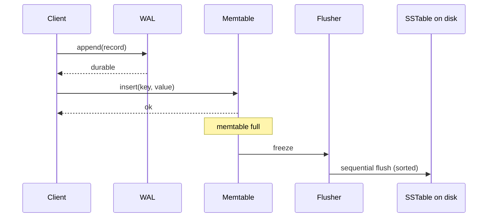
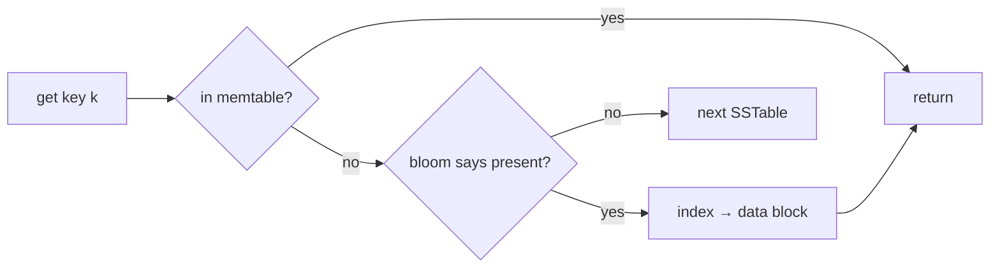
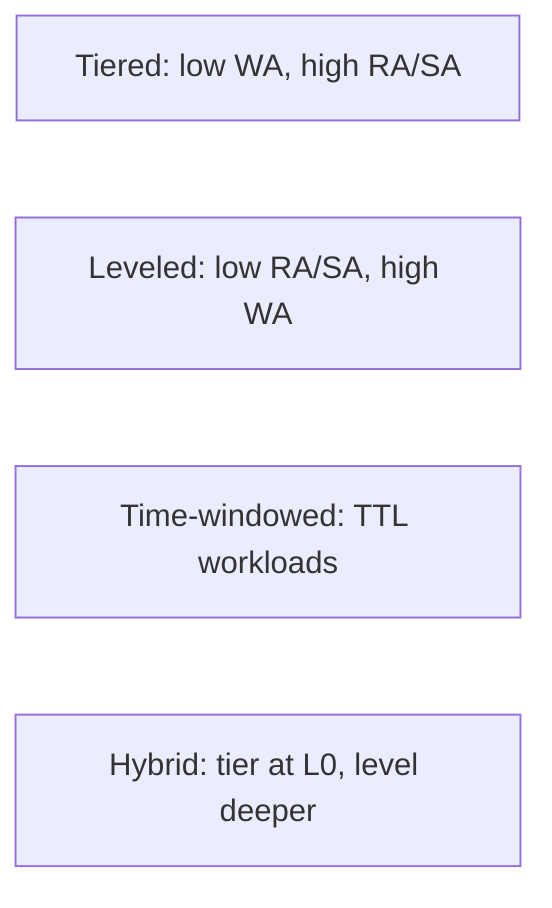

# LSM-Trees & SSTables

> **Difficulty:** Medium–Hard | **Interview frequency:** High (any datastore-heavy design)  
> **Related:** [Databases](../01-Fundamentals/03-Databases.md), [Search & Indexing](../03-AdvancedConcepts/04-SearchAndIndexing.md)

**Log-Structured Merge-Trees (LSM)** are the write path behind RocksDB, Cassandra, ScyllaDB, HBase/Bigtable, LevelDB, and therefore MyRocks, TiKV, CockroachDB’s storage engine lineage, Kafka’s indexes at times, and many object stores’ metadata layers. They trade **extra background work** for **high sustained write throughput** on spinning disk and, increasingly, on SSDs where random writes wear out cells.

---

## Contents

- [1. The problem LSM solves](#1-the-problem-lsm-solves)
- [2. Anatomy of an LSM engine](#2-anatomy-of-an-lsm-engine)
- [3. Write path (step by step)](#3-write-path-step-by-step)
- [4. Read path (with bloom + block cache)](#4-read-path-with-bloom--block-cache)
- [5. The three amplifications](#5-the-three-amplifications)
- [6. Compaction strategies](#6-compaction-strategies)
- [7. Tombstones, TTLs, and range deletes](#7-tombstones-ttls-and-range-deletes)
- [8. Operational pitfalls](#8-operational-pitfalls)
- [9. LSM vs B-Tree (interview cheat sheet)](#9-lsm-vs-b-tree-interview-cheat-sheet)
- [10. Interview prompts](#10-interview-prompts)
- [11. Further reading](#11-further-reading)

---

## 1. The problem LSM solves

A naive B-Tree updates pages **in place**. Under random-write load:

- Each write may touch **random** disk pages → high IOPS, low throughput.
- On SSD: random writes trigger **garbage collection** internally and wear out cells.
- On HDD: random writes are catastrophic.

**LSM’s bet:** buffer writes in RAM, flush **sorted** files, and merge them **in the background** so the hot path is always **sequential**.

---

## 2. Anatomy of an LSM engine

```mermaid
flowchart TB
  subgraph Memory
    WAL[Write-Ahead Log]
    MT[Active Memtable]
    IMT[Immutable Memtable]
  end
  subgraph Disk
    L0[L0: SSTables\n(unsorted across files)]
    L1[L1: SSTables (sorted, no overlap)]
    L2[L2: SSTables (10× larger)]
    L3[L3: SSTables (100× larger)]
    BC[Block cache]
    BF[Per-SSTable Bloom + index]
  end
  Client[Client write] --> WAL
  Client --> MT
  MT -->|flush| IMT
  IMT --> L0
  L0 -->|compaction| L1
  L1 --> L2
  L2 --> L3
  ReadClient[Client read] -->|1| MT
  ReadClient -->|2| IMT
  ReadClient -->|3| L0
  ReadClient -->|4| L1
  BF -.skip.-> L1
  BC -.cache.-> L1
```

Core pieces:

- **WAL (Write-Ahead Log):** durable append-only log; crash recovery replays it.
- **Memtable:** in-RAM sorted structure (skip list, red-black tree). Current writes land here.
- **Immutable memtable:** once full, it is frozen, handed off to flush, while a new memtable accepts writes.
- **SSTable (Sorted String Table):** immutable on-disk file, keys sorted. Includes **index blocks** and a **Bloom filter** for fast negative lookups.
- **Block cache:** RAM cache of recently read data blocks.
- **Levels:** L0 may have overlapping files (flush output). L1+ are partitioned into non-overlapping key ranges.

---

## 3. Write path (step by step)

1. Append record to WAL on disk (fsync policy determines durability).
2. Insert into active memtable (O(log n) in a skip list).
3. When memtable exceeds threshold (e.g., 64 MB): mark immutable.
4. Flush immutable memtable to L0 SSTable (sorted, sequential write).
5. Compaction thread merges files across levels to bound read amplification.



**Key takeaway:** the critical path is **two sequential appends** (WAL + memtable). That is why LSM sustains enormous write rates.

---

## 4. Read path (with bloom + block cache)

Because the same key can exist in multiple places, reads walk from newest to oldest:

1. Memtable (active + immutable).
2. L0 SSTables (newest-first, may overlap).
3. L1, L2, … (binary search within non-overlapping ranges).

Each SSTable lookup uses:

- **Bloom filter** → skip if key definitely not here. Cuts disk IO dramatically; see [Probabilistic Data Structures](03-ProbabilisticDataStructures.md).
- **Index block** → find the target data block without scanning.
- **Block cache** → skip disk if block is in RAM.



**Read amp rule of thumb:** in leveled compaction with reasonable bloom false-positive rates, a point lookup touches ~1 memtable + 1 block per level (often just 1–2 actual disk reads).

---

## 5. The three amplifications

| Metric | Definition | Tuned by |
|---|---|---|
| **Write amp (WA)** | bytes written to disk ÷ bytes logically written | compaction strategy, level sizing |
| **Read amp (RA)** | SSTable lookups per read | bloom FP rate, level count, cache size |
| **Space amp (SA)** | on-disk size ÷ live data size | tombstone retention, compaction aggressiveness |

You can improve any **two** at the cost of the third — this is the core LSM design trade-off.


---

## 6. Compaction strategies

### Leveled (default in RocksDB / LevelDB)

- Each level is up to `T` times larger than the previous (typical `T=10`).
- **L1+ are strictly non-overlapping** → at most one SSTable per level touches a key.
- Merging `Li` into `Li+1` rewrites overlapping files.

Characteristics: **low read amp**, **low space amp**, **higher write amp** (typical WA ~10–30×).

### Size-tiered / Universal (Cassandra default, RocksDB Universal)

- Accumulate similarly-sized SSTables; merge them when enough pile up.
- **Lower write amp** than leveled.
- **Higher read amp** and **space amp** (duplicate keys linger across tiers).

From [RocksDB Universal Compaction wiki](https://github.com/facebook/rocksdb/wiki/Universal-Compaction): tiered exchanges write performance for larger space usage and spikier compactions.

### Time-Windowed (TWCS)

- Files bucketed by **write time window**; entire old windows dropped when TTL expires.
- Ideal for **time-series** (metrics, logs): no tombstone churn, almost zero compaction for old data.

### Tiering spectrum



Many systems **mix**: Cassandra lets each table choose; RocksDB supports multiple at once.

---

## 7. Tombstones, TTLs, and range deletes

LSM cannot update in place, so a **delete** writes a marker:

- **Point tombstone:** `key → DELETED` at current timestamp.
- **Range tombstone:** `[k1, k2) deleted at T` — avoids writing one tombstone per key.
- **TTL:** each value carries an expiration; compaction drops expired entries.

### The tombstone trap (classic Cassandra interview question)

If you repeatedly delete rows in a partition (e.g., queue-like usage), reads must still **scan over tombstones** until compaction removes them. Cassandra enforces a **GC grace period** (default **10 days**) so that a node that was offline can still see the tombstone and propagate the delete — otherwise **deleted data can resurrect**.

**Mitigations:** avoid queue patterns in LSM wide-column stores; use TTLs; schedule repairs within GC grace.

---

## 8. Operational pitfalls

| Symptom | Likely cause | Fix |
|---|---|---|
| Spiky p99 writes | Large compactions saturate IO | Rate-limit compactions; leveled dynamic sizing; bigger memtable |
| Read latency regressing | Too many L0 files; blooms inadequate | L0 slowdown/stop triggers; raise bloom bits/key |
| Disk use > data size | Tombstones + overlapping tiers | Force compaction; adjust `gc_grace_seconds`; switch to leveled |
| Long startup | Big WAL replay | Smaller WAL, more frequent flushes |
| Write stalls | Compaction falling behind | More compaction threads, faster disks, different strategy |

Tuning references: [RocksDB write amplification tuning tips](https://medium.com/@connect.hashblock/5-rocksdb-tweaks-that-tame-write-amplification-f31685910d6e), [RocksDB wiki](https://github.com/facebook/rocksdb/wiki).

---

## 9. LSM vs B-Tree (interview cheat sheet)

| Aspect | B-Tree (Postgres/MySQL InnoDB) | LSM (RocksDB/Cassandra) |
|---|---|---|
| Write amp | **Low** (but random IO) | **Higher** (but sequential IO) |
| Read amp | Low, predictable | Needs bloom + cache |
| Space amp | Moderate (free-space fragmentation) | Variable (tombstones, tiers) |
| Range scans | Excellent, in-order on leaves | Excellent on sorted SSTables |
| Random updates | Cheap per op, risk of page hot spots | Append-only, consistent throughput |
| Hot key contention | Page-level locking | Memtable row-level, less contention |
| Concurrency | Rich transactional stories | Simpler single-writer memtable stories |

**Rule of thumb:** OLTP with many secondary indexes and transactions → B-Tree. High-ingest KV / time-series / wide-column → LSM.

---

## 10. Interview prompts

1. **“Why does Cassandra use an LSM?”**  
   Write-heavy, wide-column, append-friendly replication. Immutable SSTables are simple to stream to replicas and to reason about for repair.

2. **“What is read amplification and how do you fight it?”**  
   Multiple files may contain the same key. Mitigations: **leveled compaction**, **per-SSTable bloom filters**, **block cache**, **partition summaries**.

3. **“Walk me through a delete.”**  
   Write a tombstone with a timestamp, it flushes like any record, compaction drops older versions after **GC grace**, ensuring offline nodes don’t resurrect data.

4. **“Leveled vs tiered?”**  
   Leveled wins on read/space amp; tiered wins on write amp and absolute write throughput; time-windowed dominates for TTL’d time-series.

5. **“What causes write stalls?”**  
   L0 file count exceeds a threshold → engine throttles or blocks writes until compaction catches up.

6. **“How does crash recovery work?”**  
   Replay the WAL from the last durable checkpoint into a fresh memtable; remove any partially flushed SSTable not referenced in the MANIFEST.

---

## 11. Further reading

- O’Neil, Cheng, Gawlick, O’Neil — [The Log-Structured Merge-Tree (LSM-Tree)](https://www.cs.umb.edu/~poneil/lsmtree.pdf) (1996, original paper).
- Google — [Bigtable: A Distributed Storage System for Structured Data (OSDI 2006)](https://research.google/pubs/pub27898/).
- Facebook — [RocksDB wiki](https://github.com/facebook/rocksdb/wiki) (leveled, universal, and FIFO compaction details).
- Dong et al. — [Optimizing Space Amplification in RocksDB (CIDR 2017)](https://www.cidrdb.org/cidr2017/papers/p82-dong-cidr17.pdf).
- Siying Dong — [Experience with leveled vs tiered compaction (Facebook)](https://rocksdb.org/blog/).
- Cassandra docs — [Compaction strategies](https://cassandra.apache.org/doc/latest/cassandra/operating/compaction.html) (STCS, LCS, TWCS).
- Cross-refs: [Databases](../01-Fundamentals/03-Databases.md), [Search & Indexing](../03-AdvancedConcepts/04-SearchAndIndexing.md), [Bloom Filters](../02-BuildingBlocks/07-BloomFilters.md).
