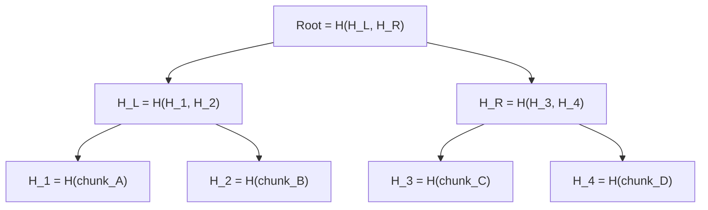
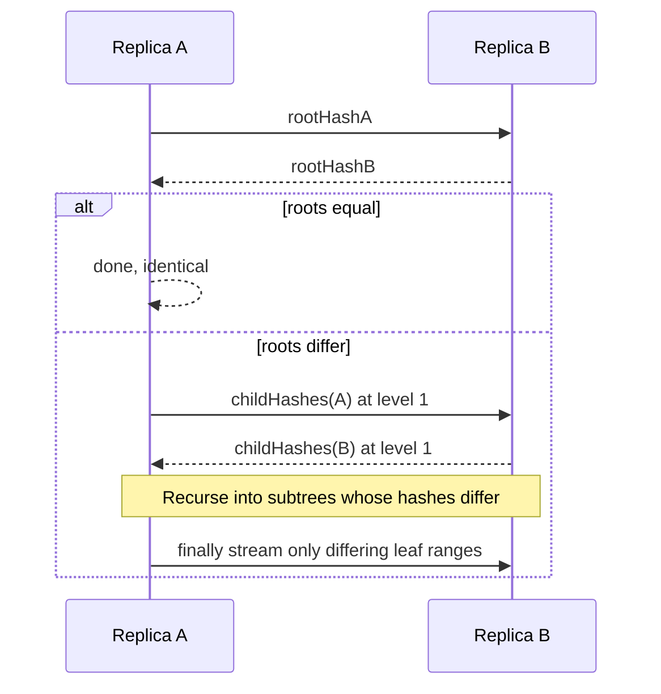
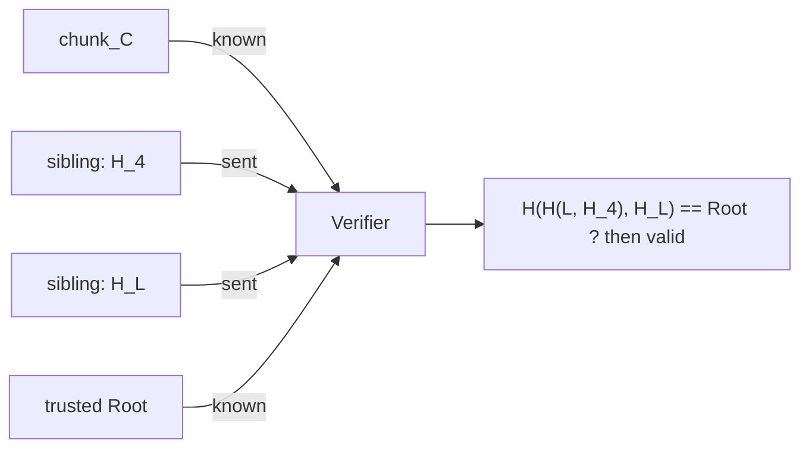
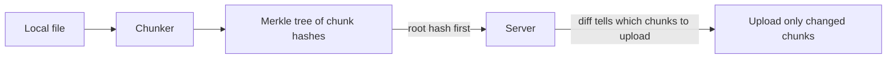

# Merkle Trees & Diff Sync

> **Difficulty:** Medium | **Interview frequency:** Medium–High  
> **Deep dive:** [Anti-Entropy & Read Repair](../03-AdvancedConcepts/DistributedSystems/08-AntiEntropy.md)

A **Merkle tree** (binary hash tree) is a tree where every leaf is a hash of a data chunk and every internal node is a hash of its children. Comparing two versions of a dataset collapses to comparing a **single root hash**; if they differ, you recurse and transfer only the subtrees that changed. This is the trick behind Git’s commit graph, Bitcoin block verification, Cassandra replica repair, Dynamo-style anti-entropy, and cloud file sync.

---

## Contents

- [1. Why Merkle trees exist](#1-why-merkle-trees-exist)
- [2. Structure & construction](#2-structure--construction)
- [3. Diff algorithm (logarithmic comparison)](#3-diff-algorithm-logarithmic-comparison)
- [4. Merkle proofs (inclusion proofs)](#4-merkle-proofs-inclusion-proofs)
- [5. Real-world systems](#5-real-world-systems)
  - [5.1 Cassandra / DynamoDB / ScyllaDB — repair](#51-cassandra--dynamodb--scylladb--repair)
  - [5.2 Git — content-addressable DAG](#52-git--content-addressable-dag)
  - [5.3 Bitcoin / Ethereum — block integrity](#53-bitcoin--ethereum--block-integrity)
  - [5.4 IPFS / Content-addressed storage](#54-ipfs--content-addressed-storage)
  - [5.5 Dropbox / Drive — file sync](#55-dropbox--drive--file-sync)
- [6. Chunking strategies](#6-chunking-strategies)
- [7. Trade-offs & pitfalls](#7-trade-offs--pitfalls)
- [8. Interview prompts](#8-interview-prompts)
- [9. Further reading](#9-further-reading)

---

## 1. Why Merkle trees exist

Given two large datasets on two machines, naive reconciliation means **transferring everything** or scanning keys one by one.

With Merkle trees:

- **One** 32-byte hash per dataset identifies the whole state.
- If the root hashes match → both machines already agree, no bytes transferred.
- If they differ → a logarithmic descent finds exactly which ranges changed.

**Bandwidth:** `O(d · log n)` instead of `O(n)` for a change set of size `d`.

---

## 2. Structure & construction

Split the data into **n** chunks (sorted key ranges, fixed-size byte blocks, or tx lists). Hash each chunk to get leaves. Pair leaves and hash concatenations upward until a single root remains.

**Hash choice:** SHA-256 in cryptographic use (Bitcoin, Ethereum, IPFS, Git with newer hashes), cheaper non-crypto hashes for internal repair when integrity is already guaranteed by TLS (Cassandra uses MurmurHash variants internally, though reported differently across versions).

**Odd-leaf handling:** implementations either duplicate the last leaf, promote singletons up a level, or pad with zeros. Convention matters (Bitcoin duplication was the source of the famous **CVE-2012-2459** collision).

---

## 3. Diff algorithm (logarithmic comparison)

Two replicas `A` and `B` of the same keyspace each build a Merkle tree of the same layout.

- **Each level transferred** is tiny (`O(fanout · hash_size)`).
- **Only mismatching subtrees** are descended into.
- At the bottom, you stream **only the actual differing chunks** (or reshash and repair).

### Worked example (tiny)

8 chunks, one chunk differs → 3 levels deep. You exchange ~`2 + 2 + 2 + 2 = 8` hashes (≈ 256 bytes with SHA-256) instead of streaming all 8 chunks.

---

## 4. Merkle proofs (inclusion proofs)

A **Merkle proof** shows a chunk is part of a set without sending the whole set: you send the **sibling hashes along the path** from leaf to root. The verifier recomputes parent hashes and compares to a **trusted root**.

Proof size: **O(log n)** hashes. This is how:

- **Bitcoin SPV** clients verify a tx without downloading full blocks.
- **Certificate Transparency** logs prove inclusion of a cert.
- **Ethereum state proofs** ship a Merkle path with a state read.
- **IPFS / Filecoin** prove data availability.

---

## 5. Real-world systems

### 5.1 Cassandra / DynamoDB / ScyllaDB — repair

Each replica hashes its owned **token range** into a Merkle tree. During `nodetool repair`:

1. Replicas build trees for the same range.
2. They exchange trees and find **divergent leaf ranges**.
3. Only those ranges are streamed between replicas.

Paired with **hinted handoff** (store-and-forward for offline peers) and **read repair** (fix mismatches on the hot path) — see [Anti-Entropy](../03-AdvancedConcepts/DistributedSystems/08-AntiEntropy.md).

### 5.2 Git — content-addressable DAG

A Git tree object is a Merkle tree over a directory; a commit hash covers the tree, parents, author, and message. Moving a branch pointer is moving a single root hash. Cloning is descending the DAG and transferring only missing objects.

### 5.3 Bitcoin / Ethereum — block integrity

- **Bitcoin** blocks commit to a Merkle root of transactions; SPV nodes verify membership with a Merkle proof.
- **Ethereum** uses **Merkle-Patricia tries** (a Merkle-ized radix trie) for state, transactions, and receipts — enabling proofs over *key/value* state, not just ordered lists.

### 5.4 IPFS / Content-addressed storage

Everything is a **CID** (content identifier) that is the hash of a DAG node. Deduplication is free: identical chunks hash identically across files and hosts.

### 5.5 Dropbox / Drive — file sync

Files are split into content-defined chunks; the client maintains a Merkle tree per file (or per folder). The client sends the root to the server, descends on mismatch, and uploads **only changed chunks** — the classic “rsync-like” experience but with explicit content addressing.

---

## 6. Chunking strategies

The boundaries of chunks control how well the diff shrinks under edits.

| Strategy | Idea | Good for | Problem |
|---|---|---|---|
| **Fixed size** | Every N KB | Blocky data (disk images) | **Insertions shift everything** and invalidate all downstream chunks |
| **Content-defined (rolling hash)** | Boundary = rolling hash hits pattern | Text, code, documents | Slightly more CPU to chunk |
| **Key-range (KV)** | Hash ranges of sorted keys | Cassandra/Dynamo repair | Skew with hot keys |
| **Application-aware** | Split on record/field boundaries | Structured data | Format-specific |

**Rolling-hash content-defined chunking** (Rabin fingerprints, FastCDC) is the standard for file sync because a small insertion only changes **nearby** chunks.

---

## 7. Trade-offs & pitfalls

| Topic | What to know |
|---|---|
| **CPU** | Hashing is not free at multi-GB/s; pick a fast hash where integrity is otherwise guaranteed. |
| **Tree build cost** | Incremental trees update from leaves up; full rebuild is only needed on chunking changes. |
| **Tree size** | A tree over `n` chunks needs `2n−1` hashes; pick chunk size to balance tree overhead vs diff granularity. |
| **Second-preimage issues** | In Bitcoin’s historical construction, **CVE-2012-2459** allowed duplicate leaves to collide root hashes — always encode level/leaf-ness in the hash input. |
| **Unbalanced trees** | Partial updates in Git tree objects work because subtrees with unchanged hashes are untouched. |
| **Parallelism** | Leaves and internal levels hash independently → great fit for multi-core and GPU. |

---

## 8. Interview prompts

1. **“How does Cassandra repair work?”**  
   Merkle trees over token ranges; exchange root then descend; stream differing ranges only.

2. **“How does Dropbox avoid re-uploading whole files?”**  
   Content-defined chunking + Merkle tree; client sends root/subtree hashes; server requests only missing chunks.

3. **“What is a Merkle proof?”**  
   Siblings along the root path; `O(log n)` size; verifier recomputes parent hashes and compares to a trusted root.

4. **“Why would fixed-size chunking be bad for text files?”**  
   A single inserted byte shifts all later chunk boundaries → entire suffix of the file appears “changed”.

5. **“Why are Merkle trees a good fit for blockchains?”**  
   Constant-size block commitment, efficient proofs to light clients, parallel verification, tamper-evidence.

6. **“Merkle tree vs vector clock?”**  
   Different jobs: Merkle trees identify **what data** differs between replicas; vector clocks identify **which update** happened first.

---

## 9. Further reading

- Ralph Merkle — [A Digital Signature Based on a Conventional Encryption Function (CRYPTO 1987)](https://link.springer.com/chapter/10.1007/3-540-48184-2_32) (original).
- DeCandia et al. — [Dynamo: Amazon’s Highly Available Key-value Store (SOSP 2007)](https://www.allthingsdistributed.com/files/amazon-dynamo-sosp2007.pdf) (Merkle trees for anti-entropy).
- Cassandra docs — [Repair](https://cassandra.apache.org/doc/latest/cassandra/operating/repair.html).
- Nakamoto — [Bitcoin: A Peer-to-Peer Electronic Cash System](https://bitcoin.org/bitcoin.pdf) (Merkle root for SPV).
- Ethereum Yellow Paper — Merkle-Patricia tries.
- IPFS docs — [Merkle DAG](https://docs.ipfs.tech/concepts/merkle-dag/).
- **CVE-2012-2459** — duplicate transaction Merkle root vulnerability in early Bitcoin.
- Cross-refs: [Anti-Entropy](../03-AdvancedConcepts/DistributedSystems/08-AntiEntropy.md), [Design Google Drive](../06-DesignHard/09-GoogleDrive.md).
