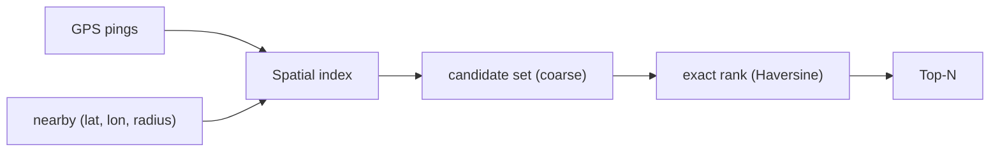
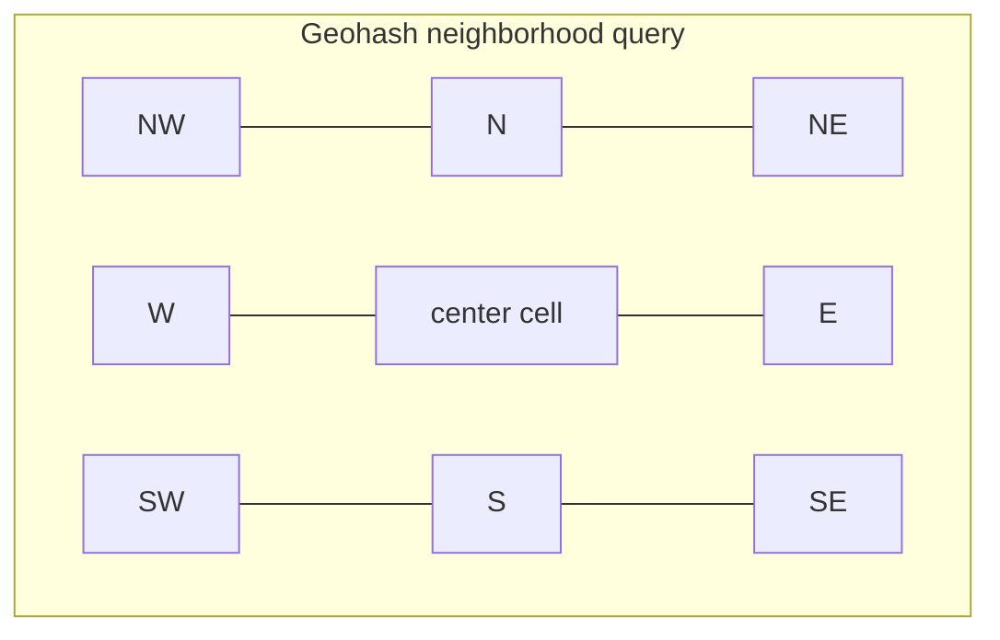
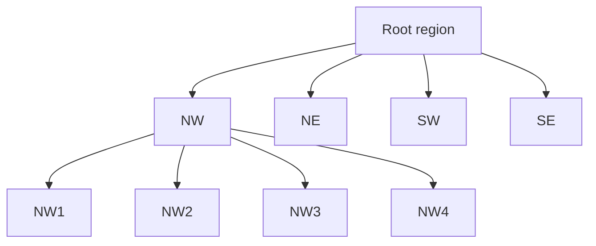
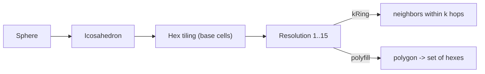
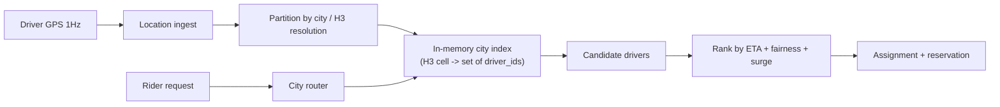

# Spatial Indexing (Maps & Location Systems)

> **Difficulty:** Medium | **Interview frequency:** High for Uber / maps / delivery / ads  
> **Design context:** [Design Google Maps](../06-DesignHard/01-GoogleMaps.md), [Design Uber](../06-DesignHard/04-Uber.md)

Spatial indexing turns “find things **near** here” from a full table scan into a prefix/range query. In interviews, the right answer is usually a **layered** one: a **coarse index** for candidate generation + **exact distance** for ranking + a **dispatch layer** that keeps hot state in memory.

---

## Contents

- [1. Problems that trigger spatial indexing](#1-problems-that-trigger-spatial-indexing)
- [2. Geohash (string prefix index)](#2-geohash-string-prefix-index)
- [3. Quadtree / k-d tree](#3-quadtree--k-d-tree)
- [4. R-tree family (bounding-box hierarchy)](#4-r-tree-family-bounding-box-hierarchy)
- [5. Google S2 (spherical quad cells)](#5-google-s2-spherical-quad-cells)
- [6. Uber H3 (hexagonal hierarchy)](#6-uber-h3-hexagonal-hierarchy)
- [7. S2 vs H3 vs Geohash — master comparison](#7-s2-vs-h3-vs-geohash--master-comparison)
- [8. Distance math (Haversine, Vincenty)](#8-distance-math-haversine-vincenty)
- [9. Dispatch architecture patterns](#9-dispatch-architecture-patterns)
- [10. Interview prompts](#10-interview-prompts)
- [11. Further reading](#11-further-reading)

---

## 1. Problems that trigger spatial indexing

- **Nearest-N drivers / restaurants / scooters** with hundreds of thousands of moving entities.
- **Geo-fencing:** is a point inside a service polygon? (delivery zones, surge areas, regulatory boundaries).
- **Ride / dispatch matching** with ETA, supply/demand, and fairness constraints.
- **Ad targeting** by DMA / city / radius.
- **Analytics by region** (heatmaps, uplift by cell).



---

## 2. Geohash (string prefix index)

**Idea:** Interleave bits of latitude and longitude (Z-order curve) and base-32 encode. Nearby points **often** share a long prefix → great for KV or SQL `LIKE`-prefix sharding.

### Precision table

| Geohash length | Cell width × height (approx.) |
|---:|---|
| 5 | ~4.9 km × 4.9 km |
| 6 | ~1.2 km × 610 m |
| 7 | ~153 m × 153 m |
| 8 | ~38 m × 19 m |
| 9 | ~4.8 m × 4.8 m |

### Known problems

- **Boundary issue:** two physically adjacent points may have **entirely different prefixes** across a cell boundary.
- **Non-uniform near poles** (as with anything using degrees).
- **Not equal-area** across the globe.

**Standard workaround:** query **this cell + 8 neighbor cells**, then filter by exact distance.



**Where it shines:** Redis `GEOADD`, trivial sharding key, quick MVP. **Where it hurts:** precision-critical matching near boundaries.

---

## 3. Quadtree / k-d tree

**Quadtree:** recursively split a 2-D region into 4 quadrants; stop when a cell holds ≤ `k` items or hits a depth limit. Adapts to **non-uniform density** (dense cities subdivide more than empty oceans).

**k-d tree:** alternate splitting axis (x, y, x, …); great for nearest-neighbor and range queries in memory.



**Uses:** games, physics simulations, in-memory nearest-neighbor libraries. In distributed production, you more often see S2/H3 (below) which handle **spherical geometry** cleanly.

---

## 4. R-tree family (bounding-box hierarchy)

**Idea:** store **bounding boxes** (MBRs) in a B-tree-like structure — internal nodes are MBRs that enclose children. Queries prune subtrees whose MBR doesn’t intersect the query.

Variants: R-tree, R+-tree, R*-tree, STR-tree, Hilbert R-tree.

**Uses:** PostGIS (`GIST`), SQLite R*Tree, Elasticsearch `geo_shape`, Oracle Spatial. Best for **polygons** (not just points) and arbitrary query shapes.

---

## 5. Google S2 (spherical quad cells)

**Idea:** project the sphere onto the six faces of an enclosing cube, then recursively quad-subdivide each face using a space-filling (Hilbert) curve. Each cell is identified by a **64-bit integer** (`S2CellId`) and is nearly a spherical quadrilateral.

Key properties:

- **30–31 levels** of resolution, from ~85,000 km² down to ~1 cm².
- **Hilbert curve ordering** gives good locality (two close cell IDs are usually geographically close).
- **Exact containment:** a point that falls in a child always falls in the parent. (Reliable region → cell coverings.)
- **Arbitrary region → cell list** via `RegionCoverer` is a killer feature for storing **polygons** as sets of cells.

**Used at:** Google (maps, ads, geofencing), MongoDB (`2dsphere`), Foursquare, Pinterest, many ad-tech stacks.

---

## 6. Uber H3 (hexagonal hierarchy)

**Idea:** project the sphere onto an **icosahedron**, tile each face with **hexagons**, and build **15 resolution levels** with approximate 1:7 subdivision. Cells are **64-bit H3 indexes**.

Why hexagons:

- **Uniform neighbor count** — every hex has exactly 6 edge-neighbors. Squares/quads have two classes (edge vs corner neighbors), complicating smoothing/convolution.
- **Near-equal area** at a given resolution globally.
- **Simpler kNN rings** (`kRing(h, k)`) — essentially “give me everything within `k` hops”.

Trade-off (vs S2):

- A point in a child hex is **not guaranteed** to be contained in the parent hex — hex subdivision is approximate. This is a documented difference vs S2 exact containment ([uber/h3: comparison with S2](https://github.com/uber/h3/blob/master/website/docs/comparisons/s2.md)).
- Twelve **pentagon** cells exist (icosahedron vertices), which libraries treat carefully.

**Used at:** Uber (supply/demand, surge), Foursquare, climate/geo-ML, visualization tools, any analytics where you average values per cell.



---

## 7. S2 vs H3 vs Geohash — master comparison

| Property | Geohash | S2 | H3 |
|---|---|---|---|
| Cell shape | Rectangle in lat/lon | Spherical quadrilateral | Hexagon (+ 12 pentagons) |
| Levels | 12 (typical strings 1–12) | 30–31 | 15 |
| Cell ID size | string (5–12 chars) | 64-bit int | 64-bit int |
| Neighbor classes | 8 neighbors, irregular sizes | 4 edge + 4 corner (quad) | **1 class**: 6 edge-neighbors |
| Exact parent containment | ❌ | ✅ | ❌ (approximate) |
| Equal-area cells | ❌ | ~ | ✅ near-equal |
| Polygon → cells | string-prefix tricks | `RegionCoverer` (great) | `polyfill` (great) |
| Canonical users | Redis, MVPs | Google, MongoDB | Uber, analytics |

**Interview framing:** *“Geohash for simplicity, S2 for precision and region covering, H3 for analytics and neighbor-heavy dispatch.”*

---

## 8. Distance math (Haversine, Vincenty)

Candidate generation gets you to ~hundreds of candidates; then you **rank by exact distance**.

- **Haversine:** treats Earth as a sphere; ~0.5% worst-case error. Fast, fine for dispatch / delivery.
- **Vincenty / Karney:** treats Earth as an ellipsoid; sub-millimeter accuracy; slower. Used for mapping, surveying, aviation.

Haversine (radians, Earth radius `R`):

```text
a = sin²(Δφ/2) + cos φ1 · cos φ2 · sin²(Δλ/2)
d = 2 · R · atan2(√a, √(1−a))
```

**When Haversine is wrong enough to matter:** very long routes, polar regions, precise navigation. Otherwise, it is the default.

---

## 9. Dispatch architecture patterns

Spatial indexing alone does not make a dispatch system. Production stacks layer:



Patterns to mention in interviews:

- **Shard by city / cell prefix** to keep hot regions local.
- **Keep supply in memory** per region; periodically rebuild from the authoritative store.
- **Probabilistic pre-filter** (Bloom / geohash prefix) before heavier distance math.
- **Batching** matches in short windows instead of one-off per request for better global outcomes.
- **Back-pressure** on hot cells (surge, throttling) to avoid cascading failures.

---

## 10. Interview prompts

1. **“Design nearby search for drivers.”**  
   Shard by city → H3/S2 index per city kept in memory → k-ring lookup → Haversine rank → limit N. Persist to durable store on churn.

2. **“Geohash vs H3 vs S2?”**  
   Geohash = string simplicity; S2 = precise spherical quads + region covering; H3 = hexagons with uniform neighbors and equal-area cells.

3. **“Geofence with 10M polygons?”**  
   Precompute: polygons → S2/H3 cell sets → index `cell → polygon_id`. Query point → cell → candidate polygons → exact point-in-polygon test.

4. **“What about hot cities (SF, NYC)?”**  
   Sub-shard cells, separate cluster, larger in-memory buffers, increased k-ring, aggressive admission control.

5. **“Why not use a KD-tree in production?”**  
   Spherical geometry, sharding across data centers, dynamic density, and neighbor semantics are easier with S2/H3; KD-trees are great in-memory for single-host workloads.

6. **“Staleness of location?”**  
   GPS is noisy (5–50 m) and delayed. Design for **eventual freshness** + **fencing tokens** for writes that must be authoritative (payments, completed trips).

---

## 11. Further reading

- Google — [S2 Geometry Library](http://s2geometry.io/) · [overview slides](http://s2geometry.io/resources/s2cells.html).
- Uber Engineering — [H3: A Hexagonal Hierarchical Geospatial Indexing System](https://www.uber.com/blog/h3/) · [docs](https://h3geo.org/) · [H3 vs S2](https://github.com/uber/h3/blob/master/website/docs/comparisons/s2.md).
- Geohash reference — [Geohash on Wikipedia](https://en.wikipedia.org/wiki/Geohash).
- PostGIS — [GiST indexes for geometry](https://postgis.net/docs/manual-3.4/using_postgis_dbmanagement.html).
- Redis — [Geo commands](https://redis.io/docs/latest/commands/geoadd/) (geohash internally).
- Cross-refs: [Design Google Maps](../06-DesignHard/01-GoogleMaps.md), [Design Uber](../06-DesignHard/04-Uber.md).
