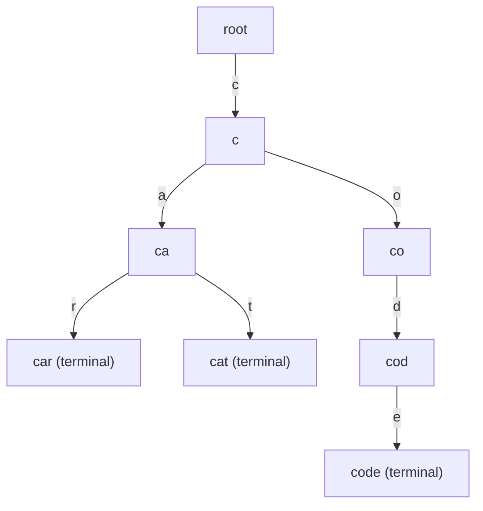
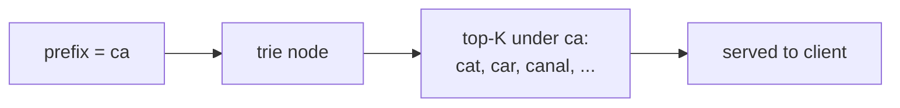
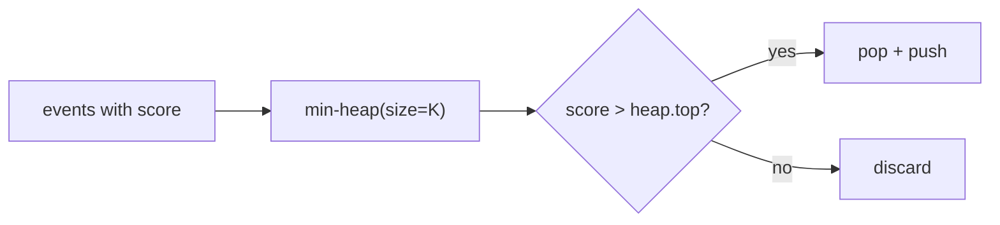
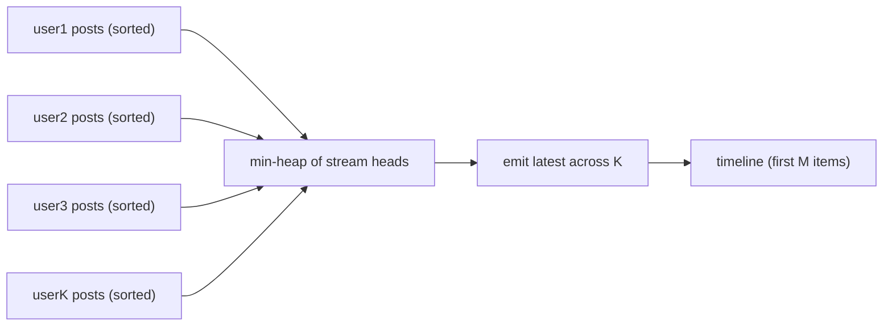
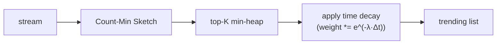
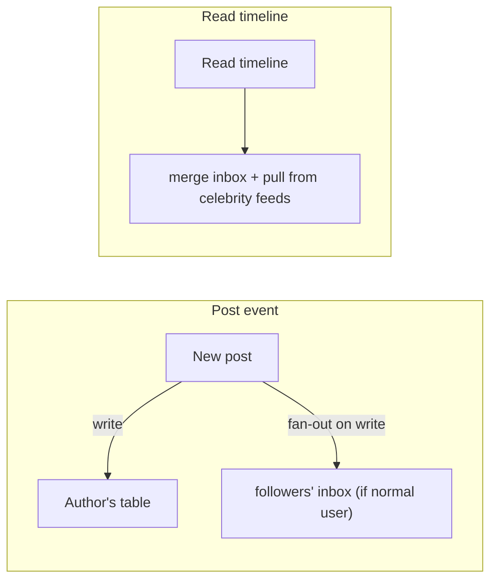
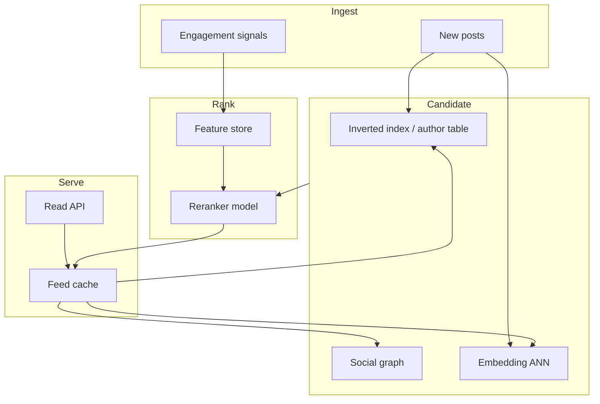

# Tries, Heaps & Feed Algorithms

> **Difficulty:** Easy–Medium | **Interview frequency:** High (search, feeds, recs)  
> **Design context:** [Autocomplete](../05-DesignMedium/05-Autocomplete.md), [News Feed](../05-DesignMedium/03-NewsFeed.md), [Design Twitter](../05-DesignMedium/08-Twitter.md)

This note covers the three canonical data structures/patterns that show up in **typeahead, trending, and feed** designs: **tries** for prefix lookup, **heaps** for top-K / merge, and the **fan-out read vs write** decision that shapes every timeline system.

---

## Contents

- [1. Trie (prefix tree)](#1-trie-prefix-tree)
- [2. Compressed tries: radix / patricia / ternary](#2-compressed-tries-radix--patricia--ternary)
- [3. Top-K with a min-heap of size K](#3-top-k-with-a-min-heap-of-size-k)
- [4. K-way merge (news feed read path)](#4-k-way-merge-news-feed-read-path)
- [5. Trending / heavy hitters](#5-trending--heavy-hitters)
- [6. Ranking beyond recency](#6-ranking-beyond-recency)
- [7. Fan-out write vs read (Twitter-style)](#7-fan-out-write-vs-read-twitter-style)
- [8. Production architecture pattern](#8-production-architecture-pattern)
- [9. Interview prompts](#9-interview-prompts)
- [10. Further reading](#10-further-reading)

---

## 1. Trie (prefix tree)

A **trie** stores strings on edges: the path from root spells the key. Each node carries an **end-of-word** flag and optional metadata (**top-K suggestions**, weight, language).



### Operations

- **insert / search / prefix:** `O(L)` per operation where `L` is string length. Independent of number of keys stored — that is the whole point.
- **Top suggestions for prefix `p`:** descend to the node for `p`, return its precomputed top-K list.

### When to use

- **Autocomplete / typeahead:** walk prefix once; serve top-K stored at that node.
- **IP lookup:** binary tries over IP address bits; compressed variants in routers.
- **DNA / text matching:** Aho-Corasick is a trie augmented with failure links for multi-pattern search.

### Memory

Naive tries are fat: one node per character per key. You compress them.

---

## 2. Compressed tries: radix / patricia / ternary

- **Radix tree (compact prefix tree):** collapse chains of single-child nodes. Uses far less memory for sparse alphabets.
- **Patricia trie:** radix with a bit-level specialization — historically popular in routing tables.
- **Ternary search tree (TST):** node holds one char plus `<`, `=`, `>` children — uses less memory than a naive 26/256-way fanout.
- **Double-array trie / DAWG:** extreme compression; used in IME and dictionary systems.

**Interview heuristic:** *“Plain trie for simplicity; radix tree when memory matters; TST when alphabet is big (Unicode).”*

### Trie + top-K augmentation

For typeahead you store at each node a **sorted list** (or min-heap) of the K best completions under that subtree. Updating a popularity score only touches `O(L)` ancestors.



---

## 3. Top-K with a min-heap of size K

**Goal:** given a stream (or large list) of scored items, keep the **K highest**.

Algorithm:

1. Maintain a min-heap of size K.
2. For each new item: if heap has < K elements → push; else if item > heap.top → pop + push.
3. End: heap contains top-K (not sorted unless you drain).

Cost: `O(N log K)` — way better than sorting all `N`.



**Uses:** trending hashtags, hot products, leaderboard trimming, chunked MapReduce reducer top-K.

---

## 4. K-way merge (news feed read path)

You follow `K` users, each user’s posts are **sorted by time** (or score). Merge in overall time order:

- Use a min-heap keyed by **next unseen post time** across K streams.
- Pop the minimum, emit it, advance that stream by one.
- Stop after collecting `M` items.

Cost: `O(M · log K)` — independent of total posts across all K streams.



This is literally how a **fan-out-on-read** timeline works: the heap merge **is** the read path.

---

## 5. Trending / heavy hitters

For “trending in the last hour” you want **approximate** heavy hitters in a **sliding window**.

Building blocks:

- **Count-Min Sketch** (see [Probabilistic Data Structures](03-ProbabilisticDataStructures.md)) to estimate per-item counts with tiny memory.
- **Min-heap of size K** on CMS estimates → approximate top-K.
- **Time decay** (exponential or windowed) so older events fade.
- **Per-shard aggregation → merge** at a root — trending is embarrassingly parallel.



**Interview line:** *“Trending is CMS + heap + decay, not SQL sort.”*

---

## 6. Ranking beyond recency

Pure reverse-chronological is rare today. A common practical formula:

```text
score = w1·relevance + w2·recency + w3·engagement + w4·affinity − penalties
```

Two-stage retrieval is standard:

1. **Candidate generation:** cheap — inverted index / embedding ANN / user graph — produces hundreds of candidates.
2. **Reranker:** heavier ML model scores the candidates; final top-N served.

This is the pattern in News Feed, YouTube, TikTok-style feeds, and search results.

---

## 7. Fan-out write vs read (Twitter-style)

Two extreme timeline designs, mixed in practice:

### Fan-out on write (push)

When user `U` posts, **write the post into every follower’s timeline**.  
Each follower has a ready-to-read materialized feed.

- Read is cheap (read a single list).
- Write is expensive for **celebrities** (millions of followers → millions of writes).

### Fan-out on read (pull, k-way merge)

At read time, **fetch recent posts from each followee** and merge via heap.

- Write is cheap (single post).
- Read is expensive if user follows many people.

### Hybrid (reality)

- **Celebrities** use fan-out on read; **normal users** use fan-out on write.
- Often combined with **push to warm inbox** + **pull for cold followers**.
- **Caches** at multiple layers; precomputed feeds for active users only.



---

## 8. Production architecture pattern

A typical feed system end-to-end:



Key patterns: **two-stage retrieval**, **precompute for heavy users**, **cache top-K per prefix / per user**, **graceful degradation** (“stale feed > failed feed”).

---

## 9. Interview prompts

1. **“Design autocomplete.”**  
   Trie (or radix tree) + per-node top-K list; offline pipeline updates top-K from query logs with decay; front fronted by CDN for popular prefixes.

2. **“Top 100 hashtags in the last 15 minutes?”**  
   Count-Min Sketch per minute + min-heap of size 100 + sliding window (drop oldest minute). Merge per-shard top-Ks at the root.

3. **“How to merge timelines of K users?”**  
   K-way merge with a min-heap keyed by next post time. `O(M log K)` for M results.

4. **“Fan-out write vs read for a celebrity problem?”**  
   Hybrid: fan-out on write for normal users; fan-out on read for celebrities; merge on read.

5. **“Why not just sort all posts?”**  
   Cost scales with total corpus. Heap/k-way merge scales with **K streams × M output** — vastly cheaper.

6. **“Memory usage of a naive trie?”**  
   `O(total characters × fanout)`; compress with radix/TST for real systems.

---

## 10. Further reading

- Aho & Corasick — [Efficient String Matching (1975)](https://dl.acm.org/doi/10.1145/360825.360855).
- Metwally, Agrawal, El Abbadi — [Efficient Computation of Frequent and Top-k Elements in Data Streams](https://www.cs.ucsb.edu/~sudipto/tcs/PostScript/demaine.pdf) (Space-Saving).
- Misra & Gries — [Finding repeated elements (1982)](https://www.cs.utexas.edu/users/misra/scannedPdf.dir/FindRepeatedElements.pdf).
- Twitter Engineering — [Timelines at scale](https://blog.twitter.com/engineering/en_us/a/2013/timelines-at-scale).
- LinkedIn Engineering — [Feed ranking and Airbnb/YouTube style two-tower retrieval](https://engineering.linkedin.com/).
- Repo cross-refs: [Search & Indexing](../03-AdvancedConcepts/04-SearchAndIndexing.md), [Design Twitter](../05-DesignMedium/08-Twitter.md), [News Feed](../05-DesignMedium/03-NewsFeed.md).
