# Stream Windows & Time Semantics

> **Difficulty:** Medium | **Interview frequency:** Medium (metrics, fraud, analytics, ad tech)  
> **Deep dive:** [Stream Processing](../03-AdvancedConcepts/05-StreamProcessing.md) · [Delivery Semantics](../03-AdvancedConcepts/DistributedSystems/11-DeliverySemantics.md)  
> **Common problem:** [Watermarks & Late Events](../08-CommonProblems/17-WatermarksAndLateEvents.md)

## The problem this doc solves

You have an **unbounded, ordered-ish stream** of events (clicks, payments, IoT readings, GPS pings…) flowing through Kafka / Kinesis / Pub-Sub. The downstream wants **time-bucketed aggregates** — "purchases per minute", "p95 latency over the last 5 minutes", "active sessions per user", "unique visitors per hour".

Three real-world facts make this much harder than the SQL-ish version of the same question:

1. **Events arrive out of order and late.** Mobile devices buffer offline, brokers retry, partitions rebalance. An event timestamped `10:00` may show up at `10:08`, *after* an event timestamped `10:05`.
2. **The stream never ends.** Unlike batch, you can't wait for "all the data" before computing. You have to decide *when to emit a result* knowing more data may still arrive.
3. **Multiple clocks disagree.** The device clock, the broker's ingestion clock, and the worker's wall clock all differ. Which one defines "the 10:00 minute"?

Those three facts create a single fundamental tension:

> **Emit too early → you miss late data and ship wrong numbers.**  
> **Wait too long → dashboards lag and the pipeline stalls when one shard is slow.**

### How streaming systems solve it

Modern streaming engines (Flink, Beam, Spark Structured Streaming, Kafka Streams) resolve that tension with **four** orthogonal knobs. This doc explains all four and how they fit together:

| Knob | Question it answers | Sections |
|---|---|---|
| **Time domain** | Which clock counts — when the event happened, when the broker saw it, or when the worker processed it? | §2 |
| **Windowing** | How do you group an unbounded stream into bounded buckets to aggregate? | §3 |
| **Watermarks + triggers** | When is a window "done" and ready to emit? | §4, §6 |
| **Lateness handling** | What do you do with events that arrive after the window emitted? | §5 |

Everything else in this doc is plumbing that makes those four work in production: state and checkpointing (§7), exactly-once delivery (§8), stream–stream joins (§9), a worked end-to-end example (§10), and patterns by use case (§11).

If you take **one** thing away: pick **event time** for correctness, define a **window** with explicit semantics, set a **watermark** that matches your p99 lateness, and make the **sink** idempotent or upsert-keyed so re-fires don't double-count. The rest is detail.

---

## Contents

- [1. Why streaming time is hard](#1-why-streaming-time-is-hard)
- [2. Event time vs processing time vs ingestion time](#2-event-time-vs-processing-time-vs-ingestion-time)
- [3. Window types](#3-window-types)
- [4. Watermarks](#4-watermarks)
- [5. Allowed lateness & side outputs](#5-allowed-lateness--side-outputs)
- [6. Triggers (when to emit)](#6-triggers-when-to-emit)
- [7. Stateful operators & checkpointing](#7-stateful-operators--checkpointing)
- [8. Delivery semantics (exactly-once in practice)](#8-delivery-semantics-exactly-once-in-practice)
- [9. Stream–stream joins & temporal patterns](#9-streamstream-joins--temporal-patterns)
- [10. Worked example: event-time windows in action](#10-worked-example-event-time-windows-in-action)
- [11. Patterns by use case](#11-patterns-by-use-case)
- [12. Interview prompts](#12-interview-prompts)
- [13. Further reading](#13-further-reading)

---

## 1. Why streaming time is hard

In batch you wait until the data is *complete*, then compute. In streaming the data is **never complete** — you must decide *when “enough” has arrived* and *what to do if more arrives later*.

Three forces make this messy in practice:

- **Producer-side delay.** Mobile devices buffer offline; an event timestamped at 10:00 may not show up until 14:30 the next day. CDN edges, IoT gateways, and embedded clients all add their own queuing.
- **Network and broker reordering.** Retries, GC pauses, partition rebalances, and per-partition ordering (Kafka guarantees order **per partition**, not globally) mean that within one logical stream the consumer sees out-of-order timestamps.
- **Clock disagreement.** Device clocks drift; servers run NTP; two upstreams (e.g., `clicks` and `purchases`) may have different lateness distributions and different idle periods. If you join them, the *slower* side dictates progress.

### A single ride-hailing scenario showing all three forces

You're computing **"completed rides per minute per city"** by joining a `ride_started` stream (from the rider app) with a `ride_completed` stream (from the driver app). Two riders take rides starting at exactly `10:00:00`:

| Event | Source | Event time (device clock) | Reaches Kafka at | Reaches consumer at | Notes |
|---|---|---|---|---|---|
| `start_A` | Rider A's phone (Wi-Fi) | 10:00:00 | 10:00:01 | 10:00:02 | normal path |
| `start_B` | Rider B's phone (subway, offline) | 10:00:00 | **10:08:00** | 10:08:01 | offline buffered for 8 min — **producer-side delay** |
| `complete_A` | Driver A's tablet (clock skew +30s) | **10:14:30** (actually 10:14:00 wall) | 10:14:31 | 10:14:32 | bad NTP — **clock disagreement** |
| `complete_B` | Driver B's tablet | 10:18:00 | 10:18:01 | 10:18:30 | partition rebalance delays consumer |
| `complete_B` (retry) | broker redelivery | 10:18:00 | – | 10:18:35 | duplicate from at-least-once — **broker reordering / dup** |
| `start_C` | Rider C | 10:09:00 | 10:09:02 | 10:09:03 | (arrives **before** `start_B` at the consumer despite being newer) |

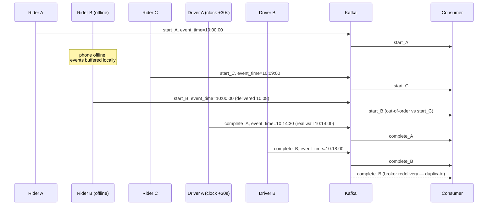

Now look at what each force forces you to handle:

1. **Producer-side delay (`start_B`).** If you used a 1-minute tumbling window on processing time and emitted at `10:01:00`, you would have reported **1 ride started in the 10:00 minute** and never corrected it. The truth is **2**. The fix is event-time windowing with allowed lateness ≥ 8 min — or, more realistically, side outputs for very-late events plus an upsert sink that lets the count for the `10:00` window keep changing for as long as your business tolerates.

2. **Network / broker reordering (`start_C` before `start_B`, `complete_B` duplicate).** The consumer must not assume that a *newer* event time is the *latest* it has seen. Watermarks must be derived from `max(event_time)` across the stream, never from arrival order. Duplicates need an idempotency key (e.g., `event_id`) — windowed `COUNT DISTINCT` on `event_id` is the cheapest way to dedupe inside the window.

3. **Clock disagreement (`complete_A`).** The driver's tablet says the ride completed at `10:14:30`, but it actually wall-clock-completed at `10:14:00`. If you grouped completes into a 1-minute event-time window using the device timestamp, you'd put it in the `10:14` window — that's *closer to truth* than processing time, but it's still wrong by 30 s. Mitigations: (a) cap allowable client clock skew at ingest by comparing to broker time and **rejecting / capping** timestamps more than `Δ` away; (b) add a server-side ingestion timestamp alongside the event timestamp and pick whichever is more trustworthy per-source.

> **The takeaway from one example.** A single 8-minute subway ride changes the count for the 10:00 window. A single bad NTP slot puts an event in the wrong minute. A single retry double-counts. A correct pipeline has to plan for all three at once — which is exactly why event-time, watermarks, allowed lateness, and idempotent sinks all exist.

A correct stream pipeline must define three things explicitly:

1. **Which clock counts** (event vs processing vs ingestion).
2. **When results are emitted** (windows + triggers + watermarks).
3. **What happens if evidence changes later** (allowed lateness, retractions, side outputs).

Skip any of those and you'll either ship **wrong numbers** (silent drops, double counts) or a **stuck pipeline** (waiting forever on a slow shard).

---

## 2. Event time vs processing time vs ingestion time

| Concept | Source | Good for | Trap |
|---|---|---|---|
| **Event time** | timestamp embedded in the event (client clock) | correct business logic, backfills, dedup | needs watermarks; clocks lie |
| **Processing time** | clock of the worker handling the event | dashboards that must be “current” regardless of correctness | non-deterministic, changes on replay |
| **Ingestion time** | timestamp assigned when message enters Kafka/Kinesis | deterministic on replay, ignores client clocks | doesn’t reflect the actual event |

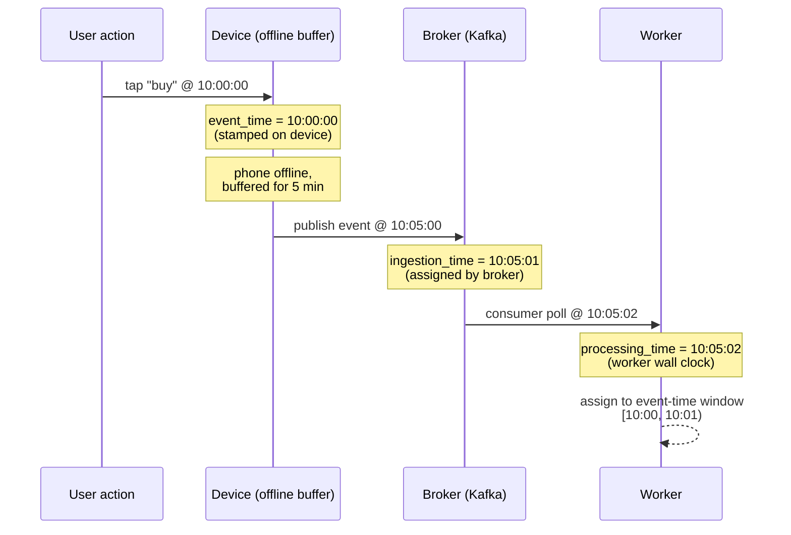

**Rule:** use **event time** for correctness, **processing time** only for SLAs and monitoring.

### Why the choice changes the answer

Imagine three events for one user with these timestamps:

| Event | Event time (device) | Ingestion time (broker) | Processing time (worker) |
|---|---|---|---|
| `e1` | 10:00:05 | 10:00:06 | 10:00:07 |
| `e2` | 10:00:55 | 10:01:02 | 10:01:02 |
| `e3` | 10:00:30 (offline → flushed late) | 10:05:11 | 10:05:11 |

Now count "events in the 10:00–10:01 window":

- **Processing-time** windowing → the 10:00 window contains `{e1, e2}` (2 events). `e3` falls into the 10:05 window. **Wrong by user intent.**
- **Ingestion-time** windowing → same answer as processing time on this stream; deterministic on replay but still semantically wrong.
- **Event-time** windowing → the 10:00 window contains `{e1, e2, e3}` (3 events) — but only if you wait long enough, or accept a late update.

That trade-off — **wait longer for correctness vs emit sooner with possible revisions** — is the entire job of watermarks, allowed lateness, and triggers below.

---

## 3. Window types

Windows group events for aggregation. The main families:

### Tumbling

Fixed width, **non-overlapping**. Every event lands in **exactly one** window.

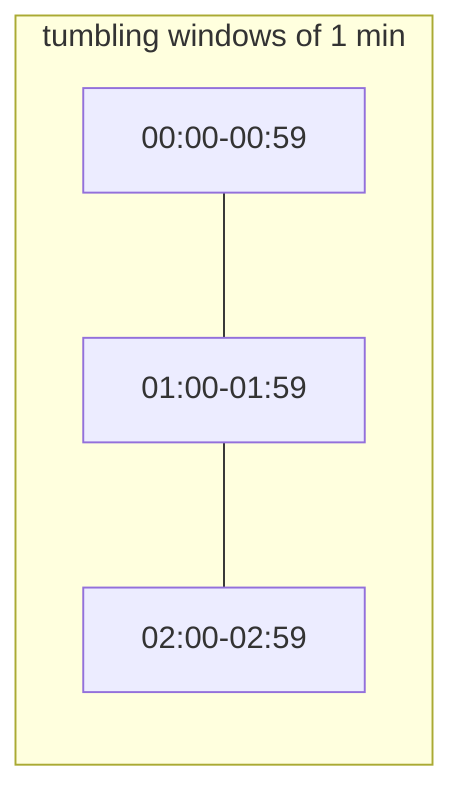

### Sliding

Fixed width, **advances by a step < width** → events belong to **multiple** windows. Great for rolling averages.

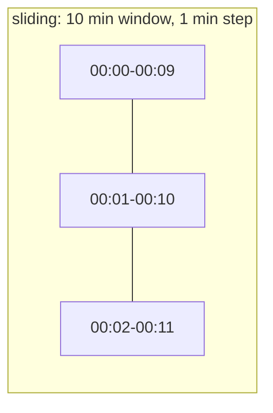

### Session

**Gap-based** grouping. A user session ends when no events arrive for `gap` time.

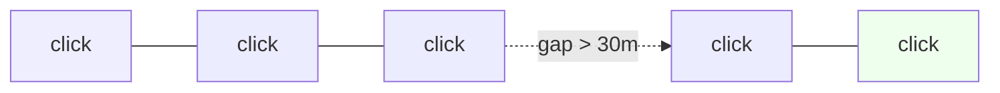

### Global / custom

One unbounded window emitted on triggers. Used for custom logic (e.g., per-user all-time top-K with decay).

### Sizing intuition (how much state will you carry?)

State cost roughly tracks *how many windows are open per key at once*:

- **Tumbling (`width = w`):** at most **1** active window per key at a time → cheapest.
- **Sliding (`width = w`, slide = `s`):** every event materializes into `⌈w / s⌉` windows. A 1-hour window with a 1-minute slide multiplies state and emit volume by **60×**. If you only need recent estimates, prefer a single sliding aggregate maintained with a **deque** or **HyperLogLog with windowed merge** instead of materializing every sub-window.
- **Session (`gap = g`):** state per key grows with active session length; sessions **merge dynamically** when a new event lands inside the gap of two existing sessions, so the operator must support window merging.
- **Global:** state is bounded only by your trigger / eviction policy — be careful.

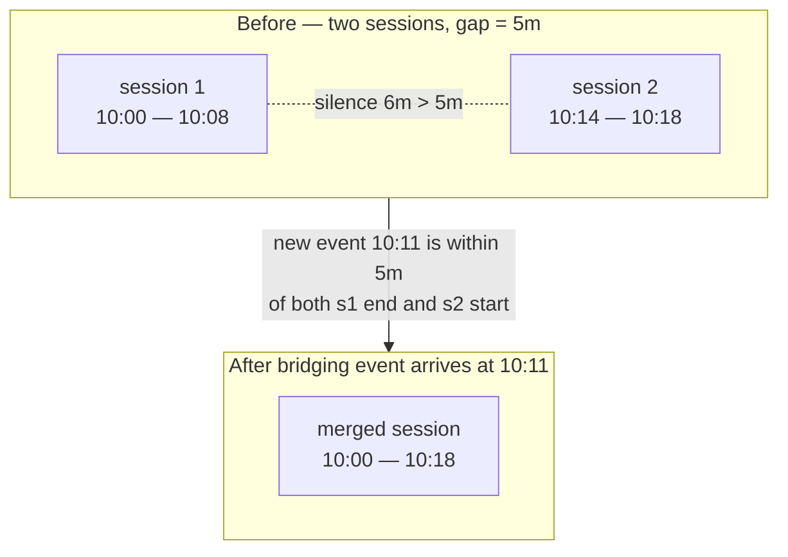

**Interview line:** *“tumbling for accounting, sliding for moving averages, session for user behavior — and remember sliding multiplies your state by `width / slide`.”*

---

## 4. Watermarks

A **watermark** `W(t)` is a best-effort claim:  
> *“We believe we have seen all events with event time `≤ t`.”*

It is **not** a guarantee — it is the point after which you emit window results.

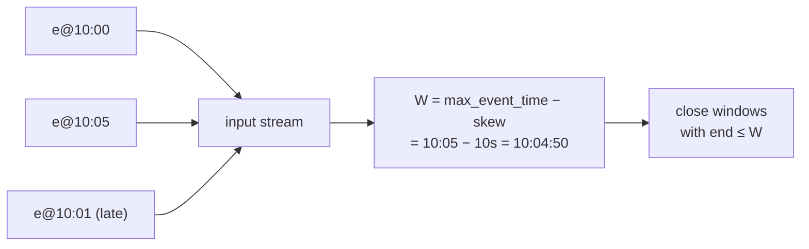

A watermark has three required properties:

1. **Monotonic.** It only moves forward — once you emit `W=10:05`, you may never go back.
2. **Best-effort.** Stragglers may still arrive; the watermark is a *promise to act*, not a *truth*.
3. **Per-stream / per-operator.** Each operator carries its own watermark, computed from upstream watermarks.

### Heuristic vs perfect watermarks

Borrowing Akidau's terminology:

- **Perfect watermark** — possible only when the source can prove completeness (e.g., a closed log file, an end-of-batch marker, a bounded ingestion path). When `W(t)` advances past `t`, **no** event with event-time `≤ t` will ever appear. Late events are by construction impossible.
- **Heuristic watermark** — what real systems use. Computed from observed lateness, e.g., `W = max_seen_event_time − allowed_skew`. Some events will arrive *after* the watermark passes them — that's why allowed lateness exists.

### Generating watermarks

- **Periodic** (most common): every N ms, emit `W = max_seen_event_time − max_out_of_order_skew`. Tune the skew from your **p99 lateness** offline. Too small → frequent late events. Too large → high end-to-end latency.
- **Punctuated**: certain events (e.g., end-of-batch markers, schema flush points) carry watermarks. Used when the source itself knows it has shipped everything up to time `t`.
- **Per-partition** watermarks combine via the **min** across partitions: the global watermark of an operator is `min(W₁, W₂, …, Wₙ)` across its inputs. A slow or idle shard therefore holds back the entire pipeline.

### Idle partitions: the silent stall

If one Kafka partition has no traffic, its watermark stays frozen at the last seen event time. The downstream operator's watermark = `min(active_partitions, idle_partition)` → never advances → **windows never close**.

Mitigations:

- **Idle source detection** (Flink: `withIdleness(Duration)`) — after `t` of silence, mark the partition as idle and exclude it from the `min`.
- **Wall-clock watermark heartbeats** — emit synthetic watermark messages on quiet partitions.
- **Force assignment** so every active key hashes to many partitions, reducing the chance any one partition goes idle.

### What happens when a watermark passes a window's end?

In Flink: the `WindowOperator` marks the window "ready to emit"; per the [Flink streaming_analytics docs](https://nightlies.apache.org/flink/flink-docs-release-1.13/docs/learn-flink/streaming_analytics/), watermarks control the **lifetime** of windows; records still route into windows that remain active (i.e., within allowed lateness). When *both* watermark > `window_end` *and* allowed lateness has passed, the window's state is **garbage-collected** — late events arriving after that go to the side output (or are dropped).

```mermaid
sequenceDiagram
  participant E as Events
  participant W as WindowOperator
  participant L as Late stream / sink
  E->>W: e@10:00:30
  Note over W: W = 10:00:30 − 10s = 10:00:20
  E->>W: e@10:00:55
  Note over W: W = 10:00:55 − 10s = 10:00:45<br/>still &lt; window end 10:01:00
  E->>W: e@10:01:05
  Note over W: W = 10:01:05 − 10s = 10:00:55<br/>still &lt; window end 10:01:00
  E->>W: e@10:01:30
  Note over W: W = 10:01:30 − 10s = 10:01:20<br/>≥ 10:01:00 → fire [10:00, 10:01)
  E->>W: e@10:00:45 (late)
  alt within allowed lateness
    W-->>L: re-fire window with updated count
  else past allowed lateness
    W-->>L: route to side output
  end
```

---

## 5. Allowed lateness & side outputs

Two separate knobs (do not confuse them):

| Knob | What it does |
|---|---|
| **Watermark delay** | Holds off the first firing of a window so stragglers have time to arrive. |
| **Allowed lateness** | After the watermark passes the window end, keep window state alive **for this extra duration**; late events re-fire the window (updated results). |
| **Side output** | After allowed lateness expires, route very-late events to a separate stream for audit/reprocessing instead of silently dropping. |

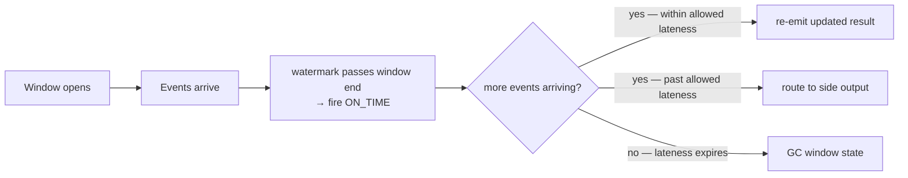

### How the downstream must absorb late updates

The window can fire **multiple times** for the same `(key, window)`. Sinks fall into three classes:

| Sink type | Behavior on re-fire | Use when |
|---|---|---|
| **Append-only** (e.g., raw Kafka topic, S3 object per fire) | Each fire is a separate row → easy double-counting if you `SUM` blindly | Audit logs; or downstream aggregator does `LAST_VALUE` per `(key, window)` |
| **Upsert / keyed** (e.g., DynamoDB, Cassandra by `(key, window_start)`, OLAP merge) | Latest fire overwrites previous → naturally correct | Dashboards, query-serving stores |
| **Retract + accumulate** (e.g., Flink Table API → upsert sink, materialized views) | Each fire emits a `(retract previous, insert new)` pair | Multi-stage pipelines where another aggregator consumes the result |

Pick the sink contract **before** picking the trigger and lateness — they must agree.

### Concrete numeric example

Window `[10:00, 10:01)`, `width=1m`, `watermark_skew=10s`, `allowed_lateness=5m`:

- `t = 10:01:10` — watermark crosses `10:01:00`. Window fires with current count = 42.
- `t = 10:02:30` — late event with `event_time = 10:00:45` arrives. Within allowed lateness → window re-fires with count = 43. Sink upserts.
- `t = 10:06:30` — even later event with `event_time = 10:00:50` arrives. Past allowed lateness → routed to side output. Window state is GC'd.

---

## 6. Triggers (when to emit)

Windows and triggers are **independent**. A trigger decides *when* a window produces output:

- **On watermark** (default for event-time windows): emit once when watermark crosses the window end.
- **Processing-time triggers**: “emit every 10 seconds regardless” for live dashboards.
- **Count triggers**: emit every 100 events — good for partial aggregates.
- **Composite**: “emit as soon as watermark passes OR every 30 s, whichever is first” — gives low-latency early results, then corrected final results.

Pair with **accumulation mode**:

- **Discarding**: each firing contains only the new data since last firing.
- **Accumulating**: each firing is the current full window aggregate.
- **Accumulating + retracting**: each firing also sends a retraction of the previous value — required for correct downstream aggregations.

### Beam-style panes: EARLY / ON_TIME / LATE

Apache Beam (the conceptual reference for most modern streaming) labels each fire with a **pane kind**:

- **EARLY** — fired *before* the watermark passed the window end (a speculative result for low-latency dashboards).
- **ON_TIME** — fired exactly when the watermark crossed the window end; usually the "official" result.
- **LATE** — fired after the watermark, due to allowed-lateness re-fires.

Sinks can use the pane kind to decide what to do: e.g., write EARLY panes to a fast-but-approximate dashboard topic, only commit ON_TIME panes to the billing system, and route LATE panes to a reconciliation job. This separation is what makes "fast and correct" tractable in the same pipeline.

---

## 7. Stateful operators & checkpointing

Windows are stateful. That state must survive worker failures:

- **Keyed state**: per-key, partition-local, ideal for windows.
- **Checkpoints**: periodic snapshots to durable storage (S3 / HDFS / RocksDB state backend).
- **Exactly-once state** is achieved by **coordinated checkpoints** (Flink’s Chandy-Lamport-based barriers) combined with **transactional sinks**.

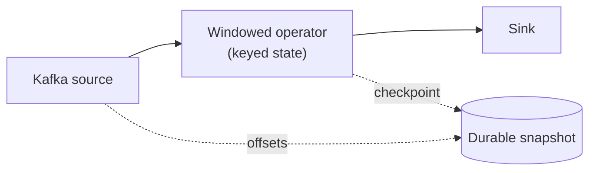

On failure, state and source offsets roll back **together**, so results do not diverge.

### State backends

The state backend decides where window state lives and how snapshots are taken:

- **In-memory / heap** — fastest, but state must fit in JVM heap; checkpoints are full copies. Fine for small keyspaces (≤ a few GB).
- **RocksDB (embedded LSM)** — state spills to local SSD; supports **incremental checkpoints** (only changed SSTables uploaded to remote durable storage). The default for production Flink jobs with large keyed state. Read-amp is real, so keep windows narrow when possible.
- **Remote KV** (less common) — every state op is a network call; only worth it for jobs that need elastic statefulness independently of compute.

### Checkpoints vs savepoints

- **Checkpoints** — automatic, frequent (e.g., every 30s), tuned for fast recovery. Format may be runtime-internal.
- **Savepoints** — manual, durable, version-stable snapshots. Used to **upgrade code**, **rescale parallelism**, or **migrate operators** without losing state.

A common interview trap: "How do you change the parallelism of a windowed Flink job without losing state?" → trigger a savepoint, restart with new parallelism from the savepoint. Flink redistributes keyed state by **key group**, so any parallelism up to the configured `maxParallelism` works.

---

## 8. Delivery semantics (exactly-once in practice)

“Exactly-once” has two flavors that interviewers often conflate:

- **Processing exactly-once**: state updates happen effectively once under failure — Flink checkpoints, Kafka Streams + transactions.
- **Exactly-once end-to-end**: including sink effects. Requires **transactional** or **idempotent** sinks (Kafka transactions, upsert into a key-addressed store, write with a deterministic event-id).

Most teams ship **at-least-once** + **idempotent sinks**: simpler, cheaper, and equally correct for the user.

### How transactional sinks actually work (two-phase commit)

End-to-end exactly-once with a transactional sink is a **2PC tied to checkpoint barriers**:

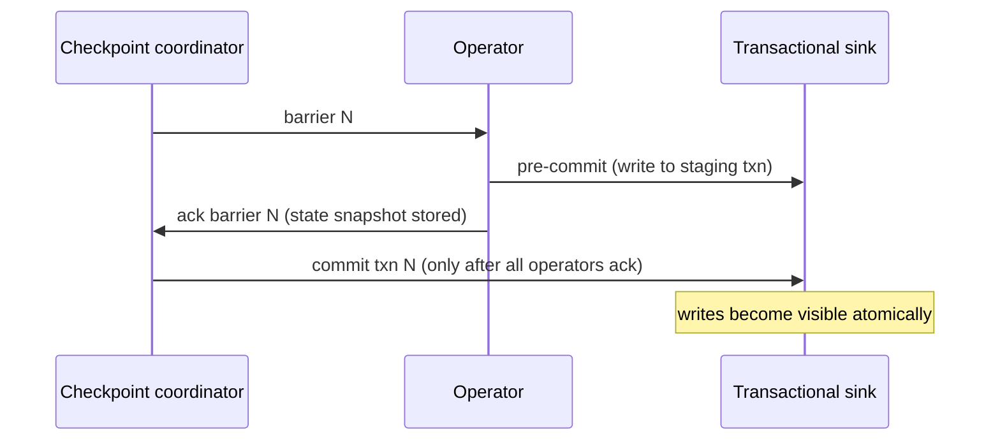

If the job fails between **pre-commit** and **commit**, recovery rolls source offsets back to barrier `N-1`, the staged transaction is **aborted**, and the data is reprocessed cleanly. Kafka's transactional producer, Iceberg/Delta sinks, and JDBC sinks with XA all implement this contract.

What this gives you:

- Each event affects the sink **at most once** even under crashes.
- It does **not** make your business logic deterministic — non-deterministic operators (e.g., calls to a flaky external API) can still produce different state on replay; pin those behind idempotent keys.

See [Delivery Semantics](../03-AdvancedConcepts/DistributedSystems/11-DeliverySemantics.md).

---

## 9. Stream–stream joins & temporal patterns

Joining two streams introduces a second time problem: *how long do you keep the right side around waiting for a match?*

### Interval join

For each event on the left stream, match events on the right stream whose event-time falls within `[event.time − before, event.time + after]`.

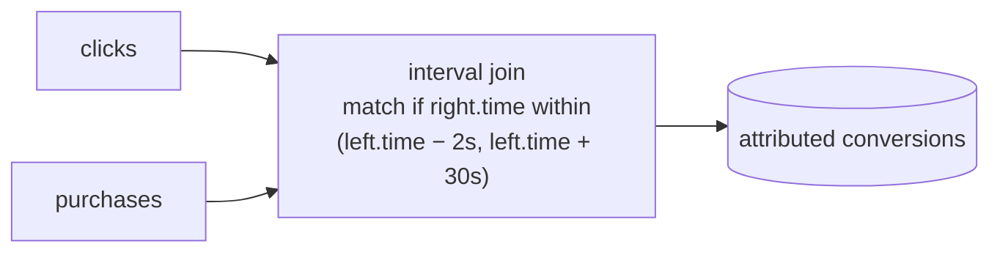

State cost = events on each side × interval width / event rate. The watermark of the join operator is the **min** of both inputs minus the join interval — a classic place where an idle partition on one side stalls the join.

### Windowed join

Both streams are bucketed into the *same* tumbling/session window and joined inside the window. Cheaper than interval join but requires that both timestamps fall in the same bucket — a 23:59:58 click and a 00:00:01 purchase will land in different minute windows.

### Temporal table join (versioned lookup)

The right side is a **changelog stream** representing the latest state of a slowly changing dimension (e.g., FX rates, product catalog). For each left event, you join against the right side's value **as of left.event_time**.

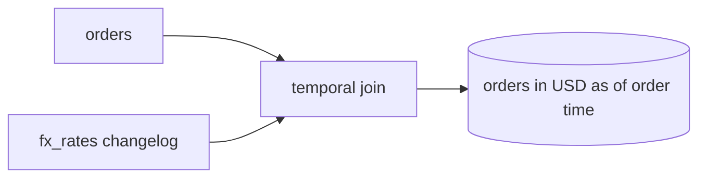

This is the "right" way to enrich an event with reference data without using stale or future-dated values — critical for finance, billing, and audit pipelines.

### Common gotchas

- **State retention** must be set per join; otherwise the right side accumulates forever.
- **Asymmetric lateness** — if the right side is consistently 2 minutes late, your join's watermark is also 2 minutes behind. Configure per-input watermark strategies.
- **Skew** — joining on `user_id` is fine; joining on `country` will hot-spot a few partitions.

---

## 10. Worked example: event-time windows in action

Pipeline: count `purchase` events per minute per `merchant_id`. Settings:

- `window = tumbling 1 min`
- `watermark = max_event_time − 10s`
- `allowed_lateness = 2 min`
- Sink = key-value store keyed by `(merchant_id, window_start)` (upsert)

Events arrive in this order at the operator (we show only event time, all for `merchant=M1`, all in window `[10:00:00, 10:01:00)` unless noted):

| # | event_time | processing_time | watermark after | window state for `[10:00,10:01)` | action |
|---|---|---|---|---|---|
| 1 | 10:00:05 | 10:00:06 | 09:59:55 | count=1 | buffered |
| 2 | 10:00:30 | 10:00:31 | 10:00:20 | count=2 | buffered |
| 3 | 10:00:55 | 10:00:56 | 10:00:45 | count=3 | buffered |
| 4 | 10:01:10 | 10:01:11 | 10:01:00 | count=3 | watermark crosses 10:01:00 → **fire ON_TIME**, sink upsert: `(M1, 10:00) = 3` |
| 5 | 10:00:40 (late) | 10:02:30 | 10:01:00 | count=4 | within 2 min lateness → **fire LATE**, sink upsert: `(M1, 10:00) = 4` |
| 6 | 10:00:50 (very late) | 10:04:30 | 10:01:00+ | – | within 2 min lateness, late again → **fire LATE**, sink upsert: `(M1, 10:00) = 5` |
| 7 | 10:00:10 (way late) | 10:08:00 | – | (state GC'd at 10:03:01) | past lateness → **side output** for offline reconciliation |

Reading this table is exactly the kind of question you'll get in an interview ("walk me through what happens when…"). The same table also explains why your sink contract matters: a plain append sink would have written `3, 4, 5` and a downstream `SUM` would report **12**. The keyed upsert sink writes `3 → 4 → 5` to the same row and any reader sees `5`.

If you wanted a low-latency dashboard alongside the official count, you'd add an **EARLY trigger** firing every 10 seconds of processing time. Each EARLY pane carries a partial count; the dashboard treats it as a hint. The ON_TIME pane is the source of truth for billing.

---

## 11. Patterns by use case

| Use case | Time model | Window | Notes |
|---|---|---|---|
| Real-time dashboard p95 latency | event-time | tumbling 1 min | allow ~1 min lateness; processing-time early triggers for UI |
| Fraud velocity (5 tx in 1 min) | event-time | sliding 1 min step 5 s | keyed by card_id; side output for very late |
| Ad impression counting | event-time | tumbling 1 min | long allowed lateness (mobile logs) + retraction to billing store |
| User sessionization | event-time | session, gap 30 min | per-user keyed state; accumulate events |
| A/B test exposure | event-time | tumbling day | idempotent sink by `(experiment_id, user_id)` |
| Metrics → alerting | mixed | tumbling + processing-time trigger | alerting cares about latency more than completeness |

---

## 12. Interview prompts

1. **“Event time vs processing time?”**  
   Event time is when the thing happened; processing time is when the system saw it. Event time is correct but needs watermarks; processing time is fast but non-deterministic.

2. **“What is a watermark?”**  
   A monotonic claim that no events with event time `≤ W(t)` will (practically) arrive. Drives window firing and late-event handling.

3. **“Tumbling vs sliding vs session?”**  
   Non-overlap, overlap with step, gap-based. Pick by semantics.

4. **“Exactly-once in streaming — is it real?”**  
   Processing exactly-once is real via coordinated checkpoints; end-to-end requires transactional or idempotent sinks. In practice, at-least-once + idempotent sinks ship most products.

5. **“How to handle 2-day-late events?”**  
   Allowed lateness + side output → separate late-arrival job that retracts/upserts final aggregates in a query-serving store.

6. **“What if one Kafka partition lags badly?”**  
   Global watermark = min across partitions; a slow shard stalls window emissions. Mitigate with idle-partition detection, partition-aware watermarks, or backfills.

---

## 13. Further reading

- Akidau et al. — [The Dataflow Model (VLDB 2015)](https://research.google/pubs/pub43864/) (canonical treatment of windows, triggers, accumulation).
- Tyler Akidau — [Streaming 101](https://www.oreilly.com/radar/the-world-beyond-batch-streaming-101/) and [Streaming 102](https://www.oreilly.com/radar/the-world-beyond-batch-streaming-102/).
- Apache Flink docs — [Event time & watermarks](https://nightlies.apache.org/flink/flink-docs-release-1.18/docs/concepts/time/), [Windows](https://nightlies.apache.org/flink/flink-docs-release-1.18/docs/dev/datastream/operators/windows/).
- Kafka — [Streams exactly-once semantics](https://docs.confluent.io/platform/current/streams/concepts.html#processing-guarantees).
- Cross-refs: [Stream Processing](../03-AdvancedConcepts/05-StreamProcessing.md), [Watermarks & Late Events](../08-CommonProblems/17-WatermarksAndLateEvents.md), [Delivery Semantics](../03-AdvancedConcepts/DistributedSystems/11-DeliverySemantics.md).


#SIMPLE EXPLANATION 
# 🌊 Understanding Watermarks in Stream Processing

## 🧠 The Core Idea

In streaming systems, data:
- arrives **late**
- arrives **out of order**
- never really “finishes”

So the system must decide:

> **“When can I safely say I’ve seen all events up to a certain time?”**

👉 That decision mechanism is called a **watermark**.

---

## 💡 Simple Definition

A **watermark** is:

> “I believe all events with event time ≤ T have already arrived.”

⚠️ Important:
- It’s a **guess**, not a guarantee
- Late events can still arrive

---

## 🚶 Step-by-Step Intuition

### Step 1: Track latest event time

The system keeps track of:


max_event_time_seen


Example:

| Event | Event Time |
|------|-----------|
| E1 | 10:00 |
| E2 | 10:05 |
| E3 | 10:03 |

👉 `max_event_time = 10:05`

---

### Step 2: Assume delay (out-of-order tolerance)

We assume:

> “Events can arrive up to 10 seconds late”

---

### Step 3: Compute watermark


watermark = max_event_time − allowed_delay


Example:


watermark = 10:05 − 10s = 10:04:50


---

## 🧩 What This Means

The system is saying:

> “I’m confident I’ve seen all events up to 10:04:50”

---

## 🚨 What Do We Use It For?

👉 **Closing windows**

---

## 🪟 Example Window

Window = `[10:00 – 10:01)`

We close it when:


watermark ≥ 10:01:00


---

## 📊 Full Example Timeline

### Events arriving:

| Arrival Order | Event Time |
|--------------|-----------|
| E1 | 10:00:10 |
| E2 | 10:00:40 |
| E3 | 10:01:10 |

---

### Step-by-step:

#### After E1:
- max = 10:00:10  
- watermark = 10:00:00  

👉 Window still open  

---

#### After E2:
- max = 10:00:40  
- watermark = 10:00:30  

👉 Still open  

---

#### After E3:
- max = 10:01:10  
- watermark = 10:01:00  

💥 Watermark reached window end  

👉 CLOSE window `[10:00–10:01)`

---

## 🎯 Key Insight

👉 Watermark is NOT about arrival time  

👉 It represents:

> “Progress in event time”

---

## 🤯 Why Subtract Delay?

If we didn’t:


watermark = max_event_time


Then:
- Windows would close immediately  
- Late events would be lost  

So we subtract delay to **wait for stragglers**

---

## ⚖️ Tradeoff

| Delay | Result |
|------|-------|
| Small delay | Faster results, more errors |
| Large delay | Slower results, more accurate |

---

## 🔥 What If Watermark Is Wrong?

Example:
- Watermark says window is done
- But a late event arrives

👉 That event is:

- Accepted (if within allowed lateness)
- OR dropped / sent to side output

---

## 🧠 Simple Analogy

Imagine:

You’re waiting for friends for a **10:00 meeting**

You decide:

> “If it’s 10:10, I assume everyone has arrived”

👉 That decision point = **watermark**

But:
- Someone may still arrive at 10:12 😅  

👉 That’s a **late event**

---

## 📌 One-Line Mental Model

> **Watermark = confidence boundary in time**

---

## 💬 Interview Explanation

> “A watermark is a heuristic that estimates event-time completeness. It’s typically computed as max observed event time minus a delay, and it determines when windows can be emitted.”

---

## ⚠️ Common Mistakes

❌ Watermark is exact  
→ No, it’s approximate  

❌ Uses arrival time  
→ No, uses **event time**  

❌ Guarantees no late data  
→ No, late data can still happen  

---

## ✅ Summary

- Streaming data is **unbounded and messy**
- We **estimate completeness** using watermarks
- We **close windows** based on watermark
- We **handle late data separately**