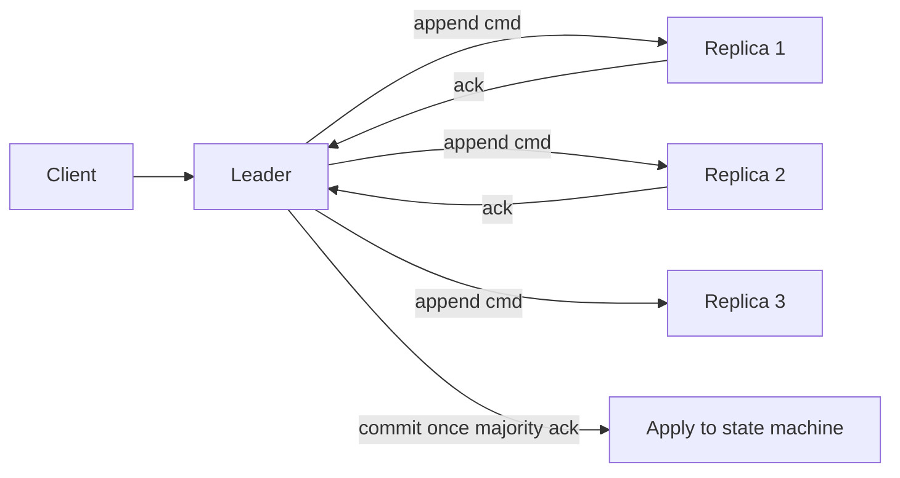
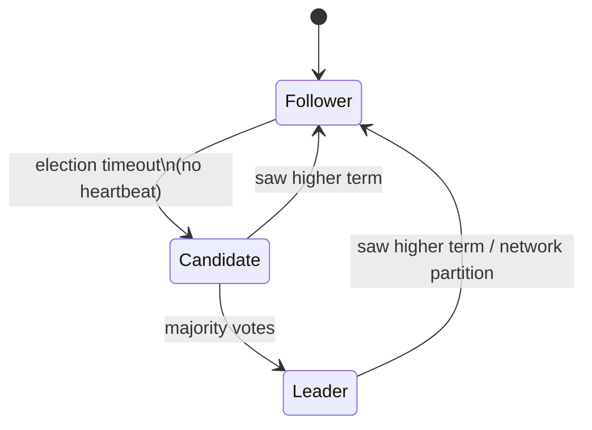
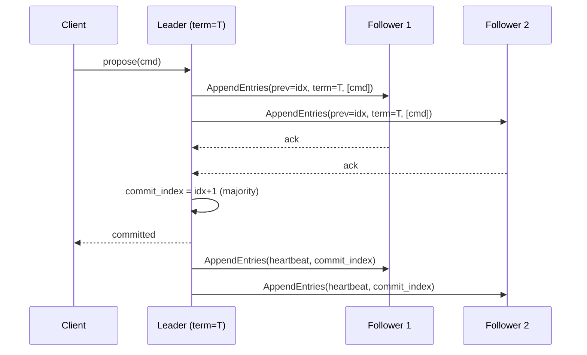

# Consensus & Leader Election

> **Difficulty:** Hard | **Interview frequency:** High for infra-heavy loops  
> **Deep dive:** [Consensus](../03-AdvancedConcepts/02-Consensus.md) · [Distributed Transactions](../03-AdvancedConcepts/03-DistributedTransactions.md)

Consensus is how a distributed system makes **one** decision that survives crashes, message loss, and network partitions. Leader election is a specific consensus problem (“pick a leader and agree on it”). Every serious control plane — etcd, ZooKeeper, Kafka KRaft, CockroachDB, Spanner — runs some flavor of this. You need to explain **what it guarantees**, **what it costs**, and **when not to reach for it**.

---

## Contents

- [1. The consensus problem](#1-the-consensus-problem)
- [2. FLP, CAP, and why we use partial synchrony](#2-flp-cap-and-why-we-use-partial-synchrony)
- [3. Raft (step by step with diagrams)](#3-raft-step-by-step-with-diagrams)
- [4. Paxos family](#4-paxos-family)
- [5. ZAB (ZooKeeper)](#5-zab-zookeeper)
- [6. Byzantine vs crash fault tolerance](#6-byzantine-vs-crash-fault-tolerance)
- [7. Leader election without consensus](#7-leader-election-without-consensus)
- [8. Operational topics (quorum, snapshots, reads)](#8-operational-topics-quorum-snapshots-reads)
- [9. Patterns by use case](#9-patterns-by-use-case)
- [10. Interview prompts](#10-interview-prompts)
- [11. Further reading](#11-further-reading)

---

## 1. The consensus problem

A consensus protocol ensures all non-failing nodes agree on a **value** (or, in **state-machine replication**, a totally ordered **log** of values):

- **Agreement:** no two non-faulty nodes decide different values.
- **Validity:** the decided value was proposed by some node.
- **Termination:** every non-faulty node eventually decides (under liveness assumptions).
- **Integrity:** nodes decide at most once.

For distributed databases we use **state-machine replication** (SMR): replicate a log of commands; apply in the same order on every replica; all replicas produce the same state.



---

## 2. FLP, CAP, and why we use partial synchrony

- **FLP (Fischer–Lynch–Paterson, 1985):** in a fully async model with even **one** crash, no deterministic consensus is guaranteed to terminate. Real systems assume **partial synchrony** (eventually-bounded delays) and use **timeouts + randomness** to make progress.
- **CAP:** during a **partition**, you pick **Consistency** or **Availability**. Consensus systems are firmly **CP** — minority partitions lose availability on writes to preserve linearizability.

Practical implication: do not model latency as free. Every commit is at least **one round trip to a majority**.

---

## 3. Raft (step by step with diagrams)

Raft (Ongaro & Ousterhout, 2014) was designed for **understandability**. It decomposes consensus into three sub-problems: **leader election**, **log replication**, **safety**.

### Node states



### Leader election

- Each node has a monotonic **term**.
- On timeout a follower becomes a **candidate**, increments term, votes for itself, sends `RequestVote` to peers.
- Peers vote **at most once per term** and only for candidates whose log is at least as up-to-date as theirs.
- **Randomized timeouts** reduce simultaneous candidates (split votes).

### Log replication



- **AppendEntries** carries `prev_log_index` and `prev_log_term` — a consistency check that detects divergence.
- Once a **majority** acknowledge an entry, the leader advances **commit_index** and applies to the state machine.

### Safety properties

- **Election Restriction:** a candidate can become leader only if its log contains all committed entries — prevents losing committed data.
- **Log Matching:** if two logs share an `(index, term)`, all previous entries are identical.
- **Leader Completeness:** once an entry is committed in term `T`, every leader in terms `> T` has it.

### Membership changes

Adding/removing nodes is hard (two different majorities could coexist). Raft uses **joint consensus** (two-phase configuration change) or **single-server changes**.

**Used in:** etcd, Consul (Raft mode), CockroachDB, TiKV, Neo4j Causal Clustering, **Kafka KRaft** (the metadata replacement for ZooKeeper). See [Red Hat — Kafka KRaft deep dive](https://developers.redhat.com/articles/2025/09/17/deep-dive-apache-kafkas-kraft-protocol).

---

## 4. Paxos family

### Basic Paxos

Agrees on a **single** value. Three roles: **proposer**, **acceptor**, **learner**. Two-phase protocol: **prepare/promise** (pick a leader proposal number) then **accept/accepted**. Famously subtle; in practice, nobody runs Basic Paxos for a whole log.

### Multi-Paxos

Optimization: elect a **stable leader** that skips the prepare phase for a sequence of values. Effectively identical to Raft in behavior but the literature presents it differently. Used in **Chubby** (Google), **Spanner** (via Paxos groups per tablet).

### EPaxos (Egalitarian Paxos)

Leaderless Paxos variant that commits **non-conflicting** commands in a single round; conflicts fall back to two rounds. Good WAN latency, harder to implement. Used in some newer systems (e.g., research deployments, parts of commercial databases).

### Flexible Paxos

Allows different quorum shapes for prepare vs accept phases (as long as they intersect). Enables cheaper writes at the cost of more expensive elections.

```mermaid
flowchart LR
  B[Basic Paxos] --> M[Multi-Paxos]
  M --> R[Raft\n(same essence, understandable)]
  B --> E[EPaxos\n(leaderless, conflict-aware)]
  B --> F[Flexible Paxos\n(quorum tuning)]
```

---

## 5. ZAB (ZooKeeper)

**Zookeeper Atomic Broadcast** is primary-backup atomic broadcast tuned for ZooKeeper’s write-rare / read-often workloads. Phases: **leader discovery**, **synchronization** (catch up followers to leader), **broadcast**. Like Raft, it guarantees total order of state changes.

**Used in:** ZooKeeper (clearly), historically Kafka (brokers stored metadata in ZK; KRaft replaced this), HBase master election, many legacy deployments.

---

## 6. Byzantine vs crash fault tolerance

| Model | Assumption | Typical `f` tolerated | Protocols |
|---|---|---|---|
| **Crash fault tolerance (CFT)** | Nodes crash but do not lie | `f` of `2f+1` | Raft, Paxos, ZAB |
| **Byzantine fault tolerance (BFT)** | Nodes may send arbitrary / malicious messages | `f` of `3f+1` | PBFT, Tendermint, HotStuff |

Use BFT when nodes are **mutually untrusted** (permissioned blockchains, some finance/crypto). Most internal data planes use CFT.

---

## 7. Leader election without consensus

For simple **singleton** workers, you can get away without full SMR:

- **Lease from a coordinator** (etcd lease, ZooKeeper ephemeral znode): the holder is the leader until the lease expires.
- **Fencing tokens:** the lease comes with a monotonic token; writes must carry the current token so a demoted leader’s stale writes are rejected.
- **This is still consensus underneath** — you are borrowing etcd/ZK’s consensus, not skipping it.

```mermaid
flowchart LR
  C[Worker pool] -->|compete| ETCD[etcd lease]
  ETCD -->|token N| L[Leader]
  L -->|writes include token N| DB[Storage]
  DB -->|reject if token < N| L2[Demoted leader (rejected)]
```

Martin Kleppmann’s classic post on distributed locks emphasizes this: *“Without fencing tokens, a lock is not safe under GC pauses.”*

---

## 8. Operational topics (quorum, snapshots, reads)

### Quorum sizing

- **3 nodes:** tolerates 1 failure. Common default for control planes.
- **5 nodes:** tolerates 2 failures. Recommended for important clusters.
- **Even counts (2, 4):** avoid — no improvement in fault tolerance over N−1 odd count and more quorum cost.

### Snapshots and log compaction

Logs grow forever unless truncated. Replicas periodically **snapshot** the state machine and drop prefix log entries. New or lagging followers catch up via **InstallSnapshot**.

### Linearizable reads (fast)

Hitting a majority on every read is expensive. Options:

- **Read index:** leader asks a majority to confirm it is still leader (one round trip) before replying.
- **Lease reads:** leader holds a time-based lease; while the lease is valid, it can reply to reads without a round trip. Requires careful clock assumptions and a **clock uncertainty bound** (as Spanner does).
- **Stale / follower reads:** fast but only consistent-up-to-lag; useful for analytics queries.

### Write amplification

Every state transition becomes an **fsynced append** on a majority of disks. Budget for this in latency and IOPS.

---

## 9. Patterns by use case

| Use case | Pattern |
|---|---|
| Cluster metadata (brokers, schema, partitions) | Raft (etcd, KRaft) |
| Strongly consistent KV / config | Raft / Multi-Paxos (etcd, Consul, Spanner) |
| Distributed lock / leader election for jobs | lease + fencing token on etcd/ZK |
| SQL multi-region writes | Paxos groups per shard (Spanner) or Raft per range (CockroachDB) |
| Message broker replication | ISR / replication protocol built on top of consensus metadata |
| Blockchain with untrusted peers | BFT (PBFT/Tendermint/HotStuff) |

---

## 10. Interview prompts

1. **“Raft vs Paxos?”**  
   Same guarantees, Raft is structured for clarity (strong leader, explicit log matching, randomized elections). Multi-Paxos is the steady-state form of Paxos used in practice.

2. **“Why not gossip for leader election?”**  
   Gossip is eventual; leader election needs exact agreement and must survive partitions → use consensus.

3. **“What is linearizable read and how do you do it cheaply?”**  
   A read that appears to occur instantaneously between its invocation and response. Use read-index or leader lease to avoid a full quorum round trip.

4. **“What happens when the leader pauses in GC for 30 s?”**  
   A new leader is elected; the old leader must have a **fencing token** or **lease expiration check** to avoid writing stale data when it resumes.

5. **“Tolerating 2 failures needs how many nodes?”**  
   `2f+1 = 5` under crash-fault; `3f+1 = 7` under BFT.

6. **“When do you use BFT?”**  
   When nodes may be malicious or mutually untrusted (blockchain, some multi-org consortiums). Internal data planes almost always use CFT.

7. **“What breaks Raft in practice?”**  
   Wide-area latency inflating elections, disk fsync stalls causing heartbeat misses, membership changes done incorrectly, snapshot storms.

---

## 11. Further reading

- Lamport — [Paxos Made Simple](https://lamport.azurewebsites.net/pubs/paxos-simple.pdf).
- Ongaro & Ousterhout — [In Search of an Understandable Consensus Algorithm (Raft paper, 2014)](https://raft.github.io/raft.pdf) · [raft.github.io](https://raft.github.io/).
- Junqueira et al. — [ZAB: High-performance broadcast for primary-backup systems](https://www.cs.cornell.edu/~lucky/papers/zab-icdcs08.pdf).
- Corbett et al. — [Spanner: Google’s Globally Distributed Database (OSDI 2012)](https://research.google/pubs/pub39966/).
- Castro & Liskov — [Practical Byzantine Fault Tolerance (OSDI 1999)](https://pmg.csail.mit.edu/papers/osdi99.pdf).
- Moraru et al. — [EPaxos: There is more consensus in Egalitarian Parliaments](https://www.cs.cmu.edu/~dga/papers/epaxos-sosp2013.pdf).
- Kleppmann — [How to do distributed locking](https://martin.kleppmann.com/2016/02/08/how-to-do-distributed-locking.html) (fencing tokens).
- Red Hat — [Deep dive into Kafka’s KRaft protocol](https://developers.redhat.com/articles/2025/09/17/deep-dive-apache-kafkas-kraft-protocol).
- Cross-refs: [Consensus deep dive](../03-AdvancedConcepts/02-Consensus.md), [Distributed Transactions](../03-AdvancedConcepts/03-DistributedTransactions.md), [Failure Detection](../03-AdvancedConcepts/DistributedSystems/04-FailureDetection.md).
