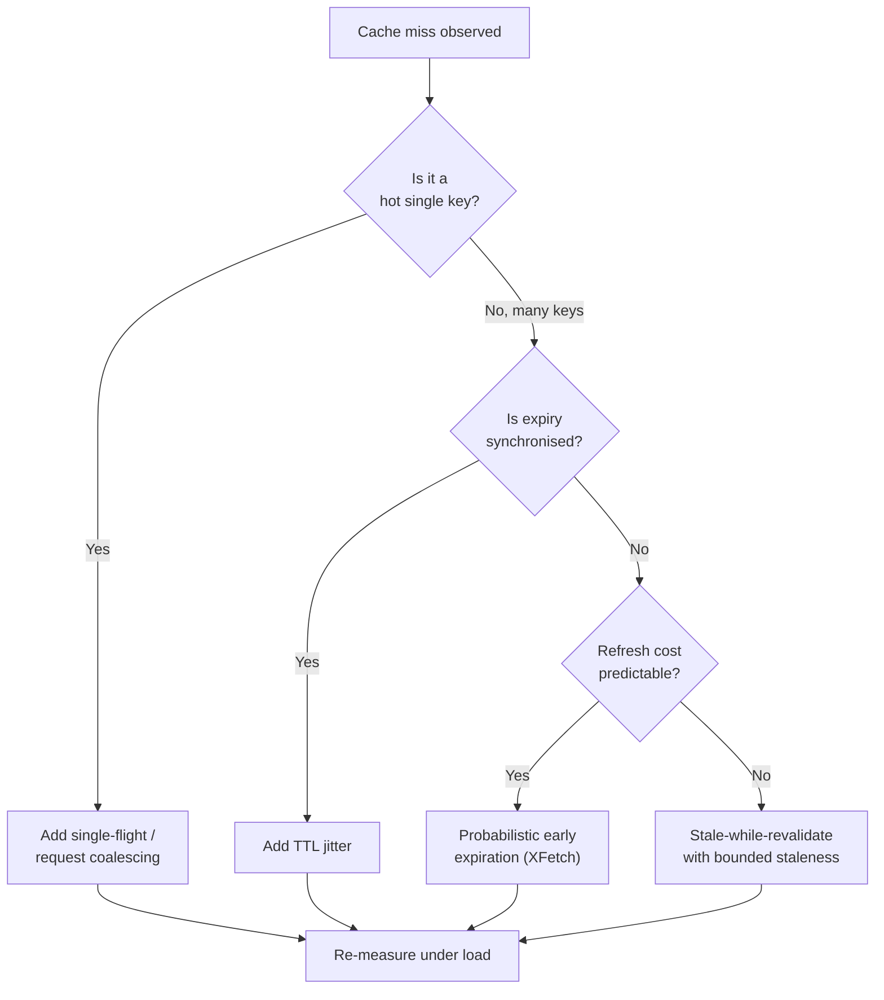

# Thundering Herd & Cache Stampede

> **TL;DR.** When a hot cache entry expires or a popular service restarts, thousands of clients race to the origin simultaneously. The origin melts. The canonical fixes are: **single-flight (request coalescing)**, **probabilistic early expiration (XFetch)**, **jittered TTLs**, and **stale-while-revalidate**.

---

## 1. The two problems are siblings (but not the same)

| Name | Where it happens | Classic trigger |
|------|------------------|-----------------|
| **Thundering herd** | Any wait queue — kernel-level `accept()`, lock release, connection wakeup, OS event | A single event wakes *all* waiters, N-1 of which go back to sleep |
| **Cache stampede** (a.k.a. dog-pile) | Application-level cache (Redis, Memcached, local LRU) | A popular key expires; every concurrent reader misses and hits the origin |

In system-design interviews the two terms are often used interchangeably; in practice *cache stampede* is the subset you will design around 95% of the time.

---

## 2. What a stampede looks like

```
Normal traffic                 Key "product:42" expires at T=60s
────────────────                ──────────────────────────────────
┌────────┐                       ┌────────┐
│ 10k QPS├──────> CACHE HIT ───> │ Redis  │   99.9% hit rate
│  read  │                       └────────┘
└────────┘                            │  ❌ miss at T=60s
                                      ▼
                                  ┌────────┐
                                  │   DB   │  suddenly 10k concurrent
                                  │ origin │  queries in ~10 ms window
                                  └────────┘
                                  ↓
                              connection pool exhausted
                              CPU saturated
                              other queries time out → cascade
```

### Graph shape

```
QPS at DB
│
│      ┌─┐     ← stampede: 10k simultaneous misses
│      │ │
│      │ │
│──────┘ └──────────── ← normal baseline (cache absorbs load)
│
└────────────────────▶ time
            T=60s
```

---

## 3. Root causes (name the *exact* one)

1. **Synchronised expiry** — everyone writes the key with TTL=60s at T=0, so everyone re-fetches at T=60s.
2. **Cold cache / cache warm-up** — deploy, failover, or node restart empties the cache.
3. **No single-flight** — on miss, each worker independently recomputes instead of letting one do it.
4. **Scatter-gather pattern** — one API call blows up into N parallel cache lookups (see also [N+1](02-NPlusOneQueries.md)).
5. **Celebrity / hot key** — the same key is read by millions; its miss is uniquely catastrophic (see [03-HotKeysAndHotPartitions.md](03-HotKeysAndHotPartitions.md)).

---

## 4. Mitigations (drill these in order)

### 4.1 Request coalescing / single-flight

Let **only one** request per key hit the origin; the rest wait on a shared promise.

```
t=0   Worker A  → cache MISS → acquires in-flight lock on "product:42"
                             → queries DB
t=1   Worker B  → cache MISS → sees in-flight lock → subscribes to result
t=2   Worker C  → cache MISS → sees in-flight lock → subscribes to result
t=50  Worker A  ← DB responds → populates cache → notifies B, C
                                                  (all 3 return the same value)
```

**Implementations:**
- Go's `singleflight.Group` (library).
- Redis `SETNX` with a short TTL as a mutex:
  ```
  SET lock:product:42 <worker_id> NX PX 5000
  ```
  only the winner refreshes; losers poll the cache.
- Java: `Caffeine` cache with `loader` function (thread-safe load coalescing built in).

**Trade-off:** adds 1 extra round-trip of latency for N-1 waiters in the miss path, but caps origin QPS at 1 per key.

### 4.2 Jittered / randomised TTL

Write the key with `TTL = base ± rand(0, spread)` instead of a fixed value. Breaks **synchronised expiry** — deadly when 10k clients wrote the same key in the same second after a previous stampede.

```
key1 → TTL 58s
key2 → TTL 61s
key3 → TTL 63s    ... expiries smear across ~5s window
```

### 4.3 Probabilistic early expiration (XFetch)

Pioneered by the paper *"Optimal Probabilistic Cache Stampede Prevention"* (Vattani et al.). Each read *might* decide the key is "about to expire" and refresh it proactively — with a probability that rises as you approach TTL.

```
On GET(key):
    value, ttl_remaining, compute_cost = cache.get(key)
    if value is None:
        value = origin.fetch(); cache.set(key, value, TTL)
        return value

    # β ≈ 1.0; scales with how expensive the refresh is
    should_refresh_early =
        now - ttl_remaining <
        -compute_cost * β * log(random(0,1))

    if should_refresh_early:
        # refresh in the background, still return the current value
        async refresh(key)

    return value
```

Most requests hit the cache normally. A tiny fraction trigger an *early*, unsynchronised refresh. By the time the TTL actually expires, the cache already has a fresh value — so the stampede never fires.

**When to use:** high-traffic keys where the refresh cost is known and you can afford a background async path.

### 4.4 Stale-while-revalidate (SWR)

Serve the stale value while revalidating in the background. CDNs (`Cache-Control: stale-while-revalidate=30`) and Next.js ISR use this by default.

```
t=0   key expires, but cache keeps "stale" copy for extra staleness window
t=0   next request → returns stale value immediately (p50 = 1 ms)
                  → triggers async refresh
t=50  refresh completes → cache updated → subsequent requests get fresh
```

**Trade-off:** clients can see a value up to `(TTL + staleness_window)` old. Unacceptable for money or counters; perfect for product listings, feed pages.

### 4.5 Pre-warming / cache priming

Before cutting traffic to a new node / region, replay a representative read load to populate the cache. Mandatory for anything with a cold-start stampede risk (new Redis replica, deploy after a flush, failover to a cold region).

### 4.6 Do not put everything in the cache

- **In-memory near-cache** (Caffeine / Guava) inside the application process — miss there still goes to Redis; stampede is absorbed locally first.
- **Two-tier cache** = near-cache + remote Redis + origin. Each tier has its own single-flight.

```
┌──────────────────────────────────────────────────────────────┐
│                   TWO-TIER CACHE FLOW                         │
├──────────────────────────────────────────────────────────────┤
│                                                              │
│   Client ──▶ App Server                                      │
│                 │                                            │
│                 ├── L1: Caffeine (process-local, 1-5 s TTL)  │
│                 │     hit ratio ~60%  (absorbs micro-burst)  │
│                 │                                            │
│                 └── L2: Redis (shared, 60 s TTL)             │
│                       hit ratio ~39.5%                       │
│                         │                                    │
│                         └── L3: DB origin (< 0.5% of reads)  │
│                                                              │
└──────────────────────────────────────────────────────────────┘
```

### 4.7 Negative caching

Also cache *absence* ("key doesn't exist → 404 cached for 5 s"). Prevents stampedes for non-existent keys — very common in permission checks, URL shorteners, ID lookups. Pair with a [Bloom filter](../02-BuildingBlocks/07-BloomFilters.md) to short-circuit most of them without touching the cache at all.

---

## 5. Design flow



---

## 6. Interview talking points

- **Name it fast.** "That's a classic cache stampede." You win 10 seconds and buy time to think.
- **Be specific about which fix.** "I'd use Redis `SETNX` as a single-flight lock with a 5-second lease, plus a ±10% TTL jitter on the write. For a hot key like the homepage feed I'd add XFetch probabilistic refresh with β = 1." That sentence demonstrates three depths of knowledge.
- **Trade-offs to voice:**
  - Single-flight adds latency to the miss path.
  - XFetch trades a few "wasted" background refreshes for stampede-freedom.
  - SWR trades freshness for availability — call out the exact staleness window.
- **When it's not a stampede:** if QPS on miss is small and origin is fast, you're fine. Adding single-flight "because it's the right thing" is premature engineering. The interviewer *wants* you to size the problem first.

---

## 7. Real-world examples

| System | Technique |
|--------|-----------|
| Facebook Memcache | **Leases** — a write-miss gets a short lease token; concurrent readers wait on the token (Memcache-at-scale paper) |
| DNS resolvers | Negative caching + jittered TTL |
| Netflix EVCache | Stale-while-revalidate + request coalescing at the client |
| Twitter Gizzard / cache layer | Two-tier cache + consistent-hash warm-up |
| Cloudflare | `stale-while-revalidate` header + probabilistic refresh at edge |
| CPython `functools.lru_cache` | Thread-local, no stampede protection — this is why you write your own for distributed cases |

---

## 8. Related reading in this repo

- [../01-Fundamentals/04-Caching.md](../01-Fundamentals/04-Caching.md) — caching strategies (cache-aside, write-through, write-back).
- [../02-BuildingBlocks/07-BloomFilters.md](../02-BuildingBlocks/07-BloomFilters.md) — short-circuit negative lookups.
- [03-HotKeysAndHotPartitions.md](03-HotKeysAndHotPartitions.md) — stampede's ugly older brother.
- [07-CacheConsistency.md](07-CacheConsistency.md) — once you have no stampede, are you returning fresh data?
