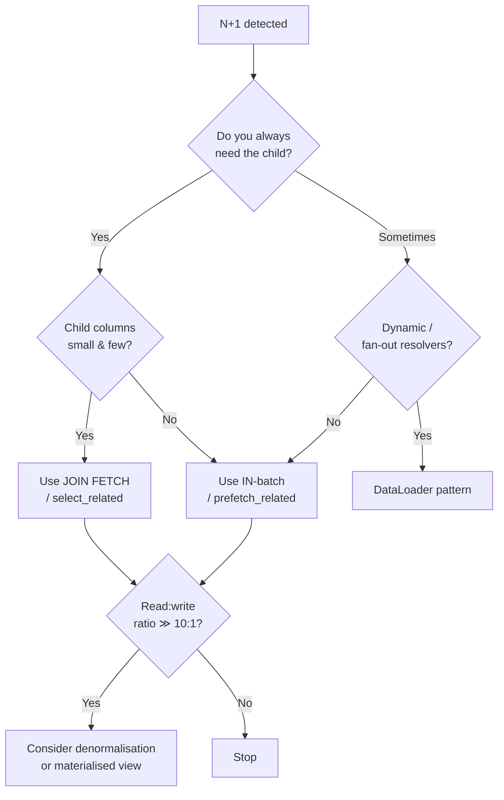

# The N+1 Query Problem

> **TL;DR.** You run 1 query to fetch N parents, then iterate and run 1 more query per parent to load its children — **1 + N queries** where you should have run **1 or 2**. It is the single most common performance bug in ORM-backed services, and it scales *linearly with your success*: the more users, the more dead your database.

---

## 1. The anatomy of an N+1

### Bad code (Hibernate / JPA example)

```java
// 1 query — fetch all orders
List<Order> orders = orderRepository.findByUserId(userId);

for (Order o : orders) {
    // 1 query per order — fetch the user who placed it
    System.out.println(o.getUser().getName());
}
```

If `findByUserId` returns 500 rows, you issue **501 SQL statements** — 500 of which are round-trips of the form `SELECT * FROM users WHERE id = ?`.

### What it looks like on the wire

```
APP ─► DB : SELECT * FROM orders WHERE user_id = 17
APP ◄─ DB : 500 rows  (8 ms)
APP ─► DB : SELECT * FROM users WHERE id = 17      (0.4 ms network RTT)
APP ─► DB : SELECT * FROM users WHERE id = 17
APP ─► DB : SELECT * FROM users WHERE id = 17
...
APP ─► DB : SELECT * FROM users WHERE id = 17
──────────────────────────────────────────
Total: 1 + 500 round-trips  ≈  8 + 500 × 0.4  =  208 ms
(vs 8 ms for a single JOIN)
```

The database isn't working hard — **the network is**. Every extra query pays the round-trip tax.

---

## 2. How to detect it

### On the database

- Enable **slow-query log** with `log_min_duration_statement = 0` briefly in staging — or better, `pg_stat_statements` in PostgreSQL, `performance_schema.events_statements_summary_by_digest` in MySQL.
- Watch for **identical query fingerprints executed thousands of times per request**.

### In the application

- Hibernate: enable `hibernate.generate_statistics=true` and log `getStatistics().getQueryExecutionCount()` per request. Any endpoint with > 10 queries per request is suspect.
- Django: `django-debug-toolbar` shows query count and dedup.
- Rails: `bullet` gem detects unused eager loads and N+1 access.
- Spring Boot: log `org.hibernate.SQL` at DEBUG; add `p6spy` for actual parameterised SQL; use Micrometer timers per query family.

### In production

```
# OpenTelemetry trace of a GET /feed
GET /feed .............................. 850 ms
├── db.query SELECT * FROM posts ........ 10 ms
├── db.query SELECT * FROM users WHERE .. 1 ms  ╮
├── db.query SELECT * FROM users WHERE .. 1 ms  │  500 copies =
├── ...                                         │  the smoking gun
└── db.query SELECT * FROM users WHERE .. 1 ms  ╯
```

A flame-graph that looks like a forest of identical twigs is always N+1.

---

## 3. The five canonical fixes

### 3.1 JOIN (eager loading)

One query, returns the parent-child join denormalised.

```sql
SELECT o.*, u.*
FROM orders o
JOIN users  u ON u.id = o.user_id
WHERE o.user_id = ?
```

- **Hibernate:** `@EntityGraph` or `JOIN FETCH` in HQL.
- **JPA/Spring Data:**
  ```java
  @Query("SELECT o FROM Order o JOIN FETCH o.user WHERE o.userId = :userId")
  List<Order> findWithUser(@Param("userId") Long userId);
  ```
- **Rails:** `Order.includes(:user).where(user_id: user_id)` (produces a JOIN when the where touches the joined table).
- **Django:** `Order.objects.select_related('user').filter(user_id=user_id)`.

**Trade-off:** duplicates columns (every order row repeats the user columns). Not great if `users` is huge.

### 3.2 IN-clause batch (a.k.a. "two-query" pattern)

Fetch parents first, then *one* batched lookup for all children.

```sql
-- Query 1
SELECT * FROM orders WHERE user_id IN (:userIds);

-- Query 2 (batched)
SELECT * FROM users  WHERE id IN (:distinct user_ids from query 1);
```

- **Rails:** `includes` falls back to this for `has_many`.
- **Django:** `prefetch_related`.
- **Hibernate:** `@BatchSize(size = 100)` on the association.
- **Plain JDBC:** collect IDs, then `WHERE id IN (...)` with parameter binding.

**Trade-off:**
- Fewer duplicated columns than JOIN.
- Two round-trips vs one for JOIN.
- Watch the IN-list size — Oracle caps at 1000, PostgreSQL at 32k parameters. Chunk the list.

### 3.3 DataLoader pattern (request-scoped batching)

Facebook / GraphQL popularised this. Inside a single HTTP request, every `loadUser(id)` call is queued; the loader flushes the queue once per event-loop tick as a single `IN` query, returning a promise per ID.

```
                      DataLoader<Long, User>
                        │
t = 0 ms   resolver A ──┤  load(17)
t = 0 ms   resolver B ──┤  load(42)
t = 0 ms   resolver C ──┤  load(17)   ← dedup
t = 0 ms   resolver D ──┤  load(99)
t = 0.5 ms    ┌─────────┘
              ▼
   SELECT * FROM users WHERE id IN (17, 42, 99)   ← 1 query, dedup'd
              │
        promise resolve A,B,C,D
```

- **Java:** `java-dataloader` (used by `graphql-java`).
- **Node:** `dataloader` npm.
- **Python:** `aiodataloader`.

**Use when:** your code-paths are fanning out in many places (GraphQL, federated resolvers), and you can't statically predict which children will be needed.

### 3.4 Denormalise / embed

For read-heavy paths, denormalise the child data onto the parent (or vice versa).

- SQL: add a `user_display_name` column on `orders`, update on user rename.
- Document DBs (MongoDB, DynamoDB): embed the frequently-accessed child fields.
- Materialised views: precompute the JOIN.

**Trade-off:** denormalisation costs write amplification and consistency work. Worth it only if read/write ratio is high (> ~10:1). Use CDC (see [14-ChangeDataCaptureVsDualWrites.md](14-ChangeDataCaptureVsDualWrites.md)) to keep the denormalised copy in sync.

### 3.5 Columnar / covering indexes

When the N queries are *aggregations* over children (e.g. "total spend per user"), a covering index or materialised view can fold the N+1 into O(1).

---

## 4. The decision tree



---

## 5. Scaled-up variants

| Variant | What it looks like | Fix |
|---------|-------------------|-----|
| **N+N+1** | Parent → child → grandchild; you fix the child layer and find another layer underneath | Multi-level `includes` / `@EntityGraph(attributePaths={"user", "user.address"})` |
| **Cache N+1** | 500 cache GETs instead of 1 MGET / pipeline | Redis `MGET` or pipeline; DataLoader also collapses to MGET |
| **HTTP N+1** | A service fans out 500 HTTP calls to another service | Batching endpoint `POST /users:batchGet { ids: [...] }` + DataLoader at the client |
| **Microservice N+1** | A gateway calls 500 downstream services serially | gRPC streaming or parallel `CompletableFuture.allOf` — but watch for [retry storms](05-RetryStormsAndCircuitBreakers.md) |

---

## 6. Anti-patterns to avoid

1. **"Just add caching."** A cache in front of N queries still issues N cache GETs (unless you MGET). And the miss path brings the stampede back — see [01](01-ThunderingHerdAndCacheStampede.md).
2. **Lazy loading everywhere.** ORMs default to lazy; senior code usually switches to eager on associations that are *always* needed and names the fetch explicitly on the rest.
3. **Eager-load *everything*.** You'll accidentally cartesian-explode a 5-way JOIN. Be surgical.
4. **`LIMIT` inside the loop.** Looks innocent; each iteration is a new query. Move the LIMIT outside with a windowed query.

---

## 7. Interview talking points

- **State the diagnosis concretely.** "On the hot path `GET /orders/:id/summary`, I expect N+1 because the response needs the user, the line items and the shipping address for each order. I'd eager-fetch user + shipping via `JOIN FETCH`, and batch line items with `@BatchSize(100)`."
- **Mention observability.** "I'd log query count per request via Hibernate statistics and alert on p95 > 10 queries per request."
- **Distinguish fixes for strict-mode vs flexible fetch.** JOIN for always-needed, batch for sometimes-needed, DataLoader for can't-predict GraphQL fan-out.
- **Cross-cutting concern:** N+1 on the DB is isomorphic to N+1 on cache (use `MGET`) and N+1 on HTTP (use batch endpoints). Same pattern, different layer.

---

## 8. Related reading

- [../01-Fundamentals/03-Databases.md](../01-Fundamentals/03-Databases.md) — indexing and query planning.
- [../02-BuildingBlocks/02-DatabaseScaling.md](../02-BuildingBlocks/02-DatabaseScaling.md) — read replicas and caching layers.
- [01-ThunderingHerdAndCacheStampede.md](01-ThunderingHerdAndCacheStampede.md) — if you "fix" N+1 by dumping it onto the cache you'll create stampedes.
