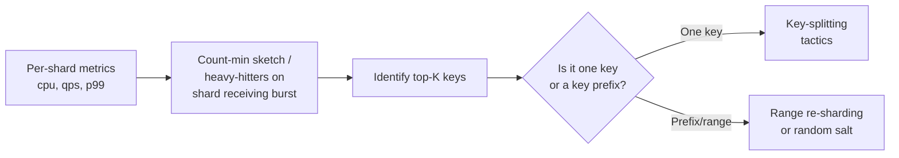

# Hot Keys, Hot Partitions & Shard Rebalancing Under Skew

> **TL;DR.** Real-world traffic is Zipfian: a handful of keys (a celebrity, a viral tweet, `user:0`, timestamp=now) receive thousands of times more traffic than average. The shard holding that key melts while the others idle. Mitigations are **key splitting**, **read replicas**, **write buffering**, **local caching**, and **adaptive rebalancing**.

---

## 1. The physics of the problem

Distributed storage uses a partitioning function `shard = f(key)`. Even if `f` distributes keys uniformly, **traffic is not uniform**: popularity follows a power law (Zipf / Pareto). The top 0.1% of keys can absorb 50%+ of the traffic.

```
QPS per shard (ideal vs real)
──────────────────────────────
Ideal: even traffic, consistent hashing
 ┌─┬─┬─┬─┬─┬─┬─┬─┬─┬─┬─┬─┬─┬─┬─┬─┐
 │1│1│1│1│1│1│1│1│1│1│1│1│1│1│1│1│  each bar ≈ average
 └─┴─┴─┴─┴─┴─┴─┴─┴─┴─┴─┴─┴─┴─┴─┴─┘

Reality: one celebrity lands on shard 7
 ┌─┬─┬─┬─┬─┬─┬─┬─┬─┬─┬─┬─┬─┬─┬─┬─┐
 │ │ │ │ │ │ │█│ │ │ │ │ │ │ │ │ │
 │ │ │ │ │ │ │█│ │ │ │ │ │ │ │ │ │
 │ │ │ │ │ │ │█│ │ │ │ │ │ │ │ │ │
 │1│1│1│1│1│1│█│1│1│1│1│1│1│1│1│1│   shard 7 = 10× the rest
 └─┴─┴─┴─┴─┴─┴─┴─┴─┴─┴─┴─┴─┴─┴─┴─┘   and is the bottleneck
```

Shard 7 fails its SLO → its clients retry → cascade → entire service degrades. All because `f("Justin Bieber") → shard 7`.

---

## 2. How a hot key forms

| Category | Example | Why |
|----------|---------|-----|
| **Celebrity entity** | `user:biebs`, `stock:GME`, `topic:breaking_news` | Popularity power law |
| **Time-based key** | `metrics:2025-04-23T14:25` | Everybody writes the "current minute" bucket |
| **Global counter** | `global:pageviews`, `inventory:flash_sale_SKU` | Everyone contends for one row |
| **Auto-increment ID** | INSERT to the highest page of a B-tree index | Last-page contention |
| **Default key** | `user:null`, `region:default`, `tenant:0` | Bad data, empty state, test traffic |
| **Skewed JOIN** | Orders for `vendor_id=WALMART` | Business fact — one vendor > all others |

---

## 3. Detection



- **Redis:** `redis-cli --hotkeys` (in a non-prod replica). MONITOR is too heavy. On Redis ≥ 6 use `LATENCY` and `OBJECT FREQ` with LFU.
- **Cassandra / DynamoDB:** per-partition metrics (`nodetool tablehistograms`, DDB `HotPartitionMetrics`).
- **Kafka:** partition lag skew. One partition with 10× the lag = hot partition.
- **Custom:** sketches (Count-Min, Misra-Gries) on the front-end — see [../07-SystemDesignAlgorithms/03-ProbabilisticDataStructures.md](../07-SystemDesignAlgorithms/03-ProbabilisticDataStructures.md).

---

## 4. Mitigations (by scenario)

### 4.1 Read-heavy hot key — **replicate it**

Multiple replicas of the same key, reads round-robin across them.

```
            client reads
              │
   ┌──────────┼──────────┐
   ▼          ▼          ▼
┌──────┐  ┌──────┐  ┌──────┐
│replica│  │replica│  │replica│
│  1   │  │  2   │  │  3   │
└──────┘  └──────┘  └──────┘
   │          │          │
   └──────────┼──────────┘
              ▼
         writes go to
         the leader, then
         async replicate
```

- Redis: add read replicas; split reads across them via Envoy or client-side load-balancer. Acceptable if *eventual* consistency on the key is OK.
- Database: **read replicas** are built for exactly this.
- Bounded consistency: client sticks to a replica for a session, or uses quorum read.

### 4.2 Hot key in a cache — **local (near-cache) with short TTL**

For a key read 1M QPS:

- L1 cache (Caffeine, in-process): 1s TTL, serves 99.9% of traffic from RAM at 50 ns.
- L2 cache (Redis): 60s TTL, serves the misses from L1.

The cache TTL bounds staleness; the high hit ratio at L1 collapses downstream load by 1000×. See also [01-ThunderingHerdAndCacheStampede.md](01-ThunderingHerdAndCacheStampede.md).

### 4.3 Write-heavy hot key — **split the key** (a.k.a. "sharding the shard")

Turn `counter:global` into `counter:global:{0..9}` and aggregate on read.

```
Before:                   After:
─────────                  ──────────────────────────
INCR counter:global  ──►   pick shard s = rand(0..9)
                           INCR counter:global:s

Read:                      Read:
GET counter:global         MGET counter:global:{0..9}
                           sum them
```

- Write QPS divided by 10 per key.
- Read cost rises linearly (now 10 GETs + sum) — acceptable if writes ≫ reads.
- Trick for DynamoDB partition keys: append `#{random(0..N)}` to the PK.

### 4.4 Hot time-bucket — **salt with a prefix**

`events:2025-04-23T14:25` → `events:{0..N}:2025-04-23T14:25`. Writers pick a random `N`. Readers fan out. Same pattern as 4.3 but stated in time-series vocabulary.

### 4.5 Hot partition in Kafka — **custom partitioner + key salting**

Default partitioner is `hash(key) % N`. If `key=vendor:WALMART` is hot:

- Custom partitioner: if `key` is in a known hot-set, append a random suffix and route to a dedicated partition pool. Downstream consumers group by raw key after reading.
- Or: manually route all Walmart events to a **group of partitions** (say 4), not one.

### 4.6 Buffered / coalesced writes

For counters: write to a local in-process buffer, flush every 1s as `INCRBY counter N` instead of N × `INCR`. Huge reduction in round-trips; the cost is up to 1s staleness.

```
Client writes: 50 000 increments/sec
Local buffer:  aggregates to 1 write/sec: INCRBY global 50000
```

Pattern name: **write-combining** / **LRU coalescer**. Cloudflare, Facebook, and most ad counters do this.

### 4.7 Queue the writes (leader + async)

For strict ordering, route all writes for a hot key to a single-writer queue; the queue batches and applies them serially. Raises p99 (waiting in queue) in exchange for capping shard CPU. Used in inventory / ticketing.

### 4.8 Client-side caching with invalidation

Instead of 1M reads/s hitting the server, the server pushes invalidations:

- **Redis 6 client-side caching** (`CLIENT TRACKING`).
- Cache-aside with a change notification (Redis pub-sub, SNS, Kafka CDC stream).

1M reads/s → app caches locally for 1 min → hits origin only on change → maybe 10 reads/s.

### 4.9 Rebalance the shard ring

- Consistent hashing with virtual nodes: add *many* vnodes per physical node so adding a node moves only a small slice. See [../02-BuildingBlocks/03-ConsistentHashing.md](../02-BuildingBlocks/03-ConsistentHashing.md).
- **Weighted vnodes** — give the overloaded node fewer vnodes.
- **Adaptive rebalancing** (DynamoDB, Cosmos DB) — the system automatically splits a hot partition when its traffic crosses a threshold, and merges cold ones. You can't usually observe this; just know it exists.

---

## 5. Rebalancing under skewed traffic

When the skew is persistent, you need to *move* data, not just replicate.

```
┌─────────────────────────────────────────────────────────────┐
│           ADAPTIVE PARTITION SPLITTING (DDB-style)           │
├─────────────────────────────────────────────────────────────┤
│                                                              │
│  Step 1: monitor per-partition QPS + RU consumption         │
│                                                              │
│  Step 2: when partition P crosses threshold                 │
│                                                              │
│     Before:                                                  │
│      ┌────────────────────────────────────┐                 │
│      │ Partition P   [  key A  ] [ key B ]│                 │
│      │              50k QPS               │                 │
│      └────────────────────────────────────┘                 │
│                                                              │
│     Step 3: split at the midpoint of the key range          │
│                                                              │
│     After:                                                   │
│      ┌─────────────────┐  ┌─────────────────┐               │
│      │  Partition P1   │  │  Partition P2   │               │
│      │   [ key A ]     │  │   [ key B ]     │               │
│      │    20k QPS      │  │   30k QPS       │               │
│      └─────────────────┘  └─────────────────┘               │
│                                                              │
│  Step 4: shadow writes to P1/P2 until caught up             │
│  Step 5: flip reads to the new partitions atomically        │
│                                                              │
└─────────────────────────────────────────────────────────────┘
```

If you're building this yourself (e.g. on top of consistent hashing):
1. **Range-based**, not hash-based, partitioning if you need to split ranges — CockroachDB, Spanner, HBase.
2. **Merge** low-traffic partitions to keep the total partition count bounded; otherwise metadata grows.
3. **Shadow / double-write** during migration — treat as a tiny CDC pipeline (see [14-ChangeDataCaptureVsDualWrites.md](14-ChangeDataCaptureVsDualWrites.md)).
4. **Atomic cutover** of the routing metadata — coordination via etcd/ZooKeeper/Raft.

---

## 6. Decision matrix

| You have… | Best fix | Why |
|-----------|----------|-----|
| Read-heavy hot cache key | Local cache + invalidation | Collapses fan-out |
| Write-heavy counter | Key splitting + batched aggregation | Spreads load |
| Hot row in OLTP DB | Read replicas + write buffer + denorm | Classic "flash-sale inventory" |
| Hot Kafka partition | Custom partitioner + more partitions | Producer-side smearing |
| Persistent range skew | Range resharding (auto or manual) | Move data, not traffic |
| Celebrity feed | Fan-out on read (pull model) + cache | See [../05-DesignMedium/08-Twitter.md](../05-DesignMedium/08-Twitter.md) |

---

## 7. Interview talking points

- **Say "Zipfian" out loud.** Mentioning that real traffic isn't uniform shows you've thought past the ideal case.
- **Always name the axis.** "Is this a *read* hot key or a *write* hot key?" Completely different fixes.
- **Key splitting + aggregate.** If asked to design a global view counter on a 1M-QPS video, this is the right answer.
- **Don't pretend to have magic rebalancing.** Be explicit: "We'll need a rebalancer, probably range-based, coordinated via a Raft-backed metadata store like etcd."
- **Cross-link to related problems.** Hot keys + stampede + cache inconsistency often travel together — see [01](01-ThunderingHerdAndCacheStampede.md) and [07](07-CacheConsistency.md).

---

## 8. Related reading

- [../02-BuildingBlocks/03-ConsistentHashing.md](../02-BuildingBlocks/03-ConsistentHashing.md) — vnode placement and weighting.
- [../07-SystemDesignAlgorithms/02-HashingAndPartitioning.md](../07-SystemDesignAlgorithms/02-HashingAndPartitioning.md) — partition function design.
- [../05-DesignMedium/08-Twitter.md](../05-DesignMedium/08-Twitter.md) — celebrity problem in news feed.
- [16-NoisyNeighborIsolation.md](16-NoisyNeighborIsolation.md) — when the "hot tenant" is another customer.
