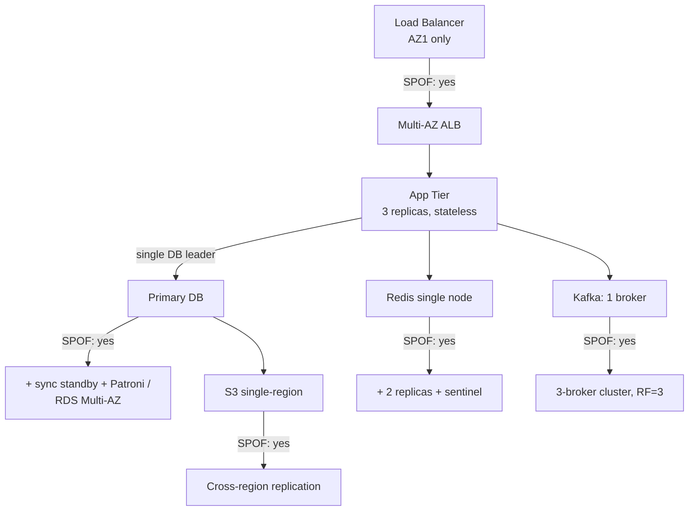

# Single Point of Failure (SPOF)

> **TL;DR.** A single point of failure is any component whose failure halts the system. "Availability = min(availability of every serial dependency)". The mitigation toolkit is **redundancy + automatic failover + graceful degradation**, applied to *every* layer: compute, state, network, DNS, identity, secrets, and operations.

---

## 1. Availability math — why series kills you

Components in series multiply availability:

```
   A(total) = A₁ × A₂ × A₃ × …

   4 nines ×  4 nines ×  4 nines  =  0.9999³ ≈ 0.9997  → 2.6 hours/year
   4 nines ×  4 nines ×  3 nines  =  0.99979           → ≈ 1.85 h/year  (still worse)
```

Components in parallel ("N-of-M" redundancy, active-active) approach perfect availability:

```
   A_parallel = 1 - (1 - A)^N
                    └─── both/all must fail

   Two 99% components in parallel =  1 - 0.01² = 99.99% → 4 nines
```

**This is the entire point of redundancy.** Take any serial chain, look for the weakest link, put at least two of it.

---

## 2. The SPOF checklist (layer by layer)

Walk this list on any system you're handed — find the SPOFs *before* the interviewer does.

```
┌───────────────────────────────────────────────────────────────┐
│                    SPOF AUDIT — 10 LAYERS                      │
├───────────────────────────────────────────────────────────────┤
│                                                               │
│  L1  CLIENT / DNS                                             │
│     ├── one DNS provider                    → multi-DNS       │
│     └── one TLS cert authority              → cross-issuance  │
│                                                               │
│  L2  EDGE / LB                                                │
│     ├── single load balancer instance       → 2+ with anycast │
│     ├── single region ingress               → multi-region    │
│     └── single VIP                          → ELB / anycast   │
│                                                               │
│  L3  APPLICATION / COMPUTE                                    │
│     ├── one instance of service X           → ≥ 3 replicas    │
│     ├── stateful in-memory queue            → externalise     │
│     └── session affinity required           → remove or Redis │
│                                                               │
│  L4  PRIMARY DATA STORE                                       │
│     ├── single leader DB                    → HA pair + WAL   │
│     ├── no read replicas                    → add replicas    │
│     └── one AZ                              → multi-AZ        │
│                                                               │
│  L5  CACHE                                                    │
│     ├── single Redis node                   → replica + sent. │
│     └── cache is the only fast path         → DB capacity plan│
│                                                               │
│  L6  MESSAGE BUS                                              │
│     ├── single broker                       → 3-node cluster  │
│     └── single AZ                           → multi-AZ MSK    │
│                                                               │
│  L7  OBJECT / BLOB STORE                                      │
│     └── one bucket, one region              → CRR / multi-region│
│                                                               │
│  L8  CONFIG / DISCOVERY                                       │
│     ├── one ZK / etcd node                  → ≥ 3 for quorum  │
│     └── config file on one host             → replicated CDN  │
│                                                               │
│  L9  IDENTITY / SECRETS                                       │
│     ├── single IdP                          → cached tokens + │
│     │                                         fallback IdP    │
│     └── Vault unsealed only in one region   → HA + DR         │
│                                                               │
│  L10 OPERATIONAL                                              │
│     ├── one on-call person                  → follow-the-sun  │
│     ├── single deploy pipeline              → mirror in DR    │
│     └── one observability vendor            → self + vendor   │
│                                                               │
└───────────────────────────────────────────────────────────────┘
```

If you can't immediately answer "what happens if I kill *this* box?", it's a SPOF.

---

## 3. Patterns for removing a SPOF

### 3.1 Active-Active

All N replicas serve traffic. Failure of one removes 1/N capacity; if you provisioned for N-1 you don't even notice.

- Stateless services (web/app tier): trivial, just run ≥ 3 replicas.
- Stateful stores: hard, needs conflict resolution (see [13-MultiRegionFailover.md](13-MultiRegionFailover.md)).

### 3.2 Active-Passive (leader + standby)

One replica is the leader; the others are warm standbys with synchronous or near-synchronous replication. On failure, promote a standby.

- Requires a **failure detector** and a **leader election** mechanism (see [../03-AdvancedConcepts/DistributedSystems/04-FailureDetection.md](../03-AdvancedConcepts/DistributedSystems/04-FailureDetection.md) and [../03-AdvancedConcepts/02-Consensus.md](../03-AdvancedConcepts/02-Consensus.md)).
- **Failover time = detection + promotion + client reconnect.** Budget it; most outages are dominated by slow failover, not failures themselves.

```
Leader state       Replica state        Client view
───────────        ─────────────        ───────────
HEALTHY           following            writes go to leader
  │ crash
  ▼
dead              detect (< 10s)
                  elect (Raft, 1-3s)
                  promote (< 5s)
                  redirect DNS / proxy (10-30s)
                                          ↓
                                     writes resume
```

### 3.3 N-modular redundancy with quorum

Write to all N, acknowledge when W have acked; read from R such that R + W > N. The cluster tolerates `(N-W)` write failures and `(N-R)` read failures concurrently. See [../03-AdvancedConcepts/DistributedSystems/06-Quorum.md](../03-AdvancedConcepts/DistributedSystems/06-Quorum.md).

### 3.4 Graceful degradation

If the recommender is down, show popular items. If search is down, show featured categories. If personalisation is down, show the anonymous experience. A feature failure ≠ site failure.

### 3.5 Bulkheads

Isolate failure domains: one tenant's misbehaviour must not starve the others. See [16-NoisyNeighborIsolation.md](16-NoisyNeighborIsolation.md).

### 3.6 Circuit breakers

Stop hammering a failed dependency; fall back to a default. See [05-RetryStormsAndCircuitBreakers.md](05-RetryStormsAndCircuitBreakers.md).

---

## 4. Hidden SPOFs people miss

| Hidden SPOF | Why it bites |
|-------------|--------------|
| **DNS provider** | 2016 Dyn outage — Twitter, Spotify, GitHub all died because DNS was one vendor. Use 2+ providers (e.g. Route53 + NS1). |
| **Shared config/flag service** | If LaunchDarkly is down and you fail closed, everything is off. Cache last-known-good locally. |
| **Build/deploy pipeline** | Can't ship a fix during an outage. Replicate Jenkins/Buildkite/GHA runners to DR region. |
| **Single-region control plane** | Your app is multi-region but the control plane (deploy, IAM, metrics) is single-region. AWS us-east-1 outages are infamous. |
| **Observability vendor** | Can't see the outage when Datadog is down. Keep local Prom/Loki as a lifeboat. |
| **TLS cert issuance / OCSP** | If OCSP responder is down and you're doing hard-fail stapling, 100% of HTTPS breaks. |
| **A single SRE who knows "the way"** | Tribal knowledge is a SPOF. Runbooks, game days. |
| **Vendor (Stripe, Twilio) with no fallback** | Shadow the payment with a backup gateway; shadow SMS with a second provider. |
| **Primary key generator** | Single Snowflake service with one ZK → outage stops all new IDs. See [../04-DesignEasy/04-UniqueIDGenerator.md](../04-DesignEasy/04-UniqueIDGenerator.md). |
| **Cron box** | One host runs the nightly reconciliation job. Use a distributed scheduler (Temporal / Airflow with HA). |

---

## 5. Failure-mode tree — a worked example



The interview answer doesn't mention *every* layer; it names the **dominant** SPOF and the fix, then waves at the rest: "similar redundancy applies to cache, queue and storage."

---

## 6. What "removing" a SPOF actually costs

Redundancy is never free. Quantify it:

| Dimension | Cost |
|-----------|------|
| **$$$** | 2× or 3× infra. Standby capacity that sits idle in active-passive. |
| **Consistency** | Active-active needs conflict resolution or consensus. |
| **Latency** | Synchronous replication adds RTT to every write (~1ms within AZ, ~70ms cross-region). |
| **Complexity** | Failover automation, runbooks, game days, DR drills. |
| **Testing** | You must test failover — broken failover is worse than no failover. *Chaos engineering* (Netflix Simian Army) exists for this reason. |

---

## 7. Availability targets and what they buy you

| SLA | Downtime / year | Architecture implication |
|-----|-----------------|--------------------------|
| 99% (two 9s) | 3.65 days | Single host with backups |
| 99.9% (three 9s) | 8.76 hours | HA pair per tier, one region |
| 99.99% (four 9s) | 52.6 minutes | Multi-AZ, automatic failover |
| 99.999% (five 9s) | 5.26 minutes | Multi-region active-active, no manual steps |
| 99.9999% (six 9s) | ~31 seconds | Reserved for telco / finance core; usually a claim, not a reality |

The cost curve is **exponential in the number of nines**. A senior engineer pushes back on "100% uptime" — name the target, design to it, don't over-engineer.

---

## 8. Interview talking points

- **Walk layers, not components.** "There's no single DB leader, and we have 3 Kafka brokers, but our DNS is single-provider and our config service runs in one region." Comprehensiveness wins points.
- **Always cite failover time.** "RDS Multi-AZ fails over in 60-120 s; that's our RTO floor. For anything stricter we'd need active-active."
- **Name the math.** "Three 9s of each tier multiplies to ~98% — not acceptable for a payment flow. We need 4-nines components or redundancy at each layer."
- **Chaos is a deliverable.** "We run a monthly game day where we kill the primary; if we haven't tested it, it doesn't work."
- **Don't forget humans.** On-call rotation, runbooks, and access-control are SPOFs too.

---

## 9. Related reading

- [../03-AdvancedConcepts/DistributedSystems/03-FailureModes.md](../03-AdvancedConcepts/DistributedSystems/03-FailureModes.md) — taxonomy of failures.
- [../03-AdvancedConcepts/DistributedSystems/04-FailureDetection.md](../03-AdvancedConcepts/DistributedSystems/04-FailureDetection.md) — how we know something died.
- [../03-AdvancedConcepts/DistributedSystems/07-ReplicationStrategies.md](../03-AdvancedConcepts/DistributedSystems/07-ReplicationStrategies.md) — sync vs async, chain replication.
- [05-RetryStormsAndCircuitBreakers.md](05-RetryStormsAndCircuitBreakers.md) — avoiding cascading failures after a SPOF trips.
- [13-MultiRegionFailover.md](13-MultiRegionFailover.md) — the region-level version of this problem.
