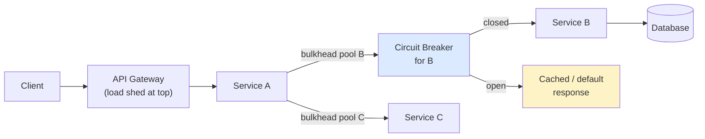

# Retry Storms, Circuit Breakers & Cascading Failure Control

> **TL;DR.** When a dependency slows down, naïve retries *amplify* load on it — an N×RPS tsunami that turns a brownout into an outage, and that outage into a full cascade. The antidote stack is **exponential backoff with jitter + a retry budget + a circuit breaker + bulkheads + load shedding**. Skip any of those layers and your next postmortem will cite this page.

---

## 1. How a retry storm is born

### Act 1 — downstream slows down

Service B's p99 goes from 50ms to 500ms. Still responds, just slowly.

### Act 2 — A's timeouts fire, A retries

A's client library has a 200ms timeout and retries 3 times. Each failed call turns into 3 actual calls on the wire.

### Act 3 — multiplication

```
Before:  A ── 1 req ──► B
After :  A ── 3 req ──► B        (3× load on an already struggling B)
                ─► B
                ─► B   ← B now saturates
```

### Act 4 — the cascade

B now fails instantly. A sees failures and retries faster. The queue backs up through the synchronous call chain: **every service upstream of B** is now holding threads / connections waiting, exhausting its own pool, failing its own upstream callers.

```
Client ──► API GW ──► Service A ──► Service B ──► DB
                         (stuck)      (overload)  (slow)
                         ↑               │
                 thread pool full        │
                 500s back to GW  ◄──────┘
                         ↑
                 API GW thread pool exhausted
                         ↑
                 Client sees global 500s
                                             ← cascade to the whole fleet
```

This is the **cascading failure** pattern. The proximate cause is the slow DB. The *reason your entire product is down* is the absence of the mitigations below.

---

## 2. Mitigation stack (top to bottom)

```
┌────────────────────────────────────────────────────────────┐
│              THE SIX-LAYER CASCADE DEFENCE                  │
├────────────────────────────────────────────────────────────┤
│                                                            │
│  L1  Timeouts (bounded wait)                               │
│  L2  Exponential backoff + jitter                          │
│  L3  Retry budget (cap retries as % of traffic)            │
│  L4  Circuit breaker (fail fast when down)                 │
│  L5  Bulkhead (isolate failure domains)                    │
│  L6  Load shedding (reject before you fall over)           │
│                                                            │
└────────────────────────────────────────────────────────────┘
```

### L1 — Timeouts

Default timeouts in most HTTP clients are **infinite or minutes**. That's the single worst default in the language. Every call must have:

- A **connect timeout** (1–3 s).
- A **request / read timeout** < the caller's SLA.
- Idempotency-aware (see [06-IdempotencyAndDeduplication.md](06-IdempotencyAndDeduplication.md)) so retrying is safe.

Rule: the timeout at each layer must shrink as you go down.

```
Client expects p99 ≤ 1000 ms
  └── API GW timeout  = 900 ms
       └── Service A timeout = 700 ms
            └── Service B timeout = 500 ms
                 └── DB query timeout = 300 ms
```

### L2 — Exponential backoff with jitter

Pure exponential (`2^attempt × base`) still synchronises when all clients failed at the same moment — they all retry at the *same* exponential schedule. Add **jitter**:

```python
# Full jitter (AWS recommendation)
sleep = random.uniform(0, base * 2 ** attempt)

# Decorrelated jitter (smoother, bounded growth)
sleep = random.uniform(base, prev_sleep * 3)
sleep = min(sleep, cap)
```

```
Without jitter               With full jitter
──────────────               ─────────────────
all clients retry            retries smeared uniformly
at t=100ms                   across [0, 100ms]
          │││                    · · ·
          │││                  ·  ·  ·
          │││                 · · · · ·
          ▼▼▼                  ▼  ▼ ▼ ▼ ▼
  ┌────────────┐               ┌────────────┐
  │  BIG SPIKE │               │  even load │
  └────────────┘               └────────────┘
```

### L3 — Retry budget (the part most people forget)

A retry budget **caps the global retry multiplier**. Example rule: "retries may not exceed 10% of steady-state traffic in any 10s window." If the budget is exhausted, further failures return immediately without retrying.

- Envoy: `retry_budget` in route config.
- gRPC: `retryPolicy` with `maxAttempts` + token bucket.
- Google SRE book: their default is a 10% budget.

```
Without a budget:
  5% steady errors × 3 retries = 15% additional load on B → B dies faster

With a 10% budget:
  retries are capped. Excess failures fail fast without hammering B.
```

### L4 — Circuit breaker

A state machine that **stops making calls** to a dependency that is clearly broken, letting it recover.

```
            ┌────────────────────────────────────┐
            │             CLOSED                 │
            │   (all calls pass through)         │
            │                                    │
            │   error rate > 50% in window?      │
            │   ──────────────► trip             │
            └───────────┬────────────────────────┘
                        │ trip
                        ▼
            ┌────────────────────────────────────┐
            │              OPEN                  │
            │   (fail fast, no calls to B)       │
            │                                    │
            │   after cooldown (e.g. 30 s)       │
            │   ──────────────► probe            │
            └───────────┬────────────────────────┘
                        │ cooldown elapsed
                        ▼
            ┌────────────────────────────────────┐
            │           HALF-OPEN                │
            │   (allow 1-N canary probes)        │
            │   success → CLOSED                 │
            │   fail    → OPEN                   │
            └────────────────────────────────────┘
```

- **Libraries:** Resilience4j (Java), Polly (.NET), Hystrix (legacy, Netflix), gRPC's built-in circuit breakers (Envoy filter).
- **Trip criteria:** error rate + slow-call rate + minimum call count (avoid tripping on 0/1 error).
- **Fallback:** return a cached value, a default, or a clear 503 — *never* block on a broken dependency.

**Why it's beautiful:** by failing fast, upstream threads are released immediately. The pool doesn't fill up. The cascade stops at the circuit.

### L5 — Bulkhead (thread pool / connection pool isolation)

Separate thread pools per downstream so one saturating downstream can't exhaust the caller's threads.

```
Service A
┌─────────────────────────────────────────────────────┐
│                                                     │
│  pool_for_B: 20 threads   ← saturates when B slow  │
│  pool_for_C: 20 threads   ← still serves C requests│
│  pool_for_D: 20 threads   ← still serves D requests│
│                                                     │
└─────────────────────────────────────────────────────┘
```

Without bulkheads, *any* slow downstream eats *all* of A's threads and A fails to every caller. See [16-NoisyNeighborIsolation.md](16-NoisyNeighborIsolation.md) for the multi-tenant version.

### L6 — Load shedding

When you detect you can't keep up — queue depth / CPU / latency SLO exceeded — **reject** excess requests with 429/503 instead of queueing them.

- Adaptive LIFO (reverse the queue order under load — old requests are probably already abandoned by the client).
- **CoDel** (controlled delay) — drop when the queue minimum latency exceeds a target.
- Netflix **Zuul** and **Envoy** both have adaptive concurrency limit (Netflix's "Concurrency Limits" library — Little's Law based).

```
Healthy system: queue depth ≈ 0  → accept all
Slightly stressed: queue ≈ sustainable → accept all
Overloaded: queue > threshold → shed 25% → observe → shed more
```

The key insight: **dropping some traffic now is survival; accepting all traffic is suicide**.

---

## 3. The full picture



---

## 4. Retry safety rules

| Rule | Why |
|------|-----|
| **Only retry idempotent operations** | GET/PUT/DELETE + retry is safe. POST needs an idempotency key. See [06-IdempotencyAndDeduplication.md](06-IdempotencyAndDeduplication.md). |
| **Don't retry on 4xx** | Client error; retrying won't help. Only retry on transient errors: 5xx, timeout, connection reset. |
| **Respect `Retry-After` headers** | The server is telling you when it's ready. Use it. |
| **Cap at 3 attempts + backoff** | More retries ≠ more success; they just widen the storm window. |
| **Carry a `traceId` / request-id** | So the retried call is idempotent at the downstream business-logic layer. |
| **Never retry at multiple layers** | 3 retries at client × 3 at gateway × 3 at service = 27× load. Choose *one* layer to retry. |

---

## 5. Observability for cascades

What to dashboard during an incident:

- **Request rate, error rate, duration** per service (the RED method).
- **Concurrent requests** per downstream (saturation signal).
- **Queue depth** / **thread pool usage** per service.
- **Circuit breaker state** and trips per minute.
- **Retry budget** consumed (should stay below 10%).

When you see "errors up 200%, latency up, concurrent requests spiking across three adjacent services," that's the cascade footprint.

---

## 6. Cascading failure post-mortem template (memorise this)

Every cascade postmortem has the same five acts:

1. **Precipitating event** (a slow DB, bad config push, memory leak, etc.).
2. **Amplifier** (retries / thread-pool exhaustion / unbounded queue).
3. **Blast radius** (which services cascaded).
4. **Stopped by** (usually: someone shed traffic manually, or the amplifier ran out of fuel).
5. **Fix** (usually: add or tune circuit breaker / retry budget / bulkhead).

In an interview, if you describe a system under load and the interviewer asks "what breaks first?", walk this template.

---

## 7. Worked example — a payments service

> Card auth p99 jumps from 80 ms to 3 s because of a Stripe API degradation.

Without mitigations:
1. Payment service's 500 ms timeout fires on 95% of calls.
2. Retry policy of 3 retries → 4× load on Stripe.
3. Stripe's rate limiter throttles us.
4. Payment service's thread pool (250 threads) fills; new requests queue.
5. Checkout API waits on payment, its thread pool fills.
6. API gateway waits on checkout, its pool fills.
7. Gateway starts 5xx-ing every request, even ones not involving payment.
8. **Entire site is down** because of one slow external vendor.

With mitigations:
1. Same 3 s p99 on Stripe.
2. 800 ms timeout → fail fast.
3. Retry budget caps at 10% → we don't amplify Stripe load.
4. Circuit breaker trips after 50% error rate for 30 s → we stop calling Stripe.
5. Fallback: return a cached token for "low-risk" small transactions, *or* return `503, try_again_in=60s` for high-risk.
6. Bulkhead: only the "payment" thread pool is hot; search, product, profile continue.
7. Load shed: checkout API rejects 20% of requests at 429 to protect the pool.
8. **Site is degraded** (checkout unavailable for some users for a minute) instead of down.

---

## 8. Interview talking points

- **Name all six layers.** Timeouts, backoff+jitter, retry budget, circuit breaker, bulkhead, load shedding. Most candidates know two.
- **Specifically mention the retry budget.** It's the least-known one and impresses.
- **Always pair retries with idempotency.** If you retry non-idempotent work, you create financial bugs.
- **Cascades are not about the trigger.** Interviewers want to hear you design the mitigation, not predict the trigger.
- **Quote Google SRE book:** "The goal of load shedding is to graciously reject requests when you can't serve them."
- **Caveat:** Circuit breakers don't help if you're the *only* caller. Bulkheads don't help if you have one pool. Pick the layer for the problem.

---

## 9. Related reading

- [../03-AdvancedConcepts/DistributedSystems/12-BackPressureAndRetries.md](../03-AdvancedConcepts/DistributedSystems/12-BackPressureAndRetries.md) — backpressure principles, the upstream side of this problem.
- [06-IdempotencyAndDeduplication.md](06-IdempotencyAndDeduplication.md) — required for safe retries.
- [16-NoisyNeighborIsolation.md](16-NoisyNeighborIsolation.md) — bulkheading at a tenant level.
- [../03-AdvancedConcepts/06-Microservices.md](../03-AdvancedConcepts/06-Microservices.md) — service mesh (Envoy/Istio) implements much of this for you.
