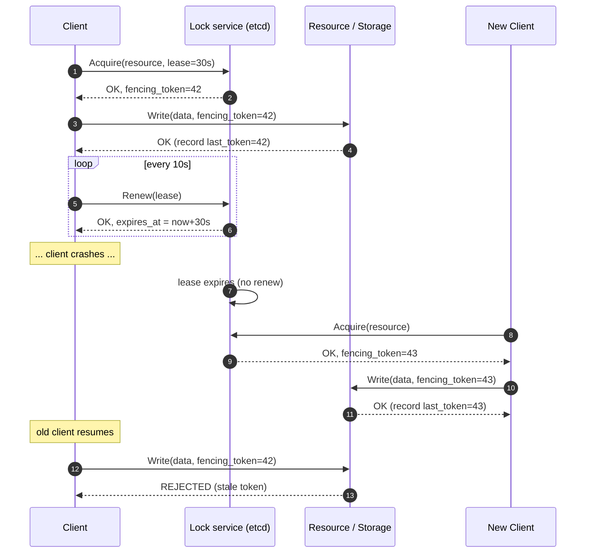

# Distributed Locks & Lease Expiry

> **TL;DR.** A distributed lock says "only one worker at a time touches this resource". Implementing one is *deceptively* hard. Naïve Redis `SETNX` locks are unsafe under network partitions; even Redlock is contested. The rules of thumb are: **always use a lease with an expiry**, **always carry a fencing token**, **prefer leader-of-a-partition over fine-grained locks**, and **use a consensus-backed store (etcd, ZooKeeper, Chubby) when correctness matters more than latency**.

---

## 1. Why you think you need a distributed lock

Common situations:

1. "Only one scheduler should run the nightly job across all replicas."
2. "Only one worker should process this Kafka partition."
3. "Only one request should create this user account if two arrive concurrently."
4. "Only one instance should publish to an external API that has no idempotency."
5. "I want a 'singleton' across my cluster."

For (1)–(4) the right primitive is often **not** a lock. It might be:
- **Leader election** (cases 1, 2, 5) — a leader owns the resource for its whole tenure.
- **Idempotency key + unique constraint** (case 3) — cheaper, safer.
- **At-least-once processing + dedup** (case 4) — still need a lock? make it idempotent.

**Before you reach for a lock, ask: "Can this be made idempotent?"** (see [06-IdempotencyAndDeduplication.md](06-IdempotencyAndDeduplication.md)). Locks are an operational hazard; skip them where you can.

---

## 2. The two correctness properties

Any distributed lock protocol must guarantee:

1. **Safety — mutual exclusion.** At most one client holds the lock at any time.
2. **Liveness — no deadlock.** A client that dies eventually releases the lock (⇒ **leases**, not perpetual locks).

These are in tension: enforcing mutual exclusion under partitions means a slow client might lose the lock *while still believing it holds it* — the "split brain" risk.

---

## 3. Leases, not locks

A **lease** is a lock with a time-to-live. The owner must renew before expiry; if it doesn't, the lease is gone, and someone else can acquire.

```
t = 0   client A acquires lease L, TTL = 30 s
t = 10  client A renews  (new expiry = t + 30)
t = 20  client A renews  (new expiry = t + 30)
t = 25  client A stalls  (GC pause, slow disk, whatever)
t = 50  lease L expired — client B acquires
t = 55  client A un-stalls, still believes it holds L → DANGER
```

This scenario is why **fencing tokens** (next section) exist.

---

## 4. Fencing tokens — the missing piece

Every acquire returns a **monotonically increasing token**. The protected resource refuses writes that arrive with a *smaller* token than the last one it accepted.

```
Client A acquires lease → token 34
Client A stalls
Client B acquires lease → token 35

Client A wakes up and tries to write with token 34
    Storage: "My last token was 35. Rejecting write with token 34."

Client B writes with token 35
    Storage: "OK."
```

Without fencing, a stalled A can silently overwrite B's work. **Fencing is what actually makes locks safe under partitions.** Martin Kleppmann's "How to do distributed locking" is the definitive critique of any lock protocol that omits fencing.

**Implementation:**
- ZooKeeper / etcd: the `zxid` / `mod_revision` is a natural fencing token.
- Redis: you have to implement it yourself — e.g. `INCR lease_counter:resource` on acquire and pass the value as the fencing token.

---

## 5. Implementations from weakest to strongest

### 5.1 Single-instance Redis `SET NX PX`

```
SET lock:resource client_id NX PX 30000   ← only set if not exists, TTL 30s
```

- Release: `DEL lock:resource` (but only if `GET == client_id`). Must use Lua to make check-and-delete atomic:
  ```lua
  if redis.call("GET", KEYS[1]) == ARGV[1] then
      return redis.call("DEL", KEYS[1])
  end
  return 0
  ```
- **Unsafe under Redis failover.** If the master dies and replication was async, a client can hold the lock on the old master while another client acquires it on the promoted replica.
- Good for "best-effort" coordination, rate limiting, basic request coalescing (see [01](01-ThunderingHerdAndCacheStampede.md)). **Not** good for correctness-critical work.

### 5.2 Redlock (multi-master Redis)

Acquire the same lock on ≥ N/2+1 independent Redis masters within a bounded time. Antirez designed it; Kleppmann argued it's still broken in the presence of clock drift and stalls. Industry consensus: if you need safety, don't use Redlock; use etcd or ZooKeeper.

### 5.3 ZooKeeper / etcd-based locks

Consensus-backed. Every acquire is a Raft/ZAB-replicated operation; the returned revision is a natural fencing token.

ZooKeeper recipe (ephemeral sequential nodes):
```
/locks/resource_A/
   lock-0000000017  (client X)   ← holds the lock
   lock-0000000018  (client Y)   ← queued
   lock-0000000019  (client Z)   ← queued
```

- Each client creates an **ephemeral sequential** znode under `/locks/resource_A/`.
- The client with the smallest sequence number holds the lock.
- Others watch the znode immediately ahead of them; when it disappears (the holder died or released), they re-check.
- Ephemeral = auto-deleted on session loss, giving liveness.

etcd via `clientv3/concurrency.Mutex`:
```go
session, _ := concurrency.NewSession(cli)
mu := concurrency.NewMutex(session, "/locks/resource_A")
mu.Lock(ctx)       // uses revision as fencing
defer mu.Unlock(ctx)
```

The revision is guaranteed monotonically increasing across the cluster → use as the fencing token.

### 5.4 DB-backed lock table

`SELECT ... FOR UPDATE SKIP LOCKED` on a row. For in-datacenter coordination when you already own a relational DB. Simple, correct, but doesn't scale to fine-grained high-throughput locking.

### 5.5 Per-partition leader (the pattern you should actually use)

Instead of locking a resource, **shard** resources to partitions and run a leader-election per partition. Every partition has one leader at a time; the leader exclusively owns its resources for its whole tenure.

```
Partitions:     [0] [1] [2] [3] [4] [5] [6] [7]
Leaders:         L   L   L   L   L   L   L   L
                 A   B   A   C   B   A   C   A
```

Kafka's consumer group assignment is exactly this: one consumer per partition. See [../03-AdvancedConcepts/02-Consensus.md](../03-AdvancedConcepts/02-Consensus.md) and [../03-AdvancedConcepts/DistributedSystems/10-StateMachineReplication.md](../03-AdvancedConcepts/DistributedSystems/10-StateMachineReplication.md).

---

## 6. The anatomy of a lease flow



The numbered steps capture every lesson:

- (1-2) Lease + token at acquire time.
- (4) Token passed to every protected write.
- (5) Storage enforces monotonicity.
- (6) Periodic renewals so stalls don't wrongly lose the lease.
- (12) Storage rejects the stalled client's late write — **this is what prevents split-brain damage**.

---

## 7. Lease-expiry pitfalls

| Pitfall | What breaks |
|---------|-------------|
| No fencing token | Stalled client corrupts data after its lease expires |
| Renew interval ≥ TTL | Network blip causes lease loss under healthy conditions |
| Clock-based TTL on multiple nodes with skew | Two nodes disagree on "expired now" — mutual exclusion broken |
| Holding a lock across long-running work | Any slower-than-expected run loses the lease mid-flight; always chunk work and reacquire |
| Long TTL for convenience | Kills liveness — a crashed holder blocks the resource for the full TTL |
| Using a human-readable unique ID (`client_id = hostname`) as the token | Two clients from different hosts might race in ways you didn't expect; use a monotonic counter or revision |
| Assuming the lock server clock = your clock | Use the lock server's returned `expires_at`; never compute TTL on the caller |

---

## 8. Performance expectations

| Implementation | Acquire latency | Safe? |
|----------------|----------------|-------|
| Single Redis | ~0.5 ms | No (not across failover) |
| Redlock (5 Redis) | ~5 ms | Debated — assume no for correctness |
| etcd | 5–15 ms | Yes (with fencing) |
| ZooKeeper | 5–15 ms | Yes (with fencing) |
| DB `FOR UPDATE` | 5–20 ms | Yes, bounded by DB HA |
| Per-partition leader | 0 ms (already held) | Yes (with fencing) |

For anything hotter than ~1000 acquires/s, don't lock per request — **lease a whole partition or a whole shard**, do many units of work under a single lease, renew it.

---

## 9. Anti-patterns & senior-engineer moves

### Anti-patterns

- Reaching for a lock where a unique constraint or idempotency key would do.
- Locking a row across an HTTP call (especially one that can time out).
- Using Redis + TTL + no fencing for a correctness-critical workload.
- "Infinite TTL, we'll release on shutdown hook" — shutdown hooks are not reliable.

### Senior moves

- Replace "lock the resource" with "shard + leader-elect the partition owning the resource".
- Always pair a lease with a fencing token; *require* it at the resource boundary.
- Make the critical section short, pre-flight everything else.
- Name the lock server as an explicit dependency — its availability is now your availability.

---

## 10. Interview talking points

- **State the lock is a lease with fencing.** "I'd use etcd; the lease gives liveness, the revision is the fencing token, and every write carries the token so a stalled holder can't corrupt data."
- **Cite Kleppmann.** Mentioning "How to do distributed locking" signals you've read the canon.
- **Call out that the lock store is now a critical dependency.** etcd/ZK clusters must be HA.
- **Prefer leader-per-partition.** "For the job scheduler across 1000 jobs, I'd run leader election on 1000 keys in etcd rather than a single global lock."
- **Explain the stall failure mode.** "If my worker GC-pauses for 5 seconds with a 3 s lease TTL, the lease expires. Without fencing, its resumed write corrupts the newer owner's state."

---

## 11. Related reading

- [../03-AdvancedConcepts/02-Consensus.md](../03-AdvancedConcepts/02-Consensus.md) — Raft, Paxos, the engines behind etcd / ZK.
- [../03-AdvancedConcepts/DistributedSystems/10-StateMachineReplication.md](../03-AdvancedConcepts/DistributedSystems/10-StateMachineReplication.md) — how consensus turns into a lock primitive.
- [../07-SystemDesignAlgorithms/10-ConsensusAndLeadership.md](../07-SystemDesignAlgorithms/10-ConsensusAndLeadership.md) — leader election algorithms.
- [06-IdempotencyAndDeduplication.md](06-IdempotencyAndDeduplication.md) — often a cheaper alternative to locking.
- [05-RetryStormsAndCircuitBreakers.md](05-RetryStormsAndCircuitBreakers.md) — a lock service outage causes its own cascade.
