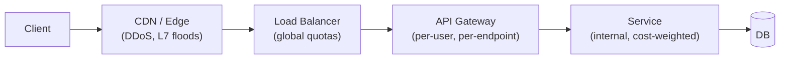

# Distributed Rate Limiting at Scale

> **TL;DR.** Single-node rate limiting is trivial; distributed rate limiting is hard because **N load-balanced nodes must agree on "have we seen 1000 requests this second?"** without making every request hit a central counter. The three live options are **centralised atomic counters (Redis + Lua)**, **gossiping local counters with eventual global sync**, and **token bucket with a central bank and local draw-down**. Each is a latency/accuracy trade-off.

> If you have not already, read [../07-SystemDesignAlgorithms/01-RateLimitingAlgorithms.md](../07-SystemDesignAlgorithms/01-RateLimitingAlgorithms.md) first — this file assumes you know the algorithms (fixed window, sliding window, token bucket, leaky bucket) and focuses on the *distributed* enforcement problem.

---

## 1. What makes it hard

You have:
- N gateway / API nodes (say N = 100).
- Quota: user X may make 1000 requests per minute.
- Two requirements:
  - **Accuracy** — don't allow 10 000 requests when the budget is 1000.
  - **Performance** — the limiter check is on *every* request; it must add ≤ 1 ms.

Naïve "divide 1000 by 100 nodes = 10 per node" breaks badly:
- Traffic is rarely evenly balanced across nodes.
- Sticky sessions skew it further.
- User X only hits 5 of the 100 nodes in practice.
- Result: user is falsely rate-limited at 50 req/min, while global actual < 1000.

So you need **shared state about the counter**, accessed at extreme throughput.

---

## 2. Architecture choices (pick one)

```
┌──────────────────────────────────────────────────────────────┐
│               THREE DISTRIBUTED RL ARCHITECTURES              │
├──────────────────────────────────────────────────────────────┤
│                                                              │
│ A) Centralised atomic counter                                │
│    Every node → Redis on every request                       │
│    Pros: exact                                                │
│    Cons: 1 extra RTT per request; Redis is a SPOF & hot key  │
│                                                              │
│ B) Local counters + periodic gossip / central sync           │
│    Each node counts locally; aggregate every 100-500 ms      │
│    Pros: near-zero latency; very scalable                    │
│    Cons: overshoot window = interval × max node delta        │
│                                                              │
│ C) Token-bucket bank + leased buckets (Doorman-style)        │
│    A central "bank" issues batches of tokens to each node    │
│    Pros: very low per-request latency (tokens local)         │
│    Cons: unused tokens expire; complex re-balancing          │
│                                                              │
└──────────────────────────────────────────────────────────────┘
```

Most real systems pick (A) with tricks to make it cheap, or (B) with a tight interval. Google's Doorman and Envoy's `RateLimitService` pattern are (C).

---

## 3. Centralised Redis approach — the workhorse

### 3.1 Fixed / sliding window counter in Lua

```lua
-- KEYS[1] = counter key, e.g. "rl:user:42:2025-04-23T14:25"
-- ARGV[1] = limit
-- ARGV[2] = TTL seconds

local count = redis.call("INCR", KEYS[1])
if count == 1 then
    redis.call("EXPIRE", KEYS[1], ARGV[2])
end
if count > tonumber(ARGV[1]) then
    return 0    -- rejected
end
return 1        -- allowed
```

Atomic — `INCR` is O(1) and happens on a single Redis shard. One round trip per request.

### 3.2 Sliding window log (more accurate, more expensive)

Store a Sorted Set keyed by timestamp; trim old entries; count remaining.

```lua
local now = ARGV[1]
local window = ARGV[2]
redis.call("ZREMRANGEBYSCORE", KEYS[1], 0, now - window)
local count = redis.call("ZCARD", KEYS[1])
if count >= tonumber(ARGV[3]) then
    return 0
end
redis.call("ZADD", KEYS[1], now, ARGV[4])   -- request-id for dedup
redis.call("EXPIRE", KEYS[1], window / 1000)
return 1
```

Accurate but memory-hungry: N entries per window per key. Good for low-volume, high-accuracy APIs (financial).

### 3.3 Sliding window counter (the sweet spot)

Two fixed windows; interpolate. O(1) memory, O(1) cost, low overshoot. See [../07-SystemDesignAlgorithms/01-RateLimitingAlgorithms.md](../07-SystemDesignAlgorithms/01-RateLimitingAlgorithms.md) §Sliding Window Counter.

### 3.4 Making Redis survive

- **Shard by the rate-limit key.** Consistent hashing so `user:42` always lands on the same Redis node — no cross-shard coordination.
- **Replicate each shard.** Async replication is fine; rate limiting can tolerate a second of staleness after failover.
- **Local first-cut** — let gateway reject *before* calling Redis if the node's own counter already shows over-limit. Reduces Redis load dramatically.
- **Fail open or fail closed?** If Redis is down, do you pass or block? Fail open = DDoS risk. Fail closed = availability hit. Compromise: **degrade** to a local-only limit per node × N nodes = a looser but non-zero limit.

---

## 4. Token-bucket bank (Google Doorman / Envoy local-global)

```
Global bank (e.g. "user:42" allows 1000/min = ~16.67 tokens/s)
  │
  │   allocate batches
  ▼
┌───────────────┐      ┌───────────────┐      ┌───────────────┐
│ Node 1        │      │ Node 2        │      │ Node 3        │
│ local bucket  │      │ local bucket  │      │ local bucket  │
│ holds 50 tok  │      │ holds 30 tok  │      │ holds 20 tok  │
└───────────────┘      └───────────────┘      └───────────────┘
     │                        │                       │
  serves requests         serves requests        serves requests
  drains tokens           drains tokens          drains tokens
     │                        │                       │
     │ "I want more"          │                       │
     └────────► bank ◄────────┴───────────────────────┘
                (periodic re-allocation,
                 based on recent usage rates)
```

- Each gateway node holds a local bucket of tokens; serves requests by decrementing locally (nanosecond speed).
- Every ~500 ms it calls the bank: "I used X, I expect Y next interval, give me Z tokens."
- Bank re-balances the remaining quota among nodes based on usage rate.

Pros: virtually free per request. Scales to millions of QPS.
Cons: accuracy ≈ 1 × allocation interval; complex to implement well.

Envoy's `local_rate_limit` filter + global `rate_limit_service` pair implements this pattern.

---

## 5. Gossip / local-with-periodic-sync

Each node keeps a local counter. Every ~100–500 ms all nodes push their deltas to a coordinator (or gossip to a subset). The coordinator returns the aggregated global count.

```
t=0   node1 local=20, node2 local=30, node3 local=25
t=100 each pushes to coordinator: global = 75
t=200 global=75 visible to all nodes, they cap future growth to (limit - 75)
```

Overshoot ≤ (delta during the gossip interval).

---

## 6. Multi-level quotas

Real APIs have nested limits:

```
- per-user, per-minute:   1000
- per-tenant, per-minute: 100 000
- per-endpoint, per-sec:  50 (per-IP)
- global, per-sec:        1 000 000 (DDoS backstop)
```

Implement as **a chain of limiters**; any rejection wins. Redis can host multiple counters at ~O(1) cost per request; pipeline them in one RTT.

---

## 7. Request cost & weight

Not all requests are equal. An API might cost 1 token for a GET, 10 for a write, 100 for a batch. Rate limiters should take a **cost** argument:

```
INCRBY rl:user:42:window cost
if result > limit → reject
```

Without this, a small client doing expensive batch calls is treated the same as a client making cheap GETs.

---

## 8. The user contract — response codes and headers

```
HTTP/1.1 429 Too Many Requests
Retry-After: 12
X-RateLimit-Limit: 1000
X-RateLimit-Remaining: 0
X-RateLimit-Reset: 1715187600    (epoch when the window resets)
```

- `Retry-After` lets well-behaved clients back off correctly.
- Remaining / Reset give SDKs predictive info to self-throttle.
- 429 ≠ 503: use 429 for "you exceeded your quota", 503 for "service is unhealthy". Mixing them confuses monitoring.

---

## 9. Where to enforce (layered defense)



Each layer has a different job:
- **CDN / WAF** — IP-level flood protection, bot mitigation.
- **Load balancer** — coarse "max N requests/sec per host" to protect backend fleet.
- **API gateway** — per-user quotas (the classic place for distributed rate limiting).
- **Service** — cost-aware or resource-aware limits (DB queries, external API calls).

Putting *all* the limits at one layer is fragile.

---

## 10. Reference numbers (interview-size the system)

- Gateway fleet: 100 nodes, 1M QPS total.
- Redis cluster: 6 shards × (1 primary + 1 replica). A single shard does ~200K QPS for simple `INCR`.
- Rate limit check budget: 0.5 ms p99.
- Memory: ~100 bytes per active user-key window. 10M active keys = 1 GB. Fits one node.

---

## 11. Observability

- **429 rate** per user / per endpoint — spikes indicate abuse or misconfiguration.
- **Redis latency p99** from the gateway — if this blows, the whole fleet slows down.
- **Header values (Remaining / Reset)** in logs — for diagnosing "why was user X rate-limited?".
- **Effective rate per user** vs quota — find heavy hitters approaching their limit, maybe up-sell.
- **Fail-open / fail-closed events** when Redis is unavailable.

---

## 12. Anti-patterns

| Anti-pattern | Why |
|--------------|-----|
| Per-node limits only | No global enforcement; user spreads traffic across nodes |
| One Redis key for all users | Hot key → see [03-HotKeysAndHotPartitions.md](03-HotKeysAndHotPartitions.md) |
| No TTL on counter keys | Memory grows until OOM; always `EXPIRE` after first write |
| Blocking on Redis on every request with no fallback | Redis blip → global outage |
| Rate-limiting at the controller layer only | Upstream floods still saturate the LB |
| Fixed-window with no bucket interpolation | Allows 2× limit at window boundary |
| Per-request JWT decode + RL call | JWT decode dominates latency; cache decoded identity |

---

## 13. Interview talking points

- **Walk the three architectures** (centralised, gossip, bank). Pick one with reasoning.
- **Call out the hot-key problem for user quotas.** Shard Redis by user ID.
- **Emphasise layering.** "I wouldn't put everything at the gateway — IP limits at the edge, user quotas at the gateway, cost-aware limits in the service."
- **Be concrete on response contract.** Mention `429` + `Retry-After` + remaining headers.
- **Fail-open vs fail-closed.** State the trade-off and pick one based on the business: payments fail closed, content reads fail open.
- **Size memory.** "10M active users × 100 bytes × 2 windows ≈ 2 GB — one Redis shard."

---

## 14. Related reading

- [../07-SystemDesignAlgorithms/01-RateLimitingAlgorithms.md](../07-SystemDesignAlgorithms/01-RateLimitingAlgorithms.md) — algorithms (token bucket, sliding window, etc.).
- [../04-DesignEasy/03-RateLimiter.md](../04-DesignEasy/03-RateLimiter.md) — full system-design write-up.
- [05-RetryStormsAndCircuitBreakers.md](05-RetryStormsAndCircuitBreakers.md) — rate limiting *is* a form of load shedding.
- [16-NoisyNeighborIsolation.md](16-NoisyNeighborIsolation.md) — per-tenant quotas for isolation.
