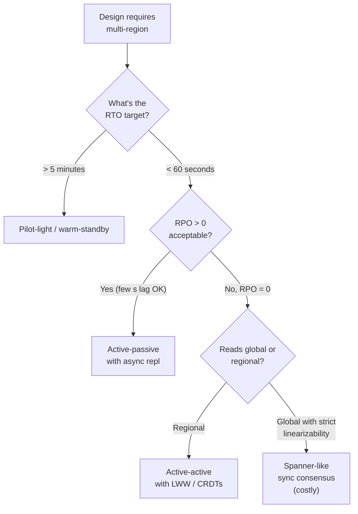

# Multi-Region Failover & Active-Active Conflict Resolution

> **TL;DR.** A multi-region system has two meta-designs: **active-passive** (one region serves writes, others stand by) and **active-active** (every region serves writes). Active-passive is simpler but has **RTO** (failover time) and **RPO** (data loss) measured in minutes. Active-active gives sub-second RTO/RPO but forces you to resolve **concurrent writes across regions** — the conflict-resolution problem that makes this the hardest failure mode in distributed systems.

---

## 1. Glossary (every word matters)

| Term | Meaning |
|------|---------|
| **RTO** — Recovery Time Objective | Max acceptable downtime after a failure (e.g., 1 min). |
| **RPO** — Recovery Point Objective | Max acceptable data loss (e.g., 10 s of writes). RPO = 0 only with synchronous cross-region replication. |
| **Active-passive** | Writes go to one region; another region has a warm standby. Promote on failure. |
| **Active-active** | All regions accept writes; replicate to each other. Requires conflict resolution. |
| **Pilot-light** | Minimal standby (DB only). Scale compute up on failover. Lowest cost, highest RTO. |
| **Warm standby** | Standby has running (but small) capacity, ready to scale. |
| **Cell** / **isolation boundary** | Independent deployment, self-contained. Regions and AZs are cells. |

---

## 2. The architectures side-by-side

```
┌────────────────────────────────────────────────────────────────────┐
│                   ACTIVE-PASSIVE (SINGLE-WRITER)                    │
├────────────────────────────────────────────────────────────────────┤
│                                                                    │
│    Region A (primary)                Region B (standby)            │
│    ┌─────────────┐                   ┌─────────────┐               │
│    │ writes here │ ────async repl───►│  follower   │               │
│    │   reads     │                   │  (no writes)│               │
│    └─────────────┘                   └─────────────┘               │
│                                                                    │
│    Global DNS → Region A                                           │
│                                                                    │
│    On A failure:                                                   │
│      1. Detect (10-60 s)                                           │
│      2. Promote B to primary (seconds)                             │
│      3. Redirect DNS / anycast (30-120 s)                          │
│      RPO = max replication lag; RTO = minutes                      │
│                                                                    │
└────────────────────────────────────────────────────────────────────┘

┌────────────────────────────────────────────────────────────────────┐
│                     ACTIVE-ACTIVE (MULTI-WRITER)                    │
├────────────────────────────────────────────────────────────────────┤
│                                                                    │
│    Region A                              Region B                  │
│    ┌─────────────┐                       ┌─────────────┐           │
│    │ writes here │ ◄── async  repl ─────►│ writes here │           │
│    │   reads     │                       │   reads     │           │
│    └─────────────┘                       └─────────────┘           │
│                                                                    │
│    Global DNS → nearest region (geo / anycast)                    │
│                                                                    │
│    On A failure:                                                   │
│      B is already live; traffic auto-shifts                       │
│      RPO ≈ 0 for writes that replicated; RTO = seconds            │
│                                                                    │
│    Challenge: concurrent writes to same key in both regions       │
│      → conflict resolution (LWW, CRDTs, vector clocks)            │
│                                                                    │
└────────────────────────────────────────────────────────────────────┘
```

---

## 3. When to pick which

| Property | Active-passive | Active-active |
|----------|---------------|---------------|
| RTO | Minutes | Seconds |
| RPO | Minutes of lag | ~0 (for replicated writes) |
| Write conflicts | None (single writer) | Must be handled |
| Read latency for users far from primary | High (cross-region) | Low (local region) |
| Cost | ~1.2–1.5× | 2–3× |
| Operational complexity | Moderate | High |
| Use when… | Consistency > latency; writes are rare | Latency is product-critical; reads dominate; conflict rate low |

**Most SaaS products are active-passive**; a handful (Dynamo, Cosmos DB, CRDT-backed apps, CDNs) are active-active.

---

## 4. Active-passive failover — the mechanics

### 4.1 Failure detection

- **Health checks** from the DNS provider (Route 53) every 30 s; three failures = DNS flip.
- External probes (Pingdom, synthetic tests) augment internal checks.
- *Do not* fail over on a single failed health check — flaps cause oscillation.

### 4.2 Promotion

- Stateless services: redeploy in region B with more capacity. Minutes if pre-warmed.
- Relational DB: promote the sync replica to primary. `SELECT pg_promote()` / MySQL `STOP SLAVE; RESET MASTER`.
- NoSQL: depends — Cassandra has no "primary"; DynamoDB global tables are inherently multi-master.

### 4.3 Split-brain prevention

The scariest scenario: A is unreachable but still alive and serving writes; B is promoted. Two primaries, diverging data.

Defences:
- **STONITH** (Shoot The Other Node In The Head) — fence off A before promoting B. Kill its VMs, revoke IAM keys, de-register from DNS.
- **Consensus-backed promotion** — use a global coordinator (etcd across regions) to vote on who's primary; see [../03-AdvancedConcepts/02-Consensus.md](../03-AdvancedConcepts/02-Consensus.md).
- **Token-based writes** — primary has an epoch token; bumps on promotion; DB refuses writes with stale token.

### 4.4 Traffic cutover

- DNS: cheap but caching TTLs (minimum 60 s in practice) add to RTO.
- **Anycast / BGP** (Cloudflare, AWS Global Accelerator): failover at the network layer — seconds.
- **Application-level** (client SDK knows multiple endpoints, tries each): fastest but requires SDK control.

### 4.5 Clients in flight

At cutover moment:
- In-progress writes to A that hadn't replicated → *lost* (that's your RPO).
- Client retries after cutover → hit B; must be idempotent ([06-IdempotencyAndDeduplication.md](06-IdempotencyAndDeduplication.md)).
- Long-running connections (WebSockets) need reconnect; server should send a close-code that clients interpret as "pick another region".

### 4.6 Failback

After A recovers, you need to re-sync. Options:
- **Reverse replication** B→A, then when caught up, cut writes back.
- **Leave B as primary** (avoid flapping). Plan failback for maintenance windows.

---

## 5. Active-active — conflict resolution

Two regions both accept a write to the same key at nearly the same time. What's the final value?

### 5.1 Last-Writer-Wins (LWW)

Attach a timestamp; the higher wins.

```
Region A: write("username", "alice", ts=100)
Region B: write("username", "alicia", ts=102)
After replication: value = "alicia"
```

Problems:
- **Clock skew** → "last" is ambiguous. Use logical clocks (HLC, hybrid logical clock) or a centralised time source.
- **Legitimately concurrent writes** are silently lost.
- Fine for idempotent state (preferences, profile fields).

### 5.2 CRDTs (Conflict-free Replicated Data Types)

Data types where merging concurrent changes is deterministic and commutative. Examples:

- **G-Counter** — grow-only counter. Each node has its own counter; merged value = max per node then sum.
- **OR-Set** — observed-remove set; tracks add/remove tags to preserve intent.
- **LWW-Register** — LWW wrapped in a CRDT interface.

```
Counter in 3 regions, after concurrent increments:
  R1: {A:3, B:0, C:0}
  R2: {A:0, B:5, C:0}
  R3: {A:0, B:0, C:2}
Merge (element-wise max): {A:3, B:5, C:2}
Total: 10
```

Great for counters, feature flags, presence, collaborative editing (see Google Docs in [../06-DesignHard/02-GoogleDocs.md](../06-DesignHard/02-GoogleDocs.md)).

Limitation: CRDTs preserve **some** invariants; they can't preserve all business invariants (e.g., "inventory ≥ 0" — merged two "sell" operations may go negative).

### 5.3 Vector clocks

Each write tags itself with a version vector `{A:v, B:v, C:v}`. On read, if two versions are concurrent (neither dominates the other), return both to the client — **read repair**.

```
Read returns [alice@{A:3,B:2}, alicia@{A:3,B:3}]
               ↑ dominated             ↑ keep this
```

Dynamo-style. Pushes conflicts to the application. Great for shopping carts: merge both baskets rather than pick one.

### 5.4 Region-routing / sticky ownership

Avoid conflicts by design: each key has a **home region** that owns its writes. Other regions forward writes to the home region.

- User's home = region closest to their signup.
- Inventory's home = region owning the warehouse.
- Cross-region writes are rare and incur extra RTT.

Used heavily at Facebook (TAO/Memcache) and AWS DynamoDB Global Tables (with LWW).

### 5.5 Don't: synchronous cross-region writes

Tempting, but:
- Cross-region RTT = 60–200 ms minimum. Every write pays this.
- Any region failure blocks writes globally.
- Only makes sense for truly strong-consistency needs (Spanner uses TrueTime + 2PC to do this; everyone else finds active-active cheaper).

---

## 6. Replication topology

```
┌────────────────────────────────────────────────────────────────┐
│           ACTIVE-ACTIVE REPLICATION GRAPHS                      │
├────────────────────────────────────────────────────────────────┤
│                                                                │
│  Star (one hub):                                               │
│        A                                                       │
│        │                                                       │
│      ┌─┴─┐                                                     │
│      B   C     ← simpler but hub is a SPOF                     │
│                                                                │
│  Mesh (all-to-all):                                            │
│     A ─ B                                                      │
│     │ × │                                                      │
│     D ─ C      ← robust; O(N²) pairs, scales poorly            │
│                                                                │
│  Ring:                                                         │
│     A → B → C → D → A    ← simple but propagation lag = N-1    │
│                                                                │
│  Tree / regional cluster:                                      │
│     top: US → EU                                               │
│     US has AZs below; EU has AZs below                         │
│     - realistic production shape                               │
│                                                                │
└────────────────────────────────────────────────────────────────┘
```

---

## 7. The hardest operational part — testing

A multi-region design that hasn't been **tested** hasn't been *designed*. Techniques:

- **Game days**: schedule a failover drill quarterly. Kill region A.
- **Chaos engineering**: Netflix Chaos Kong (kill entire region). AWS Fault Injection Service.
- **Dark traffic**: shadow-send 5% of production traffic to the standby continuously; monitor deltas.
- **Synthetic writes with idempotency keys**: after failover, verify no writes were lost using a reconciliation job.

A 30-second RTO claim you haven't measured is marketing, not engineering.

---

## 8. Multi-region *read* strategies (often forgotten)

Reads in the far region often don't need failover — they need local replicas:

- **Read from local replica** with bounded staleness (<1 s typically).
- **Cache the read result** aggressively per region. See [01-ThunderingHerdAndCacheStampede.md](01-ThunderingHerdAndCacheStampede.md) for stampede prevention on cold failover caches.
- **Read-your-own-writes**: client pins to the home region for a short window after a write.

---

## 9. Cost model

Multi-region adds three big cost categories:

1. **Compute duplication**: 2 regions = 1.5-2× compute (standby or mirror fleet).
2. **Data transfer**: cross-region replication is billed per GB. A 10 TB/day write rate replicating globally is *expensive*.
3. **Storage**: N copies of every byte. Plus any regional backups.

Typical 2× cost is a reasonable rule of thumb for active-passive; 2.5-3× for active-active.

---

## 10. Decision checklist



---

## 11. Interview talking points

- **State RTO and RPO up front.** Numbers. "RTO 60 s, RPO 10 s."
- **Describe both modes.** Show you've seen active-passive (most common) *and* active-active.
- **Pick active-passive by default.** Mention: "I'd go active-passive unless latency-to-user for writes is a product requirement."
- **Conflict resolution.** When active-active comes up, name the options: LWW (careful with clocks), CRDTs, vector clocks. Match to the data type.
- **Split-brain is the scariest failure.** STONITH + epoch tokens.
- **Test it.** "An untested failover is a broken failover."
- **Regional ownership.** Mention it — most candidates won't.

---

## 12. Related reading

- [../03-AdvancedConcepts/DistributedSystems/09-ConflictResolution.md](../03-AdvancedConcepts/DistributedSystems/09-ConflictResolution.md) — deep-dive on LWW, CRDTs, vector clocks.
- [../03-AdvancedConcepts/DistributedSystems/07-ReplicationStrategies.md](../03-AdvancedConcepts/DistributedSystems/07-ReplicationStrategies.md) — sync vs async, chain vs leader-follower.
- [../03-AdvancedConcepts/DistributedSystems/05-NetworkPartitions.md](../03-AdvancedConcepts/DistributedSystems/05-NetworkPartitions.md) — partitions across regions.
- [04-SinglePointOfFailure.md](04-SinglePointOfFailure.md) — region-level SPOFs.
- [14-ChangeDataCaptureVsDualWrites.md](14-ChangeDataCaptureVsDualWrites.md) — CDC for cross-region replication.
