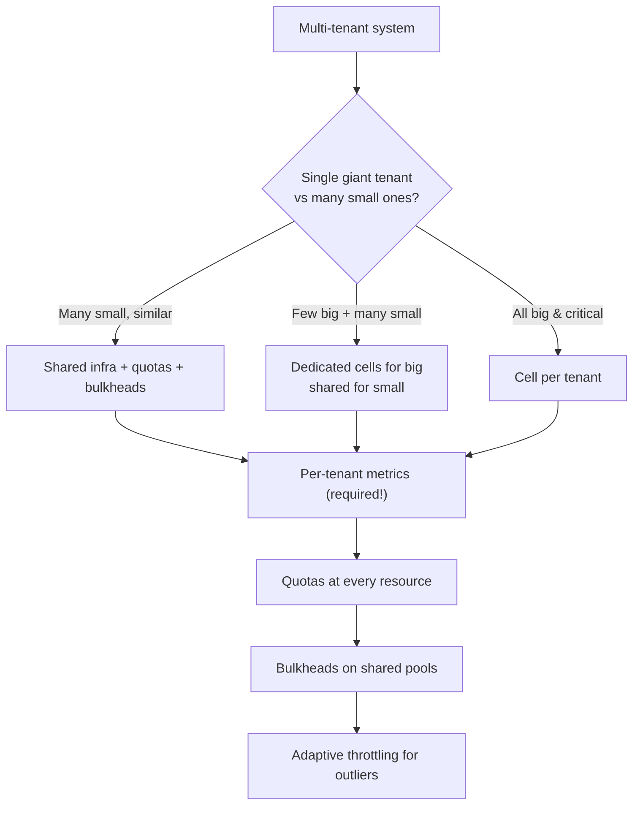

# Noisy Neighbor Problem in Multi-Tenant Systems

> **TL;DR.** When multiple tenants share infrastructure, one misbehaving tenant — a runaway batch job, a crawler, a debug loop — consumes a disproportionate share of resources (CPU, IO, DB connections, memory, cache, network) and degrades everyone else. The fix is **isolation at every shared resource**: per-tenant quotas, bulkheads, fair queueing, cell-based architecture, and in the extreme case, dedicated infrastructure for the largest tenants.

---

## 1. Where noise actually comes from

```
┌──────────────────────────────────────────────────────────────────┐
│                    SHARED RESOURCE LAYERS                         │
├──────────────────────────────────────────────────────────────────┤
│                                                                  │
│  Layer                         Noise mechanisms                  │
│  ─────                         ────────────────                  │
│                                                                  │
│  CPU (on a VM)                 One tenant pegs a core            │
│  Memory / heap                 OOM triggers GC thrash globally   │
│  Thread pool                   Tenant X blocks all threads       │
│  DB connection pool            Tenant X holds 80% of connections │
│  Disk IOPS                     Tenant X's scans saturate SSD     │
│  Network bandwidth             Tenant X ingests 10 GB/s          │
│  Cache (Redis)                 Tenant X evicts others' entries   │
│  Queue depth                   Tenant X backlog starves others   │
│  Index / search                Tenant X's huge query blocks      │
│  External API quotas           Tenant X eats shared API budget   │
│                                                                  │
└──────────────────────────────────────────────────────────────────┘
```

Every shared resource can be weaponised. Your isolation strategy must cover *each* layer — the weakest layer is where noise leaks through.

---

## 2. The isolation stack

```
┌───────────────────────────────────────────────────────────────┐
│              FIVE LAYERS OF TENANT ISOLATION                   │
├───────────────────────────────────────────────────────────────┤
│                                                               │
│  1. Cell / shard-per-tenant      (strongest, most expensive)  │
│  2. Dedicated infra for big      (hybrid)                     │
│     tenants                                                   │
│  3. Rate limits & quotas         (soft, cheap, effective)     │
│  4. Bulkheads / fair queueing    (on shared resources)        │
│  5. Observability per tenant     (you can only fix what you   │
│                                   can see)                    │
│                                                               │
└───────────────────────────────────────────────────────────────┘
```

Real systems use 3+4+5 for most tenants, and move the biggest tenants up to 1 or 2.

---

## 3. Cell-based / shard-per-tenant

The strongest isolation: each tenant (or tenant group) gets its own cell — independent compute + data + caches.

```
     Cell A            Cell B            Cell C
  ┌──────────┐     ┌──────────┐     ┌──────────┐
  │ app tier │     │ app tier │     │ app tier │
  │ DB       │     │ DB       │     │ DB       │
  │ cache    │     │ cache    │     │ cache    │
  └──────────┘     └──────────┘     └──────────┘
   tenants 1-50    tenants 51-100   tenants 101-150
```

- Blast radius per tenant = one cell.
- One tenant's bug can't touch others.
- Trades efficiency (spare capacity per cell) for safety.
- AWS, Shopify, Slack all use this. Slack cells per workspace tier; AWS cells for S3 request handling.

**When to use:**
- Regulated / high-compliance tenants (PCI, HIPAA).
- "Whale" customers willing to pay for dedicated infra.
- Products where a single-tenant outage is catastrophic (e.g., B2B SaaS).

---

## 4. Quotas — the universal lever

Per-tenant quotas on every finite resource. The full list, from the interview perspective:

| Resource | Typical quota |
|----------|---------------|
| Requests per second | 1000 req/s |
| Concurrent requests | 50 |
| CPU seconds per request | 10 s |
| Memory per request | 500 MB |
| DB rows read per query | 1M |
| DB connections held | 5 |
| Outbound bandwidth | 100 MB/s |
| Storage used | 100 GB |
| Kafka produce rate | 10 MB/s |
| Cache memory footprint | 500 MB |
| Concurrent long polls / WebSockets | 1000 |

Enforcement: reject over-quota requests with **429**, with clear error messages. See [09-DistributedRateLimiting.md](09-DistributedRateLimiting.md) for how to enforce distributed quotas.

**Tiered quotas**: free / pro / enterprise have different numbers. Don't hide the limits; expose them in docs and headers (`X-RateLimit-Remaining`).

---

## 5. Bulkheads on shared resources

Bulkhead = partition a shared pool so one tenant can't exhaust it.

### 5.1 Thread pools

Per-tenant (or per-tenant-group) thread pool, each with a fixed size:

```
┌─────────────────────────────────────────────────────┐
│                Application Server                    │
│                                                     │
│  pool_bronze_tenants:  200 threads                  │
│  pool_silver_tenants:  200 threads                  │
│  pool_gold_tenants :   200 threads                  │
│                                                     │
│  Tenant X (silver) runs amok → silver pool fills,   │
│  but bronze and gold tenants still served normally  │
└─────────────────────────────────────────────────────┘
```

### 5.2 DB connection pool

- Application-level: separate connection pools per tenant tier. Pin connections.
- DB-level: Postgres `pg_bouncer` with per-user connection limits; MySQL `max_user_connections`.

### 5.3 Queue fair-share

A single FIFO queue lets one tenant fill it and starve the rest. Use **round-robin across per-tenant sub-queues**:

```
          ┌── tenant_A_queue
Kafka ─── ├── tenant_B_queue
          └── tenant_C_queue

Consumer:
    pick tenant in round-robin
    process next message from that tenant's sub-queue
```

Weighted fair queueing adjusts the rotation by tenant tier (gold gets 3 slots per cycle; bronze gets 1).

### 5.4 Cache isolation

- **Memory quota per tenant**: Redis Cluster with tenant-prefix + allkeys-lfu eviction; measure per-prefix memory via `MEMORY USAGE` patterns.
- **Separate Redis shards** for tier-A tenants — no cross-pollution.
- **Client-side cache** with a per-tenant size budget.

---

## 6. Storage — the often-forgotten dimension

A huge tenant's data can make *queries* slow for everyone:

- Table scans get larger.
- Indexes fit in memory less well.
- Background maintenance (VACUUM, compaction) takes longer.
- Backups run longer and overlap.

### 6.1 Table-per-tenant vs row-per-tenant

- **Shared tables** (row-per-tenant + `tenant_id` column): flexible, but one giant tenant can skew indexes. Partition the table by `tenant_id` so queries hit only the relevant partition.
- **Table-per-tenant**: explicit isolation at the storage engine. More metadata cost; harder cross-tenant analytics.
- **Database-per-tenant**: ultimate isolation. Used in B2B SaaS where tenants have low count (< 10 000) and separate SLAs.

### 6.2 Per-tenant disk IOPS

Cloud block storage (AWS EBS `gp3`, Azure Premium SSD) has per-volume IOPS limits. Noisy IOPS tenants cause throttling on shared volumes. Move hot tenants to separate volumes or higher-IOPS classes.

---

## 7. Noisy-neighbor detection

You can't fix what you can't see. Tag *every* metric by `tenant_id`:

```
metric http_request_duration_ms {
    tenant_id = "acme_corp"
    endpoint  = "/orders"
    status    = "200"
}
```

Watch for:

- **Top-K consumers** per resource (CPU, DB connections, cache memory).
- **Relative share**: is tenant X usually 5% of traffic but now 50%?
- **Cross-tenant correlation**: "when tenant X runs its Monday 9 AM batch, everyone's latency degrades 2×". That's the smoking gun.

Tools:
- Per-tenant dashboards (Grafana variables).
- Anomaly detection on per-tenant metrics.
- Synthetic probes from a canary tenant; if canary latency rises, someone is being noisy.

---

## 8. Dynamic throttling / adaptive shedding

Static quotas handle typical abuse. For **outliers** you need adaptive defenses:

1. **Detect** per-tenant saturation (high CPU attribution, long tail latencies concentrated on one tenant).
2. **Throttle** that tenant proactively: "you're causing 40% of our load; your current limit is reduced 50% for the next 10 min".
3. **Notify** the tenant (ideally: suggest the fix).
4. **Escalate**: if the tenant doesn't recover, isolate them to a penalty cell.

This is hard to get right. False positives enrage paying customers. Start conservative and mention it's on the roadmap.

---

## 9. Cost allocation — the flip side

Multi-tenancy has a *pricing* problem too: how do we charge each tenant for their usage? Without per-tenant telemetry, you end up subsidising heavy users with light users' fees — classic noisy-neighbor economics.

- Tag resources by tenant; aggregate monthly.
- Chargeback or showback dashboards.
- Tier pricing that reflects true cost (e.g., storage tiers, IOPS tiers).

---

## 10. Architectural checklist



---

## 11. Anti-patterns

| Anti-pattern | Why it fails |
|--------------|--------------|
| "Oversize the infra" as the only defence | Works until a bug in one tenant saturates anyway |
| No per-tenant metrics | You can't detect which tenant is noisy |
| Global rate limit only | One tenant starves others up to the global limit |
| Same table with no partitioning | Huge-tenant data slows queries for everyone |
| Single Redis for all tenants with no per-prefix memory tracking | One tenant evicts the rest |
| Infrequent quota reviews | Over-provisioned "free" tier becomes an attack surface |
| Chatty polling APIs with no cost-based quotas | 1 req/s × 10K tenants still = 10K req/s |
| Isolation "when we need it" | By the time you need it, it's a migration project |

---

## 12. Interview talking points

- **Name the five layers.** Cells, dedicated for big, quotas, bulkheads, observability. Don't just say "we'll rate limit".
- **Call out per-tenant metrics.** This is the senior-signal move — most candidates just add a rate limit without being able to tell which tenant broke things.
- **Cell architecture** for the whale-customer case. Slack / AWS / Shopify pattern.
- **Fair queueing.** Round-robin per tenant, weighted by tier.
- **Storage dimension.** Partition by `tenant_id`; think about IOPS, not just rows.
- **Economic angle.** "Noisy neighbor is also a cost-allocation problem — tag for chargeback."
- **Adaptive throttling.** With care — false positives cost you customers.

---

## 13. Related reading

- [05-RetryStormsAndCircuitBreakers.md](05-RetryStormsAndCircuitBreakers.md) — bulkheading at the service boundary.
- [09-DistributedRateLimiting.md](09-DistributedRateLimiting.md) — enforcing per-tenant quotas.
- [03-HotKeysAndHotPartitions.md](03-HotKeysAndHotPartitions.md) — one tenant's hot key is the noisy-neighbor root cause.
- [../03-AdvancedConcepts/06-Microservices.md](../03-AdvancedConcepts/06-Microservices.md) — service mesh for per-tenant policies.
- [../InterviewProblems/README.md](../InterviewProblems/README.md) §15 Platform Services — where multi-tenancy shows up in interviews.
