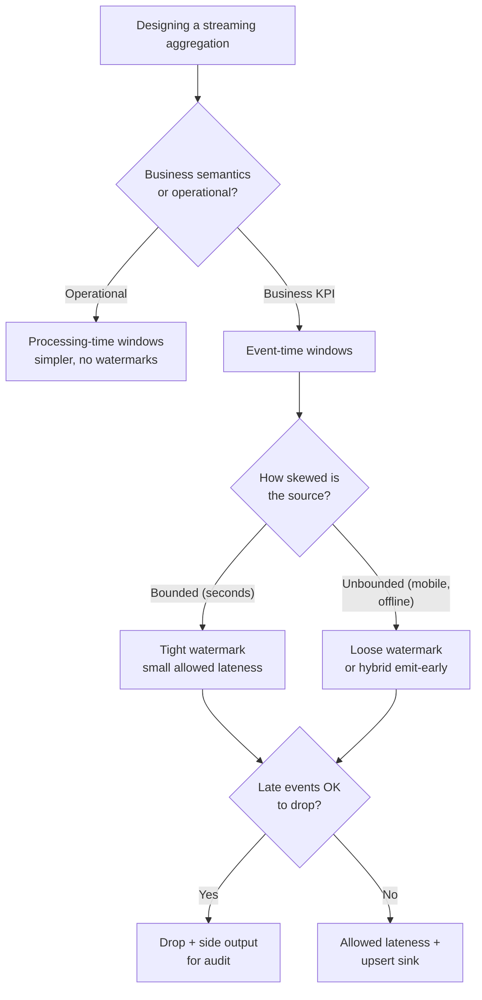

# Watermarks & Late-Arriving Events in Stream Processing

> **TL;DR.** Stream processors must decide *when* to close a window and emit a result — but events arrive late, out of order, and with unbounded skew (mobile offline queues, network retries, clock drift). **Watermarks** are the formal tool that says "I believe no event older than time T will arrive"; they let the processor close windows and emit aggregates while bounding staleness. The trade-off: a tight watermark (low staleness) drops more late data; a loose watermark (accurate) holds state longer and emits later. The modern answer is **watermarks + allowed lateness + retract/update semantics**.

---

## 1. Why the problem exists

Every event carries two timestamps:

```
{
    "event_id":        "E-42",
    "event_time":      "2025-04-23T14:25:03Z",  ← when it HAPPENED
    "processing_time": "2025-04-23T14:26:17Z",  ← when we SAW it
    ...
}
```

Between the two, arbitrary things can happen:

| Cause of lateness | Typical delay |
|-------------------|---------------|
| Network retry | ms – s |
| Mobile app offline → later reconnect | minutes – **days** |
| Consumer lag due to a slow downstream | seconds – minutes |
| Cross-region replication | 50 ms – seconds |
| Clock skew between producers | ms – minutes |
| Redelivery after consumer crash | seconds – minutes |
| Back-pressured producer | seconds – hours |

The key consequence: **events for window `[14:00, 14:05)` can arrive at 14:06, 14:30, or tomorrow**. If you close the window at 14:05 wall-clock you drop real events. If you never close it, you never emit an answer.

---

## 2. Event time vs processing time

```
┌───────────────────────────────────────────────────────────────┐
│                TWO CLOCKS, TWO TRADE-OFFS                      │
├───────────────────────────────────────────────────────────────┤
│                                                               │
│  PROCESSING TIME                                              │
│    "bucket by when we saw the event"                          │
│    Pros: trivial; deterministic in terms of wall clock        │
│    Cons: depends on pipeline speed / backlog                  │
│           → 10:00–10:05 bucket contains events from           │
│             any earlier event time                            │
│    Use for: pipeline health, operational metrics             │
│                                                               │
│  EVENT TIME                                                   │
│    "bucket by when the event actually happened"               │
│    Pros: correct business answer regardless of lag            │
│    Cons: must deal with late data explicitly                  │
│    Use for: business KPIs, billing, fraud, analytics         │
│                                                               │
└───────────────────────────────────────────────────────────────┘
```

Senior-engineer rule: **for business semantics, always use event time**. Processing time is for operational dashboards, never for answers customers see.

---

## 3. What a watermark actually is

A watermark is a **monotonically increasing timestamp** that flows through the stream interleaved with the data:

```
data ──► E(14:01) E(14:02) W(14:03) E(14:02) E(14:04) W(14:05) …
                            ▲                             ▲
                       "no more events                "no more events
                        older than 14:03"              older than 14:05"
```

When a window's upper bound ≤ the current watermark, the window is "complete" and can emit. Windows are garbage-collected after emission + allowed-lateness grace.

### 3.1 How the watermark value is chosen

Two families of strategies:

**Heuristic (most real systems)**
```
watermark = max_observed_event_time - bounded_out_of_orderness

e.g. WatermarkStrategy
       .forBoundedOutOfOrderness(Duration.ofSeconds(30))
```

You declare: "my events can be up to 30 s out of order." The system subtracts 30 s from the max event time it has seen to get the watermark. Simple, widely used.

**Perfect (only for special cases)**
If the source is strictly ordered per key (e.g., Kafka per-partition with per-producer ordering), you can assert a *perfect* watermark. Rare in practice.

### 3.2 Per-key / per-partition watermarks

Watermarks are **per parallel subtask**, not global. The framework computes the global watermark as the **minimum** of all parallel-source watermarks:

```
partition 0 watermark: 14:05:00
partition 1 watermark: 14:04:30    ← slowest, drives global
partition 2 watermark: 14:07:00
─────────────────────────────
global watermark:     14:04:30
```

If one partition is idle or stuck, the global watermark stalls → nothing emits. This is the **idle-source problem**; Flink's `withIdleness()` marks stalled sources as idle so they don't hold back the global watermark.

---

## 4. Window types and how watermarks close them

```
┌──────────────────────────────────────────────────────────────────┐
│                      THREE WINDOW SHAPES                          │
├──────────────────────────────────────────────────────────────────┤
│                                                                  │
│  TUMBLING (no overlap)                                           │
│    [14:00, 14:05)  [14:05, 14:10)  [14:10, 14:15)                │
│    each event belongs to exactly one window                      │
│    classic "5-minute aggregates"                                 │
│                                                                  │
│  SLIDING / HOPPING (overlap)                                     │
│    [14:00, 14:05)                                                │
│      [14:01, 14:06)                                              │
│        [14:02, 14:07)        slide = 1 min, size = 5 min         │
│    each event belongs to 5 windows (size/slide)                  │
│    "top-K over the last 5 min, updated every minute"             │
│                                                                  │
│  SESSION (gap-based, dynamic)                                    │
│    user clicks: 14:00, 14:01, 14:03       (gap 3 min, fine)     │
│                 … no clicks for 35 min …                         │
│                 14:38, 14:39              (new session)          │
│    session window threshold = 30 min                             │
│                                                                  │
│  GLOBAL                                                          │
│    one endless window, requires custom trigger                   │
│                                                                  │
└──────────────────────────────────────────────────────────────────┘
```

### 4.1 When a window fires

```
event arrives ──► added to window state (in RocksDB / state backend)
                           │
watermark advances ──► does window.end ≤ watermark?
                           │
                          yes
                           ▼
                  trigger fires → emit result → window moves to
                                                "within-grace" state
                           │
grace period expires ──► delete window state
```

Trigger types:
- **EventTimeTrigger** (default) — fires at watermark.
- **ProcessingTimeTrigger** — fires at wall clock.
- **Custom** — fire on every element, or every N elements, or continuously (for "early fire" outputs).

---

## 5. Allowed lateness — the grace window

Events that arrive **after** the watermark has passed their window are "late". Options:

```
1. Drop them (default if allowed_lateness = 0)
2. Keep window state for an "allowed lateness" period (e.g., 1 h)
   Late events update the window; emit updated result (fire again)
3. Divert to a side output ("late-data sink") for offline handling
```

In Flink:
```java
stream
  .keyBy(ev -> ev.userId)
  .window(TumblingEventTimeWindows.of(Time.minutes(5)))
  .allowedLateness(Time.hours(1))                      // keep state 1h past watermark
  .sideOutputLateData(lateTag)                          // anything even later
  .aggregate(new CountAgg());
```

### 5.1 The retract / upsert problem

If your window *already emitted* 1,000 and a late event adds 1 more, downstream has a stale 1,000.

- **Append sink** (Kafka topic, warehouse insert) → emit a second record showing 1,001. Downstream must know how to reconcile (Kafka key-compaction with the window key, Flink Table upsert mode).
- **Upsert sink** (Redis, DynamoDB, JDBC with merge) → write 1,001 by the window's primary key. Last-write-wins at the sink.
- **Retract stream** (Flink Dynamic Tables) → emit `(-, 1000)` then `(+, 1001)`. Downstream aggregates sum correctly.

**Interview line:** *"I choose upsert sinks keyed by `(window_key, window_end)` — that way late updates naturally replace the prior emission, and the downstream doesn't need retract logic."*

---

## 6. Tight watermark vs loose watermark — the core trade-off

```
tight watermark (5 s skew tolerance)
  window closes fast → low emission latency
  but 10-minute-late events are DROPPED (or complicate things)

loose watermark (1 hour skew tolerance)
  window stays open 1h → emission is 1h delayed
  catches almost all late data
```

You pick based on **how your consumers use the data**:

| Consumer need | Setting |
|---------------|---------|
| Real-time dashboard, "good enough" | Tight watermark, small allowed lateness, accept some drops |
| Billing, compliance, exactly right | Loose watermark OR tight watermark + long allowed lateness + upsert |
| Fraud "is this account taking risky actions now" | Tight; late events are ex-post-facto anyway |
| Ad click attribution (must count every click within a billing window) | Long allowed lateness (24 h+); retractions |

### 6.1 Emit early + correct later

Many pipelines emit on a **continuous / early-fire** trigger (every 30 s) plus final emission at watermark. Downstream gets an approximate answer fast, then a canonical answer when the window closes. Requires retract-aware or upsert-aware consumers.

---

## 7. Concrete example — counting impressions per ad per minute

```
Business requirement:
  "count ad impressions per ad_id per minute, correct to within 1%,
   emit within 5 minutes of minute-end"

Design:
  - Event time based (use impression_ts embedded in event)
  - Tumbling 1-minute windows by ad_id
  - Bounded out-of-orderness: 30 s → watermark = max - 30s
  - Allowed lateness: 4 min (total 4m30s grace past window end)
  - Sink: DynamoDB upsert keyed by (ad_id, window_start)
  - Side output late events past 4 min → S3 bucket for daily reconciliation job

Expected behaviour:
  window [14:00, 14:01):
    events stream in up to 14:01:30 (watermark catches up) → first emit
    events arriving 14:01:31 – 14:05:00 → upsert update
    events arriving after 14:05:00 → side output, offline reconcile
```

---

## 8. Flink / Kafka Streams / Spark — which is which

| Concept | Flink | Kafka Streams | Spark Structured Streaming |
|---------|-------|---------------|----------------------------|
| Event-time watermark | First-class, per-operator | Implicit via `stream-time`; simpler | `withWatermark("ts", "10 minutes")` on the DataFrame |
| Allowed lateness | `.allowedLateness()` | `grace()` on `TimeWindows` | Controlled by `withWatermark` threshold |
| Out-of-order tolerance | Configurable per source | Implicit | Watermark delay |
| Side output for late data | `sideOutputLateData(tag)` | Supported via punctuator API | Not built-in; filter manually |
| Retract / upsert | Table API "changelog" mode | KTable semantics (natural upsert) | `outputMode("update" / "complete")` |
| State backend | RocksDB (large state) or Heap | RocksDB (local) | HDFS / blob for state |

**Default to Flink if you need rich event-time semantics with huge state.** Kafka Streams is lighter but has narrower primitives. Spark Structured Streaming is simpler but watermarks are per-query, not per-key.

---

## 9. State size — the hidden cost

Holding windows open costs state. Rough calc:

```
per-key state size  = bytes_per_record × events_per_window
total state         = per-key × active_keys × open_windows_at_once

example:
   ad_id cardinality = 1 M
   1-minute tumbling windows
   allowed lateness = 5 minutes   → 6 windows open per key at any time
   bytes per window state = 64 (aggregator)
   total ≈ 1M × 6 × 64 = 384 MB     (fits in RocksDB easily)

bad case:
   session windows, user_id cardinality 100M, 30-minute gap
   bytes per session = 256
   open sessions concurrently: ≈ 10M (active users)
   total ≈ 10M × 256 = 2.5 GB        (needs state-backend tuning, maybe TTL)
```

If allowed-lateness is 1 h and your throughput is 1M events/s, you may hold 3.6 B events in state. RocksDB manages it but watch compaction latency.

---

## 10. Failure modes & anti-patterns

| Anti-pattern | What breaks |
|--------------|-------------|
| Using processing time for business KPIs | Answers change if the pipeline is behind; customers notice and don't trust the number |
| Global watermark with no idleness detection | Single idle partition stalls the entire pipeline |
| Allowed-lateness = 0 on mobile-originated streams | Silent data loss when users reconnect after offline |
| Emit early but sink is append-only | Downstream double-counts; aggregate is wrong |
| Loose watermark + huge state + no TTL | OOM, checkpoint failures |
| Ignoring watermark skew across parallel tasks | One slow subtask slows entire pipeline |
| Changing watermark strategy in a running job | Reprocessing semantics diverge; state is suspect |
| Relying on source timestamp without validation | Malicious or buggy producers send timestamps 1970 or 3000 → watermark stuck or runaway |
| No late-data side output | "How many events did we drop?" is unanswerable after the fact |

---

## 11. Observability

Dashboards to maintain:

- **Watermark lag per operator** = (now − current watermark). Spikes → pipeline falling behind.
- **Late events dropped** (count per window).
- **Side-output late events** rate.
- **State size** per operator (RocksDB size, key count).
- **Event-time processing throughput** (records/s).
- **Checkpoint duration** — if state grows, checkpoints slow; eventually fail.
- **Emission lag** = (window emit timestamp − window_end wall clock).

Alert-worthy:
- Watermark lag > 2× expected out-of-orderness.
- Late-drop rate > business threshold (e.g., > 0.1% of events).
- State size growing without bound.

---

## 12. The quick decision tree



---

## 13. Interview talking points

- **Name event-time vs processing-time early.** Most candidates conflate them.
- **Say "watermark" out loud** with its definition: "no event older than T will arrive."
- **Call out the idle-partition problem.** Senior engineers know this one.
- **Trade-off: tight vs loose.** Articulate the latency-vs-accuracy curve.
- **Upsert sinks keyed by window.** The cleanest retract story.
- **State size is the hidden cost.** Show you've thought past semantics.
- **Distinguish allowed-lateness from watermark.** Two different knobs. Late = past watermark; expired = past watermark + allowed lateness.
- **Reference Flink.** It's the reference implementation. Mentioning Beam ("same model as Flink") is a bonus.
- **Say: "exactly-once display is usually idempotent upsert at the sink, not exactly-once delivery".** Ties back to [06-IdempotencyAndDeduplication.md](06-IdempotencyAndDeduplication.md).

---

## 14. Related reading

- [../07-SystemDesignAlgorithms/09-StreamWindowsAndTime.md](../07-SystemDesignAlgorithms/09-StreamWindowsAndTime.md) — compact summary of windows.
- [../03-AdvancedConcepts/05-StreamProcessing.md](../03-AdvancedConcepts/05-StreamProcessing.md) — Flink / Kafka Streams / Spark frameworks.
- [../03-AdvancedConcepts/DistributedSystems/11-DeliverySemantics.md](../03-AdvancedConcepts/DistributedSystems/11-DeliverySemantics.md) — at-least-once interplay with late events.
- [06-IdempotencyAndDeduplication.md](06-IdempotencyAndDeduplication.md) — upsert sinks, exactly-once display.
- [../03-AdvancedConcepts/DistributedSystems/01-ClocksAndOrdering.md](../03-AdvancedConcepts/DistributedSystems/01-ClocksAndOrdering.md) — why wall-clock time is unreliable.
- [../InterviewProblems/01-TelecomCDRSpikeDetection.md](../InterviewProblems/01-TelecomCDRSpikeDetection.md) — worked example using event-time windows.
