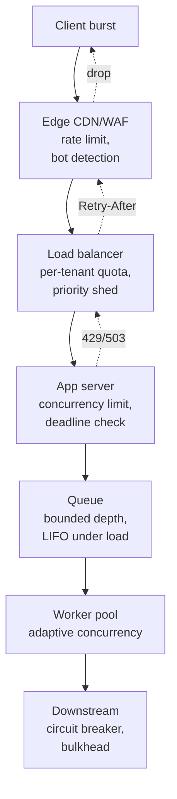

# Backpressure and Load Shedding

> **TL;DR.** When arrival rate exceeds service rate, *something* has to give. If you queue forever you will **crash** (memory, then the whole fleet). If you retry harder you make the congestion worse. The only safe response is to **push back on producers** (backpressure) and **drop the least valuable work** (load shedding). Senior engineers do both: propagate pressure upstream so producers slow down, and shed load at the edge so the core stays healthy. Retries and circuit breakers are a *companion* topic; load shedding is the *last line of defence* that keeps the system from collapsing under its own weight.

---

## 1. The fundamental inequality

```
  arrival rate (λ)   >   service rate (μ)
  ───────────────────────────────────────
        queue grows without bound
        latency grows without bound
        memory fills
        GC thrashes
        everything gets slower
        retries multiply
        → collapse
```

There are exactly three responses to `λ > μ`:

1. **Increase μ** (autoscale — but it's never instant).
2. **Decrease λ** (backpressure — slow producers down).
3. **Drop excess work** (load shedding — refuse requests you won't serve in time).

Queuing alone is *not* a response. A queue absorbs *bursts*, not *sustained overload*. A queue during sustained overload is a memory-allocation bug in slow motion.

---

## 2. Queues are lies

```
┌──────────────────────────────────────────────────────────┐
│           A QUEUE "PROTECTS" YOUR SERVICE                 │
├──────────────────────────────────────────────────────────┤
│                                                          │
│   Client → [====== queue depth 10k ======] → worker      │
│                                                          │
│   At λ = μ:      queue ~ 0, latency = service time       │
│   At λ > μ:      queue grows; latency = queue/μ ∞        │
│   At λ < μ:      queue = 0 always                        │
│                                                          │
│   The queue hid the overload — it did not fix it.        │
└──────────────────────────────────────────────────────────┘
```

**Little's Law:** `L = λ × W` → queue length ∝ arrival rate × wait time. Doubling arrival rate doubles wait time (at fixed service rate). A 10-second-deep queue means *every new request* waits 10 seconds — long enough that clients have timed out, retried, and amplified λ further.

**The rule:** queues must have a **bounded depth** and a **bounded age**. When either bound is hit, you shed.

---

## 3. Backpressure — pushing the problem upstream

Backpressure = "the consumer tells the producer to slow down".

### 3.1 How it manifests at each layer

| Layer | Backpressure signal |
|-------|---------------------|
| TCP | Sliding window shrinks → sender can't send |
| HTTP/2 | Per-stream flow control windows |
| gRPC streaming | `onReadyStateHandler` / `isReady()` |
| Kafka producer | `max.in.flight.requests` + broker throttle responses |
| Reactive streams (Project Reactor / RxJava) | `request(n)` — pull-based demand |
| Thread pool | `RejectedExecutionHandler` (CallerRunsPolicy, AbortPolicy) |
| Load balancer | Return 503 with `Retry-After` |
| Synchronous call | 429 / 503 → caller backs off |

### 3.2 Push vs pull

- **Push**: producer decides the rate. *No natural backpressure.* Needs an explicit signal.
- **Pull**: consumer decides the rate. *Backpressure is automatic* — the consumer doesn't ask for more than it can handle.

```
Push (no BP):          Pull (BP built-in):
  prod → [queue]         prod      [buffer]
         ▲  fills          ▲  grabs only what
         │  unbounded      │  it can process
  cons (slow)              cons → "give me 10"
```

Kafka is pull-based: consumers fetch. That is why Kafka scales — slow consumers lag but don't break the producer. An HTTP POST with a firehose of messages is push-based — the receiver *must* shed or die.

### 3.3 Reactive / pull-based pipelines

```
source.request(10)     // consumer asks for 10 items
   ↓ produce 10
source.request(10)     // ask for next 10 only when ready
```

This is the `Flow.Subscriber` contract in Java 9+, Project Reactor's `Flux`, RxJava's `Flowable`, Akka Streams, and Node.js streams with the `highWaterMark`. Good library code *respects* demand; bad library code buffers without limit.

### 3.4 Propagation

A single service backpressuring helps nobody if its upstream keeps pushing. Backpressure must **propagate** all the way to the ingress edge:

```
edge API → service A → service B → DB
              ↑           ↑         ↑
            429/503      429       slow query
              │           │         │
              ▼           ▼         ▼
           edge drops   A sheds   A sees slow
                                  → reports 429 up
```

If any link in this chain buffers silently, the signal is lost.

---

## 4. Load shedding — dropping work on purpose

Load shedding = "accept fewer requests so the ones we accept get served properly."

### 4.1 Where to shed

```
┌───────────────────────────────────────────────────────────────┐
│                    SHED EARLY, SHED OFTEN                      │
├───────────────────────────────────────────────────────────────┤
│                                                               │
│ Client  → CDN / WAF  → Edge LB  → App  → Downstream           │
│          │           │          │                             │
│          │           │          │                             │
│     cheapest to shed ────────► most expensive to shed         │
│                                                               │
│  Every layer should have a shedding rule. The earlier you     │
│  shed, the less work you've already done for a doomed request.│
└───────────────────────────────────────────────────────────────┘
```

Dropping at the edge is ~0 CPU cost. Dropping after you've hit the DB is 10–1000× more expensive. **Shed at the earliest layer where you have enough signal to decide.**

### 4.2 What to shed — priority-based shedding

Not all requests are equal. Rank work by value:

| Tier | Example | Shed when |
|------|---------|-----------|
| P0 | Payment processing, auth | Almost never |
| P1 | Core product reads (feed, search) | Only severe overload |
| P2 | Personalization, recommendations | Moderate load |
| P3 | Analytics tracking, telemetry ingest | First sign of load |
| P4 | Batch jobs, re-index, warm-up | Always first |

In practice, tag every request with a priority (header `x-priority: 2`), and bake shed thresholds into your load balancer or app code.

```python
if load > 0.9: drop_tier >= 3
if load > 0.8: drop_tier >= 4
if load > 0.7: drop_tier >= 5
```

### 4.3 Shedding algorithms

**Fixed threshold** — simple: if CPU > 80%, reject 503. Blunt, but effective.

**Adaptive concurrency (Netflix's ideas)** — maintain a concurrency limit that adapts to latency:
- Measure latency at the current limit.
- If latency stays flat as you increase the limit: increase further.
- If latency starts rising: back off.
- This finds the "knee" of the curve automatically.

Libraries: **Netflix Concurrency-Limits**, **Envoy's adaptive concurrency filter**, **Finagle's failure accrual**.

**CoDel (Controlled Delay)** — originally a network queueing algorithm, adapted for service queues:
- Measure the *minimum queue delay* in a short sliding window.
- If it exceeds a target (e.g., 5 ms) for too long, drop requests until it recovers.
- Elegant: drops old requests (timed-out clients anyway) rather than new ones.

**LIFO queue under load** — reverse the queue order during overload. Newer requests still have a caller waiting; the oldest requests are already timed-out. Dropping LIFO-queued old requests is the right behaviour.

### 4.4 Deadline-aware shedding

The best shedding signal is the *request deadline*:

```
grpc.deadline = now + 200 ms
```

Every hop subtracts elapsed time from the deadline. If when your service receives a request the remaining deadline is < expected service time, **drop immediately** — serving it will only produce a result nobody is waiting for.

```java
if (deadline - now < estimatedServiceTime) {
    return DEADLINE_EXCEEDED;  // don't even try
}
```

This is called **deadline propagation** and is built into gRPC. It's the cleanest form of load shedding because it uses the client's own time budget.

---

## 5. The congestion collapse death spiral

Without shedding, overloaded systems enter a well-known pathological state:

```
      ┌──────────────────────────────────────┐
      │  Load ↑ → latency ↑                  │
      │  Latency ↑ → client timeouts ↑       │
      │  Timeouts → retries ↑                │
      │  Retries → Load ↑  (back to top)     │
      └──────────────────────────────────────┘
                  "Retry storm"
```

```
  request rate vs capacity

    useful work
         ▲
         │     ┌──── with load shedding
         │   ╱ 
         │  ╱  ┌─── without — collapse past a threshold
         │ ╱  ╱
         │╱  ╱
         └───────────────────►  offered load
```

The graph flattens (with shedding) instead of collapsing (without). This is Little's law plus retries — **the only path off the cliff is shedding**.

---

## 6. Client-side cooperation

Load shedding on the server is not enough. Clients must:

1. **Respect 429 / 503 + `Retry-After`.** Don't just retry immediately.
2. **Exponential backoff with jitter.** Randomise retry delay.
3. **Retry budgets.** No more than (e.g.) 10% of requests may be retries. See [`05-RetryStormsAndCircuitBreakers.md`](05-RetryStormsAndCircuitBreakers.md).
4. **Bound concurrency.** A client that fires 10 000 concurrent requests is a DDoS in disguise.
5. **Adaptive concurrency on the client.** Same idea as on the server — client infers server capacity and limits its send rate.

gRPC and good HTTP libraries (Envoy clients, Finagle, Ribbon) implement most of this out of the box.

---

## 7. Backpressure + shedding — a layered defence



Every arrow with `.` is a feedback signal. The *whole pipeline* has to participate; one lazy layer neutralises the others.

---

## 8. Queuing disciplines for the bounded queue

When the queue *does* get depth, how should you order work?

| Discipline | Good for |
|------------|----------|
| FIFO | Fairness; normal operation |
| LIFO | Overload (newer requests have callers still waiting) |
| Priority | Mixed-tier traffic |
| Weighted Fair Queueing | Multi-tenant fairness |
| Deadline-first | Real-time systems |
| CoDel | Maximum throughput without building up delay |

Most teams start with FIFO and a depth cap. Reconsider only when you see real multi-tier traffic.

---

## 9. Observability you need

- **Queue depth (per queue).** Alert at 50% of cap; page at 90%.
- **Queue age P99.** How old is the oldest in-queue item? Correlate with client timeouts.
- **Shed rate per tier.** "We shed 5% of P3 traffic in the last minute" is useful; "we shed 5% of requests" isn't.
- **Concurrency in flight.** What is the current `in-flight`? Is adaptive concurrency moving?
- **Deadlines exhausted.** Count of requests arriving past deadline — this is your "client already gave up" metric.
- **Retries from clients.** If this spikes, you have a storm. Cross-reference with shed rate.

---

## 10. Anti-patterns

| Anti-pattern | Why it hurts |
|--------------|--------------|
| Unbounded queue ("we'll just buffer") | OOM; memory allocation in slow motion |
| Infinite timeouts | Clients pile up; no natural shedding signal |
| Shedding randomly under load | Treats P0 and P4 the same — loses critical traffic |
| No `Retry-After` in 503 responses | Clients retry immediately → retry storm |
| Retries without a budget | 1% server errors → 2× retries → 4× retries… |
| Single global capacity number | No way to shed per tenant / per priority |
| Queue depth alert but no auto-shed | Paging at 2 AM to do what the system should do itself |
| Blind autoscaling as the only answer | Scaling is slow (minutes); collapse is fast (seconds) |
| Circuit breaker *without* shedding | Breaker opens, but queue still fills behind it |
| Buffering between microservices silently | Losing backpressure propagation |

---

## 11. Interview talking points

- **Name the two dials.** "Backpressure slows producers; load shedding drops requests. Both are necessary."
- **Queues hide overload, they don't fix it.** Quote Little's law if asked.
- **Shed by priority, not randomly.** Tag requests with tiers.
- **Shed at the edge.** Cheapest layer, richest signal (headers, rate limits).
- **Deadline propagation.** gRPC-style deadlines let each hop decide if it's worth starting.
- **Adaptive concurrency.** Mention Netflix's work; implies senior pedigree.
- **Client cooperation.** Retry budgets + jitter + respecting `Retry-After`.
- **Observability.** Queue age, shed rate per tier, concurrency in flight.
- **Autoscaling is not enough.** It's too slow for burst overload; shedding buys the seconds autoscaling needs.

---

## 12. Related reading

- [05-RetryStormsAndCircuitBreakers.md](05-RetryStormsAndCircuitBreakers.md) — retries are the *cause* of most overload; circuit breakers are the *enemy* of cascading failure.
- [09-DistributedRateLimiting.md](09-DistributedRateLimiting.md) — rate limits are a form of pre-emptive load shedding.
- [16-NoisyNeighborIsolation.md](16-NoisyNeighborIsolation.md) — per-tenant shedding as isolation.
- [../03-AdvancedConcepts/DistributedSystems/12-BackPressureAndRetries.md](../03-AdvancedConcepts/DistributedSystems/12-BackPressureAndRetries.md) — the theoretical backdrop.
- [../07-SystemDesignAlgorithms/01-RateLimitingAlgorithms.md](../07-SystemDesignAlgorithms/01-RateLimitingAlgorithms.md) — the specific algorithms (token bucket, sliding window, leaky bucket).
