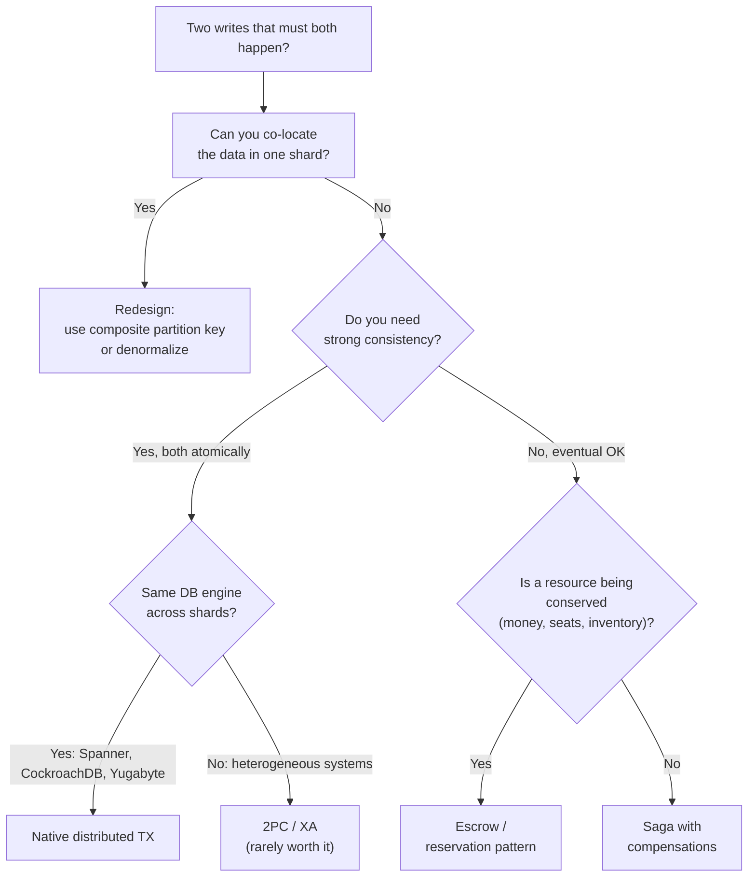

# Cross-Shard and Distributed Transactions

> **TL;DR.** Once data is sharded or spread across services, a single logical operation may touch data in two or more places that don't share a transaction context. You have four choices: **avoid the problem** by redesigning the data model, **two-phase commit (2PC)** for strong consistency with real downsides, **sagas** for eventual consistency with compensations, or **escrow / reservation** patterns for the narrow class of conserved resources (money, inventory). Each is right for a different problem. The senior-engineer skill is recognising the class and picking deliberately, not defaulting to "we'll use 2PC" or "it's eventually consistent, whatever".

---

## 1. Why the problem exists

A single ACID transaction gives you **A**tomicity, **C**onsistency, **I**solation, **D**urability — across the rows it touches. The catch: those rows must live in the same transactional scope. In practice, that means:

- Same DB instance (MySQL/PG).
- Same partition key (DynamoDB single-partition transaction).
- Same shard group (Spanner split group).

Once you cross:

- **Sharded DB** — transfer $100 from account A (shard 3) to account B (shard 7).
- **Multiple services** — "place order" touches Order-svc DB + Inventory-svc DB + Payment-svc DB.
- **DB + cache / search / warehouse** — write to DB *and* keep a derived index consistent.
- **Multiple regions** — user in EU writes; payment must be visible globally.

…you've left the scope of local ACID. Something else must provide the guarantees you actually need.

---

## 2. The decision tree



**Step 0 is the right answer most of the time.** Most "distributed transactions" problems are "I sharded on the wrong key" in disguise.

---

## 3. Option A — Avoid: co-locate and denormalize

```
Before:  user_profile (shard by user_id)
         user_settings (shard by user_id)
         user_prefs (shard by user_id)
         → transactional updates span 3 tables across 3 shards
         → requires distributed TX

After:   user_entity (shard by user_id, contains all three aspects)
         → one atomic write. Done.
```

### 3.1 Techniques

- **Composite partition keys.** Put related entities in the same partition. Parent + child rows share a key prefix.
- **Entity groups (Spanner / Megastore).** Explicitly declare: "these tables are grouped, co-located, transactable together."
- **Aggregate design (DDD).** Identify the invariant boundary; everything inside is one transactable aggregate; across aggregates, you need another approach.

### 3.2 When this fails

- The two entities genuinely have different natural keys (`user_id` vs `org_id`).
- Co-location creates a hot shard (all whales in one bucket).
- Cross-entity analytics become hard.

But always *try* co-location before reaching for distributed transactions. 70% of cases are solvable here.

---

## 4. Option B — Native distributed transactions

Some databases implement distributed transactions correctly, for you.

### 4.1 Google Spanner / CockroachDB / YugabyteDB

All use a variant of **Paxos / Raft per shard + 2PC across shards, with a global clock**:

```
Client: BEGIN; UPDATE shard_A ...; UPDATE shard_B ...; COMMIT

Spanner:
  1. Acquire row locks on shards A and B.
  2. Coordinator picks commit timestamp via TrueTime.
  3. Each shard's Paxos group acknowledges.
  4. Commit record durable; release locks.
```

Spanner's **TrueTime** (and CockroachDB's **HLC**) give **external consistency**: the commit timestamp order matches real-world order.

**When to use:**
- Your product requires strong consistency + horizontal scale *and* you can pay for it.
- Financial, regulatory, or coordination-heavy workloads.

**When not:**
- Single-region workloads where Postgres / MySQL scale fine.
- Latency-sensitive systems — distributed commit is slower (~5-50 ms) than local.

### 4.2 DynamoDB TransactWriteItems

Up to 100 items across any tables, as long as *all participating items are in the same region*. Implemented with internal 2PC. Limited and expensive (uses 2× normal WCUs) but honest about the trade-off.

---

## 5. Option C — Two-phase commit (XA / 2PC)

The classical algorithm. You almost never want to build this yourself.

### 5.1 The protocol

```
┌────────────────────────────────────────────────────────────┐
│                    TWO-PHASE COMMIT                         │
├────────────────────────────────────────────────────────────┤
│                                                            │
│  Phase 1: PREPARE                                          │
│    Coordinator → all participants: "prepare"               │
│    Each participant: write redo log, acquire locks,        │
│                      reply "yes" (ready) or "no" (abort)   │
│                                                            │
│  Phase 2: COMMIT (or ABORT)                                │
│    If all "yes":   coordinator → all: "commit"             │
│    If any  "no":   coordinator → all: "abort"              │
│    Each participant: durably commit or rollback; release   │
│                                                            │
└────────────────────────────────────────────────────────────┘
```

### 5.2 Why it's painful

- **Blocking.** If the coordinator dies *after* prepare but *before* commit, participants hold locks indefinitely. Manual recovery.
- **Coupled availability.** All participants must be up and reachable for the commit to proceed. A 5-node 2PC has worse availability than any single node.
- **Slow.** Two round trips. Disk syncs at each phase.
- **Poor support.** Modern message brokers (Kafka), HTTP APIs, most SaaS services don't implement XA.
- **Still not global.** 2PC is not safe under arbitrary network partitions without Paxos/Raft underneath — hence the design of Spanner/Cockroach.

### 5.3 When to still use it

- Legacy enterprise integration (JEE, JMS, XA-compliant DBs).
- Small, well-controlled set of participants with strict consistency requirements.
- You've ruled out every other option.

In modern system design, "use 2PC" in the first instinct almost always indicates a data-model problem that co-location or sagas would solve better.

---

## 6. Option D — Saga pattern (forward-only)

See [`19-SagaAndLongRunningWorkflows.md`](19-SagaAndLongRunningWorkflows.md). Summary:

- Each step a local transaction.
- On failure, run compensations in reverse.
- **Eventually consistent** — there is a visible window of inconsistency.
- **Not isolated** — intermediate state is visible to other transactions. Your design must tolerate that (use "pending" flags, semantic locks).

**Right choice for:**
- Business workflows ("place order", "register user", "cancel subscription").
- Cross-service flows where services are independent.
- Any flow > 1 second or requiring human input.

**Wrong choice for:**
- Tight financial invariants where intermediate state must be invisible (two concurrent sagas might see an inconsistent partial view).
- Small, latency-sensitive atomic operations.

---

## 7. Option E — Escrow / reservation (conserved resources)

A specialised but powerful pattern when the resource in question is **conserved** (money, seats, inventory units).

```
┌────────────────────────────────────────────────────────────┐
│                 ESCROW / RESERVATION                        │
├────────────────────────────────────────────────────────────┤
│                                                            │
│  State per row:                                            │
│    balance        = 1000                                   │
│    reserved       = 0        (pending outflow)             │
│    available      = balance - reserved = 1000              │
│                                                            │
│  Transfer $100 to another account:                         │
│    1. Reserve: account A: reserved += 100 (local TX)       │
│    2. Credit:  account B: balance  += 100 (local TX)       │
│    3. Confirm: account A: balance -= 100; reserved -= 100  │
│                                                            │
│  Each step is a local transaction on one shard.            │
│  Intermediate state is visible but safe:                   │
│     available = balance - reserved is never over-committed │
│                                                            │
└────────────────────────────────────────────────────────────┘
```

### 7.1 Why it works

- Each step uses only local transactions — no cross-shard coordination.
- The `reserved` counter means overselling is impossible at the origin.
- Recovery is natural: a failed saga releases the reservation.
- Scales perfectly — each account lives on one shard.

### 7.2 Variants

- **Inventory reservation:** `available_units = stock - reserved_units`. Common in e-commerce.
- **Seat holds:** airline/cinema booking. Hold expires after N minutes if not confirmed.
- **Payment authorization vs capture:** credit card `AUTH` followed by `CAPTURE` — built on the same idea, universally.

Requires an expiry / janitor to reclaim stale reservations.

---

## 8. Choosing isolation level (when the write crosses rows)

Distributed transactions complicate isolation. A few truths:

| Isolation level | Offered by | Covers |
|-----------------|------------|--------|
| Read committed | Most SQL DBs | Dirty read prevented |
| Repeatable read | Postgres (with caveats), MySQL InnoDB | Non-repeatable read prevented |
| Serializable | PG SSI, Spanner, Cockroach | Write skew prevented |
| Snapshot isolation | Oracle, SQL Server, CRDB | Most anomalies except write skew |

**Cross-shard:** Spanner/Cockroach give serializable; naive sagas give *no isolation* between concurrent sagas → **write skew** can still happen.

**Write skew example:** doctor scheduling — "at least one doctor must be on-call". Two concurrent transactions each check "there are 2 on-call, I can leave" and both leave. Neither saw the other's write.

**Fix:** materialise the invariant into a row others must lock (a "roster" row that any change must `SELECT FOR UPDATE`). In a saga, you can't rely on DB locks across services — model the invariant as a **coordination resource** (semaphore, lease, central scheduler).

---

## 9. Cross-region specifics

Local distributed transactions across the same datacenter are hard. Across regions they're brutal:

- 100 ms+ RTT per phase.
- Availability tanks (5-region 2PC = 5-way AND of regional availability).
- Split brain risk.

Modern answer:

- **Single-region writes; async replication.** Most e-commerce / social.
- **Regional sharding of the workload.** EU users write to EU; US users to US. No cross-region TX.
- **Spanner-like global write path.** For the rare "must be strongly consistent globally" cases.

See [`13-MultiRegionFailover.md`](13-MultiRegionFailover.md) and [`24-GeoReplicationAndCrossRegionConsistency.md`](24-GeoReplicationAndCrossRegionConsistency.md).

---

## 10. A concrete walkthrough: money transfer

The canonical problem. Three good designs, one bad one.

### 10.1 BAD: dual-write in app code

```python
db.update(debit(from_acct, 100))
db.update(credit(to_acct, 100))
```
Cross-shard, no atomicity. Process crash between → money vanishes or duplicates.

### 10.2 OK: saga with compensation

```
debit(from_acct, 100)          ← local TX
credit(to_acct, 100)           ← local TX
if credit fails: credit(from_acct, 100)  ← compensation
```
Works, but intermediate state is `from` is debited, `to` is not credited. Balance invariant (`total money = const`) violated during the window.

### 10.3 GOOD: escrow / reservation

```
reserve(from_acct, 100)        ← local TX (reserved += 100)
credit(to_acct, 100)           ← local TX
confirm(from_acct, 100)        ← local TX (balance -= 100; reserved -= 100)
```
Total money = const at every instant. Scales per-account.

### 10.4 GOLD: Spanner-class strong TX

```
BEGIN;
  UPDATE accounts SET balance -= 100 WHERE id = from;
  UPDATE accounts SET balance += 100 WHERE id = to;
COMMIT;
```
Simple. Correct. Expensive (latency; infrastructure cost). Right for regulated finance.

---

## 11. Observability and operational hygiene

- **Dangling prepared transactions** (for 2PC): alert on > 5 s old prepared state.
- **Saga timeout rate**: workflows stuck mid-flight.
- **Compensation invocation rate**: should be rare; spikes = something upstream is broken.
- **Reservation expiry**: escrow janitor metrics.
- **Cross-shard query rate**: if this is high, your sharding key is wrong.

---

## 12. Anti-patterns

| Anti-pattern | Why |
|--------------|-----|
| Default to 2PC "for correctness" | Slow; availability trap; rarely supported |
| Sharding by the wrong key → constant cross-shard TX | Redesign the model; don't paper over with XA |
| Sagas without pivot / semantic locks | Intermediate state breaks invariants |
| No reservation expiry | Stuck reserves slowly exhaust the resource |
| Using a DB trigger for cross-shard writes | Silent coupling; hard to debug |
| Two sagas racing on the same resource | Write skew even though each saga looks sequential |
| "Eventually consistent" as an excuse for never being consistent | Bound the lag; alert on it |
| Coordinator in 2PC is a SPOF | Replicate the coordinator log (Paxos/Raft) — or don't do 2PC |

---

## 13. Interview talking points

- **Name the four options.** Co-locate, native distributed TX, 2PC, saga / escrow.
- **Always try co-location first.** "Can we make the partition key span the entities we touch?"
- **Trade-offs.** Strong consistency (latency + availability cost) vs eventual (complexity in app code).
- **Sagas need pivot points + compensation.** Refer to [`19`](19-SagaAndLongRunningWorkflows.md).
- **Escrow for conserved resources.** Cleanly scales; common in finance / inventory.
- **Spanner-class for the rare globally-consistent case.** You pay in latency.
- **Avoid hand-rolled 2PC.** Blocking, availability-coupled, hard to recover.
- **Isolation is subtle.** Mention write skew; how sagas don't protect against it.
- **Cross-region = different problem.** Regional sharding usually wins.

---

## 14. Related reading

- [19-SagaAndLongRunningWorkflows.md](19-SagaAndLongRunningWorkflows.md) — detail on sagas.
- [06-IdempotencyAndDeduplication.md](06-IdempotencyAndDeduplication.md) — required for saga steps.
- [03-HotKeysAndHotPartitions.md](03-HotKeysAndHotPartitions.md) — the shard-design trade-off.
- [13-MultiRegionFailover.md](13-MultiRegionFailover.md) — cross-region implications.
- [14-ChangeDataCaptureVsDualWrites.md](14-ChangeDataCaptureVsDualWrites.md) — CDC + outbox instead of dual-write.
- [../03-AdvancedConcepts/03-DistributedTransactions.md](../03-AdvancedConcepts/03-DistributedTransactions.md) — 2PC / 3PC / saga theory.
- [../03-AdvancedConcepts/DistributedSystems/](../03-AdvancedConcepts/DistributedSystems/) — consensus, CAP, quorum.
