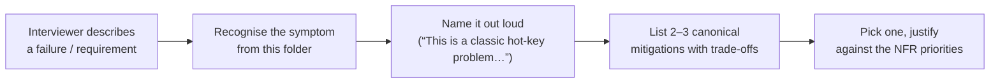

# Common Distributed Systems Problems — Interview Cheat-Sheet

> **Purpose.** These are the failure modes / design dilemmas that interviewers probe for in *every* senior system-design round. Most of them are not full problems — they are *symptoms*. Recognising the symptom and naming the canonical fix is what separates a senior engineer from a mid-level one.
>
> **Format.** Each file follows the same shape:
> 1. **The symptom** (what the user / graph sees)
> 2. **Root cause** (why it happens)
> 3. **ASCII or Mermaid diagram**
> 4. **Canonical mitigations** with trade-offs
> 5. **Interview talking points**

---

## How these map to the classic three-tier difficulty

```
┌────────────────────────────────────────────────────────────────────┐
│                       DIFFICULTY PROGRESSION                        │
├────────────────────────────────────────────────────────────────────┤
│                                                                    │
│  BEGINNER — "Single-node & simple distributed"                     │
│  ├── Thundering herd            → 01                               │
│  ├── Cache stampede             → 01                               │
│  ├── N+1 query                  → 02                               │
│  ├── Hot partition / hot key    → 03                               │
│  ├── Single point of failure    → 04                               │
│  ├── Retry storm                → 05                               │
│  ├── Backpressure               → (link: DS/12)                    │
│  ├── Idempotency gap            → 06                               │
│  └── Stale cache / RAW          → 07                               │
│                         │                                           │
│                         ▼                                           │
│  INTERMEDIATE — "Coordination & flow control"                      │
│  ├── Distributed rate limiting  → 09                               │
│  ├── Leader election            → (link: Consensus)                │
│  ├── Distributed locks / lease  → 08                               │
│  ├── Quorum R / Quorum W        → (link: DS/06-Quorum)             │
│  ├── Fan-out write vs read      → (link: Twitter / NewsFeed)       │
│  ├── Out-of-order events        → (link: Algorithms/09)            │
│  ├── DLQ / poison messages      → 10                               │
│  ├── Zero-downtime migration    → 11                               │
│  └── Circuit breaker & cascade  → 05                               │
│                         │                                           │
│                         ▼                                           │
│  ADVANCED — "Global-scale & organisational"                        │
│  ├── Split a monolith safely    → 12                               │
│  ├── Multi-region failover      → 13                               │
│  ├── Active-active conflicts    → 13 + 24 + (link: DS/09)          │
│  ├── CDC vs dual writes         → 14                               │
│  ├── Search freshness vs rank   → 15                               │
│  ├── Shard rebalancing          → 03                               │
│  ├── Noisy neighbor             → 16                               │
│  ├── Watermarks / late events   → 17                               │
│  ├── Backpressure / shedding    → 18                               │
│  ├── Saga / durable workflows   → 19                               │
│  ├── Cross-shard / dist. TX     → 20                               │
│  ├── Cell / shuffle sharding    → 21                               │
│  ├── Gray failures / healthchk  → 22                               │
│  ├── Event schema evolution     → 23                               │
│  ├── Geo-replication steady-st  → 24                               │
│  └── Exactly-once vs dedup      → 06 + (link: DS/11)               │
│                                                                    │
└────────────────────────────────────────────────────────────────────┘
```

---

## File Index

### Beginner

| # | Topic | File | Why it matters |
|---|-------|------|----------------|
| 01 | Thundering herd & cache stampede | [01-ThunderingHerdAndCacheStampede.md](01-ThunderingHerdAndCacheStampede.md) | Every read-heavy system eventually hits this on cache expiry or cold start |
| 02 | N+1 query problem | [02-NPlusOneQueries.md](02-NPlusOneQueries.md) | #1 performance bug in ORM-backed services |
| 03 | Hot keys & hot partitions (incl. shard rebalancing) | [03-HotKeysAndHotPartitions.md](03-HotKeysAndHotPartitions.md) | Celebrity problem, Zipfian traffic, load skew |
| 04 | Single point of failure | [04-SinglePointOfFailure.md](04-SinglePointOfFailure.md) | Availability math, redundancy patterns |
| 05 | Retry storms & circuit breakers (cascading failure control) | [05-RetryStormsAndCircuitBreakers.md](05-RetryStormsAndCircuitBreakers.md) | Why a slow downstream takes out your whole fleet |
| 06 | Idempotency & practical deduplication (vs exactly-once) | [06-IdempotencyAndDeduplication.md](06-IdempotencyAndDeduplication.md) | Payments, notifications, any POST retried |
| 07 | Cache consistency — stale cache & read-after-write | [07-CacheConsistency.md](07-CacheConsistency.md) | "I just saved it, why don't I see it?" |

### Intermediate

| # | Topic | File |
|---|-------|------|
| 08 | Distributed locks & lease expiry | [08-DistributedLocksAndLeases.md](08-DistributedLocksAndLeases.md) |
| 09 | Distributed rate limiting at scale | [09-DistributedRateLimiting.md](09-DistributedRateLimiting.md) |
| 10 | Dead-letter queues & poison messages | [10-DeadLetterQueuesAndPoisonMessages.md](10-DeadLetterQueuesAndPoisonMessages.md) |
| 11 | Zero-downtime schema migration | [11-ZeroDowntimeSchemaMigration.md](11-ZeroDowntimeSchemaMigration.md) |

### Advanced

| # | Topic | File |
|---|-------|------|
| 12 | Splitting a monolith safely | [12-SplittingTheMonolith.md](12-SplittingTheMonolith.md) |
| 13 | Multi-region failover & active-active | [13-MultiRegionFailover.md](13-MultiRegionFailover.md) |
| 14 | Change Data Capture vs dual writes | [14-ChangeDataCaptureVsDualWrites.md](14-ChangeDataCaptureVsDualWrites.md) |
| 15 | Search index freshness vs ranking quality | [15-SearchFreshnessVsRanking.md](15-SearchFreshnessVsRanking.md) |
| 16 | Noisy-neighbor problem in multi-tenant systems | [16-NoisyNeighborIsolation.md](16-NoisyNeighborIsolation.md) |
| 17 | Watermarks & late-arriving events in stream processing | [17-WatermarksAndLateEvents.md](17-WatermarksAndLateEvents.md) |
| 18 | Backpressure & load shedding | [18-BackpressureAndLoadShedding.md](18-BackpressureAndLoadShedding.md) |
| 19 | Sagas & long-running workflows | [19-SagaAndLongRunningWorkflows.md](19-SagaAndLongRunningWorkflows.md) |
| 20 | Cross-shard & distributed transactions | [20-CrossShardAndDistributedTransactions.md](20-CrossShardAndDistributedTransactions.md) |
| 21 | Cell-based architecture & shuffle sharding | [21-CellBasedAndShuffleSharding.md](21-CellBasedAndShuffleSharding.md) |
| 22 | Gray failures & health-check design | [22-GrayFailuresAndHealthChecks.md](22-GrayFailuresAndHealthChecks.md) |
| 23 | Schema evolution in event streams | [23-SchemaEvolutionInEventStreams.md](23-SchemaEvolutionInEventStreams.md) |
| 24 | Geo-replication & cross-region consistency (steady state) | [24-GeoReplicationAndCrossRegionConsistency.md](24-GeoReplicationAndCrossRegionConsistency.md) |

---

## Already covered elsewhere (cross-links)

These topics from your request are *already* extensively covered in other parts of this repo. I'm not duplicating them; read the linked file first.

| Topic | Where it's covered |
|-------|--------------------|
| Backpressure | [../03-AdvancedConcepts/DistributedSystems/12-BackPressureAndRetries.md](../03-AdvancedConcepts/DistributedSystems/12-BackPressureAndRetries.md) |
| Leader election (Paxos / Raft / Bully) | [../03-AdvancedConcepts/02-Consensus.md](../03-AdvancedConcepts/02-Consensus.md), [../07-SystemDesignAlgorithms/10-ConsensusAndLeadership.md](../07-SystemDesignAlgorithms/10-ConsensusAndLeadership.md) |
| Quorum reads vs quorum writes (R+W>N) | [../03-AdvancedConcepts/DistributedSystems/06-Quorum.md](../03-AdvancedConcepts/DistributedSystems/06-Quorum.md) |
| Fan-out on write vs fan-out on read | [../05-DesignMedium/08-Twitter.md](../05-DesignMedium/08-Twitter.md), [../05-DesignMedium/03-NewsFeed.md](../05-DesignMedium/03-NewsFeed.md) |
| Out-of-order event processing (general) | [../07-SystemDesignAlgorithms/09-StreamWindowsAndTime.md](../07-SystemDesignAlgorithms/09-StreamWindowsAndTime.md), [../03-AdvancedConcepts/05-StreamProcessing.md](../03-AdvancedConcepts/05-StreamProcessing.md) (note: watermarks + late-arriving events have their own deep-dive at [17](17-WatermarksAndLateEvents.md)) |
| Exactly-once processing semantics | [../03-AdvancedConcepts/DistributedSystems/11-DeliverySemantics.md](../03-AdvancedConcepts/DistributedSystems/11-DeliverySemantics.md) |
| Active-active conflict resolution (LWW / CRDTs / vector clocks) | [../03-AdvancedConcepts/DistributedSystems/09-ConflictResolution.md](../03-AdvancedConcepts/DistributedSystems/09-ConflictResolution.md) (see also 13 in this folder for failover context) |

---

## How to use this folder in an interview



**The meta-skill** this folder teaches: *pattern matching*. If you can say "this is a thundering-herd problem, mitigations are jittered expiry, single-flight lock, probabilistic early expiry — I'd pick single-flight because we have strict freshness SLA," you've earned the senior signal in 30 seconds.

---

## Related Reading

- [../02-BuildingBlocks/](../02-BuildingBlocks/) — the components these failure modes attack.
- [../03-AdvancedConcepts/DistributedSystems/](../03-AdvancedConcepts/DistributedSystems/) — the theory (CAP, quorum, consensus, clocks).
- [../07-SystemDesignAlgorithms/](../07-SystemDesignAlgorithms/) — the algorithmic building blocks (rate-limit algos, hashing, LSM, etc.).
- [../InterviewProblems/README.md](../InterviewProblems/README.md) — how these map onto concrete interview questions.
