# Milvus — The Complete Deep Dive (Vector Database at Scale)

> **Difficulty:** Hard | **Time:** 6-8 hours | **Priority:** Must Know for AI/RAG/Search Systems
> **Sources:** Milvus Official Documentation (milvus.io/docs), Zilliz Engineering Blog, Milvus 2.x Architecture Paper (SIGMOD 2021), Salesforce UDS Milvus Onboarding (April 2026), Production RCAs (DataCoord startup lag, MSK packet drop, proxy worker choke, compaction storm), Pinecone/Weaviate comparisons
> **For:** Senior Engineers (7+ years) preparing for System Design interviews that touch vector search, RAG, semantic search, recommendation systems

---

## Table of Contents

1. [What Is Milvus](#1-what-is-milvus)
2. [Why Vector Databases Exist — The Problem](#2-why-vector-databases-exist--the-problem)
3. [High-Level Architecture — Four Layers](#3-high-level-architecture--four-layers)
4. [Component Roles — Coordinators and Workers](#4-component-roles--coordinators-and-workers)
5. [Storage Model — Collections, Partitions, Segments, Shards](#5-storage-model--collections-partitions-segments-shards)
6. [Data Flow — Insert Path (DDL + DML)](#6-data-flow--insert-path-ddl--dml)
7. [Data Flow — Search Path (Scatter-Gather)](#7-data-flow--search-path-scatter-gather)
8. [Live vs Sealed Segments — The Freshness Trick](#8-live-vs-sealed-segments--the-freshness-trick)
9. [Indexes — HNSW, IVF, DiskANN, and When to Use Each](#9-indexes--hnsw-ivf-diskann-and-when-to-use-each)
10. [Similarity Metrics — COSINE, L2, IP](#10-similarity-metrics--cosine-l2-ip)
11. [External Dependencies — etcd, Kafka/MSK, S3, Karpenter](#11-external-dependencies--etcd-kafkamsk-s3-karpenter)
12. [Deployment & Multi-Tenancy at Scale](#12-deployment--multi-tenancy-at-scale)
13. [Compaction & Garbage Collection](#13-compaction--garbage-collection)
14. [Production Incidents — Real War Stories](#14-production-incidents--real-war-stories)
15. [Debugging Toolkit & Cheat Sheet](#15-debugging-toolkit--cheat-sheet)
16. [Capacity Planning & Sizing](#16-capacity-planning--sizing)
17. [When NOT to Use Milvus](#17-when-not-to-use-milvus)
18. [Milvus vs Pinecone vs Weaviate vs pgvector](#18-milvus-vs-pinecone-vs-weaviate-vs-pgvector)
19. [Interview Questions — Medium](#19-interview-questions--medium)
20. [Interview Questions — Hard](#20-interview-questions--hard)
21. [Quick Reference Card](#21-quick-reference-card)

---

## 1. What Is Milvus

Milvus is an **open-source, cloud-native vector database** built in Go (some C++ kernels for SIMD) designed to store and search billions of high-dimensional vectors with sub-100ms latency.

It was created by **Zilliz** (originally based on Baidu's internal vector search, open-sourced in 2019) and became a **graduate LF AI & Data Foundation** project. Milvus 2.x (2021+) is a complete rewrite with a **disaggregated storage–compute architecture** that is what every production system uses today.

```
Not this (Milvus 1.x — coupled, scales poorly):             This (Milvus 2.x — disaggregated):

  ┌────────────────┐                                         ┌──────────┐  ┌──────────┐  ┌──────────┐
  │  Monolith      │                                         │  Proxy   │  │  Coords  │  │ Workers  │
  │  - proxy       │                                         └────┬─────┘  └────┬─────┘  └────┬─────┘
  │  - search      │                                              │             │             │
  │  - insert      │                                              └───── etcd ──┘             │
  │  - index       │                                                    │                    │
  │  - storage     │                                              Kafka (WAL) ◄───────────────┘
  └────────────────┘                                                    │
  Scale up = buy a bigger box                                          S3 (binlogs + indexes)
  Noisy neighbor = everyone dies                                 Scale each layer independently
```

**The short definition that clicks in interviews:**
> Milvus is a **distributed vector search engine** that uses **Kafka as a Write-Ahead Log**, **S3 as durable storage**, **etcd for metadata**, and **stateless compute workers** for ingest/index/search. It separates storage from compute so you can scale reads without touching writes.

### Milvus in One Sentence, Three Flavors

| Audience | Definition |
|----------|------------|
| PM | A database that finds the "most similar" items (images, text, audio) by meaning, not by keyword. |
| Engineer | A distributed ANN search system over billions of vectors, with collections/partitions/segments as the storage unit and HNSW/IVF/DiskANN as index types. |
| SRE | A Kubernetes-native service with 7 coordinator/worker components, external deps on etcd + Kafka + S3, and HPA-driven scaling — whose #1 outage cause is etcd or Kafka. |

### Open-Source Milvus vs Production Milvus

Open-source Milvus is the engine. A production deployment at scale adds a significant **ecosystem** around it. Reference: the Salesforce UDS (Unstructured Data Service) onboarding deck walks through this exact split:

```
┌─────────────────────────── PRODUCTION MILVUS STACK ────────────────────────────┐
│                                                                                 │
│   The open-source engine                                                        │
│   ├─ Milvus DB (customized Go fork — per-org patches are common)                │
│                                                                                 │
│   Infrastructure around it (what operators actually build)                      │
│   ├─ Helm charts for K8s deployment (coords, workers, etcd, network, jobs)     │
│   ├─ Terraform for AWS infra (IAM, S3, MSK, DynamoDB)                           │
│   ├─ Access Manager sidecar — BYOK / S3 credential management                   │
│   ├─ Migration tools — reindex across Milvus versions                           │
│   ├─ Monitoring (Grafana / Prometheus / Splunk / Argus)                         │
│   ├─ Attu (web UI for collections & queries)                                    │
│   └─ Health-check CronJobs (runs every 15 min)                                  │
│                                                                                 │
│   What is NOT part of the Milvus ecosystem but calls it                         │
│   ├─ Inference Engine   → creates collections / partitions (DDL)               │
│   ├─ Spark ingest jobs  → insert/delete/upsert vectors (DML)                    │
│   └─ Query Service      → routes user searches to Milvus                       │
│                                                                                 │
│   Think of it as: OSS Milvus = engine · Platform = car · Callers = drivers     │
└─────────────────────────────────────────────────────────────────────────────────┘
```

---

## 2. Why Vector Databases Exist — The Problem

### The keyword-search ceiling

Traditional databases (Postgres, MySQL) and inverted-index search engines (Elasticsearch) answer **exact or lexical** queries: "find docs containing `machine learning`". They fail the moment the user says **"ML"** or **"neural networks"** — same meaning, different words.

Deep-learning embeddings solved this by mapping anything (text, image, audio, molecule) into a dense vector in ℝ^d where **geometric closeness = semantic closeness**. The new query shape is:

> "Given this query vector q, find the k nearest vectors in a set of N vectors"

At N = 1M this is easy (brute-force 1M × d multiply-adds). At **N = 10B with d = 1536 and p99 < 50ms**, brute force is hopeless — a single search would touch 60 TB of data.

### The three hard things a vector DB must do

```
┌───────────────────────────────────────────────────────────────────────┐
│  1. APPROXIMATE NEAREST NEIGHBOR (ANN)                                │
│     Accept ~1-3% recall loss to get 1000x speedup.                    │
│     Index structures: HNSW graphs, IVF clusters, DiskANN, ScaNN.      │
│                                                                       │
│  2. HYBRID FILTER + VECTOR                                            │
│     "nearest vectors WHERE tenant_id = 'X' AND created_at > '2025'"   │
│     Naive filter-then-search or search-then-filter both break recall. │
│     Milvus uses bitmap-guided graph walks.                            │
│                                                                       │
│  3. FRESH WRITES + LOW-LATENCY READS                                  │
│     Data must be searchable seconds after ingest, but index builds    │
│     take minutes. Solution: search live+sealed segments separately.   │
└───────────────────────────────────────────────────────────────────────┘
```

Milvus's entire architecture is organized around these three constraints.

---

## 3. High-Level Architecture — Four Layers

Milvus 2.x is organized into **four layers** with a strict contract: each layer can be scaled, restarted, and upgraded independently.

```
                          ┌──────────────────────────────────────────────┐
                          │  SDK / REST API  (pymilvus, go-sdk, HTTP)    │
                          └───────────────────┬──────────────────────────┘
                                              │ gRPC (mTLS in prod)
                                              ▼
  ┌──────────────────────────────────────────────────────────────────────────────┐
  │  ACCESS LAYER                                                                 │
  │  ┌───────────────┐  ┌───────────────┐   (stateless; scale horizontally)       │
  │  │    Proxy      │  │    Proxy      │   Translates SDK calls → internal RPC  │
  │  └───────┬───────┘  └───────┬───────┘   Forwards DDL→RootCoord, DML→Kafka    │
  └──────────┼──────────────────┼──────────────────────────────────────────────────┘
             │ DDL / DCL        │ DML (produce)
             ▼                  ▼
  ┌────────────────────┐  ┌──────────────────────────┐  ┌────────────────────────┐
  │  COORDINATOR       │  │  MESSAGE STORAGE / WAL   │  │  CONTROLS (bidirectional)
  │  ┌──────────────┐  │  │  ┌─────────────────────┐ │  │  Coords manage workers  │
  │  │ Meta store   │  │  │  │     Kafka / Pulsar   │ │  │  via this channel       │
  │  │ (etcd)       │  │  │  └─────────────────────┘ │  └────────────────────────┘
  │  │              │  │  └──────────┬───────────────┘
  │  │ RootCoord    │  │             │ consume
  │  │ DataCoord    │  │             ▼
  │  │ QueryCoord   │  │  ┌──────────────────────────────────────────────────────┐
  │  │ IndexCoord   │  │  │  WORKER NODES (stateless compute; HPA-driven)        │
  │  └──────────────┘  │  │  ┌───────────┐  ┌───────────┐  ┌──────────────┐      │
  └────────────────────┘  │  │ QueryNode │  │ DataNode  │  │  IndexNode   │      │
                          │  │ (search)  │  │ (ingest)  │  │ (build HNSW) │      │
                          │  └─────┬─────┘  └─────┬─────┘  └──────┬───────┘      │
                          └────────┼──────────────┼───────────────┼──────────────┘
                                   │ load         │ write          │ read/write
                                   ▼              ▼                ▼
                          ┌──────────────────────────────────────────────────────┐
                          │  OBJECT STORAGE  (S3 / MinIO / GCS / Azure Blob)      │
                          │  ├─ Data Files: binlog, deltalog, statslog            │
                          │  └─ Index Files: HNSW graphs, IVF centroids           │
                          └──────────────────────────────────────────────────────┘
```

### Why four layers and not one service

| Concern | Solution in Milvus |
|---------|---------------------|
| A slow query should not slow down ingest | Search runs on **QueryNodes**, ingest runs on **DataNodes** — different pods, different HPAs. |
| Index builds are CPU-bursty and infrequent | **IndexNodes** spin up just to build, then idle (or scale to zero). |
| Metadata must be strongly consistent; data must be fast | Metadata on **etcd** (Raft), data on **S3** (11-9s durability, high throughput). |
| We need replay, exactly-once semantics | **Kafka** acts as WAL — DataNodes consume from offsets, can recover. |
| We want elastic reads | Add QueryNodes → QueryCoord rebalances segments → instant capacity. |

This is the same pattern as **Snowflake** (storage-compute separation), **Pulsar** (brokers + BookKeeper), and **ClickHouse** Cloud — Milvus borrows heavily from them.

### Visual — architecture as a graph

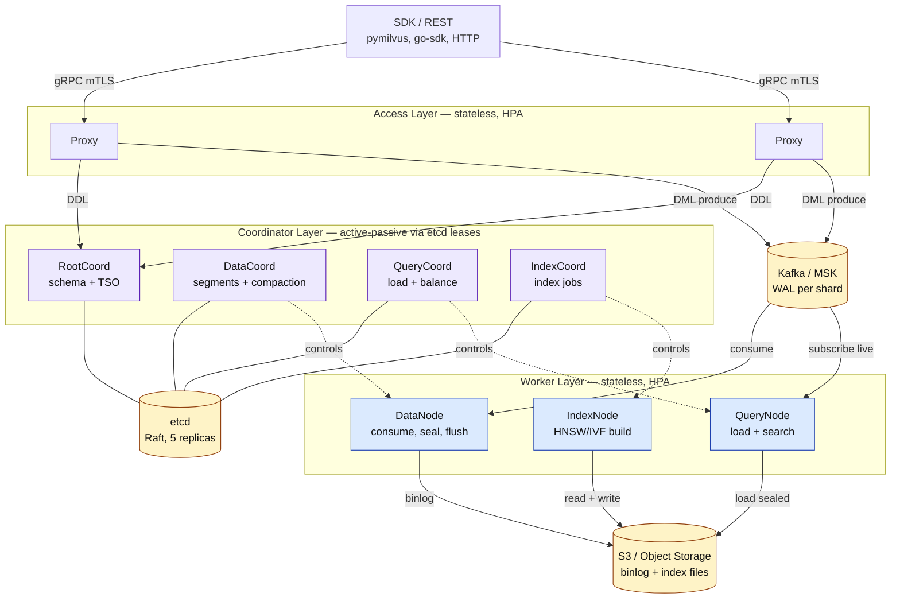

---

## 4. Component Roles — Coordinators and Workers

Production Milvus runs **9 component types**. In a live deployment you will see them as separate K8s Deployments:

```
$ kubectl get deployments -n milvus | grep milvusdefaultv2
access-manager-milvusdefaultv2               2/2
data-coord-milvusdefaultv2                   2/2
data-worker-milvusdefaultv2                  2/2
index-coord-milvusdefaultv2                  2/2
index-worker-milvusdefaultv2                 2/2
proxy-worker-milvusdefaultv2                 2/2
query-coord-milvusdefaultv2                  2/2
query-worker-milvusdefaultv2                 2/2   ← HPA, scales up to 15
root-coord-milvusdefaultv2                   2/2
```

| Component | Type | Role | Stateful? | Typical Replicas |
|-----------|------|------|-----------|------------------|
| **Proxy** | Access | gRPC gateway (port 19530 in OSS, 443 via Istio in prod). Validates requests, routes DDL to RootCoord, produces DML to Kafka. Terminates mTLS. | No | 2-4 (HPA) |
| **RootCoord** | Coord | Owns schema. Handles create/drop collection, create/drop partition, timestamp allocation (TSO — Timestamp Oracle, like Percolator). Writes to etcd. | No (etcd is truth) | 2 (active-passive) |
| **DataCoord** | Coord | Assigns Kafka channels to DataNodes, decides when a growing segment is "sealed", triggers compaction, tracks segment metadata. | No | 2 |
| **QueryCoord** | Coord | Balances which QueryNodes load which segments, routes searches, handles load/release collection. | No | 2 |
| **IndexCoord** | Coord | Schedules index-build jobs on sealed segments, tracks progress. | No | 2 |
| **DataNode** | Worker | Consumes DMLs from Kafka, builds growing segments in memory, flushes to S3 as binlogs when sealed. | No | 2-N |
| **QueryNode** | Worker | Loads sealed segments from S3 into memory (and subscribes to Kafka for live segments). Executes searches. **Memory-heavy.** | No | 2-15 (HPA) |
| **IndexNode** | Worker | Reads sealed segment from S3, builds HNSW/IVF index, writes index files back to S3. **CPU-heavy, bursty.** | No | 2-N |
| **Access Manager** (Salesforce fork) | Sidecar | BYOK: fetches per-tenant S3 credentials from CVS/KMS; no-op when BYOK is off. | No | 1 per pod |

### Coordinator active-passive pattern

Each coordinator runs **2 replicas** but only one is **active leader** at a time. Leader election uses **etcd leases** (same pattern as Kubernetes itself). When the leader dies:

1. Lease expires in etcd (default 60s, tunable).
2. Standby acquires the lease → becomes active.
3. It reads state from etcd (no in-memory state survives) and resumes.

This is why **etcd availability is existential to Milvus**: if etcd is down, no coordinator can elect, no DDL works, no metadata is writable. We will return to this in incident #4.

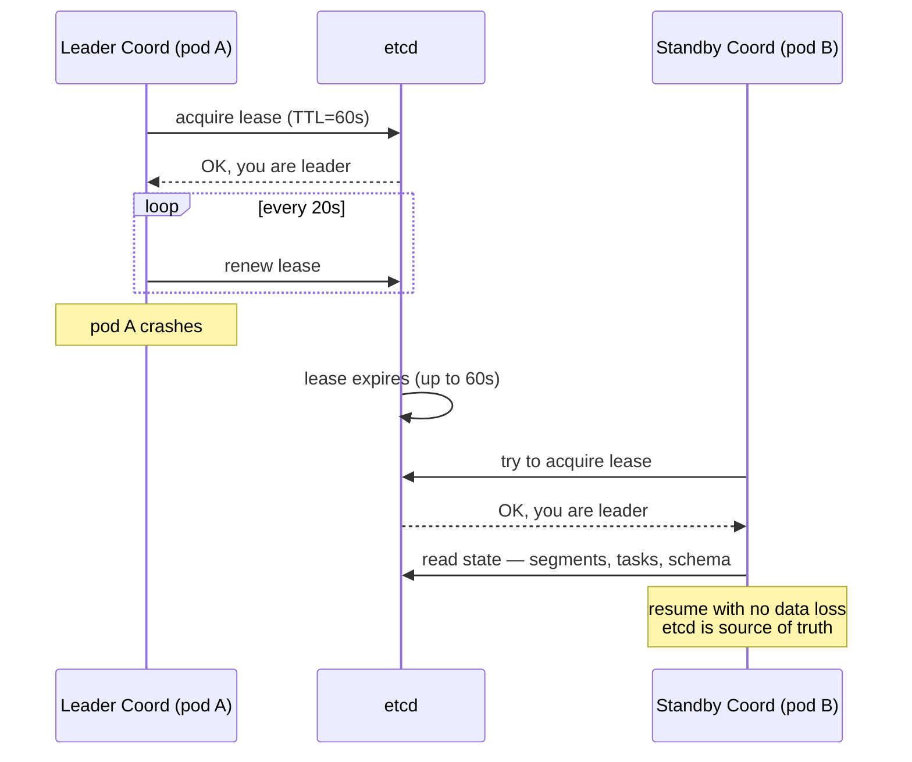

---

## 5. Storage Model — Collections, Partitions, Segments, Shards

```
Milvus cluster
└── Collection (like a SQL table — has schema, vector dim, metric)
    ├── Partition (logical group inside collection — e.g., per-month, per-region)
    │   └── Segment (physical unit of data — default ≤ 2 GB)
    │       ├── Binlog (insert_log/   — column-oriented Parquet-like files in S3)
    │       ├── Deltalog (delta_log/  — soft deletes)
    │       ├── Statslog (stats_log/  — min/max/bloom filter per field)
    │       └── Index file (index_files/ — HNSW graph or IVF centroids)
    │
    └── Shard (vchannel) — hash-based routing for parallel ingest
        └── Each shard maps to exactly one Kafka partition
```

### Why segments exist (the single most important concept)

A **segment** is the unit Milvus moves around. Every operation ultimately reduces to "operate on this segment":
- **Search** = load the relevant segments → run ANN on each → merge top-k.
- **Index build** = read one segment → compute HNSW → write index back.
- **Compaction** = merge N small segments → 1 larger segment.
- **GC** = delete S3 files for dropped segments.

**Segment lifecycle:**

```
┌──────────────┐      size ≥ 2 GB      ┌──────────────┐    index built    ┌──────────────┐
│   GROWING    │─────────────────────►│    SEALED    │──────────────────►│   INDEXED    │
│              │    (auto-seal)        │              │                   │              │
│ In-memory on │                        │ Flushed to   │                   │ HNSW graph   │
│ DataNode &   │                        │ S3 as        │                   │ file in S3;  │
│ QueryNode    │                        │ binlogs;     │                   │ loaded by    │
│ Kafka-backed │                        │ immutable    │                   │ QueryNodes   │
└──────────────┘                        └──────────────┘                   └──────────────┘
  brute-force scan                      brute-force scan                     fast ANN
  (small, RAM)                          (from disk if not loaded)            (memory)
```

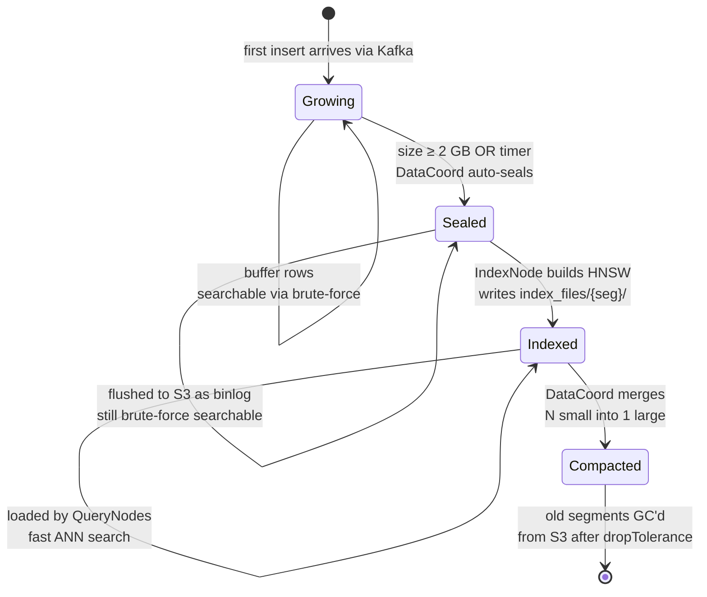

A key nuance from production experience:
> If a segment **never hits 2 GB** (e.g., small tenant collection), it **stays growing forever** and is searched by **brute force**. This is fine at small N but catastrophic at large N — hence the `max_growing_segment_size` and `segment.maxSize` tunables.

### S3 bucket layout (what you'll actually find)

```
{falcon_instance}-{domain}-dpc-milvus/      e.g., dev1-uswest2-cdp001-dpc-milvus
│
├── etcd-snapshots/
│   └── milvusdefaultv2/
│       └── snapshot.tgz          every 15 min; 300+ versions retained
│
└── milvus-storage/
    ├── milvusdefaultv2/          ← one instance
    │   ├── index_files/          HNSW indexes (largest directory at scale)
    │   ├── insert_log/           column binlogs
    │   ├── stats_log/            min/max/bloom per field
    │   └── delta_log/            soft deletes
    │
    └── milvus1/                  ← another instance on same cluster
        ├── index_files/
        ├── insert_log/
        └── stats_log/
```

All insert_log directory names are **segment IDs** (large 64-bit numbers). When you see a segment ID in logs, this is where its data lives.

### Shards (vchannels) — parallel ingest

Each collection has `shards_num` shards (default 2). A shard maps 1:1 to a **Kafka partition**. Writes are hash-routed by the **primary key** to a shard → a specific Kafka partition → a specific DataNode.

```
Insert(pk=A) ─► hash(A) % 2 = 0 ─► Kafka partition 0 ─► DataNode #1
Insert(pk=B) ─► hash(B) % 2 = 1 ─► Kafka partition 1 ─► DataNode #2
```

**Pitfall at scale:** shards_num is fixed at collection creation. Set it **too low** → ingest bottleneck on one DataNode. **Too high** → each segment stays small, too many small segments, compaction storm. Rule of thumb: `shards_num ≈ expected peak insert QPS / 10K`.

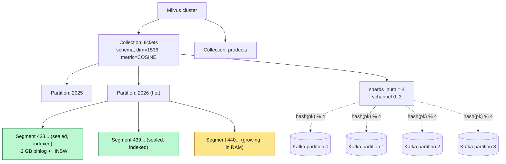

---

## 6. Data Flow — Insert Path (DDL + DML)

Two callers, two flows. This separation (DDL via coordinator, DML via WAL) is what lets Milvus ingest millions of vectors/second while DDL remains strongly consistent.

### Step 1 — DDL (metadata ops)

```
  Inference Engine (or your control plane)
       │
       │  createCollection(name, dim, metric, index_params)
       │  createPartition(collection, name)
       ▼
  Milvus Proxy ── gRPC ──►  Root Coordinator
                             │
                             │ assigns timestamp (TSO)
                             │ writes schema to etcd (atomic)
                             │ returns success
                             ▼
                           [etcd]  /meta/collections/{id} = {schema, shards, ...}
```

Key points:
- DDLs are **metadata-only** operations. No data is written yet.
- They are **linearized** through RootCoord (single active leader).
- Timestamps come from the **TSO**: a monotonic clock used to order DDL vs DML for snapshot isolation.
- Failure mode: etcd is down → all DDL hangs until etcd recovers or coordinator fails over.

### Step 2 — DML (the vector insert path)

```
  Spark / Flink / App (batch or streaming)
       │
       │  insert(collection, [{pk=123, vector=[0.1, ...], meta={...}}, ...])
       ▼
  Milvus Proxy (gRPC, mTLS)
       │
       │  1. Validate schema, dim, pk type
       │  2. Allocate timestamps (batch from TSO)
       │  3. Hash-route each row by pk → shard id
       │  4. PRODUCE to Kafka (the WAL)   ◄────── write returns here (ACK'd)
       │
       ▼
  Kafka / MSK  (topic per shard)
       │
       │  consumer group per DataNode replica
       ▼
  DataNode
       │  5. Buffer rows in growing segment (in-memory + memory-mapped file)
       │  6. When segment ≥ 2 GB OR time threshold:
       │       - flush to S3 as binlogs
       │       - mark segment as SEALED (via DataCoord)
       ▼
  S3  (insert_log/{segment_id}/, stats_log/{segment_id}/)
       │
       │  DataCoord notifies IndexCoord
       ▼
  Index Coord ──► Index Node
       │  7. Read sealed segment from S3
       │  8. Build HNSW index
       │  9. Write index_files/{segment_id}/ back to S3
       ▼
  QueryCoord notified → QueryNodes load new index (or lazy-load on first query)
```

**Why Kafka in the middle?** Three reasons:
1. **Decoupling** — Proxy returns success after Kafka ACK, not after S3 flush. Client p99 = Kafka write latency (~5 ms), not disk (~100 ms+).
2. **Replay / recovery** — If a DataNode crashes after consuming but before flushing, it restarts from its last committed offset. No data loss, no dedup logic in the app.
3. **Backpressure isolation** — Kafka buffers spikes. Without it, a burst ingest would melt DataNode memory.

The price you pay: **Kafka is a hard dependency.** MSK outage = ingest outage.

### Visual — insert path as a sequence

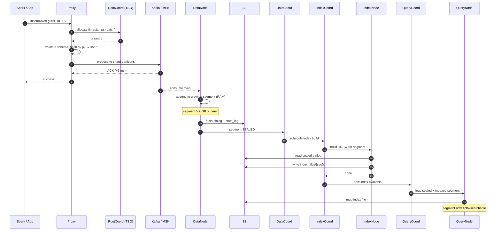

---

## 7. Data Flow — Search Path (Scatter-Gather)

```
  Application ─► Query Service (converts text→embedding, adds filters)
                      │
                      │  search(collection, vector, topk=10, filter="tenant='X'")
                      ▼
                 Milvus Proxy  (gRPC over mTLS)
                      │
                      ▼
                 Query Coordinator
                      │  1. Look up segments for this collection (from etcd)
                      │  2. Check which QueryNodes have which segments loaded
                      │  3. Fan out to QueryNodes
                      │
         ┌────────────┼────────────────┐
         ▼            ▼                ▼
     QueryNode 1   QueryNode 2     QueryNode 3
     ├─ sealed: S1 ├─ sealed: S3   ├─ sealed: S5
     ├─ sealed: S2 └─ live: L1     └─ live: L2
     └─ live: L3
         │            │                │
         │  Each node:                  │
         │    - search each sealed seg (HNSW ANN)
         │    - brute-force live seg (Kafka-subscribed, no index yet)
         │    - apply scalar filter (via bloom + bitmap)
         │    - return local top-k
         ▼            ▼                ▼
         └────►  Query Coordinator merges all top-k by COSINE/L2  ◄──┘
                      │
                      ▼
                 Final top-10 → Proxy → App
```

### Scatter-gather math

For recall `R` with `N` nodes each returning top-K:
- Final top-K merges `N × K` results → requires `N × K` scores transferred.
- **Tail latency = max(node_i latency)**, not average — so one slow node = slow query.

**This is why one `CrashLoopBackOff` QueryNode can cripple p99 latency** even while p50 looks fine. Every search fans out to it.

### Filter pushdown — the subtle part

A query like `WHERE tenant='X' AND age > 30` gets pushed down into the ANN:
1. QueryNode loads bloom filter for segment → can it possibly match? If no → skip.
2. If yes, it builds a **bitmap** of rows that match the scalar filter.
3. HNSW graph walk **ignores** nodes whose bitmap bit is 0.

The naive alternative (search first, then filter) **breaks recall**: if top-1000 vectors are all wrong-tenant, filter leaves 0 results. Filter-first breaks too if the filter is narrow (no ANN graph to walk). Milvus's hybrid walker is the reason `expr` queries are fast.

### Visual — scatter-gather search

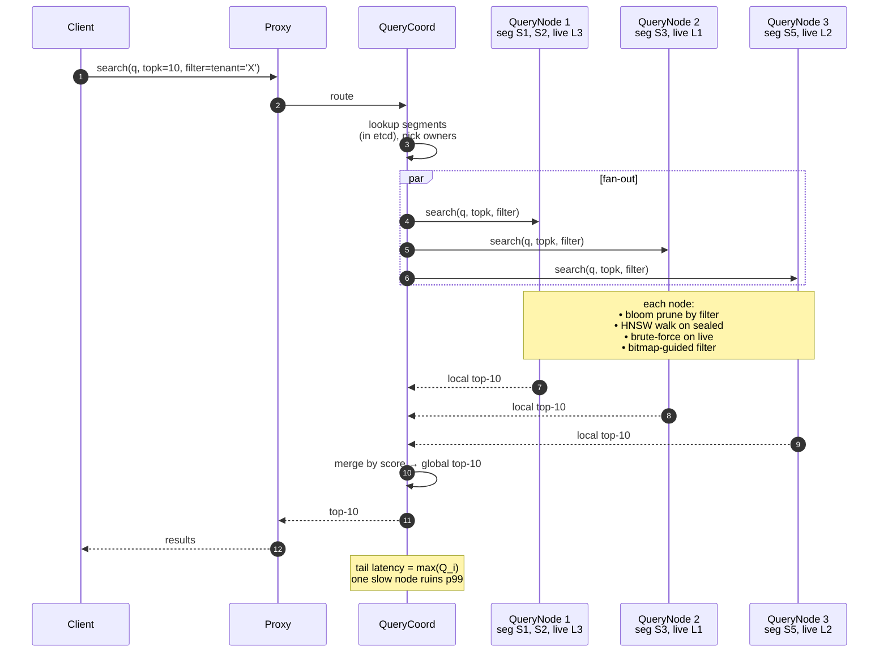

---

## 8. Live vs Sealed Segments — The Freshness Trick

The single most useful interview soundbite for Milvus:

> "Milvus achieves **read-your-writes** on vectors by searching **two physically different data paths** and merging. Live segments give freshness; sealed segments give throughput."

|                 | **Live (Growing) Segment**                           | **Sealed Segment**                               |
|-----------------|------------------------------------------------------|--------------------------------------------------|
| State           | Still ingesting (< 2 GB)                             | Immutable, size reached                          |
| Location        | RAM on DataNode + RAM on QueryNode (via Kafka)       | S3 binlogs + HNSW index file loaded to QueryNode |
| Index           | None                                                 | HNSW (or IVF/DiskANN)                            |
| Search method   | **Brute-force** scan                                 | Graph walk                                       |
| Freshness       | **Seconds** after insert                             | Minutes (waiting for seal + index)               |
| Who maintains   | QueryNode subscribes to same Kafka channel           | IndexNode builds, QueryNode loads from S3        |
| Failure if lost | Re-read from Kafka from offset                       | Re-load from S3                                  |

This is why Milvus can claim "real-time searchable" — the moment Kafka ACKs the insert, the row is reachable via live-segment brute-force scan on QueryNode. You don't wait for the 15-minute indexing cycle.

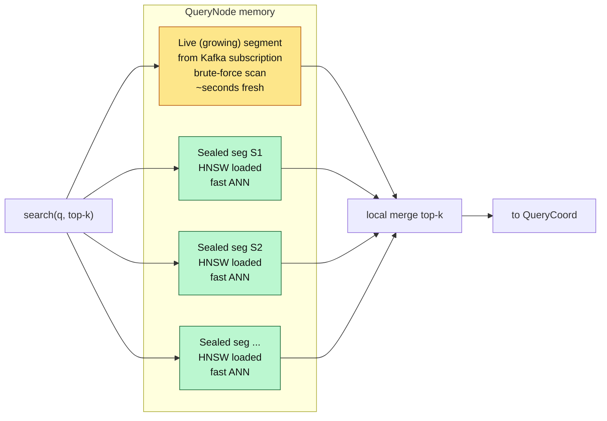

---

## 9. Indexes — HNSW, IVF, DiskANN, and When to Use Each

| Index | Memory | Build time | Recall | QPS | When to use |
|-------|--------|------------|--------|-----|-------------|
| **FLAT** (brute force) | 1x | 0 | 100% | Very low | Ground-truth baseline, small collections < 1M |
| **IVF_FLAT** | 1x | Fast | 85-95% | Medium | Cheap, filter-heavy, acceptable accuracy |
| **IVF_PQ** | 0.1x (compressed) | Fast | 70-85% | High | Massive N (billions), can trade recall for memory |
| **HNSW** | ~1.5x | Slow | 95-99% | **Very high** | **Default for most prod systems** — low dim (≤1536), in-memory |
| **DiskANN** | 0.05x (on disk) | Slow | 95-98% | Medium | Large N that doesn't fit RAM, SSD-backed |
| **GPU_CAGRA** | GPU VRAM | Very fast (GPU) | 95-99% | Extremely high | GPU-available, very low latency, bulk queries |

### Why HNSW is the production default

Hierarchical Navigable Small World is a graph where each node has "neighbors at multiple scales":

```
Top layer (sparse, long edges): ● ────────────── ● ────────── ●      ← start here, coarse jump
                                 │               │             │
Middle layer:                    ● ─── ● ─── ● ─── ● ─── ● ─── ●     ← refine
                                 │     │     │     │     │     │
Bottom layer (dense, short edges): ● ● ● ● ● ● ● ● ● ● ● ● ● ● ●    ← all vectors live here
```

Search: drop in at top, greedy-walk toward query, descend on misses. Log-N jumps to get close, linear refinement at the bottom.

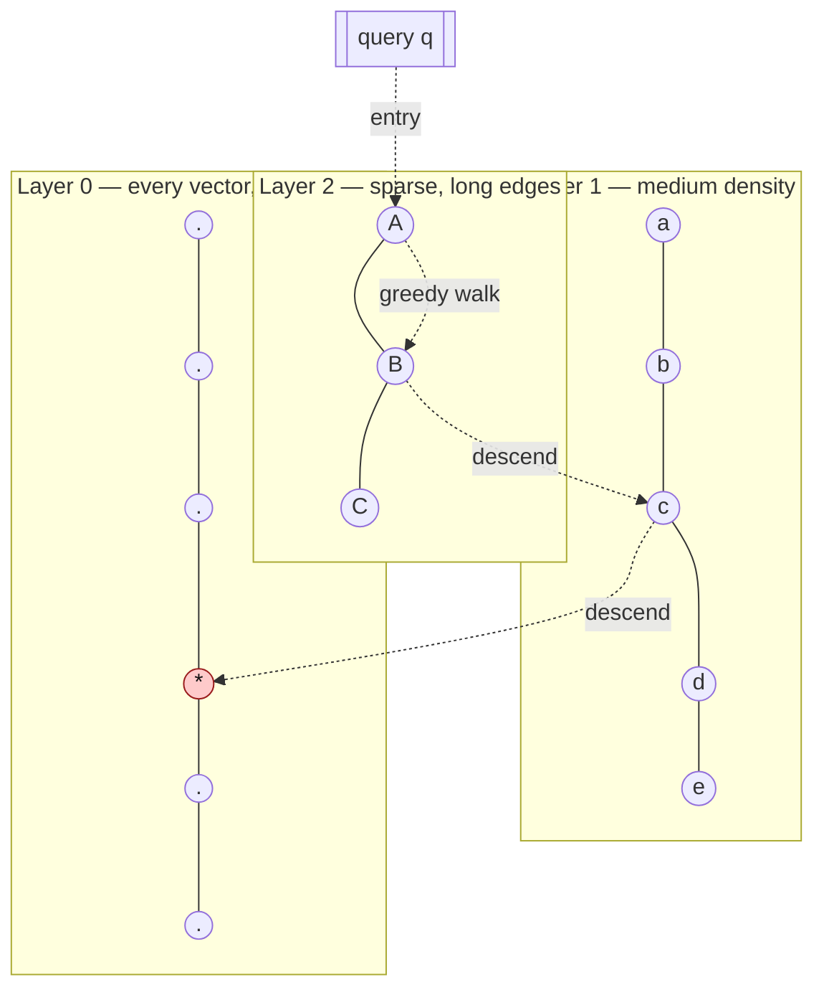

Key parameters:
- `M` (default 16): max neighbors per node. ↑M = better recall, more memory.
- `efConstruction` (default 200): candidates to consider at build. ↑ = better graph, slower build.
- `ef` (search-time, default 64): candidates at query time. ↑ = better recall, higher latency.

**Rule of thumb:** M=16, efConstruction=256, ef=64 for most production workloads with d ≤ 1536. Bump ef to 128-256 for recall-critical paths (fraud, dedup).

---

## 10. Similarity Metrics — COSINE, L2, IP

| Metric | Formula | Range | Notes |
|--------|---------|-------|-------|
| **COSINE** | `cos(a,b) = a·b / (‖a‖ ‖b‖)` | [-1, 1] | **Most common for text/semantic embeddings** — OpenAI, BERT, sentence-transformers are trained for this. Invariant to magnitude. |
| **L2 (Euclidean)** | `‖a-b‖₂` | [0, ∞) | Good when magnitude matters (images, coordinates). |
| **IP (Inner Product)** | `a·b` | (-∞, ∞) | Equivalent to cosine if vectors are unit-normalized. Faster than cosine (no norm). |

**Production gotcha:** the metric at **index build** must match the metric at **search**. Mixing COSINE build with L2 search silently returns wrong results. Always pin via `index_params = {"metric_type": "COSINE"}`.

---

## 11. External Dependencies — etcd, Kafka/MSK, S3, Karpenter

| Dep | What | Why | Blast radius if down |
|-----|------|-----|----------------------|
| **etcd** | StatefulSet, 5 replicas (Raft), snapshots to S3 every 15 min | Metadata + coordinator leader election | **Everything stops.** No DDL, no new segment flush, no load/release. Existing searches can continue until a component restarts. |
| **Kafka (MSK)** | WAL for DMLs; SASL_SSL + SCRAM auth | Buffer + replay + decoupling | **Ingest stops.** Search continues on already-sealed data. |
| **S3** | Durable storage for binlogs + indexes | Source of truth for data | **Gradual degradation.** Already-loaded QueryNodes keep serving. New loads fail. Index builds fail. |
| **Karpenter** | K8s node autoscaler; dynamically picks EC2 types | HPA + bursty index builds need fast node provisioning | New pods stuck `Pending`; existing pods unaffected. |
| **DynamoDB** (Salesforce add-on) | `milvus-dbsources` table — tracks which Milvus cluster owns which tenant | Multi-tenant routing | New tenant provisioning blocked; existing traffic unaffected. |

### EC2 NodePool selection (Salesforce Karpenter setup)

```
  NodePool              EC2 family       Workload                   Example types
  ─────────────────────────────────────────────────────────────────────────────────
  Default               C-family (CPU)    General Milvus pods        c7g, c6g, c7a, c6a
  Local-Storage         R-family + NVMe   QueryNodes (fast disk)     r7a, r6a, r5a, r7i
  Coordinator           M-family          Coords (balanced)          m7a, m6a, m5a, m7i
  Fallback-Query        Mixed             Backup when primary full   Various
```

**Insight:** QueryNodes get **R-family with local NVMe** specifically because mmap'd segment files benefit from fast local storage. Coordinators get M-family (balanced, they don't do heavy CPU work, just orchestrate).

---

## 12. Deployment & Multi-Tenancy at Scale

### How large orgs carve Milvus

```
Regional EKS cluster
├── namespace: milvus
│   ├── instance: milvusdefaultv2       ← one logical Milvus (full coord+worker set)
│   ├── instance: milvus1                ← independent, noisy-neighbor isolation
│   ├── instance: milvus2
│   ├── instance: milvusnew1
│   └── instance: milvusrefactor7ie      ← test/refactor branch
│
└── etcd StatefulSets (one per instance, 5 replicas each)
```

Each "instance" = full Milvus stack (all coordinators + workers + its own etcd). Up to 5 instances per cluster is typical for noisy-neighbor isolation. 

### Tenant isolation strategies

| Strategy | How | Pros | Cons |
|----------|-----|------|------|
| **Collection-per-tenant** | `a360_{env}_{tenantId}_{collectionId}` | Strong isolation; per-tenant backup/restore | 10K+ collections → schema bloat → meta-reload slow |
| **Partition-per-tenant** | One collection, partition key = tenant_id | Cheaper metadata; fewer segments | Noisy neighbor on index builds |
| **Partition-key feature** (Milvus ≥ 2.3) | Hash tenants into N partitions | Balanced segment size | Less targetable by collection-level ops |

**Salesforce's choice:** collection-per-tenant. It worked well up to ~10K collections. At 100K collections the **DataCoord startup lag** incident (below) surfaced a scaling limit.

### Connectivity in production

All traffic is encrypted via **mTLS + Istio service mesh**:
- Protocol: gRPC over mTLS, port 443 via Istio internal gateway.
- Identity: SPIFFE certificates refreshed every 7 days (at t-2 days).
- Paths: `/etc/identity/ca/cacerts.pem`, `/etc/identity/client/certificates/client.pem`.

**Cert expiry is the #1 cause of "DEADLINE_EXCEEDED" errors** (see incident #5).

---

## 13. Compaction & Garbage Collection

Milvus has three background jobs that must be tuned together or production goes sideways.

### Compaction — merging segments

- **L0 compaction:** merges many small segments into fewer larger ones. Triggered every `L0CompactionTriggerInterval` (default 10s).
- **Level compaction (LSM-like):** organizes segments into levels for search efficiency.
- **Clustering compaction (2.4+):** physically groups rows by a "cluster key" for pruning.

Each compaction writes **metadata entries into etcd**: `/meta/datacoord-meta/compaction-task/{id}`.

### Garbage collection

- Removes S3 files for dropped segments.
- Removes **completed compaction task records from etcd**.
- Runs at `gcInterval` (default 1800s = 30 min) with a `dropTolerance` (default 86400s = 24h grace window).

**The failure mode:** if GC is slow or misconfigured while compaction pressure is high, etcd fills with 100K+ stale `compaction-task` keys. Next restart, DataCoord sequentially iterates these keys → takes **13-14 minutes to reach healthy state** (see incident #4).

### Recommended tuning (from a real Salesforce RCA)

```yaml
dataCoord:
  compaction:
    dropTolerance: 3600   # 1 hour (was 86400 = 24h). Only affects cleaned tasks.
    gcInterval: 600       # 10 min  (was 1800 = 30 min). More frequent = smaller spikes.
```

**Impact of the change:** steady-state etcd keys dropped from ~122,000 to ~850. `loadMeta()` startup time dropped from 5-14 minutes to 2-3 seconds.

Both settings are `refreshable: true` → hot-reload without restart. Nice.

---

## 14. Production Incidents — Real War Stories

These are actual RCAs observed in a production Milvus fleet. Each one teaches a different failure mode.

### Incident 1 — MSK Packet Drop / Traffic Shaping (very frequent)

**Symptom:** Grafana `TrafficShaping` metric spikes → MSK brokers dropping packets → ingest latency explodes → "ContextDeadlineExceeded" errors on proxy-worker during insert.

**Root cause:** MSK broker instance sized for average throughput. A batch ingest spike exceeds the broker's **network baseline**; AWS starts traffic shaping (packet drop).

**Fix path:**
1. **Quick (minutes):** go to AWS console → resize MSK broker to next instance tier (e.g., `kafka.m5.large` → `kafka.m5.xlarge`).
2. **Durable (hours):** bump instance size in Terraform + increase `num.network.threads`, `num.io.threads`.
3. **Long-term:** enable **MSK Provisioned Throughput** on storage to get guaranteed IOPS.

**Alert noise angle:** `MskPacketsDropped` fires ~55 times/month — 25% of all alerts. Tuning thresholds and improving the playbook is an ongoing cost.

### Incident 2 — Proxy Worker Choke under High Concurrent Ingestion

**Symptom:** 90% of insert requests failing. Error: `ContextDeadlineExceeded` after 5s (Milvus's generic timeout).

**Investigation:**
- CPU / memory on proxy-workers: **normal**. Not a resource issue.
- Splunk query on `proxy-worker-*` pods: failures concentrated on **one specific pod** (blue in dashboard), another pod mildly loaded (yellow), the rest idle.
- Metric `milvus_proxy_queue_task_num{task_state=in-progress, queue_type=dml}` spiked to **~3,100** on the hot pod.

**Root cause:** The proxy maintains an **internal queue** of DML tasks waiting to produce to Kafka. For one caller's batch-heavy ingest pattern, the task queue overflowed on a single proxy pod — classic L7 hot-spotting because the SDK client pinned connection.

**Fix:**
- Scale proxy replicas from **2 → 4**.
- Make client rotate connections (reset gRPC channel daily).
- Long-term: add consistent-hashing LB in front of proxy.

**Lesson:** proxy is stateless, but SDK gRPC connection pools stick — pod-level hot-spots are real.

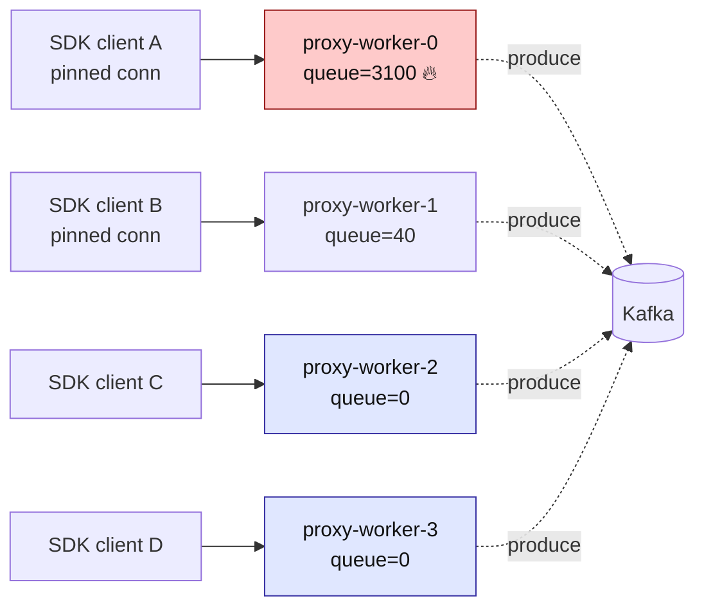

### Incident 3 — HPA Throttling Not Tuned

**Symptom:** Query latency p95 spiked during a flash traffic event. HPA fired the `MilvusWorkerHpaMaxReplicas` alert → already at max, can't scale further.

**Root cause:** HPA `maxReplicas` was set to a number that had been correct 6 months ago, never updated. Traffic had 3x'd.

**Fix:** raise `maxReplicas`; add a **quarterly capacity review** to the team's rituals; set alerts at 80% max, not 100%.

### Incident 4 — DataCoord Slow Startup (13-14 minutes to Healthy)

**The big one.** This is the RCA I'd quote verbatim in an interview.

**Symptom:** During a Milvus AMI patch (weekly rolling restart), DataCoord stayed in `Initializing` state for 13-14 minutes. Proxy workers crashed because they couldn't reach DataCoord. Ingest and search went to **0** for those 14 minutes.

**Scale context:** cluster had grown from 10K collections → 100K collections after an upgrade. Test and prod had passed health checks; this surfaced only during a full restart under load.

**Timing breakdown (from Splunk log analysis):**

```
| Phase                              | Time  | Duration    |
| ---------------------------------- | ----- | ----------- |
| meta reload done                   | 17:51 | 0.206s      |
| init compaction done               | 18:05 | **823.4s**  |  ← the 13.7-min gap
| state = Healthy                    | 18:05 | 0.004s      |
```

**Root cause (code-level):** `initCompaction() → loadMeta()` in `internal/datacoord/compaction.go:356-414` iterates every persisted compaction task. For each task:
- Terminal tasks (completed/cleaned/timeout) → logged and skipped.
- Active tasks → calls `createCompactTask()` → `CheckAndSetSegmentsCompacting()`.
- If segments no longer exist → `DropCompactionTask()` → **serial etcd DELETE per task**.

Splunk log count confirmed:
- `create_failed_cleanup` (segment not exist → etcd DELETE): **271,957** events.
- `abandon_task` (terminal state, skipped): 1,523.
- `restore_task`: 270.

271,957 serial etcd DELETEs × ~3 ms each = ~816 seconds ≈ 13.6 minutes. Matches the observed gap exactly.

**Why tasks accumulated:** 
- L0 compaction trigger ran every 10s.
- With 100K collections × multiple partitions × L0 segments, this generated ~85 new compaction tasks/minute.
- Default `gcInterval` (30 min) + `dropTolerance` (24h) meant up to ~122K tasks sat in etcd steady state.
- On restart, DataCoord had to reconcile all of them.

**Fix (no code change, no restart — both configs were `refreshable: true`):**
```yaml
dataCoord:
  compaction:
    dropTolerance: 3600   # 1h  (from 86400)
    gcInterval: 600       # 10m (from 1800)
```
Steady-state etcd keys: **~850** (from ~122K). Next restart: Healthy in seconds.

**Interview moral:** "Which metadata store grows unbounded while the cluster looks healthy?" is always the question to ask.

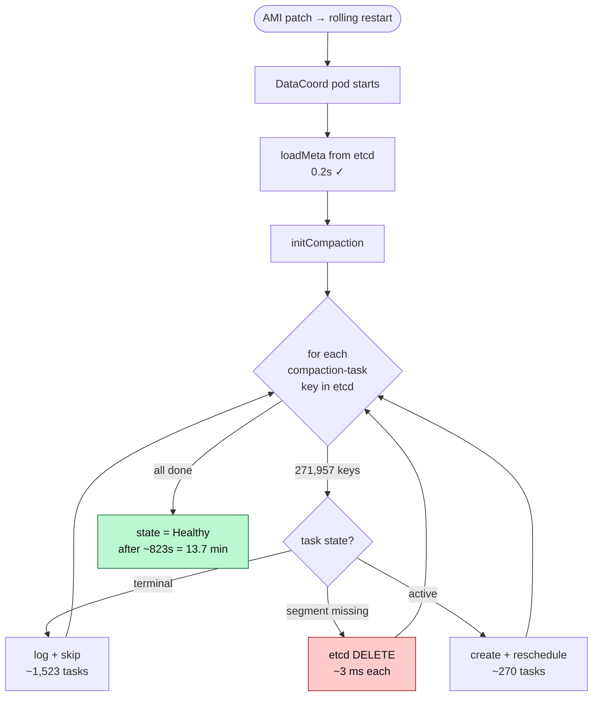

**Fix applied (refreshable, no restart):** `gcInterval: 1800 → 600`, `dropTolerance: 86400 → 3600` → steady-state keys dropped from ~122K to ~850, next restart Healthy in seconds.

### Incident 5 — RPC DEADLINE_EXCEEDED / RBAC Access Denied

**Symptom:** Periodic bursts of `DEADLINE_EXCEEDED` (3-minute gRPC deadline hit by 2-minute API timeout) and `RBAC Access Denied` errors, seemingly random.

**Root cause:** **Stale certificates.** SPIFFE certs are valid 7 days, refreshed at t-2 days. When a pod missed the refresh window (e.g., was `Pending` on Karpenter node provisioning at the refresh time), the cert expired → subsequent mTLS handshakes fail → DEADLINE_EXCEEDED.

**Fix:**
- **Workaround:** client recreates Milvus gRPC connection **daily** (forces fresh cert use on client side).
- **Durable:** fix the SPIFFE refresh loop to retry with backoff.

### Incident 6 — Query Node "Collection Not Fully Loaded"

**Symptom:** Intermittent `collection not fully loaded` errors during peak traffic.

**Root cause:** QueryCoord was rebalancing segments (HPA had just scaled up QueryNodes 2 → 8). During rebalance, for a few seconds some segments were in transit → the coord reported partial load → search failed fail-closed.

**Fix:**
- Client-side retry with exponential backoff (1s, 2s, 4s, 8s).
- Tune `queryCoord.loadTimeoutSeconds` and `queryCoord.segmentBalanceFrequency` to make rebalance shorter.

---

## 15. Debugging Toolkit & Cheat Sheet

```
# Which instance is a tenant on?
aws dynamodb get-item --table-name milvus-dbsources --key '{"tenantId":{"S":"TENANT"}}'

# Pod topology
kubectl get pods -n milvus -o wide | grep <instance>
kubectl describe deployment data-coord-<instance> -n milvus

# Event + crash loop hunting
kubectl get events -n milvus --sort-by='.lastTimestamp' | tail -20
kubectl logs -n milvus <pod> --previous

# Live metrics on a coordinator
kubectl port-forward <pod> 9091:9091 -n milvus
curl localhost:9091/metrics | grep milvus_

# Is etcd healthy?  (foundational — check first in every incident)
kubectl exec -n milvus etcd-<instance>-0 -- etcdctl endpoint health
kubectl exec -n milvus etcd-<instance>-0 -- etcdctl endpoint status -w table

# etcd key explosion check (the DataCoord incident diagnostic)
kubectl exec -n milvus etcd-<instance>-0 -- etcdctl get \
  --prefix milvus-<instance>/meta/datacoord-meta/compaction-task --keys-only | wc -l
# Expect < 5000 steady-state. If > 50000: tune gcInterval + dropTolerance.

# S3 inspection
aws s3 ls s3://<env>-<region>-<cdp>-dpc-milvus/milvus-storage/<instance>/
aws s3 ls s3://<env>-<region>-<cdp>-dpc-milvus/milvus-storage/<instance>/insert_log/ | wc -l

# Kafka / MSK offsets (ingest-lag check)
kafka-consumer-groups.sh --bootstrap-server <msk> --describe --group <datacoord-group>
```

### Common log patterns → meanings

| Log pattern | Likely meaning | First action |
|-------------|---------------|--------------|
| `DEADLINE_EXCEEDED` | Stale cert, or client 2-min vs server 3-min mismatch | Check SPIFFE cert age; recreate client |
| `RBAC Access Denied` | Stale cert or missing credential | Verify certs and IAM role |
| `collection not fully loaded` | HPA rebalance or segment still loading | Client retry with backoff |
| `gRPC keepalive timeout` | Istio gateway blip | Check gateway health, restart istio-proxy sidecar |
| `ContextDeadlineExceeded` in proxy-worker | Proxy internal queue full | Check `milvus_proxy_queue_task_num`; scale proxies |
| `init compaction done` took N minutes | Compaction tasks piled up in etcd | Tune `dropTolerance` + `gcInterval` |

### Alerts you actually care about (Salesforce fleet volumes, last month)

| Alert | Frequency | Urgency | Note |
|-------|-----------|---------|------|
| MskPacketsDropped | ~55/mo | low | Known noise; playbook fix |
| MilvusWorkerHpaMaxReplicas | ~55/mo | low | Mostly tuning; raise max |
| ProxyWorkerInsertFailures | ~38/mo | mixed | Major 5%, Critical 10% thresholds |
| MilvusPatchingFailureDeploymentAmi | ~22/mo | low | 4-hour inertia |
| MilvusClusterHealthCheck | ~8/mo | **high** | Investigate immediately |
| MilvusEtcdStatefulsetReplicasNotReady | ~5/mo | **high** | Existential — drop what you're doing |

### CPU-usage alert thresholds (per-component sanity)

| Worker | Threshold | Why different? |
|--------|-----------|----------------|
| IndexWorker | 10% | Mostly idle; spikes = unusual |
| ProxyWorker | 30% | Lightweight routing |
| DataWorker | 90% | Heavy ingest processing |
| QueryWorker | 180% | Multi-threaded ANN bursts — expect wide variance |

---

## 16. Capacity Planning & Sizing

Milvus provides a [sizing calculator](https://milvus.io/tools/sizing), but the first-principles math is:

```
Raw data per vector (bytes) = dim × 4 (float32)
                          OR = dim × 1 (int8 quantized)
                          OR = dim / 8 (binary)

HNSW index size  ≈ raw × 1.5           (graph edges + padding)
IVF_PQ size      ≈ raw × 0.08          (compressed centroids)
DiskANN size     ≈ raw × 0.05 on disk + 0.2 in RAM

Total storage ≈ raw + index + metadata(~5%) + replicas(×2 usually)
```

**Example:** 1B vectors × 1536 dim × float32:
- Raw: 1B × 1536 × 4 = 6.14 TB
- HNSW index: ~9 TB
- With 2x replica: ~30 TB S3 + 9 TB RAM (for full load)

Rule of thumb: **provision ~3x the raw data size** in S3 and plan RAM ≈ index size for HNSW.

### Segment count sanity

```
segments ≈ N_vectors / segment_size_in_rows
         ≈ N / (2 GB / (dim × 4))

For d=1536, 2 GB segment fits ~340K vectors.
1B vectors → ~3000 segments.
100M vectors → ~300 segments.
```

Too few segments (< 10) → no parallelism → slow search on N > 10M.
Too many segments (> 10K) → metadata bloat → slow coordinator.

---

## 17. When NOT to Use Milvus

| Situation | Use instead | Reason |
|-----------|-------------|--------|
| You have < 10M vectors and hate ops | `pgvector` (Postgres extension) | No infra, HNSW in Postgres handles it fine up to ~20M. |
| You want managed, zero-ops | Pinecone, Weaviate Cloud, Zilliz Cloud | Milvus self-hosted has 7 components + 3 dependencies. |
| Pure keyword / BM25 search | Elasticsearch / OpenSearch | Milvus's sparse-vector support (2.4+) is OK but ES is battle-tested. |
| You need strong transactional guarantees across vectors + relational data | Postgres + pgvector | ACID across both. Milvus is eventually-consistent for DMLs. |
| You store < 1 GB total embeddings | FAISS in-process | No server; mmap'd file. |
| Real-time streaming ANN over minutes of data | In-memory FAISS per service | Milvus's seal-and-index cycle is minutes; not milliseconds. |

Milvus's sweet spot: **100M - 10B vectors, multi-tenant, multi-region, need HA and observability, operator team ≥ 2 engineers.**

---

## 18. Milvus vs Pinecone vs Weaviate vs pgvector

| Dimension | **Milvus** | Pinecone | Weaviate | pgvector |
|-----------|------------|----------|----------|----------|
| Model | Self-hosted OSS + managed (Zilliz Cloud) | Managed SaaS only | Self-hosted OSS + managed | Postgres extension |
| Scale ceiling | 10B+ vectors | ~5B (managed) | ~1B | ~20M (comfortable) |
| Write path | Kafka WAL + async flush | Managed, abstracted | gRPC + batching | SQL INSERT |
| Freshness | Seconds (live segments) | Seconds | Seconds | Immediate |
| Hybrid search | ✓ (filter + vector, sparse+dense 2.4+) | ✓ | ✓ (native GraphQL) | Limited |
| Consistency | Eventual (DML), strong (DDL) | Eventual | Eventual | Strong (ACID) |
| Ops complexity | **High** (7 components + 3 deps) | **None** | Medium | **None** (if you have Postgres) |
| Cost model | Infra cost | Per-vector + per-query | Infra or per-node | "Free" (Postgres already there) |
| GPU indexing | ✓ CAGRA | ✗ | ✗ | ✗ |
| Best for | 100M+ multi-tenant, self-hosted | Fast start, pure vector | Knowledge graphs + vectors | Small-medium, Postgres shop |

**Interview framing:** if someone asks "why Milvus and not Pinecone?" the real answer is usually **data gravity and cost**. At billions of vectors, Pinecone's per-vector pricing crosses the "hire an SRE" threshold. At that point you run Milvus.

---

## 19. Interview Questions — Medium

### Q1: Design a semantic search system for a help-desk ticket tool. 1B tickets, 50K QPS, p99 < 100 ms.

**Answer:**

Calculate first: 1B × 1536 dim × 4 bytes ≈ 6.1 TB raw, 9 TB with HNSW index.

Architecture:
1. **Embedding service** (BERT / sentence-transformers on GPU) — batch size 32, p99 20 ms.
2. **Milvus** with HNSW, M=16, ef=96, COSINE metric.
3. **Shards: 32** (50K QPS / ~1500 per shard).
4. **QueryNodes: HPA 8 → 32**, R-family EC2, 128 GB RAM each. Total cluster RAM ≈ 10 TB to hold index hot.
5. **Hybrid search:** pre-filter by `tenant_id` (scalar index). Reduces fan-out cost.
6. **Cache layer:** Redis in front for top queries (popular tickets). 70% hit rate halves Milvus load.

Ingest: Spark job reads tickets from Kafka → embeds in batches → uses pymilvus `insert` to Milvus proxies. Target ingest 5K rows/sec.

Latency budget:
- Embedding: 20 ms
- Network to Milvus: 5 ms
- Proxy → QueryCoord: 3 ms
- Scatter to 16 QueryNodes: 30 ms (max)
- Merge top-10: 2 ms
- Return: 5 ms
- **Total: ~65 ms p99.** Headroom.

### Q2: Why does Milvus need Kafka? Couldn't Proxy just write to S3 directly?

**Answer:**

Three reasons:
1. **Latency.** S3 PUT is 50-200 ms. Kafka ACK is 3-10 ms. Inserting 1M vectors takes minutes on S3, seconds on Kafka.
2. **Recovery & replay.** DataNode can crash mid-flush. With Kafka, it restarts from last committed offset — no dedup logic needed in client. Without Kafka, client has to retry and re-dedupe.
3. **Backpressure absorption.** Spike ingest patterns need a buffer. S3 has no backpressure mechanism — you'd melt DataNodes.

The cost: Kafka/MSK is an operational burden and a hard dependency. At smaller scale (Milvus Lite or Milvus Standalone), Kafka is replaced with **RocksMQ** (embedded WAL) which serves the same role at lower scale.

### Q3: How does Milvus achieve "real-time" search when indexes take minutes to build?

**Answer:**

The key insight is **segment dualism**. Incoming data flows through live (growing) segments that are brute-force searchable immediately. Once a segment seals at 2 GB, it's indexed asynchronously, but the live-segment brute force continues serving the newest rows.

A single search query touches both: QueryCoord fans out to QueryNodes, each of which searches its sealed segments (fast HNSW) AND its live segments (brute force). Results are merged.

At steady state, live segments contain only a few MB of data — brute-force cost is negligible. The moment a segment seals, a new live segment takes over. Freshness = seconds from Kafka ACK to searchability.

### Q4: A user reports intermittent `collection not fully loaded` errors. Walk me through debugging.

**Answer:**

1. **Check QueryNode count & churn:** `kubectl get pods -n milvus | grep query-worker`. If pods are restarting or HPA is firing, that's the likely cause.
2. **Check QueryCoord logs:** look for `rebalance` or `load segment` events. Rebalances during HPA scale-up/down cause transient errors.
3. **Check metric `milvus_querycoord_load_task_count`:** high = segments still loading.
4. **Verify etcd health:** if etcd is flapping, QueryCoord can't persist load state.
5. **Client-side fix:** add retry with exp backoff (1s, 2s, 4s). This is almost always the right layer for this error.
6. **Long-term:** tune `queryCoord.loadTimeoutSeconds`, reduce HPA sensitivity, pre-load collections during deploy.

### Q5: Explain COSINE vs L2. When would you choose one over the other?

**Answer:**

COSINE measures the **angle** between vectors; magnitude is discarded. L2 measures **Euclidean distance**; magnitude matters.

- **Text embeddings (BERT, OpenAI):** almost always COSINE, because magnitude encodes nothing semantic and sentence-transformers are explicitly trained for cosine similarity.
- **Image embeddings (CLIP, ResNet):** mostly COSINE for the same reason.
- **Geographic coordinates, color vectors:** L2 — magnitude IS the distance.
- **Recommendation (user/item):** Inner Product (IP) if embeddings aren't normalized; COSINE if they are.

**Critical gotcha:** index metric must match search metric. Mixing produces garbage results silently.

---

## 20. Interview Questions — Hard

### Q6: You're the on-call. A Milvus instance is returning `DataCoord not healthy` after a restart. It's been 10 minutes. What's happening and what do you do?

**Answer:**

This is the **DataCoord startup lag** scenario. Concretely:

**Diagnose:**
1. `kubectl logs data-coord-<instance>-0 -n milvus | grep "init compaction"` — if you see `init compaction started` but not `init compaction done`, DataCoord is stuck in `loadMeta()`.
2. `kubectl exec etcd-<instance>-0 -- etcdctl get --prefix milvus-<instance>/meta/datacoord-meta/compaction-task --keys-only | wc -l`. If > 100K, you've hit task accumulation.

**Root cause:** GC is not keeping up with compaction rate. At each restart, DataCoord sequentially iterates every persisted compaction task, issuing an etcd DELETE per stale task (~3 ms each). 271K tasks × 3 ms = 13 minutes.

**Immediate mitigation:** do nothing for ~15 min — it will come up. Restarting will only extend the problem because more tasks accumulated while down.

**Durable fix (configs are `refreshable: true`, no restart needed):**
```yaml
dataCoord:
  compaction:
    dropTolerance: 3600   # was 86400
    gcInterval: 600       # was 1800
```

**Prevention going forward:**
- Alert on `etcd key count > 50K for datacoord-meta/compaction-task`.
- In runbook, add: "Before any full Milvus restart, run etcd key-count check. If > 20K, tune GC first."
- Long-term: upstream Milvus now has a parallel cleanup in 2.5.x — upgrade.

### Q7: Design a multi-region Milvus deployment with RPO < 5 min and RTO < 30 min. Explain the tradeoffs.

**Answer:**

Milvus does not have built-in cross-region replication. Three practical designs:

**Option A — Active-passive via Kafka mirroring:**
- Region A: full Milvus write + read.
- Region B: full Milvus, reads from a **Kafka MirrorMaker 2** stream of Region A's MSK.
- DataNodes in B consume the mirrored stream → same segments materialize in B's S3.
- etcd in B is independent; schemas are applied via deployment pipeline.
- **RPO = MirrorMaker lag (typically < 10s)**. **RTO = DNS failover + QueryNode warm-up (~10-15 min).**

Tradeoffs: double infra cost, eventual metadata divergence risk (mitigated by schema-as-code).

**Option B — Active-active with conflict avoidance:**
- Route by tenant: tenant X writes only to Region A; tenant Y only to Region B.
- Each region is primary for its tenants, replica for others via MirrorMaker.
- **Avoids write conflicts entirely** — vector upserts on same primary key in both regions would be undefined.
- More complex routing layer.

**Option C — Backup + restore:**
- S3 cross-region replication (SRR) of binlog + index files.
- etcd snapshots replicated (Milvus writes them to S3 every 15 min).
- On DR: bring up new cluster in B, restore etcd, point at replicated S3.
- **RPO ≈ 15 min** (etcd snapshot cadence). **RTO = 1-4 hours** (provisioning + load).
- Cheapest; best for DR-only, not live failover.

Most orgs start with **Option C** for DR, graduate to **Option A** for true HA.

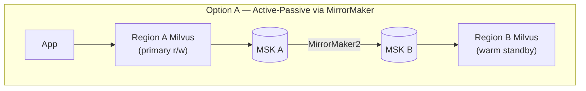

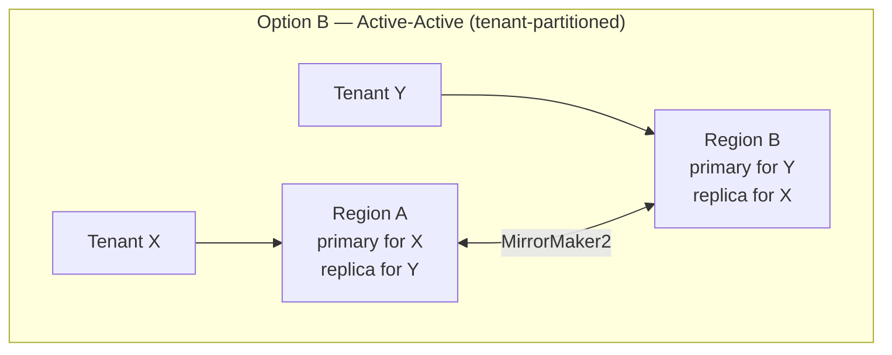

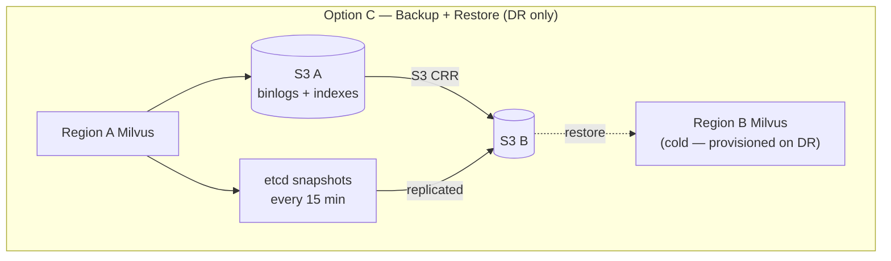

| Option | RPO | RTO | Cost | Use when |
|--------|-----|-----|------|----------|
| A — Mirror | ~10s | 10-15 min | 2× infra | Regulated, need fast failover |
| B — Active-active | ~10s | seconds (per tenant) | 2× infra + routing layer | Global latency, tenant locality |
| C — Backup/restore | ~15 min | 1-4 h | cheapest | Start here; DR-only |

### Q8: Your production Milvus has 10K collections and is slow. You're asked to migrate to partition-per-tenant. What's the migration plan, and what can go wrong?

**Answer:**

**Why slow at 10K collections:**
- Every DataCoord `loadMeta()` reads metadata for all 10K. Slow restart.
- Each collection has its own Kafka channel; broker connection overhead scales linearly.
- HPA rebalance on any collection re-plans all 10K → QueryCoord CPU pegged.

**Target:** one large "mega-collection" with `partition_key = tenant_id`, using Milvus's **partition-key feature** (2.3+). Milvus automatically routes reads/writes to the right partition(s) based on the expression `tenant_id == 'X'`.

**Migration plan:**
1. **Dry run in staging:** confirm `partition_key` behaves as expected, especially for filter queries.
2. **Create new mega-collection** with identical schema + `partition_key=tenant_id`.
3. **Dual-write phase (week 1-2):** app writes to both old collection and new mega-collection.
4. **Backfill (week 2-3):** Spark job reads from old collections, writes to new. Rate-limit to avoid proxy saturation (incident #2 lesson).
5. **Shadow read (week 3):** app reads from new in shadow mode, compares top-k with old. Alert on divergence > 5%.
6. **Cutover (week 4):** point reads to new. Keep old as hot standby for 1 week.
7. **Cleanup:** drop old collections in sequence (not all at once — dropping 10K collections at once triggers its own metadata storm).

**What can go wrong:**
- **Partition-key skew:** if 90% of traffic is on 10% of tenants, one partition becomes a hot spot. Solution: stratified sub-partitioning (hash within tenant).
- **Index rebuild during backfill:** each flush triggers an index-build. 1B vectors × IndexNode capacity = potentially days. Add IndexNodes temporarily.
- **Kafka repartitioning:** if new collection has different `shards_num`, connections between DataNodes and Kafka partitions re-balance during DMLs. Time it for off-peak.
- **Metric filter drift:** queries that used to hit one collection's schema now hit mega-schema. Scalar filters must be on fields that still have scalar indexes, or `expr` queries slow down.

### Q9: A customer says "after inserting 1 million vectors, I can see ~980K in search — some are missing." Debug.

**Answer:**

Several possible causes, ranked by likelihood:

1. **Consistency level mismatch.** Default in Milvus is `Bounded` (not `Strong`). Under `Bounded`, search may lag insert by up to `graceful_time` (default ~5s). Fix: set `consistency_level=Strong` for correctness tests, accept latency cost.

2. **Primary-key collisions.** If two rows have the same primary key, Milvus (by default) upserts. 1M inserts with 20K duplicate PKs → 980K visible. Check: `collection.get_stats()` vs your ingest count.

3. **Shard routing bug.** If the primary key has poor hash distribution (e.g., all PKs start with same prefix and you used `hash(pk) mod shards`), one shard may OOM and drop rows silently in older Milvus versions. Rare in 2.3+.

4. **Flush not completed.** Growing segments are searchable, but `collection.flush()` must be called (or time-triggered) to seal them. If client counts "flushed rows" it may undercount.

5. **Filter expression hiding rows.** Are you searching with a scalar filter (`expr="status='active'"`) that accidentally excludes 2% of rows?

Diagnostic commands:
```python
collection.flush()                      # force seal
collection.load()                       # ensure loaded
print(collection.num_entities)          # true count
print(collection.query(expr="", output_fields=["pk"], limit=1_000_000))
```

If `num_entities == 1_000_000` but search shows 980K: almost certainly **consistency level** or **load staleness**. If `num_entities == 980_000`: **PK collisions** or dropped writes.

### Q10: You're told to reduce Milvus infrastructure cost by 40%. Where do you cut, and what breaks?

**Answer:**

Inventory cost drivers (typical breakdown):
- QueryNodes (R-family, memory-intensive): **50%**
- MSK brokers: **15%**
- S3 storage + requests: **15%**
- etcd, coordinators, proxy, index nodes: **10%**
- Data transfer (cross-AZ): **10%**

**Cuts, in order of safety:**

1. **Move cold collections to DiskANN instead of HNSW (~10-15% savings).**
   - HNSW needs RAM ≈ index size. DiskANN serves from SSD with ~20% latency cost.
   - Pick collections with low QPS. Measure p99 before/after.
   - **Breaks:** latency-sensitive queries on those collections.

2. **Use IVF_PQ for archival collections (~5%).**
   - 10x smaller index, 5-10% recall loss.
   - **Breaks:** recall-sensitive use cases; communicate clearly.

3. **Smaller MSK brokers + larger batch sizes (~5%).**
   - If traffic isn't continuous, right-size brokers.
   - **Breaks:** peak-hour packet drops (see incident #1). Mitigate with burst billing.

4. **QueryNode consolidation via HPA tuning (~10%).**
   - Lower min replicas (e.g., 4 → 2) during off-peak. Let HPA scale up.
   - **Breaks:** cold-start latency for the first wave of morning queries. Warm-up job helps.

5. **S3 lifecycle policy on delta_log (~3%).**
   - Transition delta_log older than 30 days to IA tier.
   - **Breaks:** slightly higher cost if compaction re-reads them.

6. **Cross-AZ traffic reduction (~5%).**
   - Colocate QueryNodes in same AZ as their MSK brokers.
   - **Breaks:** AZ availability guarantee if you consolidate too aggressively.

**Total realistic:** 30-40%. What you **shouldn't** cut: etcd replicas (never below 3), coordinator redundancy, S3 durability. Those failures are existential.

---

## 21. Quick Reference Card

### The 30-second Milvus explainer
> Distributed vector DB. 4 layers (Proxy / Coords / Workers / Storage). Kafka = WAL. etcd = metadata. S3 = durable data. Segments (≤2 GB) are the unit of work — growing ones are brute-force-searchable live; sealed ones get HNSW'd. Scatter-gather on QueryNodes. Major failure modes: etcd down, MSK packet drop, cert expiry, compaction task accumulation.

### Components you'll see in `kubectl get deployments -n milvus`
```
proxy-worker-*       Gateway (gRPC/mTLS)
root-coord-*         Schema + TSO
data-coord-*         Segment mgmt + compaction
query-coord-*        Load balancing searches
index-coord-*        Index build orchestration
data-worker-*        Kafka consume → S3 write
query-worker-*       Search execution (HPA, memory-heavy, R-family)
index-worker-*       HNSW build (bursty, CPU-heavy)
access-manager-*     BYOK sidecar (Salesforce-specific)
```

### Key tunables
| Knob | Default | Tune when |
|------|---------|-----------|
| `dataCoord.segment.maxSize` | 2 GB | Many small segments → raise; cold starts slow → lower |
| `dataCoord.compaction.gcInterval` | 1800s | etcd key count rising → lower to 600s |
| `dataCoord.compaction.dropTolerance` | 86400s | Same → lower to 3600s |
| `queryCoord.loadTimeoutSeconds` | 300 | Large collections timing out during load |
| HNSW `M` | 16 | Recall lacking → 24-32; memory tight → 12 |
| HNSW `ef` | 64 | Recall lacking → 96-256 (at latency cost) |
| HPA `maxReplicas` QueryNode | varies | Review quarterly; max-replicas alert often fires |

### "Oh no" checklist when prod Milvus misbehaves
1. Is **etcd healthy**? (`etcdctl endpoint health`)
2. Is **MSK healthy**? (`TrafficShaping` metric)
3. Is any coordinator in `Initializing` > 5 min? (The DataCoord scenario.)
4. etcd compaction-task key count? (> 50K = trouble.)
5. Recent deploys or AMI patches in last 24 h?
6. SPIFFE cert ages? (> 6 days = risk.)
7. Any single QueryNode with CPU vastly higher than peers? (hot-spotting)
8. Pending pods waiting on Karpenter?

### Canonical references
- **Milvus official docs:** https://milvus.io/docs
- **Milvus architecture paper:** "Milvus: A Purpose-Built Vector Data Management System" (SIGMOD 2021)
- **Zilliz blog:** https://zilliz.com/blog
- **Sizing calculator:** https://milvus.io/tools/sizing
- **Attu (web UI):** github.com/zilliztech/attu
- **Milvus vs Pinecone deep-dive:** Zilliz's comparison page is biased but factually accurate on architecture.
