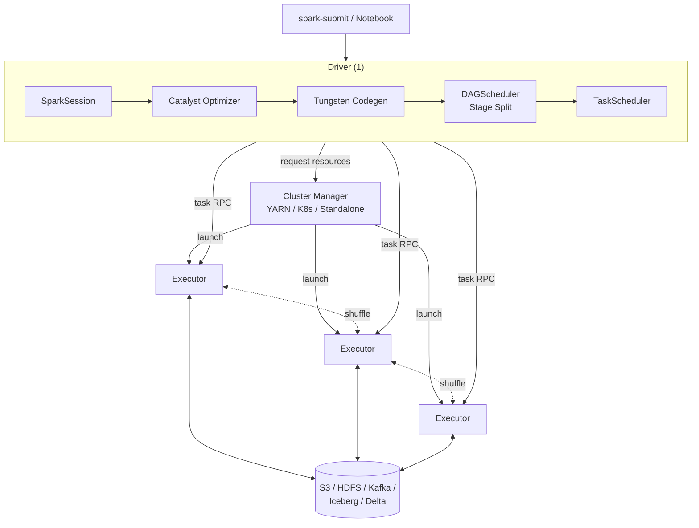
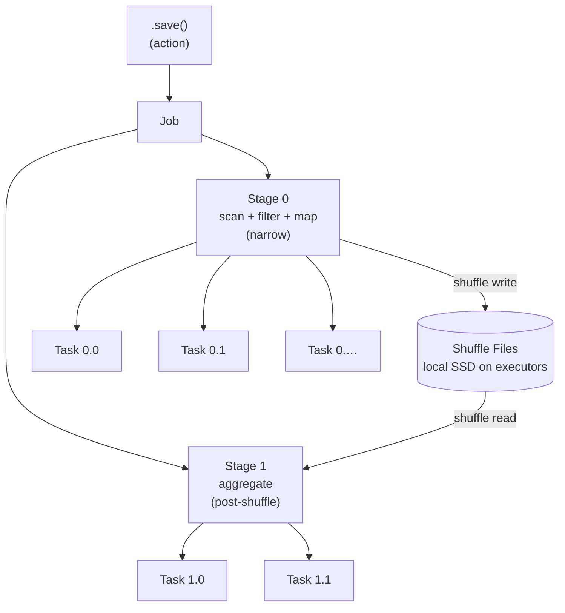
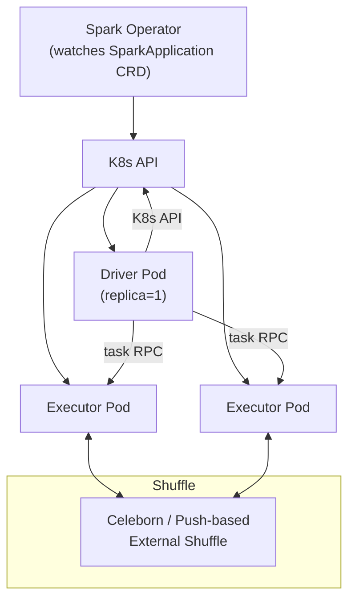

# Apache Spark — The Complete Deep Dive (Distributed Compute Engine)

> **Difficulty:** Hard | **Time:** 6-8 hours | **Priority:** Must Know for Data-Intensive Backend Roles
> **Sources:** Spark Official Documentation (spark.apache.org/docs/latest), Matei Zaharia's NSDI'12 RDD paper, Databricks Engineering Blog, Netflix Tech Blog (Spark on K8s), Uber Engineering (Spark + Iceberg), Salesforce UDS Milvus ingestion pipeline (April 2026), Production RCAs (driver OOM, shuffle bloat, data skew, small-files explosion), High Performance Spark (O'Reilly, Karau & Warren)
> **For:** SDE2 / SDE3 (3-8 years) preparing for System Design interviews touching ETL, data pipelines, batch + streaming, or analytics systems

---

## Table of Contents

1. [What Is Spark](#1-what-is-spark)
2. [Why Spark Exists — The MapReduce Problem](#2-why-spark-exists--the-mapreduce-problem)
3. [High-Level Architecture — Driver, Cluster Manager, Executors](#3-high-level-architecture--driver-cluster-manager-executors)
4. [Core Abstractions — RDD, DataFrame, Dataset](#4-core-abstractions--rdd-dataframe-dataset)
5. [Catalyst Optimizer & Tungsten Execution Engine](#5-catalyst-optimizer--tungsten-execution-engine)
6. [Execution Model — Job, Stages, Tasks, DAG](#6-execution-model--job-stages-tasks-dag)
7. [The Shuffle — Deep Dive](#7-the-shuffle--deep-dive)
8. [Memory Management — Unified Memory Model](#8-memory-management--unified-memory-model)
9. [Caching & Persistence](#9-caching--persistence)
10. [Joins — Broadcast, Sort-Merge, Shuffle-Hash, Bucketed](#10-joins--broadcast-sort-merge-shuffle-hash-bucketed)
11. [Partitioning, Bucketing & Skew](#11-partitioning-bucketing--skew)
12. [Adaptive Query Execution (AQE)](#12-adaptive-query-execution-aqe)
13. [Structured Streaming](#13-structured-streaming)
14. [Cluster Managers — YARN, Kubernetes, Standalone](#14-cluster-managers--yarn-kubernetes-standalone)
15. [Common Production Problems](#15-common-production-problems)
16. [Performance Tuning Cheat Sheet](#16-performance-tuning-cheat-sheet)
17. [When NOT to Use Spark](#17-when-not-to-use-spark)
18. [Spark vs Flink vs Trino vs MapReduce vs Snowflake](#18-spark-vs-flink-vs-trino-vs-mapreduce-vs-snowflake)
19. [Real-World Usage at Scale](#19-real-world-usage-at-scale)
20. [Interview Questions — Medium](#20-interview-questions--medium)
21. [Interview Questions — Hard](#21-interview-questions--hard)
22. [Quick Reference Card](#22-quick-reference-card)

---

## 1. What Is Spark

Apache Spark is a **distributed, in-memory, general-purpose compute engine** for large-scale data processing. It started as a UC Berkeley AMPLab research project (Matei Zaharia, 2009), was open-sourced in 2010, donated to Apache in 2013, and is now the default batch + micro-batch processing engine for almost every data-platform team.

Spark is **not a storage system** and **not a database**. It is a JVM-based execution engine that reads from any storage (S3, HDFS, JDBC, Kafka, Iceberg, Delta, Hudi) and writes back to any sink. You bring the data; Spark brings the cores.

```
Hadoop MapReduce (2004 era):                Spark (2014+):

  Map → Disk → Reduce → Disk → Map → Disk     Map → Memory → Reduce → Memory → ...
  ✗ Every stage materializes to HDFS          ✓ Pipelined in RAM, spills only when needed
  ✗ 100s of seconds per iteration             ✓ Seconds per iteration (10-100× faster)
  ✗ Java-only API                             ✓ Scala / Python / SQL / R / Java
  ✗ Batch only                                ✓ Batch + streaming + ML + graph
  ✗ Hand-coded jobs only                      ✓ SQL, DataFrame DSL, optimizer-driven
```

### The short definition that clicks in interviews

> Spark is a **distributed DAG execution engine** that takes a SQL query or DataFrame program, plans it through the **Catalyst optimizer**, compiles tight per-task code via **Tungsten + whole-stage codegen**, and runs it across thousands of **executors** with **in-memory data sharing across stages**. It generalizes MapReduce by allowing arbitrary DAGs (not just `map → reduce`) and by keeping data in RAM between transformations.

### Spark in one sentence, three flavors

| Audience | Definition |
|----------|------------|
| PM | A tool that lets you run SQL or Python over terabytes/petabytes by spreading work across many machines. |
| Engineer | A JVM cluster framework where a Driver compiles a logical plan into stages of tasks that executors run in parallel against partitioned data, exchanging data via shuffle. |
| SRE | A YARN/K8s workload of one Driver pod (SPOF) plus N Executor pods that consume CPU/RAM in proportion to data size and shuffle volume — whose #1 outage cause is OOM kill (driver or executor) or shuffle disk exhaustion. |

### What Spark gives you that plain Python/Java does not

```
┌─────────────────────────────────────────────────────────────────────────┐
│  1. HORIZONTAL SCALE                                                    │
│     Same code runs on 1 laptop or 10,000 cores. Just change            │
│     spark.executor.instances.                                           │
│                                                                         │
│  2. FAULT TOLERANCE FOR FREE                                            │
│     Lost executor? Spark recomputes only the lost partitions from the   │
│     RDD lineage. No checkpoint logic to write.                          │
│                                                                         │
│  3. UNIFIED API ACROSS WORKLOADS                                        │
│     Same DataFrame works in batch, streaming, ML feature pipelines.    │
│                                                                         │
│  4. SQL OPTIMIZER                                                       │
│     Catalyst rewrites your query: predicate pushdown, column pruning,  │
│     join reordering, AQE — all without you asking.                      │
└─────────────────────────────────────────────────────────────────────────┘
```

---

## 2. Why Spark Exists — The MapReduce Problem

Hadoop MapReduce (2004) gave the industry a way to parallelize computations over terabytes by writing two functions: `map()` and `reduce()`. It worked, but had four crippling pain points that every data engineer hit by 2010:

```
┌────────────────────────────────────────────────────────────────────────┐
│  PROBLEM 1 — DISK BETWEEN EVERY STAGE                                  │
│  Iterative ML (e.g., k-means with 20 iterations) re-reads HDFS 20×.   │
│  A single iteration that should take 10 s takes 5 min.                 │
│                                                                        │
│  PROBLEM 2 — ONLY MAP → REDUCE                                         │
│  Multi-step DAGs (filter → join → aggregate → join) need multiple      │
│  jobs, each writing to HDFS in between. You become a YAML pipeline     │
│  engineer, not a data engineer.                                        │
│                                                                        │
│  PROBLEM 3 — NO INTERACTIVE / NOTEBOOK USE                             │
│  You can't iterate. Compile JAR, submit, wait 10 min, debug, repeat.  │
│                                                                        │
│  PROBLEM 4 — VERBOSE JAVA APIS                                         │
│  Counting words is 80 lines of Java boilerplate.                       │
└────────────────────────────────────────────────────────────────────────┘
```

Spark's core innovation (Zaharia 2012, NSDI) was **Resilient Distributed Datasets (RDDs)** — an in-memory, partitioned, immutable, lineage-tracked collection. The RDD paper's two killer claims:

1. **Memory between stages.** A `map → filter → reduceByKey → join` chain stays in RAM across stages; only the shuffle boundary spills.
2. **Lineage instead of replication.** If a partition is lost, recompute it from its parent. No need to replicate intermediate results to 3× HDFS.

Spark also generalized the execution graph from `map → reduce` to **arbitrary DAGs**, which made it possible to express complex SQL and ML pipelines as a single optimized job.

---

## 3. High-Level Architecture — Driver, Cluster Manager, Executors

A Spark application has **exactly three role-types** at runtime. Internalize this picture and 70% of Spark interviews become easy:

```
                            ┌──────────────────────────────────────────────┐
                            │  SUBMITTED CLIENT (spark-submit / notebook)  │
                            └───────────────────┬──────────────────────────┘
                                                │
                                                ▼
  ┌────────────────────────────────────────────────────────────────────────────────┐
  │  DRIVER  (1 per app — SPOF)                                                    │
  │  ┌───────────────────────────────────────────────────────────────────────┐    │
  │  │  SparkSession  →  Catalyst (logical → optimized plan)                 │    │
  │  │                  →  Tungsten codegen                                  │    │
  │  │                  →  DAGScheduler   (split into stages by shuffle)     │    │
  │  │                  →  TaskScheduler  (map tasks → executors)            │    │
  │  │                  →  BlockManager (driver side: broadcast vars, accums)│    │
  │  └───────────────────────────────────────────────────────────────────────┘    │
  └───────┬─────────────────────────────────────────────────────────────┬──────────┘
          │ requests resources                                          │ task RPC
          ▼                                                             ▼
  ┌─────────────────────────────────┐         ┌────────────────────────────────────┐
  │  CLUSTER MANAGER                │         │  EXECUTORS  (N — stateless workers)│
  │  YARN / Kubernetes /            │  spawn  │  ┌──────────────────────────────┐  │
  │  Standalone / Mesos             │ ──────► │  │  JVM process                 │  │
  │                                 │         │  │  ├─ N task slots (= cores)   │  │
  │  Allocates pods/containers,     │         │  │  ├─ BlockManager (cache,     │  │
  │  enforces quotas, restarts.     │         │  │  │   shuffle blocks)         │  │
  │                                 │         │  │  ├─ Memory manager          │  │
  │                                 │         │  │  └─ External shuffle service │  │
  │                                 │         │  └──────────────────────────────┘  │
  └─────────────────────────────────┘         └────────────┬───────────────────────┘
                                                           │ read / write
                                                           ▼
                                            ┌──────────────────────────────────────┐
                                            │  STORAGE  (S3 / HDFS / JDBC / Kafka /│
                                            │  Iceberg / Delta / Hudi / Parquet)   │
                                            └──────────────────────────────────────┘
```

### The three roles in one paragraph

- **Driver** — Holds the `SparkContext`/`SparkSession`, plans the query, schedules tasks, collects results. **It is a single process and a single point of failure for the application.** When the driver dies, the whole app dies.
- **Cluster Manager** — A pluggable scheduler (YARN, Kubernetes, Standalone). It hands the driver a pool of resources (CPU+RAM) on demand. It does NOT participate in computation.
- **Executor** — A JVM process that runs the actual tasks. It is **stateless across application restarts** but holds in-memory cache and shuffle data **for the lifetime of the application**. Each executor has a fixed number of **task slots** (one per core).

### Mermaid view



### Why the driver is a SPOF and why that matters

Long-running streaming jobs (24×7) cannot tolerate driver crashes. Two production patterns:

1. **`spark-submit --deploy-mode cluster`** — the driver runs *inside* a cluster container, so the cluster manager can restart it on failure. Required for production.
2. **Checkpointing** — Structured Streaming writes its state and offsets to durable storage so a restarted driver can resume from where it died (RPO ≈ batch interval).

> **Interview gotcha:** `client` deploy mode runs the driver on the submitting machine (your laptop or the edge node). Convenient for dev, fatal for prod — if the laptop loses Wi-Fi, the cluster keeps running but the driver dies and you waste hours of work.

---

## 4. Core Abstractions — RDD, DataFrame, Dataset

Spark exposes three immutable, distributed collection abstractions. They share the same execution engine but have very different ergonomics and performance characteristics.

```
┌──────────────────────────────────────────────────────────────────────────────┐
│   RDD (Spark 1.0, 2014)         DataFrame (1.3, 2015)        Dataset (1.6)   │
│   ─────────────────────         ──────────────────────       ─────────────   │
│   Untyped JVM objects           Schema-aware rows            Typed objects   │
│   No optimizer                  Catalyst-optimized           Catalyst-opt    │
│   No codegen                    Tungsten codegen             Tungsten codegen│
│   .map(closure)                 .select / .filter / SQL      .map(typed fn)  │
│   ✓ Max flexibility             ✓ Best perf, best ergonomics ✓ Type safety   │
│   ✗ Slowest, no schema          ✗ Runtime errors only        ✗ Scala/Java    │
└──────────────────────────────────────────────────────────────────────────────┘
```

### RDD — the foundation

An **RDD\[T\]** is a *resilient distributed dataset*: a partitioned collection of `T` objects with a lineage graph and a function to compute each partition. It exposes:

- **Transformations** (lazy): `map`, `filter`, `flatMap`, `reduceByKey`, `join`, `groupByKey`, `union`. Return a new RDD without executing.
- **Actions** (eager): `count`, `collect`, `saveAsTextFile`, `take`, `foreach`. Trigger computation.

```python
rdd = sc.textFile("s3://logs/")          # transformation: just records lineage
words = rdd.flatMap(lambda l: l.split()) # transformation
counts = words.map(lambda w: (w, 1)).reduceByKey(lambda a, b: a + b)  # transformation
counts.saveAsTextFile("s3://out/")       # action: triggers DAG execution
```

Until `saveAsTextFile`, **nothing has run**. Spark holds the entire lineage in the driver and starts work only on the action.

### DataFrame — the workhorse

A **DataFrame** is a `Dataset[Row]` — a distributed table with a schema (columns + types) but untyped rows. This is what Spark SQL operates on, and what 95% of production Spark code uses.

```python
df = spark.read.parquet("s3://events/")
result = (df.filter(df.country == "US")
            .groupBy("user_id")
            .agg(F.sum("amount").alias("total"))
            .orderBy(F.desc("total")))
result.write.parquet("s3://top_users/")
```

The DataFrame API is **declarative** — you describe what you want, not how to do it. Catalyst then plans the most efficient execution.

### Dataset — DataFrame + compile-time types

`Dataset[T]` is the typed cousin of DataFrame, available in Scala/Java only. Useful when you want IDE auto-complete and compile-time type checks but pay a small serialization cost compared to DataFrames.

### Mental model: choosing between them

| Use case | Best abstraction |
|----------|------------------|
| SQL or relational logic | DataFrame / Spark SQL |
| Custom serializer (Avro, Protobuf) with type safety | Dataset |
| Low-level control (custom partitioner, manual shuffle) | RDD |
| ML feature engineering | DataFrame (MLlib pipelines) |
| Python (no Dataset available) | DataFrame always |

> **Interview answer:** "I default to DataFrame/SQL because it gets Catalyst + Tungsten optimizations for free. I drop to RDDs only for unusual partition-level logic or custom partitioners that Spark SQL can't express."

---

## 5. Catalyst Optimizer & Tungsten Execution Engine

This is the section that separates SDE3 from SDE2. Two cooperating subsystems make Spark fast:

### Catalyst — the query planner (Scala metaprogramming masterpiece)

```
   Your DataFrame / SQL
            │
            ▼
   ┌────────────────────┐
   │  UNRESOLVED         │  parse tree, no schema lookups yet
   │  LOGICAL PLAN       │
   └─────────┬──────────┘
             │   resolve column / table refs from Catalog
             ▼
   ┌────────────────────┐
   │  RESOLVED LOGICAL   │  every reference points to a real column / type
   │  PLAN               │
   └─────────┬──────────┘
             │   apply rule-based optimizations:
             │     - predicate pushdown
             │     - column pruning
             │     - constant folding
             │     - join reordering
             │     - boolean simplification
             │     - subquery decorrelation
             ▼
   ┌────────────────────┐
   │  OPTIMIZED LOGICAL  │
   │  PLAN               │
   └─────────┬──────────┘
             │   choose physical operators (HashJoin vs SortMergeJoin),
             │   estimate cost via statistics, pick best plan
             ▼
   ┌────────────────────┐
   │  PHYSICAL PLAN      │  e.g., FileScan → Filter → HashAggregate
   └─────────┬──────────┘
             │   Tungsten codegen: collapse operators into one tight loop
             ▼
   ┌────────────────────┐
   │  GENERATED JAVA     │  one method per stage, JIT-friendly
   │  BYTECODE           │
   └────────────────────┘
```

Run `df.explain(mode="extended")` in any notebook to see all four plans for your query.

### What Catalyst actually saves you — concrete examples

```python
# You write:
df.filter(df.country == "US").select("user_id", "amount")

# Catalyst rewrites to (assuming Parquet input):
# 1. Predicate pushdown: filter pushed into the Parquet scan via row-group stats
# 2. Column pruning: only "user_id", "amount", "country" are read from disk
# Result: scans 5% of the bytes, not 100%.
```

```python
# You write:
df1.join(df2, "id").join(df3, "id").filter(df1.country == "US")

# Catalyst reorders to:
# df1.filter(country == "US").join(df2, "id").join(df3, "id")
# Smaller side of join is built first → smaller hash table → less shuffle.
```

### Tungsten — the execution engine

Tungsten (Spark 1.5+) replaced the JVM-object-heavy execution with three tricks:

1. **Off-heap memory + custom binary format** — rows are packed into `UnsafeRow` byte arrays managed via `sun.misc.Unsafe`. Bypasses Java GC, drastically reduces object overhead.
2. **Cache-aware computation** — algorithms (sort, hash) operate on raw bytes laid out for L1/L2 cache locality.
3. **Whole-stage code generation** — instead of a virtual `next()` call per operator (Volcano model), Catalyst fuses an entire pipeline into a **single generated Java method** that is JIT-compiled. A `filter → project → aggregate` chain becomes one for-loop with no function-call overhead.

> The Spark 1.x → 2.x perf gain (10× on TPC-DS) was almost entirely Tungsten + whole-stage codegen. Disabling it (`spark.sql.codegen.wholeStage=false`) is sometimes needed when generated methods exceed the JVM's 64KB method-size limit.

---

## 6. Execution Model — Job, Stages, Tasks, DAG

These are the four words you must say correctly in interviews. Get them wrong and the room knows.

```
┌────────────────────────────────────────────────────────────────────────────┐
│   ACTION    triggers      JOB                                              │
│   .count(), .collect(), .save() — every action = exactly 1 job             │
│                                                                            │
│   JOB       split by      STAGES                                           │
│   Boundary = SHUFFLE. Within a stage, tasks run in parallel and in-memory. │
│                                                                            │
│   STAGE     split into    TASKS                                            │
│   Number of tasks = number of partitions in the stage's RDD/DataFrame.    │
│   Each task = one partition processed by one executor core.                │
│                                                                            │
│   TASK      runs in       EXECUTOR CORE                                    │
│   The unit of parallelism. JVM thread on an executor.                     │
└────────────────────────────────────────────────────────────────────────────┘
```

### The classic word-count DAG

```
Source files (200 partitions)
        │
   Stage 0 — Narrow (no shuffle)
        │   • textFile → flatMap → map(word, 1)
        │   • 200 tasks run in parallel
        │
   ─── shuffle boundary (hash by word) ───
        │
   Stage 1 — Narrow
        │   • reduceByKey → output
        │   • 200 tasks (default spark.sql.shuffle.partitions = 200)
        │
   Save / collect
```

Every shuffle (`reduceByKey`, `groupBy`, `join`, `repartition`, `distinct`) creates a **new stage**. Within a stage, transformations are pipelined in memory, no disk hit.

### Narrow vs wide dependencies

```
Narrow (1:1, no shuffle):                    Wide (M:N, shuffle):
  map, filter, flatMap                       groupBy, reduceByKey, join (some), distinct

  ┌──┐ ──► ┌──┐                              ┌──┐ ─┐ ┌─► ┌──┐
  └──┘     └──┘                              └──┘  ├─┤    └──┘
  ┌──┐ ──► ┌──┐                              ┌──┐ ─┘ └─► ┌──┐
  └──┘     └──┘                              └──┘
```

The job-stage-task split exists **because of wide dependencies**. If everything were narrow, it'd be one giant pipeline with one task per source partition.

### Where parallelism comes from

`Total parallelism per stage = min(number of partitions, total executor cores in the cluster)`

If you have 10 executors with 4 cores each (40 cores) but only 4 partitions, **36 cores sit idle** while 4 do all the work. This is the #1 newbie performance bug.

### Mermaid: full job lifecycle



---

## 7. The Shuffle — Deep Dive

Shuffle is **the single most expensive thing Spark does** and the cause of most performance problems. Understand it deeply.

```
Stage N (M map tasks)                         Stage N+1 (R reduce tasks)
┌──────────────────┐                           ┌──────────────────┐
│  Map task 0      │  partition 0 ──┐          │  Reduce task 0   │
│  ├ partition 0   │  partition 1 ──┼──► …──┐  │  pulls partition │
│  ├ partition 1   │  partition 2 ──┘       │  │  0 from every    │
│  └ partition R-1 │                        │  │  map task        │
└──────────────────┘  Local SSD spill        │  └──────────────────┘
┌──────────────────┐  (sorted file +         │
│  Map task 1      │   index file per task)  │
│  ├ partition 0   │ ◄───────────────────────┘
│  └ partition R-1 │
└──────────────────┘
        ⋮                   M map outputs × R reduce partitions
                            = M × R fetch operations over the network
```

### Three shuffle modes Spark has used

| Mode | Era | How |
|------|-----|-----|
| Hash shuffle | Spark 0.x (deprecated) | M × R files per stage. Filesystem dies at scale. |
| Sort shuffle (default since 1.2) | Current | Each map task writes 1 sorted file + 1 index. Reducers fetch ranges. |
| Tungsten Sort Shuffle | 1.5+ | Sort shuffle + serialized Tungsten rows. Now default for most cases. |
| Push-based shuffle (3.2+) | Newer | Map tasks push blocks to a shuffle service that pre-merges by reducer. Helps on K8s. |

### What goes wrong with shuffle

```
┌────────────────────────────────────────────────────────────────────────────┐
│  PROBLEM                          SYMPTOM                  FIX             │
├────────────────────────────────────────────────────────────────────────────┤
│  Too much shuffle data           Stage takes hours,        Reduce data     │
│                                  network saturated         (filter early), │
│                                                            broadcast joins,│
│                                                            bucketing       │
│  Shuffle disk full               ExecutorLostFailure,      Increase disk,  │
│                                  "No space left on device" use shuffle svc │
│  Skew (one reducer much          One task hangs while     Salting,         │
│  larger than others)             others done                AQE skew join  │
│  Lost executor mid-shuffle       Stage retried fully       External shuffle│
│                                  (very expensive)          service         │
│  Too many shuffle partitions     Many tiny tasks,          AQE or set      │
│                                  scheduler overhead        spark.sql.      │
│                                                            shuffle.        │
│                                                            partitions      │
└────────────────────────────────────────────────────────────────────────────┘
```

### External Shuffle Service (ESS)

By default, executors hold their own shuffle files. If an executor dies, all shuffle output it produced is lost — the upstream stage must rerun.

The **External Shuffle Service** is a separate process (per node) that owns and serves shuffle files. Executors come and go (especially with Dynamic Allocation), but shuffle files survive. Mandatory for:

- Dynamic allocation (executors scale down)
- Spot/preemptible nodes
- Long-running streaming apps

On Kubernetes, ESS has historically been hard to deploy; **Spark 3.2+ push-based shuffle** and **Apache Celeborn / Uniffle / JindoFS** are emerging replacements.

---

## 8. Memory Management — Unified Memory Model

A Spark executor JVM allocates `spark.executor.memory` (e.g., 8g) plus an **off-heap** `spark.executor.memoryOverhead` (default 10% or 384m, whichever larger — used for direct buffers, native libs, Python interpreter, etc.).

The on-heap budget is split into four regions (Spark 1.6+ "unified memory manager"):

```
┌──────────────────────────────────────────────────────────────────────┐
│                    EXECUTOR JVM HEAP                                  │
│                                                                       │
│  ┌─────────────────┐  300 MB by default                              │
│  │ RESERVED        │  for Spark internals                             │
│  └─────────────────┘                                                  │
│  ┌─────────────────┐                                                  │
│  │ USER MEMORY     │  for your closures, UDFs, Java objects.         │
│  │ (~25% of heap)  │  This is what kills jobs that pull big lists    │
│  │                 │  into UDFs or use mapPartitions naively.        │
│  └─────────────────┘                                                  │
│  ┌─────────────────┐  Unified region — Storage and Execution         │
│  │ STORAGE +       │  share this pool dynamically.                    │
│  │ EXECUTION       │  • Storage = cached RDDs/DataFrames              │
│  │ MEMORY          │  • Execution = shuffle, join, sort buffers       │
│  │ (~75% of heap)  │  Execution can EVICT cached blocks               │
│  │                 │  Storage CAN'T evict execution.                  │
│  └─────────────────┘                                                  │
└──────────────────────────────────────────────────────────────────────┘
```

### Why this matters in interviews

- **Cached DataFrame disappeared?** An execution-heavy stage evicted it. Either size cache up (`StorageLevel.DISK_ONLY` to fall back to disk) or use `CACHE TABLE` on the SQL side which honors a stricter contract.
- **Executor OOM during shuffle?** Execution memory exhausted; either reduce partition size, increase memory, or enable spill (default).
- **Off-heap usage spiking?** Native libs (Pandas UDFs / Arrow / RocksDB state for streaming) live in `memoryOverhead`. Bump `spark.executor.memoryOverhead` to 20% if you use them heavily.

### Spill to disk

Both shuffle sort buffers and aggregations spill to local disk when execution memory is exhausted. Spill is normal and OK — it's how Spark keeps running on small heaps. Watch it in the UI's **"Spill (Memory)"** and **"Spill (Disk)"** columns. High spill = your tasks are too big — repartition.

---

## 9. Caching & Persistence

`df.cache()` (alias for `df.persist(MEMORY_AND_DISK)`) tells Spark to keep the DataFrame in memory after the first computation so subsequent actions reuse it.

```python
df = spark.read.parquet("s3://big/").filter(...).repartition(200)
df.cache()
df.count()          # materializes the cache
df.groupBy(...).agg(...).show()   # reuses cached blocks
df.join(other, "id").show()       # reuses cached blocks
```

### Storage levels — pick the right one

| Level | RAM | Disk | Serialized | When to use |
|-------|-----|------|------------|-------------|
| MEMORY_ONLY | ✓ | ✗ | ✗ | Small data, plenty of RAM |
| MEMORY_AND_DISK (default) | ✓ | ✓ | ✗ | General purpose |
| MEMORY_ONLY_SER | ✓ | ✗ | ✓ | RAM-tight, want compactness |
| MEMORY_AND_DISK_SER | ✓ | ✓ | ✓ | Production default for caching |
| DISK_ONLY | ✗ | ✓ | ✓ | Very large datasets, slow but durable |
| OFF_HEAP | off-heap | — | ✓ | Avoid GC, requires `spark.memory.offHeap.enabled` |

### Critical interview gotchas

1. **Cache is lazy.** `df.cache()` returns immediately; the data isn't materialized until an action runs. Always do a `df.count()` after `cache()` if you want to time it.
2. **Don't cache one-shot data.** Caching has overhead. If you'll only use it once, just chain transformations.
3. **`cache()` is per-application.** Killed by `unpersist()` or app exit. It is NOT a cross-job cache (use Delta/Iceberg for that).
4. **`CACHE TABLE` is eager** in SQL; `df.cache()` is lazy in DataFrame API. This trips up the unwary.

---

## 10. Joins — Broadcast, Sort-Merge, Shuffle-Hash, Bucketed

The choice of join strategy is **the** single biggest performance lever in Spark SQL. Catalyst picks one of four strategies based on table sizes, statistics, and configs.

### 1) Broadcast Hash Join (BHJ) — fastest when applicable

If one side is small (default `spark.sql.autoBroadcastJoinThreshold = 10MB`, often raised to 100-200MB in prod), Spark broadcasts it to every executor and does an in-memory hash-table lookup. **No shuffle.**

```
   Big side (100M rows, 200 partitions)        Small side (1M rows, broadcast)
   ┌──────────┐   ┌──────────┐                        ┌──────────┐
   │ task 0   │ ◄──── HashTable ─────                 │  driver  │ broadcasts to
   │ task 1   │ ◄──── HashTable ─────                 └──────────┘ every executor
   │ task ... │ ◄──── HashTable ─────
   └──────────┘
```

Force it with: `df1.join(F.broadcast(df2), "id")`.

### 2) Sort-Merge Join (SMJ) — default for big-big

Both sides are shuffled by join key, sorted, then merged like two sorted streams. Memory-friendly, scales to TBs. Default for joins where neither side fits in broadcast.

### 3) Shuffle-Hash Join (SHJ) — niche

Both sides shuffled; the smaller side becomes a hash table per partition. Faster than SMJ on small-medium data but uses more memory. Off by default; enable with `spark.sql.join.preferSortMergeJoin=false`.

### 4) Bucketed Join — shuffle-free big-big join

If both tables were written with matching `bucketBy(N, key)` and `sortBy(key)`, Spark recognizes the buckets are already co-partitioned and skips the shuffle. Rare in practice (requires planning at write time) but the only way to do TB-scale joins repeatedly without re-shuffling.

```python
df.write.bucketBy(100, "user_id").sortBy("user_id").saveAsTable("events_bucketed")
```

### Comparison

| Strategy | Shuffle | Memory | Best when |
|----------|---------|--------|-----------|
| Broadcast | None | Small side fits per-executor | One side ≤ 100MB |
| Sort-Merge | Both sides | Streaming-friendly | Default for big-big |
| Shuffle-Hash | Both sides | Smaller side fits per partition | Smaller side small per partition |
| Bucketed | None | Streaming | Both tables pre-bucketed |

---

## 11. Partitioning, Bucketing & Skew

### Three meanings of "partition" in Spark

1. **RDD/DataFrame partition** — a split of the in-memory dataset processed by one task.
2. **Output partitioning (write)** — `df.write.partitionBy("date")` creates `date=2026-04-25/...` directory layout (Hive-style). Affects **read pruning**, not in-memory parallelism.
3. **Hash partitioning** — internal grouping by hash for shuffle. Controlled by `spark.sql.shuffle.partitions`.

These are unrelated. Mixing them up is a common interview red flag.

### `coalesce` vs `repartition`

```
repartition(N)      coalesce(N)
──────────────      ──────────
SHUFFLE: yes        SHUFFLE: no (only valid for shrinking)
Even sizes          May be uneven
Use to grow         Use to shrink before write
```

`coalesce` is critical before writing to S3 to avoid the **small-files problem**: if your last stage has 2000 partitions and each writes a 5MB file, downstream readers (and S3 list operations) suffer. `df.coalesce(50).write.parquet(...)` produces 50 ~200MB files — much better.

### Data skew — the hidden killer

If one key has 100× more rows than average (`user_id = "guest"` is a classic example), one reducer's task becomes a **straggler**: 199 tasks finish in 1 minute, the 200th takes 30 minutes.

Diagnose:
- Spark UI Stage page: look for one task with much larger Input/Shuffle Read than the median.
- "Summary metrics for completed tasks": max ≫ median.

Fix:
1. **AQE skew join** (Spark 3.0+): `spark.sql.adaptive.skewJoin.enabled=true` automatically splits the skewed partition.
2. **Salting**: append a random suffix to the skewed key, do partial aggregations, then re-aggregate. Manual, fiddly, but works pre-AQE.
3. **Filter-and-broadcast**: if 90% of skew is one key, handle it separately with a broadcast lookup.

```python
# Salted aggregation — manual skew fix
salted = df.withColumn("skey", F.concat(F.col("key"), F.lit("_"), (F.rand()*100).cast("int")))
partial = salted.groupBy("skey").agg(F.sum("amount").alias("p"))
final = (partial.withColumn("key", F.split("skey", "_")[0])
                .groupBy("key").agg(F.sum("p").alias("total")))
```

---

## 12. Adaptive Query Execution (AQE)

AQE (Spark 3.0+, default-on in 3.2+) is the most important Spark feature of the last 5 years. It re-optimizes the physical plan **after each shuffle** based on actual runtime statistics.

```
Without AQE:                              With AQE:
  Plan once, run.                          Plan, run shuffle, INSPECT MAP OUTPUT,
  Wrong join → tank.                       re-plan downstream stage, run, repeat.
```

Three big wins AQE brings:

```
┌────────────────────────────────────────────────────────────────────────┐
│  1. DYNAMIC PARTITION COALESCING                                       │
│     If post-shuffle partitions average 2 MB, AQE merges them into     │
│     ~64 MB chunks → fewer tasks → less scheduler overhead.             │
│                                                                        │
│  2. DYNAMIC JOIN STRATEGY SWITCH                                       │
│     Sort-merge join planned, but actual map output is 8 MB → AQE       │
│     switches to broadcast join. Massive speedup.                       │
│                                                                        │
│  3. SKEW JOIN HANDLING                                                 │
│     Detects partitions > 5× median size and splits them into           │
│     subpartitions, replicating the matching side. Stragglers vanish.   │
└────────────────────────────────────────────────────────────────────────┘
```

Enable everything (defaults in 3.2+):
```text
spark.sql.adaptive.enabled = true
spark.sql.adaptive.coalescePartitions.enabled = true
spark.sql.adaptive.skewJoin.enabled = true
spark.sql.adaptive.localShuffleReader.enabled = true
```

> **Interview answer for "how do I tune Spark?":** "First confirm AQE is on. Most legacy tuning advice (manually setting shuffle partitions, broadcast hints) becomes unnecessary or harmful with AQE."

---

## 13. Structured Streaming

Spark's streaming API (since 2.0; current name "Structured Streaming") models a stream as an **unbounded DataFrame** — same API as batch.

```python
events = (spark.readStream
                .format("kafka")
                .option("subscribe", "clicks")
                .load())

result = (events
            .select(from_json(col("value"), schema).alias("e"))
            .withWatermark("e.ts", "10 minutes")
            .groupBy(window(col("e.ts"), "5 minutes"), col("e.user_id"))
            .count())

(result.writeStream
        .outputMode("append")
        .format("delta")
        .option("checkpointLocation", "s3://ckpt/clicks/")
        .trigger(processingTime="30 seconds")
        .start())
```

### Two execution engines

| Engine | Latency | Semantics |
|--------|---------|-----------|
| **Micro-batch** (default) | 100ms-seconds | Exactly-once. The job runs as a sequence of small Spark batches. Each trigger = one batch. |
| **Continuous processing** (experimental, 2.3+) | ~1 ms | At-least-once. Long-lived tasks, no batches. Limited operators. |

99% of production uses **micro-batch**. If you need true sub-100ms latency, use **Flink**.

### State, watermarks, and output modes

- **Watermark**: `withWatermark("ts", "10 minutes")` declares "events older than max-seen-ts minus 10 min are late and discarded". Without it, state grows forever.
- **Output modes**: `append` (only new aggregate rows), `update` (changed rows), `complete` (full result table — only for small aggregates).
- **State backend**: by default in-memory + checkpointed to durable store. Spark 3.2+ added **RocksDB state store** for jobs with multi-GB state (essential for SLI/long-window jobs).

### The exactly-once contract — what it actually means

Structured Streaming gives **exactly-once end-to-end** if and only if:
1. **Source supports replay** by offset (Kafka, Kinesis, file source). ✓
2. **Sink is idempotent or transactional** (Delta, Iceberg, Hudi, JDBC with upsert). ✓
3. **Checkpointing enabled** and pointing at durable storage. ✓

A naive `foreachBatch` writing to vanilla Postgres without idempotency keys breaks the contract. Most outages I've seen on streaming jobs trace to this misunderstanding.

---

## 14. Cluster Managers — YARN, Kubernetes, Standalone

| Manager | Era / Owner | Strengths | Weaknesses |
|---------|-------------|-----------|------------|
| **Standalone** | Bundled with Spark | Trivial to set up, dev-friendly | Bad multi-tenancy, no security |
| **YARN (Hadoop)** | Hortonworks/Cloudera shops | Battle-tested, queues, capacity scheduler, Kerberos | Tied to HDFS-era infra; declining |
| **Mesos** | Twitter/Apple | Fine-grained resource sharing | Effectively dead (Apache attic 2021) |
| **Kubernetes** | Cloud-native | One scheduler for everything, autoscaling, Karpenter, mature | Shuffle / dynamic allocation harder |

**Industry direction (2024-2026):** YARN clusters are being migrated to **Spark on Kubernetes**, often with managed services (EMR on EKS, GCP Dataproc on GKE, Databricks).

### Spark on Kubernetes — what's different

```
spark-submit --master k8s://https://api.eks.cluster --deploy-mode cluster ...
```

- **One pod per executor**, one pod per driver.
- The driver communicates with the K8s API server to spawn executor pods.
- **Spark Operator** (from Google) makes this declarative — submit a `SparkApplication` CRD instead of `spark-submit`.
- **Karpenter / Cluster Autoscaler** scales nodes up/down to match demand.
- **Shuffle is the hard part:** ESS isn't K8s-native. Use **Apache Celeborn**, **JindoShuffle**, or **push-based shuffle (3.2+)**.



---

## 15. Common Production Problems

These are the bugs that wake on-call engineers up. Memorize them — they appear in every senior interview.

### A. Driver OOM

**Symptom:** `java.lang.OutOfMemoryError: Java heap space` on driver, app dies.

**Causes (ranked by frequency):**
1. `df.collect()` on a large dataset. **Never collect more than ~100MB.**
2. Broadcast variable too large (auto-broadcast crossed `autoBroadcastJoinThreshold` because stats lied).
3. Too many parallel jobs (each job has plan/lineage in driver).
4. Accumulator updates flooding driver.
5. Plan size: 100K-partition input has a giant `FileScan` node. Mitigate with file listing in advance / catalog.

**Fix:** bump `spark.driver.memory` (e.g., 4g → 16g), use `take(N)` instead of `collect()`, prune partitions early.

### B. Executor OOM / lost executor

**Symptom:** `ExecutorLostFailure (executor X exited unrelated to running tasks): Container killed by YARN/k8s for exceeding memory limits`.

**Causes:**
1. Skew — one task gets 50× the data.
2. Wide row (e.g., a 500MB single record from JSON).
3. `groupByKey` where data per key doesn't fit in RAM.
4. Pandas UDF blowing up off-heap.

**Fix:** repartition before the offending stage, replace `groupByKey` with `reduceByKey`, increase `spark.executor.memoryOverhead`.

### C. Small-files explosion

**Symptom:** Reading a hot table takes longer than computing on it.

**Cause:** Streaming or repartitioned writes produced 100,000 1MB files. S3 LIST is O(N), driver chokes during planning.

**Fix:** schedule a **compaction job** (Delta `OPTIMIZE`, Iceberg `rewrite_data_files`, or your own `coalesce + write`). Target ~128MB-1GB files.

### D. Shuffle disk full

**Symptom:** `No space left on device` mid-job.

**Cause:** Map task wrote tens of GB of shuffle output to a small `/tmp` partition.

**Fix:** mount large local SSDs, set `spark.local.dir` to that mount, and reduce shuffle volume (filter earlier, avoid `groupBy`, raise partition count).

### E. The "Spark job is slow" mystery

```
                Open Spark UI
                      │
           ┌──────────┼──────────┐
           ▼          ▼          ▼
     Long stage?   Stragglers?  Failed retries?
     (more cores)  (skew/AQE)    (executor loss)
```

Always start with the **Spark UI**. It tells you 90% of what you need to know without changing a line of code.

---

## 16. Performance Tuning Cheat Sheet

| Lever | Default | Tune to | Why |
|-------|---------|---------|-----|
| `spark.sql.shuffle.partitions` | 200 | 2× cluster cores (or AQE) | Right-size shuffle parallelism |
| `spark.sql.adaptive.enabled` | true (3.2+) | true always | AQE = free 30% perf in many cases |
| `spark.sql.autoBroadcastJoinThreshold` | 10MB | 100-200MB if stats reliable | More broadcast joins |
| `spark.serializer` | JavaSerializer | `KryoSerializer` | 5-10× smaller |
| `spark.executor.memoryOverhead` | max(384m, 10%) | 20% if Pandas UDFs / Arrow | Prevents OOM-kill |
| `spark.dynamicAllocation.enabled` | false | true (with ESS) | Cluster cost ↓ |
| `spark.sql.files.maxPartitionBytes` | 128MB | 128-512MB | Bigger partitions = fewer tasks |
| `spark.sql.cbo.enabled` | false | true | Cost-based optimizer for joins |
| `spark.sql.statistics.histogram.enabled` | false | true | Better skew/CBO decisions |

### Executor sizing rule of thumb

```
✓ Cores per executor: 4-5 (sweet spot — HDFS/S3 throughput + GC don't degrade)
✓ Memory per executor: 4×–8× cores in GB (e.g., 5 cores → 20-40 GB)
✗ Don't use 1 executor with 32 cores — GC pauses dominate
✗ Don't use 32 executors with 1 core — broadcast & shuffle overhead per executor
```

### "How do I know if my job is well-tuned?"

```
✓ Stage durations are roughly equal across tasks (Summary Metrics: max ≈ median)
✓ Spill (Memory) and Spill (Disk) per task are bounded
✓ GC time < 10% of task time
✓ Shuffle Read/Write balanced across executors (no hot executor)
✓ No "Failed Tasks" or "Re-attempted Tasks" in any stage
```

---

## 17. When NOT to Use Spark

Despite its versatility, Spark is the wrong tool for several common workloads:

```
┌────────────────────────────────────────────────────────────────────────┐
│  ✗ Sub-100ms latency streaming         → use Flink                     │
│  ✗ Interactive sub-second SQL           → use Trino, ClickHouse,        │
│                                            Snowflake, DuckDB           │
│  ✗ Small data (< 100 GB on one box)    → use DuckDB / Polars / Pandas  │
│  ✗ OLTP workloads (point reads/writes)  → use Postgres / DynamoDB      │
│  ✗ True real-time CEP / Patterns        → use Flink / Esper            │
│  ✗ Single-machine ML training (< 100GB) → use sklearn / PyTorch / Ray  │
│  ✗ Graph algorithms at trillion-edge   → use specialized graph engines │
└────────────────────────────────────────────────────────────────────────┘
```

The 2026 reality is that **Spark dominates batch ETL, large-scale ML feature engineering, and second-latency streaming**. Outside that envelope, faster/simpler tools have appeared.

---

## 18. Spark vs Flink vs Trino vs MapReduce vs Snowflake

| Dimension | Spark | Flink | Trino/Presto | MapReduce | Snowflake |
|-----------|-------|-------|--------------|-----------|-----------|
| Primary use | Batch + micro-batch streaming + ML | True streaming | Interactive SQL | Legacy batch | Cloud DW |
| Streaming model | Micro-batch (default), continuous | Native event-time | None | None | Snowpipe (μ-batch) |
| Latency | Seconds | Milliseconds | Sub-second SQL | Minutes | Sub-second SQL |
| State | Partitioned, RocksDB optional | First-class, RocksDB | Stateless | None | Managed |
| Optimizer | Catalyst + AQE | Calcite | Cost-based | None | Proprietary |
| Storage | Pluggable (S3, Iceberg, Delta…) | Pluggable | Pluggable | HDFS | Proprietary + external tables |
| Operations | Self-managed or managed (Databricks, EMR) | Self-managed | Self-managed | Self-managed | Fully managed |
| Cost model | Compute (spot OK) | Compute | Compute | Compute | Per-credit |
| Best at | Petabyte ETL & ML | True streaming | Federated SQL | Nothing new | Zero-ops DW |
| Avoid for | Sub-100ms streaming | Petabyte batch | Heavy joins on huge tables | Anything modern | Self-host requirement |

> **Interview heuristic:** "Spark for batch, Flink for streaming, Trino for ad-hoc SQL, Snowflake/BigQuery if you don't want to manage infra."

---

## 19. Real-World Usage at Scale

### Netflix

Petabyte-scale Spark on K8s (EMR on EKS), 10K+ Spark applications/day. Iceberg as the table format, S3 as storage. Driver-as-a-pod with autoscaler-driven executor lifecycle. Internal **Genie** service routes job submissions.

### Uber

One of the world's largest Spark deployments. Migrated from Hive → Spark for ETL. **Apache Hudi** (born at Uber) is their incremental ingest format. **Remote shuffle service** (forerunner of Celeborn) developed in-house. ML feature pipelines on Spark + GPU.

### Salesforce UDS Milvus ingestion

Spark batch jobs read source records from Kafka or files, call an embedding service in `mapPartitions`, then upsert to Milvus via `pymilvus`. Two key tuning lessons:

1. **`mapPartitions` instead of `map`** to amortize embedding-service connection setup over a partition's worth of rows.
2. **Coalesce before write** to avoid a small-segments storm in Milvus DataNodes (each tiny insert becomes a sealed segment).

### Databricks

The commercial steward of Spark, runs Spark in production on millions of jobs/day. Their **Photon** engine (C++ vectorized) replaces Tungsten codegen for some operators with 2-5× speedups. **Delta Lake** is their open-source table format, designed around Spark write semantics.

---

## 20. Interview Questions — Medium

### Q1: A Spark job that worked on 100 GB suddenly fails on 1 TB with executor OOM. Walk me through how you'd diagnose and fix.

**Answer:**

1. **Open Spark UI → failed stage → Tasks tab.** Look at "Summary Metrics for Completed Tasks". Compare max vs median for Input/Shuffle Read.
2. If max ≫ median → **data skew**. Fix: enable AQE (`spark.sql.adaptive.skewJoin.enabled`), or salt the skewed key.
3. If sizes are uniform but each is huge → **partition count too low**. Increase `spark.sql.shuffle.partitions` from 200 to 2000, or call `df.repartition(N)` before the heavy stage.
4. Check **Spill (Memory)** and **Spill (Disk)** — high spill is normal, very high (multiple GB per task) means partitions are too big.
5. If using `groupByKey`/`collect_list` on a wide key → switch to `reduceByKey` semantics or windowed aggregation.
6. Last resort: `spark.executor.memory` 8g → 16g, `memoryOverhead` to 20%.

### Q2: Explain the difference between `cache()`, `persist()`, and `checkpoint()`.

**Answer:**

- `cache()` = `persist(MEMORY_AND_DISK)`. Lazy. Lineage preserved (so cache loss → recompute from source).
- `persist(level)` lets you pick the level (memory only, off-heap, disk only, etc.).
- `checkpoint()` writes the RDD/DataFrame to **reliable storage** (HDFS/S3) and **truncates the lineage**. Used for very long lineages (e.g., 100-iteration ML loops) where re-deriving the RDD is more expensive than reading from disk. Eager only after `checkpoint(eager=true)` (or after an action).

> "I cache to avoid recomputation, I checkpoint to break a lineage that's growing too long to recompute on failure."

### Q3: Why do `groupByKey` and `reduceByKey` produce different shuffle volume? Demonstrate.

**Answer:**

`groupByKey` shuffles **every record** to the reducer that owns the key. `reduceByKey` does a **map-side combine** first — each map task aggregates its rows by key locally, then shuffles only the partial result.

```
groupByKey: 10M (key, value) → shuffle 10M records
reduceByKey(_ + _): 10M rows × 200 distinct keys → map-side combine → shuffle ~200 records per map task
```

So for sum/count/avg, `reduceByKey` (or DataFrame `agg`) is 1000× cheaper. `groupByKey` should only be used when you genuinely need the full list of values per key.

### Q4: How does Spark achieve fault tolerance without replication?

**Answer:**

**Lineage-based recovery.** Each RDD/DataFrame remembers the deterministic transformations that produced it. If executor X dies and partitions Pᵢ are lost, the DAGScheduler asks another executor to recompute *only those partitions* by replaying the lineage from the last available source (the input or a cached/checkpointed parent).

This avoids the 3× storage cost of MapReduce-style replication. The trade-off: very long lineages mean expensive recovery, which is why **checkpointing** is provided to truncate lineage when recompute cost gets high.

### Q5: What is the difference between `spark.sql.shuffle.partitions` and `spark.default.parallelism`?

**Answer:**

- `spark.default.parallelism`: default partition count for **RDD operations** (`sc.parallelize`, `reduceByKey`, etc.). Default = total executor cores.
- `spark.sql.shuffle.partitions`: partition count for **Spark SQL/DataFrame shuffles** (joins, aggregations). Default = 200, regardless of cluster size.

The 200 default is famous for being **wrong on both ends** of the size spectrum: too high for 100MB jobs (200 tiny tasks), too low for 10TB jobs (200 5GB tasks). AQE coalesce-partitions is the modern fix; before AQE, you had to set this manually for each job.

---

## 21. Interview Questions — Hard

### Q6: You have a streaming job that joins a Kafka click stream with a slowly-changing dimension table (1B rows). Designs?

**Answer:**

This is the **stream-table join** problem. Three approaches, ranked by realism:

**Option A — Broadcast static snapshot, refresh on schedule.**
- Read the dim table once into a broadcast hash table.
- Join at the Spark task level (no shuffle).
- Stop and restart the streaming job nightly to pick up changes (or use `foreachBatch` to refresh in place).
- Cost: 1B rows × 200 bytes ≈ 200 GB — **too big to broadcast.** Only works if you can prune to ≤ 1 GB.

**Option B — Lookup against an external KV store.**
- Keep the dim table in **Redis**, **DynamoDB**, or **Aerospike**.
- Each task does point lookups in `mapPartitions` (with batching + connection pooling).
- Cost: extra service, extra latency (~1ms/lookup × 100K rows/batch = 100 s).
- Works at any dim size; standard pattern at Uber/DoorDash.

**Option C — Stream-stream join with watermark.**
- Convert dim updates to a Kafka stream (CDC via Debezium).
- Use Spark's `stream.join(other_stream, expr).withWatermark(...)`.
- State stored in RocksDB. Eventually consistent with a bounded delay.
- Most resilient; modern preferred design when a CDC stream exists.

**The real-world answer:** "Start with B for simplicity. If lookups dominate latency, add a per-executor LRU cache. Migrate to C once we're sure we need exactly-once dim updates."

### Q7: Walk through what happens internally when I call `df.write.parquet("s3://x/")` on a DataFrame with 200 partitions.

**Answer:**

1. **Driver** receives the action. Catalyst plans a write physical operator.
2. Driver submits a **WriteJob** with a `FileCommitProtocol` (default `HadoopMapReduceCommitProtocol` or Delta/Iceberg's own).
3. 200 tasks launch on executors. Each task:
   - Reads its input partition.
   - Writes a **Parquet file to a temp staging path** (e.g., `s3://x/_temporary/<job>/<task>/part-00007.parquet`).
   - Reports success to driver with the file path.
4. After ALL tasks succeed, the driver **commits** the job: rename/move staging files into the final path. (On S3, where rename is `copy + delete` and not atomic, this is the source of the famous "S3 commit" problem — solved by **S3A v2 commit protocols** or **Delta/Iceberg** transactional metadata.)
5. If any task fails, only that task is retried. If driver dies after commit, results are durable (the rename is the commit point).

The hidden complexity: small-files (200 partitions × small input = many tiny files), eventual consistency on S3, and the need for atomic commits. Modern stacks use **Iceberg** or **Delta Lake** which add a transactional metadata layer over the Parquet files to guarantee atomic, concurrent-safe writes.

### Q8: Design a daily ETL job that reads 10 TB of raw JSON from S3, deduplicates by event_id, joins to a 500 GB user table, aggregates, and writes a 1 TB Parquet result.

**Answer:**

**Cluster sizing (back-of-envelope):**
- Input: 10 TB raw JSON → ~3 TB after compression-aware shuffle.
- Aim for ~128 MB per task → 3 TB / 128 MB ≈ 24K tasks → cluster cores ≥ 1.5K, ideally 3K to keep one wave at <10 min.
- Memory: ~5 GB per core → 15 TB cluster RAM. With executors of 5 cores × 25 GB → 600 executors.

**Plan:**
1. **Read & dedupe**
   - `spark.read.json(...)` with explicit schema (avoid sampling cost).
   - Or convert input to Parquet first via a separate ingest job to make all subsequent runs fast.
   - Dedupe with `dropDuplicates("event_id")` — this is a shuffle-heavy operation; alternatively `Window.partitionBy("event_id").orderBy("ts").row_number() == 1` if you want to keep the latest.
2. **Bucket the user table** at 200 buckets on user_id once (offline) so the join becomes shuffle-free.
3. **Join**: `events.join(users, "user_id")`. With bucketed users + matching events bucketing → no shuffle on user side. If events aren't bucketed, accept one shuffle.
4. **Aggregate**: `groupBy("dim1", "dim2").agg(...)`. AQE will coalesce small partitions and split skewed ones.
5. **Write**: target ~512 MB output files. `result.coalesce(2000).write.mode("overwrite").partitionBy("date").parquet("s3://out/")`.

**Operational:**
- Use **Iceberg** so writes are atomic and concurrent.
- Run on **spot instances** for executors (Spark recovers from preemption); driver on on-demand.
- Trigger via Airflow with retries; idempotent date partition (overwrite).

**SLAs:**
- Job size: 24K tasks × 10s ÷ 3K cores ≈ 80s of compute — but with skew + shuffle realistically 30-60 min.
- Cost (rough, on AWS spot): 600 × 4xlarge × 1h × $0.05 ≈ $30/run. ~$900/month for daily.

### Q9: Your Spark Structured Streaming job has been running for 30 days and just failed. Restart fails with "Cannot find committed offsets". What happened?

**Answer:**

Almost certainly the **checkpoint directory is corrupted, deleted, or pointing to stale storage**.

**Diagnosis:**
1. Inspect `s3://ckpt/<job>/offsets/` and `s3://ckpt/<job>/commits/`. The latest committed batch number must be present in both.
2. If `commits/` lags `offsets/` by more than 1 → previous run died mid-commit. Spark refuses to start to avoid duplicate output.
3. If checkpoint was wiped (S3 lifecycle policy, accidental deletion) → no replay possible; you must restart from a sensible Kafka offset.

**Recovery options:**

1. **Best**: restore checkpoint from S3 versioning / backup.
2. **Acceptable**: delete checkpoint and restart with `option("startingOffsets", "earliest")` — accept some duplicate processing on idempotent sinks.
3. **Surgical**: manually rewrite the latest valid offset into the checkpoint files (deeply discouraged but documented).

**Prevention going forward:**
- Lifecycle-protect the checkpoint prefix.
- Monitor batch lag via `StreamingQueryListener`.
- For very long-running jobs, periodic **state migration** to avoid 30 days of state accumulation in RocksDB.
- Deploy with `--restart-policy Always` (K8s) or a cron-based health check that restarts the driver pod.

---

## 22. Quick Reference Card

```
┌────────────────────────────────────────────────────────────────────────────┐
│                       SPARK 30-SECOND SUMMARY                              │
├────────────────────────────────────────────────────────────────────────────┤
│ WHAT     Distributed in-memory DAG execution engine.                      │
│ WHY      Faster than MapReduce (RAM > disk), unified API for batch +      │
│          streaming + ML, SQL optimizer (Catalyst) + codegen (Tungsten).   │
│ WHEN     Batch ETL, ML feature engineering, second-latency streaming,    │
│          large-scale joins/aggregations.                                  │
│ NOT      Sub-100ms latency, OLTP, single-box workloads.                   │
├────────────────────────────────────────────────────────────────────────────┤
│ ROLES    Driver (plans, schedules) + Cluster Manager (allocates) +        │
│          Executors (run tasks).                                           │
│ DAG      Action → Job → Stages (split by shuffle) → Tasks (per partition).│
│ APIS     RDD (low-level), DataFrame (default), Dataset (typed).           │
│ JOINS    Broadcast (small) > Sort-Merge (default) > Shuffle-Hash > Bucketed.│
│ SHUFFLE  Most expensive op. Avoid via filter-early, broadcast, bucketing. │
│ AQE      Always on (3.2+). Auto coalesce + skew + join switch.            │
│ STATE    RocksDB state store for streaming with > 1 GB state.             │
├────────────────────────────────────────────────────────────────────────────┤
│ TOP 5 BUGS  Driver OOM (collect()), executor OOM (skew),                  │
│             small-files explosion, shuffle disk full, stragglers.         │
│ TOP 5 LEVERS shuffle.partitions, AQE, broadcast threshold, executor        │
│              sizing (5 cores / 25 GB rule), Kryo serializer.              │
├────────────────────────────────────────────────────────────────────────────┤
│ INTERVIEW PHRASES THAT IMPRESS:                                           │
│  "narrow vs wide dependency"    "AQE skew join"                           │
│  "whole-stage code generation"  "predicate pushdown"                      │
│  "lineage-based recovery"       "checkpointing to truncate lineage"       │
│  "external shuffle service"     "exactly-once via offsets + idempotent    │
│                                  sink"                                    │
└────────────────────────────────────────────────────────────────────────────┘
```

### One-page diagram you should be able to draw in 60 seconds

```
          Client
            │ submit
            ▼
        ┌───────┐
        │Driver │ ── plan (Catalyst) ── codegen (Tungsten) ── DAGScheduler ── TaskScheduler
        └───┬───┘
            │ tasks
            ▼
   ┌────────┴────────┐  ◄── Cluster Manager (YARN / K8s) launches executors
   │  Executor       │
   │  ├ task slots   │ ◄── parallelism = total cores
   │  ├ block mgr    │ ◄── cache, shuffle blocks
   │  └ shuffle svc  │ ◄── shuffle survives executor death
   └────────┬────────┘
            │
            ▼
       S3 / HDFS / Kafka / Iceberg / Delta
```

---

## Final Mental Checklist for the Interview

Before walking in, be able to answer these in 30 seconds each:

1. What are the three Spark roles, and which is the SPOF?
2. What is a stage and what creates one?
3. What is the shuffle and why is it expensive?
4. Difference between `groupByKey` and `reduceByKey` in shuffle volume?
5. Catalyst's four plans and one optimization each does?
6. The four join strategies and when each wins?
7. What does AQE do?
8. How does Structured Streaming achieve exactly-once?
9. Why does the driver OOM, and how do you prevent it?
10. When would you NOT use Spark?

If you can answer all ten without hesitation, you're SDE3-ready on Spark.
