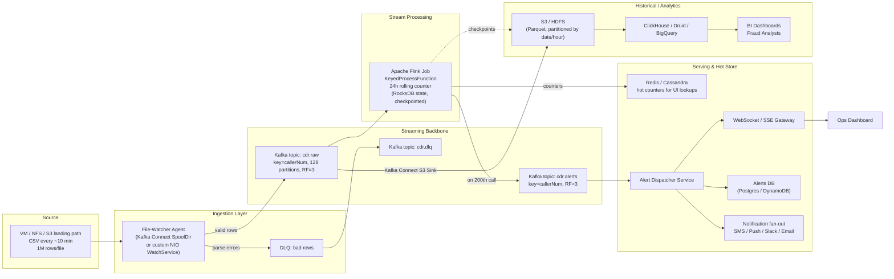
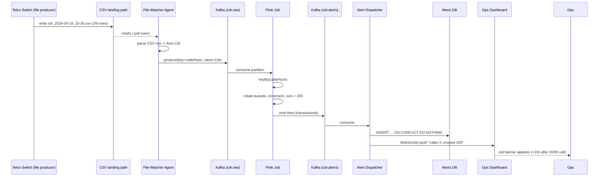

# Design a Real-Time Telecom CDR Spike / Fraud-Detection System

> **Difficulty:** Hard &nbsp;|&nbsp; **Frequency:** ★★★☆☆ &nbsp;|&nbsp; **Companies:** Airtel, Jio, Vodafone, AT&T, Verizon, Nokia, Ericsson, Amazon (Connect), Twilio
>
> **Real-world analogues:** Robocall / SIM-box fraud detection, SMS spam, Uber surge-trigger, credit-card velocity checks, DDoS detection, IoT anomaly detection.

---

## Table of Contents

1. [Problem Statement](#1-problem-statement)
2. [Clarifying Questions](#2-clarifying-questions-always-ask-these-first)
3. [Requirements](#3-requirements)
4. [Capacity Estimation](#4-capacity-estimation-back-of-the-envelope)
5. [Data Model](#5-data-model)
6. [High-Level Architecture (HLD)](#6-high-level-architecture-hld)
7. [Component Deep-Dives](#7-component-deep-dives)
8. [The Rolling 24-Hour Counter — The Heart of the System](#8-the-rolling-24-hour-counter--the-heart-of-the-system)
9. [Alert Dispatch & Dedup](#9-alert-dispatch--dedup)
10. [Storage Tiering](#10-storage-tiering)
11. [End-to-End Data Flow](#11-end-to-end-data-flow)
12. [Scaling & Fault Tolerance](#12-scaling--fault-tolerance)
13. [Edge Cases](#13-edge-cases--gotchas)
14. [Security & Compliance](#14-security--compliance)
15. [Observability](#15-observability)
16. [Technology Choices & Trade-offs](#16-technology-choices--trade-offs)
17. [Extensions](#17-extensions-what-the-interviewer-will-push-on)
18. [Interview One-Liner](#18-interview-one-liner)

---

## 1. Problem Statement

A telecom operator (Airtel / Jio / Vodafone) continuously generates **Call Detail Records (CDRs)**. Records are dropped as CSV files on a VM / NFS / blob path:

- Each CSV ≈ **1 million rows**.
- ~**1 new file every 10 minutes** → ~**1000 files/day** → ~**1 billion CDRs/day**.
- CSV columns:
  ```
  caller_num | caller_imei | called_num | called_imei |
  call_duration | call_start_time | call_end_time |
  caller_tower | called_tower | unique_id
  ```

**Goal:** Build an end-to-end system that reads files as they arrive and, the moment any `caller_num` has made **more than 200 calls in the last rolling 24 hours**, fires a real-time alert / notification for that number. Fire the alert **once, at the instant the 200th call starts** — not on every subsequent call.

---

## 2. Clarifying Questions (always ask these first)

Asking these earns points with any interviewer:

1. **What is "last 24 hours"?** Rolling window by `call_start_time`, or calendar-day count reset at midnight? → *Rolling.*
2. **One alert or alert-per-call after the threshold?** → *One-shot latch until the count drops back under 200.*
3. **What is the end-to-end latency budget?** Seconds? Minutes? → *Seconds.*
4. **Can CSV files arrive out of order / be replayed / be retried?** → *Yes; assume at-least-once upstream.*
5. **Is `unique_id` globally unique and monotonic?** → *Globally unique, not monotonic.*
6. **How are files produced?** Append-only, or written fully then moved (atomic rename)? → *Written then renamed* — this matters for the file watcher.
7. **Is the 200 threshold per number, per IMEI, or per SIM?** → *Per `caller_num` for this spec; extension for IMEI later.*
8. **Who receives the alert?** Ops dashboard? End user (the caller)? Fraud team? → *Dashboard + fraud team; user optional.*
9. **Can we change the upstream (switches) to push to Kafka directly?** → *No, legacy — we must consume files.*
10. **Retention requirements?** → *7 days hot, 7 years cold for billing/regulatory.*

---

## 3. Requirements

### 3.1 Functional

- **F1.** Watch a path; as each CSV file lands, ingest every row into the pipeline.
- **F2.** For every `caller_num`, maintain a **rolling 24-hour count** of call starts.
- **F3.** The instant that count first crosses **200**, emit an alert containing:
  `caller_num`, `triggering_unique_id`, `triggering_start_time`, `current_count`, `window_start`, `window_end`.
- **F4.** Do **not** re-alert on calls 201, 202, … for the same number within the same elevated window.
- **F5.** Push alerts to an ops dashboard in near real-time, plus persist them for audit.
- **F6.** Support replay / backfill from any historic file without producing duplicate alerts.
- **F7.** Allow ad-hoc lookup: "how many calls has number X made in the last 24h?".
- **F8.** Retain raw CDRs for analytics and regulatory audit.

### 3.2 Non-Functional

| Attribute          | Target                                                               |
|--------------------|----------------------------------------------------------------------|
| Throughput         | Sustain ~50K CDRs/sec peak (≈4× average)                             |
| End-to-end latency | < 10 s from file landing → alert visible on dashboard (p95)          |
| Durability         | No data loss after ack (RF=3 in Kafka + checkpointed stream state)   |
| Consistency        | Exactly-once alerts (idempotent by `(caller_num, window_start_hour)`)|
| Availability       | 99.95% for ingestion + alerting                                      |
| Scalability        | Horizontally scalable at every layer                                 |
| Replayability      | Re-process any past day without duplicate alerts                     |
| Security           | PII (phone, IMEI) encrypted at rest, tokenized in analytics lake     |

---

## 4. Capacity Estimation (back of the envelope)

| Metric                          | Calculation                                      | Value                |
|---------------------------------|--------------------------------------------------|----------------------|
| Events/day                      | 1000 files × 1M rows                             | **1 × 10⁹ /day**     |
| Avg events/sec                  | 1e9 / 86400                                      | ~**11.6K /s**        |
| Peak events/sec (4× burst)      | 11.6K × 4                                        | ~**46K /s**          |
| Avg record size (CSV → Avro)    | ~150 B compressed                                | 150 B                |
| Daily raw volume                | 1e9 × 200 B                                      | ~**200 GB/day**      |
| Yearly raw volume               | 200 GB × 365                                     | ~**73 TB/year**      |
| Active callers in any 24h       | ~10⁸ (large telco)                               | 100M                 |
| State per active caller         | int[24] (96 B) + meta (~40 B)                    | ~140 B               |
| **Rolling-counter state total** | 100M × 140 B                                     | **~14 GB** (distributed RocksDB) |
| Kafka partitions for `cdr.raw` | peak / 1K per partition sustainable              | **~64–128**          |
| Flink TaskManager slots         | ~64 with 4 slots each                            | ~256 slots           |

Nothing scary — the design is entirely feasible on a modest cluster (~20–30 nodes).

---

## 5. Data Model

### 5.1 Canonical CDR (Avro / Protobuf on the wire)

```
Cdr {
  string  callerNum          // E.164, e.g. +919812345678
  string  callerImei
  string  calledNum
  string  calledImei
  long    callStartTimeMs    // epoch ms  -- event time
  long    callEndTimeMs      // epoch ms
  int     callDurationSec
  string  callerTower
  string  calledTower
  string  uniqueId           // idempotency key
  string  sourceFile         // filename (for lineage)
  long    sourceOffset       // byte/line offset in file
}
```

### 5.2 Per-key state (in Flink RocksDB)

```
CallerState {
  int[24] buckets            // hourly counters, ring-buffered by hour-of-epoch
  long    headHourEpoch      // floor(lastSeenStartTime / 1h)
  int     total              // cached sum(buckets)
  boolean alertedInWindow    // one-shot latch
  long    lastActivityMs     // for TTL/cleanup
}
```

### 5.3 Alert record

```
Alert {
  string  callerNum
  string  triggeringUniqueId
  long    triggeringStartTimeMs
  int     count              // will be 200 at emit time
  long    windowStartMs      // triggeringStartTimeMs - 24h
  long    windowEndMs        // triggeringStartTimeMs
  long    emittedAtMs
}
```

---

## 6. High-Level Architecture (HLD)

### 6.1 Overview diagram (Mermaid)



### 6.2 Layered view (ASCII, for quick whiteboard sketch)

```
┌─────────────────────────────────────────────────────────────────────────────┐
│                   TELECOM REAL-TIME CDR SPIKE DETECTION                     │
│                                                                             │
│   [VM / NFS / S3  CSV drop path]                                            │
│             │ 1k files/day × 1M rows                                        │
│             ▼                                                               │
│   ┌────────────────────┐   bad rows   ┌──────────┐                          │
│   │  File Watcher +    │─────────────►│   DLQ    │                          │
│   │  CSV Parser        │              └──────────┘                          │
│   │  (Kafka Connect    │                                                    │
│   │   SpoolDir)        │                                                    │
│   └──────────┬─────────┘                                                    │
│              │ key = callerNum                                              │
│              ▼                                                              │
│   ┌─────────────────────────┐                                               │
│   │  Kafka: cdr.raw         │  (128 partitions, RF=3, 7-day retention)     │
│   └──────────┬──────────────┘                                               │
│              │                                                              │
│     ┌────────┴──────────┐                                                   │
│     ▼                   ▼                                                   │
│  ┌──────────────┐    ┌─────────────────────────┐                            │
│  │ S3 Sink      │    │  Flink Streaming Job    │                            │
│  │ (Parquet →   │    │  keyBy(callerNum)       │                            │
│  │  data lake)  │    │  24-bucket rolling ctr  │                            │
│  └──────┬───────┘    │  RocksDB + checkpoints  │                            │
│         │            └──────────┬──────────────┘                            │
│         │                       │ on 200th call                             │
│         │                       ▼                                           │
│         │            ┌─────────────────────────┐                            │
│         │            │  Kafka: cdr.alerts      │                            │
│         │            └──────────┬──────────────┘                            │
│         │                       │                                           │
│         │                       ▼                                           │
│         │            ┌─────────────────────────┐                            │
│         │            │  Alert Dispatcher       │                            │
│         │            │  (persist + fan-out)    │                            │
│         │            └──┬──────────┬────────┬──┘                            │
│         │               ▼          ▼        ▼                               │
│         │        ┌──────────┐ ┌────────┐ ┌────────┐                         │
│         │        │ AlertsDB │ │ WS→UI  │ │ SMS/FCM │                        │
│         │        └──────────┘ └────────┘ └────────┘                         │
│         ▼                                                                   │
│   ┌──────────────┐                                                          │
│   │  ClickHouse  │────► BI / Fraud Analyst dashboards                       │
│   └──────────────┘                                                          │
└─────────────────────────────────────────────────────────────────────────────┘
```

---

## 7. Component Deep-Dives

### 7.1 File-Watcher / Ingest Agent

Options, in order of preference:

1. **Kafka Connect SpoolDir source connector** *(recommended)*
   - Tails a directory, processes files one at a time, tracks `(filename, offset)` in Kafka Connect's internal offset topic → **exactly-once** on retry/restart.
   - Moves finished files to `finished/` (or deletes) so the same file is never re-ingested.
   - Pluggable CSV parser, schema validation via Avro/Confluent Schema Registry.
   - Scales horizontally with Connect workers + rebalancing.

2. **Filebeat / Fluentd** — simpler, but weaker exactly-once + no native CSV-to-Avro.

3. **Custom Java agent** using `java.nio.file.WatchService` + `KafkaProducer`.
   - Needed only if Connect can't see the VM path. Then you still want:
     - Per-file offset checkpoint in ZooKeeper / a local SQLite.
     - Leader election across instances (Curator / ZK lock) so each file is claimed by exactly one worker.
     - Atomic file detection: only process files **after** they appear as `*.csv` (not `*.csv.tmp`) — upstream must write-then-rename.

Ingest agent duties:

- Parse CSV row → canonical Avro `Cdr` record.
- Validate: required fields present, `callStartTimeMs` reasonable (not in the far future/past), `uniqueId` non-empty.
- Enrich with `sourceFile`, `sourceOffset` for lineage.
- Route to **`cdr.raw`** (good rows) or **`cdr.dlq`** (bad rows, with reason).
- **Key = `callerNum`** → hashed to a partition → all events for the same caller land in the same partition → ordered, local state, easy dedup.

### 7.2 Kafka (streaming backbone)

- Topic **`cdr.raw`**: 128 partitions, RF=3, `min.insync.replicas=2`, `acks=all`, 7-day retention, lz4 compression.
- Topic **`cdr.alerts`**: 16 partitions, RF=3, 30-day retention (alerts are rare, we keep them).
- Topic **`cdr.dlq`**: small, RF=3, 30-day retention.
- Why Kafka?
  - Decouples ingest from compute; either side can scale/restart independently.
  - 7-day retention = free replay for backfills, bug fixes, and A/B testing new thresholds.
  - Ordered within partition ⇒ deterministic per-caller processing.

### 7.3 Stream Processor (Apache Flink)

Why **Flink** over alternatives:

| Engine                     | Latency     | Stateful ops       | Event time + watermarks | Exactly-once sink | Verdict |
|---------------------------|-------------|--------------------|------------------------|-------------------|---------|
| **Apache Flink**          | ms          | First-class (RocksDB) | Best-in-class          | Yes (2PC)         | **Pick** |
| Kafka Streams             | ms          | Good               | OK                     | Yes               | OK if you want fewer moving parts |
| Spark Structured Streaming| ~second(s)  | OK                 | OK                     | Yes               | Too high-latency for "instant" alert |
| ksqlDB                    | ms          | Limited            | OK                     | Yes               | Expressive enough for counters but less flexible at scale |

Flink topology:

```
 source( Kafka cdr.raw )
     │
     ├─► deserialize & assign event-time watermarks (BoundedOutOfOrderness 5min)
     │
     ├─► keyBy( callerNum )                     // partitions state locally
     │
     ├─► process( RollingCounter24hFunction )   // KeyedProcessFunction
     │        ├─ reads/writes RocksDB keyed state
     │        ├─ schedules event-time TTL timer (25h)
     │        └─ side-output: late events
     │
     ├─► filter( isAlert )                      // count first hit 200
     │
     └─► sink( Kafka cdr.alerts, transactional producer )
```

### 7.4 Serving layer

- **Redis / Cassandra** mirror of `(callerNum, 24h_count, last_seen)` so the UI can answer "how many calls has X made?" without querying Flink.
  - Flink writes counters on every update (cheap: ~50K writes/sec, batched).
  - Use Redis hash `cdr:count:{callerNum}` with TTL 26h.
- **Alert Dispatcher Service** (stateless microservice):
  - Consumes `cdr.alerts`.
  - Inserts into `alerts` table (idempotent key = `(caller_num, window_start_hour)`).
  - Publishes to WebSocket gateway → Ops dashboard gets a red banner.
  - Sends to Notification Fan-out (SMS to fraud team, Slack webhook, etc.) with its own retry/DLQ.

---

## 8. The Rolling 24-Hour Counter — The Heart of the System

This is the question the interviewer really cares about. Three reasonable designs:

### 8.1 Design A — Naïve sliding-window operator *(don't pick this)*

```
Flink SlidingEventTimeWindows.of(24h, 1s)
```

Every event is copied into **24×3600 = 86,400 window panes**. RAM and CPU explode. **Reject.**

### 8.2 Design B — Per-key sorted list of timestamps

Keep `TreeSet<Long>` of `callStartTime` per caller. On each event: insert; evict everything < `now - 24h`; `size()`.

- Accurate to the millisecond.
- Memory: 200 entries × 8 B ≈ 1.6 KB/caller × 100M callers ≈ **160 GB**. Tight.
- Eviction walks many entries per event ⇒ higher CPU.
- Use **only if** "exact to the millisecond" is required.

### 8.3 Design C — Bucketed hourly counter *(recommended)*

Keep **24 integer buckets**, one per hour. Each bucket covers `[h, h+1)` of epoch hours.

```
state.buckets:  [ h-23 | h-22 | ... | h-1 | h ]   // ring buffer
                                                 ^
                                             current hour
```

**Per-event work (O(1)):**

```java
public void processElement(Cdr e, Context ctx, Collector<Alert> out) throws Exception {
    CallerState s = state.value();
    long hour = e.callStartTimeMs / 3_600_000L;

    if (s == null) { s = new CallerState(hour); }

    // Advance ring by however many hours have passed since we last saw this caller.
    long delta = hour - s.headHourEpoch;
    if (delta > 0) {
        delta = Math.min(delta, 24);              // more than 24h gap => clear
        for (int i = 0; i < delta; i++) {
            int idx = (int) Math.floorMod(s.headHourEpoch + 1 + i, 24);
            s.total -= s.buckets[idx];
            s.buckets[idx] = 0;
        }
        s.headHourEpoch = hour;
        if (s.total < 200) s.alertedInWindow = false;   // reset latch
    }

    // Increment current bucket.
    int idx = (int) Math.floorMod(hour, 24);
    s.buckets[idx]++;
    s.total++;

    // Detect first crossing of 200.
    if (s.total >= 200 && !s.alertedInWindow) {
        out.collect(new Alert(e.callerNum, e.uniqueId, e.callStartTimeMs,
                              s.total, e.callStartTimeMs - 24*3600_000L, e.callStartTimeMs,
                              System.currentTimeMillis()));
        s.alertedInWindow = true;
    }

    s.lastActivityMs = System.currentTimeMillis();
    state.update(s);

    // TTL: clean up state if this caller is silent for 25h.
    ctx.timerService().registerEventTimeTimer(e.callStartTimeMs + 25L*3600_000L);
}

@Override
public void onTimer(long ts, OnTimerContext ctx, Collector<Alert> out) throws Exception {
    CallerState s = state.value();
    if (s != null && s.lastActivityMs + 25L*3600_000L <= ts) state.clear();
}
```

**Why this is the right call:**

| Property                  | Value                                                        |
|---------------------------|--------------------------------------------------------------|
| Time complexity / event   | O(1) (at most 24 bucket clears)                              |
| Memory / key              | ~140 B (24 × 4 B + meta)                                     |
| Worst-case error          | ± 1 hour on the exact 24h boundary (acceptable for fraud)    |
| RocksDB friendliness      | Small fixed-size value → cheap put/get                       |
| Replayable                | Pure function of events in event-time order                  |

If the business ever tightens precision to "24h to the second", switch to **1-minute buckets (1440 of them)** — still only ~6 KB/caller, still O(1).

### 8.4 One-shot alert latch

The latch `alertedInWindow` is what turns "count crosses 200" into "alert once". Reset rules:

- Reset to `false` after any bucket rotation that pushes `total` back under 200.
- Do **not** reset inside the same elevated window — otherwise calls 201, 202 … would re-fire.

### 8.5 Watermarks & late events

- Assign watermarks with `forBoundedOutOfOrderness(Duration.ofMinutes(5))` — tolerates up to 5 min reordering.
- Anything later than 5 min goes to a **side output** → batch-reconciliation job updates offline aggregates (analysts see corrected numbers in ClickHouse). We intentionally do **not** re-fire real-time alerts on late data; that would be noise.

---

## 9. Alert Dispatch & Dedup

### 9.1 Exactly-once end-to-end

Three layers of protection stack up:

1. **Ingest offsets:** Kafka Connect SpoolDir checkpoints `(file, offset)` ⇒ no duplicate row on file-agent restart.
2. **Flink two-phase commit sink** to Kafka `cdr.alerts` ⇒ no duplicate alert on Flink restart.
3. **Alert Dispatcher idempotency:** insert into `alerts` table with `PRIMARY KEY (caller_num, window_start_hour)` ⇒ even if Kafka delivers twice, DB insert is idempotent (`ON CONFLICT DO NOTHING`).

### 9.2 Fan-out diagram

```
cdr.alerts ──► Alert Dispatcher (k8s deploy, N replicas)
                  │
                  ├─► Postgres  INSERT ... ON CONFLICT DO NOTHING
                  │     key = (caller_num, window_start_hour)
                  │
                  ├─► WebSocket Gateway  ──► Ops Dashboard (live)
                  │
                  ├─► SMS Gateway / FCM / Slack / Email
                  │     (each with its own retry + DLQ)
                  │
                  └─► Metrics (Prometheus)   alert_count, alert_latency_ms
```

### 9.3 Notification suppression

- Within-window: the latch handles it.
- Across repeated windows (user keeps spiking every day): optional **cool-down** of N hours configurable per tenant.

---

## 10. Storage Tiering

| Tier     | Store                  | Purpose                                 | Retention |
|----------|------------------------|-----------------------------------------|-----------|
| Ingest   | Kafka `cdr.raw`        | Replay, decoupling                      | 7 days    |
| Hot      | Redis                  | Live counters for UI "last 24h" queries | 26 h (TTL)|
| Warm     | Cassandra or DynamoDB  | Per-caller recent activity + alerts     | 90 days   |
| Cold     | S3 Parquet (via Connect)| Historical raw CDRs                    | 7 years (regulatory) |
| Analytics| ClickHouse / Druid     | Fraud analyst queries, dashboards       | 1 year    |
| Alerts   | Postgres / DynamoDB    | Canonical alerts log (source of truth)  | 7 years   |

Parquet files in S3 are **partitioned by `date=YYYY-MM-DD/hour=HH`**, enabling efficient analytics (`WHERE date = '2026-04-19'` becomes a directory scan).

---

## 11. End-to-End Data Flow

### 11.1 Happy path for one CDR



### 11.2 Failure scenarios

| Failure                    | Detection                       | Recovery                                                                |
|----------------------------|---------------------------------|-------------------------------------------------------------------------|
| File agent crashes         | Health check / lag alarm        | Connect rebalance; resumes from last committed file offset              |
| Kafka broker dies          | ISR shrink metric               | Other replicas serve reads; leader election; no data loss (RF=3)         |
| Flink TaskManager crashes  | Checkpoint failure metric       | Flink restores last checkpoint from S3; reprocesses from Kafka offsets  |
| Alert Dispatcher crashes   | Consumer lag alarm              | New pod picks up; DB insert is idempotent                               |
| Bad CSV row                | Parse exception                 | Row → `cdr.dlq` with reason; good rows keep flowing                     |
| Clock skew on producer     | Watermark lag metric            | Side-output for late events; batch fixup                                |
| Duplicate file upload      | Connect offsets say "done"      | Skipped; or if forced, dedup via `unique_id` Bloom filter               |

---

## 12. Scaling & Fault Tolerance

### 12.1 Horizontal scaling levers

- **Kafka partitions** — raise from 128 → 256 to double parallelism; rebalances in minutes. Use enough from day one (re-keying later is painful).
- **Flink parallelism** == partitions of `cdr.raw`. Keyed state is automatically shuffled on rescale.
- **Ingest agents** — add more Connect workers; rebalance handles file-claim election.
- **Alert dispatchers** — stateless pods behind a consumer group; scale on lag.

### 12.2 Hot-key mitigation

A robocaller generating 200 calls/day is **trivial** for one partition. But a misbehaving aggregator (e.g., a call-center group-dial) could produce 10⁵ calls/min:

- Two-stage keying: `keyBy(callerNum, shard=hash(uniqueId)%4)` → local pre-aggregate → `keyBy(callerNum)` global aggregate. Classic *skewed-key* pattern.

### 12.3 Exactly-once summary

```
Kafka Connect (file offsets)
   ⇣
Kafka cdr.raw  ── consumer offsets committed by Flink ─┐
                                                       ▼
                                        Flink checkpoint (RocksDB snapshot in S3)
                                                       ▼
                              Flink transactional Kafka producer (2PC) ──► cdr.alerts
                                                       ▼
                              Alert Dispatcher: idempotent INSERT by (caller_num, hour)
```

### 12.4 Disaster recovery

- Multi-AZ Kafka cluster; one AZ loss is transparent.
- Cross-region MirrorMaker 2 to a warm standby region for `cdr.raw` and `cdr.alerts`.
- Flink job can be started in DR region from last S3 checkpoint + Kafka offsets.

---

## 13. Edge Cases / Gotchas

1. **Rolling vs calendar day** — if the spec said "calls today", reset buckets at midnight; we'd use a single daily counter instead. Clarify up front.
2. **Late-arriving files (a CSV from 2 hours ago)** — event-time keys make this correct; watermark handles staleness.
3. **Out-of-order rows within a file** — event-time keys; no issue.
4. **Clock drift between switches** — enforce `callStartTimeMs` in a sane range; drop or quarantine otherwise.
5. **Caller using multiple SIMs / porting numbers** — number ≠ identity. Run a parallel job keyed by `caller_imei` to catch device-level spikes.
6. **SIM-box fraud (single device, many numbers)** — aggregate by `caller_imei` or `caller_tower` + time → different alert stream.
7. **Leap seconds / DST** — we use UTC epoch ms; no DST issues.
8. **Threshold tuning** — 200 is arbitrary; expose it as a per-tenant config reloaded via a Kafka config topic so fraud analysts can tweak without redeploy.
9. **Alert fatigue** — add a cool-down per `caller_num` (e.g., don't alert again for 24h after last alert). Drives which latch you use.
10. **Back-pressure on bursts** — Kafka absorbs bursts; Flink will lag but not lose data; SLOs should be stated as p95, not max.
11. **GDPR "right to be forgotten"** — support a tombstone topic `cdr.forget` that Flink consumes to purge per-caller state, plus periodic re-ingestion with redacted rows in the lake.
12. **Replay / backfill without re-alerting** — replay into a **separate Kafka topic** (`cdr.raw.backfill`) consumed by a parallel Flink job writing to `cdr.alerts.backfill`; do NOT publish to the real alert topic.
13. **Bootstrap / cold start** — when Flink starts for the first time, the rolling counter for every caller is 0. For correctness, the first 24 h of operation under-reports — acceptable, or seed state from batch (last 24h) on launch.
14. **Counting semantics** — spec says "count calls started in last 24h". We key on `callStartTimeMs`. If instead we wanted "active calls right now", we'd track `(start, end)` intervals — different problem.

---

## 14. Security & Compliance

- Phone numbers and IMEIs are **PII**. Encrypt at rest (KMS-managed keys on Kafka, RocksDB, S3, Postgres).
- Tokenize in the analytics lake: replace `caller_num` with a stable hash salted per tenant for analyst queries; keep the reverse map in a restricted KMS-protected store.
- TLS everywhere on the wire (mTLS between services).
- RBAC on alert dashboards: only fraud team can see raw numbers; ops sees only last-4 digits.
- Full audit trail: who saw which alert, when.
- Regulatory retention: 7 years on raw CDRs in S3 with Object Lock.

---

## 15. Observability

Every box in the diagram emits:

- **Prometheus metrics:**
  - `cdr_ingest_rows_total`, `cdr_ingest_bytes_total`, `cdr_ingest_parse_errors_total`
  - `kafka_consumer_lag{topic,partition}`
  - `flink_checkpoint_duration_ms`, `flink_last_checkpoint_size_bytes`
  - `flink_rocksdb_state_size_bytes`
  - `cdr_alerts_emitted_total`, `cdr_alert_latency_ms_bucket` (histogram of `emittedAt - triggeringStartTime`)
  - `alert_dispatch_failures_total` per channel
- **Dashboards (Grafana):** ingestion rate, lag, state size, alert rate, dispatch latency.
- **Tracing:** OpenTelemetry trace carried from file-line-id → produce → Flink → alert dispatch → notification.
- **Runbook alarms:**
  - Ingest lag > 5 min
  - Consumer lag on `cdr.raw` > 1M messages
  - Flink checkpoint failing 3 in a row
  - Alert dispatch success rate < 99% over 5 min

---

## 16. Technology Choices & Trade-offs

### 16.1 Stream engine

| Option             | Pros                                  | Cons                                   | Verdict |
|--------------------|---------------------------------------|----------------------------------------|---------|
| **Flink**          | Low latency, rich state, EOS          | Operational complexity (JobManager HA) | **Chosen** |
| Kafka Streams      | No separate cluster                   | JVM co-located with app; rebalances    | Good alt if team is Kafka-first |
| Spark Structured   | Unified batch+stream, SQL             | Micro-batch → seconds of latency       | Reject for "instant" alerts |
| ksqlDB             | SQL, easy                             | Less flexible, scaling ceiling         | Reject |

### 16.2 State backend

- **RocksDB** (chosen): spills to disk, incremental checkpoints, handles 100M keys easily.
- **Heap state**: faster but caps at RAM; at 14 GB we could fit, but loses durability.

### 16.3 Ingest

- **Kafka Connect SpoolDir**: native offset tracking, schema validation, scale-out, exactly-once.
- **Custom watcher**: only if Connect can't reach the VM (e.g., air-gapped).

### 16.4 Alert storage

- **Postgres** for canonical alerts (low QPS, transactional, easy joins).
- **DynamoDB** if you want multi-region active-active and single-digit-ms writes at high scale.

### 16.5 "Why not just query a database every minute?"

Running `SELECT caller_num, COUNT(*) FROM cdr WHERE start_time > now()-24h GROUP BY caller_num HAVING COUNT(*) >= 200` every minute over a billion rows is:

- **Expensive** — full scan per minute.
- **Laggy** — up to a minute late, violates "instant" alert.
- **Redundant** — recomputes 99.999% of keys that haven't moved.

Keyed streaming state is **O(1) per event** and **zero work for idle keys**. Always win.

---

## 17. Extensions (what the interviewer will push on)

1. **Multiple thresholds / rules** — extend to "200 calls OR 120 min total duration OR 50 distinct called numbers" in 24h. Same counter pattern, just more fields in state.
2. **ML-based anomaly detection** — publish features (hourly call counts, tower diversity, IMEI-to-num ratio) to a feature store, score with an online model, alert on anomaly score. Same backbone.
3. **Geographic anomalies** — add `caller_tower` → detect impossible travel (Delhi tower to Chennai tower in 5 minutes).
4. **Downstream blocking** — alerts feed a separate system that auto-blocks the SIM after human approval (two-phase: alert → analyst → block API).
5. **Multi-tenancy** — several telco brands share the pipeline; tenant-id is a field, partitions are keyed by `(tenant, callerNum)`.
6. **SLA tightening** — move from CSV drop to direct Kafka push from the switch → shaves 10 minutes.
7. **Cost controls** — tier older Kafka data to S3 via tiered storage (Confluent / Aiven); auto-shrink Flink parallelism during off-peak.

---

## 18. Interview One-Liner

> **"Land each CSV into Kafka via a Kafka Connect SpoolDir source keyed by caller number; run a Flink `KeyedProcessFunction` that keeps a 24-slot hourly ring buffer per caller in RocksDB state; emit a one-shot alert to a `cdr.alerts` Kafka topic the first time the rolling sum hits 200; fan that alert out to a dashboard (WebSocket), an alerts DB (idempotent by caller + window-hour), and notification channels — with Parquet in S3 and ClickHouse on the side for history and analytics. Exactly-once is guaranteed by Connect file offsets + Flink 2PC sink + idempotent DB writes."**

---

## Appendix A — Key Interview Talking Points

1. **Treat files as a stream** — the fact that the source is CSV files, not Kafka directly, is an implementation detail solved by Connect SpoolDir. Everything downstream is pure streaming.
2. **Event time, not processing time** — the 24h window is defined on `callStartTime`; this makes replay and out-of-order files correct.
3. **Key-partitioning by `callerNum`** is the single most important decision; it gives ordering, locality, and O(1) state updates.
4. **Bucketed counter** is the right data structure — not a sliding-window operator, not a sorted set of timestamps.
5. **One-shot alert latch** is how you turn a threshold crossing into a single notification.
6. **Exactly-once is a stack, not a toggle** — ingest offsets + Flink 2PC + idempotent sink; name all three.
7. **State size math** — show you can count: 100M keys × 140 B = 14 GB distributed. Feasible.
8. **Trade-offs voiced out loud** — bucketed vs. sorted-set, Flink vs. Spark, Kafka Connect vs. custom agent. Interviewers love explicit trade-offs.

---

## Appendix B — Pseudocode for the Flink Function (compact)

```java
public class RollingCounter24h extends KeyedProcessFunction<String, Cdr, Alert> {

    private transient ValueState<CallerState> state;

    @Override
    public void open(Configuration cfg) {
        state = getRuntimeContext().getState(
            new ValueStateDescriptor<>("callerState", CallerState.class));
    }

    @Override
    public void processElement(Cdr e, Context ctx, Collector<Alert> out) throws Exception {
        long hour = e.callStartTimeMs / 3_600_000L;
        CallerState s = state.value();
        if (s == null) s = new CallerState(hour);

        long delta = hour - s.headHourEpoch;
        if (delta > 0) {
            long toClear = Math.min(delta, 24);
            for (int i = 1; i <= toClear; i++) {
                int idx = (int) Math.floorMod(s.headHourEpoch + i, 24);
                s.total -= s.buckets[idx];
                s.buckets[idx] = 0;
            }
            s.headHourEpoch = hour;
            if (s.total < 200) s.alertedInWindow = false;
        }

        int curIdx = (int) Math.floorMod(hour, 24);
        s.buckets[curIdx]++;
        s.total++;

        if (s.total >= 200 && !s.alertedInWindow) {
            out.collect(new Alert(
                e.callerNum, e.uniqueId, e.callStartTimeMs,
                s.total,
                e.callStartTimeMs - 24L * 3600_000L,
                e.callStartTimeMs,
                System.currentTimeMillis()));
            s.alertedInWindow = true;
        }

        s.lastActivityMs = ctx.timerService().currentProcessingTime();
        state.update(s);
        ctx.timerService().registerEventTimeTimer(e.callStartTimeMs + 25L * 3600_000L);
    }

    @Override
    public void onTimer(long ts, OnTimerContext ctx, Collector<Alert> out) throws Exception {
        CallerState s = state.value();
        if (s != null && s.lastActivityMs + 25L * 3600_000L <= ts) {
            state.clear();
        }
    }

    public static class CallerState {
        public int[] buckets = new int[24];
        public long headHourEpoch;
        public int total;
        public boolean alertedInWindow;
        public long lastActivityMs;
        public CallerState() {}
        public CallerState(long h) { this.headHourEpoch = h; }
    }
}
```
