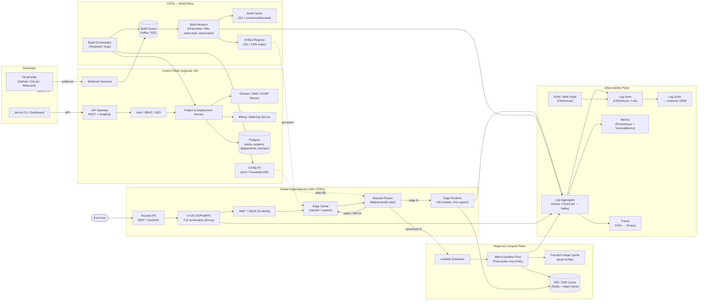
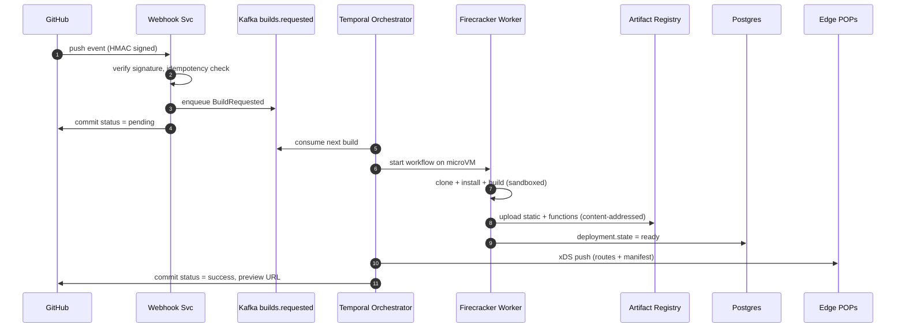
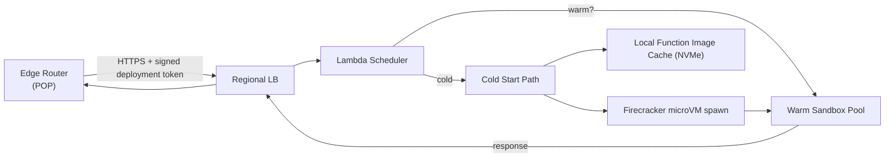
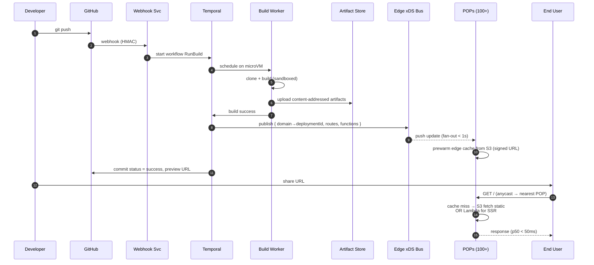

# Design Vercel — A Frontend Cloud / Serverless Deployment Platform

> **Difficulty:** Hard &nbsp;|&nbsp; **Frequency:** ★★★★☆ &nbsp;|&nbsp; **Companies:** Vercel, Netlify, Cloudflare Pages, AWS Amplify, Render, Fly.io, Railway, Heroku, GitHub (Actions + Pages), GitLab
>
> **Real-world analogues:** Netlify, Cloudflare Pages / Workers, AWS Amplify + Lambda@Edge + CloudFront, GCP Firebase Hosting + Cloud Functions, Fly.io, Render.
>
> **Categories it spans (from [README.md](README.md)):**
> - **15. Infrastructure / Platform Services** — multi-tenant isolation, quotas, SDK design.
> - **14. Scheduling / Workflow / Orchestration** — CI/CD build pipelines, durable execution.
> - **2. Storage & Caching Primitives** — CDN / edge cache design.
> - **10. Media / Large-Object Storage & Delivery** — build artifacts, static assets.
> - **3. Rate Limiting & Quotas** — per-team / per-project quotas.
> - **7. Streaming Analytics** — log ingestion, web-vitals, request analytics.

---

## Table of Contents

1. [Problem Statement](#1-problem-statement)
2. [Clarifying Questions](#2-clarifying-questions)
3. [Requirements](#3-requirements)
4. [Capacity Estimation](#4-capacity-estimation)
5. [High-Level Architecture](#5-high-level-architecture)
6. [Data Model](#6-data-model)
7. [Subsystem Deep-Dives](#7-subsystem-deep-dives)
    - [7.1 Git Integration & Webhooks](#71-git-integration--webhooks)
    - [7.2 CI/CD — Build Pipeline](#72-cicd--build-pipeline)
    - [7.3 Artifact Store](#73-artifact-store)
    - [7.4 CDN / Edge Network](#74-cdn--edge-network)
    - [7.5 Serverless Functions (Lambdas)](#75-serverless-functions-lambdas)
    - [7.6 Edge Functions / Middleware](#76-edge-functions--middleware)
    - [7.7 Hosting & Routing (Static + ISR + SSR)](#77-hosting--routing-static--isr--ssr)
    - [7.8 Domain, DNS & TLS](#78-domain-dns--tls)
    - [7.9 Preview Deployments & Instant Rollback](#79-preview-deployments--instant-rollback)
    - [7.10 Image & Asset Optimization](#710-image--asset-optimization)
    - [7.11 Observability & Analytics](#711-observability--analytics)
    - [7.12 Control Plane (Dashboard, API, Auth, Billing)](#712-control-plane-dashboard-api-auth-billing)
8. [End-to-End Flows](#8-end-to-end-flows)
9. [Scaling & Fault Tolerance](#9-scaling--fault-tolerance)
10. [Multi-Tenancy, Security & Isolation](#10-multi-tenancy-security--isolation)
11. [Edge Cases & Gotchas](#11-edge-cases--gotchas)
12. [Technology Choices & Trade-offs](#12-technology-choices--trade-offs)
13. [Extensions](#13-extensions)
14. [Interview One-Liner](#14-interview-one-liner)
15. [Appendix — Lucidchart Import](#15-appendix--lucidchart-import)

---

## 1. Problem Statement

Design a **frontend cloud platform** (Vercel-like) that lets developers **git-push to deploy** a web application and serves it globally with low latency. The platform must provide:

1. **CI/CD** — automatically build any git push / PR into an immutable deployment. Sustain **10,000 concurrent builds**.
2. **Serverless Functions** — run user-written functions (API routes, SSR handlers) on request. Sustain **10,000 concurrent invocations**, **≤ 3 s max execution**, cold start budget < 500 ms p95.
3. **CDN** — serve static assets and cached SSR responses from > 100 global POPs with p50 TTFB < 50 ms.
4. **Hosting** — host static sites, SSR, ISR (incremental static regeneration), streaming responses; support custom domains + TLS.
5. **Observability** — structured logs, request metrics, build metrics, Web Vitals, tracing; accessible via UI, API, and log drains.

The platform is **multi-tenant**: thousands of teams, millions of projects, hundreds of millions of deployments over time, each strictly isolated.

### Additional responsibilities (commonly missed — you should mention these)

- **Git integration**: GitHub / GitLab / Bitbucket webhooks, OAuth app install, commit-status updates.
- **Preview deployments**: every PR/branch gets a unique `https://<hash>-<project>-<team>.vercel.app` URL.
- **Instant rollback**: one click reverts prod alias to any prior deployment with zero downtime.
- **Domains & DNS**: custom domain attach, automatic Let's Encrypt TLS, DNS management, wildcard certs.
- **Edge functions / middleware**: V8-isolate–based code that runs at the POP, not at origin.
- **Image optimization**: on-the-fly resize / format conversion (WebP/AVIF) with caching.
- **Secrets / env vars**: encrypted, scoped per deployment environment (dev/preview/prod).
- **Teams, RBAC, SSO, audit logs, billing**.
- **Abuse / DDoS / WAF** at the edge.
- **Quotas & rate limits** per plan.
- **Analytics**: Real User Monitoring (Web Vitals), request analytics, bandwidth usage.
- **Framework awareness**: detect Next.js / Nuxt / SvelteKit / Astro / Vite and configure build output automatically.

---

## 2. Clarifying Questions

1. **What is a "deployment"?** Immutable, content-addressed, URL-addressable artifact set? → Yes, keyed by `deploymentId = hash(repo, commit, buildOutput)`.
2. **What runtimes do we support for functions?** → Node 18/20, Python 3.x, Go, Ruby, plus Edge runtime (V8 isolate, Web-standard APIs).
3. **What is the max build duration and artifact size?** → 45 min build timeout, 250 MB per function (unzipped), ~100 GB total output per deployment.
4. **What is the max function execution time?** → 3 s per invocation on Hobby, configurable up to 60 s / 900 s on paid plans. Streaming responses extend this — ask.
5. **Cold-start target?** → < 500 ms p95 for Edge, < 1 s p95 for Node Lambda.
6. **Traffic model at the edge?** → Heavy read (static + cached SSR). 100 k req/s steady, 10× spike during events.
7. **Do we host our own edge or rent (Cloudflare / AWS CloudFront)?** → Assume we run our own POPs for CDN + own control plane; individual compute may burst onto cloud providers.
8. **Regions for compute?** → User picks (multi-region Lambda), default "auto-route to nearest active region".
9. **What's the consistency model for cache invalidation?** → Eventual. Deploy → purge propagates to all POPs in < 1 s (purge-by-tag).
10. **Who owns the domain certs?** → We issue via Let's Encrypt / BuyPass; support ACME DNS-01 and HTTP-01.
11. **Rollback semantics?** → Alias flip is atomic and instant (< 5 s globally).
12. **Secrets at runtime?** → Injected as env vars into the execution sandbox; encrypted at rest (KMS), never logged.
13. **Quotas?** → Per plan (Hobby: 100 GB bandwidth, 100 GB-hours compute). Enforced at edge + control plane.

---

## 3. Requirements

### 3.1 Functional

| # | Requirement |
|---|-------------|
| F1 | Connect a Git provider (GitHub/GitLab/Bitbucket); receive webhook on every push/PR. |
| F2 | Build the repo in an isolated sandbox; produce a deployment artifact. |
| F3 | Deploy artifacts globally to CDN + function runtime; assign a unique preview URL. |
| F4 | Route requests to the right origin: static asset, edge function, serverless function, SSR, or ISR cache. |
| F5 | Support custom domains with automatic TLS issuance and renewal. |
| F6 | Provide instant rollback: atomic alias flip between deployments. |
| F7 | Stream build logs and runtime logs to the dashboard in real time. |
| F8 | Enforce per-team / per-plan quotas: bandwidth, invocations, compute time. |
| F9 | Serve image optimization (resize, reformat) and adaptive caching. |
| F10 | Expose REST + GraphQL API and CLI for all dashboard operations. |
| F11 | Multi-tenant teams with RBAC (Admin / Member / Viewer), SSO, audit logs. |
| F12 | Billing metering (bandwidth, build-mins, function-GB-s). |

### 3.2 Non-Functional

| Attribute | Target |
|-----------|--------|
| CDN p50 TTFB | < 50 ms globally |
| Edge function cold start | < 50 ms p95 |
| Node Lambda cold start | < 500 ms p95 |
| Concurrent builds | ≥ 10 000 |
| Concurrent function invocations | ≥ 10 000, horizontally scalable to millions |
| Function execution max | 3 s (default), up to 900 s (paid) |
| Availability (serving) | 99.99 % |
| Availability (build / API) | 99.9 % |
| Cache-purge propagation | < 1 s globally |
| Deploy → serving | < 30 s from "build done" |
| Durability (artifacts) | 11-nines (S3-class) |
| Security | Isolated sandboxes per build/invocation, mTLS, encrypted secrets |

---

## 4. Capacity Estimation

Assume, at steady state:

| Metric | Value |
|--------|-------|
| Active teams | 1 M |
| Active projects | 5 M |
| Deployments per day | 10 M (2 per project avg) |
| Builds concurrent (peak) | 10 k |
| Avg build duration | 90 s |
| Builds per day | 10 k × 86 400 / 90 ≈ **~10 M/day** ✓ |
| Avg build CPU | 2 vCPU × 90 s = 180 vCPU-s |
| Daily build compute | 10 M × 180 = **1.8 B vCPU-s** ≈ 21 k vCPUs steady ≈ 50–100 k vCPUs peak |
| Avg artifact size | 50 MB |
| Daily artifact storage | 10 M × 50 MB = **500 TB/day write** |
| Retention (hot) | 30 days → ~15 PB hot; cold tier indefinite |
| Concurrent function invocations (peak) | 10 k (stated); scale target: 1 M |
| Avg function exec time | 150 ms |
| Function invocations / day | 1 M × 150 ms × 86 400 / 150 ms ≈ **~86 B/day** (upper bound; real ≈ 10–30 B) |
| CDN requests / sec (peak) | 500 k (10× static/SSR over functions) |
| Cached hit ratio target | > 95 % |
| Origin egress | ≤ 5 % × 500 k = 25 k req/s |
| Log volume | 1 KB/log × 50 B/day ≈ **~50 TB/day** (aggressive sampling required) |
| Number of POPs | 100 (matches Cloudflare/Fastly order of magnitude) |
| Servers per POP | ~20 (edge cache + edge-runtime) → **2000 edge machines** |

The dominant cost centers are: (a) build compute, (b) outbound bandwidth, (c) hot artifact storage, (d) log ingestion. Each gets a dedicated mitigation later.

---

## 5. High-Level Architecture

### 5.1 Overview diagram (Mermaid)



### 5.2 Layered view (ASCII, whiteboard-friendly)

```
┌──────────────────────── CONTROL PLANE (regional, HA, multi-AZ) ────────────────────────┐
│  API Gateway │ Auth/RBAC │ Project Svc │ Domain/ACME │ Billing │ Webhook Receiver       │
│                       Postgres (strong consistency)  │ etcd/FoundationDB (config)       │
└──────────────┬────────────────────────────────┬─────────────────────┬──────────────────┘
               │                                │                     │
               ▼                                ▼                     ▼
   ┌──────── BUILD PLANE ────────┐   ┌────── DATA PLANE ──────┐  ┌── OBSERVABILITY ──┐
   │ Orchestrator (Temporal)      │   │ Artifact Registry (S3) │  │ Kafka → ClickHouse │
   │ Build Queue (Kafka)          │──▶│ ISR/SSR Cache (Redis)  │  │ Prometheus / Tempo │
   │ Build Workers (Firecracker)  │   │ Function Image Store   │  │ RUM, Log drains    │
   └──────────────────────────────┘   └──────────┬─────────────┘  └────────────────────┘
                                                 │ pre-warm / purge
                                                 ▼
┌───────────────────── EDGE NETWORK (100+ POPs, Anycast) ────────────────────────────────┐
│  L4 (XDP) → TLS → WAF/DDoS → Edge Cache (Varnish) → Router → Edge Runtime (V8 isolates)│
│                                                            └─▶ Regional Lambda Plane   │
└────────────────────────────────────────────────────────────────────────────────────────┘
```

The three **planes** (control / build / data) are independent failure domains and scale independently.

---

## 6. Data Model

### 6.1 Postgres (canonical) — control plane

```sql
-- Teams & users
CREATE TABLE teams           (id UUID PK, name, plan, created_at, ...);
CREATE TABLE users           (id UUID PK, email, sso_provider, ...);
CREATE TABLE team_members    (team_id, user_id, role ENUM('admin','member','viewer'), PRIMARY KEY (team_id,user_id));

-- Projects
CREATE TABLE projects        (id UUID PK, team_id, name, git_repo_url, framework, build_cmd,
                              output_dir, env_vars_ciphertext BYTEA, root_dir, created_at);

-- Deployments (immutable)
CREATE TABLE deployments     (id UUID PK, project_id, git_commit_sha, git_ref,
                              target ENUM('preview','production'),
                              state ENUM('queued','building','ready','error','canceled'),
                              artifact_manifest_cid TEXT,   -- content hash → S3
                              created_at, built_at, size_bytes);

-- Aliases (mutable pointers to deployments — rollback = flip alias)
CREATE TABLE aliases         (domain TEXT PK, deployment_id, project_id, updated_at);

-- Domains & certs
CREATE TABLE domains         (domain TEXT PK, project_id, verified_at, cert_pem_kms_ref, renew_at);

-- Quotas & billing
CREATE TABLE usage_daily     (team_id, day DATE, bandwidth_bytes, build_seconds,
                              function_gb_seconds, invocations, PRIMARY KEY (team_id, day));
```

Why Postgres? Strong consistency matters for domain ownership, alias pointers, billing — these must not flicker.

### 6.2 KV / etcd — edge config

Fast, small, globally replicated config consumed by every POP:

```
/routes/<domain>                      → { deploymentId, projectId, teamId, routes[] }
/aliases/<projectId>/<env>            → deploymentId
/certs/<domain>                       → cert-bundle-ref (in secret store)
/quotas/<teamId>                      → { bw_bps, invocations_per_sec, ... }
/features/<teamId>                    → feature flags
```

Propagates to every POP via a **pub-sub + pull-reconcile** pattern (like Envoy xDS). p99 global fan-out < 1 s.

### 6.3 Object store — S3-compatible artifacts

```
s3://artifacts/<teamId>/<deploymentId>/manifest.json
s3://artifacts/<teamId>/<deploymentId>/static/<content-hash>.<ext>
s3://artifacts/<teamId>/<deploymentId>/functions/<name>.zip
```

**Content-addressed** storage means identical files across deployments dedupe naturally (huge savings).

### 6.4 Cache layer

| Cache | Key | Store | TTL |
|-------|-----|-------|-----|
| Edge HTTP cache | `(host, path, vary)` | Varnish / in-POP | header/surrogate-controlled |
| ISR cache | `(deploymentId, route, params)` | Redis + S3 spillover | user-declared (`revalidate: 60`) |
| Function image | `functionId` | local NVMe per compute host | LRU |
| Build cache | `teamId/projectId/cacheKey` | S3 | 14 days |
| Image-optimizer cache | `(src-hash, w, q, format)` | Varnish + S3 | 1 year, content-addressed |

---

## 7. Subsystem Deep-Dives

### 7.1 Git Integration & Webhooks

**Flow:**
1. User installs the GitHub App (or OAuth for GitLab/Bitbucket); we store the repo → project mapping.
2. Any push/PR fires a webhook → `/v1/webhooks/github`.
3. Webhook receiver **verifies HMAC signature** (GitHub's `X-Hub-Signature-256`).
4. Normalizes the event → emits a `BuildRequested` message onto Kafka (`builds.requested`).
5. Posts an initial commit status `pending` back to the git provider.

Design notes:
- **Idempotency** by `(repo, commit_sha, ref)`; a redelivered webhook does not re-trigger a build.
- **Backpressure:** the webhook receiver is stateless; Kafka absorbs spikes (e.g., monorepo with 200 PRs merged at once).
- **Security:** webhooks are the only *inbound* path from untrusted networks → receivers live in a dedicated VPC with a WAF in front.

### 7.2 CI/CD — Build Pipeline

Target: **10 000 concurrent builds, p95 queue < 5 s, 90 s median build**.

#### 7.2.1 Orchestration

Use **Temporal** (or Argo Workflows) for durable execution — builds must survive restarts, retries, and partial failures.

```
Workflow: RunBuild(deploymentId)
  ├─ clone_repo()              (retry 3x, 60s timeout)
  ├─ restore_cache()
  ├─ detect_framework()
  ├─ install_deps()
  ├─ run_build()               (user command, 45m timeout)
  ├─ collect_output()          (static + functions + manifest)
  ├─ upload_artifacts()        (content-addressed to S3)
  ├─ register_deployment()     (Postgres: state=ready)
  ├─ prewarm_edge()            (push manifest to POPs via xDS)
  └─ post_commit_status('ready', preview_url)
```

Temporal gives free retries, history, and visibility — a *huge* win over "one-shot Kubernetes Jobs".

#### 7.2.2 Build workers: **Firecracker microVMs**

| Isolation option | Startup | Density | Security | Verdict |
|------------------|---------|---------|----------|---------|
| Docker container | 100 ms | High | Shared kernel — weak for untrusted code | Reject |
| gVisor | 300 ms | High | Syscall intercept — slow | OK |
| **Firecracker microVM** | ~125 ms boot, ~1 s warm | 1000s/host | True VM isolation | **Chosen** |
| Full VM (KVM) | 10 s+ | Low | Strong | Too slow |

**Why Firecracker:** user code is arbitrary; a malicious `npm install` postinstall script cannot escape a microVM. AWS Lambda and Fly.io use this exact model.

Warm-pool of pre-booted microVMs per language/runtime → avoids 125 ms boot on the hot path. When a build finishes, the VM is **destroyed**, never reused.

#### 7.2.3 Build queue & scheduling

- **Kafka topic `builds.requested`**, keyed by `teamId` → per-team ordering (a user pushing 3 commits in a row builds in order, avoiding wasted work).
- **Scheduler** consumes with work-stealing: any free worker with matching runtime/region claims the next job.
- **Per-team concurrency limit** (e.g., 3 concurrent builds on Hobby): enforced by a Redis semaphore `build:concurrency:{teamId}` with a Lua script for atomicity. Excess builds wait.
- **Cancellation:** superseded builds (new commit on same branch) are cancelled via Temporal signal → frees slot.

#### 7.2.4 Build cache

Two caches:

1. **Dependency cache** — `node_modules`, `.next/cache`, `~/.cargo`, etc. Keyed by `hash(lockfile)`. Hit rate > 90 % → cuts build time from 90 s to 20 s.
2. **Output cache** — if `(monorepo-hash, affected-package)` matches a prior build, *skip* that package (Turborepo-style).

Both live in **S3 + local NVMe warm copy** on the worker.

#### 7.2.5 Build log streaming

Each worker writes logs to a local ring buffer; a sidecar **ships lines to Kafka `builds.logs`** keyed by `deploymentId`. Dashboard opens a **WebSocket/SSE** to a streaming service that tails the topic → user sees logs with < 200 ms latency.

#### 7.2.6 CI/CD diagram



### 7.3 Artifact Store

- Backed by **S3 / MinIO** with multi-region replication.
- **Content-addressed**: `object_key = sha256(content)`. Two deployments sharing an image pay once.
- **Manifest**: JSON describing the deployment's route table, function entrypoints, static asset map, ISR config.
- **Immutability**: once a deployment is `ready`, artifacts are never mutated → safe to cache forever at the edge.
- **Lifecycle**: hot (30 d) → infrequent access (1 y) → Glacier.
- **Access control**: signed URLs; direct customer access is disabled — all reads go through edge.

### 7.4 CDN / Edge Network

Target: **p50 TTFB < 50 ms globally, > 95 % cache hit ratio, 500 k req/s peak**.

#### 7.4.1 POP anatomy

```
                                Anycast IP
                                    │
                         ┌──────────▼──────────┐
                         │   L4 LB (XDP/eBPF)  │  — SYN cookies, DDoS blackhole
                         └──────────┬──────────┘
                                    │
                         ┌──────────▼──────────┐
                         │  TLS Terminator     │  — Envoy / quiche, HTTP/3
                         └──────────┬──────────┘
                                    │
                         ┌──────────▼──────────┐
                         │  WAF + Rate Limiter │  — OWASP rules, per-team quotas
                         └──────────┬──────────┘
                                    │
                         ┌──────────▼──────────┐
                         │    Router           │  — host→deployment lookup in xDS
                         └──────────┬──────────┘
                                    │
              ┌──────────────┬──────┴──────┬───────────────┐
              ▼              ▼             ▼               ▼
        Edge Cache     Edge Runtime   ISR lookup     Origin shield
        (Varnish)      (V8 isolates)  (Redis)        → Regional Lambda
```

#### 7.4.2 Anycast + BGP

Each POP announces the same IP prefix via BGP → internet routing brings the user to the *topologically* nearest POP. GeoDNS is a fallback hint for cases where anycast routing is suboptimal.

#### 7.4.3 Edge cache

- **Varnish / custom cache**: per-POP, RAM-first + NVMe spill, ~1 TB per node.
- **Cache key** = `(host, path, normalized query, vary-headers)`. Surrogate keys (cache tags) attached per deployment for purge.
- **Purge-by-tag** on deploy: the control plane emits a message `purge:deploymentId` via a pub-sub mesh; all POPs invalidate matching surrogate keys within ~1 s.
- **Tiered cache** (shield POP): cache misses from 5 small POPs converge on 1 regional "shield" POP before hitting origin → protects origin from dogpile.
- **Stale-while-revalidate** and **stale-if-error** are respected — returning stale content during origin hiccups is critical for 99.99 % serving availability.

#### 7.4.4 Cache semantics

Follow HTTP semantics strictly, plus custom surrogate controls:

| Header | Meaning |
|--------|---------|
| `Cache-Control: public, max-age=0` | Browser not cached |
| `CDN-Cache-Control: max-age=31536000` | Edge cache 1 year |
| `Vercel-CDN-Cache-Control` | Our tier |
| `x-vercel-cache` | `HIT` / `MISS` / `STALE` / `REVALIDATED` |

### 7.5 Serverless Functions (Lambdas)

Target: **10 000 concurrent invocations, 3 s max, < 500 ms cold start p95, scales to millions**.

#### 7.5.1 Architecture



#### 7.5.2 Execution sandbox

- Each invocation runs in a **Firecracker microVM** (for Node / Python / Go).
- **Snapshotting (Firecracker snapshot + restore):** we pre-boot a VM, load the function image, then snapshot memory+CPU state. Cold start = "restore snapshot + swap in code" ≈ 50–150 ms vs. a from-scratch boot of 500 ms.
- **Reuse:** after the invocation returns, the VM is kept warm for ~5 min; subsequent invocations skip cold start.
- **Concurrency 1 per VM** (per Lambda semantics) — simpler isolation; the scheduler spins up N VMs for N concurrent calls.

#### 7.5.3 Placement

- Request arrives at POP X → router selects function's preferred region (deployment config), ideally the POP's region.
- **Regional active-active**: functions deployed to ≥ 3 regions; scheduler load-balances with latency + health weighting.
- **Zero-cost region failover**: if region `us-east-1` is degraded, router fails over to `us-west-2` within the 500 ms budget.

#### 7.5.4 Scaling math

10 000 concurrent × 150 ms avg = ~67 k RPS. With 32 GB RAM, ~200 warm VMs per host (each function ~150 MB RAM) ⇒ **50 hosts per region** suffice at average load. Autoscaler targets 70 % warm-pool utilization; spikes served by cold starts off NVMe image cache.

#### 7.5.5 3-second timeout enforcement

Hard timer inside the guest kernel (Firecracker `--rlimit`), plus an outer watchdog on the host that SIGKILLs the VM at T+3.2 s. The response is a `504 FUNCTION_INVOCATION_TIMEOUT` with a structured error; billing still records execution time up to the cap.

#### 7.5.6 Why not containers?

| Concern | Container (runc) | Firecracker microVM |
|---------|------------------|---------------------|
| Cold start | 100–300 ms (container runtime) + image pull | 50–150 ms with snapshot |
| Kernel sharing | Yes — one exploit = full host | No — own kernel |
| Arbitrary user code | Risky | Safe |
| Density | 1000s | ~200–500 per host |
| Billing granularity | OK | Excellent (per-ms) |

For trusted first-party workloads, containers are fine. For a platform running arbitrary user code from millions of tenants, **VMs are the answer**.

### 7.6 Edge Functions / Middleware

Use case: auth checks, A/B tests, geo-routing, bot detection — **must run in < 50 ms, at every POP, ideally before cache**.

- Runtime: **V8 Isolates** (same model as Cloudflare Workers). 5 ms cold start, tiny memory footprint.
- Language: JavaScript/TypeScript subset — **Web APIs only** (fetch, Request, Response, crypto). No Node APIs.
- Packaged as a single JS bundle + imports; pushed to every POP as part of deployment.
- Isolates multiplex ~10 000 per process → very high density.
- No filesystem; outbound fetch goes through a constrained proxy that enforces per-team quotas.

**Why isolates and not microVMs at the edge?** Density + spawn time. Running 1000 concurrent edge functions per POP in microVMs would need 200 hosts per POP. Isolates do it in 2.

### 7.7 Hosting & Routing (Static + ISR + SSR)

Four route types for a single request after cache-miss:

| Type | Example | Handler | Cache key |
|------|---------|---------|-----------|
| **Static** | `GET /about` → `about.html` | Edge cache → S3 fallback | `(host, path)` — infinite TTL |
| **SSR (server-rendered)** | `GET /product/123` | Lambda | usually `no-store` or short TTL |
| **ISR (incremental static regen)** | `GET /blog/foo` with `revalidate: 60` | Edge cache; on expiry, background Lambda rebuilds | `(deploymentId, route, params)` |
| **Edge SSR / streaming** | React Server Components | Edge Runtime, streams HTML | SWR policy |

**ISR flow:**

```
Request → edge cache HIT? 
   ├─ YES, fresh     → serve (≤ 5 ms)
   ├─ YES, stale     → serve stale + async trigger rebuild (Lambda) → update cache (stale-while-revalidate)
   └─ NO             → miss path: call Lambda, populate cache
```

ISR lets static sites scale to millions of pages while letting content editors update a page and see it within `revalidate` seconds without a full redeploy.

**Router logic** (pseudocode, at the edge):

```js
function route(request) {
  const host = request.headers.host;
  const deployment = xds.lookup(`/routes/${host}`);   // O(1) in-POP
  if (!deployment) return 404;

  const rule = matchRules(deployment.routes, request.path);
  switch (rule.type) {
    case 'static':   return edgeCache.fetch(rule.assetKey);
    case 'edgeFn':   return edgeRuntime.invoke(rule.fnId, request);
    case 'ssr':      return lambdaClient.invoke(deployment.region, rule.fnId, request);
    case 'isr':      return isrCache.serveOrRevalidate(rule.key, rule.fnId, rule.revalidate);
    case 'redirect': return redirect(rule.to, rule.status);
  }
}
```

### 7.8 Domain, DNS & TLS

- **DNS**: users point `www.example.com` → our CNAME `cname.vercel-dns.com`, or A/AAAA to our anycast IPs.
- **Apex domains**: we run an **authoritative DNS** (like NS1) so users can delegate `example.com` to us and we answer with the right anycast IP per region.
- **TLS**: **ACME (Let's Encrypt + BuyPass backup)**.
  - Two challenge types: HTTP-01 (default, runs at the edge — we serve `/.well-known/acme-challenge/` from xDS), DNS-01 (for wildcards).
  - **Cert issuance service** stores certs encrypted in KMS; replicated to POP cert stores.
  - Renewal cron runs 30 days before expiry; exponential retry.
  - **Rate limits** (LE allows 50 certs/week/domain) — throttle and batch, share across providers, fall back to BuyPass if LE is saturated.
- **SNI → cert lookup**: at TLS handshake, `SNI` selects the cert; we keep a warm in-memory map in each edge process.
- **mTLS** between control plane and POPs; between POPs and regional compute.

### 7.9 Preview Deployments & Instant Rollback

- **Every deployment** gets a canonical URL `https://<deploymentId>-<project>-<team>.vercel.app` that lives **forever** (or until the team deletes it).
- **Branch aliases**: `<branch>-<project>-<team>.vercel.app` always points to the latest deployment of that branch — mutable alias.
- **Production alias**: `example.com` points to the "current production" deploymentId.

#### Rollback is a pointer update

```
1. User clicks "Promote this deployment" on deploymentId=D42.
2. Control plane: UPDATE aliases SET deployment_id='D42' WHERE domain='example.com';
3. Emit event → xDS push to every POP → routing table updated globally.
4. Edge caches NOT purged automatically; old URLs still serve D41 until they expire.
   (Hard purge is offered via "Purge cache on promotion" toggle.)
```

Critical property: **no rebuild, no redeploy, no downtime**. 5 s global propagation.

### 7.10 Image & Asset Optimization

Endpoint: `GET /_vercel/image?url=/hero.jpg&w=640&q=75`.

- **Cache key**: `sha256(src) + w + q + accept-format`.
- On miss: pull src from origin / artifact store, pipe to **libvips** worker pool, output WebP/AVIF, cache.
- Per-team bandwidth and request quotas enforced; abuse mitigation by domain allowlist (`images.domains` config).
- Output is cached **forever** at the edge (immutable, content-hashed).

### 7.11 Observability & Analytics

The platform emits several log/metric streams. All flow into a common pipeline.

#### 7.11.1 Pipeline

```
[Edge, Runtime, Build workers, Control plane]
       │ structured JSON via unix-socket
       ▼
   Vector / Fluent Bit (per-host agent)
       │ batch, compress, tag with { teamId, projectId, deploymentId, region, pop }
       ▼
   Kafka (logs.*, metrics.*, traces.*, rum.*)
       ├── ClickHouse (logs, RUM) — columnar, fast time-range queries
       ├── VictoriaMetrics / Prometheus — long-horizon metrics
       ├── Tempo / Jaeger — traces
       └── Log drain forwarders → customer SIEM (Datadog, Splunk, S3)
```

Why ClickHouse for logs? At 50 TB/day, full-text (Loki/ELK) gets expensive; ClickHouse with `MergeTree` + skip indexes gives sub-second queries by `(teamId, deploymentId, ts)` at 1/10 the cost.

#### 7.11.2 Sampling

- Access logs: 100 % for 24 h, then sampled to 10 % for long retention.
- Function logs: 100 % (they are customer-owned).
- Debug/trace: 1 % baseline + 100 % on error.
- Web Vitals: 10 % of page views per team (configurable).

#### 7.11.3 Web Vitals / RUM

Small JS snippet injected into user pages (opt-in) reports LCP, FID, INP, CLS via `navigator.sendBeacon` to `/_vercel/insights`. Edge forwards batched to Kafka → ClickHouse. Dashboards show p50/p75/p95 per page per country.

#### 7.11.4 Metrics customers see

- Per deployment: request count, cache hit ratio, function invocations, function duration p95/p99, error rate, 4xx / 5xx counts.
- Per team: bandwidth, build-minutes, function-GB-seconds (billing).
- Live-tail logs with filters.

### 7.12 Control Plane (Dashboard, API, Auth, Billing)

- **API Gateway**: REST (OpenAPI) + GraphQL, sits in front of a set of Go/Node microservices (Project, Domain, Team, Billing, Webhook). Stateless; horizontal scale.
- **Auth**: email/password, OAuth with GitHub/Google, SSO (SAML/OIDC) for Enterprise. Session stored as signed JWT with short TTL + refresh token in Redis.
- **RBAC**: per-team roles (`admin`, `member`, `viewer`); per-project overrides.
- **Audit log**: append-only `audit_events` table in Postgres, mirrored to S3.
- **Billing**: streaming usage metrics (bandwidth, invocations, build-seconds, GB-seconds) from Kafka → metering service → Stripe (Stripe Billing Meters). Quotas: soft (email warn) + hard (429 at edge).

---

## 8. End-to-End Flows

### 8.1 From `git push` to global serving



### 8.2 Serverless invocation (cache miss SSR)

```
User GET /product/123
  → POP router: lookup routes (xDS) → type=ssr, region=iad1
  → POP issues POST to https://lambda-iad1.internal/invoke
      headers: { x-vercel-deployment: D42, x-vercel-fn: product-page }
  → Regional Lambda LB
  → Lambda Scheduler
      ├─ warm VM for (D42, product-page)? YES → route
      └─ NO → snapshot-restore from NVMe image → warm → route
  → Function runs ≤ 3s, returns body + headers
  → POP caches per Cache-Control, forwards to user
```

### 8.3 Rollback

```
User clicks "Promote D41" in dashboard
  → API: PATCH /aliases/example.com { deploymentId: D41 }
  → Postgres UPDATE (strongly consistent within region)
  → Emit AliasChanged event → xDS bus
  → All POPs update routing in ~1s
  → Next request for example.com served by D41
```

---

## 9. Scaling & Fault Tolerance

### 9.1 Horizontal scale levers

| Plane | Scale lever |
|-------|-------------|
| Control plane | Stateless services behind K8s HPA; Postgres vertical + read replicas; shard by `teamId` if needed |
| Build plane | More Firecracker hosts, more Kafka partitions, Temporal task queue throughput |
| Edge | Anycast + add POPs; each POP adds independent capacity |
| Compute (Lambda) | Autoscale warm pool; add regions |
| Cache | Bigger NVMe, more shield tiers, consistent-hash sharding within POP |
| Obs | Kafka partitions; ClickHouse shards by `teamId` |

### 9.2 Failure scenarios

| Failure | Detection | Mitigation |
|---------|-----------|------------|
| POP loses power | Anycast health withdraws BGP route | Users reroute to next-nearest POP (< 10 s) |
| Region loses power | Lambda health failing | Scheduler excludes region; calls served from peer region |
| Postgres primary down | Failover to replica (Patroni) | Control plane reads succeed; writes pause < 30 s |
| Kafka AZ loss | ISR shrinks | RF=3 min.isr=2 → no data loss, degraded throughput |
| Build worker crash mid-build | Temporal heartbeat timeout | Workflow retries on another worker |
| Artifact S3 region loss | Multi-region replication | Edge falls back to secondary region origin |
| Certificate expiry | Monitor expiry metric | Renewal cron + alert at T-10 days |
| Runaway function (infinite loop) | Host watchdog | SIGKILL at 3 s; billable only up to cap |
| Hot tenant (viral deploy) | Edge RPS per team | Per-team rate limiter + shielding; premium tier gets more |
| Cache stampede after purge | Thundering herd | Request coalescing in Varnish; shield tier |
| Webhook storm | Queue depth alarm | Kafka absorbs; build-queue admission control |

### 9.3 Deployment strategy

- Control plane: blue/green with 1 % canary based on error rate + latency.
- Edge binaries: rolling per POP with traffic drain; health gates; automatic rollback on SLO breach.
- Data plane: config changes (xDS) are declarative; version-stamped; POPs reconcile.

---

## 10. Multi-Tenancy, Security & Isolation

### 10.1 Tenancy model

| Resource | Shared? | Isolation boundary |
|----------|---------|--------------------|
| Postgres | Shared | Row-level `team_id` with enforced app-layer predicates |
| Build workers | Per-build, ephemeral Firecracker VM | Kernel-level |
| Function runtime | Per-invocation microVM / isolate | Kernel / V8 |
| Edge cache | Shared but keyed | `(host, path)` — no cross-tenant bleed |
| Logs | Kafka topic shared, queries scoped by `teamId` | Query-layer RBAC |
| Secrets | Encrypted per-project | KMS data-key per team |

### 10.2 Security controls

- **Secrets at rest**: env vars encrypted with team-specific data keys wrapped by KMS root. Decrypted only inside the sandbox via a metadata service at `169.254.169.254` (like AWS IMDS).
- **Supply-chain**: we scan build dependencies; flag known-bad packages; offer SBOM generation.
- **DDoS**: L3/L4 scrubbing at edge (XDP/eBPF drop, SYN cookies); L7 WAF with rules + adaptive bot protection.
- **Abuse**: new accounts rate-limited, CAPTCHA on signup; cryptomining heuristics on build workers (CPU fingerprinting).
- **Audit**: every control-plane mutation logged with actor, IP, user-agent, before/after state.
- **mTLS** internal; **no public endpoints** for Lambda invocation except via edge.
- **Tenant egress**: outbound connections from functions go through a proxy that can enforce allowlists, SSRF blocks (block 169.254/16, 10/8, etc.).

---

## 11. Edge Cases & Gotchas

1. **Monorepo with 50 projects** — build only affected packages (Turborepo hash-based skip). Otherwise one PR triggers 50 builds.
2. **Huge artifacts** — enforce size limit (250 MB per function); reject early with helpful error.
3. **User code tries to open port 3000** — sandbox disallows listening; we inject our own HTTP adapter.
4. **Streaming responses** — 3 s budget doesn't apply to response body once headers sent (for streaming SSR / LLMs). Separate `maxDuration` for streaming (up to 5 min) — clarify with interviewer.
5. **`process.env` not populated** — race between sandbox boot and env inject. Fix: inject env before entrypoint executes; verify via smoke test.
6. **Cache poisoning via `Vary: Cookie`** — unbounded Vary explodes keyspace. Normalize allowed Vary headers; reject unsafe ones.
7. **DNS propagation delays on custom domain** — verify ownership via TXT record *before* issuing cert to avoid wasting ACME quota.
8. **Wildcard cert renewal loop** — ACME DNS-01 races if two instances try simultaneously; use a distributed lock on `(domain)`.
9. **Cold start after deploy** — first request to new deployment cold-starts every region. Pre-warm via a synthetic "ping" burst post-deploy for paid plans.
10. **Preview deploy with production secrets leaked** — env vars are **environment-scoped**: production env is not visible in preview deployments by default.
11. **Aliased deployment deleted** — aliases must prevent deletion of referenced deployments; enforce via FK or soft-delete.
12. **Long-poll / WebSocket** — not a good fit for request/response Lambda; route to a separate long-lived fleet (edge WebSocket service).
13. **Geo-restrictions (GDPR, China)** — per-route region allowlists; Lambda scheduler filters.
14. **"Builds are flaky" (test noise)** — retry once on known-transient errors; configurable per team.
15. **Rate-limit evasion via many subdomains** — quotas are per **team**, not per host.
16. **Cache purge after rollback** — offer both "keep cache" (fast, possibly stale) and "purge cache" (safe, slower, origin pressure).
17. **`Set-Cookie` responses accidentally cached** — treat as private by default unless user opts in.
18. **Build worker pulls a compromised npm package** — network egress is restricted; eBPF-based runtime scanner detects shell-outs and exfiltration.

---

## 12. Technology Choices & Trade-offs

| Concern | Option A | Option B | Chosen | Why |
|---------|---------|----------|--------|-----|
| Build isolation | Docker | Firecracker | **Firecracker** | Arbitrary user code requires VM isolation |
| Edge FaaS | Node containers | V8 isolates | **V8 isolates** | 5 ms cold start; density |
| SSR runtime | Containers | Firecracker snapshot | **Firecracker snapshot** | Fast cold start, true isolation |
| Orchestrator | K8s Jobs | Temporal | **Temporal** | Durable workflows, retries, visibility |
| CDN | Build our own | Vendor (Cloudflare) | **Own + burst to vendor** | Economics + product differentiation |
| DNS | Route 53 | Authoritative (NS1/PowerDNS) | **Authoritative** | Anycast + apex support |
| Edge cache | Varnish | Nginx + custom | **Varnish + custom** | Mature surrogate keys + VCL |
| Logs store | ELK | ClickHouse | **ClickHouse** | 10× cheaper at 50 TB/day |
| Config distribution | Polling API | xDS-style streaming | **xDS streaming** | < 1 s global fan-out |
| Metadata DB | Postgres | CockroachDB | **Postgres + shards** | Tooling + proven; shard later |
| Secrets | Plain env | KMS-wrapped per team | **KMS-wrapped** | Compliance + least privilege |
| Git integration | Custom poll | GitHub App + webhooks | **GitHub App** | Lower latency, native ACL |

### Why not just "put it all on Kubernetes + Lambda"?

Valid first cut for an MVP. The hard parts — Firecracker snapshot restore, V8 isolate runtime, Varnish VCL tuning, custom xDS distribution, ACME-at-scale, own DNS — are why the unit economics only work at Vercel-scale if you build them yourself. At small scale, renting everything (CloudFront + Lambda + ACM + Route 53 + GitHub Actions) gives 80 % of the functionality with 5 % of the effort, but with 10× the marginal cost per request at scale.

---

## 13. Extensions

1. **Edge Config / KV** (small, globally-replicated KV for feature flags, A/B, auth tokens) — <10 ms reads at every POP.
2. **Edge SQL / Postgres proxy** (e.g., Neon/PlanetScale integration) for edge-friendly databases with connection pooling.
3. **Queues / Cron** — managed background jobs (Vercel Cron) via Temporal + SQS.
4. **Durable Objects / per-key singleton** for real-time collaboration.
5. **On-demand ISR (`revalidateTag`)** — cache invalidation API for data-driven pages.
6. **AI / LLM gateway** — rate-limiting, prompt caching, provider fallback for OpenAI/Anthropic calls.
7. **Zero-downtime DB migrations** — deployment gating on migration success.
8. **Regional compliance (EU / India data residency)** — tenant config pins data plane to a geography.
9. **WebAssembly (WASI) runtime** — polyglot functions, even safer sandbox.
10. **Partial hydration / React Server Components streaming** — edge streams HTML while SSR finishes downstream.
11. **Cost-aware autoscaling** — spot instances + preemption aware for build fleet.
12. **Bring-your-own-cloud** — run the data plane in the customer's AWS/GCP account for regulated workloads.

---

## 14. Interview One-Liner

> **"Vercel is three loosely-coupled planes — a Postgres-backed control plane for git/deployments/domains/billing, a Temporal-orchestrated Firecracker-microVM build fleet that produces content-addressed immutable artifacts, and a global anycast edge network of 100+ POPs that runs Varnish for HTTP cache, V8 isolates for edge middleware, and dispatches to regional Firecracker-snapshot Lambda fleets for SSR/API routes — tied together by a ClickHouse-fronted observability pipeline and an xDS-style config bus that propagates alias flips for instant rollback in under a second globally. Isolation is via microVMs for untrusted build and server code, V8 isolates for edge code, and content-addressed artifacts for cache correctness."**

---

## 15. Appendix — Lucidchart Import

I can't open Lucidchart from here, but you can **import this exact architecture into Lucidchart** in two ways:

### 15.1 Option A — Import the Mermaid diagram

1. In Lucidchart: `File → Import Data → Mermaid`.
2. Paste the Mermaid `flowchart LR` block from [section 5.1](#51-overview-diagram-mermaid).
3. Lucidchart will render all nodes & edges; you can then restyle.

### 15.2 Option B — Import CSV (shapes + connections)

Paste the CSV below into `File → Import Data → Advanced Import → Org Chart / Process → CSV`:

```csv
Id,Name,Shape Library,Parent,Connections
1,Developer,default,,
2,Git Provider,default,,
3,Vercel CLI / Dashboard,default,,
10,API Gateway,AWS,control_plane,
11,Auth / RBAC / SSO,AWS,control_plane,10
12,Project & Deployment Service,AWS,control_plane,10
13,Domain / DNS / ACME Service,AWS,control_plane,12
14,Billing Service,AWS,control_plane,12
15,Webhook Receiver,AWS,control_plane,2
16,Postgres,AWS,control_plane,12
17,Config KV (etcd),AWS,control_plane,12
100,Control Plane,container,,
20,Build Orchestrator (Temporal),AWS,build_plane,15
21,Build Queue (Kafka),AWS,build_plane,20
22,Firecracker Build Workers,AWS,build_plane,21
23,Build Cache (S3),AWS,build_plane,22
24,Artifact Registry (S3),AWS,build_plane,22
200,Build Plane,container,,
30,Anycast IPs (BGP),AWS,edge,1
31,L4 LB (XDP/eBPF),AWS,edge,30
32,TLS Terminator,AWS,edge,31
33,WAF + DDoS,AWS,edge,32
34,Edge Cache (Varnish),AWS,edge,33
35,Request Router,AWS,edge,34
36,Edge Runtime (V8 Isolates),AWS,edge,35
300,Edge Network (100+ POPs),container,,
40,Regional Lambda LB,AWS,compute,35
41,Lambda Scheduler,AWS,compute,40
42,Warm Sandbox Pool (Firecracker),AWS,compute,41
43,Function Image Cache (NVMe),AWS,compute,42
44,ISR / SSR Cache (Redis),AWS,compute,42
400,Regional Compute Plane,container,,
50,Log Agent (Vector),AWS,obs,22
51,Log Kafka,AWS,obs,50
52,ClickHouse,AWS,obs,51
53,Prometheus / VictoriaMetrics,AWS,obs,51
54,Tempo / Jaeger,AWS,obs,51
55,RUM / Web Vitals,AWS,obs,51
56,Log Drain → SIEM,AWS,obs,52
500,Observability Plane,container,,
60,End User,default,,30
70,Config xDS Bus,AWS,,17
```

Then manually arrange the five "container" shapes (Control / Build / Edge / Compute / Obs) into swim-lanes.

### 15.3 Option C — Draw.io / Excalidraw

Both support direct Mermaid paste. Use the same block from section 5.1.

---

## Appendix — Key Interview Talking Points

1. **Separate the three planes** — control (who), build (what), data (serve). Each scales and fails independently.
2. **Immutable content-addressed artifacts** turn deploys into pointer flips → instant rollback, free preview URLs.
3. **Firecracker for build and SSR, V8 isolates for edge** — two different sandboxes for two different latency/density points.
4. **xDS-style config distribution** gives you sub-second global alias flips without invalidating a single cache entry.
5. **Purge-by-surrogate-tag** is how you reconcile CDN with frequent deploys — you don't flush the cache, you invalidate a tag.
6. **Cold-start budget math** — snapshot restore is 50–150 ms; you cannot hit 500 ms p95 with traditional container starts.
7. **Multi-tenant isolation** is a stack: VM + kernel + network + quota + KMS secrets + per-team Kafka topic scoping.
8. **Observability is a first-class feature**, not an afterthought — it drives both customer SLOs and billing.
9. **Cost hot-spots**: egress bandwidth, build compute, log storage. Each has a dedicated mitigation (shield POP, content-addressed caching, ClickHouse + sampling).
10. **Use Temporal for durable workflows** — builds must survive restarts; one-shot K8s jobs are not enough.

---

## Related Reading in This Repo

- **[Components/01-Kafka.md](../Components/01-Kafka.md)** — webhook + build queue + log pipeline.
- **[Components/02-SQS.md](../Components/02-SQS.md)** — alternative build queue; DLQ pattern.
- **[Components/03-SNS.md](../Components/03-SNS.md)** — build status fanout to Slack/email.
- **[Components/08-Kinesis.md](../Components/08-Kinesis.md)** — log aggregation alternative.
- **[Components/examples/s3-java-demo/](../Components/examples/s3-java-demo/)** — content-addressed artifact store patterns.
- **[01-Fundamentals/](../01-Fundamentals/)** — CAP/PACELC for control-plane DB choices.
- **[02-BuildingBlocks/](../02-BuildingBlocks/)** — caches, LBs, queues.
- **[InterviewProblems/01-TelecomCDRSpikeDetection.md](01-TelecomCDRSpikeDetection.md)** — streaming analytics reference for the observability pipeline.
