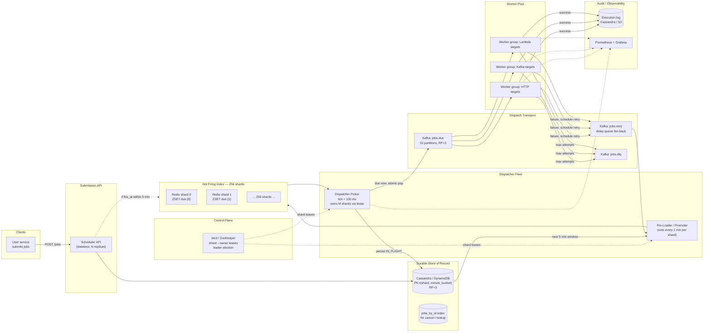
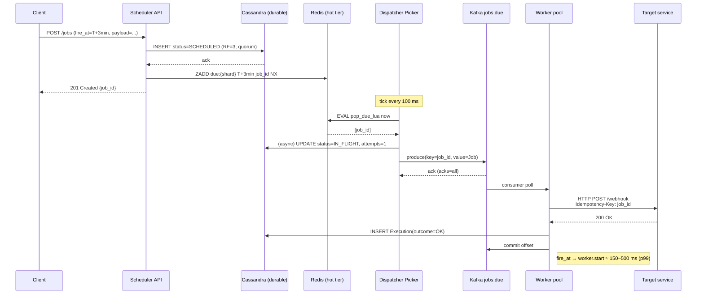

# Design a High-Precision Distributed Job Scheduler (10K jobs/sec, ±2s)

> **Difficulty:** Hard &nbsp;|&nbsp; **Frequency:** ★★★★☆ &nbsp;|&nbsp; **Companies:** Uber (Cadence/Cherami), Netflix (Dynein), Airbnb (Chronos/Dynein), Stripe (scheduler), LinkedIn, Google (Borg/Cron), Amazon, Meta, Flipkart, Swiggy, Zomato, fintechs (scheduled payments / EMIs / reminders).
>
> **Real-world analogues:** Scheduled payments (EMIs, subscription renewals), reminder/notification services, retry-after-backoff queues, TTL-expiry deliveries, alarm clocks, SLA timers, follow-up callbacks, "send this email at 9am local time", Uber/Ola "schedule ride", Zomato/Swiggy "schedule order", DoorDash "deliver at X", Slack reminders, Google Calendar nudges.

---

## Table of Contents

1. [Problem Statement](#1-problem-statement)
2. [Clarifying Questions](#2-clarifying-questions-always-ask-these-first)
3. [Requirements (FR + NFR)](#3-requirements)
4. [Capacity Estimation](#4-capacity-estimation-back-of-the-envelope)
5. [The Precision / Latency Budget — The Heart of the Problem](#5-the-precision--latency-budget--the-heart-of-the-problem)
6. [Why *Not* Kafka / SQS / RabbitMQ Alone](#6-why-not-kafka--sqs--rabbitmq-alone)
7. [Data Model](#7-data-model)
8. [High-Level Architecture (HLD)](#8-high-level-architecture-hld)
9. [Component Deep-Dives](#9-component-deep-dives)
10. [Dispatcher Algorithm & Shard Ownership](#10-dispatcher-algorithm--shard-ownership)
11. [End-to-End Flow](#11-end-to-end-flow)
12. [Precision: Sources of Jitter & Mitigations](#12-precision-sources-of-jitter--mitigations)
13. [Scaling, Partitioning & Fault Tolerance](#13-scaling-partitioning--fault-tolerance)
14. [Recurring Jobs, Cancellation, Update](#14-recurring-jobs-cancellation-update)
15. [Edge Cases & Gotchas](#15-edge-cases--gotchas)
16. [Security, Multi-Tenancy, Quotas](#16-security-multi-tenancy-quotas)
17. [Observability](#17-observability)
18. [Technology Choices — Final Verdict](#18-technology-choices--final-verdict)
19. [Extensions the Interviewer Will Push On](#19-extensions-the-interviewer-will-push-on)
20. [Interview One-Liner](#20-interview-one-liner)
21. [Q&A Defense — Top 22 Tough Interview Questions](#21-qa-defense--top-22-tough-interview-questions)

---

## 1. Problem Statement

Design a distributed job scheduler that accepts millions of future-dated jobs and fires them at (or very close to) their scheduled time.

**Concrete SLOs:**

- **Throughput:** sustain **10,000 jobs/sec** being *dispatched* (average), peak 3–4× that.
- **Precision:** every job must **begin execution within 2 seconds** of its `fire_at` timestamp — p99.
- **Durability:** once accepted, a job **must eventually run** (at-least-once). Power failure of any component must not lose jobs.
- **Scale of state:** 100s of millions to billions of jobs in flight (scheduled minutes to months out).

The end-to-end clock includes **network latency, DB access, queue hops, worker pickup, and the executor's own startup time** — they all have to fit inside the 2-second budget.

> This is a *time-accuracy* problem, not just a throughput problem. A regular "background job queue" (Sidekiq / Celery / SQS) cannot guarantee *when* a job runs — only that it runs "eventually". That distinction drives every design choice below.

---

## 2. Clarifying Questions (always ask these first)

You'll score points for asking these *before* drawing boxes:

1. **What does "2 seconds" mean exactly?** `fire_at → worker starts execution`, or `fire_at → job finishes`? → *Worker **starts** execution (p99).*
2. **Future horizon?** Seconds-out to months-out? → *Seconds to 90 days.*
3. **Recurring jobs (cron-style) or one-shot only?** → *Both; recurring computed as "emit next occurrence after execution".*
4. **Can a job be cancelled / rescheduled after submission?** → *Yes, up until ~1 second before `fire_at`.*
5. **Exactly-once or at-least-once execution?** → *At-least-once at the transport; **idempotent** at the executor (job_id is the idempotency key).*
6. **Time zones?** → *Store `fire_at` as absolute UTC epoch-ms; recurring rules carry a timezone string, expansion happens on submit & on reschedule.*
7. **Job payload size?** → *Small (≤ 64 KB). Anything bigger is stored externally (S3) and referenced by URL.*
8. **Who executes the jobs?** → *Remote workers — could be HTTP callbacks, Lambdas, Kafka consumers, or internal microservices. Scheduler's job ends at "dispatched".*
9. **Multi-tenant?** → *Yes, with per-tenant quotas and fairness.*
10. **Failure semantics** — if a worker fails, retry? How many times? → *Configurable (default 3 retries, exponential backoff capped at 5 min); after max, DLQ.*
11. **Ordering across jobs?** → *No global ordering; same `fire_at` jobs fire concurrently.*
12. **Max skew between scheduler time and worker time?** → *Assume NTP-synced nodes within ±50 ms. Scheduler owns "now".*
13. **Read patterns beyond dispatch?** → *Yes: list jobs by tenant, by status, by fire_at window.*

---

## 3. Requirements

### 3.1 Functional

- **F1.** `POST /jobs` — create a one-shot or recurring job with `fire_at`, `target`, `payload`, retry policy.
- **F2.** `DELETE /jobs/{id}` / `PATCH /jobs/{id}` — cancel or reschedule (best-effort until ~1 s before fire).
- **F3.** `GET /jobs/{id}` — status and execution history.
- **F4.** Dispatch each job to its configured **target** (HTTP webhook, Kafka topic, gRPC method, Lambda) within the SLO.
- **F5.** On worker failure (non-2xx, timeout, thrown exception), retry per policy; on exhaustion, push to DLQ + notify owner.
- **F6.** For recurring jobs, enqueue the **next** occurrence as soon as the current one is dispatched.
- **F7.** Replayable/audit log: who scheduled what, when it fired, every retry.

### 3.2 Non-Functional

| Attribute        | Target                                                                       |
|------------------|------------------------------------------------------------------------------|
| Throughput       | 10K dispatch/s average; 40K/s peak (4× burst — e.g., "midnight EMIs")        |
| **Precision**    | **p99 ≤ 2 s** between `fire_at` and `worker.start`; p50 ≤ 300 ms             |
| Durability       | No loss after `201 Created`; RF=3 on all durable stores                      |
| Availability     | 99.95% for both submission and dispatch                                      |
| Scalability      | Horizontally scalable at every layer; no global mutex                         |
| Consistency      | Read-your-write on submit; at-least-once dispatch; idempotent execution       |
| Tenant isolation | Per-tenant quotas; noisy neighbor doesn't starve others                       |
| Replay / backfill| Can re-run the last N days of jobs without causing duplicate business actions (executor idempotency) |

---

## 4. Capacity Estimation (back of the envelope)

| Metric                                   | Calculation                                             | Value                       |
|------------------------------------------|---------------------------------------------------------|-----------------------------|
| Dispatch rate (avg)                      | stated                                                  | **10,000 /s**               |
| Dispatch rate (peak burst)               | 4× avg                                                  | **40,000 /s**               |
| Submission rate                          | ≈ dispatch rate (plus recurring re-inserts)             | ~10–20K /s                  |
| Jobs in flight at any time (seconds-out) | 10K/s × 90 days                                         | ~**75 B jobs**              |
| Realistic in-flight (most jobs near-term)| Heavy tailed; 90% within next 24h                       | ~**1–5 B** hot             |
| Row size (job + metadata)                | ~500 B                                                  | 500 B                       |
| **Durable store size**                    | 5B × 500 B                                              | **~2.5 TB** (shard it)      |
| "Due in next 5 min" hot window           | 10K/s × 300 s                                           | **3 M jobs**                |
| Hot-tier RAM                             | 3M × 200 B (just id + fire_at + ptr)                    | **~600 MB** (easily Redis)  |
| Kafka partitions for `jobs.due`          | peak / ~5K per-partition sustainable                    | **16–32**                   |
| Dispatcher shards                        | 256 (hash-partition of job_id)                          | 256                         |
| Dispatcher pods                          | 256 shards × 1 owner + 256 standby ≈ 32 pods × 8 shards | ~**32 pods**                |
| Worker pool                              | 10K dispatch × 100 ms avg work / 8 cores                | ~**128 cores** (lower bound)|

Nothing exotic — this fits on a ~40-node cluster plus a small Redis cluster and a Kafka cluster you probably already have.

---

## 5. The Precision / Latency Budget — The Heart of the Problem

**Total budget: 2,000 ms from `fire_at` to `worker.start`.** Spend it explicitly — if you can't justify where every millisecond goes, you'll miss the SLO in production.

| Stage                                                 | Target  | p99   | Notes                                                                 |
|-------------------------------------------------------|---------|-------|-----------------------------------------------------------------------|
| **Scheduler tick quantization** (picker runs every T) | 100 ms  | 100ms | Pick T small; T is the *minimum* precision floor. We pick **T = 100 ms**. |
| Hot-tier read (Redis `ZRANGEBYSCORE` + Lua pop)       | 2 ms    | 10 ms | In-VPC Redis; pipeline it.                                             |
| DB status update (mark `IN_FLIGHT`)                   | 5 ms    | 25 ms | Async / batched; **not** on the critical path (optimistic: flip in Redis, persist async). |
| Dispatcher → Kafka produce (`acks=all`)                | 5 ms    | 20 ms | `linger.ms=2`, `batch.size=16KB`, `compression=lz4`.                   |
| Kafka commit / replication                            | 5 ms    | 30 ms | RF=3, in-AZ; `min.insync.replicas=2`.                                  |
| Worker Kafka poll + fetch                             | 20 ms   | 100 ms| `fetch.max.wait.ms=20`, `fetch.min.bytes=1`, **low-latency consumer**. |
| Worker deserialize + dispatch to target               | 5 ms    | 30 ms |                                                                       |
| Network hop to target (HTTP webhook case)             | 20 ms   | 200 ms| The *tenant's* service — biggest unknown. Bounded by connect timeout.  |
| **TOTAL overhead**                                    | ~160 ms | **~500 ms** | Leaves **1.5 s** of headroom for GC pauses, retries, queue depth.    |

**Key insight — the 100 ms tick is the floor.** If you run the dispatcher every 1 second, you have already spent half your budget on quantization alone. That's why hierarchical timer wheels (see §9.3) or a 100-ms ZSET tick are used rather than classic cron.

### 5.1 What blows this budget in practice

- **GC pauses** on JVM dispatchers — use **ZGC / Shenandoah / G1 with small heap**, or write the dispatcher in Go / Rust.
- **Kafka consumer `max.poll.interval` too high** — default is 5 min, but your *fetch wait* is what matters; set `fetch.max.wait.ms` low.
- **Single Redis instance becoming CPU-bound** — shard the ZSET across N Redis nodes (one per dispatcher shard).
- **Thundering herd at the top of the minute** — apply **jitter** at ingest (see §12).
- **Worker scale-from-zero** (Lambda cold start) — keep a warm worker pool; never rely on cold start for time-critical executions.

---

## 6. Why *Not* Kafka / SQS / RabbitMQ Alone

The interviewer will press you on this. Here's the honest comparison:

| Candidate                                   | Native "fire at T" | Throughput | Cancel / update | Precision | Verdict as **scheduler** |
|---------------------------------------------|---------------------|------------|------------------|-----------|---------------------------|
| **Kafka**                                   | ❌ no delay API; would need "topic-per-delay-bucket" hack | Massive | ❌ can't mutate a record | Great for dispatch, poor for delay | **Not a scheduler.** Use Kafka as the *dispatch channel* only. |
| **SQS (delay queues / `DelaySeconds`)**      | ✅ up to **15 min** only | 3K/s per queue (std), higher with sharding | ❌ no cancel/update | ~ seconds | OK for **last-mile** dispatch (inside the 15-min window), not a general scheduler. |
| **RabbitMQ (TTL + DLX, or `rabbitmq_delayed_message_exchange`)** | ✅ via plugin | Good until ~100K in-flight, then plugin is memory-bound | ❌ awkward to cancel | ~ seconds | OK for modest scale; struggles at billions of scheduled jobs. |
| **Redis ZSET (score = `fire_at_ms`)**        | ✅ native `ZADD` + `ZRANGEBYSCORE` | ~100K ops/s per shard | ✅ `ZREM` by id | **10 ms** with 100-ms tick | ✅ **Hot-tier scheduler index** — this is the core idea. |
| **Hierarchical Timer Wheel (in-process)**    | ✅ ms-precision | CPU-bound | ✅ cancel via entry pointer | **1 ms**  | ✅ Alternative in-process hot tier for each dispatcher shard. |
| **Cassandra / DynamoDB / Postgres (partitioned by time bucket)** | ✅ scan a bucket | Massive durable | ✅ delete row | Dependent on scan frequency | ✅ **Durable store of record**, not the firing index. |
| **Cron clustered (Quartz JDBC)**             | ✅ | Moderate; DB-bound | ✅ | ~ seconds | Works up to ~1K/s; falls over past that. |
| **Temporal / Cadence**                      | ✅ durable timers | High (Uber runs at scale) | ✅ | ~ seconds | Excellent for *workflows*, heavier than needed for pure scheduling. |

**Final decision:**

- **Durable store of record:** Cassandra / DynamoDB (or sharded Postgres) — partitioned by time bucket.
- **Hot firing index:** **Redis ZSET sharded 256 ways**, each shard owned by one dispatcher pod (or hierarchical timer wheel in-process).
- **Dispatch transport to workers:** **Kafka** — because it's high-throughput, replayable, multi-consumer-group fan-out, and we need those properties once jobs become due.
- **Not Kafka for scheduling** — Kafka has no "deliver this at T" primitive, and rewriting offsets to delay is an anti-pattern.

---

## 7. Data Model

### 7.1 Job record (canonical, stored in durable store)

```
Job {
  string   job_id             // UUIDv7 — lexically sortable by time, good shard key
  string   tenant_id
  long     fire_at_ms          // UTC epoch ms — the scheduled time
  long     fire_at_bucket      // floor(fire_at_ms / 60_000)  — minute bucket for range scans
  int      shard               // hash(job_id) % 256 — deterministic
  string   target_type         // "http" | "kafka" | "grpc" | "lambda"
  string   target_addr         // URL / topic / function ARN
  bytes    payload             // ≤ 64 KB, else payload_ref -> S3
  string   idempotency_key     // typically == job_id; tenant may override
  // Retry policy
  int      max_attempts
  string   backoff             // "exp:1s:5m" or "fixed:30s"
  // Recurrence (null for one-shot)
  string   cron_expr           // e.g. "0 9 * * *"
  string   cron_tz             // e.g. "Asia/Kolkata"
  // State
  enum     status              // SCHEDULED | IN_FLIGHT | SUCCEEDED | FAILED | CANCELED | DLQ
  int      attempts
  long     created_at_ms
  long     updated_at_ms
  long     last_fired_at_ms
  string   last_error
}
```

### 7.2 Partitioning

- **Durable store:** partition key = `(shard, fire_at_bucket)`; sort key = `(fire_at_ms, job_id)`.
  - 256 shards × 1-minute buckets → pre-loader can scan exactly one partition per shard per minute.
  - `job_id` lookups use a secondary index or a `jobs_by_id` table.
- **Redis hot tier (one ZSET per shard):** key = `due:{shard}`, score = `fire_at_ms`, member = `job_id` (with payload fetched from durable store OR inlined in a sibling HSET `job:{job_id}` for lowest-latency dispatch).

### 7.3 Audit / execution log

```
Execution {
  string   execution_id        // UUID
  string   job_id
  int      attempt
  long     dispatched_at_ms
  long     target_started_at_ms
  long     finished_at_ms
  enum     outcome              // OK | HTTP_4XX | HTTP_5XX | TIMEOUT | EXCEPTION
  string   result_summary
}
```

Written append-only to a dedicated table / Kafka topic `jobs.executions` for forensics, SLO dashboards, retries.

---

## 8. High-Level Architecture (HLD)

> **Editable sources:**
>
> - [`assets/03-job-scheduler-hld.drawio`](./assets/03-job-scheduler-hld.drawio) — production-grade design (Cassandra durable store + Redis ZSET hot tier + etcd shard leases + Kafka dispatch).
> - [`assets/03-job-scheduler-whiteboard.drawio`](./assets/03-job-scheduler-whiteboard.drawio) — simpler whiteboard-style recreation (Postgres + watcher polling + Kafka topics + Redis cancel cache); good for the easier interview narrative.
>
> Open in [diagrams.net](https://app.diagrams.net/) (`File → Open from device`) or with the *Draw.io Integration* extension in Cursor/VS Code.

### 8.1 Overview diagram (Mermaid)



### 8.2 Layered view (ASCII, for a quick whiteboard)

```
┌──────────────────────────────────────────────────────────────────────────────┐
│                HIGH-PRECISION DISTRIBUTED JOB SCHEDULER                      │
│                                                                              │
│  ┌────────────┐     POST /jobs                                               │
│  │  Client    │──────────────────────►┌────────────────────┐                 │
│  └────────────┘                       │  Scheduler API     │                 │
│                                       │  (stateless)       │                 │
│                                       └────────┬───────────┘                 │
│                                                │ write-through                │
│                          ┌─────────────────────┼──────────────────────┐      │
│                          ▼                     ▼                      │      │
│            ┌──────────────────────┐  ┌─────────────────────┐          │      │
│            │ Durable: Cassandra   │  │ Hot tier (if ≤5min) │          │      │
│            │ PK=(shard, minute)   │  │ Redis ZSET per shard│          │      │
│            │ source of truth      │  └─────────┬───────────┘          │      │
│            └──────────┬───────────┘            │                      │      │
│                       │ scan next-5-min        │                      │      │
│                       ▼                        ▼                      │      │
│             ┌───────────────────────────────────────┐                 │      │
│             │  Dispatcher Pod (owns shards S1..Sk)  │◄──etcd lease────┘      │
│             │   Pre-loader  →  Picker (tick=100ms)  │                        │
│             │   Lua: ZRANGEBYSCORE + ZREM atomic    │                        │
│             └───────────────────┬───────────────────┘                        │
│                                 │ produce key=job_id                         │
│                                 ▼                                            │
│                    ┌─────────────────────────┐                               │
│                    │ Kafka: jobs.due         │  32 partitions, RF=3          │
│                    └────────────┬────────────┘                               │
│                                 │                                            │
│                  ┌──────────────┼──────────────┐                             │
│                  ▼              ▼              ▼                             │
│              ┌──────┐       ┌──────┐       ┌──────┐                          │
│              │ HTTP │       │Kafka │       │Lambda│   Worker pools by        │
│              │ pool │       │ pool │       │ pool │   target type            │
│              └───┬──┘       └───┬──┘       └───┬──┘                          │
│                  │  success     │              │                             │
│                  ▼              ▼              ▼                             │
│        ┌────────────────────────────────────────────┐                        │
│        │  Execution log (append-only Cassandra/S3)  │                        │
│        └────────────────────────────────────────────┘                        │
│                  │  failure → jobs.retry (scheduled)                         │
│                  └─► Loader re-materializes into hot tier                    │
│                                                                              │
│                  └─► exhausted → jobs.dlq                                    │
└──────────────────────────────────────────────────────────────────────────────┘
```

---

## 9. Component Deep-Dives

### 9.1 Submission API

- Stateless Java/Go service behind an L7 load balancer; auth via mTLS or OAuth2 client credentials.
- On `POST /jobs`:
  1. Validate (size, future `fire_at`, cron parseable, target reachable per tenant allowlist).
  2. Compute `shard = hash(job_id) % 256`, `fire_at_bucket = fire_at_ms / 60_000`.
  3. **Write to durable store** (`acks = quorum`) — this is the point of durability. Return `201 Created` only after this ack.
  4. **If `fire_at - now ≤ 5 min`** (the hot-tier horizon), also `ZADD due:{shard} fire_at_ms job_id` in Redis so the picker sees it without waiting for the loader. Best-effort; the loader will catch it anyway.
- Recurring submit: compute the *next* `fire_at_ms` from cron + timezone, store both the cron rule and the next occurrence; never materialize all future occurrences up-front.

### 9.2 Durable Store (source of truth)

**Choice: Cassandra / DynamoDB (or sharded Postgres).**

Schema (Cassandra):

```
CREATE TABLE jobs_due_bucket (
    shard          int,
    fire_minute    bigint,       -- epoch minutes
    fire_at_ms     bigint,
    job_id         uuid,
    tenant_id      text,
    target_type    text,
    target_addr    text,
    payload        blob,
    status         text,
    attempts       int,
    max_attempts   int,
    cron_expr      text,
    cron_tz        text,
    ...
    PRIMARY KEY ((shard, fire_minute), fire_at_ms, job_id)
) WITH CLUSTERING ORDER BY (fire_at_ms ASC, job_id ASC);

CREATE TABLE jobs_by_id (
    job_id   uuid PRIMARY KEY,
    shard    int,
    fire_minute bigint,
    ...
);
```

**Why this partitioning works:**

- Pre-loader scan = `SELECT ... WHERE shard = ? AND fire_minute IN (?, ?, ?, ?, ?)` — five partition reads per shard per minute = bounded and fast.
- 256 shards × ~400 jobs/min/shard at avg load = ~100K jobs/min total: read-light, write-light per partition.
- No hot partition because `fire_at_bucket` rotates every minute — unless everyone schedules at "midnight IST"; see §12 on jitter.

**Why not Kafka as the store?** Kafka is append-only and can't answer "give me everything due between T1 and T2 for shard S" without scanning the entire log. It's a transport, not a database.

### 9.3 Hot Firing Index (Redis ZSET per shard, or Timer Wheel)

Two variants — pick one, understand both.

**Variant A — Redis ZSET (recommended for simplicity):**

- One ZSET per shard: `due:{0}`, `due:{1}`, …, `due:{255}`.
- Score = `fire_at_ms`, member = `job_id` (or packed `job_id|target_type` for one-hop dispatch).
- Atomic "pop all due" via **Lua script** running inside Redis:

```lua
-- KEYS[1] = "due:{shard}"
-- ARGV[1] = now_ms
-- ARGV[2] = max_batch (e.g., 1000)
local due = redis.call('ZRANGEBYSCORE', KEYS[1], '-inf', ARGV[1], 'LIMIT', 0, ARGV[2])
if #due > 0 then
  redis.call('ZREM', KEYS[1], unpack(due))
end
return due
```

That single Lua call is the **atomic "fire now"** primitive: everything returned is guaranteed to be removed from the index, so no two dispatcher replicas can dispatch the same job.

- Redis cluster: one shard per master, each master with a replica. Picker pods **always talk to the master they own** (via the shard→owner lease in etcd).
- Sized at ~3M entries in the busiest 5-min window → ~600 MB RAM — fits on a single Redis node per shard; even at 256 shards you need only a handful of Redis machines with multi-tenant shards co-located.

**Variant B — Hierarchical Timer Wheel (per-dispatcher, in-process):**

Inspired by Varghese & Lauck's "Hashed and Hierarchical Timing Wheels" and used by Kafka's producer purgatory / Netty.

```
Tier 0: 1000 slots × 1 ms   ← covers next 1 s (sub-second precision)
Tier 1: 60 slots   × 1 s    ← covers next 60 s
Tier 2: 60 slots   × 1 min  ← covers next 60 min
Tier 3: 24 slots   × 1 h    ← covers next 24 h
```

- O(1) insert, O(1) tick, O(1) cancel (via slot-linked-list entry pointer).
- Use when you want **sub-100-ms precision** and can afford keeping hot jobs in-process.
- Trade-off: in-process state is **volatile** — the durable store remains the source of truth; on pod restart, the loader rebuilds the wheel from the next-N-min partition scan.

We pick **Variant A** as the default because Redis provides cross-replica visibility and survives dispatcher pod restarts without needing the rebuild handshake.

### 9.4 Pre-Loader / Promoter

Runs inside every dispatcher pod (or as a separate sidecar), once per minute per owned shard:

```
for each shard owned by this pod:
    rows = db.scan(
        shard = S,
        fire_minute IN [now_minute, now_minute+1, ..., now_minute+4]   // look ahead 5 min
    )
    pipeline:
        for row in rows:
            if row.status == SCHEDULED:
                ZADD due:{S} row.fire_at_ms row.job_id NX
```

Notes:

- `NX` ensures idempotency — if another loader already promoted the job, don't overwrite.
- **5-minute look-ahead** is deliberate: even if the loader is delayed or the shard failed over, jobs for the *current* minute are already in the hot tier; the loader only has to stay 4 minutes ahead of "now".
- Payload doesn't have to sit in Redis — only `job_id`. The dispatcher fetches the payload lazily from the durable store (or from a sibling Redis HSET), trading RAM for one extra 2-ms hop. At 10K jobs/s this is fine.

### 9.5 Dispatcher Picker

The precision-critical piece.

```
every 100 ms:
    for each shard owned by this pod:
        due_ids = redis.eval(pop_due_lua, "due:{shard}", now_ms, 1000)
        if due_ids.empty(): continue
        batch = db.mget(due_ids)            // fetch payloads
        for job in batch:
            producer.send("jobs.due", key=job.job_id, value=serialize(job))
        db.bulkUpdate(due_ids, status=IN_FLIGHT, attempt=attempt+1)  // async
```

Critical tuning:

- **Tick = 100 ms** (not 1 s) — sets the minimum precision floor at 100 ms.
- **Kafka producer**: `acks=all`, `linger.ms=2`, `batch.size=16KB`, `compression=lz4`, `max.in.flight.requests.per.connection=5`, `enable.idempotence=true`.
- **`IN_FLIGHT` write to DB is async** — its purpose is visibility and crash recovery, not blocking dispatch. If the pod crashes between ZREM and DB update, the job is on Kafka (will execute) but DB still shows `SCHEDULED`; the recovery sweep reconciles.
- **Rate-limit per shard** — token bucket prevents one runaway tenant from starving others; per-tenant quota enforced by the API at submit time, not at dispatch time.

### 9.6 Dispatch Transport (Kafka `jobs.due`)

- 32 partitions (keyed by `job_id`), RF=3, retention 1 day (we don't replay dispatches; we replay from durable store instead).
- One consumer group per worker *type* (HTTP, Kafka-forward, Lambda, gRPC) — Kafka's fan-out handles multi-target routing naturally.
- Low-latency consumer tuning:
  - `fetch.max.wait.ms = 20`, `fetch.min.bytes = 1`
  - `max.poll.interval.ms = 30_000`, `max.poll.records = 100`
  - Keep the consumer **polling loop tight**: no blocking work inside `poll()`; dispatch to a thread pool.

### 9.7 Workers

- Small, stateless pods organized into pools by target type.
- Per-job flow:
  1. Deserialize.
  2. Honor `idempotency_key` — in the HTTP adapter, send as `Idempotency-Key` header; for Kafka targets, use it as the message key; for Lambda, as the client token.
  3. Dispatch with **aggressive timeouts**: `connect=1s`, `read=10s` (job-configurable, but always bounded).
  4. On 2xx/success: append to execution log, commit Kafka offset.
  5. On failure: decide retry vs DLQ based on `attempts < max_attempts`; produce to `jobs.retry` with `next_fire_at = now + backoff(attempts)`.
- Workers **never** write to the hot tier directly — retries go through the durable store path so precision is uniform.

### 9.8 Retry path

- `jobs.retry` is a Kafka topic consumed by a small "retry loader" service that just writes the job (with its new `fire_at`) back into the durable store and (if within 5 min) the hot tier.
- Exponential backoff capped at 5 min means retries naturally re-enter the hot tier via the loader.

---

## 10. Dispatcher Algorithm & Shard Ownership

### 10.1 Why 256 shards

- `shard = hash(job_id) % 256` → deterministic, stateless on the client path.
- 256 is chosen so:
  - A single dispatcher pod can comfortably own 8–16 shards (at 10K/s total, that's ~600 jobs/s per shard — trivial).
  - Failover reassigns only a fraction of traffic when one pod dies.
  - The Redis footprint per shard (~600 MB) fits on a modest node.

### 10.2 Leader election / shard leases via etcd

- Every dispatcher pod tries to acquire leases `scheduler/shard/{i}` for some range of `i`.
- Lease TTL = **3 seconds**, heartbeat every 1 s.
- If a pod dies, another pod can acquire the lease after TTL expiry → **worst-case 3-s scheduling gap** for that shard's jobs. Because we have a 2-s budget *per job*, a 3-s failover gap may miss some jobs' SLOs — but jobs aren't lost (durable store), just late. Acceptable with `99.95%` availability because failovers are rare.
- Tight SLO? Use **primary-and-hot-standby** pattern: two pods co-own each shard, only the primary picks; the standby tails Redis and steps up on lease loss in <500 ms.
- Rebalancer: watches pod count changes, shifts leases minimally (consistent-hashing-over-pods style) so we don't reshuffle everything when one pod joins.

### 10.3 Why not have every pod pick every shard

Because then **two pods can race** on the same Redis shard, causing duplicate dispatches. The `ZREM` in the Lua pop makes this safe per-member, but:

- You'd N-way fan-out the Redis load (N = replica count).
- You'd N-way the DB status writes.

Owning a shard means one Redis connection, one stream of produces, clean metrics, and no self-contention.

### 10.4 Cold start / recovery

On pod start (or after taking over a shard):

1. Acquire lease.
2. **Bounded rebuild**: read `jobs_due_bucket` for this shard for the next 5 minutes and re-`ZADD NX` any `SCHEDULED` rows whose `job_id` isn't already in the ZSET. Redis already has them if a prior owner loaded them, so the rebuild is nearly a no-op in the happy case.
3. Start ticking.

### 10.5 "Stuck `IN_FLIGHT`" sweeper

A separate background job per shard looks for rows with `status = IN_FLIGHT` and `updated_at_ms < now - 5 min` (i.e., the dispatcher crashed between `ZREM` and DB update), and:

- If the Kafka dispatch message is confirmed (check execution log), mark `SUCCEEDED/FAILED`.
- Otherwise, flip back to `SCHEDULED` with `attempts++` and re-promote.

This is the at-least-once safety net.

---

## 11. End-to-End Flow

### 11.1 Happy path — scheduling 5 minutes out



### 11.2 Failure path — target returns 503

```
Worker dispatch → 503
Worker → jobs.retry (fire_at' = now + exp_backoff(attempts))
Retry Loader → DB update (fire_at, attempts++) + Redis ZADD if within 5 min
... wait backoff ...
Dispatcher picks up and re-fires
If attempts == max_attempts → jobs.dlq + alert
```

### 11.3 Recurring path — cron

```
Job (cron="0 9 * * *", tz="Asia/Kolkata") — every morning 9:00 IST

Submit:
  compute next_fire_at = nextCronFire(now, expr, tz)  // 03:30 UTC
  store job with fire_at=next, status=SCHEDULED

Dispatch (at 03:30 UTC):
  Dispatcher fires job → worker executes
  Before marking SUCCEEDED, Dispatcher ALSO computes:
      next_next = nextCronFire(fire_at, expr, tz)
      INSERT new row for the next occurrence (or UPDATE same row's fire_at)

Important: insert the next occurrence EAGERLY so a crash between dispatch
and "schedule next" never drops a recurrence.
```

---

## 12. Precision: Sources of Jitter & Mitigations

| Jitter source                                         | Magnitude       | Mitigation                                                                 |
|-------------------------------------------------------|-----------------|-----------------------------------------------------------------------------|
| Dispatcher tick quantization                          | up to T = 100ms | T=100ms; go lower (50ms) if budget allows.                                  |
| GC pause on dispatcher JVM                            | 50–500 ms spikes| ZGC / Shenandoah; or write dispatcher in Go/Rust; heap < 4 GB; off-heap state.|
| Kafka producer batching                               | up to `linger.ms`| `linger.ms=2` on dispatch producer (trade a little efficiency for latency). |
| Kafka consumer fetch wait                             | up to `fetch.max.wait.ms` | 20 ms; `fetch.min.bytes=1`.                                           |
| Redis tail latency (slow queries, AOF fsync)          | 5–50 ms tails   | Disable AOF fsync-every-write on the hot tier; RDB + replica for durability; shard to spread load.|
| Clock skew between scheduler and producer             | up to NTP drift | Require NTP/PTP; reject submits with `fire_at` < now + 10ms (meaningless).  |
| **Thundering herd at "round" times** (midnight, top of hour) | seconds-to-minutes | **Ingest-time jitter**: allow tenant to pick a **window** (e.g., "fire between 00:00:00 and 00:00:30"); API spreads `fire_at` uniformly. Critical for EMI/bill-day systems. |
| Kafka partition hotspot                               | queue buildup   | Key by `job_id` hash; never key by tenant (hot tenants starve).             |
| Worker-side queue depth (slow target service)         | seconds         | Per-target concurrency limit; circuit breaker; fast-fail to retry queue.     |
| DNS resolution on HTTP webhook                        | 10–500 ms spikes| Warm DNS cache; long-lived connection pool keyed by host.                   |
| TLS handshake on cold connections                     | 50–200 ms       | HTTP/2 multiplexing; persistent connection pool; mTLS session resumption.    |
| Network partition / Kafka leader election             | 1–10 s          | Deemed a **precision outage**, not a correctness failure; jobs still run, just late. SLO is p99, not p100. |

**Rule of thumb:** if you can't name where your 2 seconds go, you don't have a 2-second system. The table above is the entire answer.

---

## 13. Scaling, Partitioning & Fault Tolerance

### 13.1 Horizontal scaling levers

| Layer                 | Lever                              | How you feel the pressure                     |
|-----------------------|------------------------------------|-----------------------------------------------|
| Submission API        | Add pods                           | Submit-latency rising                         |
| Durable store         | Add shards / Cassandra nodes       | `p99 read latency` on the 5-min scan rising   |
| Hot-tier Redis        | Split busy shards further (512/1024)| `redis cpu` > 70% on any master               |
| Dispatcher pods       | Add pods → rebalancer shrinks per-pod ownership | `shard_tick_lag` rising                   |
| Kafka `jobs.due`      | Add partitions (pre-provision!)    | Consumer lag on dispatch                      |
| Worker pool           | Scale by queue lag + target concurrency | `kafka consumer lag` or worker pool saturation |

### 13.2 Multi-region / DR

- **Durable store:** cross-region replication (Cassandra NTS / DynamoDB Global Tables). Eventual consistency across regions is fine because each region owns its own shard range — no cross-region writes on the hot path.
- **Hot tier + Dispatcher:** **active / passive** per shard range. Passive region runs loader at reduced cadence; on failover it takes over leases within 30 s.
- **Clock**: PTP (Precision Time Protocol) if you can; otherwise chrony with multiple stratum-1 sources. Never use the system clock without NTP on a scheduler node.

### 13.3 Fault scenarios

| Failure                                 | Detection                              | Behavior                                                    | Recovery                                                    |
|-----------------------------------------|----------------------------------------|-------------------------------------------------------------|-------------------------------------------------------------|
| Submission API pod dies                 | LB health check                        | Client retries (idempotent by client-supplied `request_id`) | k8s replaces pod                                            |
| Cassandra node dies                     | gossip / lag metric                    | Reads served from replicas                                  | Cassandra hinted handoff / repair                           |
| Redis master for a shard dies           | Sentinel / Cluster failover            | Brief (<1 s) unavailability; Lua pop retries                | Replica promoted; loader rebuilds any lost unacked ZADDs from DB |
| Dispatcher pod dies                     | etcd lease expiry                      | 3-s gap before another pod takes over that shard            | Lease reclaimed; cold-start rebuild                         |
| Kafka partition leader dies             | ISR metric                             | Brief produce retry                                         | Producer retries; idempotent producer prevents dupes        |
| Worker pod OOMs mid-dispatch            | consumer lag / offset not committed    | Another worker picks up the message                          | Target is idempotent → safe                                 |
| Target service down                     | 5xx / timeout                          | Retry with backoff via `jobs.retry`                         | Circuit breaker fast-fails to retry until target is healthy |
| Whole region down                       | multi-region monitor                   | Traffic drains to standby; passive → active promotion       | Runbook: flip etcd cluster + Kafka producer target          |

### 13.4 At-least-once, not exactly-once

Be explicit with the interviewer:

- The **transport** is at-least-once. A crash between Kafka produce and DB `IN_FLIGHT` update, or between worker success and offset commit, can re-fire.
- **Exactly-once execution** is the responsibility of the **target**, enforced by the `idempotency_key = job_id`. That's why the idempotency key is not optional.
- Promising exactly-once end-to-end across heterogeneous targets (random webhooks, Lambdas, external APIs) is a lie. Say so.

---

## 14. Recurring Jobs, Cancellation, Update

### 14.1 Recurring (cron)

- Store the cron rule **plus** the next materialized occurrence.
- On dispatch, **before** marking the current occurrence done, schedule the next.
- Materialize-on-demand avoids billions of "next occurrences" in the DB for a daily job.

### 14.2 Cancel (`DELETE /jobs/{id}`)

- Look up `shard` and `fire_minute` via `jobs_by_id`.
- Best-effort `ZREM due:{shard} job_id` in Redis.
- `UPDATE jobs_due_bucket SET status = CANCELED WHERE ...`.
- **Dispatcher re-checks status** *after* popping from Redis and *before* producing to Kafka — a ~2 ms point-read on the DB status row is cheap insurance against the race where cancel arrives after the pop.

### 14.3 Update (`PATCH /jobs/{id}` — reschedule)

- Optimistic concurrency via a `version` column.
- `ZREM` old score; insert new row (or update in place) with new `fire_at_bucket`; `ZADD` with new score.
- If it's already `IN_FLIGHT` → reject with `409 Conflict` (the worker owns it).

### 14.4 "Cancel in the last second" — what can you promise?

Honest answer: best-effort. The cancel path races the dispatcher. Users must design for at-most-one-execution-wins at the target (the idempotency key makes the dispatch safe; the cancel can at best prevent it, not un-send it once produced).

---

## 15. Edge Cases & Gotchas

1. **"Fire all at midnight"** — 2M users, all scheduled to `00:00:00.000`. Without jitter, you crush the hot tier for 1 minute. **Solution:** API applies randomized jitter (`fire_at += U(0, 30s)`) unless the tenant explicitly asks for sub-second alignment.
2. **Leap seconds / DST** — always work in UTC internally. Cron expansion is the *only* place timezone matters; do it at the API layer with a well-tested library (ICU / Joda / `cron-utils`).
3. **Job submitted with `fire_at` in the past** — reject at the API (`400`). Optionally: allow a "fire_immediately" flag that bypasses precision SLO.
4. **Clock-skewed client** submits `fire_at = now + 50 years` — reject above a configurable max horizon (90 days).
5. **Huge payload** — hard-cap at 64 KB; above that, require the client to upload to S3 and send a signed URL.
6. **Duplicate dispatch** — always possible in an at-least-once system. The **executor's idempotency key** is the only real defense.
7. **Recurring job's target is down for hours** — retries pile up; must *not* emit the next occurrence before the current one completes or is DLQ'd. Otherwise a broken service + "every minute" cron = runaway queue.
8. **Tenant schedules 1B jobs at once** — block at the API with per-tenant rate limits and per-tenant in-flight quotas (`max_scheduled_jobs`).
9. **Dispatcher does the ZREM but crashes before Kafka produce** — the sweeper (§10.5) recovers by re-promoting; the durable store still has the row.
10. **Kafka produce succeeds but IN_FLIGHT DB write fails** — harmless; sweeper will see row still `SCHEDULED` and re-promote. Worker idempotency handles the duplicate.
11. **Time-zone-named cron near DST transitions** — "2:30 AM every day" happens twice or zero times on DST days. Library must define which behavior; don't hand-roll.
12. **The 2-second SLO during a Redis failover** — up to 30 s in the worst case. Mitigate with Redis Cluster + Sentinel + Keeping the hot tier tiny so rebuild is <1 s, or with in-process timer wheels per shard (Variant B §9.3).
13. **Cold consumers** — a consumer group rebalance can take 10+ s with the default `session.timeout.ms`. Use **static consumer group membership** and `cooperative-sticky` partition assignor.
14. **Priority inversion** — a flood of low-priority jobs clogs the dispatcher. Run separate Kafka topics / worker pools per priority class; ensure picker splits budget across them.
15. **"I want exactly-once to my webhook"** — explain you can give at-least-once + idempotency key; true exactly-once requires a transactional target.

---

## 16. Security, Multi-Tenancy, Quotas

- **AuthN** on `POST /jobs`: mTLS or OAuth2 client credentials per tenant.
- **AuthZ**: tenant may only schedule to an allowlisted set of target addresses (prevents using the scheduler as an SSRF amplifier).
- **Payload encryption at rest** in the durable store (Cassandra TDE / DynamoDB encryption).
- **Payload scrubbing** from logs (PII / secrets).
- **Per-tenant quotas**: `max_rps_at_submit`, `max_in_flight`, `max_future_horizon_days`. Rate-limit via token bucket keyed by `tenant_id` at the API layer.
- **Fair scheduling**: dispatchers use **weighted fair queuing** across tenants inside a shard so one tenant's burst doesn't starve others.
- **Cross-tenant data leak**: never reuse a `job_id` across tenants; always include `tenant_id` in Kafka message headers so workers can verify routing.
- **Audit**: every submit / cancel / update / dispatch / retry / DLQ is an append-only event in the execution log — regulatory-friendly.

---

## 17. Observability

### 17.1 Golden signals

| Metric                                    | Why you care                                        |
|-------------------------------------------|------------------------------------------------------|
| `scheduler_precision_ms` (histogram: `worker_start - fire_at`) | **The SLO itself.** p50 / p95 / p99.        |
| `dispatch_batch_size` per tick            | Tick underutilization vs. saturation                |
| `shard_tick_lag_ms`                       | Is any shard falling behind?                        |
| `loader_lag_ms`                           | Is the pre-loader keeping the 5-min horizon full?   |
| `redis_zset_size{shard}`                  | Hot-tier pressure; spike = thundering herd incoming |
| `kafka_consumer_lag{topic=jobs.due}`      | Worker saturation                                   |
| `retry_rate`, `dlq_rate` per target       | Target health                                       |
| `sweeper_recovered_count`                 | How often we rely on the safety net (should be ~0)  |

### 17.2 Distributed tracing

- Trace context (`traceparent`) generated at `POST /jobs`, stored with the job, propagated into the dispatch message header, picked up by worker → target.
- Spans: `submit` → `promote` → `pop` → `dispatch` → `worker.poll` → `target.call`.
- The `precision_ms` histogram is computed inside the worker at `target.call` span start.

### 17.3 Alerting

- **Page** on: `p99 precision_ms > 2000` over 5 min, `dlq_rate > 0.1%`, `shard_tick_lag > 1 s`, any shard lease flapping.
- **Warn** on: hot tier growth anomalies (thundering herd predictor), loader lag > 60 s.

---

## 18. Technology Choices — Final Verdict

| Layer                 | Pick                                        | Why                                                                                          |
|-----------------------|---------------------------------------------|----------------------------------------------------------------------------------------------|
| Submission API        | Go / Java (Spring WebFlux / Netty)          | Stateless; anything fast is fine.                                                             |
| Durable store         | **Cassandra** (or DynamoDB)                 | Partitioned-by-(shard, minute) scans are the exact thing Cassandra's wide-row model excels at.|
| Hot-tier index        | **Redis Cluster, ZSET per shard** + Lua pop | Native `fire-at` primitive; cluster-shardable; tiny footprint.                                |
| Dispatch transport    | **Kafka** — `jobs.due`, `jobs.retry`, `jobs.dlq` | High throughput, multi-consumer-group fan-out, durable replay.                              |
| Workers               | Lang-agnostic; Kafka consumer per target-type pool | Keep dispatch thin; isolate slow targets in their own pools.                           |
| Coordination          | **etcd** (or ZooKeeper)                     | Lease-based shard ownership; battle-tested.                                                   |
| Time source           | NTP / PTP                                   | Non-negotiable for a precision scheduler.                                                     |
| Dispatcher language   | **Go or Java with ZGC**                     | Low-GC-pause is a hard requirement.                                                           |
| Recurring library     | `cron-utils` (Java) / `robfig/cron` (Go)    | DST / leap-year correctness is someone else's job.                                            |
| Optional alternative  | **Temporal / Cadence**                      | If you also need workflows with retries/signals, use this instead of rolling your own.        |

### 18.1 Trade-offs the interviewer will probe

- **Kafka vs RabbitMQ for `jobs.due`** — RabbitMQ gives lower per-message latency and easier DLQ, but caps out around 50K msg/s per node and has smaller operational ecosystem. Pick Kafka at the 10K/s target because headroom and fan-out.
- **Cassandra vs Postgres** — Postgres sharded is fine up to ~1 TB per shard but scaling shards is operator-heavy; Cassandra scales linearly. DynamoDB if you're on AWS and want no ops.
- **Redis ZSET vs in-process Timer Wheel** — ZSET is simpler and fails over cleanly; timer wheel gives sub-10ms precision but needs crash-rebuild.
- **One Kafka topic vs topic-per-target-type** — start with one; split only if target types have wildly different latency characteristics.
- **Store payload in hot tier vs fetch at dispatch** — prefer fetch at dispatch for small payloads; inline for very-high-fanout low-payload workloads.

### 18.2 What production systems actually look like

- **Netflix Dynein** — open-source delayed queue: Dynomite (Redis-fork) + timer wheel + "delay buckets by second". Inspiration for Variant A.
- **Uber Cherami / Cadence / Temporal** — durable timers backed by Cassandra + history service; much heavier machinery because they're also a workflow engine.
- **Google Cloud Tasks** — Spanner-backed distributed scheduler; multi-region; exposes HTTP target model.
- **AWS EventBridge Scheduler / Step Functions Wait state** — Spanner/Dynamo-backed; same pattern behind the scenes.
- **Airbnb Chronos / Dynein** — Kafka + Cassandra for at-scale delayed email + reminder pipelines.

You are rebuilding ~Netflix Dynein for the interview. Say so out loud.

---

## 19. Extensions the Interviewer Will Push On

1. **How do you add sub-100-ms precision?** — switch hot tier to per-shard in-process timer wheels (Variant B, §9.3); replicate state via Raft if you need HA without cold rebuild.
2. **How do you guarantee no duplicate dispatch?** — the Lua `ZRANGEBYSCORE+ZREM` atomic op already gives at-most-one dispatcher taking the job; combine with idempotent Kafka producer (`enable.idempotence=true`) and target-side idempotency keys.
3. **What if the target is flaky and slow?** — per-target concurrency limits + circuit breakers + hedged requests; worker-pool isolation per target tenant/class.
4. **How do you support "cancel all jobs for tenant X"?** — bulk API that streams `jobs_by_tenant` partition and writes tombstones; Redis cleanup is eventual.
5. **What about priority / SLAs?** — separate Kafka topics + separate worker pools per priority; dispatchers split tick budget by weight.
6. **How does this differ from Temporal / Cadence?** — those are workflow engines with durable state machines; this is a pure timer + dispatch. Temporal can run on top of this for the timer piece.
7. **Cross-DC / cross-region precision?** — each region owns a shard range; recurring jobs live in the region nearest their target; clock sync via PTP; failover SLA is 30 s, not 2 s.
8. **Exactly-once to an HTTP endpoint?** — impossible without target cooperation; explain why.
9. **What changes if you need 1M jobs/sec?** — 256 → 4096 shards; Kafka partitions → 256; Redis shards → 64 nodes; push the loader into a streaming job (Flink) that reads the DB via CDC (Debezium) instead of polling; move the audit log to a columnar store (ClickHouse) for retention. The *architecture* doesn't change — the *numbers* do.
10. **"We want delays up to 5 years."** — keep everything the same; durable store has no concept of horizon; pre-loader only touches the near-future partitions.

---

## 20. Interview One-Liner

> I'd build it as three tiers: **Cassandra sharded by `(shard, minute_bucket)` as the durable store**, **Redis `ZSET` per shard as the hot firing index** atomically popped by a Lua `ZRANGEBYSCORE + ZREM`, and **Kafka `jobs.due` as the dispatch transport** to idempotent worker pools. A dispatcher fleet owns 256 shards via **etcd leases**, ticks every **100 ms**, and the whole precision story comes from that tick plus a careful **latency budget**: ~100 ms tick + 10 ms Redis + 20 ms Kafka + 50 ms consumer + 50 ms target = **~250 ms p50**, well inside the 2-second SLO even with GC and network tail. I'd **not** use Kafka as the scheduler because it has no delay primitive, and **not** SQS delay queues because they cap at 15 min — use them only for last-mile dispatch if at all. At-least-once transport, **idempotency key = `job_id`** at the executor, **jitter at submit** to defuse midnight thundering herds, and a stuck-IN_FLIGHT sweeper to close the at-least-once safety net.

---

## 21. Q&A Defense — Top 22 Tough Interview Questions

> This section is a cheat sheet generated from a whiteboard review of [`assets/03-job-scheduler-utkarsh-design.drawio`](./assets/03-job-scheduler-utkarsh-design.drawio) (Postgres + Watcher polling variant). The cleaner V2 with all five fixes baked in lives at [`assets/03-job-scheduler-utkarsh-design-v2.drawio`](./assets/03-job-scheduler-utkarsh-design-v2.drawio). Use this as a rapid-fire defense checklist before the interview.

### Round 1 — Precision & polling math

**Q1. Who holds the job between "watcher pulled it" and `fire_at`?**

If the watcher pulls a 5-minute window and dumps every row into Kafka, you've reduced the executor to a sleeper thread (3 M waiting threads at 10K/s × 300 s — bankrupt) **or** you're relying on Kafka delayed delivery (which Kafka does not have natively). The fix is to insert a **Redis ZSET hot tier between Postgres and Kafka 2** and run a **Picker that ticks every 100 ms** with a Lua `ZRANGEBYSCORE(-inf, now) + ZREM`. Only jobs whose `fire_at ≤ now` ever reach Kafka 2; the executor never has to wait.

**Q2. Watcher race vs "direct push to Kafka 2" — what dedupes?**

Two mechanisms together: (a) Kafka idempotent producer (`enable.idempotence=true`, `acks=all`) kills *transport* dupes within one producer session; (b) **atomic claim before produce** via the Lua `ZREM` (or in Postgres-only mode, `UPDATE … SET status='QUEUED' WHERE id=? AND status='SCHEDULED'` and check `rowcount=1`). Whoever wins the conditional update produces; the loser no-ops. **Cleanest fix: delete the direct Job-Svc → Kafka-2 arrow.** The API only writes to Postgres (and to the Redis ZSET if `fire_at ≤ 5 min`); the Picker is the *only* producer to Kafka 2.

**Q3. 10–20 s polling vs 2 s SLO — am I conceding the SLO?**

Yes, as drawn — minimum scheduling jitter equals the tick interval. Hitting p99 ≤ 2 s requires a tick ≤ ~500 ms after subtracting Kafka + executor overhead. Postgres can't sustain a 100-ms full-table poll at 75 B rows. Split the responsibility: **Watcher (1-min cadence)** is the bandwidth job — scan Postgres for the next 5 min and `ZADD NX` into Redis; **Picker (100-ms cadence)** is the precision job — scan only the Redis ZSET. That is the only configuration that closes the math.

### Round 2 — Watcher SPOF & correctness

**Q4. Two watchers double-pulling the same row.**

Three options, in increasing production credibility:
1. `SELECT … FOR UPDATE SKIP LOCKED` + `UPDATE status='QUEUED'` — disjoint claim per watcher; no leader election. Easy. Limited to one Postgres primary's lock throughput (fine at 10K/s).
2. **etcd shard leases** — 256 logical shards, each watcher pod leases a subset (`lease_ttl=3s, hb=1s`). Worst-case 3-s scheduling gap on shard failover. **My pick.**
3. Redis `SET NX EX` — lightweight but suffers the RedLock controversy. Caveat heavily before defending.

**Q5. 3M-row UPDATE every 10–20 s — what's the cost?**

A naïve `UPDATE … SET status='QUEUED'` over 3 M rows is a non-starter (B-tree churn on `(status, schedule_time)`, lock contention with API inserts, replica lag spike). Two repairs:
- **Don't UPDATE — pop.** Redis ZSET + Lua `ZREM` is atomic and stateless to Postgres; status is updated *async* after Kafka produce.
- If you must stay Postgres-only, **batch into 1K-row chunks** with `LIMIT … FOR UPDATE SKIP LOCKED` and paginate. Never single-statement the entire 5-minute window.

**Q6. Watcher commit-then-publish vs publish-then-commit.**

Neither is safe alone. **Transactional outbox** is the right pattern: in the same Postgres txn, write `UPDATE jobs SET status='QUEUED'` **and** `INSERT INTO outbox (job_id, kafka_payload)`. A separate **outbox publisher** (or Debezium CDC) drains `outbox` to Kafka at-least-once and deletes on ack. Combined with idempotent producer + executor-side idempotency key, the end-to-end behavior is at-least-once with no stuck `Queued` rows.

**Q7. 15-s "stuck" recovery — distinguishes stuck vs long-running how?**

A global 15-s threshold is wrong. Use a **lease + heartbeat**:
- Executor claims the job with `lease_until = now + lease_duration` (say 60 s).
- Executor heartbeats every 10 s, extending `lease_until`.
- "Stuck" = `lease_until < now`, not "running for > 15 s".

Long-running jobs keep extending the lease; crashed executors lose it; the sweeper re-promotes only the truly dead ones. Even when the sweeper double-fires, the executor's `idempotency_key = job_id` keeps the target side safe.

### Round 3 — Cancellation correctness

**Q8. Cancel TOCTOU.**

Three layers:
1. Cancel writes synchronously to **both** Redis (cancel:job:{id} flag) and Postgres (`UPDATE jobs SET status='CANCELED' WHERE id=? AND status IN ('SCHEDULED','QUEUED')`).
2. Executor's pre-run check is atomic with claim: `UPDATE jobs SET status='RUNNING' WHERE id=? AND status='QUEUED'` — if `rowcount=0`, the cancel won; abort.
3. Redis flag is the cheap fast-path (1 ms early-out); Postgres CAS is the source of truth.

**Q9. Cancel after dispatch.**

Document the contract: *"Cancel is best-effort prior to dispatch. After dispatch is initiated, cancel may not take effect."* Once the worker has POSTed to the user's webhook, you cannot un-send it. This matches Temporal / Cloud Tasks semantics.

**Q10. Cancel for a recurring job + missing cron expansion box.**

Cancel sets `status='CANCELED'` on the *job row*. The cron emitter checks status before computing the next `fire_at`; if canceled, no emit. The whiteboard is missing the **cron next-occurrence emitter**: when a recurring job is dispatched, the executor (or a Status Consumer on success ack) computes `next_fire_at = nextCronFire(fire_at, expr, tz)` and `INSERT … ON CONFLICT UPDATE` to materialize the next row **eagerly, before marking the current one SUCCEEDED**, so a crash never drops a recurrence.

### Round 4 — Postgres scaling

**Q11. 75 B rows — sharding scheme.**

Hybrid: **hash on `job_id` for storage, range on `fire_minute_bucket` for scan**. Composite primary key `((shard, fire_minute), fire_at_ms, job_id)` with `shard = hash(job_id) % 256`. Hash spreads write load; within each shard, ordering by `fire_minute` makes the watcher scan a contiguous partition. Watcher fans out across all 256 shards, each owned by some watcher pod via etcd lease. A `jobs_by_id` lookup table (sharded by `job_id`) backs cancel/status APIs. At 75 B rows, switching to **Cassandra** (wide-row partition model `((shard, fire_minute), fire_at_ms, job_id)`) is the cleaner answer.

**Q12. Index bloat & autovacuum.**

Move the firing index out of Postgres (Redis ZSET) so Postgres no longer needs a `(status, schedule_time)` query. For status reads, add a **partial index** `WHERE status IN ('SCHEDULED','QUEUED')` so completed rows don't bloat. Aggressive autovacuum on hot partitions (`autovacuum_vacuum_scale_factor=0.02`); **drop completed partitions** older than 30 days instead of vacuuming.

**Q13. `job_runs` at 30K/s — Postgres?**

No. Split:
- **Hot path**: append-only Kafka topic `jobs.executions`.
- **Query path**: ClickHouse / BigQuery / S3 + Athena (long retention).
- **Postgres `job_runs`**: keep only the *latest run per job* (or last N), updated in place — that's what the "monitor status" API actually needs.

### Round 5 — Kafka 2, retries, DLQ

**Q14. Same job in `run` and `retry` simultaneously — dedupe?**

Use **Kafka transactions** on the executor's "publish-retry + commit-offset" step:

```
producer.beginTransaction()
producer.send(retryTopic, retryRecord)
consumer.sendOffsetsToTransaction(runOffsets, groupMetadata)
producer.commitTransaction()
```

After commit, `run` is empty for this job; `retry` holds it. Without Kafka transactions, idempotency-key on the executor side is the safety net.

**Q15. Partition key for Kafka 2.**

`job_id`. Hash distribution → no per-tenant hot partition; same `job_id`'s retries land on the same partition, preserving per-job ordering. Noisy-neighbor protection lives at the API gateway (per-tenant token bucket); never key by `tenant_id` alone.

**Q16. Midnight EMI burst — 1 M jobs at 00:00:00.**

In order of effectiveness:
1. **Ingest-time jitter.** API rewrites `fire_at += U(0, 30 s)` unless the tenant explicitly opts out. **Single most effective fix** — most jobs (notifications, reminders, EMIs) genuinely don't care about ±30 s.
2. Picker pops up to `max_batch=1000` per tick; 1 M due drains over many ticks.
3. Pre-provision Kafka partitions for peak (40K/s ≈ 32 partitions sustainable).
4. Per-tenant fair queuing inside the picker — round-robin across tenant queues.

Honest concession: jobs that *insist* on 00:00:00.000 alignment will see degraded p99 during the burst.

### Round 6 — Status freshness & monitoring

**Q17. Real status freshness.**

With the whiteboard's path (Executor → Kafka → Consumer Svc → Postgres → Job Search Svc):

| Stage | Worst-case |
|---|---|
| Executor status update (10 s heartbeat cadence) | up to 10 s |
| Kafka produce + consumer lag | 50 ms – 1 s |
| Consumer Svc batch DB write | 50 – 500 ms |
| User read from Postgres replica | 10 – 500 ms |

Realistic p99 ≈ **12–15 s**. Not "real-time." For sub-second status: executor writes status **directly to Redis** (`HSET job:{id} status=RUNNING`, TTL); API's `GET /status` reads Redis first, falls through to Postgres on miss. The Kafka path becomes async durability, not the read path.

**Q18. Read-your-write after `POST /jobs`.**

Return `201` only after primary write is durable. Then for the immediate `GET`, default to reading from primary (fine at this RPS); switch to "API caches the write in Redis with TTL" if read load on primary becomes a problem.

### Round 7 — Catch-all

**Q19. `runNow` semantics.**

`POST /jobs/{id}/runNow`:
1. Atomic CAS: `UPDATE jobs SET fire_at=now(), status='SCHEDULED' WHERE id=? AND status NOT IN ('RUNNING','SUCCESS','CANCELED')`.
2. If CAS succeeds, push directly into Redis ZSET (or Kafka 2 if no hot tier).
3. Two concurrent `runNow` calls: only one wins; the other returns 409. Already RUNNING → 409. Already SUCCESS → 409 (re-run requires `clone+submit`).

**Q20. Clock skew (±50 ms NTP).**

All servers chrony/NTP-synced from ≥ 4 stratum-1 sources. **PTP** for sub-millisecond skew if your cloud offers it (AWS Time Sync, Equinix). Reject submits where `fire_at < now + 100 ms` — those should call `runNow`, not future-date. **Scheduler owns "now"**: the picker's wall clock is authoritative; the executor doesn't compare `fire_at` for pacing.

**Q21. Multi-tenancy & noisy neighbor.**

Three layers:
1. **API gateway**: per-tenant token-bucket on `POST /jobs`; per-tenant `max_in_flight`.
2. **Watcher / Picker**: weighted fair queuing inside each shard.
3. **Cell-based isolation** for VIP tenants: dedicated Postgres shard + Kafka topic + executor pool. See [`08-CommonProblems/21-CellBasedAndShuffleSharding.md`](../08-CommonProblems/21-CellBasedAndShuffleSharding.md).

For 10K/s, layer 1 alone usually suffices.

**Q22. AP claim vs CP reality.**

The honest framing:
- **Submit path** (`POST /jobs`): consistency — ack only after RF=quorum. **CP.**
- **Status read** (`GET /jobs/{id}/status`): availability — serve stale from replica or Redis. **AP.**
- **Dispatch path**: at-least-once + idempotent execution **is** availability-first. We never block dispatch on consistency; sweepers reconcile after the fact. **AP.**

So "Availability > Consistency" is correct for **read and dispatch**, not for *submit*. Document the asymmetry.

### Five-minute whiteboard repair (the deltas the V2 drawio bakes in)

If you only have 60 seconds at the whiteboard, add four boxes and erase one arrow:

1. **Add Redis ZSET** between Watcher and Kafka 2 (`due:{shard}`, score = `fire_at_ms`). Watcher promotes; a new **Picker** (100-ms tick) does atomic Lua `ZRANGEBYSCORE + ZREM` and produces to Kafka 2. Closes Q1, Q3.
2. **Add an outbox table** in Postgres written in the same txn as `status='QUEUED'`, drained by an outbox publisher. Closes Q6.
3. **Add etcd shard leases** for watcher/picker HA — replaces the SPOF watcher. Closes Q4.
4. **Add a cron next-occurrence emitter** in the executor success path. Closes Q10.
5. **Erase the "direct push to Kafka 2"** arrow from Job Svc — it bypasses durability and creates the dedupe problem. Closes Q2.

That is the minimum delta from the whiteboard to a production-credible 10K/s scheduler.

---

## Related Material in This Repo

- **[src/HLD/07-SystemDesignAlgorithms/01-RateLimitingAlgorithms.md](../07-SystemDesignAlgorithms/01-RateLimitingAlgorithms.md)** — token buckets for tenant fairness and submit-rate control.
- **[src/HLD/07-SystemDesignAlgorithms/02-HashingAndPartitioning.md](../07-SystemDesignAlgorithms/02-HashingAndPartitioning.md)** — consistent hashing for shard ownership across dispatcher pods.
- **[src/HLD/07-SystemDesignAlgorithms/10-ConsensusAndLeadership.md](../07-SystemDesignAlgorithms/10-ConsensusAndLeadership.md)** — etcd leases, leader election for shard owners.
- **[src/HLD/08-CommonProblems/05-RetryStormsAndCircuitBreakers.md](../08-CommonProblems/05-RetryStormsAndCircuitBreakers.md)** — retry backoff and DLQ strategy for the worker pool.
- **[src/HLD/08-CommonProblems/06-IdempotencyAndDeduplication.md](../08-CommonProblems/06-IdempotencyAndDeduplication.md)** — the idempotency-key contract with executors.
- **[src/HLD/08-CommonProblems/08-DistributedLocksAndLeases.md](../08-CommonProblems/08-DistributedLocksAndLeases.md)** — shard lease mechanics.
- **[src/HLD/08-CommonProblems/03-HotKeysAndHotPartitions.md](../08-CommonProblems/03-HotKeysAndHotPartitions.md)** — thundering-herd jitter at submit time.
- **[src/HLD/08-CommonProblems/17-WatermarksAndLateEvents.md](../08-CommonProblems/17-WatermarksAndLateEvents.md)** — event-time semantics (relevant if you add windowed billing on top).
- **[src/HLD/Components/](../Components/)** — deep dives on Kafka / SQS / SNS / Redis / Cassandra that back this design.
