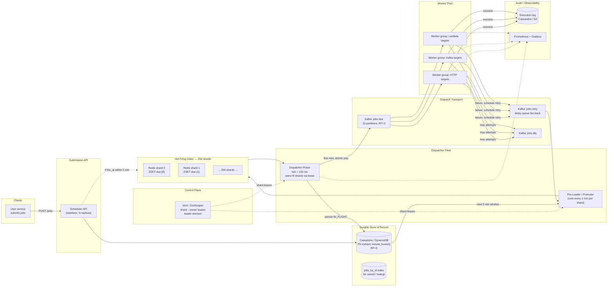
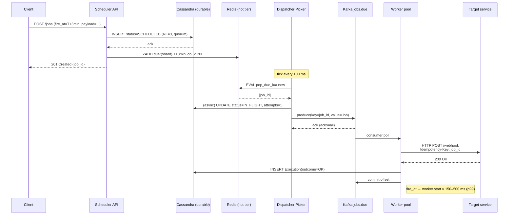

# Design a High-Precision Distributed Job Scheduler (10K jobs/sec, ±2s)

> **Difficulty:** Hard &nbsp;|&nbsp; **Frequency:** ★★★★☆ &nbsp;|&nbsp; **Companies:** Uber (Cadence/Cherami), Netflix (Dynein), Airbnb (Chronos/Dynein), Stripe (scheduler), LinkedIn, Google (Borg/Cron), Amazon, Meta, Flipkart, Swiggy, Zomato, fintechs (scheduled payments / EMIs / reminders).
>
> **Real-world analogues:** Scheduled payments (EMIs, subscription renewals), reminder/notification services, retry-after-backoff queues, TTL-expiry deliveries, alarm clocks, SLA timers, follow-up callbacks, "send this email at 9am local time", Uber/Ola "schedule ride", Zomato/Swiggy "schedule order", DoorDash "deliver at X", Slack reminders, Google Calendar nudges.

---

## Table of Contents

1. [Problem Statement](#1-problem-statement)
2. [Clarifying Questions](#2-clarifying-questions-always-ask-these-first)
3. [Requirements (FR + NFR)](#3-requirements)
4. [Capacity Estimation](#4-capacity-estimation-back-of-the-envelope)
5. [The Precision / Latency Budget — The Heart of the Problem](#5-the-precision--latency-budget--the-heart-of-the-problem)
6. [Why *Not* Kafka / SQS / RabbitMQ Alone](#6-why-not-kafka--sqs--rabbitmq-alone)
7. [Data Model](#7-data-model)
8. [High-Level Architecture (HLD)](#8-high-level-architecture-hld)
9. [Component Deep-Dives](#9-component-deep-dives)
10. [Dispatcher Algorithm & Shard Ownership](#10-dispatcher-algorithm--shard-ownership)
11. [End-to-End Flow](#11-end-to-end-flow)
12. [Precision: Sources of Jitter & Mitigations](#12-precision-sources-of-jitter--mitigations)
13. [Scaling, Partitioning & Fault Tolerance](#13-scaling-partitioning--fault-tolerance) — incl. **§13.5 Registry, Anti-Entropy & Split-Brain** · **§13.6 Performance Pitfalls** · **§13.7 Kafka Poison Pills** · **§13.8 Idempotent Consumer Patterns** · **§13.9 Backpressure** · **§13.10 Schema Evolution** · **§13.11 Saga / DAG** · **§13.12 Cells & Shuffle Sharding** · **§13.13 Replica-Lag Routing** · **§13.14 Retry Budget & Circuit Breakers** · **§13.15 Backups & PITR** · **§13.16 CDC for Outbox** · **§13.17 Storage Tiering** · **§13.18 Security & Supply Chain** · **§13.19 Multi-Region & DR** · **§13.20 Bulkheading & Resource Isolation** · **§13.21 Time & Clock Correctness**
14. [Recurring Jobs, Cancellation, Update](#14-recurring-jobs-cancellation-update)
15. [Edge Cases & Gotchas](#15-edge-cases--gotchas)
16. [Security, Multi-Tenancy, Quotas](#16-security-multi-tenancy-quotas)
17. [Observability](#17-observability) — incl. **§17.4 Synthetic Canary Jobs** · **§17.5 SLI / SLO / Error Budgets**
18. [Technology Choices — Final Verdict](#18-technology-choices--final-verdict)
19. [Extensions the Interviewer Will Push On](#19-extensions-the-interviewer-will-push-on)
20. [Interview One-Liner](#20-interview-one-liner)
21. [Q&A Defense — Top 47 Tough Interview Questions](#21-qa-defense--top-47-tough-interview-questions)

---

## 1. Problem Statement

Design a distributed job scheduler that accepts millions of future-dated jobs and fires them at (or very close to) their scheduled time.

**Concrete SLOs:**

- **Throughput:** sustain **10,000 jobs/sec** being *dispatched* (average), peak 3–4× that.
- **Precision:** every job must **begin execution within 2 seconds** of its `fire_at` timestamp — p99.
- **Durability:** once accepted, a job **must eventually run** (at-least-once). Power failure of any component must not lose jobs.
- **Scale of state:** 100s of millions to billions of jobs in flight (scheduled minutes to months out).

The end-to-end clock includes **network latency, DB access, queue hops, worker pickup, and the executor's own startup time** — they all have to fit inside the 2-second budget.

> This is a *time-accuracy* problem, not just a throughput problem. A regular "background job queue" (Sidekiq / Celery / SQS) cannot guarantee *when* a job runs — only that it runs "eventually". That distinction drives every design choice below.

---

## 2. Clarifying Questions (always ask these first)

You'll score points for asking these *before* drawing boxes:

1. **What does "2 seconds" mean exactly?** `fire_at → worker starts execution`, or `fire_at → job finishes`? → *Worker **starts** execution (p99).*
2. **Future horizon?** Seconds-out to months-out? → *Seconds to 90 days.*
3. **Recurring jobs (cron-style) or one-shot only?** → *Both; recurring computed as "emit next occurrence after execution".*
4. **Can a job be cancelled / rescheduled after submission?** → *Yes, up until ~1 second before `fire_at`.*
5. **Exactly-once or at-least-once execution?** → *At-least-once at the transport; **idempotent** at the executor (job_id is the idempotency key).*
6. **Time zones?** → *Store `fire_at` as absolute UTC epoch-ms; recurring rules carry a timezone string, expansion happens on submit & on reschedule.*
7. **Job payload size?** → *Small (≤ 64 KB). Anything bigger is stored externally (S3) and referenced by URL.*
8. **Who executes the jobs?** → *Remote workers — could be HTTP callbacks, Lambdas, Kafka consumers, or internal microservices. Scheduler's job ends at "dispatched".*
9. **Multi-tenant?** → *Yes, with per-tenant quotas and fairness.*
10. **Failure semantics** — if a worker fails, retry? How many times? → *Configurable (default 3 retries, exponential backoff capped at 5 min); after max, DLQ.*
11. **Ordering across jobs?** → *No global ordering; same `fire_at` jobs fire concurrently.*
12. **Max skew between scheduler time and worker time?** → *Assume NTP-synced nodes within ±50 ms. Scheduler owns "now".*
13. **Read patterns beyond dispatch?** → *Yes: list jobs by tenant, by status, by fire_at window.*

---

## 3. Requirements

### 3.1 Functional

- **F1.** `POST /jobs` — create a one-shot or recurring job with `fire_at`, `target`, `payload`, retry policy.
- **F2.** `DELETE /jobs/{id}` / `PATCH /jobs/{id}` — cancel or reschedule (best-effort until ~1 s before fire).
- **F3.** `GET /jobs/{id}` — status and execution history.
- **F4.** Dispatch each job to its configured **target** (HTTP webhook, Kafka topic, gRPC method, Lambda) within the SLO.
- **F5.** On worker failure (non-2xx, timeout, thrown exception), retry per policy; on exhaustion, push to DLQ + notify owner.
- **F6.** For recurring jobs, enqueue the **next** occurrence as soon as the current one is dispatched.
- **F7.** Replayable/audit log: who scheduled what, when it fired, every retry.

### 3.2 Non-Functional

| Attribute        | Target                                                                       |
|------------------|------------------------------------------------------------------------------|
| Throughput       | 10K dispatch/s average; 40K/s peak (4× burst — e.g., "midnight EMIs")        |
| **Precision**    | **p99 ≤ 2 s** between `fire_at` and `worker.start`; p50 ≤ 300 ms             |
| Durability       | No loss after `201 Created`; RF=3 on all durable stores                      |
| Availability     | 99.95% for both submission and dispatch                                      |
| Scalability      | Horizontally scalable at every layer; no global mutex                         |
| Consistency      | Read-your-write on submit; at-least-once dispatch; idempotent execution       |
| Tenant isolation | Per-tenant quotas; noisy neighbor doesn't starve others                       |
| Replay / backfill| Can re-run the last N days of jobs without causing duplicate business actions (executor idempotency) |

---

## 4. Capacity Estimation (back of the envelope)

| Metric                                   | Calculation                                             | Value                       |
|------------------------------------------|---------------------------------------------------------|-----------------------------|
| Dispatch rate (avg)                      | stated                                                  | **10,000 /s**               |
| Dispatch rate (peak burst)               | 4× avg                                                  | **40,000 /s**               |
| Submission rate                          | ≈ dispatch rate (plus recurring re-inserts)             | ~10–20K /s                  |
| Jobs in flight at any time (seconds-out) | 10K/s × 90 days                                         | ~**75 B jobs**              |
| Realistic in-flight (most jobs near-term)| Heavy tailed; 90% within next 24h                       | ~**1–5 B** hot             |
| Row size (job + metadata)                | ~500 B                                                  | 500 B                       |
| **Durable store size**                    | 5B × 500 B                                              | **~2.5 TB** (shard it)      |
| "Due in next 5 min" hot window           | 10K/s × 300 s                                           | **3 M jobs**                |
| Hot-tier RAM                             | 3M × 200 B (just id + fire_at + ptr)                    | **~600 MB** (easily Redis)  |
| Kafka partitions for `jobs.due`          | peak / ~5K per-partition sustainable                    | **16–32**                   |
| Dispatcher shards                        | 256 (hash-partition of job_id)                          | 256                         |
| Dispatcher pods                          | 256 shards × 1 owner + 256 standby ≈ 32 pods × 8 shards | ~**32 pods**                |
| Worker pool                              | 10K dispatch × 100 ms avg work / 8 cores                | ~**128 cores** (lower bound)|

Nothing exotic — this fits on a ~40-node cluster plus a small Redis cluster and a Kafka cluster you probably already have.

---

## 5. The Precision / Latency Budget — The Heart of the Problem

**Total budget: 2,000 ms from `fire_at` to `worker.start`.** Spend it explicitly — if you can't justify where every millisecond goes, you'll miss the SLO in production.

| Stage                                                 | Target  | p99   | Notes                                                                 |
|-------------------------------------------------------|---------|-------|-----------------------------------------------------------------------|
| **Scheduler tick quantization** (picker runs every T) | 100 ms  | 100ms | Pick T small; T is the *minimum* precision floor. We pick **T = 100 ms**. |
| Hot-tier read (Redis `ZRANGEBYSCORE` + Lua pop)       | 2 ms    | 10 ms | In-VPC Redis; pipeline it.                                             |
| DB status update (mark `IN_FLIGHT`)                   | 5 ms    | 25 ms | Async / batched; **not** on the critical path (optimistic: flip in Redis, persist async). |
| Dispatcher → Kafka produce (`acks=all`)                | 5 ms    | 20 ms | `linger.ms=2`, `batch.size=16KB`, `compression=lz4`.                   |
| Kafka commit / replication                            | 5 ms    | 30 ms | RF=3, in-AZ; `min.insync.replicas=2`.                                  |
| Worker Kafka poll + fetch                             | 20 ms   | 100 ms| `fetch.max.wait.ms=20`, `fetch.min.bytes=1`, **low-latency consumer**. |
| Worker deserialize + dispatch to target               | 5 ms    | 30 ms |                                                                       |
| Network hop to target (HTTP webhook case)             | 20 ms   | 200 ms| The *tenant's* service — biggest unknown. Bounded by connect timeout.  |
| **TOTAL overhead**                                    | ~160 ms | **~500 ms** | Leaves **1.5 s** of headroom for GC pauses, retries, queue depth.    |

**Key insight — the 100 ms tick is the floor.** If you run the dispatcher every 1 second, you have already spent half your budget on quantization alone. That's why hierarchical timer wheels (see §9.3) or a 100-ms ZSET tick are used rather than classic cron.

### 5.1 What blows this budget in practice

- **GC pauses** on JVM dispatchers — use **ZGC / Shenandoah / G1 with small heap**, or write the dispatcher in Go / Rust.
- **Kafka consumer `max.poll.interval` too high** — default is 5 min, but your *fetch wait* is what matters; set `fetch.max.wait.ms` low.
- **Single Redis instance becoming CPU-bound** — shard the ZSET across N Redis nodes (one per dispatcher shard).
- **Thundering herd at the top of the minute** — apply **jitter** at ingest (see §12).
- **Worker scale-from-zero** (Lambda cold start) — keep a warm worker pool; never rely on cold start for time-critical executions.

---

## 6. Why *Not* Kafka / SQS / RabbitMQ Alone

The interviewer will press you on this. Here's the honest comparison:

| Candidate                                   | Native "fire at T" | Throughput | Cancel / update | Precision | Verdict as **scheduler** |
|---------------------------------------------|---------------------|------------|------------------|-----------|---------------------------|
| **Kafka**                                   | ❌ no delay API; would need "topic-per-delay-bucket" hack | Massive | ❌ can't mutate a record | Great for dispatch, poor for delay | **Not a scheduler.** Use Kafka as the *dispatch channel* only. |
| **SQS (delay queues / `DelaySeconds`)**      | ✅ up to **15 min** only | 3K/s per queue (std), higher with sharding | ❌ no cancel/update | ~ seconds | OK for **last-mile** dispatch (inside the 15-min window), not a general scheduler. |
| **RabbitMQ (TTL + DLX, or `rabbitmq_delayed_message_exchange`)** | ✅ via plugin | Good until ~100K in-flight, then plugin is memory-bound | ❌ awkward to cancel | ~ seconds | OK for modest scale; struggles at billions of scheduled jobs. |
| **Redis ZSET (score = `fire_at_ms`)**        | ✅ native `ZADD` + `ZRANGEBYSCORE` | ~100K ops/s per shard | ✅ `ZREM` by id | **10 ms** with 100-ms tick | ✅ **Hot-tier scheduler index** — this is the core idea. |
| **Hierarchical Timer Wheel (in-process)**    | ✅ ms-precision | CPU-bound | ✅ cancel via entry pointer | **1 ms**  | ✅ Alternative in-process hot tier for each dispatcher shard. |
| **Cassandra / DynamoDB / Postgres (partitioned by time bucket)** | ✅ scan a bucket | Massive durable | ✅ delete row | Dependent on scan frequency | ✅ **Durable store of record**, not the firing index. |
| **Cron clustered (Quartz JDBC)**             | ✅ | Moderate; DB-bound | ✅ | ~ seconds | Works up to ~1K/s; falls over past that. |
| **Temporal / Cadence**                      | ✅ durable timers | High (Uber runs at scale) | ✅ | ~ seconds | Excellent for *workflows*, heavier than needed for pure scheduling. |

**Final decision:**

- **Durable store of record:** Cassandra / DynamoDB (or sharded Postgres) — partitioned by time bucket.
- **Hot firing index:** **Redis ZSET sharded 256 ways**, each shard owned by one dispatcher pod (or hierarchical timer wheel in-process).
- **Dispatch transport to workers:** **Kafka** — because it's high-throughput, replayable, multi-consumer-group fan-out, and we need those properties once jobs become due.
- **Not Kafka for scheduling** — Kafka has no "deliver this at T" primitive, and rewriting offsets to delay is an anti-pattern.

---

## 7. Data Model

### 7.1 Job record (canonical, stored in durable store)

```
Job {
  string   job_id             // UUIDv7 — lexically sortable by time, good shard key
  string   tenant_id
  long     fire_at_ms          // UTC epoch ms — the scheduled time
  long     fire_at_bucket      // floor(fire_at_ms / 60_000)  — minute bucket for range scans
  int      shard               // hash(job_id) % 256 — deterministic
  string   target_type         // "http" | "kafka" | "grpc" | "lambda"
  string   target_addr         // URL / topic / function ARN
  bytes    payload             // ≤ 64 KB, else payload_ref -> S3
  string   idempotency_key     // typically == job_id; tenant may override
  // Retry policy
  int      max_attempts
  string   backoff             // "exp:1s:5m" or "fixed:30s"
  // Recurrence (null for one-shot)
  string   cron_expr           // e.g. "0 9 * * *"
  string   cron_tz             // e.g. "Asia/Kolkata"
  // State
  enum     status              // SCHEDULED | IN_FLIGHT/RUNNING | SUCCEEDED | FAILED | CANCELED | DLQ
  int      attempts
  long     created_at_ms
  long     updated_at_ms
  long     last_fired_at_ms
  string   last_error
  // Executor lease (required by §10.6 — heartbeat-extended, sweeper-checked)
  string   lease_owner         // e.g. "executor-pod-7-uuid" — NULL when not RUNNING
  long     lease_until_ms      // absolute wall-clock deadline (UTC epoch ms); NULL when not RUNNING
}
```

> **Postgres DDL form** (matches the canonical record above; this is the migration the V2 design assumes is already applied):
>
> ```sql
> ALTER TABLE jobs
>   ADD COLUMN lease_owner   text,         -- e.g. "executor-pod-7-uuid"
>   ADD COLUMN lease_until   timestamptz;  -- absolute wall-clock deadline
>
> -- Index used by the Stuck-IN_FLIGHT Sweeper (§10.5) — partial index keeps it tiny:
> CREATE INDEX jobs_running_lease_idx
>   ON jobs (shard, lease_until)
>   WHERE status = 'RUNNING';
> ```
>
> Both columns are `NULL` for any non-`RUNNING` row (the executor clears them on terminal write — see §10.6.3, step 4). The CAS guard `AND lease_owner = :me` in heartbeat / terminal writes (§10.6.7) is what makes preemption safe.

### 7.2 Partitioning

- **Durable store:** partition key = `(shard, fire_at_bucket)`; sort key = `(fire_at_ms, job_id)`.
  - 256 shards × 1-minute buckets → pre-loader can scan exactly one partition per shard per minute.
  - `job_id` lookups use a secondary index or a `jobs_by_id` table.
- **Redis hot tier (one ZSET per shard):** key = `due:{shard}`, score = `fire_at_ms`, member = `job_id` (with payload fetched from durable store OR inlined in a sibling HSET `job:{job_id}` for lowest-latency dispatch).

### 7.3 Audit / execution log

```
Execution {
  string   execution_id        // UUID
  string   job_id
  int      attempt
  long     dispatched_at_ms
  long     target_started_at_ms
  long     finished_at_ms
  enum     outcome              // OK | HTTP_4XX | HTTP_5XX | TIMEOUT | EXCEPTION
  string   result_summary
}
```

Written append-only to a dedicated table / Kafka topic `jobs.executions` for forensics, SLO dashboards, retries.

---

## 8. High-Level Architecture (HLD)

> **Editable sources:**
>
> - [`assets/03-job-scheduler-hld.drawio`](./assets/03-job-scheduler-hld.drawio) — production-grade design (Cassandra durable store + Redis ZSET hot tier + etcd shard leases + Kafka dispatch).
> - [`assets/03-job-scheduler-whiteboard.drawio`](./assets/03-job-scheduler-whiteboard.drawio) — simpler whiteboard-style recreation (Postgres + watcher polling + Kafka topics + Redis cancel cache); good for the easier interview narrative.
>
> Open in [diagrams.net](https://app.diagrams.net/) (`File → Open from device`) or with the *Draw.io Integration* extension in Cursor/VS Code.

### 8.1 Overview diagram (Mermaid)



### 8.2 Layered view (ASCII, for a quick whiteboard)

```
┌──────────────────────────────────────────────────────────────────────────────┐
│                HIGH-PRECISION DISTRIBUTED JOB SCHEDULER                      │
│                                                                              │
│  ┌────────────┐     POST /jobs                                               │
│  │  Client    │──────────────────────►┌────────────────────┐                 │
│  └────────────┘                       │  Scheduler API     │                 │
│                                       │  (stateless)       │                 │
│                                       └────────┬───────────┘                 │
│                                                │ write-through                │
│                          ┌─────────────────────┼──────────────────────┐      │
│                          ▼                     ▼                      │      │
│            ┌──────────────────────┐  ┌─────────────────────┐          │      │
│            │ Durable: Cassandra   │  │ Hot tier (if ≤5min) │          │      │
│            │ PK=(shard, minute)   │  │ Redis ZSET per shard│          │      │
│            │ source of truth      │  └─────────┬───────────┘          │      │
│            └──────────┬───────────┘            │                      │      │
│                       │ scan next-5-min        │                      │      │
│                       ▼                        ▼                      │      │
│             ┌───────────────────────────────────────┐                 │      │
│             │  Dispatcher Pod (owns shards S1..Sk)  │◄──etcd lease────┘      │
│             │   Pre-loader  →  Picker (tick=100ms)  │                        │
│             │   Lua: ZRANGEBYSCORE + ZREM atomic    │                        │
│             └───────────────────┬───────────────────┘                        │
│                                 │ produce key=job_id                         │
│                                 ▼                                            │
│                    ┌─────────────────────────┐                               │
│                    │ Kafka: jobs.due         │  32 partitions, RF=3          │
│                    └────────────┬────────────┘                               │
│                                 │                                            │
│                  ┌──────────────┼──────────────┐                             │
│                  ▼              ▼              ▼                             │
│              ┌──────┐       ┌──────┐       ┌──────┐                          │
│              │ HTTP │       │Kafka │       │Lambda│   Worker pools by        │
│              │ pool │       │ pool │       │ pool │   target type            │
│              └───┬──┘       └───┬──┘       └───┬──┘                          │
│                  │  success     │              │                             │
│                  ▼              ▼              ▼                             │
│        ┌────────────────────────────────────────────┐                        │
│        │  Execution log (append-only Cassandra/S3)  │                        │
│        └────────────────────────────────────────────┘                        │
│                  │  failure → jobs.retry (scheduled)                         │
│                  └─► Loader re-materializes into hot tier                    │
│                                                                              │
│                  └─► exhausted → jobs.dlq                                    │
└──────────────────────────────────────────────────────────────────────────────┘
```

### 8.3 V2 Diagram — Step-by-Step Walkthrough

> Editable sources:
> - V2 (base diagram + first 6 hardening boxes for split-brain / cache invalidation / consistency): [`assets/03-job-scheduler-utkarsh-design-v2.drawio`](./assets/03-job-scheduler-utkarsh-design-v2.drawio).
> - V5 (V2 + 12 additional hardening boxes for poison-pill DLQs, idempotent consumers, backpressure, schema evolution, sagas, cells, replica-lag routing, retry budgets, backups, CDC, storage tiering, canaries/SLOs): [`assets/03-job-scheduler-utkarsh-design-v5.drawio`](./assets/03-job-scheduler-utkarsh-design-v5.drawio).
>
> This section walks the V2 diagram **box by box, edge by edge**, in the exact order you'd narrate it on a whiteboard. Each component is annotated with its drawio cell id (e.g. `[37]`) so you can locate it on the canvas. Every flow is a numbered sequence of steps; every step ends in a real component on the diagram. If something on the diagram is *not* covered here, it's either a panel of prose (Latency budget, Invariants, Alternatives) or an annotation Q&A bubble. The V5 file extends V2 with a separate row of 12 production-hardening legend boxes (cell ids `rb3_*`) — read it after §§ 13.7–13.17.

#### 8.3.1 Component roster (every box on the canvas)

##### Edge plane (north of the diagram)

| Cell | Component | Role in V2 |
|------|-----------|------------|
| `[10]` | **clients / users**            | mobile · web · service-to-service callers |
| `[11]` | **LB + API Gateway** *(N pods)* | terminates TLS, authN/authZ, **per-tenant rate-limit + idempotency-key dedupe**, routes write APIs to Job Svc, read APIs to Job Search Svc |
| `[12]` | **Job Svc** *(cluster)*         | submit / edit / cancel single jobs — **the only writer to `jobs` and `outbox` for user-facing operations** |
| `[13]` | **Job Search Svc** *(cluster)*  | reads (`GET /jobs/{id}`, `GET /jobs/{id}/status`) — hits Postgres replicas + Redis cache; never writes |
| `[27]` | **Status Consumer** *(cluster)* | tails Kafka `jobs.status` → UPSERTs Postgres + warms Redis status cache |
| `[28]` | **Cron Emitter** *(cluster, NEW)* | on each cron success, **eagerly INSERTS the next occurrence row in the same txn that marks SUCCEEDED** so cron never has a "missing next" gap (Q10) |

##### Control plane

| Cell | Component | Role |
|------|-----------|------|
| `[33]` | **etcd** *(NEW)*                 | shard-owner leases (TTL = 3 s, hb = 1 s); leases handed to **Watcher**, **Picker**, **Outbox Publisher**, **Cron Emitter**, **Sweeper** |
| `[34]` | **Redis `last_polled_time:{shard}`** | per-shard cursor so a Watcher resuming after restart picks up where it left off |

##### Durable store (Postgres)

| Cell | Component | Role |
|------|-----------|------|
| `[14]` | **Postgres** *(primary + replicas)* | source of truth — sharded by `hash(job_id) % 256`, partitioned by `fire_minute`, RF = 3 sync; quorum writes |
| `[15]` | `jobs` table     | full canonical row (§7.1) — **now also includes `lease_owner` + `lease_until_ms`** with a partial index on `(shard, lease_until) WHERE status='RUNNING'` for the Sweeper |
| `[16]` | `outbox` table *(NEW)* | one row per Kafka event Job Svc wants to publish; written **in the same txn** as the `jobs` UPDATE; drained by Outbox Publisher |
| `[17]` | `job_runs` table       | append-only audit log: `(job_id, attempt, status, executor_id, start, end, error)` |

##### Hot tier (Redis cluster)

| Cell | Component | Role |
|------|-----------|------|
| `[36]` | **Redis ZSET `due:{shard}`** *(NEW)* | hot firing index — `score = fire_at_ms`, `member = job_id`, **5-min horizon**, ~3M entries/shard at peak |
| `[41]` | **Redis cancel-flag** `cancel:job:{id}` | TTL = until `fire_at + slack`; Executor polls before each unit of work — fast cooperative cancel channel |

##### Dispatch fleet (the hot path)

| Cell | Component | Role |
|------|-----------|------|
| `[35]` | **Watcher / Pre-Loader** *(cluster)* | per-owned-shard, **every 1 min**, scans `jobs WHERE fire_at_ms < now+5min AND status='SCHEDULED'`, **`ZADD due:{shard} … NX`** — canonical promoter |
| `[37]` | **Picker** *(cluster, NEW)*     | per-owned-shard, **tick = 100 ms**, runs Lua `ZRANGEBYSCORE 0 now()` + `ZREM` atomically, produces to Kafka with `key = job_id` |
| `[38]` | **Kafka — dispatch**            | three topics: `jobs.run` (hot path), `jobs.retry` (delayed retries), `jobs.dead` (DLQ) — each RF=3, `acks=all`, `enable.idempotence=true` |
| `[39]` | **Job Consumer Svc** *(cluster)* | consumer group on `jobs.run` + `jobs.retry`; routes by `target_type` to the right Executor pool |
| `[40]` | **Executor Svc** *(≈ 100 pods)*  | sandboxed; **claims via CAS**, runs user code, **heartbeats every 10 s**, polls `cancel:job:{id}`, writes terminal status + emits `jobs.status` event; **idempotent on `job_id`** |

##### Reliability backstops

| Cell | Component | Role |
|------|-----------|------|
| `[57]` | **Outbox Publisher** *(cluster, NEW)* | tails `outbox` (Debezium CDC or polled) → republishes to `jobs.run` / status topics — kills "stuck `QUEUED`" rows (Q6) |
| `[61]` | **Stuck-IN_FLIGHT Sweeper**     | every N min, finds `status='RUNNING' AND lease_until < now()` → reset to `SCHEDULED, attempts++` — re-promoted on next Watcher tick |
| `[26]` | **Kafka `jobs.status`**          | per-job heartbeats + outcomes; consumed by Status Consumer & Cron Emitter |

##### Reading-only panels (not on the data path)

| Cell | What |
|------|------|
| `[63]` | Latency budget (p99 ≤ 2 s) — see §8.3.15 |
| `[64]` | Key invariants — see §8.3.16 |
| `[65]` | Legend (arrow types) |
| `[66]` | Alternatives at the hot tier (timer wheel, in-process timers, …) |
| `[8]`  | "V2 fixes baked in (vs v1)" — see §8.3.17 |

#### 8.3.2 Storage at a glance

##### Postgres (durable, source of truth)

| Table       | Cardinality                  | Used by                                     | Notes |
|-------------|------------------------------|---------------------------------------------|-------|
| `jobs`      | 1 row per logical job         | Job Svc · Watcher · Status Consumer · Sweeper | Sharded `hash(job_id) % 256`; partitioned by `fire_minute` |
| `outbox`    | 1 row per pending Kafka event | Job Svc *(writer)* · Outbox Publisher *(reader)* | Drained on success; rows TTL-purged after 24 h |
| `job_runs`  | 1 row per attempt             | Status Consumer (writer) · Search Svc (reader) | Append-only audit log |

##### Redis cluster (hot tier — *not* durable)

| Key                        | Type     | Purpose                                  | Population                |
|----------------------------|----------|------------------------------------------|---------------------------|
| `due:{shard}`              | ZSET     | hot firing index for next 5 min           | Watcher canonical · Job Svc best-effort |
| `cancel:job:{id}`          | STRING   | cancel cooperative-flag                   | Job Svc on `POST /cancel` |
| `last_polled_time:{shard}` | STRING   | watcher resume cursor                     | Watcher                    |
| `status:job:{id}`          | HASH     | warm cache for `GET /jobs/{id}/status`    | Status Consumer            |

##### Kafka topics

| Topic           | Partitions | Producer       | Consumer            | Notes                                |
|-----------------|------------|----------------|---------------------|--------------------------------------|
| `jobs.run`      | 32         | Picker · Outbox Publisher | Job Consumer Svc | hot dispatch path                    |
| `jobs.retry`    | 32         | Executor (on retry) | Job Consumer Svc | exponential-backoff fan-back         |
| `jobs.dead`     | 16         | Executor (max attempts) | DLQ tools          | poison messages — manual triage      |
| `jobs.status`   | 64         | Executor       | Status Consumer · Cron Emitter | heartbeats + outcomes  |

#### 8.3.3 Control plane — who holds what lease

`etcd` `[33]` is the **only** strongly-consistent control-plane store. It does **not** sit on the data path. Every shard-bound role acquires a lease on `/scheduler/shards/{N}/{role}`:

| Role | # leases per pod | Failover |
|------|------------------|----------|
| Watcher    `[35]`       | 1 + per shard owned | TTL=3s, hb=1s ⇒ another pod takes over within ~3s |
| Picker     `[37]`       | per shard owned     | same |
| Outbox Publisher `[57]` | per shard owned     | same |
| Cron Emitter `[28]`     | per cron-shard      | same |
| Sweeper    `[61]`       | per shard owned     | same |

Total leases: `5 roles × 256 shards ≈ 1280`. etcd cluster of 3 nodes handles this trivially.

> **Critical invariant** (cell `[64]`, item 2): two pods can never own the same shard for the same role at the same time. Lease-holder is the only one allowed to call `ZRANGEBYSCORE+ZREM` (Picker) or `ZADD…NX` (Watcher). This is what makes the Lua atomic-pop sufficient for **at-most-one dispatcher per job** (Q15).

---

#### 8.3.4 Flow A — Schedule a *future* job (`fire_at > now + 5 min`)

This is the canonical "long-tail" path — most jobs at submit time look like this.

```
[10] client ── POST /jobs ──▶ [11] LB+APIGW ── [12] Job Svc
                                                      │
                                              ① INSERT jobs (status='SCHEDULED')
                                                      ▼
                                               [14] Postgres (quorum)
                                                      │
                                                      ▼  (eventually)
                                          ② [35] Watcher 1-min scan
                                                      │
                                              ③ ZADD…NX
                                                      ▼
                                              [36] Redis ZSET due:{shard}
                                                      │
                                              ④ Picker pops at fire_at
                                                      ▼
                                              (continues in Flow D + E)
```

**Steps**

1. **A1 — Client → API Gateway** `[10]→[11]`. Auth (mTLS / OAuth2), per-tenant rate-limit (`limit:tenant:{id}`), `Idempotency-Key` header dedupe (24 h Redis cache).
2. **A2 — API Gateway → Job Svc** `[11]→[12]`, edge labelled *"write APIs"*.
3. **A3 — Validate** *(in Job Svc)*: payload size ≤ 64 KB, `fire_at_ms > now`, cron parseable, `target_type ∈ {http, kafka, grpc, lambda}`, target host on tenant allow-list.
4. **A4 — Compute keys**: `job_id = UUIDv7`, `shard = hash(job_id) % 256`, `fire_minute = fire_at_ms / 60_000`.
5. **A5 — Single Postgres txn** `[12]→[14]`:
   ```sql
   BEGIN;
     INSERT INTO jobs(id, tenant_id, fire_at_ms, fire_minute, shard,
                      schedule_type, payload, max_attempts, status, attempts)
     VALUES (:job_id, …, 'SCHEDULED', 0);
     -- (no outbox row yet — A is future-dated, Watcher will promote)
   COMMIT;          -- acks = quorum
   ```
   The transaction returns only after a **synchronous quorum write to RF=3**. Job Svc replies `201 Created` with `job_id` to the client.
6. **A6 — *(Best-effort short-circuit)*** `[12]→[36]` *if `fire_at - now ≤ 5 min`*: also `ZADD due:{shard} fire_at_ms job_id NX`. For pure Flow A (`fire_at > 5 min`) **this step is skipped** — the Watcher is the canonical promoter (next flow).

> **What A guarantees**: durability (RF=3 quorum) before the 201 returns, and idempotency on retry of the same `Idempotency-Key`. **Not** guaranteed yet: that the job will actually fire — that's Flow C → Flow D.

---

#### 8.3.5 Flow B — Schedule a *near-term* / `runNow` job (`fire_at ≤ 5 min`)

This is the path the v2 diagram annotation `[76]` calls out: *"Outbox only works for NOW case."*

The challenge: a `runNow` job is supposed to fire **within seconds**, but the Watcher only ticks every 1 min — it would miss the firing window. The fix is the **outbox + Outbox Publisher** combo (cell `[16]` + `[57]`).

```
[10] ── [11] ── [12] Job Svc
                       │
                ① INSERT jobs (status='SCHEDULED')
                + INSERT outbox (kafka_topic, kafka_payload)
                       ▼  in SAME txn
                  [14] Postgres
                       │
                       ▼ tail (CDC or poll)
                  [57] Outbox Publisher
                       │
                       ▼ produce key=job_id
                  [38] Kafka jobs.run
                       │
                       ▼  (continues in Flow D step D3 onward)
```

**Steps**

1. **B1 — Submit** identical to A1–A4.
2. **B2 — Single Postgres txn** `[12]→[14]`:
   ```sql
   BEGIN;
     INSERT INTO jobs(...) VALUES (... 'SCHEDULED', ...);
     INSERT INTO outbox(job_id, kafka_topic, kafka_payload)
            VALUES (:id, 'jobs.run', :serialized);
   COMMIT;          -- RF=3 quorum
   ```
   This is the **transactional outbox** pattern (Q6). Either both rows commit or neither does. *No "stuck QUEUED" rows are possible.*
3. **B3 — Job Svc also `ZADD…NX` to Redis** `[12]→[36]` (best-effort, edge labelled *"if fire_at ≤ 5 min: ZADD (best-effort)"*). If Redis is up, Picker pops it within 100 ms; if Redis is down or the ZADD fails, the Outbox Publisher path still fires it.
4. **B4 — Outbox Publisher tails** `[16]→[57]`: Debezium CDC on the `outbox` table (or a 200-ms polling loop with `SELECT … FOR UPDATE SKIP LOCKED`). Holds an etcd lease per outbox-shard.
5. **B5 — Publish to Kafka** `[57]→[38]`: produces with `key = job_id` (so all events for one job land on the same partition; ordering is preserved). On ack, sets `outbox.status='sent'` (or deletes the row).
6. **B6 onwards** — same as Flow D step D3 onward (consumer → executor).

> **Why both ZADD and outbox?** The ZADD is the **fast path** (sub-second). The outbox is the **safety net** — it guarantees at-least-once delivery even if Redis ate the ZADD or Picker missed the tick. Combined with executor idempotency on `job_id`, double-fire is harmless.

---

#### 8.3.6 Flow C — Watcher promotion (canonical 5-minute preload)

```
                                  ① etcd lease: shard N
                                          │
                  [33] etcd ───────▶ [35] Watcher
                                          │
                                  ② every 1 min for each owned shard:
                                          ▼
                  [14] Postgres ──────────┘  SELECT … WHERE fire_at_ms BETWEEN
                                              now() AND now()+5min
                                              AND shard=N AND status='SCHEDULED'
                  [34] last_polled_time     ◀── ③ persist cursor
                                          │
                                  ④ ZADD due:{shard} fire_at_ms job_id NX
                                          ▼
                                  [36] Redis ZSET due:{shard}
```

**Steps**

1. **C1 — Acquire lease** `[33]→[35]`: each Watcher pod tries `etcdctl lease grant 3` then `put /scheduler/shards/N/watcher = pod_id`. Whoever wins owns shard N. Lease auto-renews via 1-second heartbeats.
2. **C2 — 1-minute tick**: for each owned shard, query
   ```sql
   SELECT id, fire_at_ms FROM jobs
    WHERE shard = :N
      AND status = 'SCHEDULED'
      AND fire_at_ms BETWEEN :last_polled AND now() + INTERVAL '5 minutes'
    ORDER BY fire_at_ms
    LIMIT 50000;
   ```
   *(`last_polled` from `[34]` Redis to avoid re-scanning what we already promoted.)*
3. **C3 — Pipeline `ZADD … NX`** `[35]→[36]`: one Redis pipeline per batch. `NX` makes it idempotent — re-promotion is harmless.
4. **C4 — Update cursor** `[35]→[34]`: `SET last_polled_time:{N} now()`.
5. **C5 — On lease loss** *(network blip, GC pause)*: stop scanning that shard immediately. Another Watcher will take over within 3 s.

> **Why 1 min + 5-min lookahead, not "every second"?** Bulk admission to Redis is much cheaper than per-job polling. The 5-min horizon ensures the Picker (which only sees the ZSET) has work to pop the moment a job becomes due. Latency from submit-to-fire is bounded by **`min(submit_zadd_path, watcher_period + picker_tick)` = min(100 ms, 60 s + 100 ms)** — the ZADD short-circuit gets the sub-second case.

---

#### 8.3.7 Flow D — Picker dispatch (the 100-ms hot path)

This is the precision-critical loop — every box in this flow exists *because* of the p99 ≤ 2 s SLO.

```
                                  ① etcd lease: shard N
                                          │
                  [33] etcd ───────▶ [37] Picker  (tick = 100 ms)
                                          │
                                  ② Lua: ZRANGEBYSCORE 0 now()  +  ZREM   (atomic)
                                          ▼
                                  [36] Redis ZSET due:{shard}
                                          │
                                  ③ produce key=job_id (acks=all)
                                          ▼
                                  [38] Kafka jobs.run
                                          │
                                  ④ consume
                                          ▼
                                  [39] Job Consumer Svc
                                          │
                                  ⑤ dispatch by target_type
                                          ▼
                                  [40] Executor Svc
```

**Steps**

1. **D1 — Lease** `[33]→[37]`: same etcd-lease story as Watcher. Picker only ticks shards it currently owns.
2. **D2 — 100-ms tick**: every 100 ms, for each owned shard, run a single Redis Lua script:
   ```lua
   -- KEYS[1] = "due:{N}"   ARGV[1] = now_ms   ARGV[2] = max_batch (e.g. 500)
   local due = redis.call("ZRANGEBYSCORE", KEYS[1], 0, ARGV[1], "LIMIT", 0, ARGV[2])
   if #due == 0 then return {} end
   redis.call("ZREM", KEYS[1], unpack(due))
   return due
   ```
   **Atomicity is the entire point** — `ZRANGEBYSCORE+ZREM` in one Lua call = at-most-one Picker can pop a given member (Q15, invariant 2).
3. **D3 — Produce to Kafka** `[37]→[38]`: for each `job_id` returned, produce to topic `jobs.run` with `key = job_id`. Settings: `acks=all`, `enable.idempotence=true`, `linger.ms=2`, `batch.size=16KB`, `compression=lz4`. Producer-side acks = ~5–20 ms.
4. **D4 — Consume** `[38]→[39]`: Job Consumer Svc is a Kafka consumer group on `jobs.run` (and `jobs.retry`). Static membership + cooperative-sticky assignor (avoids the 10-s rebalance pause — Q21).
5. **D5 — Dispatch by target_type** `[39]→[40]`: HTTP → HTTP-pool, Kafka → kafka-producer-pool, gRPC → grpc-pool, Lambda → invoke-pool. Three identical edges from `[39]→[40]` in the diagram represent the **three target-type pools**.

> **Why Picker is separate from Job Consumer**: Picker holds the **shard lease** and produces to Kafka. Job Consumer holds the **partition assignment** from Kafka and dispatches to executors. Splitting them means Kafka is the only point of fan-out — adding executor capacity needs zero coordination with the shard plane.

---

#### 8.3.8 Flow E — Executor lifecycle (claim → run → finish)

The Executor's contract: at-least-once delivery with idempotent target. Internally it has the **two-thread heartbeat protocol** of §10.6.

**Steps**

1. **E1 — Receive Kafka record** *(in `[40]` Executor)*: the message from `jobs.run`.
2. **E2 — CAS claim** `[40]→[14]`:
   ```sql
   UPDATE jobs
      SET status='RUNNING',
          lease_owner=:pod_id, lease_until_ms=now_ms + 60000,
          attempts=attempts+1
    WHERE id=:job_id AND status='QUEUED';
   ```
   `0 rows updated` → already taken (Sweeper already re-promoted, or duplicate Kafka delivery). **Skip silently** — committing the offset is safe.
3. **E3 — Spawn heartbeat thread** *(see §10.6.3 for the full pseudocode)*. Every 10 s: `UPDATE jobs SET lease_until_ms = now_ms + 60000 WHERE id=:id AND lease_owner=:me`.
4. **E4 — Cancel pre-check** `[40]→[41]`: `GET cancel:job:{id}` — if set, skip to E7 with status `CANCELED`.
5. **E5 — Run user code** with `idempotency_key = job_id` in any HTTP/gRPC/Lambda call to the target. Re-fires (from sweeper, from outbox republish, from offset re-delivery) all hit the same key → target dedupes.
6. **E6 — On success / on user-code exception**, write terminal status:
   ```sql
   UPDATE jobs SET status=:terminal,
                   lease_until_ms=NULL, lease_owner=NULL,
                   updated_at_ms=now_ms
            WHERE id=:id AND lease_owner=:me;       -- CAS
   INSERT INTO job_runs(job_id, attempt, status, error_msg, …) VALUES (…);
   ```
7. **E7 — Emit `jobs.status`** `[40]→[26]`: produce a status event so the Status Consumer & Cron Emitter learn about it without polling Postgres.
8. **E8 — Stop heartbeat thread, commit Kafka offset.** Order matters: commit only **after** E6 succeeded; otherwise a crash here would lose the terminal write but the offset would be committed → ghost job. (Sweeper would still recover.)

> **Why CAS at every step**: zombie executors (post-GC pause). See §10.6.7.

---

#### 8.3.9 Flow F — Status feedback (executor → status pipe → search)

```
[40] Executor ── jobs.status ──▶ [26] Kafka ──▶ [27] Status Consumer
                                                       │
                                              UPSERT status_cache
                                                       ▼
                                                 [14] Postgres
                                                       │
                                              + warm  status:job:{id} HASH
                                                       ▼
                                              Redis (status cache)
                                                       │
                                              ◀────────┘ read by [13] Search Svc
```

**Steps**

1. **F1 — Executor produces** to `jobs.status` (E7 above). Two event kinds: `heartbeat` (during run) and `outcome` (terminal).
2. **F2 — Status Consumer** `[27]` consumes, batches up to 100 events, then runs:
   - **Outcome**: `UPDATE jobs SET status=:t, last_error=…` (already covered by E6, this is just a fast path for indexing).
   - `INSERT INTO job_runs(...)` for the audit trail.
   - `HSET status:job:{id} status :t finished_at :ts` in Redis for fast `GET /jobs/{id}/status`.
3. **F3 — Cron tee** `[27]→[28]` (edge labelled *"if cron job"*): if the completed job has `schedule_type='cron'` and is `SUCCEEDED`, hand off to Cron Emitter (Flow H).
4. **F4 — Search Svc reads** `[13]→[14]` (replicas) and `[13]→Redis` for status. Read replicas tolerate ~1 s lag, which is below the 2 s SLO for status freshness (Q19).

---

#### 8.3.10 Flow G — Cancel a job

The diagram annotation `[78]` is exactly *"explain how does a running job get cancelled"*. Three layers (Q8):

```
[10] ── POST /v1/jobs/{id}/cancel ──▶ [11] ──▶ [12] Job Svc
                                                       │
                                              ① CAS in Postgres
                                                       ▼
                                                 [14] jobs row
                                                 status IN ('SCHEDULED','QUEUED')
                                                          → 'CANCELED'
                                              ② SET cancel:job:{id} EX <slack>
                                                       ▼
                                                 [41] Redis cancel-flag
                                                       │
                                              ③ Executor polls before each unit of work
                                                       ▼
                                                 [40] Executor checks → bail out
```

**Steps**

1. **G1 — `POST /cancel`** `[10]→[11]→[12]`.
2. **G2 — Postgres CAS** `[12]→[14]`:
   ```sql
   UPDATE jobs SET status='CANCELED'
    WHERE id=:id AND status IN ('SCHEDULED','QUEUED');
   ```
   - `1 row updated` → cancel succeeded **before** the executor claimed it. The Picker may already have it on Kafka; the consumer's claim CAS will fail because status is now `CANCELED`. Skip silently.
   - `0 rows updated` → either the job is `RUNNING` (try the cooperative path) or it's already terminal (return `409 Conflict` to the client).
3. **G3 — Set Redis cancel flag** `[12]→[41]`: `SET cancel:job:{id} 1 EX (fire_at + slack - now)`.
4. **G4 — Executor cooperative cancel** `[40]→[41]`: at every checkpoint (start of run, between sub-tasks, every 1 s), Executor `GET cancel:job:{id}`. If set, **stop, write `status=CANCELED` via CAS, emit `jobs.status` cancel-event**.
5. **G5 — "Cancel in the last second"** *(see §14.4 + Q8)*: cancel is **best-effort for `RUNNING` jobs** — if Executor has already kicked off an irrevocable side effect (e.g. POSTed money) before checking the flag, no scheduler can recall it. The contract is *"cancel before fire_at, with high probability; cancel during run, cooperatively; cancel after terminal — refused."*

---

#### 8.3.11 Flow H — Cron / recurring (eager next-occurrence insert)

The cell `[28]` Cron Emitter exists to enforce **invariant 4** (cell `[64]`): *"Cron next-occurrence is INSERTED before SUCCEEDED."* This avoids the gap where a cron job marked `SUCCEEDED` could be missing its next row (Q10).

```
[27] Status Consumer ── if cron job ──▶ [28] Cron Emitter
                                                  │
                                          ① INSERT next jobs row
                                          (fire_at_ms = next_occurrence)
                                                  ▼
                                            [14] Postgres
```

**Steps**

1. **H1 — Status Consumer detects cron success** *(F3 above)*: `schedule_type='cron'` AND outcome `SUCCEEDED`.
2. **H2 — Cron Emitter** `[28]` computes the next firing time: `next = cron_next(cron_expr, cron_tz, now)`. Library handles DST + named time zones (Q22).
3. **H3 — Single Postgres txn** `[28]→[14]`:
   ```sql
   BEGIN;
     -- mark current row terminal IF NOT ALREADY (idempotent)
     UPDATE jobs SET status='SUCCEEDED', updated_at_ms=now_ms
       WHERE id=:current_id AND status='RUNNING';
     -- insert NEXT row in same txn — invariant 4
     INSERT INTO jobs(id, parent_id, fire_at_ms, fire_minute, shard, …, status)
            VALUES (uuidv7(), :current_id, :next_ms, …, 'SCHEDULED');
   COMMIT;
   ```
4. **H4 — Watcher will pick it up** on its next 1-min scan (Flow C). If `next - now ≤ 5 min`, an additional best-effort `ZADD` from Cron Emitter is also possible (not shown in the diagram for clarity).

> **Why a separate Cron Emitter and not "Job Svc inserts next-occurrence inline"?** Because the *triggering event* is the success of the previous run, which only the Status Consumer knows. The Cron Emitter is the natural owner of that handoff and isolates cron-specific logic (DST, next-occurrence math) from the submit path.

---

#### 8.3.12 Flow I — Failure & retry / DLQ

```
[40] Executor ── on error / target 5xx ──▶ produce jobs.retry (delayed)
                                                   ▼
                                             [38] Kafka jobs.retry
                                                   │
                                          (delay queue / topic-per-tier)
                                                   ▼
                                             [39] Job Consumer Svc ──▶ retry as Flow D step D5
                                                   │
                                          (max_attempts reached)
                                                   ▼
                                             [38] Kafka jobs.dead (DLQ)
```

**Steps**

1. **I1 — Executor catches user-code exception or target 5xx/timeout**.
2. **I2 — Decide**: `attempts < max_attempts` ? then retry path : DLQ path.
3. **I3 — Retry path** `[40]→[38]`: produce to `jobs.retry` with a *delay* equal to `backoff(attempts)` (e.g. exp 1s base, 5 min cap). Strategies for the delay:
   - **Topic per delay tier** (`retry.10s`, `retry.1m`, `retry.5m`) — Job Consumer consumes only after the delay window has passed. Simple and works on plain Kafka.
   - **Header-based delay + delay processor** (sleeps until ready). Requires extra service.
4. **I4 — DLQ path** `[40]→[38]`: produce to `jobs.dead`. A separate ops topic; **does not auto-retry**. SLO: page on `jobs.dead` partition lag > 0 for > 5 min (Q21).
5. **I5 — Mark in jobs row**:
   ```sql
   UPDATE jobs SET status='FAILED', last_error=…
            WHERE id=:id AND lease_owner=:me;
   ```

> **Edge `[60]` in the diagram** *(Executor → Kafka.dispatch labelled "failure → jobs.retry (exp backoff)")* is exactly this path.

---

#### 8.3.13 Flow J — Stuck-IN_FLIGHT recovery (the Sweeper)

Already detailed in **§10.5** (mechanics) and **§10.6** (lease/heartbeat protocol). The diagram shows it as edge `[62]` *(Sweeper → Postgres labelled "reconcile")*.

**One-line summary**: every N minutes, `UPDATE jobs SET status='SCHEDULED', attempts++ WHERE status='RUNNING' AND lease_until_ms < now_ms AND shard=:owned`. Anything reset gets re-promoted by the next Watcher tick (Flow C).

#### 8.3.14 Flow K — Outbox publisher (failsafe republish)

```
[16] outbox table ── tail (CDC or poll) ──▶ [57] Outbox Publisher
                                                       │
                                              produce key=job_id
                                                       ▼
                                              [38] Kafka jobs.run  (if missed)
                                                       │
                                              + republish status events (failsafe)
```

**Steps**

1. **K1 — Outbox Publisher** `[57]` holds an etcd lease per outbox-shard.
2. **K2 — Tail outbox** `[16]→[57]`:
   - **CDC mode** (Debezium): subscribes to Postgres logical-replication stream for the `outbox` table. ~50 ms tail latency.
   - **Poll mode**: every 200 ms `SELECT * FROM outbox WHERE status='pending' AND shard=:N FOR UPDATE SKIP LOCKED LIMIT 500;`.
3. **K3 — Republish to Kafka** `[57]→[38]` (edge `[59]` *"republish (failsafe)"*): for each outbox row, produce with `key = job_id`. On Kafka ack: `UPDATE outbox SET status='sent'` (or `DELETE`).
4. **K4 — Idempotency**: Kafka idempotent producer + executor `idempotency_key = job_id` makes duplicate publishes harmless.

> **Why have an Outbox Publisher when the Picker already produces to Kafka?** Two reasons.
> 1. **Flow B (`runNow`)** doesn't go through Picker — it goes outbox → Kafka directly. So the Outbox Publisher is the *primary* path for the immediate-fire case (§8.3.5).
> 2. **Failsafe**: if Picker crashes between `ZREM` and Kafka produce *and* the Sweeper hasn't reached it yet, the outbox row (written in the same txn as the original `INSERT jobs`) is still pending — Outbox Publisher will eventually publish it. This is what makes "no stuck `QUEUED` rows" an invariant (Q6).

---

#### 8.3.15 Latency budget walk-through (cell `[63]`)

The numbers on the diagram, justified:

| Hop | Budget | Where it goes |
|------|--------|---------------|
| Picker tick                    | 100 ms       | Worst case wait until next 100-ms tick when a job becomes due |
| Redis Lua pop                  | 10 ms        | In-VPC Redis; pipelined; CPU-bound on Lua interp |
| Kafka produce ack (`acks=all`) | 20 ms        | RF=3, `min.insync.replicas=2`, in-AZ |
| Kafka consumer poll            | 100 ms       | `fetch.max.wait.ms=20`, `fetch.min.bytes=1` |
| Worker → target invoke         | 200 ms       | HTTP / gRPC; budget for handshake + first byte |
| **Total p50**                  | **~430 ms**  | well within 2 s |
| **Headroom**                   | **~1.5 s**   | for GC + tail latency + rebalance |

> **The 100-ms Picker tick is what makes p99 ≤ 2 s achievable.** A 1-s tick (cell `[8]` v1 fix #2) was the v1 mistake — it could miss the 2-s SLO on its own.

#### 8.3.16 Key invariants (cell `[64]`)

The seven invariants printed in the diagram, in plain English:

1. **Only the Picker produces to `jobs.run`** *(except Outbox Publisher's failsafe and `jobs.retry` which is Executor's)* — no direct push from Job Svc avoids ordering chaos (Q2).
2. **Lua `ZRANGEBYSCORE+ZREM` ⇒ at-most-one dispatcher per job per Picker pop** (Q15).
3. **Outbox + CAS on `jobs.status` ⇒ no stuck `QUEUED` rows** (Q6).
4. **Cron next-occurrence is INSERTED before SUCCEEDED** in the same txn (Q10).
5. **Cancel = Redis fast-path + Postgres CAS source-of-truth** — both are required (Q8).
6. **Lease + heartbeat for stuck jobs, NOT a 15-s wall clock** (Q7, §10.6).
7. **Submit jitters `fire_at` by U(0, 30 s)** unless tenant opts out — defuses thundering-herd at "9 AM" (Q16).

If you can articulate these seven invariants on a whiteboard, you've narrated the entire correctness story of V2.

#### 8.3.17 V2 fixes vs v1 (cell `[8]`)

Why V2 looks the way it does — every box that says "(NEW)" in the diagram exists to fix a v1 weakness called out in the §21 Q&A:

| Fix | New component | Fixes Q# |
|-----|---------------|----------|
| Redis ZSET hot tier (precision)              | `[36]`        | Q1 — polling math doesn't meet 2-s SLO |
| Picker @ 100 ms with etcd shard leases       | `[37]` + `[33]` | Q1, Q11 |
| Watcher / Pre-Loader (1-min preload)         | `[35]`        | Q3 — Watcher SPOF & restart |
| Transactional outbox + Outbox Publisher       | `[16]` + `[57]` | Q6 — stuck QUEUED |
| Lease + heartbeat for stuck-IN_FLIGHT         | `lease_*` cols + `[61]` | Q7 — 15-s wall clock is wrong |
| Redis cancel-flag + Postgres CAS              | `[41]`        | Q8 — cancel TOCTOU |
| Cron Emitter (eager next-occurrence)          | `[28]`        | Q10 — cron missing-next gap |
| Per-tenant rate-limit + idempotency at API GW | `[11]`        | Q16, Q20 — fairness, retry-storms |

Anything *not* on this list (`[12]` Job Svc, `[14]` Postgres, `[26]` `jobs.status`, `[27]` Status Consumer, `[39]` Job Consumer, `[40]` Executor) was already in v1 — its role is unchanged; V2 just hardened the surrounding pieces.

#### 8.3.18 Reading the diagram in interview order

When narrating V2 on a whiteboard, the order that produces the cleanest story is:

1. **Top row first** (`[10]→[11]→[12]/[13]→[14]`) — establish where requests enter and where the source-of-truth lives. Mention shards + RF=3 + idempotency-key dedupe.
2. **Postgres tables** (`[15]/[16]/[17]`) — sketch the schema, *especially the lease columns and the partial index for the Sweeper*.
3. **etcd** (`[33]`) — the *only* control plane store; introduce shard leases.
4. **Watcher** (`[35]`) — the canonical promoter (1-min tick, 5-min lookahead, ZADD…NX). Mention `last_polled_time` cursor.
5. **Redis hot tier** (`[36]` + `[34]` + `[41]`) — ZSET, last-polled, cancel flags. *Stress that Redis is not durable.*
6. **Picker** (`[37]`) — the precision engine (100-ms tick, Lua atomic pop). Introduce invariant #2.
7. **Kafka dispatch** (`[38]`) — three topics; at-least-once with idempotent producer + executor idempotency key.
8. **Job Consumer + Executor** (`[39]+[40]`) — claim CAS, heartbeat (lead into §10.6), retry/DLQ.
9. **Status pipe** (`[26]+[27]`) — close the loop back to Postgres + Search Svc.
10. **Cron Emitter** (`[28]`) — invariant #4 about next-occurrence in same txn.
11. **Outbox Publisher** (`[16]+[57]`) — explain `runNow` *and* failsafe. Invariant #3.
12. **Sweeper** (`[61]`) — the safety net; lead into §10.5/§10.6.
13. **Latency budget + invariants panels** (`[63]+[64]`) — wrap with the SLO and the seven invariants.

This is **also** the order each subsection above is written in. Walking the diagram in this sequence converts the V2 picture into a 6–8 minute interview narrative.

---

## 9. Component Deep-Dives

### 9.1 Submission API

- Stateless Java/Go service behind an L7 load balancer; auth via mTLS or OAuth2 client credentials.
- On `POST /jobs`:
  1. Validate (size, future `fire_at`, cron parseable, target reachable per tenant allowlist).
  2. Compute `shard = hash(job_id) % 256`, `fire_at_bucket = fire_at_ms / 60_000`.
  3. **Write to durable store** (`acks = quorum`) — this is the point of durability. Return `201 Created` only after this ack.
  4. **If `fire_at - now ≤ 5 min`** (the hot-tier horizon), also `ZADD due:{shard} fire_at_ms job_id` in Redis so the picker sees it without waiting for the loader. Best-effort; the loader will catch it anyway.
- Recurring submit: compute the *next* `fire_at_ms` from cron + timezone, store both the cron rule and the next occurrence; never materialize all future occurrences up-front.

### 9.2 Durable Store (source of truth)

**Choice: Cassandra / DynamoDB (or sharded Postgres).**

Schema (Cassandra):

```
CREATE TABLE jobs_due_bucket (
    shard          int,
    fire_minute    bigint,       -- epoch minutes
    fire_at_ms     bigint,
    job_id         uuid,
    tenant_id      text,
    target_type    text,
    target_addr    text,
    payload        blob,
    status         text,
    attempts       int,
    max_attempts   int,
    cron_expr      text,
    cron_tz        text,
    ...
    PRIMARY KEY ((shard, fire_minute), fire_at_ms, job_id)
) WITH CLUSTERING ORDER BY (fire_at_ms ASC, job_id ASC);

CREATE TABLE jobs_by_id (
    job_id   uuid PRIMARY KEY,
    shard    int,
    fire_minute bigint,
    ...
);
```

**Why this partitioning works:**

- Pre-loader scan = `SELECT ... WHERE shard = ? AND fire_minute IN (?, ?, ?, ?, ?)` — five partition reads per shard per minute = bounded and fast.
- 256 shards × ~400 jobs/min/shard at avg load = ~100K jobs/min total: read-light, write-light per partition.
- No hot partition because `fire_at_bucket` rotates every minute — unless everyone schedules at "midnight IST"; see §12 on jitter.

**Why not Kafka as the store?** Kafka is append-only and can't answer "give me everything due between T1 and T2 for shard S" without scanning the entire log. It's a transport, not a database.

### 9.3 Hot Firing Index (Redis ZSET per shard, or Timer Wheel)

Two variants — pick one, understand both.

**Variant A — Redis ZSET (recommended for simplicity):**

- One ZSET per shard: `due:{0}`, `due:{1}`, …, `due:{255}`.
- Score = `fire_at_ms`, member = `job_id` (or packed `job_id|target_type` for one-hop dispatch).
- Atomic "pop all due" via **Lua script** running inside Redis:

```lua
-- KEYS[1] = "due:{shard}"
-- ARGV[1] = now_ms
-- ARGV[2] = max_batch (e.g., 1000)
local due = redis.call('ZRANGEBYSCORE', KEYS[1], '-inf', ARGV[1], 'LIMIT', 0, ARGV[2])
if #due > 0 then
  redis.call('ZREM', KEYS[1], unpack(due))
end
return due
```

That single Lua call is the **atomic "fire now"** primitive: everything returned is guaranteed to be removed from the index, so no two dispatcher replicas can dispatch the same job.

- Redis cluster: one shard per master, each master with a replica. Picker pods **always talk to the master they own** (via the shard→owner lease in etcd).
- Sized at ~3M entries in the busiest 5-min window → ~600 MB RAM — fits on a single Redis node per shard; even at 256 shards you need only a handful of Redis machines with multi-tenant shards co-located.

**Variant B — Hierarchical Timer Wheel (per-dispatcher, in-process):**

Inspired by Varghese & Lauck's "Hashed and Hierarchical Timing Wheels" and used by Kafka's producer purgatory / Netty.

```
Tier 0: 1000 slots × 1 ms   ← covers next 1 s (sub-second precision)
Tier 1: 60 slots   × 1 s    ← covers next 60 s
Tier 2: 60 slots   × 1 min  ← covers next 60 min
Tier 3: 24 slots   × 1 h    ← covers next 24 h
```

- O(1) insert, O(1) tick, O(1) cancel (via slot-linked-list entry pointer).
- Use when you want **sub-100-ms precision** and can afford keeping hot jobs in-process.
- Trade-off: in-process state is **volatile** — the durable store remains the source of truth; on pod restart, the loader rebuilds the wheel from the next-N-min partition scan.

We pick **Variant A** as the default because Redis provides cross-replica visibility and survives dispatcher pod restarts without needing the rebuild handshake.

### 9.4 Pre-Loader / Promoter

Runs inside every dispatcher pod (or as a separate sidecar), once per minute per owned shard:

```
for each shard owned by this pod:
    rows = db.scan(
        shard = S,
        fire_minute IN [now_minute, now_minute+1, ..., now_minute+4]   // look ahead 5 min
    )
    pipeline:
        for row in rows:
            if row.status == SCHEDULED:
                ZADD due:{S} row.fire_at_ms row.job_id NX
```

Notes:

- `NX` ensures idempotency — if another loader already promoted the job, don't overwrite.
- **5-minute look-ahead** is deliberate: even if the loader is delayed or the shard failed over, jobs for the *current* minute are already in the hot tier; the loader only has to stay 4 minutes ahead of "now".
- Payload doesn't have to sit in Redis — only `job_id`. The dispatcher fetches the payload lazily from the durable store (or from a sibling Redis HSET), trading RAM for one extra 2-ms hop. At 10K jobs/s this is fine.

### 9.5 Dispatcher Picker

The precision-critical piece.

```
every 100 ms:
    for each shard owned by this pod:
        my_epoch = etcd.lease("scheduler/shard/" + shard).epoch    // fencing token
        result   = redis.eval(pop_due_lua,
                              ["due:{shard}", "lease:{shard}:epoch"],
                              [now_ms, 1000, my_epoch])
        if result == "STALE_LEASE": release_shard(shard); continue
        if result.empty():           continue
        batch = db.mget(result)            // fetch payloads
        for job in batch:
            producer.send("jobs.due",
                          key=job.job_id,
                          headers={"X-Lease-Epoch": my_epoch, "X-Shard": shard},
                          value=serialize(job))
        db.bulkUpdate(result,
                      SET status=IN_FLIGHT, attempt=attempt+1, lease_epoch=my_epoch
                      WHERE lease_epoch <= my_epoch)        // CAS, async
```

Critical tuning:

- **Tick = 100 ms** (not 1 s) — sets the minimum precision floor at 100 ms.
- **Fencing-epoch check inside the Lua script** is what makes the pop *split-brain safe*: a partitioned old leader sees `STALE_LEASE` and self-evicts before doing the `ZREM`. See §13.5.6 for the full Lua source and §10.2 for the lease-acquisition handshake.
- **Kafka producer**: `acks=all`, `linger.ms=2`, `batch.size=16KB`, `compression=lz4`, `max.in.flight.requests.per.connection=5`, `enable.idempotence=true`. Headers carry the lease epoch + shard so consumers can drop messages from a stale generation.
- **`IN_FLIGHT` write to DB is async** — its purpose is visibility and crash recovery, not blocking dispatch. If the pod crashes between ZREM and DB update, the job is on Kafka (will execute) but DB still shows `SCHEDULED`; the recovery sweep reconciles. The CAS on `lease_epoch <= my_epoch` ensures a stale write from an evicted leader cannot stomp the new leader's state.
- **Rate-limit per shard** — token bucket prevents one runaway tenant from starving others; per-tenant quota enforced by the API at submit time, not at dispatch time.

### 9.6 Dispatch Transport (Kafka `jobs.due`)

- 32 partitions (keyed by `job_id`), RF=3, retention 1 day (we don't replay dispatches; we replay from durable store instead).
- One consumer group per worker *type* (HTTP, Kafka-forward, Lambda, gRPC) — Kafka's fan-out handles multi-target routing naturally.
- Low-latency consumer tuning:
  - `fetch.max.wait.ms = 20`, `fetch.min.bytes = 1`
  - `max.poll.interval.ms = 30_000`, `max.poll.records = 100`
  - Keep the consumer **polling loop tight**: no blocking work inside `poll()`; dispatch to a thread pool.

### 9.7 Workers

- Small, stateless pods organized into pools by target type.
- **Liveness lives in etcd, not Redis.** Each worker maintains an ephemeral key `/executors/{worker_id}` with TTL=15 s, refreshed every 5 s. The consumer-service uses this as the **executor registry** for routing decisions; if Redis is the source of liveness truth and Redis fails, the entire dispatch path goes blind. (Redis `executors:available` is now strictly a cache of derived load metrics — see §13.5.1.)
- Per-job flow:
  1. Deserialize. **Verify `X-Lease-Epoch` header is current** for the shard via etcd; drop the message if stale (split-brain protection — §13.5.6).
  2. Honor `idempotency_key` — in the HTTP adapter, send as `Idempotency-Key` header; for Kafka targets, use it as the message key; for Lambda, as the client token.
  3. **Claim with CAS:** `UPDATE jobs SET status='RUNNING', lease_owner=:me, lease_epoch=:my_epoch, lease_until=now()+60s WHERE id=? AND status='QUEUED'`. If `rowcount=0`, the job was canceled or already claimed — drop and commit offset.
  4. Dispatch with **aggressive timeouts**: `connect=1s`, `read=10s` (job-configurable, but always bounded).
  5. On 2xx/success: CAS write `UPDATE … SET status='SUCCESS' WHERE id=? AND lease_owner=:me AND lease_epoch=:my_epoch` (zombie-write protection — §10.6.7), `DEL job:{id}:cache`, append to execution log, commit Kafka offset.
  6. On failure: decide retry vs DLQ based on `attempts < max_attempts`; produce to `jobs.retry` with `next_fire_at = now + backoff(attempts)`.
- Workers **never** write to the hot tier directly — retries go through the durable store path so precision is uniform.

### 9.8 Retry path

- `jobs.retry` is a Kafka topic consumed by a small "retry loader" service that just writes the job (with its new `fire_at`) back into the durable store and (if within 5 min) the hot tier.
- Exponential backoff capped at 5 min means retries naturally re-enter the hot tier via the loader.

---

## 10. Dispatcher Algorithm & Shard Ownership

### 10.1 Why 256 shards

- `shard = hash(job_id) % 256` → deterministic, stateless on the client path.
- 256 is chosen so:
  - A single dispatcher pod can comfortably own 8–16 shards (at 10K/s total, that's ~600 jobs/s per shard — trivial).
  - Failover reassigns only a fraction of traffic when one pod dies.
  - The Redis footprint per shard (~600 MB) fits on a modest node.

### 10.2 Leader election / shard leases via etcd

- Every dispatcher pod tries to acquire leases `scheduler/shard/{i}` for some range of `i`.
- Lease TTL = **3 seconds**, heartbeat every 1 s.
- **Each lease carries a monotonic `epoch`** (etcd's `revision` of the lease key, or an explicit counter). The epoch is the **fencing token** every downstream resource verifies — see §13.5.6 for the full split-brain story.
- If a pod dies, another pod can acquire the lease after TTL expiry → **worst-case 3-s scheduling gap** for that shard's jobs. Because we have a 2-s budget *per job*, a 3-s failover gap may miss some jobs' SLOs — but jobs aren't lost (durable store), just late. Acceptable with `99.95%` availability because failovers are rare.
- Tight SLO? Use **primary-and-hot-standby** pattern: two pods co-own each shard, only the primary picks; the standby tails Redis and steps up on lease loss in <500 ms.
- Rebalancer: watches pod count changes, shifts leases minimally (consistent-hashing-over-pods style) so we don't reshuffle everything when one pod joins.
- **On lease acquisition** the new owner *must* (a) bump the epoch in Redis (`SET lease:{shard}:epoch <new_epoch>`) and (b) wait one fencing window (≥ old TTL) before producing to Kafka, so any in-flight pop from the previous owner has already been rejected by the Lua epoch check. Without this two-phase handshake, a partitioned old leader can still emit duplicate dispatches for ~3 s after losing its lease.

### 10.3 Why not have every pod pick every shard

Because then **two pods can race** on the same Redis shard, causing duplicate dispatches. The `ZREM` in the Lua pop makes this safe per-member, but:

- You'd N-way fan-out the Redis load (N = replica count).
- You'd N-way the DB status writes.

Owning a shard means one Redis connection, one stream of produces, clean metrics, and no self-contention.

### 10.4 Cold start / recovery

On pod start (or after taking over a shard):

1. Acquire lease.
2. **Bounded rebuild**: read `jobs_due_bucket` for this shard for the next 5 minutes and re-`ZADD NX` any `SCHEDULED` rows whose `job_id` isn't already in the ZSET. Redis already has them if a prior owner loaded them, so the rebuild is nearly a no-op in the happy case.
3. Start ticking.

### 10.5 "Stuck `IN_FLIGHT`" sweeper

The Sweeper is the **reaper that turns dead leases back into work** — the only mechanism in the design that guarantees a crashed executor's job will eventually be retried, *without* falsely killing legitimately long-running jobs. It is the at-least-once safety net for everything that happens after the Picker's `ZREM`.

#### 10.5.1 What the V2 drawio box says (verbatim)

```
Stuck-IN_FLIGHT Sweeper
━━━━━━━━━━━━━━
every N min:
  status = RUNNING AND
  lease_until < now
  → reset to SCHEDULED
     (attempts++)

Lease, not 15s timer.
```

Key invariant #6 in the same diagram repeats the point: *"Lease + heartbeat for stuck jobs, NOT a 15-s wall clock"*.

#### 10.5.2 What it does — mechanically

A background process (one owner per shard, leased through etcd, like every other shard-bound role in the system) wakes up **every N minutes** and runs essentially:

```sql
UPDATE jobs
   SET status      = 'SCHEDULED',
       attempts    = attempts + 1,
       fire_at     = now() + backoff(attempts),
       lease_until = NULL,
       lease_owner = NULL
 WHERE status      = 'RUNNING'           -- aka IN_FLIGHT
   AND lease_until < now()               -- the executor's lease has expired
   AND shard       = :owned_shard;
```

Anything it flips back to `SCHEDULED` is then rediscovered by the **Watcher** on its next 1-minute tick → re-promoted into the Redis `ZSET` → re-dispatched through the normal hot path. The sweeper itself **never** touches Redis or Kafka — it only resets state in the source-of-truth Postgres row.

#### 10.5.3 What it actually catches

It closes the gaps that the **outbox + idempotent producer** do *not* cover. Outbox solves only the *submit → Kafka* half (it kills "stuck QUEUED" rows on the produce side). Once the executor has the job, there is no transactional way to bind "user code completed" to "DB row updated" to "Kafka offset committed" — so the system's contract is **at-least-once with bounded recovery time**, and the sweeper is what enforces the bound.

The four executor-side failure modes it covers:

1. **Executor pod crashes mid-run.** It claimed the job (`status=RUNNING`, `lease_until=now+60s`), started executing, then the pod died. No one is heartbeating the lease anymore. After `lease_until` expires, the row is "stuck" — the sweeper re-promotes it.
2. **Executor hangs / GC pause / network partition.** Alive but not heartbeating → lease expires → sweeper re-promotes. When the original eventually wakes up and tries to write `SUCCEEDED`, the CAS on `status=RUNNING AND lease_owner=me` fails, so the duplicate execution side-effect is bounded by the executor's `idempotency_key = job_id`.
3. **Dispatcher crashed between `ZREM` and the Kafka produce** (or before the async DB write to `RUNNING`). The job is now "lost": not in Redis, not on Kafka, sitting at `SCHEDULED` (or already `RUNNING` but never picked up). The sweeper plus the Watcher's 1-min scan re-promotes it.
4. **Worker `SUCCEEDED` write to DB failed but Kafka offset committed.** Row stays `RUNNING` past `lease_until` — sweeper re-promotes; executor idempotency dedupes the rerun on the target.

#### 10.5.4 Why "lease, not 15-s timer" — the whole point

A naive scheduler uses a fixed wall-clock threshold like *"if it's been RUNNING for >15 s, restart it"*. That is wrong because it cannot distinguish **stuck** from **legitimately long-running**:

| Without lease (wall-clock)                              | With lease + heartbeat                                                                  |
| ------------------------------------------------------- | --------------------------------------------------------------------------------------- |
| 30-min ETL job → killed and re-fired every 15 s         | Executor heartbeats every 10 s, extends `lease_until = now + 60 s` → stays alive        |
| Crashed pod → caught only after the global threshold    | Crashed pod stops heartbeating → `lease_until` expires within one lease window          |
| One global tunable for all jobs                         | Per-job lease duration; long jobs simply renew                                          |

So the rule is:

- **Long-running, healthy job** → keeps extending its lease → sweeper never touches it.
- **Crashed / hung executor** → lease decays → sweeper re-promotes it.

(See §10.6 for the full lease + heartbeat protocol — pseudocode, timelines, common expiry reasons. §21 Q7 has the interview-defense one-liner.)

#### 10.5.5 Why it is still required *despite* outbox + idempotent producer + executor idempotency key

People hear "outbox + idempotent producer + idempotency key = exactly-once" and assume the sweeper is redundant. It is not — those three solve **different parts of the pipeline**:

| Mechanism                            | Closes the gap…                                            |
| ------------------------------------ | ---------------------------------------------------------- |
| Transactional outbox                 | between Postgres commit and Kafka produce                  |
| Idempotent Kafka producer (`acks=all`, `enable.idempotence=true`) | between produce attempts on the wire                       |
| Executor-side `idempotency_key = job_id` | duplicate side-effects on the *target* of a re-fire        |
| **Stuck-IN_FLIGHT Sweeper**          | **executor crashes / hangs / partial writes after claim**  |

Without the sweeper, a crashed executor's row stays `RUNNING` forever and the job silently never executes again.

#### 10.5.6 Where it sits in V2

- It owns its shard via an **etcd lease** — same control-plane mechanism as Watcher / Picker / Outbox Publisher / Cron Emitter (Q11, §21).
- It only touches **Postgres** (the source of truth). It does *not* read or write Redis or Kafka directly — it just resets state, and the existing Watcher → ZSET → Picker → Kafka path handles the actual re-dispatch.
- Cadence (`N` minutes) is a tradeoff: shorter = faster recovery but more wasted scans; **typical setting 1–5 min** for the SLO this design targets. It is **not** on the critical latency path — the lease window already bounds time-to-detection.
- For ordering-on-`fire_at` correctness, the sweeper writes `fire_at = now() + backoff(attempts)` so retried jobs get a fresh score in the ZSET on re-promotion (rather than re-firing in the past).

#### 10.5.7 Tuning checklist

- `lease_duration` ≥ p99 expected runtime of the job class. Too short → false re-fires (which idempotency tolerates but burns target capacity); too long → slow detection of real crashes.
- `heartbeat_interval` ≤ `lease_duration / 3`. Standard rule (TTL/3) so a single missed heartbeat does not kill the lease.
- Sweeper cadence ≤ 1 min for SLO-sensitive tenants; 5 min is fine for batch.
- Backoff on `attempts` — exponential with jitter — to avoid thundering-herd retries across a shard after a mass executor failure.
- Cap `attempts`. After `max_attempts` the sweeper should route to **DLQ** (`scheduler.dlq` in V2), not loop forever.

---

### 10.6 Executor Lease & Heartbeat Protocol — How a long-running job stays alive

The Sweeper (§10.5) is half the story. The other half is the executor's **heartbeat protocol** — the only thing that keeps the lease alive while user code runs. The single most common point of confusion is *"how does a long-running task update its lease?"* The answer is: **it doesn't. A separate thread does, in the background.**

#### 10.6.1 Mental model — in one sentence

> The job has **two threads inside the executor pod**: the **worker thread** running the user payload, and the **heartbeat thread** doing nothing but `UPDATE jobs SET lease_until = now()+60s WHERE id=? AND lease_owner=me` every 10 seconds.

The user code never thinks about the lease. It just runs. The heartbeat thread runs in parallel and keeps the lease fresh. *That's the entire trick.*

#### 10.6.2 What "the lease" actually is

It is just two columns on the `jobs` row in Postgres — defined in the canonical Job record in **§7.1** and added by the migration shown there:

```sql
-- (already in §7.1; reproduced here for context)
ALTER TABLE jobs
  ADD COLUMN lease_owner   text,         -- e.g. "executor-pod-7-uuid"
  ADD COLUMN lease_until   timestamptz;  -- absolute wall-clock deadline

CREATE INDEX jobs_running_lease_idx
  ON jobs (shard, lease_until)
  WHERE status = 'RUNNING';              -- the index the Sweeper scans (§10.5)
```

So *"extending the lease"* = running an `UPDATE` that bumps `lease_until` forward. There is no daemon, no Redis lock, no fancy lease object — just a column on a row, with one partial index so the Sweeper can find expired leases in O(matches), not O(table).

#### 10.6.3 Full lifecycle in pseudocode

```java
class Executor {

    // ============ STEP 1: claim the job (CAS) ============
    Job claim(jobId) {
        int rows = pg.exec("""
            UPDATE jobs
               SET status      = 'RUNNING',
                   lease_owner = :me,
                   lease_until = now() + INTERVAL '60 seconds',
                   attempts    = attempts + 1
             WHERE id          = :jobId
               AND status      = 'QUEUED'        -- ← CAS guard
        """, me=this.podId, jobId=jobId);

        if (rows != 1) throw new ClaimLost();    // someone else got it first
        return loadJob(jobId);
    }

    // ============ STEP 2: run the job ============
    void execute(Job job) {

        // 2a) Start the heartbeat thread BEFORE running user code.
        //     This is the only thing that keeps the lease alive.
        ScheduledFuture<?> hb = scheduler.scheduleAtFixedRate(
            () -> heartbeat(job.id),
            /* initial delay */ 10, SECONDS,
            /* period         */ 10, SECONDS    // every 10 s, forever
        );

        try {
            // 2b) Run the actual user payload (1 s … 1 hour).
            //     This thread knows NOTHING about the lease.
            UserCode.run(job.payload);

            // 2c) On success, write the terminal state with another CAS.
            commitTerminal(job.id, "SUCCEEDED");

        } catch (Exception e) {
            commitTerminal(job.id, "FAILED");
        } finally {
            // 2d) STOP the heartbeat thread.
            hb.cancel(true);
        }
    }

    // ============ STEP 3: the heartbeat ============
    void heartbeat(jobId) {
        int rows = pg.exec("""
            UPDATE jobs
               SET lease_until = now() + INTERVAL '60 seconds'
             WHERE id          = :jobId
               AND lease_owner = :me            -- ← still mine?
               AND status      = 'RUNNING'
        """, me=this.podId, jobId=jobId);

        if (rows == 0) {
            // We lost the lease (sweeper re-promoted it elsewhere, or someone
            // else took it). Stop doing work — anything we write now will be
            // rejected by the terminal CAS anyway.
            UserCode.cancel();
        }
    }

    // ============ STEP 4: terminal write — CAS again ============
    void commitTerminal(jobId, finalStatus) {
        int rows = pg.exec("""
            UPDATE jobs
               SET status      = :finalStatus,
                   lease_until = NULL,
                   lease_owner = NULL
             WHERE id          = :jobId
               AND lease_owner = :me            -- ← still mine?
               AND status      = 'RUNNING'
        """, me=this.podId, finalStatus=finalStatus, jobId=jobId);

        if (rows == 0) {
            // Lease expired sometime during the run; sweeper re-promoted it.
            // Our write just became a "zombie write". Don't fight it.
            log.warn("lost lease — terminal write rejected, treating as duplicate");
        }
    }
}
```

That's the whole protocol: **five SQL statements and one timer.**

#### 10.6.4 Timeline — the happy path

A 5-minute job, with `lease_duration = 60 s` and `heartbeat_interval = 10 s`:

```
Wall clock (s):  0      10     20     30     40     50  ...  290    300
                 │      │      │      │      │      │        │      │
Worker thread:   ────────────  user code runs  ─────────────────────  done
Heartbeat thrd:  claim  HB     HB     HB     HB     HB  ...  HB     terminal
                  ↓     ↓      ↓      ↓      ↓      ↓        ↓      ↓
lease_until in   60    70     80     90    100    110  ...  350    NULL
Postgres (s):
```

At every tick, `lease_until` is **always at least 50 seconds ahead of `now()`** (worst case: just before the next heartbeat). The user code can run for hours; as long as the heartbeat thread keeps ticking, the lease never expires. *That* is the meaning of "lease, not 15-s timer" — the lease bound is on **heartbeat silence**, not on **work duration**.

#### 10.6.5 Timeline — the crash path

Same job, but the pod dies at T=120 s:

```
Wall clock (s):    0      60     120    130    140  ...  175    180
                   │      │      │      │      │         │      │
Worker thread:     ────  user code  ──── 💥 crash (no terminal write)
Heartbeat thrd:    claim  HB     HB     ✗      ✗         ✗
                    ↓     ↓      ↓
lease_until:       60    120    180        (frozen)  ─────────► EXPIRED at 180

Sweeper, T≈181:    UPDATE … SET status='SCHEDULED' WHERE lease_until < now()
                   → row goes back into the hot path
                   → re-fired by Watcher → ZSET → Picker → Kafka → new executor
```

The lease was extended to **180 s** by the last heartbeat at T=120. From T=120 to T=180 the row is technically `RUNNING` but no one is making progress — that 60-second window is the **detection latency** for a crash, and it is bounded by `lease_duration`. After T=180 the sweeper re-promotes it and a fresh executor picks it up.

#### 10.6.6 The heartbeat **must** run on a different thread / goroutine

This is the #1 implementation bug. If the heartbeat runs on the same thread as user code, **any blocking call expires your lease**. Concretely:

| Runtime | How the heartbeat must run |
|---|---|
| **Java**       | `ScheduledExecutorService` with its own thread pool (1 thread is enough) |
| **Go**         | a `time.Ticker` running in a separate goroutine |
| **Python**     | `threading.Thread` (the GIL releases during I/O — heartbeats run while `requests.post` blocks on the socket); or `asyncio.create_task` in async code |
| **Node.js**    | `setInterval` on the event loop (works because Node I/O is non-blocking — but a CPU-bound user task will still block heartbeats; use a worker thread) |
| **Rust / Tokio** | `tokio::spawn` of an `interval` task |

Putting the heartbeat *between* work units in a synchronous loop is the classic anti-pattern: every long blocking call (DNS lookup, slow target API, big file write) that exceeds `lease_duration` fires the sweeper, even though the executor is alive.

#### 10.6.7 Why the heartbeat is also a CAS (the zombie scenario)

The heartbeat `UPDATE` includes `AND lease_owner = :me`. This handles the worst case in the design:

1. Pod **A** claims at T=0, `lease_until=60`, `lease_owner=A`.
2. A's process is paused (huge GC) from T=10 to T=80 — **no heartbeats**.
3. At T≈61 the **sweeper** sees the expired lease, flips `status=SCHEDULED`.
4. Watcher → Picker → Kafka → Pod **B** claims at T=70 with `lease_owner=B`.
5. At T=80 Pod A wakes up and tries to heartbeat. Its `UPDATE` has `lease_owner=A` in the `WHERE` — **0 rows updated**. A knows it has been preempted and stops; it cancels its in-flight user code; its eventual terminal `UPDATE` will also fail the same CAS, so its work becomes a "zombie write" that never lands.

Without the `lease_owner` check A would blindly extend the lease and **two pods would run the same job concurrently** (only the executor's `idempotency_key = job_id` on the *target* would save you — and that is a weaker guarantee than CAS).

This is the same lease+heartbeat protocol §21 Q7 describes, formalised.

#### 10.6.8 Why a lease can actually expire — the 7 categories

A lease expires when the heartbeat `UPDATE` **fails to commit before `lease_until`** — which always reduces to one of these. Use this list to triage incidents and to size `lease_duration` vs `heartbeat_interval`.

##### A. Executor process is **dead** (most common)

Pod is gone, so heartbeats simply stop.

| Cause | Concrete trigger |
|---|---|
| Pod eviction               | k8s evicts on memory pressure, node drain, `cordon`, taint update |
| OOMKilled                  | container exceeds `memory.limit` — payload bigger than expected, leak in user code |
| Spot / preemption          | AWS spot reclaim, GCE preemptible 30-s notice, Azure low-priority VM |
| Node failure               | kernel panic, hardware fault, AZ outage, EC2 instance retirement |
| Rolling deploy             | replica restarted without graceful shutdown / `terminationGracePeriodSeconds` too short to release the lease |
| Crash bug                  | segfault, panic, uncaught exception in worker thread, JNI crash |
| HPA scale-down             | autoscaler removed the pod mid-run; SIGTERM ignored by executor |
| Sidecar killed             | service-mesh proxy (Envoy/Linkerd) dies; app dies via shared PID namespace |

##### B. Executor is **alive but not making progress** (paused but not crashed)

The process exists but cannot run code or the heartbeat thread.

| Cause | Concrete trigger |
|---|---|
| JVM long GC                | full GC stop-the-world > heartbeat interval — heap mis-sized, G1 RegionFailure |
| CPU throttling             | k8s `cpu.cfs_quota` exhausted — pod throttled to ~0% for hundreds of ms |
| Noisy neighbor             | another container saturates CPU / memory bandwidth / IOPS |
| Memory pressure → swap     | host swap on, heartbeat thread blocked on page-in |
| Disk I/O stall             | EBS gp2 burst credits exhausted, NVMe queue full, log fsync stall |
| VM live-migration          | cloud provider migrating the underlying VM — process frozen for seconds (clock also jumps) |
| Container freeze           | `docker pause`, k8s checkpoint/restore, debugger attach |
| Thread starvation          | heartbeat scheduler runnable on a thread pool whose threads are all blocked on user-code calls |

##### C. Executor is running but **cannot reach Postgres** (network / DB plane)

Heartbeat fires but the `UPDATE` never commits.

| Cause | Concrete trigger |
|---|---|
| Postgres failover          | primary went down — heartbeat keeps hitting old endpoint until DNS / HAProxy / PgBouncer flips |
| Connection pool exhausted  | heartbeats can't get a connection — long queries holding all conns, or pool size too small |
| PgBouncer / RDS Proxy outage | the connection multiplexer blips |
| Network partition          | AZ split, NAT gateway dead, transit gateway flap, VPC peering down |
| DNS failure                | resolver TTL expired, kube-dns / CoreDNS pod restart, `ndots:5` lookup storm |
| Security group / NACL change | accidental rule update blocks 5432 |
| TLS cert expiry / rotation | client cert expired, server cert rotation didn't propagate |
| Service-mesh outage        | Envoy listener crashed, control plane (Istiod) down, mTLS handshake failures |
| Postgres slow              | autovacuum on huge table, lock contention, replica lag making writes wait |
| Disk full / WAL full       | Postgres rejects writes |

##### D. **Heartbeat sent but commit too late** (race against the clock)

The `UPDATE` arrives, but `lease_until < now()` already by the time it lands.

| Cause | Concrete trigger |
|---|---|
| Mis-tuned heartbeat interval | `heartbeat_interval > lease_duration / 3` — a single missed beat kills the lease |
| Mis-tuned lease duration   | `lease_duration < p99 query latency` for the heartbeat write itself |
| Slow heartbeat path        | heartbeat queued behind user code (e.g. behind a 10-s blocking HTTP call) |
| Postgres write latency spike | CPU saturation, replication lag delaying `acks=quorum` |
| App-level scheduler starvation | heartbeat is a `setInterval` / `ScheduledExecutorService` delayed by a slow tick |

##### E. **Clock drift / time discontinuities**

`lease_until` is wall-clock — anything that moves wall clock forward on the *Postgres side* or backward on the *executor side* expires leases that aren't actually dead.

| Cause | Concrete trigger |
|---|---|
| NTP step jump              | NTP corrects a 5-s drift in one step → leases that *just* renewed are now "expired" |
| VM clock drift             | hyperv/KVM clock drift on noisy hypervisor — common on ESXi without `tools.syncTime` |
| Container clock skew       | container started long ago without re-syncing time |
| Live-migration freeze      | VM resumed, wall clock jumped forward by the freeze duration |
| Daylight-saving bug        | only an issue if anyone foolishly used local time — V2 design uses ms-since-epoch, so a no-op |

##### F. User code is **legitimately stuck** (rare but real)

The executor *thinks* it's running fine; the lease expires because the user payload genuinely hung.

| Cause | Concrete trigger |
|---|---|
| Target API hung            | webhook stops responding without timeout — executor blocks forever in synchronous I/O |
| No client-side timeout     | `socket.timeout` not set — TCP retransmits for 15 minutes |
| Deadlock                   | user code deadlocked on a mutex or DB row lock |
| Infinite loop / runaway recursion | bug in user payload |
| DNS lookup hung            | resolver down, `ndots` storm |
| Synchronous handler holding heartbeat thread | bad architecture — heartbeats should run in a *separate, dedicated, cgroup-isolated* thread |

##### G. **Operator / config errors**

| Cause | Concrete trigger |
|---|---|
| Heartbeat thread never started | bug — feature flag, config typo, init-order bug |
| Wrong `lease_owner` written | another instance can preempt because the CAS condition is wrong |
| Lease duration set too aggressively | someone set `lease_duration = 5 s` to "improve recovery time" — every minor pause now expires it |
| Multiple processes sharing one job | bad CAS — two heartbeats overwrite each other; one expires |

##### Observability: how to distinguish them in production

The *Sweeper* does not need to distinguish — its contract is "lease expired = re-promote", and `idempotency_key = job_id` makes that safe. **Observability** is what tells *you* which class of failure is happening so you can tune the system.

| Signal | Tells you |
|---|---|
| Pod `terminationReason` (`OOMKilled`, `Evicted`, `Preempted`)         | A — process death                  |
| `jvm_gc_pause_seconds_p99` > `lease_duration`                         | B — GC pause                        |
| `container_cpu_cfs_throttled_seconds_total` rising                    | B — CPU throttle                    |
| `pg_heartbeat_latency_p99` rising                                     | C / D — DB plane                    |
| Heartbeat-attempted-but-failed counter                                | C — network / DB error path         |
| Heartbeat-attempted-but-late counter                                  | D — clock/scheduling race           |
| `wall_clock_drift_seconds` (NTP exporter)                             | E — clock                           |
| `job_runtime_p99_by_job_type`                                         | F — user code stuck on specific types |

#### 10.6.9 Two practical takeaways

1. **The lease can expire for 30+ distinct reasons, but the sweeper does not care which one.** It re-promotes; idempotency on the target keeps it safe. *That* is the whole point of the design — you do not enumerate failure modes, you enumerate **invariants** (Q11 in §21).
2. **Most expirations in practice are A and B**: pod evictions, OOMKills, GC pauses, CPU throttle. Tune `lease_duration` to comfortably exceed your **p99 GC pause + p99 CPU-throttle window**, run the heartbeat in a **dedicated thread that never blocks on user code**, and most "phantom expiry" goes away.

#### 10.6.10 Visual summary

```
┌─────────────────────────────────────────────────────────┐
│              Executor pod                               │
│                                                         │
│   ┌──────────────┐         ┌──────────────────┐         │
│   │ Worker       │         │ Heartbeat thread │         │
│   │  thread      │         │   (every 10 s)   │         │
│   │              │         │                  │         │
│   │ runs the     │         │ UPDATE jobs      │         │
│   │ user payload │         │ SET lease_until  │         │
│   │              │         │   = now()+60s    │         │
│   │  (1 s ─      │         │ WHERE id=?       │         │
│   │   1 hour)    │         │   AND owner=me   │         │
│   └──────┬───────┘         └────────┬─────────┘         │
│          │                          │                   │
│          │      same pod,           │                   │
│          │      different threads   │                   │
└──────────┼──────────────────────────┼───────────────────┘
           │                          │
           ▼                          ▼
    Target service               Postgres (jobs row)
    (the actual side             ─ lease_owner
     effect of the job)          ─ lease_until
```

Two threads, one row, one `UPDATE` every 10 seconds, indefinitely. **That** is what "extending the lease" means.

---

## 11. End-to-End Flow

### 11.1 Happy path — scheduling 5 minutes out



### 11.2 Failure path — target returns 503

```
Worker dispatch → 503
Worker → jobs.retry (fire_at' = now + exp_backoff(attempts))
Retry Loader → DB update (fire_at, attempts++) + Redis ZADD if within 5 min
... wait backoff ...
Dispatcher picks up and re-fires
If attempts == max_attempts → jobs.dlq + alert
```

### 11.3 Recurring path — cron

```
Job (cron="0 9 * * *", tz="Asia/Kolkata") — every morning 9:00 IST

Submit:
  compute next_fire_at = nextCronFire(now, expr, tz)  // 03:30 UTC
  store job with fire_at=next, status=SCHEDULED

Dispatch (at 03:30 UTC):
  Dispatcher fires job → worker executes
  Before marking SUCCEEDED, Dispatcher ALSO computes:
      next_next = nextCronFire(fire_at, expr, tz)
      INSERT new row for the next occurrence (or UPDATE same row's fire_at)

Important: insert the next occurrence EAGERLY so a crash between dispatch
and "schedule next" never drops a recurrence.
```

---

## 12. Precision: Sources of Jitter & Mitigations

| Jitter source                                         | Magnitude       | Mitigation                                                                 |
|-------------------------------------------------------|-----------------|-----------------------------------------------------------------------------|
| Dispatcher tick quantization                          | up to T = 100ms | T=100ms; go lower (50ms) if budget allows.                                  |
| GC pause on dispatcher JVM                            | 50–500 ms spikes| ZGC / Shenandoah; or write dispatcher in Go/Rust; heap < 4 GB; off-heap state.|
| Kafka producer batching                               | up to `linger.ms`| `linger.ms=2` on dispatch producer (trade a little efficiency for latency). |
| Kafka consumer fetch wait                             | up to `fetch.max.wait.ms` | 20 ms; `fetch.min.bytes=1`.                                           |
| Redis tail latency (slow queries, AOF fsync)          | 5–50 ms tails   | Disable AOF fsync-every-write on the hot tier; RDB + replica for durability; shard to spread load.|
| Clock skew between scheduler and producer             | up to NTP drift | Require NTP/PTP; reject submits with `fire_at` < now + 10ms (meaningless).  |
| **Thundering herd at "round" times** (midnight, top of hour) | seconds-to-minutes | **Ingest-time jitter**: allow tenant to pick a **window** (e.g., "fire between 00:00:00 and 00:00:30"); API spreads `fire_at` uniformly. Critical for EMI/bill-day systems. |
| Kafka partition hotspot                               | queue buildup   | Key by `job_id` hash; never key by tenant (hot tenants starve).             |
| Worker-side queue depth (slow target service)         | seconds         | Per-target concurrency limit; circuit breaker; fast-fail to retry queue.     |
| DNS resolution on HTTP webhook                        | 10–500 ms spikes| Warm DNS cache; long-lived connection pool keyed by host.                   |
| TLS handshake on cold connections                     | 50–200 ms       | HTTP/2 multiplexing; persistent connection pool; mTLS session resumption.    |
| Network partition / Kafka leader election             | 1–10 s          | Deemed a **precision outage**, not a correctness failure; jobs still run, just late. SLO is p99, not p100. |

**Rule of thumb:** if you can't name where your 2 seconds go, you don't have a 2-second system. The table above is the entire answer.

---

## 13. Scaling, Partitioning & Fault Tolerance

### 13.1 Horizontal scaling levers

| Layer                 | Lever                              | How you feel the pressure                     |
|-----------------------|------------------------------------|-----------------------------------------------|
| Submission API        | Add pods                           | Submit-latency rising                         |
| Durable store         | Add shards / Cassandra nodes       | `p99 read latency` on the 5-min scan rising   |
| Hot-tier Redis        | Split busy shards further (512/1024)| `redis cpu` > 70% on any master               |
| Dispatcher pods       | Add pods → rebalancer shrinks per-pod ownership | `shard_tick_lag` rising                   |
| Kafka `jobs.due`      | Add partitions (pre-provision!)    | Consumer lag on dispatch                      |
| Worker pool           | Scale by queue lag + target concurrency | `kafka consumer lag` or worker pool saturation |

### 13.2 Multi-region / DR

- **Durable store:** cross-region replication (Cassandra NTS / DynamoDB Global Tables). Eventual consistency across regions is fine because each region owns its own shard range — no cross-region writes on the hot path.
- **Hot tier + Dispatcher:** **active / passive** per shard range. Passive region runs loader at reduced cadence; on failover it takes over leases within 30 s.
- **Clock**: PTP (Precision Time Protocol) if you can; otherwise chrony with multiple stratum-1 sources. Never use the system clock without NTP on a scheduler node.

### 13.3 Fault scenarios

| Failure                                 | Detection                              | Behavior                                                    | Recovery                                                    |
|-----------------------------------------|----------------------------------------|-------------------------------------------------------------|-------------------------------------------------------------|
| Submission API pod dies                 | LB health check                        | Client retries (idempotent by client-supplied `request_id`) | k8s replaces pod                                            |
| Cassandra node dies                     | gossip / lag metric                    | Reads served from replicas                                  | Cassandra hinted handoff / repair                           |
| Redis master for a shard dies           | Sentinel / Cluster failover            | Brief (<1 s) unavailability; Lua pop retries                | Replica promoted; loader rebuilds any lost unacked ZADDs from DB |
| Dispatcher pod dies                     | etcd lease expiry                      | 3-s gap before another pod takes over that shard            | Lease reclaimed; cold-start rebuild                         |
| Kafka partition leader dies             | ISR metric                             | Brief produce retry                                         | Producer retries; idempotent producer prevents dupes        |
| Worker pod OOMs mid-dispatch            | consumer lag / offset not committed    | Another worker picks up the message                          | Target is idempotent → safe                                 |
| Target service down                     | 5xx / timeout                          | Retry with backoff via `jobs.retry`                         | Circuit breaker fast-fails to retry until target is healthy |
| Whole region down                       | multi-region monitor                   | Traffic drains to standby; passive → active promotion       | Runbook: flip etcd cluster + Kafka producer target          |

### 13.4 At-least-once, not exactly-once

Be explicit with the interviewer:

- The **transport** is at-least-once. A crash between Kafka produce and DB `IN_FLIGHT` update, or between worker success and offset commit, can re-fire.
- **Exactly-once execution** is the responsibility of the **target**, enforced by the `idempotency_key = job_id`. That's why the idempotency key is not optional.
- Promising exactly-once end-to-end across heterogeneous targets (random webhooks, Lambdas, external APIs) is a lie. Say so.

---

### 13.5 Registry, Anti-Entropy & Split-Brain

The hardest *correctness* questions in this design are not "is it fast enough?" — they're "what happens when two pods both think they own the same shard?" and "how do you keep the Redis ZSET in sync with the Postgres source of truth?" This section is the consolidated answer.

#### 13.5.1 The registry & cache map

The system has **three registries** (control-plane sources of truth) and **four caches** (derived views that can drift). You must be able to name each and how it's invalidated.

| Tier | Component | Role | Invalidation trigger |
|---|---|---|---|
| **Registry** | etcd | Shard-ownership leases for Watcher / Picker / Sweeper / Outbox Publisher / Cron Emitter pods. **Source of truth for "who owns shard *i* right now"**, with monotonic lease epoch. | Lease TTL expiry (3 s) or explicit revoke on graceful shutdown. |
| **Registry** | etcd | Executor liveness — `/executors/{id}` ephemeral key with TTL=15 s, refreshed every 5 s. **Replaces the Redis `executors:available` HASH** (which is a cache, not a registry — Redis failure should not lose executor liveness). | Heartbeat failure → key expires → consumer service stops dispatching. |
| **Registry** | Postgres `jobs` / `jobs_due_bucket` (or Cassandra) | Canonical job state: `status`, `fire_at`, `lease_until`, `lease_owner`, `lease_epoch`, `version`. **Every cache below is derived from this.** | Direct write under CAS; readers must verify `version` / `lease_epoch` before acting. |
| Cache | Redis ZSET `due:{shard}` | Hot firing index for next 5 min. Owned by one Picker pod via etcd lease. | `ZREM` on cancel/update; `ZADD` (with new score) on reschedule; full rebuild from Postgres on shard takeover (§10.4); periodic anti-entropy reconciler (§13.5.3). |
| Cache | Redis `cancel:job:{id}` flag | 60-s "tombstone" so picker can fast-fail dispatch even if cancel hasn't propagated to Postgres yet. | Written synchronously with cancel API; auto-expires via TTL. |
| Cache | Redis `job:{id}:cache` (job definition) | Reduces DB reads on dispatch by ~90%. **Was TTL-only — now write-through invalidated.** | `DEL job:{id}:cache` in the same outbox txn as any `PATCH /jobs/{id}` or status transition. TTL=5 min as a safety net only. |
| Cache | Redis `HSET job:{id} status=…` | Sub-second status reads for `GET /jobs/{id}/status`. | Overwritten by executor on every state transition; TTL=24 h. |

**Invariant:** *every write to a cache must either (a) be derivable from the registry on demand, or (b) be the result of a CAS on the registry first.* No cache write is ever the source of truth.

#### 13.5.2 Cache-invalidation matrix (per API call)

The interviewer will ask "what happens to *all* the caches when I `PATCH /jobs/{id}` to reschedule?" This is the table you draw:

| API | Postgres write | Redis ZSET | `cancel:{id}` flag | `job:{id}:cache` | Status cache |
|---|---|---|---|---|---|
| `POST /jobs` (`fire_at ≤ 5 min`) | INSERT row + outbox row | `ZADD NX due:{shard} fire_at job_id` | — | — | `HSET status=SCHEDULED` |
| `POST /jobs` (`fire_at > 5 min`) | INSERT row + outbox row | (Watcher will promote later) | — | — | `HSET status=SCHEDULED` |
| `DELETE /jobs/{id}` | `UPDATE … SET status='CANCELED' WHERE id=? AND status IN ('SCHEDULED','QUEUED')` | `ZREM due:{shard} job_id` | `SET cancel:{id} 1 EX 60` | `DEL job:{id}:cache` | `HSET status=CANCELED` |
| `PATCH /jobs/{id}` (reschedule) | `UPDATE … SET fire_at=?, version=version+1 WHERE id=? AND version=?` | `ZREM` old; `ZADD` new | — | `DEL job:{id}:cache` | (unchanged) |
| Worker → SUCCESS | `UPDATE … SET status='SUCCESS'` (CAS on `lease_owner=me`) | (already removed at pop) | — | `DEL job:{id}:cache` | `HSET status=SUCCESS` |
| Sweeper re-promotion | `UPDATE … SET status='SCHEDULED', fire_at=now+backoff` (CAS on `status='RUNNING' AND lease_until<now`) | — (Watcher promotes) | — | `DEL job:{id}:cache` | `HSET status=SCHEDULED` |

**Two ordering rules that prevent visible races:**

1. **Postgres CAS first, then Redis.** Always. If Postgres fails, you do nothing else. If Redis fails after a successful Postgres CAS, the **anti-entropy reconciler** (§13.5.3) eventually fixes it.
2. **The `cancel:{id}` flag is *additive insurance*, never the truth.** The picker fast-paths on it (≤ 1 ms early-out), but the executor's pre-run guard is still the Postgres CAS `UPDATE … SET status='RUNNING' WHERE id=? AND status='QUEUED'`.

#### 13.5.3 Anti-entropy: keeping Redis ZSET in sync with Postgres

§10.4 only rebuilds on *takeover*. A continuous reconciler closes silent drift from Redis flush, AOF corruption, partial-write split-brain, or operator error.

```
every 60 s, per shard owned by this pod:
  redis_set  = ZRANGE due:{shard} 0 -1 WITHSCORES
  pg_set     = SELECT job_id, fire_at_ms FROM jobs_due_bucket
                WHERE shard=:s AND fire_at_ms < now() + 5 min
                  AND status='SCHEDULED'

  missing_in_redis = pg_set - redis_set      → ZADD NX     (cache repair)
  extra_in_redis   = redis_set - pg_set      → re-check PG status
                                              if CANCELED/SUCCESS → ZREM
                                              if SCHEDULED but stale score → ZADD with correct score

  emit metric: anti_entropy_repaired_count{shard}, by direction
```

Tuning:

- **Cadence 60 s.** Faster wastes Postgres reads; slower lets a dropped `ZADD` linger past its `fire_at`. The Sweeper still catches the worst case (job will be re-promoted from `RUNNING` if missed), so this is *defense in depth*, not the primary correctness mechanism.
- **Cap diff size** (e.g., 10 K rows / shard / minute). If the diff is consistently large, Redis is genuinely failing — page on-call, don't silently paper over it.
- **Never delete from Postgres based on Redis state.** Redis is the cache; the registry never trusts the cache. Deletions only happen the other direction.

#### 13.5.4 Consistency check & repair tools

| Tool | What it reconciles | Cadence | Where |
|---|---|---|---|
| Stuck-IN_FLIGHT Sweeper | `RUNNING` rows past `lease_until` | 1–5 min | §10.5 |
| Outbox Publisher | rows where `status='QUEUED'` but Kafka publish failed | continuous (drains backlog) | §8.3.14 |
| Cron next-occurrence emitter | recurring-job continuity after crash | on every dispatch | §21 Q10 |
| Cold-start ZSET rebuild | Redis ↔ Postgres after pod takeover | on lease acquisition | §10.4 |
| **Anti-Entropy Reconciler** *(new)* | Redis ZSET ↔ Postgres while pod is steady | every 60 s | §13.5.3 |
| **DLQ Replay Admin API** *(new)* | poisoned jobs, manual operator repair | on demand | §13.5.5 |
| **Audit-log reconciler** *(new)* | "transitions that never resolved" — silent loss detector | nightly Spark/ClickHouse job | §17 |

#### 13.5.5 DLQ replay tool

After `max_attempts`, the Sweeper routes the job to `scheduler.dlq` (§10.5.7) and sets `status='DLQ'`. Without an operator workflow, those jobs are silently abandoned. Add:

```
POST /admin/dlq/{job_id}/replay        (auth: ops role only)
  body: { reset_attempts: bool, fire_at: optional<timestamp> }

  1. UPDATE jobs SET status='SCHEDULED',
                     attempts = (reset ? 0 : attempts),
                     fire_at  = (fire_at ?? now()),
                     version  = version + 1
       WHERE id=:id AND status='DLQ'
       RETURNING *
  2. INSERT INTO outbox (job_id, action='REPLAY', actor=:ops_user, ts=now())
  3. (Watcher / Picker pick it up via the normal path.)
```

The audit row in `outbox` is non-negotiable — every manual replay must be attributable. Bulk variant: `POST /admin/dlq/replay?filter=tenant_id=…&since=…` with a dry-run flag.

#### 13.5.6 Split-brain — the gap fencing tokens close

The doc has shard leases (§10.2). Leases alone are **not enough**. Classic Kleppmann (*DDIA* §8.4): after a GC pause / network partition, the old lease holder may not yet know it lost the lease and continues issuing writes. The fix is a **monotonically-increasing fencing token** (the lease *epoch*) that every downstream resource verifies.

**The five split-brain scenarios in this design and their fencing solutions:**

| Scenario | What goes wrong without fencing | Fencing solution |
|---|---|---|
| **Picker pod ↔ etcd partition.** Pod A loses lease, Pod B acquires it; Pod A still has open Redis + Kafka connections and continues to `ZREM` + produce. | Duplicate dispatches; Pod A's `IN_FLIGHT` write stomps Pod B's. | (1) Lua script reads `lease:{shard}:epoch` and aborts if `ARGV[epoch] < stored_epoch`. (2) Postgres `UPDATE jobs SET status='QUEUED' WHERE id=? AND lease_epoch ≤ ?`. (3) Kafka header `X-Lease-Epoch`; consumer drops messages whose epoch is older than the current epoch for that shard. |
| **Watcher split-brain during failover.** Two Watchers briefly both promote rows for the same shard. | N-way Postgres SELECT load; harmless duplicate `ZADD NX`. | Same fencing-epoch check at promote step. Mostly cosmetic — `ZADD NX` is idempotent. |
| **Executor zombie (lease lost mid-run).** Sweeper has already re-fired the job to a new executor; original executor wakes up from GC pause and tries to write `SUCCEEDED`. | Two `SUCCEEDED` writes; original could overwrite a later failure. | **Already handled** — §10.6.7 does `UPDATE … WHERE lease_owner=me AND lease_epoch=?` CAS. The zombie's write returns `rowcount=0`. ✅ |
| **Postgres primary failover.** Old primary still accepts writes after promotion of replica. | Diverged history. | STONITH at the connection-pool layer (PgBouncer, RDS managed failover) — fence the old primary. Synchronous replication for the dispatcher hot path. |
| **Cross-region split-brain.** Two regions both promote to writable during a network partition. | Same job fires from both regions — duplicate side-effects on the target. | **Avoided by design** — DR is **active-passive per shard range** (§13.2). Active-active needs a global consensus tier (Spanner / FoundationDB) or per-tenant home region; explicitly out of scope. |

**The Lua pop with fencing (the precision-critical hot path):**

```lua
-- KEYS[1] = "due:{shard}"
-- KEYS[2] = "lease:{shard}:epoch"
-- ARGV[1] = now_ms
-- ARGV[2] = max_pop  (e.g., 1000)
-- ARGV[3] = my_epoch (the epoch this Picker holds for this shard)

local current_epoch = tonumber(redis.call('GET', KEYS[2]) or '0')
if tonumber(ARGV[3]) < current_epoch then
  return {err = 'STALE_LEASE'}
end

local due = redis.call('ZRANGEBYSCORE', KEYS[1], '-inf', ARGV[1],
                       'LIMIT', 0, tonumber(ARGV[2]))
if #due > 0 then
  redis.call('ZREM', KEYS[1], unpack(due))
end
return due
```

When a new Picker acquires the etcd lease, it bumps the epoch first:

```
1. etcd: txn { compare(lease.value == nil), put(lease={pod_id, epoch=N+1}) }
2. redis: SET lease:{shard}:epoch N+1     (no TTL — only ever increases)
3. begin ticking
```

Now the old leader, even if it still has Redis sockets open, sees `STALE_LEASE` on its next pop and self-evicts. The cost is one extra `GET` per Lua call (~10 µs).

**The Postgres CAS with fencing:**

```sql
UPDATE jobs
   SET status     = 'QUEUED',
       attempts   = attempts + 1,
       lease_owner = :pod_id,
       lease_epoch = :my_epoch
 WHERE id          = :job_id
   AND status      = 'SCHEDULED'
   AND lease_epoch <= :my_epoch;     -- fences out older-epoch writes
```

The `<=` (not `<`) lets the same Picker re-claim across restarts within one epoch; the strict-greater check on Lua is what prevents *cross-pod* re-claim.

**Why this works (the three-line proof):**

1. etcd is the only writer of `lease_epoch` — etcd guarantees monotonic, unique values via Raft.
2. Every consumer of the lease (Lua, SQL, Kafka header) verifies the epoch before acting.
3. So even if Pod A and Pod B both *believe* they own the shard for a brief overlap, only one of them carries the highest epoch — the other's writes are rejected at the resource boundary.

This is the same primitive Zookeeper's `zxid`, etcd's `revision`, and Chubby's `sequencer` provide; we just propagate it explicitly through three resources instead of relying on each one's native locking.

#### 13.5.6.1 The Kafka headers — `X-Lease-Epoch` and `X-Shard`

The fencing-token discussion above keeps mentioning a `X-Lease-Epoch` Kafka header (§9.5 producer code, §13.7.3 consumer pipeline). It's worth making explicit what these are, because most candidates know "set Kafka headers" as a slogan without explaining why headers and not body fields.

**What Kafka headers are.** Since Kafka 0.11 (2017), every record has three parts:

```
key     : bytes              (used for partitioning)
value   : bytes              (the actual payload — your Avro/Protobuf job)
headers : [(name, bytes)]    (metadata — added in 0.11)
```

Headers are inspired by HTTP headers — small strings/bytes you read *without* deserializing the body. The `X-` prefix is the legacy HTTP convention for "custom, application-defined" (deprecated in HTTP/RFC 6648 but still common); the convention exists, Kafka does not enforce it.

**The two headers we add to every `jobs.due` / `jobs.retry` message:**

| Header | Type | Source | What it carries | Consumer use |
|---|---|---|---|---|
| `X-Lease-Epoch` | int64 (8 bytes) | etcd lease revision (or our explicit `lease:{shard}:epoch` counter) | The monotonic fencing token proving the producing Picker still held a valid shard lease at produce time | Reject if `msgEpoch < myEpoch` (split-brain residue from an evicted leader); transient retry if `msgEpoch > myEpoch` (etcd watch lagging on this consumer) |
| `X-Shard` | int16 (2 bytes) | `hash(job_id) % 256` | The logical shard id (0–255) | Look up *which* shard's epoch to compare against — partition ID alone is not sufficient (see below) |

**Why `X-Shard` is needed in addition to the Kafka partition number.** Two different mod operations:

```
shard      = hash(job_id) % 256       ← logical (256, used by Picker / Sweeper / Watcher)
partition  = hash(job_id) % 32        ← physical (32 Kafka partitions on jobs.due)
```

256 logical shards but only 32 Kafka partitions means each partition carries jobs from **~8 different shards**, each with its own independent `lease:{shard}:epoch`. Without `X-Shard` in the header, the consumer has to deserialize the body just to find out which shard's epoch to verify — which defeats the entire point of cheap pre-validation (§13.7.3 step 1). One byte of header saves a full Avro decode.

**Why headers, not body fields.** Three reasons that justify the small extra wire cost (≤ 12 bytes per message):

1. **Inspectable without deserializing the payload.** The poison-pill pre-validation step (§13.7.3) checks header presence + size cap *before* full Avro decode. If the body is corrupt or oversized, headers still give you enough to drop or DLQ correctly. Putting `lease_epoch` inside the body means you'd have to decode the body to know whether the body is *trustworthy* — circular.
2. **Routable by infra tooling.** Kafka Streams, ksqlDB, MirrorMaker 2, and Kafka Connect can filter / route on headers without payload-aware code. If you ever need to migrate a shard's traffic between regions, you can route by `X-Shard` header without touching payloads.
3. **Schema-evolution cheap.** Adding a header doesn't bump the Avro/Protobuf schema, doesn't touch the schema registry, doesn't trigger compatibility checks. Tomorrow when you add `X-Trace-Id` for distributed tracing (§17.2) or `X-Tenant-Id` for cross-tenant audit, those are header lines, not schema migrations.

**Producer-side wiring (§9.5 Picker, in Java syntax for clarity):**

```java
producer.send(new ProducerRecord<>(
    "jobs.due",
    /* key       */ job.job_id.toString(),
    /* value     */ avroEncode(job),                 // schema-registered
    /* headers   */ List.of(
        new RecordHeader("X-Lease-Epoch", longToBytes(my_epoch)),
        new RecordHeader("X-Shard",       intToBytes(shard))
        // optional: X-Trace-Id, X-Tenant-Id, X-Schema-Id, X-Produced-At
    )
));
```

**Consumer-side wiring (§13.7.3 step 1 + step 3):**

```java
// Step 1 — pre-validation (cheap, can't crash)
Header epochHeader = record.headers().lastHeader("X-Lease-Epoch");
Header shardHeader = record.headers().lastHeader("X-Shard");
if (epochHeader == null || shardHeader == null) {
    sendToPoisonDlq(record, reason="missing required header");
    consumer.commitSync(); return;
}
long msgEpoch  = bytesToLong(epochHeader.value());
int  msgShard  = bytesToInt(shardHeader.value());

// Step 3 — epoch check (split-brain protection)
long myEpoch = etcdCache.epochForShard(msgShard);
if (msgEpoch < myEpoch)  { drop("stale split-brain producer"); consumer.commitSync(); return; }
if (msgEpoch > myEpoch)  { transientRetry(record); return; }   // etcd watch lagging
// equal → process normally
```

**Headers we *don't* use** (and why): we do **not** put `job_id`, `tenant_id`, `target_addr`, or `payload` itself into headers. Headers are for routing and pre-validation metadata only; anything semantic to the job's *content* belongs in the body so it goes through schema-registry enforcement and encryption. Rule of thumb: *headers describe how to handle the message; body describes what the message means.*

#### 13.5.7 What you say in 30 seconds at the whiteboard

> "Three things to add: **(1)** etcd lease epoch propagated as a fencing token into the Lua script, the Postgres CAS, and the Kafka header — that closes split-brain; **(2)** an anti-entropy reconciler tick every 60 s per shard that diffs Redis ZSET against Postgres `jobs_due_bucket` — that closes silent cache drift; **(3)** write-through `DEL job:{id}:cache` on every state transition plus a DLQ replay admin API — that closes job-definition staleness and orphaned-DLQ jobs. The executor side already handles its own split-brain via `lease_owner=me AND lease_epoch=?` CAS in §10.6.7."

---

### 13.6 Performance & Reliability Pitfalls

§13.5 closed the *correctness* gaps. This section closes the three *performance* gaps an interviewer will push on at 10K/s scale: **cache stampede**, **tail latency**, and **adaptive load shedding**. Each is a textbook named pattern with a textbook solution; missing them is what separates "works in load test" from "survives Black Friday."

#### 13.6.1 Cache stampede on `job:{id}:cache`

**The problem.** When the picker pops a batch of 1000 due jobs (§9.5), the workers fan out and `MGET job:{id}:cache` for the payloads. On a hot recurring job — say, a "send notification to all 2 M users" cron that just rolled over — the cache TTL (5 min) expires at the same moment for every consumer. All 1000 workers miss simultaneously, all 1000 issue the same `SELECT … WHERE id=?` to Postgres, the primary's connection pool saturates, latency on *every* job's payload read spikes, and the precision SLO collapses for ~30 s until the cache refills.

This is the classic **cache stampede / dogpile / thundering herd on the cache miss**. It is invisible in normal operation and only fires when (a) a hot key expires, (b) Redis fails over, or (c) a deploy cold-starts every worker pod at once.

**Three layered fixes (use all of them):**

1. **Per-key recompute lock.** First worker to miss does `SET lock:cache:{id} <pod> NX EX 5`; if it succeeds, it loads from Postgres and writes the cache. Other workers, on miss, see the lock and **either** wait (with a short bounded sleep + retry) **or** fall through to a stale stand-in (see #2). Redis lock + idempotent loader is enough at our scale; no need for `SETNX`-RedLock contortion because losing the lock just means a duplicate Postgres read, not correctness loss.

2. **Probabilistic early refresh (XFetch algorithm).** The exact recipe from Vattani et al., 2015 — the entry stores not just the value but `expiry` and `delta` (cost to recompute). On every read, the worker computes:

   ```
   should_refresh = (now - delta * beta * ln(random())) >= expiry
   ```

   With `beta ≈ 1.0`, refreshes spread out *before* the TTL boundary instead of clustering at it. Stampede goes from "100% of workers at one instant" to "1% of workers smeared over the last 30 s of TTL." Cheap to implement (one `random()` per read), no coordination required, no correctness change.

3. **Request coalescing inside the worker process.** If a single worker pod receives 50 concurrent dispatches for the same `job_id` (recurring job, multiple replicas), use an in-process `Future` cache (Caffeine `AsyncLoadingCache` in Java, `singleflight.Group` in Go) so only **one** Postgres read happens per pod per cache miss, regardless of in-flight request count. This catches the intra-pod stampede that Redis-level locking misses.

**Tuning:**

- Redis recompute-lock TTL = `2 × p99 Postgres SELECT latency` — long enough to load, short enough to recover from a crashed loader.
- XFetch `beta` = 1.0 default; tune up to 2.0 for very hot keys with expensive recomputation.
- Don't apply XFetch to the cache for jobs whose `fire_at < now + 60 s` — there's no time budget left for early refresh; force a synchronous load.
- **Metric:** `cache_stampede_detected_count` (increments when worker waits on `lock:cache:{id}`). Should be near-zero in steady state; spikes indicate a hot key worth pre-warming.

#### 13.6.2 Tail latency: hedged requests & p99 collapse

**The problem.** The dispatch path has six serial stages — Picker tick → Lua pop → DB MGET → Kafka produce → consumer poll → worker target call. If *any* stage's p99 hits 500 ms (a slow Postgres replica, a Kafka GC pause, a slow target server), the end-to-end p99 blows the 2-s SLO even though every other stage is fine. This is Jeff Dean's *Tail at Scale* (CACM 2013): **variability at scale dominates**.

**Three named patterns, in order of where they apply:**

1. **Hedged requests (Postgres MGET).** If the primary doesn't respond within `p95 + ε` (e.g., 50 ms), fire the same query at a read replica concurrently. Use whichever responds first; cancel the loser. Cost is ~5% extra read load (you only hedge above p95 by definition); benefit is p99 ≈ p95 across the cluster. Available out-of-the-box in DynamoDB SDKs (`adaptiveRetry`); for Postgres, implement at the connection-pool layer.

2. **Tied requests (Kafka produce).** Send the message to two partitions, with the second one tagged "speculative — abort if primary acks within X ms." Kafka doesn't natively support this; effectively means producing to two regions in active-active. Skip this for a single-region scheduler; mention it for the multi-region extension.

3. **Speculative execution (worker target call).** If the user's webhook hasn't responded in `p95(this_target) × 2`, fire a second call **with the same idempotency key**. The idempotency key is what makes this safe — at-least-once was already the contract (§13.4), so a hedged duplicate is no different from a normal retry. Critical: only hedge when the target is a side-effect-free retry-friendly endpoint; tenants opt in via job config (`hedge_after_ms: 500`).

**The textbook formula** for when to hedge:

```
hedge_threshold = p95(stage_latency)
expected_extra_load = (1 - 0.95) × hedge_factor = ~5%
new_p99 ≈ max(p95, p99(2nd_call)) → near p95
```

You're trading ~5% extra capacity for cutting the long tail in half. Almost always worth it for any latency-sensitive system.

**Where in the scheduler to actually wire this:**

| Stage | Hedge? | Why |
|---|---|---|
| Picker → Lua pop | No | Single-shard owner; no replica to hedge against |
| Picker → DB MGET | **Yes** | Hedge to read replica after 50 ms; biggest win |
| Picker → Kafka produce | No | Idempotent producer + `acks=all`; latency is bounded |
| Consumer → Worker poll | No | Long-poll semantics; hedging would just add load |
| Worker → Target call | **Yes (opt-in)** | Per-target config; safest on idempotent webhooks |

**Metric:** `hedge_fired_count` and `hedge_won_count`. If `hedge_won_count / hedge_fired_count > 50%`, the primary is genuinely slow — page on-call. If <5%, you're hedging too aggressively; raise the threshold.

#### 13.6.3 Adaptive concurrency & load shedding

**The problem.** Per-tenant token-bucket rate limits (§16, Q21) protect the *submit* path. They do nothing to protect the *dispatch* path from a runaway target service that suddenly takes 30 s per call instead of 30 ms. Fixed worker pool of 100 threads × 30 s per call = ~3 jobs/s/pod — the queue grows unbounded, the SLO collapses, every tenant suffers because of one bad target.

The naive answer is "set `max_in_flight = 1000` per worker pod." But:

- Static limits are always wrong: too low and you waste capacity; too high and one slow target consumes everything.
- Limits chosen for steady-state don't work in degraded mode.
- "Add a circuit breaker" only opens *after* the damage is done.

**The real fix: adaptive concurrency limits**, popularized by Netflix's [`concurrency-limits`](https://github.com/Netflix/concurrency-limits) library (algorithms: Vegas / Gradient / AIMD). The idea, in one sentence: **measure RTT continuously; the safe in-flight count is the one where adding one more request makes RTT worse.**

```
current_limit = N
on_request_complete(rtt):
    rtt_noload = ema(min(rtt))           // observed best-case
    queue_size = current_limit × (1 - rtt_noload / rtt)
    if queue_size < threshold_low:  N += 1   // probe up
    if queue_size > threshold_high: N -= 1   // back off
```

When the target gets slow, RTT rises, computed queue size rises, the limit drops automatically — *before* the worker pool exhausts. When the target recovers, the limit climbs back. No tuning required; the algorithm is self-calibrating per target.

**Where to wire it in the scheduler:**

| Layer | Limit applied to | Action on rejection |
|---|---|---|
| API gateway | Per-tenant submit RPS | `429 Too Many Requests` with `Retry-After` |
| Picker | Per-shard dispatch rate | Skip this tick; jobs stay in ZSET, fire on next tick |
| Worker pool | Per-target concurrency (Vegas) | Push back to Kafka with delay; producer flow control |
| Worker pool | Per-tenant in-flight (fairness) | Same as above; weighted round-robin between tenants |

**Load shedding policy for when the adaptive limit hits zero:**

1. **Drop low-priority first.** Weighted fair queuing across priority classes; lowest priority is shed before any high-priority job is delayed. (Already in §15 #14 — formalize the threshold here.)
2. **Drop oldest first.** Counterintuitive but correct: a 30-s-old retry has already missed its SLO; dropping it to save a 100-ms-old job preserves the SLO for at least one of them. (LIFO under overload, FIFO normally — this is "shortest remaining time first" in disguise.)
3. **Brownout, not blackout.** Degrade gracefully: if a tenant exceeds quota, slow them down (200-ms induced delay per request) before hard-rejecting. Tenants get backpressure signal rather than a wall.
4. **Quarantine the noisy target.** If `worker_pool_for_target_X` has been at adaptive limit = 0 for >5 min, route subsequent jobs for target X to a dedicated quarantine pool. Other targets continue normally. This is **bulkhead isolation** at the target level.

**Metrics to alert on:**

- `adaptive_limit{target}` — should not stay near zero for any healthy target.
- `load_shed_count{tenant, priority}` — should be zero for high-priority; small steady-state for low-priority is fine.
- `quarantine_target_count` — page on-call if > 0 for > 10 min.

#### 13.6.4 What you say in 30 seconds at the whiteboard

> "Three perf pitfalls to mention: **(1)** hot job-definition cache key — XFetch probabilistic early refresh + per-key recompute lock + per-pod request coalescing, so 1000 simultaneous misses don't stampede Postgres; **(2)** tail latency — hedged Postgres MGET to a read replica after p95, and opt-in hedged worker target calls (idempotency key makes the duplicate safe); **(3)** adaptive concurrency limits per target using Netflix Vegas — when a target slows, the in-flight cap drops *before* the worker pool exhausts, and load shedding drops low-priority + oldest-first with a quarantine pool for chronically slow targets."

---

### 13.7 Kafka Poison Pills & Consumer Hardening

The Sweeper (§10.5) handles "the executor crashed mid-job"; the DLQ (Q26) handles "the target rejected after max retries." Neither handles the third failure class: **a message the consumer can't even decode or process before user code runs**. That's a *poison pill*, and an unhandled poison pill is the single most common cause of a Kafka pipeline going silent in production.

#### 13.7.1 The mental model — two distinct DLQs

This is the source of most confusion. The design needs **two separate dead-letter destinations**, doing different jobs:

| DLQ | What lands here | When | Replay tool |
|---|---|---|---|
| **`scheduler.dlq`** *(application-level)* | Job that the target rejected after `max_attempts` retries — business failure | Worker → Target call: HTTP 4xx after 3 retries, or `attempts > max_attempts` | `POST /admin/dlq/{id}/replay` (§13.5.5) — operator may fix data and replay |
| **`jobs.due.poison`** *(consumer-level)* — **new** | Message the consumer cannot deserialize, decrypt, or pre-validate. User code never ran. | Worker poll loop: deserialization exception, schema mismatch, decryption failure, fence-epoch impossible | `POST /admin/poison/{topic}/{offset}/replay` — usually requires code/config fix first |

The split matters because the **operator response is different**. App DLQ = "fix the target server, replay." Poison DLQ = "fix the consumer, redeploy, then replay." Mixing them means an operator paging through 10K replayable jobs to find the 3 corrupt ones.

#### 13.7.2 Six poison-pill scenarios specific to this design

| # | Scenario | Trigger | Why it's a poison pill |
|---|---|---|---|
| 1 | **Schema-evolution mismatch** | Picker deployed with new field; Worker still on old code (or vice versa during rolling deploy) | Avro/Protobuf decoder throws `UnknownFieldException`; same message will throw on every retry until consumer is upgraded |
| 2 | **`X-Lease-Epoch` from the future** | Picker pod's etcd lease epoch is N+1 but Worker's etcd cache still shows N (clock-skew on lease-watch event) | Worker's safety check rejects the message (§13.5.6); needs to be distinguished from "stale, drop forever" — this is "stale to *me*, ask later" |
| 3 | **Decryption failure** | Payload encrypted with KMS key version 3; Worker's cached KMS handle is on version 2; current key version 4 (key rotation in progress) | `KmsException`; same message fails on every consumer instance until KMS handle refreshes |
| 4 | **Oversized / malformed payload** | Tenant slipped past API size cap (regression) or sent a deeply-nested JSON that triggers exponential decode time | Worker thread OOMs / hangs deserializing — **denial-of-service via payload**; classic poison pill that *kills the consumer*, not just the message |
| 5 | **Stale cancel** | `jobs.cancel` message for `job_id` that's already `SUCCESS` or `CANCELED` in Postgres | Not actually a poison pill — but naive code retries forever trying to "cancel" something that's terminal. Must be classified as "drop with audit" |
| 6 | **Deleted tenant / target** | `tenant_id` was hard-deleted between produce and consume; FK lookup fails | If FK is required for routing, every retry will fail; if FK is informational only, log and proceed |

The interviewer-favorite is **#4** because it's the only one that crashes the *consumer pod itself*. The standard mitigation (try-catch around deserialization) doesn't help if `JSON.parse` segfaults the worker. You need a **size + depth gate** *before* full deserialization.

#### 13.7.3 The handling pipeline — what every Kafka consumer in this system must do

```
poll loop (jobs.due, single message):
  1. PRE-VALIDATION  (cheap, can't crash):
     - len(record.value) <= 64 KB                    (denial-of-service guard)
     - record.headers contains X-Lease-Epoch + X-Shard
     - record.timestamp <= now + 5 min               (sanity)
     if any fail → produce to jobs.due.poison; commit offset; metric: poison_prevalidation

  2. DESERIALIZE  (in try/catch, with depth limit):
     try:
       job = Avro.decode(record.value, MaxDepth=10)
     except SchemaException | OOMError:
       → jobs.due.poison; commit; metric: poison_deserialize{type=schema|oom}

  3. EPOCH CHECK:
     if X-Lease-Epoch < current_etcd_epoch[shard]:
       → drop silently (split-brain stale message); commit; metric: stale_epoch_dropped
     if X-Lease-Epoch > current_etcd_epoch[shard]:
       → in-process retry with backoff (etcd watch may be lagging)
       after 3 retries → jobs.due.poison; metric: poison_future_epoch

  4. DECRYPT PAYLOAD:
     try:
       payload = kms.decrypt(job.payload_blob, job.key_version)
     except KmsTransientError:
       → in-process retry with backoff (3x)
     except KmsKeyMissingError:
       → jobs.due.poison; metric: poison_decrypt

  5. PRE-RUN CAS (the existing claim from §9.7 step 3):
     if rowcount=0 (cancel won, or already terminal):
       → drop; commit; metric: stale_dispatch_dropped
       (NOT a poison pill — expected race outcome)

  6. RUN USER CODE
     - if Target rejects → existing retry → jobs.retry / scheduler.dlq path
     - if user code throws inside our adapter → jobs.due.poison

  7. COMMIT OFFSET (only after step 6 settles)
```

**Three rules this enforces:**

1. **Never `auto-commit`.** `enable.auto.commit=false`, manual commit *after* terminal disposition (success, retry-produced, or poison-DLQ-produced). Auto-commit + an exception in step 4 = silent message loss.
2. **Always advance.** Every branch ends with either `commit` or `produce-then-commit`. The poll loop must never get stuck on the same offset across restarts.
3. **In-process retry is bounded and *transient-only*.** Three attempts with exponential backoff. If you can't tell the error is transient (KMS unreachable vs. wrong key), default to poison-DLQ — better to alert and replay 100 messages than silently retry 1M.

#### 13.7.4 Per-topic poison-DLQ map

Every consumer in the design needs its own poison topic. Don't share one big "errors" topic — you lose the partition / order correlation.

| Source topic | Consumer | Poison topic | Most likely poison cause |
|---|---|---|---|
| `jobs.due` | Worker pool | `jobs.due.poison` | Schema mismatch during rolling deploy; decrypt failure |
| `jobs.retry` | Retry loader | `jobs.retry.poison` | Same as `jobs.due` (it's the same payload) |
| `jobs.cancel` | All workers (broadcast) | `jobs.cancel.poison` | Cancel for unknown `job_id`; permanently broken consumer code |
| `jobs.executions` | Status consumer → Postgres | `jobs.executions.poison` | Bad timestamp / enum from a misbehaving worker |
| `scheduler.outbox` | Outbox publisher → `jobs.due` | `outbox.poison` | DB row schema drift between writer and publisher |

Each poison topic has retention = 30 days (long enough for ops to investigate), partitions = 1 (volume is tiny, ordering preserved), and an alert: `kafka_topic_size{topic="*.poison"} > 0` is a P2 page. **A non-empty poison topic is always a bug**, never normal operation.

#### 13.7.5 Schema-registry contract & evolution rules

Most poison pills are preventable with discipline at the producer side. The contract:

1. **Use a schema registry.** Confluent Schema Registry, Karapace, or AWS Glue. Producer registers schema on startup; consumer fetches by `schema_id` embedded in each message. Never serialize "naked" JSON without a schema id.
2. **Backward + forward compatibility required.** Every schema change is reviewed against:
   - **Backward compatible**: new consumer can read old messages (= new fields are optional with defaults).
   - **Forward compatible**: old consumer can read new messages (= no required field additions).
   - This is `FULL` compatibility mode in Confluent registry; enforce in CI.
3. **No field renames, ever.** Add a new field, deprecate the old, cut over consumers, then drop. Renaming is the #1 source of schema-mismatch poison pills.
4. **Schema id in the message header**, not just the payload prefix. Lets the pre-validation step (§13.7.3 step 1) check schema-id-is-known *before* full deserialization — if id is unknown, straight to poison DLQ without OOM risk.
5. **Producer fails fast on registry-down.** If the registry is unreachable on startup, the Picker should not start producing — dropping back to "best-effort send naked bytes" is how poison topics get filled.

#### 13.7.6 Consumer config knobs that matter

| Setting | Value | Why |
|---|---|---|
| `enable.auto.commit` | `false` | See rule 1 above |
| `max.poll.records` | `100` | Smaller batches = bounded blast radius if one message in batch is poison |
| `max.poll.interval.ms` | `30_000` | Long enough for in-process retries; short enough for rebalance to detect a stuck consumer |
| `session.timeout.ms` | `10_000` | With heartbeats every 3 s |
| `request.timeout.ms` | `15_000` | Bounds individual produce/poll calls |
| `partition.assignment.strategy` | `cooperative-sticky` | Avoids stop-the-world rebalance when one consumer hits a poison pill and gets evicted |
| `isolation.level` | `read_committed` | Skips uncommitted transactional writes (matters when retry-loader uses Kafka transactions) |
| Spring Kafka error handler | `DefaultErrorHandler` with `DeadLetterPublishingRecoverer` | Off-the-shelf wiring of the §13.7.3 pipeline |
| Container concurrency | `1 per partition` | Don't oversubscribe; one bad message shouldn't pause sibling partitions |

#### 13.7.6.1 Why `enable.auto.commit=false` is non-negotiable

This is the single most important knob, so it's worth a dedicated walk-through. Most interview candidates know "set it to false" as a slogan but can't explain *why*.

**What an offset commit actually is.** Every Kafka consumer in a consumer group remembers its position per partition: *"I've successfully processed up to offset 4823."* That position is stored in Kafka itself, in the internal `__consumer_offsets` topic. On restart or rebalance, the consumer resumes from the last *committed* offset. **Committing an offset = "I'm done with everything up to here; if I restart, don't replay it."**

**The two modes:**

| Setting | Behavior |
|---|---|
| `enable.auto.commit=true` (Kafka default) | The client library commits the *highest offset returned by the most recent `poll()` call*, every `auto.commit.interval.ms` (default **5 s**), in a background thread. |
| `enable.auto.commit=false` | **You** call `consumer.commitSync()` / `commitAsync()` yourself, at whatever point in your code you decide a record is fully processed. |

**Why auto-commit silently loses messages — the timeline:**

```
t=0 ms:    poll() returns records [4820, 4821, 4822, 4823]
t=10 ms:   process record 4820  → success
t=20 ms:   process record 4821  → THROWS (poison pill / decryption fail / OOM)
t=5000 ms: auto-committer fires → commits offset 4824
                                  (highest from last poll, regardless of exception)
t=5001 ms: pod crashes
t=15 s:    pod restarts, resumes from offset 4824
           → records 4821, 4822, 4823 NEVER processed → silent data loss
```

The auto-committer commits **what `poll()` returned**, not **what your code finished**. The two are not the same. Any exception between `poll()` and the next auto-commit tick = silent message loss. For a scheduler whose contract is "once accepted, a job *must* run" (§3.2), this is unacceptable.

**The opposite failure with naive manual commit** is *duplicate processing*: if you commit *before* user code runs, a crash mid-process replays the message after restart. We tolerate this in our system because executor-side idempotency (§13.4) is already mandatory — but better to commit *after* anyway, so duplicates are rare rather than routine.

**The correct pattern (what §13.7.3 actually does):**

```java
records = consumer.poll(Duration.ofMillis(100));
for (record : records) {
   try {
       process(record);                              // run user logic
       consumer.commitSync(offsetOf(record) + 1);    // ack ONLY after success
   } catch (TransientException e) {
       retryInProcess(record);                       // bounded, exponential
   } catch (PoisonException e) {
       producer.send("jobs.due.poison", record);     // produce to DLQ first
       consumer.commitSync(offsetOf(record) + 1);    // THEN ack
   }
   // any uncaught exception → no commit → message replays on restart
}
```

**Three guarantees this manual-commit pattern provides** that auto-commit cannot:

1. **No silent loss.** A throw between `poll()` and `commit` always replays the record on restart.
2. **No premature ack.** The poison-DLQ produce happens *before* the offset commit, so a crash between the two replays the message instead of dropping it.
3. **Per-message granularity.** You can commit per record (slow but precise) or per batch (fast). Auto-commit is always per-poll-batch — there is no middle ground.

**When `enable.auto.commit=true` is actually fine** (none of these apply to the scheduler):

- **Side-effect-free consumers** — e.g., a metrics aggregator writing to a time-series DB; missing one record is acceptable, throughput matters more.
- **Pure transforms** that produce to another topic where downstream is idempotent and a 5-s loss window on crash is tolerable.
- **Quick prototypes / demos.**

For every consumer in this design — Worker, Retry Loader, Status Consumer, Outbox Publisher, Cancel Consumer — `enable.auto.commit=false` is mandatory. It's the only way to keep at-least-once delivery semantics intact at the consumer boundary.

**Pairings that matter:** when you set `enable.auto.commit=false`, also tune `max.poll.interval.ms` to *worst-case* in-process retry time (e.g., 30 s = 3 transient retries × ~10 s). If your between-poll gap exceeds this, the broker evicts you from the consumer group and triggers a rebalance — same partition, different consumer instance, the unfinished record gets replayed elsewhere. This is the silent way "manual commit" pipelines start dropping messages: the consumer didn't crash, it was *kicked out* mid-record.

#### 13.7.7 Operator workflow when poison topic fires

The page fires (`kafka_topic_size{topic="jobs.due.poison"} > 0`). The runbook:

1. **Inspect first 10 messages** with `kafka-console-consumer` + jq — identify the failure pattern (schema id, encryption key version, source `tenant_id`).
2. **Categorize**:
   - Schema mismatch → bad deploy → roll back or fast-forward.
   - KMS key missing → key rotation incident → fix KMS, refresh handles.
   - Tenant abuse / oversized payload → API regression → add cap, audit.
3. **Decide on replay**:
   - Schema/code fix landed → replay all: `POST /admin/poison/jobs.due/replay?from=<offset>`.
   - Permanent corruption → archive + drop: `POST /admin/poison/jobs.due/archive` — copies to S3, commits the consumer offset past them.
4. **Post-mortem** mandatory. Poison topic non-empty for >1 h is an SLO incident.

The **replay endpoint** is symmetric with §13.5.5 but reads from the poison topic and re-produces to the source topic with a `replayed_at` header for audit. Same `INSERT INTO outbox(action='POISON_REPLAY', actor=:ops_user)` audit guarantee.

#### 13.7.8 What you say in 30 seconds at the whiteboard

> "Two separate DLQs: `scheduler.dlq` for *application* failure (target rejected, max attempts) — operator fixes the target and replays; `jobs.due.poison` for *consumer* failure (deserialization, schema mismatch, decryption, oversized payload) — operator fixes the code/config and replays. Every consumer has a try-catch + bounded transient retry (3×) → produce to poison topic → commit offset. Manual offset commit only, never auto-commit. Schema registry with FULL compatibility mode prevents 90% of poison pills before they reach Kafka. The poison topic is always empty in steady state — non-empty is a P2 page. Don't conflate the two DLQs; the operator response is completely different."

---

### 13.8 Idempotent Consumer Patterns

The transport is **at-least-once** (§13.4); duplicates are guaranteed, not occasional. "Idempotent consumer" doesn't mean Kafka delivers exactly once — it never does — it means **your processing tolerates duplicate delivery without duplicate side effects**. This section is the pattern catalog every consumer in this design uses.

#### 13.8.1 Why a naive consumer is broken — the duplicate-delivery timeline

```
t=0    poll() → record offset 4821 (job_id=J)
t=10   process(J): POST https://target/charge?amount=$100  → 200 OK
t=20   commit offset 4822  ←── pod crashes BEFORE this commits
t=…    pod restarts, resumes from offset 4821
t=30   poll() → record offset 4821 again
t=40   process(J): POST https://target/charge  → CHARGED TWICE
```

A naive consumer charges the user twice. An idempotent consumer charges them once, no matter how many times Kafka delivers. The five patterns below are **stackable**; this design uses three of them per consumer.

#### 13.8.2 Pattern 1 — Idempotency key + dedupe table

The textbook answer. Every message carries a stable, unique business id; the consumer records "I've processed this id" in a transactional store; before doing side effects, check the store.

```
process(record):
   id = record.key                       # job_id in our case
   tx.begin()
   if dedupe_table.exists(id):
       tx.commit()                        # already done; just ack
       return
   doSideEffect(record)
   dedupe_table.insert(id, ttl=7d)
   tx.commit()
   commitOffset()
```

**Critical detail:** the side effect and the dedupe insert must be in the **same transaction** (or the dedupe insert must come *first* with a unique constraint that aborts the transaction if duplicate). Otherwise you have the same race in miniature — process succeeds, dedupe insert fails, replay re-processes.

**Where in our scheduler:** the executor's pre-run CAS *is* this pattern, with the `jobs` row playing the dedupe-table role:

```sql
UPDATE jobs SET status='RUNNING', lease_owner=:me, lease_epoch=:my_epoch
 WHERE id=:job_id AND status='QUEUED';
```

The `WHERE status='QUEUED'` clause **is** the dedupe check — only one consumer wins; subsequent retries see `status='RUNNING'` (or terminal) and `rowcount=0`. The `job_id` is the natural idempotency key.

**Trade-offs:** simple, exact, works for any operation. Cost: dedupe table grows (need TTL); cross-store transactions are expensive — keep dedupe + side effect in the same store when possible.

#### 13.8.3 Pattern 2 — Natural idempotency via the operation itself

Some operations are idempotent by construction. Prefer these over Pattern 1 when you can.

| Operation | Idempotent form | Why |
|---|---|---|
| INSERT | `INSERT … ON CONFLICT DO NOTHING` | Postgres / MySQL upsert |
| INSERT-or-UPDATE | `UPSERT` / `MERGE` | Same row, same final state |
| State-machine transition | `UPDATE … WHERE status='X'` | Only one transition wins |
| Set membership | `SADD` (Redis) | Adding the same member twice is a no-op |
| Counter (absolute) | `SET counter=N` | Idempotent |
| Counter (delta) | `INCR` | **NOT** idempotent — replay double-counts |
| File / blob | `PUT s3://bucket/key` with content hash in key | Same key, same bytes |

**Where in our scheduler:**

- §14.1 cron next-occurrence emit uses `INSERT … ON CONFLICT UPDATE` — retry doesn't double-materialize.
- Watcher cold-start rebuild uses `ZADD NX` (§10.4) — adding a job twice to the ZSET is a no-op.
- Cancel sets `status='CANCELED'` via CAS — replaying a cancel is harmless.

**Trade-offs:** zero state to maintain, fastest. Doesn't compose — if the operation is "INSERT row + send email," only the INSERT is naturally idempotent; the email needs Pattern 3.

#### 13.8.4 Pattern 3 — Idempotency key passed to the downstream target

When the side effect lives in a **third-party system** (HTTP webhook, external API, Lambda), you can't transactionally couple it to your dedupe table. Push the idempotency to *them*.

**HTTP `Idempotency-Key` header** (RFC 9457; Stripe / GitHub / AWS pattern):

```http
POST /charge HTTP/1.1
Idempotency-Key: <job_id>
Content-Type: application/json

{"amount": 100}
```

The target server stores the result keyed by `Idempotency-Key` and on retry returns the cached response instead of re-running. Stripe holds keys for 24 h — sane default for most APIs.

**Same-key Kafka produce.** When the worker republishes to another topic, key by the same idempotency key and use `enable.idempotence=true` on the producer — Kafka's idempotent producer dedupes within one producer session via PID+sequence numbers (it does *not* dedupe across sessions; that's Pattern 4's job).

**Where in our scheduler:** §9.7 step 4 — workers send `Idempotency-Key: <job_id>` to HTTP webhooks; for Lambda targets, it's the client token; for Kafka targets, it's the message key. **`job_id` is the universal idempotency key in this system** — that's why §13.4 marks it non-optional.

**Trade-offs:** no consumer state needed, end-to-end. Cost: requires target cooperation; many third-party APIs don't honor the header — verify per-target before assuming. Fall back to Pattern 1 (an executor-side dedupe table keyed by `(job_id, target_addr)` with the response stored) when the target is uncooperative.

#### 13.8.5 Pattern 4 — Kafka transactions (read-process-write)

The only path to **true effectively-once** *within Kafka boundaries*. Use when the consumer's job is "consume from topic A, produce to topic B" — the Retry Loader in our design (§9.8).

```java
producer.initTransactions();
while (true) {
    records = consumer.poll(Duration.ofMillis(100));
    producer.beginTransaction();
    for (record : records) {
        processed = process(record);
        producer.send(new ProducerRecord<>("topic-B", processed));
    }
    producer.sendOffsetsToTransaction(offsetsOf(records), consumer.groupMetadata());
    producer.commitTransaction();
}
```

Critical config:

- Producer: `enable.idempotence=true`, `transactional.id=<unique per producer instance>` (must be **stable across restarts** — otherwise zombie producers fail to fence).
- Downstream consumer of topic-B: `isolation.level=read_committed` (skips uncommitted transactional writes).

`sendOffsetsToTransaction` atomically binds **"offset commit on topic-A"** + **"produce to topic-B"**. Either both happen or neither does. No external dedupe table needed.

**Where in our scheduler:** the Retry Loader is exactly this shape (consumes `jobs.retry`, produces back to durable store + hot tier). Q14 in §21 already uses Kafka transactions for the executor's "publish-retry + commit-offset" step.

**Trade-offs:** strongest guarantee available, no per-message dedupe table. Cost: ~30% throughput overhead (transaction coordinator round-trip); only works inside Kafka — no help if the side effect is HTTP, DB, or anything external; `transactional.id` must be stable.

#### 13.8.6 Pattern 5 — Bloom filter / dedupe cache (for ultra-high throughput)

When Pattern 1's dedupe table is too expensive at your throughput (say, 100K+ msg/s), use a probabilistic / TTL-bounded cache:

| Structure | Footprint | False positive | False negative |
|---|---|---|---|
| Redis SET with TTL | 1 GB / 50 M ids @ 7 d | none | possible if TTL < replay window |
| **Bloom filter** | 1 GB / 1 B ids @ 1% FPR | yes (small) | no |
| **RocksDB / LMDB** local KV | depends on `id` size | none | controlled by retention |
| In-memory LRU (per pod) | bounded RAM | none | yes if pod restarts |

Bloom filter trade-off: **a false positive means you skip a legitimate message** — silent data loss. So always pair Bloom with Pattern 1 in a slow path: Bloom says "maybe seen" → check Postgres dedupe table → process or skip. Bloom rejects the cheap "definitely-not-seen" cases; the table catches the rest.

**Where in our scheduler:** **not used** — at 10K/s we are well within Pattern-1 territory. Mention it for a hypothetical 1 M+/s extension.

#### 13.8.7 The deadly trap — dedupe on the *output*, not the input

Idempotency assumes **you know what was already done**. After a partial failure, you may not. Example:

```
process(J):
   1. INSERT INTO orders (id=J, status='paid')   ← succeeds
   2. emit "order_placed" event to Kafka         ← crash before this fires
```

Restart, reprocess J:

```
   1. INSERT … ON CONFLICT DO NOTHING            ← skips (idempotent)
   2. emit "order_placed" event                   ← THIS NEVER FIRES
```

The dedupe check fooled you into thinking everything was done. Two fixes:

- **Outbox pattern** (what we use, §8.3.14): write the event to an `outbox` table in step 1 *inside the same transaction*; an external publisher emits it later. Steps 1 and 2 collapse into one atomic write.
- **Dedupe on the terminal state, not the entry state.** If step 2 was the terminal output, key the dedupe on "step 2 done," not "step 1 done."

**General rule: dedupe on the output, not the input, when steps can fail independently.**

#### 13.8.8 Decision tree

```
Is your side effect a single-store DB write?
  └─ Pattern 2 (natural idempotency: UPSERT / CAS).
     If state machine, the WHERE-clause CAS is also Pattern 1.

Is your side effect a Kafka produce?
  └─ Pattern 4 (Kafka transactions + read_committed downstream).

Is your side effect an HTTP call to a third party?
  └─ Pattern 3 (Idempotency-Key header).
     Fall back to Pattern 1 if target doesn't honor it.

Multi-step side effects across heterogeneous systems?
  └─ Pattern 1 + outbox; dedupe on the FINAL step.

Throughput > 100 K/s and dedupe table is the bottleneck?
  └─ Add Pattern 5 (Bloom) in front of Pattern 1.
```

#### 13.8.9 How our scheduler stacks the patterns — the per-stage map

| Stage | Pattern | Where |
|---|---|---|
| Picker → `jobs.due` produce | 4 (idempotent producer, same-session) — `enable.idempotence=true` | §9.5 |
| Worker pre-run claim | 1 + 2 (CAS as dedupe) — `UPDATE … WHERE status='QUEUED' AND lease_epoch=:e` | §9.7 step 3, §10.6.7 |
| Worker → HTTP target | 3 — `Idempotency-Key: <job_id>` | §9.7 step 4 |
| Worker → Lambda / SQS / Kafka target | 3 (variant: client token / message key) | §9.7 step 4 |
| Worker → SUCCESS write | 1 + 2 — `UPDATE … WHERE lease_owner=me AND lease_epoch=:e` (zombie fence) | §10.6.7 |
| Cron next-occurrence emit | 2 — `INSERT … ON CONFLICT UPDATE` | §14.1, Q10 |
| Outbox publisher → Kafka | 4 (idempotent producer) + transactional offsets | §8.3.14 |
| Retry Loader (`jobs.retry` → durable store + hot tier) | 4 (full Kafka transactions) | §9.8, Q14 |
| Status Consumer (`jobs.executions` → Postgres) | 1 (dedupe by `(job_id, attempt)` PK) | §17 |

Every consumer in the design uses **at least one** pattern; the executor uses all four (CAS + idempotency key to target + outbox + transactional retry). That's why §13.4 says "at-least-once delivery is acceptable" with confidence — the consumer side neutralizes duplicates at every step, and §13.7 (poison pills) ensures even *malformed* duplicates can't break the pipeline.

#### 13.8.10 What you say in 30 seconds at the whiteboard

> "Idempotent consumer = make processing tolerate duplicates, since Kafka guarantees at-least-once. Five stackable patterns: **(1)** dedupe table keyed by business id (must be in the same transaction as the side effect); **(2)** naturally idempotent ops — UPSERT, CAS-on-status, SADD; **(3)** idempotency key passed to the downstream target — the standard `Idempotency-Key` HTTP header per RFC 9457; **(4)** Kafka transactions + `read_committed` for read-process-write *inside* Kafka — true effectively-once, ~30% throughput cost; **(5)** Bloom filter cache in front of (1) for 1 M+/s throughput. Stack them — every consumer in this scheduler uses at least one, the executor uses four. The trap to avoid: **dedupe on the *output*, not the input** — otherwise a partial failure between input-dedupe and output side effect makes you skip work that was never actually done."

---

### 13.9 Backpressure & Bounded Queues

The pipeline so far is *correctness*-clean — but every queue in it is implicitly unbounded. Under sustained overload, "unbounded queue" means "memory exhaustion before the SLO violation alert page fires." Backpressure is the discipline of pushing back upstream when downstream falls behind, instead of buffering until you OOM.

#### 13.9.1 The unbounded-queue failure mode

Picture a target server that suddenly responds in 30 s instead of 30 ms (deploy regression, downstream DB outage). The Picker keeps producing to `jobs.due` at 10K/s; consumers fall behind; Kafka happily keeps the messages on disk; the **broker disk fills**, **`producer.send()` starts blocking**, **Pickers' tick latency spikes**, the **Lua + Postgres connection pools saturate**, and now even *unrelated tenants* miss their SLOs. A single slow target took down the whole system. This is **metastable failure**: the system worked, hit a load spike, slipped into a degraded mode that *won't recover* even when load drops. The fix is bounded queues + explicit backpressure at every stage.

#### 13.9.2 Where backpressure must apply (the four boundaries)

```
[ API ] → [ Postgres ] → [ Watcher → ZSET ] → [ Picker → Kafka ] → [ Worker → Target ]
   ^           ^               ^                    ^                    ^
   |           |               |                    |                    |
   |           |               |                    |                    +-- Adaptive concurrency limit (§13.6.3)
   |           |               |                    +------------------------ Producer flow control + bounded outbox lag
   |           |               +------------------------------------------- ZSET size cap per shard
   |           +-------------------------------------------------------- Per-tenant in-flight quota
   +------------------------------------------------------------------- Per-tenant submit RPS (token bucket)
```

Each boundary has a **specific backpressure signal** that must propagate one stage upstream — never silently buffer.

#### 13.9.3 Bounded queues and the drop policy

Every in-memory or external queue has a hard cap and a drop policy. There are only three valid policies:

| Policy | When to use | Trade-off |
|---|---|---|
| **Drop newest** (reject incoming) | Fairness across tenants, predictable latency | Caller sees `429`; existing work continues |
| **Drop oldest** (LIFO under overload) | Latency-sensitive, stale work is worthless | A 30-s-old retry has already missed SLO; saving it costs a fresh job's SLO |
| **Block producer** (synchronous backpressure) | Cross-pod / cross-process; producer is throttle-aware | Bounded latency increase; no loss but slower upstream |

**Never "block forever" or "buffer to disk" without a cap** — both are unbounded queues in disguise.

#### 13.9.4 Producer-side flow control (Kafka)

Kafka producers have built-in backpressure if you configure them right:

| Setting | Value | Why |
|---|---|---|
| `buffer.memory` | `64 MB` | Hard cap on producer-side buffer; blocks `send()` once full |
| `max.block.ms` | `5_000` | How long `send()` blocks before throwing — bounds the upstream stall |
| `linger.ms` | `2` | Bounded batching latency; under load, batches fill faster (good) |
| `max.in.flight.requests.per.connection` | `5` | With `enable.idempotence=true`, preserves ordering up to 5 |
| `compression.type` | `lz4` | Reduces wire pressure under burst |
| `delivery.timeout.ms` | `30_000` | Total time `send()` will retry; after this, the call fails — producer must propagate |

When `send()` blocks past `max.block.ms`, **the Picker tick throws**. The Picker's response is "skip this tick, jobs stay in the ZSET, they'll fire next tick" — **the ZSET is the backpressure buffer, but it's bounded** by the 5-min watcher horizon (§9.3). Any job waiting longer than that is by definition past its SLO and should be dropped to DLQ, not buffered.

#### 13.9.5 Consumer-side flow control

Consumers control inbound rate via `pause()`/`resume()`:

```java
// pseudo: in the Worker
if (workerPool.queueDepth() > MAX_QUEUE_DEPTH) {
    consumer.pause(consumer.assignment());     // stop fetching
    metric("consumer_paused").increment();
} else if (workerPool.queueDepth() < MAX_QUEUE_DEPTH * 0.5) {
    consumer.resume(consumer.assignment());    // resume fetching
}
// keep calling poll() with timeout 0 to maintain heartbeat even when paused
consumer.poll(Duration.ZERO);
```

`pause()` keeps the consumer in the group (heartbeats continue) but stops fetching new records. The broker's queue absorbs the buffer; producer-side backpressure (§13.9.4) takes over when broker fills. This is the **unified "queue depth = backpressure signal"** principle — every queue's fill ratio drives the upstream throttle.

#### 13.9.6 Backpressure in our scheduler — the per-stage map

| Stage | Bounded queue | Cap | Drop policy | Backpressure signal |
|---|---|---|---|---|
| `POST /jobs` | API gateway request queue | 1000 in-flight per tenant | Drop newest → `429 Retry-After` | Token bucket per tenant (§16) |
| Postgres write | connection pool | 200 conns | Block producer with timeout | `pool.acquire()` timeout = 1 s; API returns `503` |
| Outbox table | bounded lag | `outbox_lag < 1 M rows` | (none — alert only) | `outbox_lag_seconds` SLI |
| Redis ZSET `due:{shard}` | implicit by 5-min horizon | `~30K jobs/shard` | Drop on horizon expiry | Sweeper re-promotes if needed |
| Kafka producer buffer | `buffer.memory=64MB` | `~50K msgs in-flight` | Block `send()` for 5 s, then throw | Picker skips tick; ZSET retains |
| Kafka topic backlog | broker disk + retention | `7 days × 10K/s = 6 TB` | `delivery.timeout.ms` produce-side fail | Producer-side backpressure cascades up |
| Worker pool | bounded thread queue | `1000 jobs/pod` | Block consumer.pause() | Consumer pauses at 80% queue depth |
| Per-target adaptive limit | Vegas algorithm | dynamic | Push back to Kafka with delay | RTT-driven (§13.6.3) |

The clean way to describe this in an interview: **"Every queue in this design has a bounded cap and a drop or push-back policy. There is no buffer in this system that grows without bound — that's how we avoid metastable failure."**

#### 13.9.7 What you say in 30 seconds at the whiteboard

> "Every queue is bounded, and every boundary has an explicit backpressure signal: API gateway token-bucket rejects with `429`, Postgres pool blocks for 1 s and returns `503`, Picker tick throws if Kafka producer blocks past `max.block.ms` and just skips the tick (ZSET retains the work, sweeper handles overflow), Worker pool at 80% queue depth `pause()`s the Kafka consumer. The unifying principle is *queue depth = upstream throttle*. The failure we're preventing is metastable failure — the system that works fine, hits a slow downstream, slips into a degraded mode it can't recover from because every queue grew unbounded during the spike."

---

### 13.10 Schema Evolution & Online Migration

"Add a `priority_class` column to your 75 B-row `jobs` table without downtime" is one of the most common follow-up questions once you mention Postgres or Cassandra. The textbook pattern is **expand-migrate-contract** (also called "parallel change" or "branch by abstraction").

#### 13.10.1 The expand-migrate-contract pattern

Three deploys, never two; never simultaneously change schema and code.

```
                 ┌──────────────┐    ┌──────────────┐    ┌──────────────┐
                 │   1. EXPAND  │───▶│  2. MIGRATE  │───▶│  3. CONTRACT │
                 └──────────────┘    └──────────────┘    └──────────────┘

EXPAND   : Add the new schema element (column / table / topic) with a default.
           Deploy code that DUAL-WRITES (old + new) and DUAL-READS (preferring old).
           Verify: tail-read counts on the new column climb; mismatch metrics zero.

MIGRATE  : Backfill the new column for existing rows (throttled, idempotent).
           Deploy code that DUAL-WRITES + DUAL-READS preferring NEW.
           Verify: zero reads from old.

CONTRACT : Stop dual-writing. Drop the old column / topic in a separate deploy.
           Verify: nothing references it; revertable until contract step.
```

**Why three steps and never two**: at any moment, both old and new code are in production simultaneously (rolling deploy, blue/green canary). If you change schema *and* code in the same deploy, old code sees the new schema (fails) or new code sees the old schema (fails). Expand/contract overlaps the read paths so both code versions are always valid.

#### 13.10.2 Three categories of schema change — same pattern, different cost

| Category | Example | Expand step | Migrate step | Contract step |
|---|---|---|---|---|
| **Additive** | Add nullable column `priority_class` | `ALTER TABLE … ADD COLUMN … DEFAULT NULL` (cheap, no rewrite) | Backfill with throttle | Code stops reading default |
| **Transformative** | Rename `priority` → `priority_class`; widen `int → bigint` | Add new column; dual-write both | Backfill new from old; cut reads to new | Drop old column (table rewrite!) |
| **Destructive** | Drop column entirely; remove a status enum value | Stop writing the column | Verify zero readers via metric | Drop column (table rewrite!) |

Renaming is the silent killer — it looks like one operation, requires three steps, and nobody plans for it.

#### 13.10.3 Postgres specifics — the table-rewrite trap

`ALTER TABLE … ADD COLUMN` with a non-null default in Postgres < 11 **rewrites the entire table** while holding `ACCESS EXCLUSIVE` lock. On 75 B rows that's hours of downtime. Mitigations:

- **Postgres 11+**: nullable defaults + later constant defaults are metadata-only — instant.
- **`pg_repack`** for online table rewrite (no exclusive lock, ~2× disk during operation).
- **`gh-ost` / `pt-online-schema-change`** for MySQL — same idea.
- **Concurrent index creation**: `CREATE INDEX CONCURRENTLY` — slow but doesn't block reads/writes.
- **Partial indexes** for the new column to avoid bloat: `CREATE INDEX … WHERE priority_class IS NOT NULL`.

**Backfill rule:** never `UPDATE … WHERE priority_class IS NULL` in a single statement on 75 B rows — replication lag spikes, autovacuum can't keep up, replicas lag for hours. Always batch:

```sql
-- run in a loop, sleep 100 ms between batches
UPDATE jobs SET priority_class = 'NORMAL'
WHERE priority_class IS NULL AND id IN (
    SELECT id FROM jobs WHERE priority_class IS NULL ORDER BY id LIMIT 5000
);
```

#### 13.10.4 Cassandra specifics

Cassandra's schema changes propagate via gossip — `ALTER TABLE` is fast but **races across nodes** during the propagation window. Rules:

- One schema change at a time, cluster-wide. Never two concurrent `ALTER`s.
- After any change, wait for `nodetool describecluster` to show all nodes on the same schema version before deploying code that depends on it.
- Adding a column is metadata-only (cheap). Changing a column type is not supported — drop and re-add.
- For the partition-key shape (e.g., `((shard, fire_minute), fire_at_ms, job_id)`): immutable. Re-key requires a full migration to a new table.

#### 13.10.5 Schema-registry contract for the Avro payload

Already covered in §13.7.5, but to state it explicitly: every Kafka payload schema change goes through the same expand/contract dance, enforced by Confluent Schema Registry's `FULL` compatibility mode in CI:

- **Add field**: must have default — old consumers tolerate, new consumers populate. (Expand.)
- **Remove field**: only after **every consumer** has stopped reading it. (Contract.)
- **Rename**: forbidden — add new, deprecate old, contract.
- **Change type**: forbidden — add new typed field with new name.

Without this discipline, every deploy is a chance to fill the poison topic (§13.7).

#### 13.10.6 Where in our scheduler

The change-control workflow:

1. PR adds the `ALTER TABLE` to a `migrations/` directory; CI rejects if it's not an additive expand step.
2. Deploy goes through three phases gated by feature flag (§13.18 — kill switches): `READ_NEW=false, WRITE_NEW=true` → backfill → `READ_NEW=true, WRITE_NEW=true` → final deploy with old column dropped.
3. Reversibility window: until contract step, every change is rollback-safe — drop the new column, revert code, no data loss.

This is **deploy-vs-release decoupling** in service of schema safety: the schema lands in production well before the application logic that depends on it.

#### 13.10.7 What you say in 30 seconds at the whiteboard

> "Three steps, never two: **expand** (add the new column, deploy dual-write + dual-read code preferring old), **migrate** (backfill in throttled batches, switch reads to new), **contract** (drop the old column in a separate deploy). Never change schema and code in the same deploy — rolling deploys mean both old and new code are simultaneously live, so both schemas must be valid at all times. Postgres 11+ makes additive changes metadata-only; for transformative changes use `pg_repack` to avoid the `ACCESS EXCLUSIVE` table-rewrite lock. For Avro payloads, Schema Registry FULL compatibility enforces the same discipline at compile time. The renamed-column trap is what catches people: looks like one change, is actually three deploys."

---

### 13.11 Saga Pattern for Multi-Step Workflows (DAG Extension)

The base scheduler fires single jobs. The DAG extension (§3.1 F1, Q4) lets jobs depend on each other: "Job B runs after Job A succeeds; Job C and D run after B; if A fails, neither B nor C/D should run." This is a **distributed workflow**, and 2PC across services is wrong — Saga is the right answer.

#### 13.11.1 Why 2PC is wrong here

Two-Phase Commit holds locks across the prepare phase on every participant. For a 4-job DAG running across heterogeneous targets (HTTP webhooks, Lambdas, internal services), 2PC means:

- Every target must support the transaction-manager protocol (most don't).
- Lock duration = max(job duration) across the DAG — minutes to hours of held locks.
- Coordinator failure = blocked locks until manual intervention.
- One slow participant blocks all others.

For workflows where steps can take *minutes*, 2PC is operationally dead. Saga decomposes the workflow into a sequence of **local transactions, each with a compensating action**, coordinated by an orchestrator or via choreography.

#### 13.11.2 Choreography vs orchestration — the two flavors

| Flavor | Coordination | When to use |
|---|---|---|
| **Choreography** (event-driven) | Each step emits an event; downstream listeners react. No central coordinator. | Small DAGs (≤ 5 steps), simple branching, loose coupling. |
| **Orchestration** (state machine) | A central orchestrator (Temporal, Cadence, Step Functions) tracks state, dispatches each step, handles failures. | Large DAGs, complex branching, observability needs. **My pick for this design.** |

Choreography "saves" you from a coordinator but **distributes the workflow logic across N services**, making it nearly impossible to debug. Orchestration localizes the workflow definition; the orchestrator becomes a stateful service you manage carefully (durable state via outbox + sagas). Temporal / Cadence are exactly this primitive productized.

#### 13.11.3 Compensating actions — the catalog

Every forward step needs a compensating action that **undoes the side effect**. The compensation itself must be idempotent (Saga retries are at-least-once) and must work even after partial completion.

| Forward step | Compensating action | Notes |
|---|---|---|
| Charge user $100 | Refund $100 with same idempotency key | Most external APIs support refund |
| INSERT order row | UPDATE status='cancelled' (don't DELETE) | Tombstone preserves audit; DELETE breaks foreign keys |
| Send email | (none possible) — *can't* uncall | Mark "user awareness side effect"; design DAG so unsendable steps are last |
| Reserve inventory | Release reservation | Time-bounded reservation tokens make this easy |
| Provision VM | Deprovision VM | Idempotent if you key by request_id |
| Allocate phone number | Release allocation | |

**The unrevertable-step rule:** any step whose side effect cannot be compensated (sending an email, mailing a physical letter, calling a webhook with no rollback API) **must be last** in the DAG. If it fails, no compensation is needed; if anything earlier fails, you stop before reaching it. This is why "send confirmation email" is always the terminal step in checkout flows.

#### 13.11.4 Saga + outbox = durable workflow

The key insight: **Saga state is durable**. Every transition writes a row to a `saga_state` table inside the same transaction as the local step's outbox event:

```sql
BEGIN;
INSERT INTO orders (id, status='paid') ...;
INSERT INTO outbox (event='order_paid', saga_id=:s, step=2) ...;
UPDATE saga_state SET current_step=2, last_step_succeeded_at=now() WHERE id=:s;
COMMIT;
```

The orchestrator polls `saga_state` (or subscribes via CDC, §13.16) and dispatches the next step. On orchestrator crash, recovery is just "for every saga where `current_step < total_steps`, dispatch step `current_step + 1`." Idempotency keys on each step ensure the dispatched step doesn't double-execute.

Failure handling:

- Step succeeds → advance saga.
- Step fails (retryable) → retry within step budget.
- Step fails (terminal) → mark saga `COMPENSATING`; orchestrator runs compensations in **reverse order** of completed steps.
- Compensation fails → page on-call; saga state preserved for manual repair.

#### 13.11.5 Where in our scheduler

The DAG extension layers a Saga orchestrator *above* the existing job scheduler:

- Each saga step is a single job submitted via `POST /jobs` with `dependencies=[parent_step_run_id]`.
- The Job-Service consumer of `jobs.executions` watches for `status=SUCCESS` events and writes to `saga_state.next_step_ready=true`, which triggers the orchestrator to submit the next step.
- Compensations are themselves jobs (reverse-direction; same idempotency primitives).
- The DAG is durable in `saga_state`; the scheduler is the dispatcher; the workflow logic lives in the orchestrator.

This is essentially how **Cadence / Temporal** work: their "history" is our `saga_state`; their "workers" are our executors; their "decision tasks" are our orchestrator.

#### 13.11.6 What you say in 30 seconds at the whiteboard

> "Multi-step workflows = Saga, not 2PC. Each step is a local transaction with a *compensating action* that undoes its side effect; on partial failure, the orchestrator runs compensations in reverse. Two flavors: **choreography** (each service emits events; no coordinator — fine for small DAGs) and **orchestration** (central state machine — Temporal / Cadence model, my pick for anything > 5 steps because it localizes workflow logic). Saga state is durable in a `saga_state` table written inside the same transaction as each step's outbox row, so the orchestrator can recover from crash. Critical rule: any unrevertable step (send email, mail a letter) must be **last** in the DAG so you never need to compensate it. Compensations are themselves jobs with idempotency keys — at-least-once execution applies to undo too."

---

### 13.12 Cell-Based Architecture & Shuffle Sharding

The per-tenant token bucket (§16) and per-tenant in-flight quota are sufficient to keep one bad tenant from saturating *capacity*. They don't help if a tenant submits a *poisonous query pattern* that crashes the executor binary, or if the bug is in *our* code triggered by their payload shape. For that, you need **physical isolation**: tenants share less infrastructure. This is what cell-based architecture and shuffle sharding give you.

#### 13.12.1 The blast-radius problem

Bug example: a tenant submits a job with a payload that triggers a recursion bomb in the JSON deserializer; the worker thread OOMs; the pod restarts; same message is re-delivered (at-least-once); same OOM. The pod is in a crash loop, and Kafka's partition assignment hands the bad message to a *different* pod, propagating the crash. Within minutes, **every worker pod is in a crash loop because of one tenant's payload**. This isn't capacity exhaustion — it's correctness contagion across pods.

The pre-validation gate in §13.7.3 step 1 catches the worst (oversized payloads), but the bug class is broader: anything user-data-dependent that can crash the binary is a correctness contagion risk.

#### 13.12.2 Cell-based architecture — physical isolation per cohort

A **cell** is a complete vertical slice of the system — its own Postgres shard, Kafka cluster, Redis instance, etcd, and worker pods. Each tenant is assigned to one cell. The control plane routes by `tenant_id`.

```
[ API Gateway ]
        │
        ├──── tenant_id=A → [ Cell α: Postgres-α + Kafka-α + Workers-α ]
        ├──── tenant_id=B → [ Cell β: Postgres-β + Kafka-β + Workers-β ]
        └──── tenant_id=C → [ Cell γ: Postgres-γ + Kafka-γ + Workers-γ ]
```

Properties:

- A bug triggered by tenant A's payload crashes only Cell α.
- Tenant B and C are **physically unaffected** — different processes, different machines.
- Cell sizing: typically 50–500 tenants per cell, depending on tier. VIP tenants get **dedicated cells** (cell of one).
- Cell migration is a tenant-level operation: drain cell α, reassign tenant A to cell δ, replay outbox events.

**Trade-offs:**

- Operational cost scales with cell count. 100 cells × N services = 100N components to deploy, monitor, patch.
- Resource utilization drops (each cell carries baseline overhead — Kafka brokers, Postgres replicas).
- Cross-tenant queries (admin reports, billing aggregates) require fan-out across cells.

This is what AWS calls **cellular architecture**, what GCP calls **service partitioning**, and what Stripe / Shopify do for top-tier merchants. For our scheduler, cells make sense for **VIP tenants only**; the long tail shares the standard cluster.

#### 13.12.3 Shuffle sharding — combinatorial isolation without dedicated cells

Cell-based gives perfect isolation but is expensive. **Shuffle sharding** (Route 53, DynamoDB) gives *probabilistic* isolation at zero extra capacity: each tenant gets a **random subset of N pods out of M total**.

```
M = 100 worker pods total
N = 4 pods per tenant (the tenant's "shuffle shard")

Tenant A's pods: { 7, 13, 41, 89 }   (deterministic from hash(tenant_A))
Tenant B's pods: { 2, 23, 41, 67 }   (overlap with A: pod 41)
Tenant C's pods: { 18, 29, 53, 91 }  (overlap with A: 0; with B: 0)
```

**The probability that two tenants share *all 4* pods** = `C(4,4) / C(100,4) ≈ 1 in 4 million`. So a noisy / poisonous tenant takes down at most **4 pods out of 100** — 96% capacity preserved for everyone else. With more shuffle-shard combinations than tenants, you get statistical isolation without dedicated infrastructure.

Implementation:

```python
def shuffle_shard_for_tenant(tenant_id: str, pool_size=100, shard_size=4) -> List[int]:
    rng = Random(hash(tenant_id))                  # deterministic per tenant
    return sorted(rng.sample(range(pool_size), shard_size))
```

The Picker / Consumer Service routes `tenant_id`'s jobs to **only its 4 pods**, never the others. A bug or DDoS targeting tenant A wedges those 4 pods; tenants B and C, with at most 1 pod overlap, lose ≤ 25% capacity each (the union of all overlaps).

#### 13.12.4 When to use which

| Concern | Cell-based | Shuffle sharding |
|---|---|---|
| Strict isolation (compliance, VIP) | ✅ | ❌ (probabilistic only) |
| Cost overhead | High (per-cell baseline) | None |
| Cross-tenant aggregation | Hard (fan-out) | Easy (single cluster) |
| Operational complexity | High | Low |
| Blast radius for noisy tenant | 0% (other cells) | ≤ overlap fraction |
| Default for all tenants | No (cost) | Yes |

**Use shuffle sharding for the standard tier, cells for VIPs.** Cells of one for regulated tenants (financial, healthcare) where data residency or compliance demands physical separation.

#### 13.12.5 Where in our scheduler

- Standard tier: **shuffle sharding on the worker pool** with shard_size=4 out of pool_size=100. Each tenant's `jobs.due` consumer subscription is filtered to those 4 partitions (or jobs are routed by `target_tenant=hash(tenant_id) % 4` within the topic).
- VIP tier: **dedicated cell** with its own Postgres shard, Kafka topic, and Redis. Routing decision at API gateway.
- Cell migration runbook (when a tenant is upgraded to VIP or downgraded): freeze submits, drain in-flight, replay durable state, route to new cell, unfreeze.

This is the implementation of the "noisy neighbor" mitigation hinted at in §16, made concrete.

#### 13.12.6 What you say in 30 seconds at the whiteboard

> "Two flavors of isolation. **Cell-based** = dedicated stack per tenant cohort (Postgres-α, Kafka-α, workers-α); used for VIP tenants where blast radius must be zero. Costs scale with cell count; cross-cell aggregation is fan-out. **Shuffle sharding** = each tenant deterministically gets N pods out of M (e.g., 4-of-100); two tenants share at most a few pods; a noisy tenant takes down only its shard, leaving 96%+ capacity for everyone else. Costs nothing extra — same cluster, smarter routing. Use shuffle sharding by default, cells for VIPs and compliance-bound tenants. Reference: AWS Route 53 / DynamoDB whitepapers on shuffle sharding; Stripe and Shopify on cellular architecture for top merchants."

---

### 13.13 Replica-Lag-Aware Read Routing

Q18 in §21 covered "read-your-writes after `POST /jobs`" with a one-line answer: read from primary. For 10K/s writes that's fine, but as soon as you scale reads to 100K+/s (status APIs, dashboards, monitoring), reads must hit replicas — and replicas lag. Without a routing strategy, users see "I just submitted that job, why does the API say it doesn't exist?"

#### 13.13.1 The replication-lag failure modes

```
t=0    Client: POST /jobs                      → primary writes, returns 201
t=10   Client: GET /jobs/{id}                  → load balancer routes to replica
t=10   Replica: hasn't received the row yet    → returns 404
```

Three classes of consistency anomaly the user sees:

| Anomaly | What user sees | Cause |
|---|---|---|
| **Read-your-writes broken** | Just-written row not visible | Read landed on un-caught-up replica |
| **Monotonic reads broken** | "Status was RUNNING, now SCHEDULED?" | Two reads landed on different replicas with different lag |
| **Causal consistency broken** | A's effect visible, A's cause not | Independent rows replicated at different speeds |

#### 13.13.2 The solution toolbox

**Option A: Read primary on writer's session.** Sticky-route the writer's subsequent reads (within some session window) to primary. Cookies / session tokens / `X-Read-Primary` header.
- Pros: simple, exact.
- Cons: primary read load grows; session affinity required at LB.

**Option B: LSN / GTID-based wait-for.** The write returns the LSN (Postgres log sequence number) or GTID. Subsequent reads pass `min_lsn=…`; replica blocks until caught up.

```
POST /jobs → 201, body: { id: "...", x_lsn: "0/1A2B3C4D" }
GET /jobs/X with header  X-Min-LSN: 0/1A2B3C4D
  → replica checks pg_last_wal_replay_lsn() >= X-Min-LSN
  → if yes, serve; if no, wait up to 100 ms then forward to primary
```

- Pros: works across LB; replica reads still possible; reader controls staleness budget.
- Cons: 100 ms wait on lag spike; client must propagate LSN.

**Option C: Bounded-staleness routing.** LB tracks per-replica lag; routes each read only to replicas whose `replication_lag < X ms`. Falls back to primary if all replicas are lagging.
- Pros: invisible to client; always-fast reads.
- Cons: under load, all replicas lag, all reads land on primary, primary saturates.

**Option D: Monotonic-reads via session pinning.** Same client always reads from the same replica (consistent-hash on session id). Within a session, reads are monotonic.
- Pros: prevents the "RUNNING then SCHEDULED" anomaly.
- Cons: doesn't help read-your-writes (replica may still lag the primary write).

**Recommended stack: B + C + D.**

#### 13.13.3 The LSN-based path in detail (the textbook answer)

```
POST /jobs:
  primary writes
  primary returns LSN = pg_current_wal_lsn()                     -- e.g. 0/1A2B3C4D
  API responds: 201 { job_id, x_lsn: "0/1A2B3C4D" }

GET /jobs/{id}  (client sends X-Min-LSN header from previous write):
  LB routes to least-lagged replica
  replica:
    while pg_last_wal_replay_lsn() < X-Min-LSN AND elapsed < 100ms:
        sleep 5ms
    if still not caught up:
        respond 503 Retry-After: 0  → API retries via primary
    else:
        SELECT * FROM jobs WHERE id=$1
```

Postgres has this primitive natively (`pg_wal_lsn_diff`, `pg_wait_for_replay_lsn` in 14+). MySQL equivalent: GTID with `WAIT_FOR_EXECUTED_GTID_SET()`.

#### 13.13.4 Where in our scheduler

| Endpoint | Routing | Why |
|---|---|---|
| `POST /jobs` | Primary | Write, of course |
| `GET /jobs/{id}` (status) | LSN-aware replica → primary fallback | Read-your-writes for users polling their just-submitted job |
| `GET /jobs?tenant_id=…` (list) | Replica only, no LSN | Listing tolerates seconds of staleness |
| `GET /jobs/runs?since=…` (history) | Read-replica or ClickHouse | Always stale; explicit |
| Internal Watcher / Picker | Primary | Scheduling correctness depends on freshness |
| Sweeper | Primary | Same |
| Audit log queries | ClickHouse / S3 | Async pipeline; tolerates seconds |
| Admin dashboards | Replica with bounded staleness < 5 s | Acceptable for human consumption |

The user-facing rule: **after every write, the API surfaces the LSN to the client; subsequent reads pass it back; replicas honor it within a 100 ms budget**. Only the status API needs this; bulk listings and dashboards explicitly trade freshness for throughput.

#### 13.13.5 What you say in 30 seconds at the whiteboard

> "Replicas lag, so reads from replicas can violate read-your-writes. Three layers: **(1)** the write returns its LSN / GTID; subsequent reads pass it as a header; replica blocks until caught up — Postgres `pg_wait_for_replay_lsn` or MySQL `WAIT_FOR_EXECUTED_GTID_SET` makes this native. **(2)** Bounded-staleness routing at the LB — only route to replicas whose replication lag < X ms; fall back to primary on saturation. **(3)** Session-pinning consistent-hash so a single client always reads from the same replica — preserves monotonic reads. The user-facing endpoints that need this are status reads after submit; everything else (listings, dashboards, history) explicitly tolerates staleness because the cost of always-fresh reads is putting all read load on the primary."

---

### 13.14 Retry Budget & Circuit Breakers

§9.8 covers exponential backoff + jitter; §13.6.3 covers adaptive concurrency. Neither covers **the systemic protection against retry amplification** — when each layer of the stack independently retries and the failure load grows by a multiplicative factor.

#### 13.14.1 The retry-amplification problem

API → API gateway → Worker → Target. Each layer retries 3×. A single failure at the target becomes:

```
1 user request  →  3 API retries
                →  3 × 3 = 9 worker dispatches
                →  9 × 3 = 27 target hits (if worker also retries)
                →  27 × 3 = 81 if there's a 4th retry layer
```

Now amplify by 1000 concurrent failures: **81,000 retries hammering a target that's already in trouble.** The retries themselves cause the failure to persist; the system can't recover until you stop retrying.

This is the **retry storm** failure pattern, and naive exponential backoff doesn't fix it — it slows it down but doesn't cap it. The fix is **a budget on retries as a fraction of total RPS**.

#### 13.14.2 Retry budget — the Google SRE pattern

```
allowed_retries_per_minute = base_rpm × retry_budget_fraction
                           = 10_000 × 0.10
                           = 1_000 retries/min
```

If the retry rate exceeds this, **drop the retry** (or downgrade to DLQ immediately). The intuition: a healthy system's retry rate is < 1% of total traffic; a 10% retry budget gives 10× headroom for transient failures, but **caps catastrophic amplification**.

Implementation: a token bucket per target (same primitive as rate limiting):

```python
class RetryBudget:
    def __init__(self, max_rpm, fraction=0.10):
        self.bucket = TokenBucket(rate_per_min=max_rpm * fraction, capacity=max_rpm * fraction)

    def allow_retry(self) -> bool:
        return self.bucket.try_consume(1)

# In the worker retry path:
if not retry_budget.allow_retry():
    publish_to_dlq(job, reason="retry_budget_exhausted")
    return
publish_to_jobs_retry(job, attempt + 1)
```

This is what Envoy / Linkerd implement natively (`retry_budget` in their config). For us, it lives in the worker's retry path.

#### 13.14.3 Circuit breakers — the state machine

A circuit breaker is a *per-target* state machine that stops calls entirely after sustained failure, and probes for recovery on a timer.

```
              ┌──────────────────────────────────────────┐
              │                                          │
              ▼                                          │
        ┌──────────┐  N consecutive   ┌──────────┐        │
        │  CLOSED  │ ────failures────▶│   OPEN   │        │
        │ (normal) │                  │  (block) │        │
        └────┬─────┘                  └────┬─────┘        │
             ▲                             │              │
             │                             │ probe_timer  │
             │                             ▼              │
             │            success    ┌─────────────┐      │
             └────────────  ─────────│  HALF-OPEN  │──────┘
                                     │  (1 probe)  │   failure
                                     └─────────────┘
```

States:

- **CLOSED**: normal operation; track consecutive failures (or error rate over sliding window).
- **OPEN**: every call fails fast (no network) for `recovery_timeout` (default 30 s); jobs go straight to retry queue or DLQ.
- **HALF-OPEN**: after `recovery_timeout`, allow **one** probe. Success → CLOSED. Failure → OPEN, restart timer.

Tuning:

| Knob | Value | Reason |
|---|---|---|
| Failure threshold | 50% error rate over 1-min window OR 5 consecutive | Avoids tripping on noise |
| Min request count | 20 in window | Don't trip on 1-of-1 failures |
| Recovery timeout | 30 s exponential to 5 min | Don't hammer the recovering target |
| Half-open probe count | 1 | Minimum information |
| Half-open success threshold | 3 consecutive | Don't reopen on a fluke |

Production-grade libraries: **Resilience4j** (Java), **gobreaker** (Go), **opossum** (Node), **Polly** (.NET), **Envoy filters** for sidecars.

#### 13.14.4 Retry budget × circuit breaker — they compose

Two complementary defenses:

- **Circuit breaker** stops calling a *broken* target. Catastrophic-failure fast-fail.
- **Retry budget** stops *amplifying* a slow target. Per-target rate cap.

A target degrading from 100 ms to 5 s won't trip the circuit breaker (success rate may still be 99%) but will exhaust the retry budget (each slow call yields a retry, retries pile up). A target returning 500s for 30 s will trip the circuit breaker. Use both.

#### 13.14.5 Where in our scheduler

| Layer | Retry budget | Circuit breaker | Notes |
|---|---|---|---|
| API gateway → Job-Service | No | Yes (per backend) | Gateway should never retry POST submit; client owns submit retry |
| Job-Service → Postgres | No (driver-level) | Yes (driver) | PgBouncer + driver-level circuit |
| Picker → Kafka | No (delivery-timeout) | No | `delivery.timeout.ms` is the budget |
| Worker → Target | **Yes (10% of target's RPS)** | **Yes (per target)** | The critical layer |
| Sweeper retries | Yes (capped via `attempts < max_attempts`) | No | DLQ is the fallback |

The sole place where retry budget + circuit breaker are *non-negotiable* is **Worker → Target**. Every other layer has a single retry budget by virtue of having only one downstream.

#### 13.14.6 What you say in 30 seconds at the whiteboard

> "Two complementary defenses against retry storms. **Retry budget** caps retries as a fraction of total RPS (10% is the SRE default); when budget exhausted, retries skip the queue and go straight to DLQ. **Circuit breaker** is a per-target state machine — closed → open after N failures, half-open after recovery timeout, one probe to test recovery, back to closed on success. Tripping conditions: 50% error rate over 1-min window OR 5 consecutive failures, with a min-request floor to avoid tripping on noise. They compose because they catch different failure modes — circuit breaker stops calling a *broken* target (catastrophic fast-fail), retry budget stops *amplifying* a slow target (rate cap). The critical place to wire both is worker → target; every other retry layer has a single downstream and is implicitly bounded."

---

### 13.15 Backups, Point-in-Time Recovery, RPO / RTO

§13.2 covered DR (region failover); this is the orthogonal axis: **logical / data corruption** that replication faithfully copies. A bad migration drops a column, an operator runs `DELETE FROM jobs WHERE …`, ransomware encrypts the production cluster — replicas don't save you. Backups + PITR do.

#### 13.15.1 Define your targets first — RPO and RTO

| Term | Meaning | Our target |
|---|---|---|
| **RPO** (Recovery Point Objective) | Max acceptable data *loss* — "how many seconds of writes can we lose?" | **≤ 5 minutes** |
| **RTO** (Recovery Time Objective) | Max acceptable time to *restore service* | **≤ 1 hour** |

Tighter targets cost real money. RPO=0 needs synchronous cross-region replication; RTO=5 min needs warm standby; RPO=5 min and RTO=1 h are achievable with continuous WAL archiving + automated restore tooling.

#### 13.15.2 Postgres — pgBackRest + WAL archiving (the textbook)

```
                ┌────────────────┐
                │   Primary DB   │──── streams WAL ────▶ ┌──────────────┐
                └────────────────┘                       │  S3 archive  │
                        │                                │ wal/000…001  │
                  pg_basebackup                          │ wal/000…002  │
                  (full backup nightly)                  └──────┬───────┘
                        │                                       │
                        ▼                                       │
                ┌────────────────┐                              │
                │ S3 base backup │ ◀────────────────────────────┘
                │  Sun.full      │           PITR replay
                │  Mon.diff      │
                │  …             │
                └────────────────┘
```

- **Continuous WAL archiving**: every 16-MB WAL segment shipped to S3 within seconds. RPO = ~30 s (last in-flight segment).
- **Daily full backup** + 6 differentials (Sat full, Sun-Fri diff) — minimizes storage but keeps restore fast.
- **Cross-region copy** of S3 archive — a region-loss event still has backups.
- **Encryption at rest** for the bucket; KMS key rotation tested separately.

**PITR (Point-in-Time Recovery)** = restore the most recent base backup, then replay WAL up to a target timestamp:

```bash
pgbackrest --stanza=jobs --type=time --target='2026-04-15 14:32:00' restore
```

Postgres replays WAL until the target time, then stops. If an operator did `DELETE FROM jobs WHERE id IN (…)` at 14:34, restore to 14:33:59 — the deleted rows are back. The drama is that everyone *else's* writes between 14:33:59 and now are also gone. So PITR is not casual; it's a controlled recovery.

#### 13.15.3 Cassandra — snapshots + commitlog replay

- **Hourly nodetool snapshot** per node — creates hard links of SSTables; cheap.
- **Commitlog archive** for the period since the last snapshot.
- Restore: copy SSTable hard links + replay commitlog up to target time.
- Cassandra's `tablesnapshots` retention: 7 days local + 30 days S3.
- Critical: `nodetool repair` after restore to catch up replicas that diverged during the lost interval.

#### 13.15.4 Kafka — tiered storage + S3 mirror

Kafka 3.6+ supports **tiered storage** natively: cold log segments offload to S3 transparently, with extended retention (30+ days) at S3 prices.

For backups specifically:

- **MirrorMaker 2** to a second cluster in another region (active/passive).
- **S3 sink connector** for permanent record (essentially a poor man's tiered storage if your version is too old).
- Kafka topics that drive *durable state* (outbox source) need **at-least-7-day retention** + cross-region mirror; transient topics (status pipe) can be lossy.

#### 13.15.5 etcd — frequent snapshots, since it holds shard ownership

```bash
ETCDCTL_API=3 etcdctl snapshot save /backup/etcd-$(date +%s).db
```

- Every 5 min snapshot to S3.
- etcd is small (< 1 GB typical) — snapshots are cheap.
- Restore: `etcdctl snapshot restore` rebuilds a single-node cluster; you re-bootstrap the rest. RTO ~5 min.

#### 13.15.6 Per-store RPO / RTO targets

| Store | RPO target | RTO target | Mechanism |
|---|---|---|---|
| Postgres `jobs` | 30 s | 30 min | WAL archive + pgBackRest |
| Cassandra `jobs_due_bucket` | 1 h | 1 h | Hourly snapshots + commitlog |
| Kafka durable topics | 1 min | 30 min | MirrorMaker + tiered storage |
| Redis ZSET | n/a — derivable from Postgres | rebuild from PG | §10.4 cold-start |
| etcd | 5 min | 5 min | Snapshot every 5 min |
| S3 (audit log, payloads) | 0 (versioned) | n/a | S3 versioning + object lock |

Note: **Redis intentionally has no backup** — it's a cache; the durable store is Postgres. A region-wide Redis loss takes one shard's worth of cold-start time (~1 min) to rebuild from the durable store. This is exactly why §10.4 exists.

#### 13.15.7 The drill — restore-from-scratch monthly

A backup that hasn't been restored is a backup that doesn't work. The runbook:

1. **Monthly**: spin up a brand-new staging environment from backups *only* (no shared infra). Verify a sample of 1000 known jobs are recoverable to the right state.
2. **Quarterly**: simulate accidental `DELETE FROM jobs WHERE shard=42`; PITR-restore to 5 min ago; verify jobs reappear.
3. **Annually**: full DR drill — drop primary region; bring up everything in secondary region from backups + replication state. Measure actual RTO.

The metric that matters: **time-since-last-successful-restore**. Backups are fiction until they've been verified.

#### 13.15.8 What you say in 30 seconds at the whiteboard

> "Set RPO and RTO targets explicitly: 5 min and 1 h respectively. Postgres = pgBackRest with continuous WAL archive to S3 (RPO ≈ 30 s) + nightly full + daily diff; PITR replays WAL to target timestamp. Cassandra = hourly `nodetool snapshot` + commitlog archive. Kafka = MirrorMaker 2 to passive region + tiered storage to S3 for retention. etcd = snapshot every 5 min (it's small and shard ownership is critical). Redis intentionally has no backup — it's a cache, derivable from Postgres in ~1 min via cold-start rebuild. The unmet-need most candidates miss: **restore drills**. A backup that hasn't been restored is fiction; we verify monthly via fresh-environment restore + quarterly via PITR drills + annually via full DR exercise. The metric that matters is *time-since-last-successful-restore*, not *backup completed*."

---

### 13.16 CDC for Outbox — Debezium Deep-Dive

§8.3.14 introduces the outbox pattern with two implementations: **polling outbox** (a small service does `SELECT … FROM outbox WHERE published=false LIMIT 1000` in a loop) and **CDC** (Change Data Capture via Debezium reading the WAL). For 10K writes/s, CDC is the right answer; this section explains why.

#### 13.16.1 Polling outbox vs CDC — the trade-off

| Property | Polling outbox | CDC (Debezium) |
|---|---|---|
| Latency (write → Kafka) | 50–500 ms (poll interval) | 1–10 ms (WAL → Kafka) |
| Postgres load | Continuous SELECTs + UPDATEs | Read-only WAL streaming, near-zero |
| Failure modes | Stuck rows if publisher crashes mid-batch | Replication slot bloat if connector down |
| Operational complexity | Low — it's a service | High — it's Debezium |
| Throughput ceiling | ~10K/s before Postgres feels it | 100K+/s (WAL is sequential) |
| Idempotency | App-level via `published` column | Built-in via offset tracking |
| Schema changes | Free (just a column) | Configure Debezium to emit new schema |

**Verdict**: polling outbox up to ~5K writes/s; CDC above. Our scheduler is at 10K/s submit and 30K/s status updates — CDC.

#### 13.16.2 How Debezium reads the WAL

Debezium is a Kafka Connect source connector. Architecture:

```
       ┌──────────────────────────────────────────────────────┐
       │                Postgres primary                      │
       │   ┌─────────────┐                                    │
       │   │ outbox tbl  │── INSERT row ──▶ ┌──────────────┐   │
       │   │   (rows)    │                  │   WAL log   │   │
       │   └─────────────┘                  │  (segments)  │   │
       │                                    └──────┬───────┘   │
       └────────────────────────────────────────── │ ──────────┘
                                                   │
                          replication slot         │ logical decoding
                              "debezium"           │ (pgoutput plugin)
                                                   ▼
                                       ┌─────────────────────┐
                                       │ Debezium connector  │
                                       │ (Kafka Connect pod) │
                                       └─────────┬───────────┘
                                                 │
                                                 ▼
                                       ┌─────────────────────┐
                                       │   jobs.due topic    │
                                       └─────────────────────┘
```

Step-by-step:

1. Postgres writes outbox row to `outbox` table; the INSERT lands in WAL.
2. Postgres-side **logical replication slot** keeps the WAL segment alive until consumer acknowledges.
3. Debezium subscribes to the slot via `pgoutput` (Postgres 10+) or `wal2json`.
4. Debezium decodes WAL records → JSON / Avro → produces to Kafka with `enable.idempotence=true`.
5. Debezium commits its consumer position back to Postgres (`pg_replication_slot_advance`); WAL segment freed.

End-to-end latency: typically 1–10 ms. Throughput: limited by WAL write speed (sequential I/O), not by row count.

#### 13.16.3 The replication slot is fragile — operational gotchas

The biggest production issue: **a stuck Debezium consumer = WAL segments accumulate forever**. Postgres can't free WAL it knows hasn't been consumed. Disk fills, primary stops accepting writes, outage.

Three rules:

1. **Monitor `pg_replication_slots.confirmed_flush_lsn` lag** — if it stays still while WAL grows, alarm immediately.
2. **Set `max_slot_wal_keep_size`** (Postgres 13+) to cap how much WAL the slot can hold — sacrifices Debezium continuity for primary survival.
3. **Slot drop runbook**: if Debezium is hopelessly behind, drop the slot, accept the data loss in the outbox window, restart Debezium with a fresh slot. Outbox rows are still in the table; an emergency polling fallback can drain them.

#### 13.16.4 Other failure modes

| Failure | Detection | Recovery |
|---|---|---|
| Debezium connector OOMs | Kafka Connect health check | Auto-restart by Connect; resume from last LSN |
| Postgres failover (primary swap) | Slot exists only on old primary | Recreate slot on new primary; some message loss in window |
| Schema change in `outbox` | Debezium emits new schema; downstream consumer needs to handle | Schema Registry FULL compatibility (§13.7.5) |
| Long-running transaction blocks WAL advance | `pg_stat_activity` shows old `xact_start` | Kill the transaction or split it |
| Connector rebalance (Connect cluster scaling) | Brief pause, no loss | Configure `tasks.max` based on partition count |

#### 13.16.5 Where in our scheduler

- **Outbox publishers for `jobs.due`, `jobs.executions`, `jobs.cancel`, `saga_state` events**: all CDC-driven via Debezium.
- **Polling outbox kept as fallback** for emergency drain when CDC is broken — same `outbox` table, same producer config; `enable.idempotence=true` prevents duplicates if both paths run briefly.
- **Slot per logical stream** (one slot per topic) so a stuck consumer on `jobs.executions` doesn't block `jobs.due`.
- **Monitor**: `cdc_lag_seconds` (LSN lag), `replication_slot_size_mb`, `outbox_row_age_seconds` (any rows older than 60 s = CDC is broken).

#### 13.16.6 When NOT to use CDC

- Cassandra has no equivalent of Postgres logical replication; Cassandra CDC is row-level event log per node, much messier — use polling outbox there.
- Multi-region active-active writes: CDC tied to one primary; if you need both primaries to drive Kafka, polling outbox is simpler.
- Compliance: every event the publisher emits must be traceable; CDC's automated nature can decouple "what's in Kafka" from "what app code intended" — keep app-level tracing.

#### 13.16.7 What you say in 30 seconds at the whiteboard

> "CDC = Debezium reads Postgres WAL via a logical replication slot, decodes inserts on the `outbox` table, produces to Kafka with idempotent producer guarantees. Latency 1–10 ms vs polling outbox's 50–500 ms; near-zero load on Postgres because it's WAL streaming, not SELECTs. The operational fragility is the replication slot — if Debezium falls behind, Postgres can't free WAL, disk fills, primary outage. Three rules: monitor `confirmed_flush_lsn` lag, set `max_slot_wal_keep_size` so the slot can't kill the primary, and have a runbook to drop the slot in emergencies. Keep polling outbox as a fallback for emergency drain. CDC isn't free — it's a strict throughput-and-latency upgrade with new operational complexity, so use it above ~5K writes/s, polling below."

---

### 13.17 Storage Tiering — Hot / Warm / Cold

`jobs_due_bucket` holds future jobs; `job_runs` holds execution history. At 30K execution events/s × 7 years = 6.6 trillion rows. Postgres at this scale is impossible; even Cassandra is a stretch. The answer is **tiering**: same logical data, three physical stores chosen by query pattern.

#### 13.17.1 The three tiers

| Tier | Store | Retention | Access pattern | Cost |
|---|---|---|---|---|
| **Hot** | Postgres + Redis | 24 h | Per-row reads/writes; status API | $$$ — fast SSD, replicated |
| **Warm** | ClickHouse / BigQuery | 90 d | Aggregations, dashboards, recent history | $ — columnar, compressed |
| **Cold** | S3 + Parquet + Athena | 7 y | Compliance, audit, rare investigation | ¢ — cheap object storage |

Latency / cost trade-off:

```
Hot:   1–10 ms read, 100% indexable, $0.10/GB/mo
Warm:  100 ms – 1 s read, columnar, $0.02/GB/mo, 10× compression
Cold:  1 s – 1 min read (Athena), $0.001/GB/mo, 20× compression
```

#### 13.17.2 Promotion / demotion policy

Data lifecycle:

1. **Born hot.** Worker writes execution event to Kafka `jobs.executions` and to `job_runs` Postgres table.
2. **Demote at 24 h.** A nightly job copies rows older than 24 h into ClickHouse and deletes from Postgres (or partitions Postgres by day and `DROP PARTITION` daily — much faster than `DELETE`).
3. **Demote at 90 d.** ClickHouse partitions older than 90 d are exported to S3 as Parquet; ClickHouse drops the partition.
4. **Cold lives forever** — or up to compliance retention (7 y for SOX, indefinite for financial fraud investigations).

```sql
-- Postgres partitioning makes step 2 a DROP, not a DELETE
CREATE TABLE job_runs (run_id uuid, …) PARTITION BY RANGE (created_at);
CREATE TABLE job_runs_2026_05_01 PARTITION OF job_runs FOR VALUES FROM ('2026-05-01') TO ('2026-05-02');
-- Nightly: ALTER TABLE job_runs DETACH PARTITION job_runs_2026_04_28;
--          → bulk-export to ClickHouse
--          → DROP TABLE job_runs_2026_04_28;
```

#### 13.17.3 The query planner — which tier serves which query

Every API endpoint gets routed to the right tier:

| API | Tier | Why |
|---|---|---|
| `GET /jobs/{id}/status` (currently running) | Hot — Redis fallthrough Postgres | Sub-second |
| `GET /jobs/{id}/runs?since=now-1d` | Hot (Postgres) | Last 24 h is in hot store |
| `GET /jobs/{id}/runs?since=now-30d` | Warm (ClickHouse) | Older than 24 h → warm |
| `GET /jobs/runs/aggregate?…` (dashboards) | Warm | Columnar wins for aggregations |
| `GET /jobs/{id}/runs?since=now-2y` | Cold (S3 + Athena) | Rare; tolerates 1 s+ |
| Internal Watcher / Picker | Hot only | Scheduling correctness |

A small "router service" inspects the time range in the query and picks the tier. Cross-tier queries (e.g., "last 30 d" spans hot + warm) require fan-out + result merge — implementable but rare; usually the router constrains queries to a single tier.

#### 13.17.4 Where in our scheduler

- `jobs_due_bucket` (future jobs): **hot only** — these are about to fire; cold storage doesn't make sense.
- `job_runs` (execution history): all three tiers, lifecycle as above.
- `audit_log` (every state transition): warm + cold; never hot (no need for sub-second).
- `outbox`: hot only, deleted within seconds of CDC publish.

The economic argument: at 30K events/s for 7 y, **hot-only storage is ~$2M/y**; **tiered is ~$60K/y**. The router service is one engineer-week of work. The trade-off pays for itself in the first month.

#### 13.17.5 Schema decisions per tier

- **Hot (Postgres)**: full normalized schema, foreign keys, indexes — optimized for point reads and updates.
- **Warm (ClickHouse)**: denormalized "fat" rows; one row per execution with all the joinable fields inlined — optimized for column scans + aggregations.
- **Cold (Parquet)**: same denormalized schema; Parquet groups columns into ~1 GB blocks for Athena predicate pushdown.

Avoid the temptation to keep schemas identical across tiers — each tier has a different read pattern; let the schema fit it.

#### 13.17.6 What you say in 30 seconds at the whiteboard

> "Three tiers, chosen by access pattern, not by file age. **Hot** = Postgres + Redis, last 24 h, sub-second per-row reads, $$$ per GB. **Warm** = ClickHouse / BigQuery, 24 h to 90 d, columnar aggregations for dashboards, $ per GB with 10× compression. **Cold** = S3 + Parquet + Athena, 90 d to compliance retention (7 y), 1-second reads acceptable, ¢ per GB with 20× compression. Demotion via Postgres partition `DROP` (not `DELETE`) → bulk-load to warm → eventual export to Parquet. A query router picks the tier from the time range in the request. The economics: hot-only at 30K events/s × 7 y is ~$2M/y; tiered is ~$60K/y. The router is one engineer-week. Tiering pays for itself in the first month at this scale."

---

### 13.18 Security & Supply Chain

Security in a job scheduler is *not* generic web security. The shape of the attack surface is unusual: tenants supply **target URLs** that we then call from inside our network (SSRF goldmine), they supply **callback URLs** that receive job state (data-exfil channel), and a stolen API key buys someone a 10K-job/sec fan-out paid for by us. This subsection is the threat model + the layered defenses, in interview-defensible form.

#### 13.18.1 The threat model

| Attacker capability | Concrete attack | What we must prevent |
|---|---|---|
| Has a tenant API key | Schedules 10M jobs at 9am to exhaust workers | Per-tenant quota + rate limit |
| Has a tenant API key | Submits target URL `http://169.254.169.254/...` (AWS metadata) | SSRF defense at egress |
| Has a tenant API key | Sets callback URL to `https://attacker.com/exfil`, encodes secrets in job name | Output sanitization, no secrets in job metadata |
| Compromises a worker pod | Reads other tenants' payloads | Per-tenant payload encryption (envelope) |
| Compromises a worker image | Backdoor runs on every job | Image signing + admission control |
| MITM on the wire | Reads/modifies inter-service traffic | mTLS everywhere |
| Insider with prod access | Modifies audit log to hide actions | Hash-chained, WORM-replicated audit log |

#### 13.18.2 Zero-trust between services (mTLS + workload identity)

The network is hostile. Even inside the cluster, every call between services authenticates *both sides* with short-lived certificates tied to workload identity, not IP.

- **SPIFFE/SPIRE** (or Istio's native mTLS) issues a 15-minute X.509 SVID to every workload. Identity = `spiffe://prod/ns/scheduler/sa/watcher` (namespace + service account), not IP.
- Every gRPC/HTTP call validates peer SVID against an explicit allow-list — `Picker` accepts only `Watcher`, not "anyone in the same namespace."
- Cert rotation is automatic; no static certs on disk for an attacker to lift.

```yaml
# Istio AuthorizationPolicy — only Watcher can promote into Picker's queue
apiVersion: security.istio.io/v1
kind: AuthorizationPolicy
metadata: { name: picker-allow-watcher, namespace: scheduler }
spec:
  selector: { matchLabels: { app: picker } }
  action: ALLOW
  rules:
    - from:
        - source: { principals: ["cluster.local/ns/scheduler/sa/watcher"] }
      to:
        - operation: { methods: ["POST"], paths: ["/promote"] }
```

#### 13.18.3 Secrets management — Vault + KMS envelope encryption

- **Dynamic DB credentials**: Vault generates a TTL-15-min Postgres role per pod on startup. No static `DATABASE_URL` in the image or ConfigMap. If the pod is compromised, the credential expires fast.
- **KMS envelope encryption** for tenant-supplied job payloads: per-tenant Data Encryption Key (DEK) wrapped by a Key Encryption Key (KEK). Postgres stores ciphertext + wrapped DEK; only KMS can unwrap. Rotating the KEK doesn't require re-encrypting the data — only re-wrapping the DEKs (cheap).
- **No plaintext secrets** in env vars, ConfigMaps, container images, or git. CI runs `truffleHog` / `gitleaks` and blocks merges.
- **Customer-managed keys (BYOK)** for enterprise tenants who require it for compliance — they supply the KEK, we never see the unwrapped key.

#### 13.18.4 Webhook callback security — HMAC + timestamp + nonce

Workers POST status updates to **tenant-supplied callback URLs**. Tenants POST job submissions to **our API**. Both sides use the same primitives:

```
Header X-Signature:  v1=<hex(HMAC_SHA256(secret, timestamp + "." + body))>
Header X-Timestamp:  1714867200
Header X-Nonce:      a8f3b2c1d4e5f6a7
```

- **Timestamp window** ≤ 5 min (rejects replay of old captures).
- **Nonce** stored in Redis with `SETNX nonce:{val} EX 600` — duplicate nonce within window → reject.
- **Signing-key rotation**: the tenant has `kid_active` and `kid_next`; both accepted during a 24-h overlap window so rotation is zero-downtime.
- **Constant-time comparison** for the HMAC (`MessageDigest.isEqual`, `hmac.compare_digest`) — string `==` leaks timing.

#### 13.18.5 SSRF defense — the biggest scheduler-specific risk

The dispatcher takes a *user-supplied URL* and fetches it from inside our VPC. That is exactly the SSRF capability that has owned hundreds of companies (Capital One, 2019, was AWS metadata via SSRF).

```java
// Layered defense
public URI validateTenantTarget(String raw) throws SSRFException {
    URI uri = URI.create(raw);
    if (!Set.of("http", "https").contains(uri.getScheme())) throw new SSRFException("scheme");
    int port = uri.getPort() == -1 ? (uri.getScheme().equals("https") ? 443 : 80) : uri.getPort();
    if (!Set.of(80, 443, 8080, 8443).contains(port)) throw new SSRFException("port");
    // DNS resolution server-side; reject any address in the deny-list
    for (InetAddress addr : InetAddress.getAllByName(uri.getHost())) {
        if (addr.isLoopbackAddress() || addr.isLinkLocalAddress()
            || addr.isSiteLocalAddress() || addr.isAnyLocalAddress()) {
            throw new SSRFException("private-ip:" + addr);
        }
        // 169.254.169.254, 100.64.0.0/10 (AWS metadata, CGNAT)
        if (CLOUD_METADATA_DENYLIST.matches(addr)) throw new SSRFException("metadata");
    }
    return uri;
}
```

But host-based validation is not enough — **DNS rebinding** can return a public IP at validation and a private IP at fetch. Mitigations:
- Connect through a custom `DnsResolver` that re-validates the resolved address inside the connection callback.
- Better: route all egress through an **egress proxy** (Squid / Envoy egress) that enforces the deny-list at the network layer; that proxy is the only path with public-internet egress, so the worker pod's network policy denies direct outbound.

Defense in depth: API allow-listing of public ports, DNS deny-list, egress proxy with enforced ACL, network policy that denies direct egress. Each layer assumes the previous one fails.

#### 13.18.6 Supply chain security

Modern attacks ride into the cluster via dependencies, not exploits. The defenses are CI-side, not runtime-side:

- **SBOM** (CycloneDX or SPDX) generated at build, signed with cosign, stored as an OCI artifact next to the image. Auditors can ask "what was in this build?" and get a verifiable answer.
- **Dependency scanning gate** in CI (Snyk / Trivy / Dependabot). CVE ≥ High blocks merge; exemptions require a written-down expiration date.
- **Image signing** with cosign + Sigstore; admission controller (Kyverno / OPA Gatekeeper) refuses unsigned images at runtime. An attacker who pushes a tampered image to the registry can't get it deployed.
- **Pinned digests, not tags**: `image: scheduler@sha256:abc123…` instead of `image: scheduler:latest`. Tags can be re-pointed; digests are content-addressed.
- **Reproducible builds** (Bazel, Nix, or even `--no-cache --build-arg SOURCE_DATE_EPOCH=...` on Docker) so two builders agree on the same digest from the same source.

#### 13.18.7 Audit log — append-only, hash-chained, WORM-replicated

Every API mutation (job create / cancel / update / replay-from-DLQ) writes a row to `audit_events`. Each row contains `prev_hash` (the hash of the previous event for the same tenant) and `this_hash`, forming a **hash chain**. An attacker who tampers with a row breaks the chain — every subsequent hash mismatches.

```sql
CREATE TABLE audit_events (
  event_id     uuid PRIMARY KEY,
  tenant_id    text NOT NULL,
  actor        text NOT NULL,            -- API key id or service account
  action       text NOT NULL,            -- CREATE_JOB, CANCEL_JOB, ...
  resource     text NOT NULL,            -- job:abc123
  payload      jsonb,                    -- redacted PII, no secrets
  ts           timestamptz NOT NULL,
  prev_hash    bytea NOT NULL,           -- hash of previous event for tenant
  this_hash    bytea NOT NULL,           -- sha256(prev_hash || canonical(row))
  trace_id     text NOT NULL
);
CREATE INDEX ON audit_events (tenant_id, ts DESC);
```

- **Replication**: nightly export to S3 with **Object Lock** (governance or compliance mode) — bucket policy makes the data immutable for the retention period, even root can't delete it. SOC2/PCI/HIPAA ask for exactly this.
- **Verification job**: a daily job re-walks the chain per tenant, alerts if any `this_hash != sha256(prev_hash || row)`.
- **Retention**: SOX 7 y, HIPAA 6 y, PCI 1 y after closure, GDPR — depends on lawful basis. Drive retention from `tenant.compliance_class`, not a global default.

#### 13.18.8 Pitfalls

- **Validating the tenant URL once at submit, not at dispatch.** The tenant changes their DNS between submit and fire → SSRF. Always re-validate at dispatch.
- **Logging the full request body.** Tenants put PII / secrets in job names or payloads; logs end up in Splunk, Splunk admins read them, you've made everyone non-compliant. Mark fields as `@Sensitive`, scrub at log emit.
- **Using JWT for service-to-service auth.** JWTs are stateless and revocation is hard; use mTLS workload identity instead. JWTs are fine for *user-to-API* with short TTL.
- **Rotating signing keys without overlap window.** Cuts off in-flight callbacks during the cutover. Always overlap.

#### 13.18.9 What you say in 30 seconds at the whiteboard

> "Threat model first — SSRF via tenant URLs, stolen API keys, compromised dependencies, exfil via callback URLs. Defenses are layered. **mTLS** between services with SPIFFE workload identity, 15-min SVIDs, no static creds. **Vault** for dynamic Postgres credentials and **KMS envelope encryption** per tenant — KEK rotates without re-encrypting data. **Webhooks** signed HMAC-SHA256 with timestamp window + nonce in Redis. **SSRF defense** rejects RFC1918 / link-local / cloud-metadata at server-side DNS resolution and forces egress through a proxy that enforces the deny-list at the network layer. **Supply chain**: SBOM in CI, signed images with cosign, admission controller refuses unsigned, pinned digests not tags. **Audit log** hash-chained per tenant, replicated nightly to WORM S3 with Object Lock. Each layer assumes the previous one fails — that's the whole point of defense in depth."

---

### 13.19 Multi-Region & Disaster Recovery

§13.2 introduced multi-region in one paragraph; this is the production-hardened version with a topology choice, RPO/RTO targets per data store, and the failover runbook that most candidates can't produce under interview pressure.

#### 13.19.1 Topology — active-passive wins for schedulers

Active-active sounds great for a write-heavy system, but for a *scheduler* it's a trap:

| Concern | Active-active reality |
|---|---|
| Cron `0 9 * * *` — must fire **once globally** at 9am | Both regions race to fire. Either two fires, or you need cross-region consensus, which costs 50–100 ms RTT per decision. |
| Lease / shard ownership | etcd Raft across regions: latency floor = 1.5× RTT for every write. 100 ms RTT US-East ↔ EU-West → 150 ms per lease op → tick budget gone. |
| Postgres logical replication | Async; an active-active write to the same row partitions cleanly only with conflict-free CRDTs. We have ordered state (status transitions); CRDTs don't help. |

So real-world choice: **active-passive with hot standby in the passive region.**

- **Active region**: serves all *control-plane* writes (job create / cancel / update) and reads.
- **Passive region**: continuously replicates Postgres (streaming), Cassandra (cross-DC `NetworkTopologyStrategy`), Kafka (MirrorMaker 2), Redis (cross-region replica), etcd (snapshot every 5 min).
- **Both regions** can run *workers* (data plane) — a job created in `us-east-1` can fan out to a `eu-west-1` worker if the target is in EU. The control plane, not the data plane, is single-region.

#### 13.19.2 RPO / RTO targets per data store

| Store | RPO | RTO | Mechanism |
|---|---|---|---|
| Postgres | ≤ 30 s | ≤ 5 min | Streaming replication + WAL archive to cross-region S3; failover orchestrated by Patroni / Stolon |
| Cassandra | ~0 | ≤ 1 min | `NetworkTopologyStrategy` `dc1:3, dc2:3`, `LOCAL_QUORUM` writes; app fails over to remote DC on local loss |
| Kafka | ≤ 60 s | ≤ 5 min | MirrorMaker 2 with `__consumer_offsets` mirroring; offset translation topic so consumers resume cleanly |
| Redis | ≤ 1 s | ≤ 30 s | Async cross-region replica; OK to lose seconds — it's a cache, rebuildable from Postgres in ~1 min via cold-start (§10.4) |
| etcd | ≤ 5 min | ≤ 5 min | Snapshot every 5 min to S3 (small data, but holds shard ownership — critical) |

Total system RPO is the **max** of these (≤ 60 s, dominated by Kafka). Total RTO is the **sum** of sequenced steps in the runbook (≤ 5–10 min).

#### 13.19.3 Failover runbook (the part most candidates skip)

This is the 60-second whiteboard answer; rehearse it in this order.

1. **Detection**: Health checks fail in active region for ≥ 60 s (3 consecutive). Page the on-call. **Operator confirms** before flip — automated multi-region failover on transient errors causes more outages than it prevents.
2. **Promote stores**: Patroni promotes Postgres replica → primary; passive Redis replica → master; Cassandra app-side reroutes to remote DC; etcd cluster bootstraps in passive region from latest snapshot.
3. **Stop replication**: MirrorMaker 2 stops mirroring active → passive (otherwise we replicate stale data after the flip). After flip, reverse direction will be configured.
4. **Bump lease epoch**: every shard's lease epoch is incremented (§13.5). Pickers in passive region wait through the epoch boundary before publishing — guarantees the old active region's stale watchers can't write into the new active region.
5. **DNS / traffic flip**: Route 53 health check fails over, or AWS Global Accelerator weighted shift (0% → 25% → 50% → 100% over 5 min). Gradual is safer than instant.
6. **Verify**: synthetic canary (§17.4) fires in passive region within 30 s; if green, declare flipped. If red, *do not* flip back automatically — debug first.
7. **Reverse**: once the active region recovers, configure reverse replication, run for 24 h to verify, then plan a controlled flip-back during low-traffic window.

#### 13.19.4 DR drills — without these, the runbook is fiction

A failover plan that worked 18 months ago is folklore. The metric that matters is **time-since-last-tested-failover**.

- **Quarterly**: forced regional failover during business hours, real traffic, 60-min window. Score the actual RTO against target. Failures get fixed before the next drill.
- **Monthly**: backup-restore drill — pick a random Postgres backup, restore to fresh cluster, run smoke test. Failed restore alerts loud.
- **Weekly**: failover one Postgres replica via Patroni in active region. Keeps muscle memory fresh; finds slow connection-pool refresh, stale DNS, etc.

The first quarterly drill always fails. So does the second. By the fourth, RTO is real.

#### 13.19.5 Region-pinned jobs — data residency

Some tenants are GDPR-restricted to EU; some Chinese tenants must stay in China. Compliance is enforced at multiple layers (because code bugs shouldn't violate compliance):

- `tenant.allowed_regions` field (single value or list) at registration.
- API rejects job creates targeting a region the tenant is not allowed in (with a clear error code).
- Worker pools per region; workers are tagged with `region`.
- **Network ACL deny** for cross-region worker → tenant-target traffic on the deny list — defense in depth, code can't violate compliance even if the API check is bypassed.
- Audit log records the *region of execution* on every fire.

#### 13.19.6 Cross-region clock skew

NTP across regions: ±50 ms typical. AWS Time Sync (PTP-over-Time-Sync-Service): ±100 µs. For a 2-s SLO, NTP is fine. Where it bites:

- **Lease expiration comparisons across regions** — never compare wall clocks from different regions. Use HLC (§13.21) or restrict comparison to within a single region.
- **Synthetic canary scheduled in region A, callback observed in region B** — record both timestamps independently, report the difference rather than asserting causality. Otherwise a 50-ms skew shows as "canary completed 50 ms before it was scheduled" → false alarm.

#### 13.19.7 Pitfalls

- **DNS TTLs too long** — Route 53 TTL = 60 s, but JVM caches forever (`networkaddress.cache.ttl=-1` default). Fix: set `networkaddress.cache.ttl=30` in `java.security`. Without this, failover flips DNS, your Java service still calls the dead region for hours.
- **Connection pools holding stale conns to the dead region** — pools must have idle eviction (≤ 30 s) and detect broken conns proactively, not lazily.
- **Failing back too eagerly** — the recovered region is "new" until verified; reverse replication runs for 24 h before flip-back. Otherwise the second outage is your fault.
- **Forgetting `__consumer_offsets`** — MirrorMaker 1 didn't translate offsets, so consumers in the passive region restarted from earliest after failover (re-processed *days* of messages). MirrorMaker 2 fixes this with the offset translation topic; verify it's enabled.

#### 13.19.8 What you say in 30 seconds at the whiteboard

> "Active-passive, not active-active — global cron correctness with cross-region consensus is too expensive at our SLO. Postgres streaming + WAL to cross-region S3, RPO ≤ 30 s, RTO ≤ 5 min. Cassandra `NetworkTopologyStrategy` with `LOCAL_QUORUM`. Kafka MirrorMaker 2 *with* offset translation. Redis async replica — cache, rebuildable. etcd snapshotted every 5 min. Failover is a documented runbook: detect → promote stores → stop replication → bump lease epochs → gradual DNS shift → verify with synthetic canary. Drilled quarterly, the only way to know RTO is real. Region-pinned jobs enforce data residency at API and at egress ACL. The metric I watch is *time-since-last-tested-failover*, not 'we have a backup.'"

---

### 13.20 Bulkheading & Resource Isolation

Adaptive concurrency (§13.6) defends *one* pool against overload. Bulkheading is the other half: ensuring that one bad downstream — slow tenant target, slow Postgres replica, GC-paused Kafka broker — can't drag down the rest of the system. The pattern is "many small failures, never one big one."

#### 13.20.1 The motivating failure

Day 0: dispatcher uses a **single shared HTTP client** with 200 connections.
Day 1: tenant Acme's webhook starts taking 30 s instead of 30 ms (their backend is GC-thrashing).
Day 1, T+5 min: 200/200 connections in the shared pool are blocked on Acme. *Every* tenant's dispatch latency spikes to 30 s. Pages fire.
Day 1, T+10 min: backpressure cascades back into Kafka consumer (§13.9), Postgres write pool, the API. Total outage.

One tenant's slowness ate the entire scheduler. Bulkheading prevents this by giving Acme its own pool, sized to its quota, that can fill up *without affecting anyone else*.

#### 13.20.2 Pool-per-dependency pattern

| Pool | What it isolates | Sizing rule |
|---|---|---|
| `http.tenant.acme` | Acme's target HTTP | Tenant quota ÷ avg latency (Little's law) |
| `http.tenant.bigCorp` | BigCorp's target HTTP | Same |
| `http.default` | Shared for low-volume tenants | 200 conns, max 10 RPS per tenant inside it |
| `http.quarantine` | Tenants that have tripped a circuit recently | 20 conns total — degraded service is by design |
| `pg.write` | Postgres writes (job creates, status updates) | 20 conns |
| `pg.read` | Postgres reads (status API, list jobs) | 50 conns |
| `pg.outbox` | Outbox publisher | 10 conns dedicated — cannot starve |
| `redis.zset` | ZSET ops (Picker / cache writes) | 30 conns per pod |
| `kafka.producer` | One per topic, async batching | n/a — Kafka client manages |

Implementation: Resilience4j `Bulkhead`, Hystrix-style semaphores, or just one dedicated `Executor` per pool. Pseudo-code:

```java
Map<String, Bulkhead> tenantBulkheads = Caffeine.newBuilder()
    .maximumSize(10_000)
    .build()
    .asMap();

Bulkhead bhFor(String tenant) {
    return tenantBulkheads.computeIfAbsent(tenant, t ->
        Bulkhead.of("http-" + t, BulkheadConfig.custom()
            .maxConcurrentCalls(quotaFor(t))
            .maxWaitDuration(Duration.ofMillis(50))   // bound queueing
            .build()));
}

CompletableFuture<HttpResponse> dispatch(Job j) {
    return bhFor(j.tenant).executeSupplier(() -> httpClient.send(j));
}
```

When Acme's pool is full, *Acme's* requests are rejected (and DLQ'd or retried with backoff). Other tenants are untouched.

#### 13.20.3 Quarantine pool — for tenants that have been bad lately

A tenant whose target has tripped a circuit (>50% errors in a 1-min window) gets demoted to the **quarantine pool**, which is intentionally small (20 conns total for *all* quarantined tenants). They get degraded service — slow but not failed — and they stay there until error rate recovers. Combines circuit-breaking (§13.14) with bulkheading: the circuit isn't a binary open/closed, it's a "downgrade from premium pool to quarantine pool."

#### 13.20.4 cgroup / k8s resource limits + graceful drain

```yaml
resources:
  requests: { cpu: "1",   memory: "2Gi" }
  limits:   { cpu: "2",   memory: "4Gi" }
terminationGracePeriodSeconds: 60
lifecycle:
  preStop:
    exec:
      command: ["/bin/sh", "-c", "/app/drain.sh"]
```

`preStop` runs *before* SIGTERM. `drain.sh`:

1. Sets pod state to `DRAINING` in etcd → load balancer drains traffic.
2. Releases shard leases gracefully (publishes "drained" event so other pods can immediately reclaim, instead of waiting for TTL to expire).
3. Waits for in-flight requests to finish (with a hard timeout < `terminationGracePeriodSeconds`).
4. Exits 0.

Without `preStop`, k8s SIGKILLs at second 60 → leases hang for full TTL → other pods can't pick up shards for 30 s → 30-s gap in dispatch right when an autoscaler is scaling out. Graceful drain pays back the entire `terminationGracePeriodSeconds` in fewer SLO breaches.

#### 13.20.5 JVM / Go GC tuning — the single biggest tail-latency lever

**JVM:**
- **G1GC** for heap < 32 GB; **ZGC** for heap > 32 GB or whenever pause-time matters more than throughput. ZGC pause is sub-ms regardless of heap size.
- `-Xms = -Xmx` (avoid runtime resize jitter).
- `-XX:MaxGCPauseMillis=50` — target, not guarantee, but it shapes the heuristics.
- **Off-heap caches** (Caffeine off-heap, Chronicle Map) for the hot Redis ZSET cache copy. Keeps GC working set small — fewer/shorter pauses.

**Go:**
- `GOGC=200` for latency-sensitive services (less frequent, larger GCs; trades a little memory for fewer pause events).
- `GOMEMLIMIT` (Go 1.19+) — soft memory limit, prevents runaway heap → OOM.
- `runtime.GOMAXPROCS` aligned to cgroup CPU quota — Uber's `automaxprocs` does this automatically; without it, Go thinks it has all node cores and over-parallelizes inside a 1-CPU container, GC trashes.

Effect: GC pauses drop from p99 ~200 ms to < 10 ms. Most of the tail-latency budget is reclaimed for free.

#### 13.20.6 The unglamorous landmines (FD, sockets, DNS)

These don't show up in design diagrams but cause real outages:

- **`ulimit -n 65536`** minimum. Default 1024 will exhaust under 10K connections.
- **TIME_WAIT exhaustion** on outbound: `net.ipv4.ip_local_port_range = 1024 65535`, `net.ipv4.tcp_tw_reuse = 1`.
- **Idle connection eviction** in pools — long-idle conns get reset by AWS NLB at 350 s, by GCP LB at 600 s; pool emits stale-conn errors; configure idle-eviction every 30 s.
- **JVM DNS cache TTL** — default is **forever** (`networkaddress.cache.ttl = -1`). Set to 30 s in `$JAVA_HOME/conf/security/java.security`. Without this, failover (§13.19) flips DNS, your service keeps calling the dead region for hours.
- **Bounded thread pools, never `Executors.newCachedThreadPool()`** — under retry storms it spawns 10K threads, OOM. Always `ThreadPoolExecutor` with explicit `LinkedBlockingQueue(capacity)` and an explicit rejection policy (callee-runs, drop-oldest, or reject-with-error).

#### 13.20.7 Pitfalls

- **Pool-per-tenant for 100K tenants** doesn't scale — pool objects, idle conns, metric cardinality. Use a *shared* default pool with per-tenant token-bucket rate limits inside it; reserve dedicated pools for top-50 high-volume tenants and "noisy neighbor" quarantines.
- **Bulkhead too small** → premature rejections under normal load. Use Little's law (`concurrency = rps × latency`) plus 50% headroom.
- **GC tuning by intuition** — measure first with `-Xlog:gc*` or `pprof`. The right tuning depends on allocation rate and live-set size, not on what worked at the last job.
- **Forgetting `preStop`** — every k8s upgrade or autoscale-down causes a small dispatch gap. Cumulative effect on SLO is real.

#### 13.20.8 What you say in 30 seconds at the whiteboard

> "One slow target shouldn't take down the scheduler. **Pool per dependency** — separate HTTP clients per high-volume tenant, separate Postgres pools for reads / writes / outbox, dedicated Redis pool. Bulkheads sized via Little's law plus headroom; quarantine pool for tenants whose circuits trip — degraded service by design, recovers automatically. **Bounded** thread pools and queues, never `newCachedThreadPool` — under retry storms it OOMs. **k8s** with resource limits and a 60-second graceful drain — `preStop` hook releases leases before SIGTERM, otherwise you eat a 30-s dispatch gap on every rollout. **GC tuning**: ZGC + sized heap + off-heap hot caches drops p99 GC pause from 200 ms to < 10 ms — biggest single tail-latency lever. And the boring stuff — `ulimit`, `tcp_tw_reuse`, JVM DNS TTL — these are what cause real outages once the architecture is right."

---

### 13.21 Time & Clock Correctness

A *job scheduler* is unusual: time *is* the user's contract. "Fire at 9am" is not a soft preference, it's a hard SLO. That makes clock correctness a first-class concern, not an ops afterthought. This subsection covers the three rules you must follow and the three landmines you must defuse.

#### 13.21.1 Wall clock vs monotonic clock — never confuse them

| Clock | API examples | Properties | Use it for |
|---|---|---|---|
| Wall clock | `System.currentTimeMillis()`, `time.time()`, `now()` (SQL) | Can step backwards (NTP correction, VM resume), drifts, has timezone interpretation | Persisted timestamps, log timestamps, "what's the next fire time" |
| Monotonic clock | `System.nanoTime()`, `time.monotonic()` | Never goes backwards, no drift visible to app, undefined epoch (only diffs are meaningful) | All durations and timeouts: `leaseRemaining`, `httpTimeout`, `requestLatency`, `cacheAge` |

Concrete bug to avoid:

```java
// BUG — uses wall clock for duration check
long acquiredAt = System.currentTimeMillis();
if (System.currentTimeMillis() - acquiredAt > LEASE_TTL_MS) reacquire();
```

NTP corrects the local clock backwards by 5 s mid-run. The worker computes `now - acquiredAt = -3 s`, decides the lease is younger than it is, holds it past TTL while another worker takes over → split-brain.

```java
// FIX — monotonic clock for duration
long acquiredAt = System.nanoTime();
if (System.nanoTime() - acquiredAt > LEASE_TTL_NS) reacquire();
```

The whole class of "time travels backwards" bugs disappears.

#### 13.21.2 NTP vs PTP vs TrueTime — pick the one matching your SLO

| Mechanism | Accuracy | Cost / requirement | When to use |
|---|---|---|---|
| **NTP** (chrony / ntpd) | ±10 ms in DC, ±50 ms cross-region, ±500 ms over public internet | Free, runs everywhere | Default for most systems including 2-s precision schedulers |
| **PTP** (Precision Time Protocol) | ±1 µs in DC | Hardware NICs + boundary clocks; ops complexity | HFT, distributed databases with <1-ms ordering needs |
| **AWS Time Sync** (PTP-over-VPC since 2024) | ±100 µs on EC2 | Free on AWS, no app changes | AWS-hosted services that want PTP-class accuracy without the boundary-clock tax |
| **TrueTime** (Google Spanner) | Bounded uncertainty, GPS + atomic clocks | Custom hardware in every DC | Spanner-class consensus; not available outside Google |

For a 2-s precision scheduler, NTP is sufficient. *But monitor it.* Alarm on `chronyd` offset > 100 ms — a worker drifting from the cluster is a worker that will fire jobs at the wrong time.

#### 13.21.3 Hybrid Logical Clocks (HLC) — total order across nodes without GPS

When you need a total order across nodes (event sequencing, conflict resolution, distributed traces with causal ordering) but can't pay for TrueTime:

```python
class HLC:
    def __init__(self):
        self.l = 0   # logical wall-clock (ms), monotonically ratcheted
        self.c = 0   # counter for ties within a single ms

    def now_send(self) -> tuple[int, int]:
        pt = int(time.time() * 1000)
        if pt > self.l:
            self.l, self.c = pt, 0
        else:
            self.c += 1
        return self.l, self.c

    def now_recv(self, msg_l: int, msg_c: int) -> tuple[int, int]:
        pt = int(time.time() * 1000)
        l_new = max(self.l, msg_l, pt)
        if l_new == self.l == msg_l:    c_new = max(self.c, msg_c) + 1
        elif l_new == self.l:           c_new = self.c + 1
        elif l_new == msg_l:            c_new = msg_c + 1
        else:                           c_new = 0
        self.l, self.c = l_new, c_new
        return self.l, self.c
```

Every event is tagged `(l, c)`. Total order is `(l, c, node_id)`. Properties:
- Monotonic across nodes (no event has a smaller HLC than its causal predecessor).
- Bounded skew from wall clock — `l` is always close to physical time, useful for time-range queries.
- No GPS, no consensus — the "happens-before" tracking is local.

In our scheduler, HLC tags **audit events** (cross-region ordering of "create-then-cancel" sequences) and **trace spans** (causal ordering across Kafka hops where wall-clock comparison would lie).

#### 13.21.4 Landmine 1 — leap seconds

A leap second is when UTC adds (or rarely subtracts) one second to align with Earth's rotation. The last positive leap second was December 31, 2016. Two ways the OS can handle it:

- **Step**: clock goes 23:59:59 → 23:59:60 → 00:00:00. Wall clock jumps. Naive cron evaluator fires `0 0 * * *` *twice* (once during 23:59:60 because it sees minute=0 sec=60 ≈ minute=0 boundary; once at 00:00:00).
- **Smear** (Google, Meta, AWS): spread the extra second over 24 h around the leap (e.g., the 24 h centered on the leap event each runs at 999.988/1000 of "real" speed). No jump, slightly slow clock for a day, *no double-fires*.

Action items for any scheduler:

1. **Use leap-smear NTP**. AWS Time Sync smears, GCP smears, Facebook public NTP pool smears. Don't run a stepping NTP server in production.
2. **Dedupe at fire time**: `(job_id, fire_at_truncated_to_second)` as a uniqueness key in the dedupe table — even if a stepping clock causes two fire attempts in the same second, only one wins.
3. **Document**: "We use leap-smear NTP. On a smear day (next confirmed: TBD), a `0 9 * * *` job fires within ~18 ms of 9:00:00 instead of the usual ~5 ms — within SLO." The interview answer is "we know about leap seconds, we use smear, here's the contract."

#### 13.21.5 Landmine 2 — timezones, DST, and the IANA tz database

This is where most schedulers ship bugs. Walk through the rules:

- **"Run at 9am New York time"** = `0 9 * * *` *in* `America/New_York`. UTC offset depends on date — winter UTC-5, summer UTC-4. Store the cron expression *plus* `tz_id`; **never** flatten to UTC at submit, because DST policy can change after submit.
- **DST spring forward** (March, US): 2:00 am → 3:00 am. There is *no* 2:30 am that day. Jobs scheduled at 2:30 am — *the fire policy must be defined*: skip? roll forward to 3:00 am? defer to next day? Quartz uses "fire at the next valid local time (3:00 am)" by default; document your choice.
- **DST fall back** (November, US): 1:00 am → 1:00 am repeats. There are *two* 1:30 ams that day. Job at 1:30 am — *fire once*, not twice. Implementation: dedupe on `(job_id, utc_fire_at)`, since the two local times have different UTC offsets. Naive impls fire twice.
- **IANA tz database changes ~10x per year** — countries change DST policy (Russia 2014, Egypt 2010 and 2014, Brazil 2019 abolishing DST). The JDK/glibc/Python ship with a baked-in copy that goes stale. Worker images need either:
  - Auto-update tz data at startup (mount `/usr/share/zoneinfo` from host, refreshed via package updates), or
  - Weekly base-image rebuild that pulls latest `tzdata`.
- **Storage discipline**: store `tz_id` (text, e.g., `Europe/Moscow`) + cron expression, and **recompute next fire on every dispatch** — never store a UTC `next_fire_at` that was computed at submit, because the IANA data might have changed between submit and fire.

#### 13.21.6 Landmine 3 — cron sanity caps (protect yourself from tenants)

Free-form cron is dangerous. A 6-field cron expression `* * * * * *` (every second) creates 86,400 fires/day per job. With 10K tenants doing it, that's 864M jobs/day. Tenants will do it — by mistake, by misunderstanding, or by malice.

Sanity caps to enforce *at API submit time*:

```python
def validate_cron(expr: str, tz: str, tenant_tier: str):
    if not is_valid_cron(expr): raise BadRequest("invalid cron")
    # Compute fires-per-hour for the next 7 days; reject if too frequent
    fires_per_hour = count_fires(expr, tz, hours=24*7) / (24*7)
    cap = {"free": 1, "paid": 60, "enterprise": 3600}[tenant_tier]
    if fires_per_hour > cap:
        raise BadRequest(f"exceeds {cap}/hr cap for tier")
    # Reject sub-minute crons unless explicitly allowed
    if has_seconds_field(expr) and tenant_tier != "enterprise":
        raise BadRequest("sub-minute cron requires enterprise tier")
```

Combine with per-tenant **overall** quota (jobs/sec across all crons), so a tenant with 1000 cron rules each at 1/min — totalling 16/sec — still gets capped if their quota is 5/sec.

#### 13.21.7 Pitfalls

- **Comparing `Instant` from two regions** — even with NTP, ±50 ms skew. For ordering, use HLC or restrict comparison to within a single region.
- **Storing "next fire UTC" computed at submit** — IANA tz data changes break it. Always recompute from `(cron_expr, tz_id)` at dispatch.
- **`LocalDateTime` without zone** in Java — silently uses JVM default, which is whatever the OS thinks; works on dev laptop, fails in UTC container. Banned. Always `ZonedDateTime` or `OffsetDateTime`.
- **`now()` in SQL for fire-time comparisons** — mixes Postgres clock (NTP'd separately) with app clock. Pick one source of truth and stick to it.

#### 13.21.8 What you say in 30 seconds at the whiteboard

> "Three rules, three landmines. **Rules**: monotonic clock for *all* durations and timeouts — wall clock can step backwards on NTP correction and cause split-brain in lease checks; wall clock only for fire-time intent and persisted timestamps; HLC for cross-node total order when we need it. **Landmines**: leap seconds — use leap-smear NTP (AWS Time Sync, Google), dedupe on `(job_id, second)` so a stepping clock can't double-fire; DST + IANA tz — store `tz_id` + cron, recompute next-fire on every dispatch from the live tz database, define explicit policy for spring-forward gaps and fall-back overlaps, auto-update tz data weekly; cron sanity caps reject `* * * * * *` and tier-based fires-per-hour limits at submit time. NTP keeps us within 10 ms in-DC, AWS Time Sync gives smear plus 100-µs accuracy — well inside our 2-s SLO."

---

## 14. Recurring Jobs, Cancellation, Update

### 14.1 Recurring (cron)

- Store the cron rule **plus** the next materialized occurrence.
- On dispatch, **before** marking the current occurrence done, schedule the next.
- Materialize-on-demand avoids billions of "next occurrences" in the DB for a daily job.

### 14.2 Cancel (`DELETE /jobs/{id}`)

The order of writes matters — Postgres is the registry, every Redis structure is a cache (§13.5.1). Always invalidate the registry first, then the caches:

1. Look up `shard` and `fire_minute` via `jobs_by_id`.
2. **Postgres CAS first:** `UPDATE jobs_due_bucket SET status='CANCELED', version=version+1 WHERE id=? AND status IN ('SCHEDULED','QUEUED')`. If `rowcount=0`, the job is already running or terminal — return `409`.
3. **Then Redis** (cache writes; never the source of truth):
   - `ZREM due:{shard} job_id` — remove from hot tier.
   - `SET cancel:{id} 1 EX 60` — tombstone for the picker fast-path.
   - `DEL job:{id}:cache` — write-through invalidation of the job-definition cache so any executor re-reading the job sees the new status.
   - `HSET job:{id} status=CANCELED` — sub-second status read for the API.
4. **Dispatcher re-checks status** *after* popping from Redis and *before* producing to Kafka — a ~2 ms point-read on the DB status row is cheap insurance against the race where cancel arrives after the pop. The `cancel:{id}` flag is the cheap fast-path; the Postgres CAS is the truth.

If step 3 partially fails (e.g., Redis network blip), the **Anti-Entropy Reconciler** (§13.5.3) detects the drift on its next 60-s tick and ZREMs the orphaned ZSET entry. The cancel never silently fails.

### 14.3 Update (`PATCH /jobs/{id}` — reschedule)

- Optimistic concurrency via a `version` column.
- `ZREM` old score; insert new row (or update in place) with new `fire_at_bucket`; `ZADD` with new score.
- If it's already `IN_FLIGHT` → reject with `409 Conflict` (the worker owns it).

### 14.4 "Cancel in the last second" — what can you promise?

Honest answer: best-effort. The cancel path races the dispatcher. Users must design for at-most-one-execution-wins at the target (the idempotency key makes the dispatch safe; the cancel can at best prevent it, not un-send it once produced).

---

## 15. Edge Cases & Gotchas

1. **"Fire all at midnight"** — 2M users, all scheduled to `00:00:00.000`. Without jitter, you crush the hot tier for 1 minute. **Solution:** API applies randomized jitter (`fire_at += U(0, 30s)`) unless the tenant explicitly asks for sub-second alignment.
2. **Leap seconds / DST** — always work in UTC internally. Cron expansion is the *only* place timezone matters; do it at the API layer with a well-tested library (ICU / Joda / `cron-utils`).
3. **Job submitted with `fire_at` in the past** — reject at the API (`400`). Optionally: allow a "fire_immediately" flag that bypasses precision SLO.
4. **Clock-skewed client** submits `fire_at = now + 50 years` — reject above a configurable max horizon (90 days).
5. **Huge payload** — hard-cap at 64 KB; above that, require the client to upload to S3 and send a signed URL.
6. **Duplicate dispatch** — always possible in an at-least-once system. The **executor's idempotency key** is the only real defense.
7. **Recurring job's target is down for hours** — retries pile up; must *not* emit the next occurrence before the current one completes or is DLQ'd. Otherwise a broken service + "every minute" cron = runaway queue.
8. **Tenant schedules 1B jobs at once** — block at the API with per-tenant rate limits and per-tenant in-flight quotas (`max_scheduled_jobs`).
9. **Dispatcher does the ZREM but crashes before Kafka produce** — the sweeper (§10.5) recovers by re-promoting; the durable store still has the row.
10. **Kafka produce succeeds but IN_FLIGHT DB write fails** — harmless; sweeper will see row still `SCHEDULED` and re-promote. Worker idempotency handles the duplicate.
11. **Time-zone-named cron near DST transitions** — "2:30 AM every day" happens twice or zero times on DST days. Library must define which behavior; don't hand-roll.
12. **The 2-second SLO during a Redis failover** — up to 30 s in the worst case. Mitigate with Redis Cluster + Sentinel + Keeping the hot tier tiny so rebuild is <1 s, or with in-process timer wheels per shard (Variant B §9.3).
13. **Cold consumers** — a consumer group rebalance can take 10+ s with the default `session.timeout.ms`. Use **static consumer group membership** and `cooperative-sticky` partition assignor.
14. **Priority inversion** — a flood of low-priority jobs clogs the dispatcher. Run separate Kafka topics / worker pools per priority class; ensure picker splits budget across them.
15. **"I want exactly-once to my webhook"** — explain you can give at-least-once + idempotency key; true exactly-once requires a transactional target.

---

## 16. Security, Multi-Tenancy, Quotas

- **AuthN** on `POST /jobs`: mTLS or OAuth2 client credentials per tenant.
- **AuthZ**: tenant may only schedule to an allowlisted set of target addresses (prevents using the scheduler as an SSRF amplifier).
- **Payload encryption at rest** in the durable store (Cassandra TDE / DynamoDB encryption).
- **Payload scrubbing** from logs (PII / secrets).
- **Per-tenant quotas**: `max_rps_at_submit`, `max_in_flight`, `max_future_horizon_days`. Rate-limit via token bucket keyed by `tenant_id` at the API layer.
- **Fair scheduling**: dispatchers use **weighted fair queuing** across tenants inside a shard so one tenant's burst doesn't starve others.
- **Cross-tenant data leak**: never reuse a `job_id` across tenants; always include `tenant_id` in Kafka message headers so workers can verify routing.
- **Audit**: every submit / cancel / update / dispatch / retry / DLQ is an append-only event in the execution log — regulatory-friendly.

---

## 17. Observability

### 17.1 Golden signals

| Metric                                    | Why you care                                        |
|-------------------------------------------|------------------------------------------------------|
| `scheduler_precision_ms` (histogram: `worker_start - fire_at`) | **The SLO itself.** p50 / p95 / p99.        |
| `dispatch_batch_size` per tick            | Tick underutilization vs. saturation                |
| `shard_tick_lag_ms`                       | Is any shard falling behind?                        |
| `loader_lag_ms`                           | Is the pre-loader keeping the 5-min horizon full?   |
| `redis_zset_size{shard}`                  | Hot-tier pressure; spike = thundering herd incoming |
| `kafka_consumer_lag{topic=jobs.due}`      | Worker saturation                                   |
| `retry_rate`, `dlq_rate` per target       | Target health                                       |
| `sweeper_recovered_count`                 | How often we rely on the safety net (should be ~0)  |

### 17.2 Distributed tracing

- Trace context (`traceparent`) generated at `POST /jobs`, stored with the job, propagated into the dispatch message header, picked up by worker → target.
- Spans: `submit` → `promote` → `pop` → `dispatch` → `worker.poll` → `target.call`.
- The `precision_ms` histogram is computed inside the worker at `target.call` span start.

### 17.3 Alerting

- **Page** on: `p99 precision_ms > 2000` over 5 min, `dlq_rate > 0.1%`, `shard_tick_lag > 1 s`, any shard lease flapping.
- **Warn** on: hot tier growth anomalies (thundering herd predictor), loader lag > 60 s.

### 17.4 Synthetic Canary Jobs — the SLO probe

Every metric in §17.1 measures one *component*; none of them measures the **end-to-end SLO** the user actually cares about. A synthetic canary is a no-op job that the system schedules against itself, continuously, to measure the same thing a real customer would.

#### 17.4.1 The canary job

A small "canary service" runs in every region and every cell, with one job:

```
every 60 s:
  fire_at = now() + 30s
  job_id  = canary_<region>_<cell>_<uuid>
  POST /jobs { fire_at, target: https://canary.internal/echo, payload: {ts: now()} }

  expect: webhook hit at fire_at ± 2s; payload echoed back

  metric: synthetic_e2e_latency_ms = (webhook_received_ts - fire_at)
  metric: synthetic_e2e_success    = bool
```

The canary measures **exactly** what the SLO promises: `worker.start - fire_at`. No other metric in the system is this honest — internal RED metrics can be green while end-to-end is broken (e.g., a routing bug between two healthy services).

#### 17.4.2 What canaries catch that nothing else does

| Failure | Internal metrics | Canary |
|---|---|---|
| Submission API → DB write succeeds, but row is in wrong shard (silent routing bug) | All green | **Job never fires** — caught immediately |
| Worker pool healthy, but consumer group rebalance is sticky for 30 s | Slight lag uptick | **Canary p99 spikes** to 30 s |
| Cross-region DR runbook regression | Not exercised | **Cross-region canary fails** in seconds |
| Network partition between two AZs | Some pods unhealthy | **Canary failure rate** climbs |
| Schema-evolution mistake breaks one specific code path | Most jobs still work | **Canary catches** the broken path within a minute |

The canary is the **only** alarm that catches "the system thinks it's healthy but isn't."

#### 17.4.3 Canary placement

- One canary per **(region, cell, target type)**. HTTP target, Lambda target, Kafka target — each gets its own canary so adapter regressions are visible.
- Canaries use a **dedicated tenant** with elevated quotas; they don't compete with real traffic for tenant fairness.
- Canary target endpoint is **owned by the scheduler team**, not external — so a third-party outage doesn't trigger false pages.
- Canary results aggregated to a per-region SLI dashboard; alert when `synthetic_e2e_success_rate < 99%` over 5 min.

#### 17.4.4 The unique value: error budget consumption

Canaries are also the **clean SLI** for error-budget tracking (§17.5). Internal metrics conflate "code did the wrong thing" with "system is degraded"; canaries only fire when the *user-facing contract* is broken.

### 17.5 SLI / SLO / Error Budgets — the quantitative reliability framing

Most candidates sketch metrics and alerts; few frame reliability as a **negotiable resource**. The SRE framework — Service Level Indicators, Objectives, Agreements, error budgets — is what turns "is this reliable enough?" from an opinion into a number.

#### 17.5.1 The hierarchy

| Term | What it is | Example for our scheduler |
|---|---|---|
| **SLI** (Indicator) | A measured value | `precision_ms` p99 (canary-derived) |
| **SLO** (Objective) | The internal target for SLI | `precision_ms` p99 ≤ 2000 ms over 28 d, 99.9% of measurements meet it |
| **SLA** (Agreement) | The contractual promise to customers (looser than SLO!) | `precision_ms` p99 ≤ 5000 ms, 99.5% — credit issued if missed |
| **Error budget** | `(1 - SLO) × time` — allowed downtime / SLO violations | 0.1% of 28 d = 40 min/month |

The asymmetry between SLO and SLA is intentional: you commit to the customer at a looser number, and you operate internally at a stricter one, so a few SLO breaches don't immediately become contract violations.

#### 17.5.2 Error budget — the policy lever

The error budget unifies two questions ops teams usually argue about: "should we ship this risky deploy?" and "should we invest in reliability work?"

```
if (error_budget_remaining > 50% of monthly):
   ship features; accept some risk; reliability work is optional
elif (error_budget_remaining > 0):
   feature freeze rolls progressively; deploy slowly; harden
else:
   STOP. No new deploys until budget recovers.
   All engineering capacity → reliability work.
```

This is the **error-budget policy**, the cultural artifact that makes reliability a team-wide concern rather than just the on-call's problem. Big tech (Google, Netflix, Spotify) all run this.

#### 17.5.3 SLOs for our scheduler — concrete numbers

| User-facing SLI | SLO | Error budget / 28 d |
|---|---|---|
| `precision_ms` p99 (worker.start - fire_at) | ≤ 2000 ms, 99.9% of jobs | 40 min of breach |
| `submission_availability` | 99.95% successful POST /jobs | 20 min of full unavailability |
| `dispatch_success_rate` | ≥ 99.99% of accepted jobs eventually dispatched | 4 min of total dispatch outage |
| `cancel_latency` p95 | ≤ 1 s | 4 h cumulative |

Note: **dispatch_success_rate** is at four nines because at-least-once + sweeper means we should *never* lose an accepted job — only delay it. If we're missing four nines, something fundamental is broken (data corruption, sweeper not running).

#### 17.5.4 Error-budget burn-rate alerting (the right way)

Naive alert: "page if SLO is violated." Problem: by the time you've burned the entire monthly budget in one event, you're way past the alert threshold. Modern SRE uses **multi-window, multi-burn-rate alerts**:

```
Fast burn:  budget consumption rate × 14 over 1 h → page (catastrophic incident, going down)
Slow burn:  budget consumption rate × 6 over 6 h  → ticket (sustained degradation)
```

The Google SRE Workbook chapter on alerting walks through the math; the upshot is: detect both "we're falling off a cliff" *and* "we're slowly bleeding."

#### 17.5.5 Where in our scheduler

- **SLI source = canary metrics** (§17.4) — the most honest measurement of user-facing reliability.
- SLI dashboards in Grafana with 28-day rolling window per service.
- Error-budget dashboards visible to the whole team; consumption tracked in PagerDuty / Slack.
- Quarterly SLO review with product team — adjust targets, retire metrics, add new ones.

#### 17.5.6 What you say in 30 seconds at the whiteboard

> "Two operational additions: **synthetic canary jobs** — the canary service schedules a no-op job every 60 s, measures `worker.start - fire_at` end-to-end, alerts on `synthetic_e2e_success_rate < 99%`. This is the *only* alarm that catches 'every internal metric green but the user contract is broken' — silent routing bugs, schema regressions, sticky rebalances. **SLI / SLO / error-budget framing** — SLO is internal target (p99 ≤ 2 s, 99.9% over 28 d), SLA is the customer-facing looser version (p99 ≤ 5 s, 99.5%), error budget is `(1 - SLO) × time` = 40 min / month of allowed breach. Multi-window burn-rate alerts: 14× over 1 h → page (catastrophic), 6× over 6 h → ticket (sustained). The error budget itself is a policy lever — if budget is exhausted, no deploys until recovery; all eng → reliability work."

---

## 18. Technology Choices — Final Verdict

| Layer                 | Pick                                        | Why                                                                                          |
|-----------------------|---------------------------------------------|----------------------------------------------------------------------------------------------|
| Submission API        | Go / Java (Spring WebFlux / Netty)          | Stateless; anything fast is fine.                                                             |
| Durable store         | **Cassandra** (or DynamoDB)                 | Partitioned-by-(shard, minute) scans are the exact thing Cassandra's wide-row model excels at.|
| Hot-tier index        | **Redis Cluster, ZSET per shard** + Lua pop | Native `fire-at` primitive; cluster-shardable; tiny footprint.                                |
| Dispatch transport    | **Kafka** — `jobs.due`, `jobs.retry`, `jobs.dlq` | High throughput, multi-consumer-group fan-out, durable replay.                              |
| Workers               | Lang-agnostic; Kafka consumer per target-type pool | Keep dispatch thin; isolate slow targets in their own pools.                           |
| Coordination          | **etcd** (or ZooKeeper)                     | Lease-based shard ownership; battle-tested.                                                   |
| Time source           | NTP / PTP                                   | Non-negotiable for a precision scheduler.                                                     |
| Dispatcher language   | **Go or Java with ZGC**                     | Low-GC-pause is a hard requirement.                                                           |
| Recurring library     | `cron-utils` (Java) / `robfig/cron` (Go)    | DST / leap-year correctness is someone else's job.                                            |
| Optional alternative  | **Temporal / Cadence**                      | If you also need workflows with retries/signals, use this instead of rolling your own.        |

### 18.1 Trade-offs the interviewer will probe

- **Kafka vs RabbitMQ for `jobs.due`** — RabbitMQ gives lower per-message latency and easier DLQ, but caps out around 50K msg/s per node and has smaller operational ecosystem. Pick Kafka at the 10K/s target because headroom and fan-out.
- **Cassandra vs Postgres** — Postgres sharded is fine up to ~1 TB per shard but scaling shards is operator-heavy; Cassandra scales linearly. DynamoDB if you're on AWS and want no ops.
- **Redis ZSET vs in-process Timer Wheel** — ZSET is simpler and fails over cleanly; timer wheel gives sub-10ms precision but needs crash-rebuild.
- **One Kafka topic vs topic-per-target-type** — start with one; split only if target types have wildly different latency characteristics.
- **Store payload in hot tier vs fetch at dispatch** — prefer fetch at dispatch for small payloads; inline for very-high-fanout low-payload workloads.

### 18.2 What production systems actually look like

- **Netflix Dynein** — open-source delayed queue: Dynomite (Redis-fork) + timer wheel + "delay buckets by second". Inspiration for Variant A.
- **Uber Cherami / Cadence / Temporal** — durable timers backed by Cassandra + history service; much heavier machinery because they're also a workflow engine.
- **Google Cloud Tasks** — Spanner-backed distributed scheduler; multi-region; exposes HTTP target model.
- **AWS EventBridge Scheduler / Step Functions Wait state** — Spanner/Dynamo-backed; same pattern behind the scenes.
- **Airbnb Chronos / Dynein** — Kafka + Cassandra for at-scale delayed email + reminder pipelines.

You are rebuilding ~Netflix Dynein for the interview. Say so out loud.

---

## 19. Extensions the Interviewer Will Push On

1. **How do you add sub-100-ms precision?** — switch hot tier to per-shard in-process timer wheels (Variant B, §9.3); replicate state via Raft if you need HA without cold rebuild.
2. **How do you guarantee no duplicate dispatch?** — the Lua `ZRANGEBYSCORE+ZREM` atomic op already gives at-most-one dispatcher taking the job; combine with idempotent Kafka producer (`enable.idempotence=true`) and target-side idempotency keys.
3. **What if the target is flaky and slow?** — per-target concurrency limits + circuit breakers + hedged requests; worker-pool isolation per target tenant/class.
4. **How do you support "cancel all jobs for tenant X"?** — bulk API that streams `jobs_by_tenant` partition and writes tombstones; Redis cleanup is eventual.
5. **What about priority / SLAs?** — separate Kafka topics + separate worker pools per priority; dispatchers split tick budget by weight.
6. **How does this differ from Temporal / Cadence?** — those are workflow engines with durable state machines; this is a pure timer + dispatch. Temporal can run on top of this for the timer piece.
7. **Cross-DC / cross-region precision?** — each region owns a shard range; recurring jobs live in the region nearest their target; clock sync via PTP; failover SLA is 30 s, not 2 s.
8. **Exactly-once to an HTTP endpoint?** — impossible without target cooperation; explain why.
9. **What changes if you need 1M jobs/sec?** — 256 → 4096 shards; Kafka partitions → 256; Redis shards → 64 nodes; push the loader into a streaming job (Flink) that reads the DB via CDC (Debezium) instead of polling; move the audit log to a columnar store (ClickHouse) for retention. The *architecture* doesn't change — the *numbers* do.
10. **"We want delays up to 5 years."** — keep everything the same; durable store has no concept of horizon; pre-loader only touches the near-future partitions.

---

## 20. Interview One-Liner

> I'd build it as three tiers: **Cassandra sharded by `(shard, minute_bucket)` as the durable store**, **Redis `ZSET` per shard as the hot firing index** atomically popped by a Lua `ZRANGEBYSCORE + ZREM`, and **Kafka `jobs.due` as the dispatch transport** to idempotent worker pools. A dispatcher fleet owns 256 shards via **etcd leases**, ticks every **100 ms**, and the whole precision story comes from that tick plus a careful **latency budget**: ~100 ms tick + 10 ms Redis + 20 ms Kafka + 50 ms consumer + 50 ms target = **~250 ms p50**, well inside the 2-second SLO even with GC and network tail. I'd **not** use Kafka as the scheduler because it has no delay primitive, and **not** SQS delay queues because they cap at 15 min — use them only for last-mile dispatch if at all. At-least-once transport, **idempotency key = `job_id`** at the executor, **jitter at submit** to defuse midnight thundering herds, and a stuck-IN_FLIGHT sweeper to close the at-least-once safety net.

---

## 21. Q&A Defense — Top 47 Tough Interview Questions

> This section is a cheat sheet generated from a whiteboard review of [`assets/03-job-scheduler-utkarsh-design.drawio`](./assets/03-job-scheduler-utkarsh-design.drawio) (Postgres + Watcher polling variant). The cleaner V2 with all five fixes baked in lives at [`assets/03-job-scheduler-utkarsh-design-v2.drawio`](./assets/03-job-scheduler-utkarsh-design-v2.drawio); the production-hardened **V5** with all §§13.7–13.21 reliability boxes lives at [`assets/03-job-scheduler-utkarsh-design-v5.drawio`](./assets/03-job-scheduler-utkarsh-design-v5.drawio). Use this section as a rapid-fire defense checklist before the interview.

### Round 1 — Precision & polling math

**Q1. Who holds the job between "watcher pulled it" and `fire_at`?**

If the watcher pulls a 5-minute window and dumps every row into Kafka, you've reduced the executor to a sleeper thread (3 M waiting threads at 10K/s × 300 s — bankrupt) **or** you're relying on Kafka delayed delivery (which Kafka does not have natively). The fix is to insert a **Redis ZSET hot tier between Postgres and Kafka 2** and run a **Picker that ticks every 100 ms** with a Lua `ZRANGEBYSCORE(-inf, now) + ZREM`. Only jobs whose `fire_at ≤ now` ever reach Kafka 2; the executor never has to wait.

**Q2. Watcher race vs "direct push to Kafka 2" — what dedupes?**

Two mechanisms together: (a) Kafka idempotent producer (`enable.idempotence=true`, `acks=all`) kills *transport* dupes within one producer session; (b) **atomic claim before produce** via the Lua `ZREM` (or in Postgres-only mode, `UPDATE … SET status='QUEUED' WHERE id=? AND status='SCHEDULED'` and check `rowcount=1`). Whoever wins the conditional update produces; the loser no-ops. **Cleanest fix: delete the direct Job-Svc → Kafka-2 arrow.** The API only writes to Postgres (and to the Redis ZSET if `fire_at ≤ 5 min`); the Picker is the *only* producer to Kafka 2.

**Q3. 10–20 s polling vs 2 s SLO — am I conceding the SLO?**

Yes, as drawn — minimum scheduling jitter equals the tick interval. Hitting p99 ≤ 2 s requires a tick ≤ ~500 ms after subtracting Kafka + executor overhead. Postgres can't sustain a 100-ms full-table poll at 75 B rows. Split the responsibility: **Watcher (1-min cadence)** is the bandwidth job — scan Postgres for the next 5 min and `ZADD NX` into Redis; **Picker (100-ms cadence)** is the precision job — scan only the Redis ZSET. That is the only configuration that closes the math.

### Round 2 — Watcher SPOF & correctness

**Q4. Two watchers double-pulling the same row.**

Three options, in increasing production credibility:
1. `SELECT … FOR UPDATE SKIP LOCKED` + `UPDATE status='QUEUED'` — disjoint claim per watcher; no leader election. Easy. Limited to one Postgres primary's lock throughput (fine at 10K/s).
2. **etcd shard leases** — 256 logical shards, each watcher pod leases a subset (`lease_ttl=3s, hb=1s`). Worst-case 3-s scheduling gap on shard failover. **My pick.**
3. Redis `SET NX EX` — lightweight but suffers the RedLock controversy. Caveat heavily before defending.

**Q5. 3M-row UPDATE every 10–20 s — what's the cost?**

A naïve `UPDATE … SET status='QUEUED'` over 3 M rows is a non-starter (B-tree churn on `(status, schedule_time)`, lock contention with API inserts, replica lag spike). Two repairs:
- **Don't UPDATE — pop.** Redis ZSET + Lua `ZREM` is atomic and stateless to Postgres; status is updated *async* after Kafka produce.
- If you must stay Postgres-only, **batch into 1K-row chunks** with `LIMIT … FOR UPDATE SKIP LOCKED` and paginate. Never single-statement the entire 5-minute window.

**Q6. Watcher commit-then-publish vs publish-then-commit.**

Neither is safe alone. **Transactional outbox** is the right pattern: in the same Postgres txn, write `UPDATE jobs SET status='QUEUED'` **and** `INSERT INTO outbox (job_id, kafka_payload)`. A separate **outbox publisher** (or Debezium CDC) drains `outbox` to Kafka at-least-once and deletes on ack. Combined with idempotent producer + executor-side idempotency key, the end-to-end behavior is at-least-once with no stuck `Queued` rows.

**Q7. 15-s "stuck" recovery — distinguishes stuck vs long-running how?**

A global 15-s threshold is wrong. Use a **lease + heartbeat**:
- Executor claims the job with `lease_until = now + lease_duration` (say 60 s).
- Executor heartbeats every 10 s, extending `lease_until`. The heartbeat runs on a **separate thread** so user code length is irrelevant.
- "Stuck" = `lease_until < now`, not "running for > 15 s".

Long-running jobs keep extending the lease; crashed executors lose it; the sweeper re-promotes only the truly dead ones. Even when the sweeper double-fires, the executor's `idempotency_key = job_id` keeps the target side safe.

(See §10.6 for the full protocol — pseudocode, timelines for happy & crash paths, the 7 categories of why leases actually expire, and tuning guidance.)

### Round 3 — Cancellation correctness

**Q8. Cancel TOCTOU.**

Three layers:
1. Cancel writes synchronously to **both** Redis (cancel:job:{id} flag) and Postgres (`UPDATE jobs SET status='CANCELED' WHERE id=? AND status IN ('SCHEDULED','QUEUED')`).
2. Executor's pre-run check is atomic with claim: `UPDATE jobs SET status='RUNNING' WHERE id=? AND status='QUEUED'` — if `rowcount=0`, the cancel won; abort.
3. Redis flag is the cheap fast-path (1 ms early-out); Postgres CAS is the source of truth.

**Q9. Cancel after dispatch.**

Document the contract: *"Cancel is best-effort prior to dispatch. After dispatch is initiated, cancel may not take effect."* Once the worker has POSTed to the user's webhook, you cannot un-send it. This matches Temporal / Cloud Tasks semantics.

**Q10. Cancel for a recurring job + missing cron expansion box.**

Cancel sets `status='CANCELED'` on the *job row*. The cron emitter checks status before computing the next `fire_at`; if canceled, no emit. The whiteboard is missing the **cron next-occurrence emitter**: when a recurring job is dispatched, the executor (or a Status Consumer on success ack) computes `next_fire_at = nextCronFire(fire_at, expr, tz)` and `INSERT … ON CONFLICT UPDATE` to materialize the next row **eagerly, before marking the current one SUCCEEDED**, so a crash never drops a recurrence.

### Round 4 — Postgres scaling

**Q11. 75 B rows — sharding scheme.**

Hybrid: **hash on `job_id` for storage, range on `fire_minute_bucket` for scan**. Composite primary key `((shard, fire_minute), fire_at_ms, job_id)` with `shard = hash(job_id) % 256`. Hash spreads write load; within each shard, ordering by `fire_minute` makes the watcher scan a contiguous partition. Watcher fans out across all 256 shards, each owned by some watcher pod via etcd lease. A `jobs_by_id` lookup table (sharded by `job_id`) backs cancel/status APIs. At 75 B rows, switching to **Cassandra** (wide-row partition model `((shard, fire_minute), fire_at_ms, job_id)`) is the cleaner answer.

**Q12. Index bloat & autovacuum.**

Move the firing index out of Postgres (Redis ZSET) so Postgres no longer needs a `(status, schedule_time)` query. For status reads, add a **partial index** `WHERE status IN ('SCHEDULED','QUEUED')` so completed rows don't bloat. Aggressive autovacuum on hot partitions (`autovacuum_vacuum_scale_factor=0.02`); **drop completed partitions** older than 30 days instead of vacuuming.

**Q13. `job_runs` at 30K/s — Postgres?**

No. Split:
- **Hot path**: append-only Kafka topic `jobs.executions`.
- **Query path**: ClickHouse / BigQuery / S3 + Athena (long retention).
- **Postgres `job_runs`**: keep only the *latest run per job* (or last N), updated in place — that's what the "monitor status" API actually needs.

### Round 5 — Kafka 2, retries, DLQ

**Q14. Same job in `run` and `retry` simultaneously — dedupe?**

Use **Kafka transactions** on the executor's "publish-retry + commit-offset" step:

```
producer.beginTransaction()
producer.send(retryTopic, retryRecord)
consumer.sendOffsetsToTransaction(runOffsets, groupMetadata)
producer.commitTransaction()
```

After commit, `run` is empty for this job; `retry` holds it. Without Kafka transactions, idempotency-key on the executor side is the safety net.

**Q15. Partition key for Kafka 2.**

`job_id`. Hash distribution → no per-tenant hot partition; same `job_id`'s retries land on the same partition, preserving per-job ordering. Noisy-neighbor protection lives at the API gateway (per-tenant token bucket); never key by `tenant_id` alone.

**Q16. Midnight EMI burst — 1 M jobs at 00:00:00.**

In order of effectiveness:
1. **Ingest-time jitter.** API rewrites `fire_at += U(0, 30 s)` unless the tenant explicitly opts out. **Single most effective fix** — most jobs (notifications, reminders, EMIs) genuinely don't care about ±30 s.
2. Picker pops up to `max_batch=1000` per tick; 1 M due drains over many ticks.
3. Pre-provision Kafka partitions for peak (40K/s ≈ 32 partitions sustainable).
4. Per-tenant fair queuing inside the picker — round-robin across tenant queues.

Honest concession: jobs that *insist* on 00:00:00.000 alignment will see degraded p99 during the burst.

### Round 6 — Status freshness & monitoring

**Q17. Real status freshness.**

With the whiteboard's path (Executor → Kafka → Consumer Svc → Postgres → Job Search Svc):

| Stage | Worst-case |
|---|---|
| Executor status update (10 s heartbeat cadence) | up to 10 s |
| Kafka produce + consumer lag | 50 ms – 1 s |
| Consumer Svc batch DB write | 50 – 500 ms |
| User read from Postgres replica | 10 – 500 ms |

Realistic p99 ≈ **12–15 s**. Not "real-time." For sub-second status: executor writes status **directly to Redis** (`HSET job:{id} status=RUNNING`, TTL); API's `GET /status` reads Redis first, falls through to Postgres on miss. The Kafka path becomes async durability, not the read path.

**Q18. Read-your-write after `POST /jobs`.**

Return `201` only after primary write is durable. Then for the immediate `GET`, default to reading from primary (fine at this RPS); switch to "API caches the write in Redis with TTL" if read load on primary becomes a problem.

### Round 7 — Catch-all

**Q19. `runNow` semantics.**

`POST /jobs/{id}/runNow`:
1. Atomic CAS: `UPDATE jobs SET fire_at=now(), status='SCHEDULED' WHERE id=? AND status NOT IN ('RUNNING','SUCCESS','CANCELED')`.
2. If CAS succeeds, push directly into Redis ZSET (or Kafka 2 if no hot tier).
3. Two concurrent `runNow` calls: only one wins; the other returns 409. Already RUNNING → 409. Already SUCCESS → 409 (re-run requires `clone+submit`).

**Q20. Clock skew (±50 ms NTP).**

All servers chrony/NTP-synced from ≥ 4 stratum-1 sources. **PTP** for sub-millisecond skew if your cloud offers it (AWS Time Sync, Equinix). Reject submits where `fire_at < now + 100 ms` — those should call `runNow`, not future-date. **Scheduler owns "now"**: the picker's wall clock is authoritative; the executor doesn't compare `fire_at` for pacing.

**Q21. Multi-tenancy & noisy neighbor.**

Three layers:
1. **API gateway**: per-tenant token-bucket on `POST /jobs`; per-tenant `max_in_flight`.
2. **Watcher / Picker**: weighted fair queuing inside each shard.
3. **Cell-based isolation** for VIP tenants: dedicated Postgres shard + Kafka topic + executor pool. See [`08-CommonProblems/21-CellBasedAndShuffleSharding.md`](../08-CommonProblems/21-CellBasedAndShuffleSharding.md).

For 10K/s, layer 1 alone usually suffices.

**Q22. AP claim vs CP reality.**

The honest framing:
- **Submit path** (`POST /jobs`): consistency — ack only after RF=quorum. **CP.**
- **Status read** (`GET /jobs/{id}/status`): availability — serve stale from replica or Redis. **AP.**
- **Dispatch path**: at-least-once + idempotent execution **is** availability-first. We never block dispatch on consistency; sweepers reconcile after the fact. **AP.**

So "Availability > Consistency" is correct for **read and dispatch**, not for *submit*. Document the asymmetry.

### Round 8 — Registry, anti-entropy & split-brain

**Q23. Lease without a fencing token — what goes wrong?**

Classic Kleppmann (DDIA §8.4). The Picker pod hits a 5-second GC pause; etcd lease expires; another pod acquires the shard. The original pod wakes up still believing it owns the shard, runs the next tick, does `ZRANGEBYSCORE + ZREM` on Redis, and produces to Kafka — **duplicate dispatch**. The fix is a monotonic **lease epoch** propagated as a fencing token to every resource: (a) the Lua script reads `lease:{shard}:epoch` and aborts if `ARGV[my_epoch] < stored_epoch`; (b) the Postgres `IN_FLIGHT` write is `UPDATE … WHERE lease_epoch <= :my_epoch`; (c) the Kafka header `X-Lease-Epoch` lets consumers drop messages from a stale generation. Three resources, one token, one source of monotonicity (etcd's Raft). See §13.5.6 for the full Lua + SQL.

**Q24. How does Redis ZSET stay in sync with Postgres?**

Three layers, in order of how often they fire:

1. **Synchronous write-through** on every state transition (cancel, update, success, sweep) — Postgres CAS first, then Redis (§14.2 / §13.5.2). 99% of the time this is the only mechanism.
2. **Cold-start rebuild** when a Picker acquires a shard (§10.4) — read 5 min of `SCHEDULED` rows from Postgres and `ZADD NX`. Catches Redis flush, AOF corruption, and anything missed during failover.
3. **Anti-Entropy Reconciler** (§13.5.3) — every 60 s per shard, diff `ZRANGE due:{shard} 0 -1` against `SELECT … WHERE shard=? AND status='SCHEDULED' AND fire_at < now+5min`. Repair both directions: `ZADD NX` for missing-in-Redis, `ZREM` for extra-in-Redis. Defense in depth — the Sweeper still catches the worst case via `lease_until` expiry.

The interviewer point: **the cache is *always* derived from the registry**; we never trust the cache as truth, and we never delete from Postgres based on Redis state.

**Q25. What's invalidated on `PATCH /jobs/{id}` (reschedule)?**

Five things, in this exact order:

1. Postgres CAS: `UPDATE jobs SET fire_at=?, version=version+1 WHERE id=? AND version=?` (optimistic concurrency rejects concurrent updates with `409`).
2. Outbox row in the same txn (so reschedule is durably published).
3. Redis: `ZREM due:{shard} job_id` (old score) → `ZADD due:{shard} new_fire_at job_id` (new score).
4. Redis: `DEL job:{id}:cache` — **write-through invalidation** of the job-definition cache; without this, a worker re-reading the job for up to 5 min sees the old `fire_at`. Earlier whiteboard versions relied on TTL alone; production needs explicit invalidation.
5. (Status cache `HSET job:{id} status=…` is unchanged — the job is still `SCHEDULED`.)

If the job is already `IN_FLIGHT`, step 1 fails (`status='SCHEDULED'` predicate not met) and we return `409 Conflict` — the worker owns it. See §13.5.2 for the full matrix.

**Q26. DLQ-replay tooling — what does an operator do when 100 jobs are poisoned?**

A `POST /admin/dlq/{job_id}/replay` (or bulk variant with `?filter=…`) endpoint, ops-role only. It does:

1. `UPDATE jobs SET status='SCHEDULED', attempts=(reset?0:attempts), fire_at=(provided ?? now()), version=version+1 WHERE id=:id AND status='DLQ'`.
2. `INSERT INTO outbox (job_id, action='REPLAY', actor=:ops_user, ts=now())` — non-negotiable audit trail; every manual replay must be attributable for SOX/regulatory.
3. The Watcher / Picker pick it up via the normal path — no special replay codepath.

Bulk variant always runs in **dry-run** mode first, returns the affected `job_id` set, then a second confirm call commits. Without this tool, DLQ jobs are silently abandoned and the only recovery is "engineer with a SQL prompt at 3 AM" — which is what registry-and-repair design is trying to prevent.

### Round 9 — Performance pitfalls

**Q27. Cache stampede on the job-definition cache.**

Hot recurring job → 5-min TTL expires → 1000 workers all `MGET` miss → 1000 concurrent `SELECT … WHERE id=?` to Postgres → connection pool exhausts → precision SLO collapses for ~30 s. Three layered fixes: **(a) per-key recompute lock** (`SET lock:cache:{id} pod_id NX EX 5` — first miss loads, others wait or fall back to stale); **(b) probabilistic early refresh / XFetch** — `should_refresh = (now - delta · β · ln(random())) >= expiry` smears refreshes over the last fraction of the TTL instead of a wall-clock cliff; **(c) in-process request coalescing** (Caffeine `AsyncLoadingCache` / Go `singleflight`) so a single pod doesn't issue duplicate Postgres reads for the same key. Cost is one extra `random()` per cache read; benefit is the difference between "works in load test" and "survives Diwali." See §13.6.1.

**Q28. Tail latency — when does p99 blow the 2-s SLO even though every individual stage is fine?**

The dispatch pipeline is six serial stages (Picker → Lua → DB MGET → Kafka → consumer → target). If *any* stage's p99 spikes — slow Postgres replica, GC pause, slow target — the end-to-end p99 spikes. This is Jeff Dean's *Tail at Scale*: variability at scale dominates. Mitigations: **(a) hedged Postgres MGET** — fire to a read replica concurrently if primary doesn't ack within p95 + ε; cancel the loser. ~5% extra read load, p99 drops to near p95. **(b) Speculative worker target call** — if the user webhook hasn't responded in `2 × p95(target)`, fire a duplicate with the *same idempotency key*; at-least-once was already the contract, so the duplicate is safe. Tenants opt in via `hedge_after_ms` in job config. Skip Kafka-produce hedging in single-region (`acks=all` + idempotent producer already bound it); only relevant for active-active. See §13.6.2.

**Q29. One slow target backs up the entire worker pool — what?**

Static `max_in_flight` is always wrong: too low wastes capacity, too high lets one bad target consume everything. Use **adaptive concurrency limits** (Netflix `concurrency-limits`, Vegas / Gradient algorithm): measure RTT continuously per target; the safe in-flight count is the one where adding one more request makes RTT worse. When the target slows, the limit auto-drops *before* the worker pool exhausts; when it recovers, the limit climbs back. Self-calibrating, no tuning required. Pair with **load-shedding policy**: drop low-priority first, drop oldest first (a 30-s-old retry has already missed SLO; saving it costs you a fresh job's SLO), brownout (200 ms induced delay) before hard-rejecting, and quarantine chronically slow targets to a dedicated pool (bulkhead isolation) so they can't poison healthy targets. Metrics: `adaptive_limit{target}` near zero = page; `quarantine_target_count > 0 for >10 min` = page. See §13.6.3.

### Round 10 — Kafka poison pills

**Q30. A message lands on `jobs.due` that the worker can't deserialize — what happens?**

Without handling: the consumer throws on `poll()`, retries the same offset forever, **the entire partition stalls**. Partition stall → 1/32 of all dispatch traffic stops → SLO collapses for every job whose `job_id` happens to hash to that partition. This is *head-of-line blocking via poison pill*. The handling pipeline (§13.7.3) is non-negotiable: **(1)** pre-validate cheaply (size cap, header presence) before full decode — guards against OOM-via-payload denial-of-service; **(2)** wrap deserialization in try-catch with a depth limit; **(3)** distinguish *transient* (KMS unreachable, etcd lag for `X-Lease-Epoch`) from *permanent* (schema mismatch, decrypt-key-missing) — transient gets 3 in-process retries with backoff, permanent goes straight to `jobs.due.poison` (a separate DLQ topic per source); **(4)** commit offset only *after* terminal disposition; **(5)** `enable.auto.commit=false` always. Schema registry with `FULL` compatibility mode in CI prevents 90% of these pre-prod. Poison topic non-empty = P2 page; *steady-state empty* is the contract.

**Q31. Why two DLQs (`scheduler.dlq` and `jobs.due.poison`) and not one?**

They represent different failure classes that demand different operator workflows. **`scheduler.dlq`** = *application* failure (target returned 5xx, exhausted `max_attempts`); operator fixes the target service, then `POST /admin/dlq/{id}/replay` (Q26). **`jobs.due.poison`** = *consumer* failure (couldn't decode / decrypt / pre-validate the message); user code never ran; operator fixes a *deploy* (rollback, schema bump, KMS key rotation), then `POST /admin/poison/jobs.due/replay`. Mixing them means an on-call engineer paging through 10K business-failed jobs to find the 3 corrupt-payload jobs, or worse, replaying corrupt payloads as if they were retryable business failures. The same logic forces **per-source-topic poison topics**: `jobs.due.poison` is separate from `jobs.retry.poison` from `jobs.cancel.poison` — each has different root-cause patterns and different replay-source semantics. See §13.7.4 for the full topic map.

**Q32. What does `enable.auto.commit` actually do, and why is `false` mandatory for us?**

It's a Kafka consumer config that controls *who* commits offsets. **`true` (default)**: the client library commits the *highest offset returned by the most recent `poll()` call*, every `auto.commit.interval.ms` (default 5 s), in a background thread — **regardless of whether your code finished processing those records**. The bug: `poll()` returns records [4820..4823], record 4821 throws, 5 s later auto-committer fires and commits offset 4824, pod crashes, restarts at 4824 — records 4821, 4822, 4823 are silently lost. **`false`**: your code calls `commitSync()` after each record's terminal disposition (success → commit; transient error → retry then commit; poison → produce to DLQ *then* commit; uncaught throw → no commit, replay on restart). For a scheduler whose contract is "once accepted, a job must run," auto-commit is incompatible with the durability guarantee — every consumer in the design (Worker, Retry Loader, Status Consumer, Outbox Publisher, Cancel Consumer) sets it to `false`. Pair with `max.poll.interval.ms` ≥ worst-case in-process retry time, otherwise the broker evicts you mid-record and triggers a rebalance — the silent way "manual commit" pipelines start dropping messages even with the right setting. See §13.7.6.1 for the full timeline.

### Round 11 — Idempotent consumer

**Q33. How do you make a Kafka consumer idempotent — and why does this design work without "exactly-once" Kafka?**

Five stackable patterns. **(1)** Idempotency-key + dedupe table — record "saw this id" in the same transaction as the side effect; the executor's pre-run CAS (`UPDATE jobs SET status='RUNNING' WHERE id=? AND status='QUEUED' AND lease_epoch=?`) is exactly this — only one consumer wins. **(2)** Natural idempotency — UPSERT, conditional UPDATE, SADD; cron next-occurrence emit uses `INSERT … ON CONFLICT UPDATE` so retries don't double-materialize, Watcher cold-start uses `ZADD NX`. **(3)** Idempotency key passed to the downstream target — `Idempotency-Key: <job_id>` HTTP header (RFC 9457; Stripe / GitHub / AWS pattern), Lambda client token, Kafka message key. The target dedupes; we don't have to. **(4)** Kafka transactions for read-process-write inside Kafka — `producer.sendOffsetsToTransaction()` atomically binds offset-commit + downstream-produce. The Retry Loader uses this; ~30% throughput cost for true effectively-once. **(5)** Bloom filter / dedupe cache for 1 M+/s scenarios — paired with Pattern 1 in a slow path because Bloom false positives = silent loss. Every consumer in the design uses at least one pattern; the executor uses all four. The trap to call out: **dedupe on the *output*, not the input** — if your steps are "INSERT row + emit event" and you crash between them, an input-keyed dedupe on retry skips the entry-step and never emits the event. Outbox pattern collapses both into one transaction; otherwise key dedupe on the terminal state. See §13.8 for the full pattern catalog and §13.8.9 for the per-stage map.

### Round 12 — Backpressure, schema, and workflow

**Q34. What stops the pipeline from collapsing under sustained overload?**

Bounded queues at every boundary, with explicit backpressure signals. The failure we're preventing is *metastable failure* — system works, hits a slow downstream, slips into a degraded mode it can't recover from because every queue grew unbounded. Per stage: API gateway returns `429 Retry-After` from a per-tenant token bucket; Postgres connection pool blocks for 1 s and returns `503`; Kafka producer's `buffer.memory=64MB` with `max.block.ms=5000` makes `send()` throw — the Picker tick catches the throw, skips the tick, and the ZSET retains the work (sweeper handles overflow); worker pool at 80% queue depth calls `consumer.pause(assignment)` to stop fetching. The unifying principle: **queue depth = upstream throttle**. Three valid drop policies: drop newest (fairness), drop oldest (stale work is worthless — a 30-s-old retry already missed SLO), block producer with timeout. "Block forever" or "buffer to disk" are unbounded queues in disguise. See §13.9 for the per-stage map.

**Q35. How do you add a `priority_class` column to a 75 B-row `jobs` table without downtime?**

Three deploys, never two — **expand-migrate-contract**. **Expand**: `ALTER TABLE … ADD COLUMN priority_class TEXT DEFAULT NULL` — Postgres 11+ makes this metadata-only, instant. Deploy code that dual-writes (old + new column) and dual-reads (still preferring old). Verify mismatch metric is zero. **Migrate**: backfill in throttled 5K-row batches with sleeps to keep replication lag bounded; never single-statement on 75 B rows. Deploy code that dual-writes and reads-from-new. **Contract**: stop dual-writing; drop the old column in a separate deploy (this one *does* rewrite the table — use `pg_repack` to avoid `ACCESS EXCLUSIVE`). The constraint that forces three steps: rolling deploys mean both old and new code are simultaneously live, so both schemas must be valid at all times — change schema and code in the same deploy, and one or the other version of the code will fail. The renamed-column trap is the silent killer — looks like one operation, requires three deploys. For the Avro payload schema, Schema Registry FULL compatibility mode in CI enforces the same discipline. See §13.10.

**Q36. The DAG extension (job dependencies) — what's the right primitive?**

Saga, not 2PC. Two-Phase Commit holds locks across the prepare phase on every participant; for a DAG with steps that take *minutes*, lock duration is operationally dead. **Saga** = sequence of local transactions, each with a compensating action that undoes its side effect. On partial failure, the orchestrator runs compensations in reverse. Two flavors: **choreography** (each service emits events; downstream listeners react — fine for ≤ 5 steps, hard to debug at scale) and **orchestration** (central state machine — Temporal, Cadence, Step Functions; my pick because it localizes workflow logic in one place). Saga state is durable in a `saga_state` table written inside the same transaction as each step's outbox row, so the orchestrator can recover from crash. Critical rule: **any unrevertable step (send email, mail a letter, fire a webhook with no rollback API) must be last in the DAG** — if it fails, no compensation needed; if anything earlier fails, you stop before reaching it. Compensations are themselves jobs with idempotency keys — at-least-once execution applies to undo too. The DAG layers on top of the existing scheduler: each step is a job with a `dependencies` field; status events feed the orchestrator. See §13.11.

### Round 13 — Isolation, reads, and reliability

**Q37. How do you stop one bad tenant from wedging worker pods for everyone else?**

Two flavors of isolation. **Cell-based** = dedicated stack per tenant cohort (Postgres-α, Kafka-α, workers-α); used for VIP and compliance-bound tenants where blast radius must be zero. Costs scale with cell count; cross-cell aggregation requires fan-out. **Shuffle sharding** (AWS Route 53 / DynamoDB pattern) = each tenant deterministically gets N pods out of M (e.g., 4-of-100); two tenants share at most a few pods; the probability that two tenants share *all* 4 pods = `C(4,4) / C(100,4) ≈ 1 in 4 million`. A poisonous tenant takes down only its 4 pods, leaving 96%+ capacity for everyone else. Costs nothing extra — same cluster, smarter routing. **Default = shuffle sharding for the standard tier; cells for VIPs and regulated tenants.** Cells of one for compliance (financial, healthcare) where data residency demands physical separation. The bug class this catches isn't capacity exhaustion (token buckets handle that) — it's correctness contagion, where one tenant's payload triggers a worker-binary bug that propagates through Kafka rebalancing. See §13.12.

**Q38. Reads from replicas violate read-your-writes — how do you fix it without putting all reads on the primary?**

Three layers stacked. **(1)** The write returns its LSN/GTID; the API surfaces it to the client; subsequent reads pass `X-Min-LSN` header back. The replica blocks until caught up via `pg_wait_for_replay_lsn` (Postgres 14+) or `WAIT_FOR_EXECUTED_GTID_SET` (MySQL); 100 ms ceiling, then forwards to primary. **(2)** Bounded-staleness routing at the LB — only route to replicas whose replication lag < X ms; fall back to primary on saturation. **(3)** Session-pinning consistent-hash so a single client always reads from the same replica — preserves monotonic reads ("status was RUNNING, now SCHEDULED?" can't happen because both reads land on the same replica). Endpoint routing in our scheduler: `POST /jobs` → primary; `GET /jobs/{id}` (status, just-submitted) → LSN-aware replica with primary fallback; `GET /jobs?…` (listing) → replica only, accept staleness; dashboards → replica with bounded staleness < 5 s; internal Watcher / Picker → primary always. The trick is *only the just-after-write status read* needs LSN tracking; everything else explicitly tolerates seconds of staleness because forcing all reads to primary is the actual scaling problem you're trying to avoid. See §13.13.

**Q39. Beyond exponential backoff + jitter — how do you stop retry storms?**

Two complementary defenses. **Retry budget** (Google SRE pattern) — cap retries as a fraction of total RPS, typically 10%; when budget exhausted, retries skip the queue and go straight to DLQ. Implementation is a per-target token bucket. The intuition: a healthy system's retry rate is < 1% of total traffic; 10% gives 10× headroom for transient failures but caps catastrophic amplification — without this, a 4-layer stack with 3 retries each yields 81× amplification on a single failure. **Circuit breaker** — per-target state machine: closed → open after N consecutive failures (or 50% error rate over 1-min window with min-request floor of 20), half-open after `recovery_timeout` (30 s, exponential to 5 min), one probe to test, back to closed on 3 consecutive successes. They compose because they catch different failure modes: circuit breaker stops calling a *broken* target (catastrophic fast-fail), retry budget stops *amplifying* a slow target (rate cap). A target degrading from 100 ms to 5 s won't trip the circuit breaker (success rate 99%) but will exhaust the retry budget; a target returning 500s for 30 s will trip the circuit breaker. The critical place to wire both is worker → target; libraries: Resilience4j (Java), gobreaker (Go), Polly (.NET), Envoy (sidecar). See §13.14.

### Round 14 — Operational depth

**Q40. What's your RPO/RTO, and have you tested the backups?**

Targets: **RPO ≤ 5 min, RTO ≤ 1 h**. Postgres = pgBackRest with continuous WAL archive to S3 (RPO ≈ 30 s) + nightly full + daily differentials; PITR replays WAL to a target timestamp. Cassandra = hourly `nodetool snapshot` + commitlog archive; restore replays commitlog to target. Kafka = MirrorMaker 2 to passive region + tiered storage to S3 for extended retention. etcd = snapshot every 5 min (small, but holds shard ownership — critical). Redis intentionally has no backup — it's a cache, derivable from Postgres in ~1 min via cold-start rebuild (§10.4). The unmet need most candidates miss is **restore drills**: a backup that hasn't been restored is fiction. We verify monthly with a fresh-environment restore from backups only, quarterly with PITR drills (simulate accidental `DELETE`), annually with full DR exercise. The metric that matters is *time-since-last-successful-restore*, not *backup completed*. Two failure modes that backup alone doesn't catch: a bad migration that drops a column (PITR rolls back), and ransomware encrypting the cluster (cross-region S3 copy with encryption + object lock). See §13.15.

**Q41. Outbox: poll vs CDC — when does Debezium win?**

Above ~5K writes/s, Debezium wins. **Polling outbox**: 50–500 ms latency (poll interval), continuous SELECT + UPDATE load on Postgres, throughput ceiling around 10K/s before the polling itself becomes the bottleneck. **CDC via Debezium**: 1–10 ms latency, near-zero Postgres load (it's WAL streaming, not SELECTs), 100K+/s throughput. Architecture: Debezium opens a logical replication slot, subscribes via `pgoutput` (Postgres 10+), decodes WAL records, produces to Kafka with idempotent producer. The operational fragility is the **replication slot itself** — if Debezium falls behind, Postgres can't free WAL, disk fills, primary outage. Three rules: monitor `pg_replication_slots.confirmed_flush_lsn` lag, set `max_slot_wal_keep_size` (Postgres 13+) to cap how much WAL the slot can hold (sacrifices Debezium continuity for primary survival), have a runbook to drop the slot in emergencies. Keep polling outbox as a fallback drain. CDC isn't free — it's a strict throughput-and-latency upgrade with new operational complexity, so adopt it above your write threshold, not on day one. Cassandra has no equivalent of Postgres logical replication; Cassandra CDC is per-node row-level event log, much messier — use polling outbox there. See §13.16.

**Q42. `job_runs` at 30K events/s × 7 years compliance retention — Postgres can't hold this. Architecture?**

Three tiers, chosen by access pattern, not file age. **Hot** = Postgres + Redis, last 24 h, sub-second per-row reads, $$$ / GB. **Warm** = ClickHouse / BigQuery, 24 h to 90 d, columnar aggregations for dashboards, $/GB with 10× compression. **Cold** = S3 + Parquet + Athena, 90 d to compliance retention (7 y), 1-second reads acceptable, ¢/GB with 20× compression. Demotion: Postgres partitioned by day → nightly job `DETACH PARTITION` + bulk-copy to ClickHouse + `DROP TABLE` (much faster than `DELETE`); ClickHouse partitions older than 90 d export to S3 as Parquet; cold lives forever or until compliance retention expires. A small router service inspects the time range in each query and picks the tier; cross-tier queries fan out and merge. Per-tier schemas differ: hot is normalized, warm and cold are denormalized for column scans. The economic argument: hot-only at 30K events/s × 7 y is ~$2M/y; tiered is ~$60K/y. The router service is one engineer-week. See §13.17.

**Q43. Most metrics are green and the SLO is being missed — how is that possible, and what catches it?**

It's possible because every internal RED metric is component-local; none of them measures the actual user-facing contract. Silent routing bugs, schema regressions, sticky consumer-group rebalances, cross-region replica lag — all show as "every component reports healthy" while real user requests fail. The catch is **synthetic canary jobs**: a small canary service in every region/cell schedules a no-op job every 60 s with `fire_at = now + 30 s`, measures `worker.start - fire_at` end-to-end via the webhook callback. The canary is the *only* alarm that fires when "the user contract is broken," because it tests exactly the contract from a customer's perspective. Layered on top is **error-budget framing**: SLO of `precision_ms p99 ≤ 2 s, 99.9% over 28 d` = 40 min/month error budget; multi-window burn-rate alerts (14× over 1 h → page; 6× over 6 h → ticket). The error budget is also a policy lever: when budget is exhausted, no deploys until recovery, all engineering capacity goes to reliability work. Canary metrics are the *clean* SLI — internal metrics conflate "code did the wrong thing" with "infrastructure degraded"; canaries only fire when the user-facing contract breaks. See §17.4 and §17.5.

### Round 15 — Production hardening

**Q44. A tenant submits a job whose target URL is `http://169.254.169.254/latest/meta-data/iam/security-credentials/`. What happens?**

If we have nothing in the way, that's textbook SSRF — Capital One 2019 — and the worker's IAM credentials get exfiltrated to whoever controls the tenant. The defense is layered. **At submit**: API rejects schemes other than http/https, ports outside {80, 443, 8080, 8443}, and resolves the hostname server-side; any address that's loopback, link-local, RFC1918, or in our cloud-metadata deny-list (`169.254.169.254`, `100.64.0.0/10`, etc.) is rejected. **At dispatch**: re-validate — DNS rebinding can return public IP at submit and private IP at fetch — using a custom `DnsResolver` that re-checks inside the connection callback. **At egress**: all outbound traffic from worker pods routes through an egress proxy (Squid/Envoy) that enforces the deny-list at the network layer; worker pods have a `NetworkPolicy` that denies direct outbound, so even a code bug can't bypass the proxy. Defense in depth: API check, DNS-resolver check, egress-proxy check, network ACL. Each layer assumes the previous one failed. The canonical attack is also why we use **dynamic IAM credentials** (Vault-issued, 15-min TTL) rather than the EC2 instance role — even if SSRF leaks them, the blast radius is bounded. See §13.18.

**Q45. Active-active vs active-passive across regions — defend the choice.**

Active-passive. Here's the trap with active-active for a *scheduler*: cron `0 9 * * *` must fire **once globally** at 9am. If both regions are active, either you accept duplicate fires (violates user contract) or you serialize through cross-region consensus. Cross-region etcd Raft is 1.5×RTT per write — 100 ms RTT US-East ↔ EU-West gives 150 ms per lease op, and our tick budget is 100 ms. Active-active dies on math, not on engineering. The compromise: **control plane single-region active**, **data plane workers can run in both regions**. A job created in `us-east-1` can fan out to a `eu-west-1` worker if its target is in EU — execution scales horizontally without needing global ordering. Replication: Postgres streaming + WAL to cross-region S3 (RPO ≤ 30 s); Cassandra `NetworkTopologyStrategy` `dc1:3, dc2:3` `LOCAL_QUORUM`; Kafka MirrorMaker 2 with `__consumer_offsets` mirroring (so consumers resume cleanly post-flip); Redis async replica (cache, derivable in ~1 min via cold-start). Failover is a documented runbook (detect → promote → bump lease epoch → DNS shift → verify with canary), drilled quarterly. The metric that matters isn't "we have a backup" but *time-since-last-tested-failover*. See §13.19.

**Q46. We have adaptive concurrency (§13.6) and circuit breakers (§13.14). Why do we *also* need bulkheading? Aren't they enough?**

They're orthogonal. **Adaptive concurrency** and **circuit breakers** prevent *one pool* from getting overloaded by its downstream — they shrink concurrency when the downstream slows, open the circuit when error rate spikes. They do not prevent *one tenant's slow target* from filling up the *shared* HTTP pool that everyone else uses. Concrete failure: Acme's webhook starts taking 30 s instead of 30 ms; adaptive concurrency does shrink the pool from 200 to 10 in-flight, but those 10 in-flight slots are still all *Acme*. Other tenants now wait behind Acme. Latency spikes for everyone. The fix is **pool per dependency**: separate HTTP client per high-volume tenant, separate Postgres pools for reads/writes/outbox, separate Redis pool. Acme's slow target fills *Acme's* pool; other tenants are untouched. Combined with a quarantine pool for circuit-broken tenants — they get demoted to a small (20-conn) shared pool with degraded service, and their spike can't starve the premium pool. Bulkheading + adaptive concurrency + circuit breakers together: bulkheads bound blast radius, adaptive concurrency bounds *instantaneous* in-flight inside each bulkhead, circuit breakers fail fast when a target is dead. They compose; they don't substitute. See §13.20.

**Q47. Cron `0 9 * * *` in `America/New_York` — what fires when DST starts (March, spring forward) and ends (November, fall back)?**

Spring forward (March): 2:00 am → 3:00 am, no 2:30 am exists. `0 9 * * *` is unaffected (9 am exists every day) — but a job scheduled at `30 2 * * *` falls into the gap. The fire policy must be defined explicitly: skip the day, roll forward to 3:00 am (Quartz default), or defer to next day. We pick **roll forward**, document it, and emit a metric so users can see when their job fired into a DST gap.

Fall back (November): 1:00 am → 1:00 am repeats; 1:30 am exists *twice*, with two different UTC offsets (-04:00 then -05:00). A naive scheduler fires `30 1 * * *` twice that day. We dedupe on `(job_id, utc_fire_at)` — the two local 1:30 ams have *different* UTC instants, so the dedupe key is preserved. `0 9 * * *` in fall is unaffected: 9 am happens once, after the fall-back boundary.

Storage discipline: store `(cron_expr, tz_id)` and **recompute next-fire on every dispatch** — not at submit. Reason: the IANA tz database is updated 5–10 times a year (countries change DST policy; Russia abolished DST in 2014, Brazil in 2019, Egypt has flip-flopped). If we computed UTC fire times at submit, those times would be wrong after a tz update. Worker images either auto-update tz data at startup (mount `/usr/share/zoneinfo` from the host) or rebuild weekly. Cron sanity caps at API time (reject `* * * * * *` and per-tier fires-per-hour limits) prevent tenant abuse. NTP keeps us within 10 ms; AWS Time Sync provides leap-smear so leap seconds don't double-fire `0 0 * * *`. See §13.21.

### Five-minute whiteboard repair (the deltas the V2 drawio bakes in)

If you only have 60 seconds at the whiteboard, add four boxes and erase one arrow:

1. **Add Redis ZSET** between Watcher and Kafka 2 (`due:{shard}`, score = `fire_at_ms`). Watcher promotes; a new **Picker** (100-ms tick) does atomic Lua `ZRANGEBYSCORE + ZREM` and produces to Kafka 2. Closes Q1, Q3.
2. **Add an outbox table** in Postgres written in the same txn as `status='QUEUED'`, drained by an outbox publisher. Closes Q6.
3. **Add etcd shard leases** for watcher/picker HA — replaces the SPOF watcher. Closes Q4.
4. **Add a cron next-occurrence emitter** in the executor success path. Closes Q10.
5. **Erase the "direct push to Kafka 2"** arrow from Job Svc — it bypasses durability and creates the dedupe problem. Closes Q2.

That is the minimum delta from the whiteboard to a production-credible 10K/s scheduler.

---

## Related Material in This Repo

- **[src/HLD/07-SystemDesignAlgorithms/01-RateLimitingAlgorithms.md](../07-SystemDesignAlgorithms/01-RateLimitingAlgorithms.md)** — token buckets for tenant fairness and submit-rate control.
- **[src/HLD/07-SystemDesignAlgorithms/02-HashingAndPartitioning.md](../07-SystemDesignAlgorithms/02-HashingAndPartitioning.md)** — consistent hashing for shard ownership across dispatcher pods.
- **[src/HLD/07-SystemDesignAlgorithms/10-ConsensusAndLeadership.md](../07-SystemDesignAlgorithms/10-ConsensusAndLeadership.md)** — etcd leases, leader election for shard owners.
- **[src/HLD/08-CommonProblems/05-RetryStormsAndCircuitBreakers.md](../08-CommonProblems/05-RetryStormsAndCircuitBreakers.md)** — retry backoff and DLQ strategy for the worker pool.
- **[src/HLD/08-CommonProblems/06-IdempotencyAndDeduplication.md](../08-CommonProblems/06-IdempotencyAndDeduplication.md)** — the idempotency-key contract with executors.
- **[src/HLD/08-CommonProblems/08-DistributedLocksAndLeases.md](../08-CommonProblems/08-DistributedLocksAndLeases.md)** — shard lease mechanics.
- **[src/HLD/08-CommonProblems/03-HotKeysAndHotPartitions.md](../08-CommonProblems/03-HotKeysAndHotPartitions.md)** — thundering-herd jitter at submit time.
- **[src/HLD/08-CommonProblems/17-WatermarksAndLateEvents.md](../08-CommonProblems/17-WatermarksAndLateEvents.md)** — event-time semantics (relevant if you add windowed billing on top).
- **[src/HLD/Components/](../Components/)** — deep dives on Kafka / SQS / SNS / Redis / Cassandra that back this design.


1. Functional Requirements

Feature 1: Ability to schedule a job at specified times (immediate/future/cron expression)
Feature 2: Monitor the status of jobs in real-time (pending, running, success, failed, cancelled)
Feature 3: Support update/cancel scheduled jobs before execution
Feature 4: Support job dependencies - DAG (Directed Acyclic Graph) execution order
Feature 5: Retry mechanism with configurable retry count and backoff strategy
Feature 6: Dead letter queue for permanently failed jobs
Feature 7: Job prioritization and resource allocation (CPU, memory limits per job)
2. Non-Functional Requirements

Scale & Performance
Job Volume — Millions of jobs per day, thousands of jobs per second
Executors — 100s of executor instances for parallel job execution
Latency — Jobs should execute within 2s of scheduled time (±2s tolerance)
Reliability & Consistency
CAP Theorem — Availability >> Consistency (Job should run at least once, eventual consistency acceptable)
Execution Guarantee — At-least-once execution (jobs may retry on failure, idempotency required)
Durability — Job state persisted, no jobs lost even on system failure
Scheduling Requirements
Cron Support — Standard cron expressions (0 0 * * * for daily at midnight)
Time Zones — Support scheduling in different time zones
Backfill — Ability to run missed jobs (if scheduler was down)
3. Core Entities

Entity 1: Job - Task definition with job_id, name, schedule (cron/timestamp), payload, dependencies
Entity 2: Scheduler - Component that schedules jobs based on time/cron expressions
Entity 3: Executor - Worker that executes jobs, pulls from queue and runs job logic
Entity 4: JobRun - Execution instance with run_id, job_id, status, start_time, end_time, logs
Entity 5: DAG (Directed Acyclic Graph) - Workflow with multiple dependent jobs
4. API Designing

Job Management
POST /v1/api/jobs — Create/schedule a job {name, schedule: 'cron/timestamp', payload, retry: 3, dependencies: []}
GET /v1/api/jobs/{jobId} — Get job details (schedule, status, last run time)
GET /v1/api/jobs/{jobId}/status — Get current status of job execution
PUT /v1/api/jobs/{jobId} — Update job schedule or payload
POST /v1/api/jobs/{jobId}/cancel — Cancel a scheduled/running job
POST /v1/api/jobs/{jobId}/runnow — Run job immediately (trigger ad-hoc execution)
Monitoring
GET /v1/api/jobs/runs — List all job runs with filters (status, date range)
GET /v1/api/jobs/{jobId}/runs — Get execution history for specific job
GET /v1/api/jobs/stats — Get statistics (total jobs, success rate, avg execution time)
5. High Level Design

Clients/Users → LB + API Gateway: Authentication, authorization, rate limiting, routing
Job Service → Job DB (PostgreSQL): Stores job definitions (schedule, payload, dependencies, retry config)
Job Executor → Job DB: Pulls jobs that need to be executed, updates status
Scheduler (Watcher) → Redis + Kafka: Polls jobs scheduled for execution, publishes to Kafka topics
Kafka Topics: run (immediate execution), retry (failed jobs with retry), dead (permanently failed)
Job Consumer Service → Executor Pool: Consumes from Kafka, dispatches to available executors
Executor Services (100s instances): Execute job logic, update status in DB, publish results to Kafka
Redis: Stores last-polled-time for scheduler, distributed locks for executors
6. Deep Dive Design (Low Level)

Step 1: Job Creation & Scheduling
User sends: POST /v1/api/jobs with {name: 'ETL Pipeline', schedule_type: 'cron', schedule_value: '0 0 * * *', payload: {db_connection}, retry_count: 3, timeout: 3600}
Job Service validates: Cron expression valid, schedule_time in future if one-time, dependencies don't create cycles (DAG validation)
Service creates: Job record in PostgreSQL {job_id: UUID, name, schedule_type: 'cron', schedule_value, status: 'scheduled', next_run_time: '2025-01-21T00:00:00Z', created_at}
Service calculates: next_run_time using cron parser library (croniter in Python), stores in indexed column for efficient polling
Service returns: {job_id, status: 'scheduled', next_run_time}
Step 2: Scheduler (Watcher) Polling
Watcher service runs: Infinite loop with 20-second interval (configurable)
Service queries: SELECT * FROM jobs WHERE status IN ('scheduled', 'running') AND next_run_time <= NOW() AND last_polled_time < (NOW - 30s) LIMIT 1000
Service fetches: 1000 jobs ready for execution, updates last_polled_time = NOW() to prevent duplicate processing by other watchers
For each job: Calculate if should run based on schedule_type - for cron, check if current time matches expression, for one-time check if next_run_time passed
Service publishes: Job to Kafka topic 'run' with {job_id, run_id: UUID, payload, timestamp, attempt: 1}
Step 3: Job Consumption & Execution
Job Consumer Service: Consumes from Kafka topics 'run', 'retry' with consumer group 'job-consumers', partitioned by job_id for ordering
Consumer receives: Job message {job_id, run_id, payload, attempt: 1}
Consumer creates: JobRun record in DB {run_id, job_id, status: 'pending', scheduled_at, created_at}
Consumer checks: Available executor capacity from Redis executors:available (tracks active jobs per executor), implements load balancing
Consumer dispatches: Job to Executor Service via internal API POST /executor/run with {run_id, job_id, payload}, updates status to 'running'
Executor updates: DB with status='running', start_time=NOW(), publishes heartbeat every 10s to Redis executor:{executor_id}:heartbeat
Step 4: Job Execution by Executor
Executor receives: Job details {run_id, job_id, payload}
Executor fetches: Full job definition from Job DB (or Redis cache with TTL=5 min) to get retry_count, timeout, dependencies
Executor runs: Job logic in isolated process/container (Docker container or separate thread with resource limits)
Job execution: Runs user-defined code (Python script, shell command, HTTP request to external service), streams logs to centralized logging (CloudWatch, ELK)
Timeout handling: If execution exceeds timeout (3600s), kill process, mark as 'timeout' status
Executor updates: DB with status='success' or 'failed', end_time, error_msg (if failed), execution_time_ms
Step 5: Retry Mechanism
On job failure: Executor checks job.retry_count > current_attempt (e.g., retry_count=3, attempt=1)
Executor publishes: To Kafka 'retry' topic with {job_id, run_id, payload, attempt: 2, retry_delay: 60s (exponential backoff)}
Delay calculation: retry_delay = base_delay * (2 ^ attempt) + jitter, e.g., 60s, 120s, 240s for attempts 1, 2, 3
Retry Consumer: Consumes from 'retry' topic, sleeps for retry_delay duration, then republishes to 'run' topic for re-execution
Final failure: If attempt > retry_count (e.g., attempt=4, retry_count=3), publish to 'dead' topic, update job status='failed_permanently', send alert
Step 6: DAG Dependency Resolution
Job definition: Job B depends on Job A completion - stored as jobs.dependencies = [job_a_id]
Scheduler checks: Before scheduling Job B, query JobRuns table WHERE job_id IN (dependencies) AND status='success' AND run_date = TODAY
Conditional execution: If all dependencies met, publish Job B to Kafka 'run', else skip and wait for next watcher cycle
Parallel execution: Jobs C and D both depend on B - once B succeeds, both C and D published simultaneously for parallel execution
Cycle detection: On job creation, run DFS (Depth-First Search) on dependency graph, reject job if cycle detected (e.g., A→B→C→A)
Step 7: Job Cancellation
User sends: POST /v1/api/jobs/{job_id}/cancel
Job Service checks: Current status - if 'scheduled' (not running), update status='cancelled' in DB, remove from next scheduling cycle
If status='running': Publish cancellation event to Kafka 'cancel' topic with {job_id, run_id}
Executor receives: Cancellation event via subscription to 'cancel' topic, sends SIGTERM to job process
Graceful shutdown: Process has 30s to cleanup (close DB connections, save state), then SIGKILL if not exited
Executor updates: DB with status='cancelled', end_time=NOW(), publishes completion event
Step 8: Monitoring & Health Checks
Watcher service monitors: Executor heartbeats in Redis, if executor:{id}:heartbeat not updated in 60s, mark executor as 'unhealthy'
Service identifies: Jobs running on unhealthy executor (query JobRuns WHERE executor_id={id} AND status='running')
Service reschedules: Those jobs by publishing to Kafka 'run' topic with note 'rescheduled_from_dead_executor', updates old run status='executor_died'
Dashboard metrics: Total jobs scheduled, running, success, failed (last 24h), avg execution time, success rate %, executors online/offline
Alerts: Triggered on: job failure rate >10%, executor capacity >80%, dead letter queue size >100 jobs
Step 9: Distributed Locking (Prevent Duplicate Execution)
Problem: Multiple watcher instances poll jobs, could schedule same job twice
Solution: Redis distributed lock using SETNX - before scheduling job, acquire lock: SET lock:job:{job_id}:schedule {watcher_id} NX EX 60
Lock acquired: Watcher schedules job (publishes to Kafka), releases lock DELETE lock:job:{job_id}:schedule
Lock failed: Another watcher already processing this job, skip to next job in query result
Auto-expiry: Lock expires in 60s if watcher crashes, prevents deadlock, next watcher cycle picks up job
Step 10: Handling Missed Jobs (Backfill)
Scenario: Scheduler down for 2 hours, 100 hourly jobs missed
Backfill detection: On watcher restart, query jobs WHERE next_run_time < (NOW - 2 * schedule_interval) AND status='scheduled'
Backfill strategy: For each missed job, create JobRun with scheduled_at = missed_time, status='backfill', publish to Kafka
Throttling: Publish backfill jobs at controlled rate (100 jobs/sec) to prevent overwhelming executors
User notification: Send alert 'Scheduler was down, running 100 missed jobs' for transparency
7. Client-Side Components (UI/CLI)

Component 1: Job Definition UI - Form to create jobs with cron expression builder, payload editor
Component 2: DAG Visualizer - Graph view showing job dependencies with nodes and edges
Component 3: Job Monitor Dashboard - Real-time status board with job counts (running, success, failed)
Component 4: Execution History - Timeline view of past job runs with logs and error details
Component 5: Cron Expression Helper - Interactive cron builder with natural language (every day at 2 AM)
Component 6: Alert Configuration - UI to set alerts on job failures, SLA breaches
Component 7: CLI Tool - Command-line interface for power users (airflow trigger dag_id, airflow list_jobs)
8. Database Schema Details

Jobs (PostgreSQL - master job definitions)
job_id — uuid PRIMARY KEY
name — varchar(255) UNIQUE
schedule_type — enum (cron, one_time, interval)
schedule_value — varchar(255) (cron expression or ISO timestamp)
next_run_time — timestamp INDEXED (for efficient polling)
last_polled_time — timestamp (prevents duplicate scheduling)
status — enum (scheduled, running, paused, cancelled)
payload — jsonb (job-specific parameters)
dependencies — uuid[] (array of job_ids this job depends on)
retry_count — integer DEFAULT 3
timeout — integer (seconds, e.g., 3600)
priority — integer (1-10, higher = more important)
owner_id — uuid FK → Users
created_at — timestamp
updated_at — timestamp
JobRuns (PostgreSQL - execution history)
run_id — uuid PRIMARY KEY
job_id — uuid FK → Jobs, INDEXED
status — enum (pending, running, success, failed, timeout, cancelled, executor_died)
scheduled_at — timestamp (when job was supposed to run)
start_time — timestamp (actual start time)
end_time — timestamp (completion time)
execution_time_ms — bigint (duration in milliseconds)
executor_id — varchar(100) (which executor ran this job)
attempt — integer (1, 2, 3 for retries)
error_msg — text (error details if failed)
logs_url — varchar(500) (S3 path or CloudWatch link)
created_at — timestamp INDEXED (for history queries)
Redis - Distributed State
lock:job:{job_id}:schedule — STRING {watcher_id} with NX EX 60 (distributed lock)
executor:{executor_id}:heartbeat — STRING {timestamp} updated every 10s (health check)
executors:available — HASH {executor_id: active_job_count} (load balancing)
job:{job_id}:cache — HASH (cached job definition, TTL: 5 min)
last_poll_time — STRING timestamp of last successful watcher poll
Kafka Topics
run — Jobs ready for immediate execution (10 partitions by job_id)
retry — Failed jobs with remaining retry attempts (5 partitions)
dead — Permanently failed jobs after all retries (1 partition, low volume)
cancel — Cancellation requests for running jobs (3 partitions)
completed — Job completion events for downstream systems (10 partitions)
9. Alternative Scheduling Solutions

Approach 1: Event-Driven (Amazon EventBridge)
Concept: Jobs triggered by events instead of time-based polling
Implementation: EventBridge rules match cron expressions, trigger Lambda functions or SQS queues
Pros: Serverless, auto-scaling, no polling overhead, pay-per-execution
Cons: Vendor lock-in (AWS), limited to 300 targets per rule, cold start latency
Use case: Simple scheduled tasks, cloud-native architectures
Approach 2: Managed Service (AWS Step Functions, Temporal)
Concept: Workflow orchestration as a service with built-in retry, state management
Implementation: Define workflows as JSON (Step Functions) or code (Temporal), service handles execution
Pros: No infrastructure management, built-in monitoring, durable execution (survives crashes)
Cons: Cost (per state transition), learning curve, less control over execution
Use case: Complex workflows with multiple steps, enterprise applications
Approach 3: Custom with Delay Queue (RabbitMQ, SQS)
Concept: Use message queue's delay feature to schedule jobs
Implementation: Publish message with delay = (scheduled_time - now), consumer picks up when delay expires
Pros: Simple, leverages existing message queue, supports priorities
Cons: Limited to max delay (SQS: 15 min, need rescheduling), no cron support, poor for recurring jobs
Use case: One-time delayed jobs, reminder systems
10. Scaling & Optimization

Technique 1: Horizontal Executor Scaling - Add more executor instances, Kafka partitioning ensures parallel processing
Technique 2: Database Indexing - Index on (next_run_time, status, last_polled_time) for fast watcher queries
Technique 3: Job Caching - Cache job definitions in Redis (TTL: 5 min), reduces DB reads by 90%
Technique 4: Kafka Partitioning - Partition 'run' topic by job_id ensures ordering, prevents race conditions
Technique 5: Read Replicas - Route job history queries to PostgreSQL read replicas, writes to primary only
Technique 6: Watcher Sharding - Multiple watcher instances with different polling intervals (watcher-1: every 20s, watcher-2: every 60s for low-priority jobs)
Technique 7: Priority Queues - Separate Kafka topics for high/low priority jobs, high-priority consumers have more instances
Technique 8: Batch Processing - Watcher fetches 1000 jobs per query instead of 1, publishes in batch to Kafka
Technique 9: Circuit Breaker - If external job dependency (API) fails >5 times, pause job for 10 min, prevent spam
Technique 10: Execution Pooling - Executors maintain pool of worker threads/processes, reuse for multiple jobs (avoid cold start)
Technique 11: Log Aggregation - Stream job logs to S3/CloudWatch async, don't block job execution on log writes
Technique 12: Dead Letter Queue Monitoring - Alert when dead topic has >100 messages, indicates systemic issue
11. Common Interview Questions

Q
How do you prevent the same job from being scheduled twice by multiple watcher instances?
A
Distributed locking with Redis:

(1) Lock acquisition - before scheduling job, watcher attempts SET lock:job:{job_id}:schedule {watcher_id} NX EX 60 (set if not exists, 60s expiry),

(2) Lock success - if returns 1, watcher proceeds to publish job to Kafka, updates last_polled_time in DB, releases lock,

(3) Lock failure - if returns 0, another watcher already processing this job, skip to next job,

(4) Database-level protection - UPDATE jobs SET last_polled_time = NOW() WHERE job_id = {id} AND last_polled_time < (NOW - 30s), only updates if not recently polled,

(5) Auto-expiry - lock expires in 60s if watcher crashes, prevents deadlock. Alternative: Use Kafka as single-source scheduling - only 1 watcher publishes to Kafka (leader election via Zookeeper), consumers handle rest. Trade-off: Redis lock is faster, simpler vs Kafka leader election is more robust for multi-datacenter. Example: Job J1 next_run_time=10:00 AM → Watcher-1 and Watcher-2 poll at same time → Watcher-1 acquires lock → publishes J1 to Kafka → releases lock → Watcher-2's lock fails → skips J1.

Q
How do you handle jobs that are scheduled while the scheduler is down?
A
Backfill mechanism:

(1) Detection - on watcher restart, query jobs WHERE next_run_time < NOW() AND status IN ('scheduled', 'running'), identifies missed jobs,

(2) Categorization - jobs with next_run_time in last 2 hours = recent misses (high priority), >2 hours = stale (may skip or backfill based on policy),

(3) Backfill execution - for each missed job, create JobRun with scheduled_at = original_next_run_time, status='backfill', publish to Kafka 'run' topic,

(4) Rate limiting - publish backfill jobs at 100 jobs/sec to prevent overwhelming executors (if 1000 missed jobs, takes 10s to queue all),

(5) SLA check - if job has SLA (must run within 1 hour of schedule), skip if SLA breached, mark as 'missed_sla', alert user,

(6) Recurring jobs - for cron jobs, calculate all missed runs: if daily job down for 3 days, create 3 JobRuns for Day 1, 2, 3, or skip to most recent (configurable). Example: Scheduler down from 10:00-12:00, Job A scheduled hourly (10:00, 11:00, 12:00) → on restart at 12:05, detect 2 missed runs → backfill creates runs for 10:00, 11:00 → publish both to Kafka → executors process → update next_run_time to 13:00.

Q
How do you implement retry mechanism with exponential backoff?
A
Multi-stage retry pipeline:

(1) Initial failure - executor catches exception, checks job.retry_count (e.g., 3) vs current attempt

(1), if retries remaining, proceed,

(2) Delay calculation - retry_delay = base_delay * (2 ^ (attempt - 1)) + random(0, base_delay/2), example: attempt 1 → 60s, attempt 2 → 120s + jitter (0-30s), attempt 3 → 240s + jitter,

(3) Publish to retry topic - executor publishes to Kafka 'retry' with {job_id, run_id, payload, attempt: 2, scheduled_retry_at: NOW() + retry_delay},

(4) Retry consumer - dedicated consumer group reads 'retry' topic, for each message: calculate wait_time = scheduled_retry_at - NOW(), if wait_time > 0: sleep(wait_time), then republish to 'run' topic,

(5) Final failure - if attempt > retry_count, publish to 'dead' topic, update DB status='failed_permanently', send alert via SNS/email,

(6) Jitter rationale - prevents thundering herd (100 jobs fail at same time, all retry at exact same moment without jitter). Alternative: Use Kafka delayed message feature (Kafka 3.0+) or SQS delay queue for retry scheduling. Example: Job fails at 10:00 → retry_count=3 → attempt 1 fails → retry at 10:01 (60s) → attempt 2 fails → retry at 10:03 (120s) → attempt 3 fails → retry at 10:07 (240s) → attempt 4 (exceeds retry_count) → dead letter queue.

Q
How do you handle job dependencies in a DAG (Directed Acyclic Graph)?
A
Dependency resolution with topological ordering:

(1) Storage - Job table has dependencies column: job_b.dependencies = [job_a_id, job_c_id] means B depends on A and C,

(2) Cycle detection - on job creation/update, run DFS (Depth-First Search) starting from new job, if visit same node twice, cycle exists, reject with 'Circular dependency detected: A→B→C→A',

(3) Scheduling check - watcher before scheduling Job B, queries: SELECT COUNT(*) FROM job_runs WHERE job_id IN (job_a_id, job_c_id) AND status='success' AND DATE(scheduled_at) = TODAY, if count != 2 (missing dependencies), skip Job B this cycle,

(4) Trigger on completion - when Job A completes successfully, publish 'job.completed' event to Kafka with {job_id: A, run_date},

(5) Dependency watcher - separate service consumes 'job.completed', queries jobs WHERE dependencies CONTAINS job_a_id, checks if all dependencies now met, if yes, publishes dependent jobs to 'run' topic,

(6) Parallel execution - jobs at same level (C and D both depend only on B) published simultaneously for parallel execution. Alternative: Airflow's approach - precompute DAG at deployment, store as graph in memory, traverse on each run. Example: DAG: A → B → C, D (B depends on A, C and D depend on B) → A runs at 10:00, succeeds → B scheduled for 10:05, succeeds → C and D both scheduled for 10:10 in parallel.

Q
What happens if an executor crashes while running a job?
A
Executor failure detection and recovery:

(1) Heartbeat monitoring - executors publish heartbeat to Redis executor:{id}:heartbeat every 10s with timestamp,

(2) Watcher health check - separate health check service polls Redis every 30s, checks if any executor's heartbeat > 60s old (3 missed heartbeats), marks as 'unhealthy',

(3) Job identification - query JobRuns WHERE executor_id = {unhealthy_id} AND status='running', finds orphaned jobs,

(4) Rescheduling - for each orphaned job: update status='executor_died', create new JobRun with attempt = old_attempt + 1 (counts as retry), publish to Kafka 'run' topic,

(5) Cleanup - remove executor:{id} from Redis executors:available pool, alert ops team,

(6) Idempotency requirement - jobs must be idempotent (safe to run multiple times) because crashed job may have partially completed before executor died. Example: Executor E1 running Job J1 (writing to database) → E1 crashes at 50% completion → heartbeat stops → health check detects after 60s → Job J1 rescheduled to Executor E2 → E2 re-runs full job → job's code must handle 'partial completion' scenario (check if data already written, skip or upsert). Prevention: Use distributed locks for critical sections (job locks specific resource before modifying).

Q
How do you implement priority-based job scheduling?
A
Multi-tier priority queue system:

(1) Priority definition - jobs have priority field (1-10, 10=highest), stored in Job table,

(2) Topic separation - Kafka topics: high_priority_run (priority 8-10), medium_priority_run (5-7), low_priority_run (1-4),

(3) Watcher routing - when scheduling job, publish to appropriate topic based on job.priority,

(4) Consumer allocation - high priority topic has 50 consumer instances, medium has 30, low has 20 (2.5x more resources for high priority),

(5) Within-topic ordering - jobs in same priority topic processed FIFO (First In First Out) using Kafka partitioning,

(6) Starvation prevention - if low priority jobs waiting >1 hour, temporarily boost to medium priority (aging algorithm). Alternative: Single topic with priority header, consumers poll high-priority partitions more frequently. Example: Job A (priority 9) and Job B (priority 3) scheduled at same time → A published to high_priority_run, B to low_priority_run → high topic has 50 consumers, low has 20 → A assigned to executor in <1s, B waits 5s for executor. Trade-off: More topics = more complexity but better isolation, single topic = simpler but consumers need priority-aware logic.

Q
How do you handle time zone conversions for scheduled jobs?
A
Server-side time zone normalization:

(1) Storage - all timestamps in DB stored as UTC (jobs.next_run_time = '2025-01-21T00:00:00Z'),

(2) User input - job creation accepts schedule with time zone: {schedule: '0 0 * * *', timezone: 'America/New_York'},

(3) Conversion on save - backend converts to UTC using timezone library (pytz in Python): cron '0 0 * * *' in EST (UTC-5) → UTC '0 5 * * *', stores UTC version,

(4) Display - when user views job, convert back to their timezone for display: '2025-01-21T00:00:00Z' UTC → '2025-01-20T19:00:00' EST,

(5) DST handling - recalculate next_run_time when daylight saving time changes (March/November), e.g., job '9 AM EST' shifts 1 hour in UTC,

(6) Watcher logic - always works in UTC, no timezone awareness needed for scheduling. Complexity: Recurring jobs across DST boundary - job scheduled for '2 AM EST daily' on DST start day (2 AM doesn't exist), skip to 3 AM or run at 1 AM (configurable). Example: User in India (IST, UTC+5:30) schedules job for daily at midnight local time → backend stores as UTC 18:30 previous day → watcher at 18:30 UTC triggers job → user sees '00:00 IST' in UI. Alternative: Store timezone with each job, watcher converts on-the-fly (more flexible but complex).

Q
How do you implement job cancellation for already running jobs?
A
Graceful cancellation protocol:

(1) User request - POST /jobs/{job_id}/cancel, service checks status, if 'running', publish to Kafka 'cancel' topic with {job_id, run_id},

(2) Executor subscription - all executors subscribe to 'cancel' topic with consumer group per executor (ensures all get message),

(3) Executor matching - executor checks if run_id matches currently running job, if yes, initiates cancellation,

(4) Signal sending - executor sends SIGTERM (signal 15) to job process, allows graceful shutdown (close connections, save state),

(5) Timeout - if process doesn't exit in 30s, send SIGKILL (signal 9) to force terminate,

(6) Status update - executor updates DB status='cancelled', end_time=NOW(), publishes 'job.cancelled' event,

(7) Cleanup - release any distributed locks held by job, rollback transactions if applicable. Edge case: Job already completed before cancellation received → executor ignores cancel message, DB status remains 'success'. Alternative: Use shared memory flag (Redis cancel:{run_id} = true), job periodically checks flag and exits if set (requires job code cooperation). Example: Long-running ETL job (2 hours) → user cancels after 30 min → cancel event published → executor sends SIGTERM → job's cleanup handler runs (commits partial data) → exits gracefully → status='cancelled', user can retry or analyze partial results.

Q
How do you prevent job duplication on executor restart?
A
Idempotent job execution with state tracking:

(1) Job uniqueness - each JobRun has unique run_id, executor stores currently_running_job = run_id in Redis on start,

(2) Restart detection - on executor restart, check Redis for currently_running_job, if exists, it was killed mid-execution,

(3) Status reconciliation - query DB for run_id status, if still 'running', mark as 'executor_died' (executor crashed), don't re-execute (prevents duplication),

(4) Kafka offset management - executor commits Kafka offset AFTER job completes, on restart, uncommitted messages re-delivered (at-least-once),

(5) Idempotency enforcement - job_id + scheduled_at combination ensures uniqueness, if executor tries to start job with same (job_id, scheduled_at), DB unique constraint fails, skip execution,

(6) Exactly-once attempt - use Kafka transactions (Kafka 0.11+) with transactional.id per executor, ensures message processed and offset committed atomically. Trade-off: At-least-once (simpler, requires idempotent jobs) vs exactly-once (complex, guarantees no duplication but slower). Example: Executor E1 running Job J1 (run_id=R1) → E1 crashes → E1 restarts → checks Redis, finds currently_running_job=R1 → queries DB, R1 status='running' → updates R1 to 'executor_died', doesn't re-run → health check reschedules R1 with new run_id=R2 → counted as retry.

Q
What's your strategy for monitoring and alerting on job failures?
A
Multi-level monitoring and alerting:

(1) Metrics collection - executors publish metrics to Prometheus/CloudWatch: job_success_count, job_failure_count, job_duration_ms, jobs_in_queue (by priority),

(2) Failure thresholds - alert rules: single job failure rate >50% (6 of last 10 runs failed) = critical alert, overall system failure rate >10% in 1 hour = warning,

(3) SLA monitoring - if job has SLA (must complete within 2 hours of schedule), alert if end_time - scheduled_at > 2 hours,

(4) Dead letter queue size - alert if dead topic has >100 messages (indicates systemic issue, not isolated failures),

(5) Executor health - alert if <30% executors healthy (capacity issue),

(6) Dashboard - Grafana dashboard showing: jobs by status (pie chart), execution time trends (line graph), failure reasons (top 10 errors). Alert channels:

(7) PagerDuty for critical (job X failed 5 times),

(8) Slack for warnings (10% system failure rate),

(9) Email daily digest of all failures. Example: ETL job fails 3 times in row → alert 'Job ETL_Pipeline failing (3/3 attempts), error: DB connection timeout' sent to Slack → on-call engineer investigates, finds DB overloaded → scales DB → job succeeds on retry 4.

12. Key Numbers to Remember

Scale & Throughput
Job Volume — Millions of jobs per day, 1000s of jobs per second at peak
Executors — 100-1000 executor instances for parallel execution
Watcher Polling — Every 20 seconds, fetches up to 1000 jobs per poll
Kafka Throughput — 10K messages/sec across all topics (run, retry, dead)
Latency & Timing
Scheduling Latency — ±2 seconds from scheduled time (watcher interval + Kafka latency)
Executor Heartbeat — Every 10 seconds to Redis for health monitoring
Health Check Interval — Every 30 seconds, marks executor dead after 60s no heartbeat
Lock Expiry — 60 seconds for distributed locks (prevents deadlock)
Retry & Recovery
Default Retry Count — 3 retries (4 total attempts)
Exponential Backoff — 60s, 120s, 240s for attempts 1, 2, 3 with jitter
Job Timeout — Default 3600s (1 hour), configurable per job
Cancellation Timeout — 30s for SIGTERM, then SIGKILL
Database & Caching
Watcher Query Limit — 1000 jobs per query (batch processing)
Job Cache TTL — 5 minutes in Redis for job definitions
Index Fields — next_run_time, status, last_polled_time for fast queries
Kafka Retention — 7 days for replay capability
Priority Scheduling
Priority Levels — 1-10 scale (10=highest, 1=lowest)
Consumer Allocation — High: 50 instances, Medium: 30, Low: 20
Starvation Prevention — Boost priority if waiting >1 hour
Monitoring Thresholds
Failure Rate Alert — Single job >50% failure rate (6/10 runs)
System Failure Alert — Overall >10% failure rate in 1 hour
Dead Queue Alert — >100 messages in dead letter queue
Executor Capacity Alert — <30% healthy executors remaining
Example Calculation - Job Scheduling
Watcher Poll — 20s interval, fetches 1000 jobs
Lock Acquisition — 10ms per job (Redis SETNX)
Kafka Publish — 50ms for batch of 1000 jobs
Consumer Processing — 100ms from Kafka to executor assignment
Total Latency — 20s (polling) + 0.16s (processing) = ~20s from schedule time
Resource Allocation
Executor Pool Size — 100 executors × 10 threads/executor = 1000 concurrent jobs
Memory per Job — 512MB default, configurable up to 4GB
CPU per Job — 0.5 vCPU default, configurable up to 4 vCPU
Backfill Rate — 100 jobs/sec to prevent overload
Key Interview Tips

⚠️
NEVER assume jobs are idempotent. Always design for at-least-once execution. Executors may crash mid-job, jobs may be rescheduled, retries happen. Jobs MUST handle duplicate execution safely (check state, upsert not insert).

⭐
Interviewers ALWAYS ask: 'How to prevent duplicate scheduling?'. Answer: (1) Redis distributed lock (SETNX) before publishing to Kafka, (2) Database last_polled_time update with WHERE clause, (3) Kafka exactly-once semantics with transactional.id. Show understanding of multiple layers.

💡
Key optimization: Batch watcher queries. Fetching 1 job per query = 1000 queries/min overhead. Fetching 1000 jobs per query = 1 query/min, 1000x reduction in DB load. Pagination + batch Kafka publishing critical for scale.

⭐
Must mention: Exponential backoff with jitter. Without jitter, 100 jobs failing at same time all retry at exact same moment → thundering herd → system overload. Jitter (random 0-30s) spreads retries over time.

⚠️
NEVER use polling interval <10 seconds for watcher. 5s interval = 12 polls/min = 12 DB queries/min + 12 lock acquisitions. Minimal latency improvement but 2x overhead. 20s interval is sweet spot for most use cases.

💡
DAG cycle detection is critical. Allow A→B→C→A dependency creates infinite loop, system hangs. Run DFS on dependency graph during job creation, reject if cycle found. Also limit dependency depth (e.g., max 10 levels).

⭐
Interviewers love asking: 'What if executor crashes during job execution?'. Answer: (1) Heartbeat monitoring detects dead executor, (2) Orphaned jobs rescheduled as retries, (3) Jobs must be idempotent. Show understanding of failure recovery.

⚠️
NEVER store job logs in database. 100K jobs/day × 10KB logs = 1GB/day, 365GB/year in DB (expensive, slow queries). Stream logs to S3/CloudWatch, store only URL in DB. DB for metadata, object storage for logs.

💡
Priority queue via separate Kafka topics is simpler than single-topic priority. 3 topics (high/med/low) with different consumer counts gives natural prioritization. Single topic requires custom consumer logic to peek at priority header.

⭐
Must explain: At-least-once vs exactly-once execution. At-least-once is simpler (Kafka default), requires idempotent jobs. Exactly-once needs Kafka transactions (complex, performance hit). For job scheduling, at-least-once + idempotency is standard.