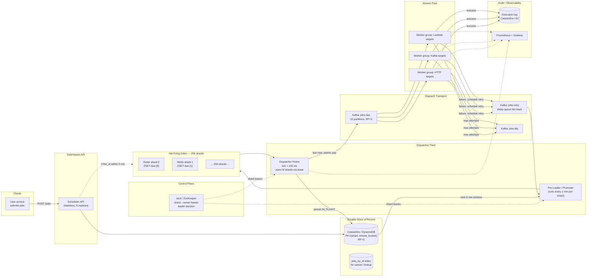
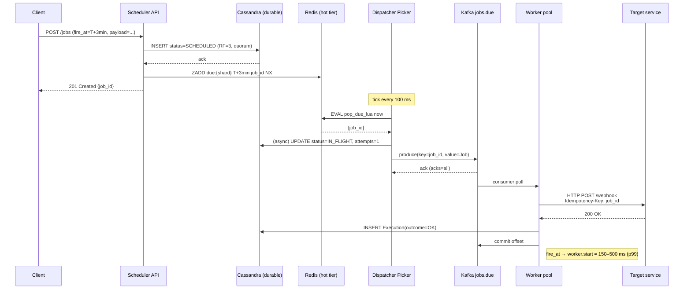

# Design a High-Precision Distributed Job Scheduler (10K jobs/sec, ±2s)

> **Difficulty:** Hard &nbsp;|&nbsp; **Frequency:** ★★★★☆ &nbsp;|&nbsp; **Companies:** Uber (Cadence/Cherami), Netflix (Dynein), Airbnb (Chronos/Dynein), Stripe (scheduler), LinkedIn, Google (Borg/Cron), Amazon, Meta, Flipkart, Swiggy, Zomato, fintechs (scheduled payments / EMIs / reminders).
>
> **Real-world analogues:** Scheduled payments (EMIs, subscription renewals), reminder/notification services, retry-after-backoff queues, TTL-expiry deliveries, alarm clocks, SLA timers, follow-up callbacks, "send this email at 9am local time", Uber/Ola "schedule ride", Zomato/Swiggy "schedule order", DoorDash "deliver at X", Slack reminders, Google Calendar nudges.

---

## Table of Contents

1. [Problem Statement](#1-problem-statement)
2. [Clarifying Questions](#2-clarifying-questions-always-ask-these-first)
3. [Requirements (FR + NFR)](#3-requirements)
4. [Capacity Estimation](#4-capacity-estimation-back-of-the-envelope)
5. [The Precision / Latency Budget — The Heart of the Problem](#5-the-precision--latency-budget--the-heart-of-the-problem)
6. [Why *Not* Kafka / SQS / RabbitMQ Alone](#6-why-not-kafka--sqs--rabbitmq-alone)
7. [Data Model](#7-data-model)
8. [High-Level Architecture (HLD)](#8-high-level-architecture-hld)
9. [Component Deep-Dives](#9-component-deep-dives)
10. [Dispatcher Algorithm & Shard Ownership](#10-dispatcher-algorithm--shard-ownership)
11. [End-to-End Flow](#11-end-to-end-flow)
12. [Precision: Sources of Jitter & Mitigations](#12-precision-sources-of-jitter--mitigations)
13. [Scaling, Partitioning & Fault Tolerance](#13-scaling-partitioning--fault-tolerance)
14. [Recurring Jobs, Cancellation, Update](#14-recurring-jobs-cancellation-update)
15. [Edge Cases & Gotchas](#15-edge-cases--gotchas)
16. [Security, Multi-Tenancy, Quotas](#16-security-multi-tenancy-quotas)
17. [Observability](#17-observability)
18. [Technology Choices — Final Verdict](#18-technology-choices--final-verdict)
19. [Extensions the Interviewer Will Push On](#19-extensions-the-interviewer-will-push-on)
20. [Interview One-Liner](#20-interview-one-liner)
21. [Q&A Defense — Top 22 Tough Interview Questions](#21-qa-defense--top-22-tough-interview-questions)

---

## 1. Problem Statement

Design a distributed job scheduler that accepts millions of future-dated jobs and fires them at (or very close to) their scheduled time.

**Concrete SLOs:**

- **Throughput:** sustain **10,000 jobs/sec** being *dispatched* (average), peak 3–4× that.
- **Precision:** every job must **begin execution within 2 seconds** of its `fire_at` timestamp — p99.
- **Durability:** once accepted, a job **must eventually run** (at-least-once). Power failure of any component must not lose jobs.
- **Scale of state:** 100s of millions to billions of jobs in flight (scheduled minutes to months out).

The end-to-end clock includes **network latency, DB access, queue hops, worker pickup, and the executor's own startup time** — they all have to fit inside the 2-second budget.

> This is a *time-accuracy* problem, not just a throughput problem. A regular "background job queue" (Sidekiq / Celery / SQS) cannot guarantee *when* a job runs — only that it runs "eventually". That distinction drives every design choice below.

---

## 2. Clarifying Questions (always ask these first)

You'll score points for asking these *before* drawing boxes:

1. **What does "2 seconds" mean exactly?** `fire_at → worker starts execution`, or `fire_at → job finishes`? → *Worker **starts** execution (p99).*
2. **Future horizon?** Seconds-out to months-out? → *Seconds to 90 days.*
3. **Recurring jobs (cron-style) or one-shot only?** → *Both; recurring computed as "emit next occurrence after execution".*
4. **Can a job be cancelled / rescheduled after submission?** → *Yes, up until ~1 second before `fire_at`.*
5. **Exactly-once or at-least-once execution?** → *At-least-once at the transport; **idempotent** at the executor (job_id is the idempotency key).*
6. **Time zones?** → *Store `fire_at` as absolute UTC epoch-ms; recurring rules carry a timezone string, expansion happens on submit & on reschedule.*
7. **Job payload size?** → *Small (≤ 64 KB). Anything bigger is stored externally (S3) and referenced by URL.*
8. **Who executes the jobs?** → *Remote workers — could be HTTP callbacks, Lambdas, Kafka consumers, or internal microservices. Scheduler's job ends at "dispatched".*
9. **Multi-tenant?** → *Yes, with per-tenant quotas and fairness.*
10. **Failure semantics** — if a worker fails, retry? How many times? → *Configurable (default 3 retries, exponential backoff capped at 5 min); after max, DLQ.*
11. **Ordering across jobs?** → *No global ordering; same `fire_at` jobs fire concurrently.*
12. **Max skew between scheduler time and worker time?** → *Assume NTP-synced nodes within ±50 ms. Scheduler owns "now".*
13. **Read patterns beyond dispatch?** → *Yes: list jobs by tenant, by status, by fire_at window.*

---

## 3. Requirements

### 3.1 Functional

- **F1.** `POST /jobs` — create a one-shot or recurring job with `fire_at`, `target`, `payload`, retry policy.
- **F2.** `DELETE /jobs/{id}` / `PATCH /jobs/{id}` — cancel or reschedule (best-effort until ~1 s before fire).
- **F3.** `GET /jobs/{id}` — status and execution history.
- **F4.** Dispatch each job to its configured **target** (HTTP webhook, Kafka topic, gRPC method, Lambda) within the SLO.
- **F5.** On worker failure (non-2xx, timeout, thrown exception), retry per policy; on exhaustion, push to DLQ + notify owner.
- **F6.** For recurring jobs, enqueue the **next** occurrence as soon as the current one is dispatched.
- **F7.** Replayable/audit log: who scheduled what, when it fired, every retry.

### 3.2 Non-Functional

| Attribute        | Target                                                                       |
|------------------|------------------------------------------------------------------------------|
| Throughput       | 10K dispatch/s average; 40K/s peak (4× burst — e.g., "midnight EMIs")        |
| **Precision**    | **p99 ≤ 2 s** between `fire_at` and `worker.start`; p50 ≤ 300 ms             |
| Durability       | No loss after `201 Created`; RF=3 on all durable stores                      |
| Availability     | 99.95% for both submission and dispatch                                      |
| Scalability      | Horizontally scalable at every layer; no global mutex                         |
| Consistency      | Read-your-write on submit; at-least-once dispatch; idempotent execution       |
| Tenant isolation | Per-tenant quotas; noisy neighbor doesn't starve others                       |
| Replay / backfill| Can re-run the last N days of jobs without causing duplicate business actions (executor idempotency) |

---

## 4. Capacity Estimation (back of the envelope)

| Metric                                   | Calculation                                             | Value                       |
|------------------------------------------|---------------------------------------------------------|-----------------------------|
| Dispatch rate (avg)                      | stated                                                  | **10,000 /s**               |
| Dispatch rate (peak burst)               | 4× avg                                                  | **40,000 /s**               |
| Submission rate                          | ≈ dispatch rate (plus recurring re-inserts)             | ~10–20K /s                  |
| Jobs in flight at any time (seconds-out) | 10K/s × 90 days                                         | ~**75 B jobs**              |
| Realistic in-flight (most jobs near-term)| Heavy tailed; 90% within next 24h                       | ~**1–5 B** hot             |
| Row size (job + metadata)                | ~500 B                                                  | 500 B                       |
| **Durable store size**                    | 5B × 500 B                                              | **~2.5 TB** (shard it)      |
| "Due in next 5 min" hot window           | 10K/s × 300 s                                           | **3 M jobs**                |
| Hot-tier RAM                             | 3M × 200 B (just id + fire_at + ptr)                    | **~600 MB** (easily Redis)  |
| Kafka partitions for `jobs.due`          | peak / ~5K per-partition sustainable                    | **16–32**                   |
| Dispatcher shards                        | 256 (hash-partition of job_id)                          | 256                         |
| Dispatcher pods                          | 256 shards × 1 owner + 256 standby ≈ 32 pods × 8 shards | ~**32 pods**                |
| Worker pool                              | 10K dispatch × 100 ms avg work / 8 cores                | ~**128 cores** (lower bound)|

Nothing exotic — this fits on a ~40-node cluster plus a small Redis cluster and a Kafka cluster you probably already have.

---

## 5. The Precision / Latency Budget — The Heart of the Problem

**Total budget: 2,000 ms from `fire_at` to `worker.start`.** Spend it explicitly — if you can't justify where every millisecond goes, you'll miss the SLO in production.

| Stage                                                 | Target  | p99   | Notes                                                                 |
|-------------------------------------------------------|---------|-------|-----------------------------------------------------------------------|
| **Scheduler tick quantization** (picker runs every T) | 100 ms  | 100ms | Pick T small; T is the *minimum* precision floor. We pick **T = 100 ms**. |
| Hot-tier read (Redis `ZRANGEBYSCORE` + Lua pop)       | 2 ms    | 10 ms | In-VPC Redis; pipeline it.                                             |
| DB status update (mark `IN_FLIGHT`)                   | 5 ms    | 25 ms | Async / batched; **not** on the critical path (optimistic: flip in Redis, persist async). |
| Dispatcher → Kafka produce (`acks=all`)                | 5 ms    | 20 ms | `linger.ms=2`, `batch.size=16KB`, `compression=lz4`.                   |
| Kafka commit / replication                            | 5 ms    | 30 ms | RF=3, in-AZ; `min.insync.replicas=2`.                                  |
| Worker Kafka poll + fetch                             | 20 ms   | 100 ms| `fetch.max.wait.ms=20`, `fetch.min.bytes=1`, **low-latency consumer**. |
| Worker deserialize + dispatch to target               | 5 ms    | 30 ms |                                                                       |
| Network hop to target (HTTP webhook case)             | 20 ms   | 200 ms| The *tenant's* service — biggest unknown. Bounded by connect timeout.  |
| **TOTAL overhead**                                    | ~160 ms | **~500 ms** | Leaves **1.5 s** of headroom for GC pauses, retries, queue depth.    |

**Key insight — the 100 ms tick is the floor.** If you run the dispatcher every 1 second, you have already spent half your budget on quantization alone. That's why hierarchical timer wheels (see §9.3) or a 100-ms ZSET tick are used rather than classic cron.

### 5.1 What blows this budget in practice

- **GC pauses** on JVM dispatchers — use **ZGC / Shenandoah / G1 with small heap**, or write the dispatcher in Go / Rust.
- **Kafka consumer `max.poll.interval` too high** — default is 5 min, but your *fetch wait* is what matters; set `fetch.max.wait.ms` low.
- **Single Redis instance becoming CPU-bound** — shard the ZSET across N Redis nodes (one per dispatcher shard).
- **Thundering herd at the top of the minute** — apply **jitter** at ingest (see §12).
- **Worker scale-from-zero** (Lambda cold start) — keep a warm worker pool; never rely on cold start for time-critical executions.

---

## 6. Why *Not* Kafka / SQS / RabbitMQ Alone

The interviewer will press you on this. Here's the honest comparison:

| Candidate                                   | Native "fire at T" | Throughput | Cancel / update | Precision | Verdict as **scheduler** |
|---------------------------------------------|---------------------|------------|------------------|-----------|---------------------------|
| **Kafka**                                   | ❌ no delay API; would need "topic-per-delay-bucket" hack | Massive | ❌ can't mutate a record | Great for dispatch, poor for delay | **Not a scheduler.** Use Kafka as the *dispatch channel* only. |
| **SQS (delay queues / `DelaySeconds`)**      | ✅ up to **15 min** only | 3K/s per queue (std), higher with sharding | ❌ no cancel/update | ~ seconds | OK for **last-mile** dispatch (inside the 15-min window), not a general scheduler. |
| **RabbitMQ (TTL + DLX, or `rabbitmq_delayed_message_exchange`)** | ✅ via plugin | Good until ~100K in-flight, then plugin is memory-bound | ❌ awkward to cancel | ~ seconds | OK for modest scale; struggles at billions of scheduled jobs. |
| **Redis ZSET (score = `fire_at_ms`)**        | ✅ native `ZADD` + `ZRANGEBYSCORE` | ~100K ops/s per shard | ✅ `ZREM` by id | **10 ms** with 100-ms tick | ✅ **Hot-tier scheduler index** — this is the core idea. |
| **Hierarchical Timer Wheel (in-process)**    | ✅ ms-precision | CPU-bound | ✅ cancel via entry pointer | **1 ms**  | ✅ Alternative in-process hot tier for each dispatcher shard. |
| **Cassandra / DynamoDB / Postgres (partitioned by time bucket)** | ✅ scan a bucket | Massive durable | ✅ delete row | Dependent on scan frequency | ✅ **Durable store of record**, not the firing index. |
| **Cron clustered (Quartz JDBC)**             | ✅ | Moderate; DB-bound | ✅ | ~ seconds | Works up to ~1K/s; falls over past that. |
| **Temporal / Cadence**                      | ✅ durable timers | High (Uber runs at scale) | ✅ | ~ seconds | Excellent for *workflows*, heavier than needed for pure scheduling. |

**Final decision:**

- **Durable store of record:** Cassandra / DynamoDB (or sharded Postgres) — partitioned by time bucket.
- **Hot firing index:** **Redis ZSET sharded 256 ways**, each shard owned by one dispatcher pod (or hierarchical timer wheel in-process).
- **Dispatch transport to workers:** **Kafka** — because it's high-throughput, replayable, multi-consumer-group fan-out, and we need those properties once jobs become due.
- **Not Kafka for scheduling** — Kafka has no "deliver this at T" primitive, and rewriting offsets to delay is an anti-pattern.

---

## 7. Data Model

### 7.1 Job record (canonical, stored in durable store)

```
Job {
  string   job_id             // UUIDv7 — lexically sortable by time, good shard key
  string   tenant_id
  long     fire_at_ms          // UTC epoch ms — the scheduled time
  long     fire_at_bucket      // floor(fire_at_ms / 60_000)  — minute bucket for range scans
  int      shard               // hash(job_id) % 256 — deterministic
  string   target_type         // "http" | "kafka" | "grpc" | "lambda"
  string   target_addr         // URL / topic / function ARN
  bytes    payload             // ≤ 64 KB, else payload_ref -> S3
  string   idempotency_key     // typically == job_id; tenant may override
  // Retry policy
  int      max_attempts
  string   backoff             // "exp:1s:5m" or "fixed:30s"
  // Recurrence (null for one-shot)
  string   cron_expr           // e.g. "0 9 * * *"
  string   cron_tz             // e.g. "Asia/Kolkata"
  // State
  enum     status              // SCHEDULED | IN_FLIGHT/RUNNING | SUCCEEDED | FAILED | CANCELED | DLQ
  int      attempts
  long     created_at_ms
  long     updated_at_ms
  long     last_fired_at_ms
  string   last_error
  // Executor lease (required by §10.6 — heartbeat-extended, sweeper-checked)
  string   lease_owner         // e.g. "executor-pod-7-uuid" — NULL when not RUNNING
  long     lease_until_ms      // absolute wall-clock deadline (UTC epoch ms); NULL when not RUNNING
}
```

> **Postgres DDL form** (matches the canonical record above; this is the migration the V2 design assumes is already applied):
>
> ```sql
> ALTER TABLE jobs
>   ADD COLUMN lease_owner   text,         -- e.g. "executor-pod-7-uuid"
>   ADD COLUMN lease_until   timestamptz;  -- absolute wall-clock deadline
>
> -- Index used by the Stuck-IN_FLIGHT Sweeper (§10.5) — partial index keeps it tiny:
> CREATE INDEX jobs_running_lease_idx
>   ON jobs (shard, lease_until)
>   WHERE status = 'RUNNING';
> ```
>
> Both columns are `NULL` for any non-`RUNNING` row (the executor clears them on terminal write — see §10.6.3, step 4). The CAS guard `AND lease_owner = :me` in heartbeat / terminal writes (§10.6.7) is what makes preemption safe.

### 7.2 Partitioning

- **Durable store:** partition key = `(shard, fire_at_bucket)`; sort key = `(fire_at_ms, job_id)`.
  - 256 shards × 1-minute buckets → pre-loader can scan exactly one partition per shard per minute.
  - `job_id` lookups use a secondary index or a `jobs_by_id` table.
- **Redis hot tier (one ZSET per shard):** key = `due:{shard}`, score = `fire_at_ms`, member = `job_id` (with payload fetched from durable store OR inlined in a sibling HSET `job:{job_id}` for lowest-latency dispatch).

### 7.3 Audit / execution log

```
Execution {
  string   execution_id        // UUID
  string   job_id
  int      attempt
  long     dispatched_at_ms
  long     target_started_at_ms
  long     finished_at_ms
  enum     outcome              // OK | HTTP_4XX | HTTP_5XX | TIMEOUT | EXCEPTION
  string   result_summary
}
```

Written append-only to a dedicated table / Kafka topic `jobs.executions` for forensics, SLO dashboards, retries.

---

## 8. High-Level Architecture (HLD)

> **Editable sources:**
>
> - [`assets/03-job-scheduler-hld.drawio`](./assets/03-job-scheduler-hld.drawio) — production-grade design (Cassandra durable store + Redis ZSET hot tier + etcd shard leases + Kafka dispatch).
> - [`assets/03-job-scheduler-whiteboard.drawio`](./assets/03-job-scheduler-whiteboard.drawio) — simpler whiteboard-style recreation (Postgres + watcher polling + Kafka topics + Redis cancel cache); good for the easier interview narrative.
>
> Open in [diagrams.net](https://app.diagrams.net/) (`File → Open from device`) or with the *Draw.io Integration* extension in Cursor/VS Code.

### 8.1 Overview diagram (Mermaid)



### 8.2 Layered view (ASCII, for a quick whiteboard)

```
┌──────────────────────────────────────────────────────────────────────────────┐
│                HIGH-PRECISION DISTRIBUTED JOB SCHEDULER                      │
│                                                                              │
│  ┌────────────┐     POST /jobs                                               │
│  │  Client    │──────────────────────►┌────────────────────┐                 │
│  └────────────┘                       │  Scheduler API     │                 │
│                                       │  (stateless)       │                 │
│                                       └────────┬───────────┘                 │
│                                                │ write-through                │
│                          ┌─────────────────────┼──────────────────────┐      │
│                          ▼                     ▼                      │      │
│            ┌──────────────────────┐  ┌─────────────────────┐          │      │
│            │ Durable: Cassandra   │  │ Hot tier (if ≤5min) │          │      │
│            │ PK=(shard, minute)   │  │ Redis ZSET per shard│          │      │
│            │ source of truth      │  └─────────┬───────────┘          │      │
│            └──────────┬───────────┘            │                      │      │
│                       │ scan next-5-min        │                      │      │
│                       ▼                        ▼                      │      │
│             ┌───────────────────────────────────────┐                 │      │
│             │  Dispatcher Pod (owns shards S1..Sk)  │◄──etcd lease────┘      │
│             │   Pre-loader  →  Picker (tick=100ms)  │                        │
│             │   Lua: ZRANGEBYSCORE + ZREM atomic    │                        │
│             └───────────────────┬───────────────────┘                        │
│                                 │ produce key=job_id                         │
│                                 ▼                                            │
│                    ┌─────────────────────────┐                               │
│                    │ Kafka: jobs.due         │  32 partitions, RF=3          │
│                    └────────────┬────────────┘                               │
│                                 │                                            │
│                  ┌──────────────┼──────────────┐                             │
│                  ▼              ▼              ▼                             │
│              ┌──────┐       ┌──────┐       ┌──────┐                          │
│              │ HTTP │       │Kafka │       │Lambda│   Worker pools by        │
│              │ pool │       │ pool │       │ pool │   target type            │
│              └───┬──┘       └───┬──┘       └───┬──┘                          │
│                  │  success     │              │                             │
│                  ▼              ▼              ▼                             │
│        ┌────────────────────────────────────────────┐                        │
│        │  Execution log (append-only Cassandra/S3)  │                        │
│        └────────────────────────────────────────────┘                        │
│                  │  failure → jobs.retry (scheduled)                         │
│                  └─► Loader re-materializes into hot tier                    │
│                                                                              │
│                  └─► exhausted → jobs.dlq                                    │
└──────────────────────────────────────────────────────────────────────────────┘
```

---

## 9. Component Deep-Dives

### 9.1 Submission API

- Stateless Java/Go service behind an L7 load balancer; auth via mTLS or OAuth2 client credentials.
- On `POST /jobs`:
  1. Validate (size, future `fire_at`, cron parseable, target reachable per tenant allowlist).
  2. Compute `shard = hash(job_id) % 256`, `fire_at_bucket = fire_at_ms / 60_000`.
  3. **Write to durable store** (`acks = quorum`) — this is the point of durability. Return `201 Created` only after this ack.
  4. **If `fire_at - now ≤ 5 min`** (the hot-tier horizon), also `ZADD due:{shard} fire_at_ms job_id` in Redis so the picker sees it without waiting for the loader. Best-effort; the loader will catch it anyway.
- Recurring submit: compute the *next* `fire_at_ms` from cron + timezone, store both the cron rule and the next occurrence; never materialize all future occurrences up-front.

### 9.2 Durable Store (source of truth)

**Choice: Cassandra / DynamoDB (or sharded Postgres).**

Schema (Cassandra):

```
CREATE TABLE jobs_due_bucket (
    shard          int,
    fire_minute    bigint,       -- epoch minutes
    fire_at_ms     bigint,
    job_id         uuid,
    tenant_id      text,
    target_type    text,
    target_addr    text,
    payload        blob,
    status         text,
    attempts       int,
    max_attempts   int,
    cron_expr      text,
    cron_tz        text,
    ...
    PRIMARY KEY ((shard, fire_minute), fire_at_ms, job_id)
) WITH CLUSTERING ORDER BY (fire_at_ms ASC, job_id ASC);

CREATE TABLE jobs_by_id (
    job_id   uuid PRIMARY KEY,
    shard    int,
    fire_minute bigint,
    ...
);
```

**Why this partitioning works:**

- Pre-loader scan = `SELECT ... WHERE shard = ? AND fire_minute IN (?, ?, ?, ?, ?)` — five partition reads per shard per minute = bounded and fast.
- 256 shards × ~400 jobs/min/shard at avg load = ~100K jobs/min total: read-light, write-light per partition.
- No hot partition because `fire_at_bucket` rotates every minute — unless everyone schedules at "midnight IST"; see §12 on jitter.

**Why not Kafka as the store?** Kafka is append-only and can't answer "give me everything due between T1 and T2 for shard S" without scanning the entire log. It's a transport, not a database.

### 9.3 Hot Firing Index (Redis ZSET per shard, or Timer Wheel)

Two variants — pick one, understand both.

**Variant A — Redis ZSET (recommended for simplicity):**

- One ZSET per shard: `due:{0}`, `due:{1}`, …, `due:{255}`.
- Score = `fire_at_ms`, member = `job_id` (or packed `job_id|target_type` for one-hop dispatch).
- Atomic "pop all due" via **Lua script** running inside Redis:

```lua
-- KEYS[1] = "due:{shard}"
-- ARGV[1] = now_ms
-- ARGV[2] = max_batch (e.g., 1000)
local due = redis.call('ZRANGEBYSCORE', KEYS[1], '-inf', ARGV[1], 'LIMIT', 0, ARGV[2])
if #due > 0 then
  redis.call('ZREM', KEYS[1], unpack(due))
end
return due
```

That single Lua call is the **atomic "fire now"** primitive: everything returned is guaranteed to be removed from the index, so no two dispatcher replicas can dispatch the same job.

- Redis cluster: one shard per master, each master with a replica. Picker pods **always talk to the master they own** (via the shard→owner lease in etcd).
- Sized at ~3M entries in the busiest 5-min window → ~600 MB RAM — fits on a single Redis node per shard; even at 256 shards you need only a handful of Redis machines with multi-tenant shards co-located.

**Variant B — Hierarchical Timer Wheel (per-dispatcher, in-process):**

Inspired by Varghese & Lauck's "Hashed and Hierarchical Timing Wheels" and used by Kafka's producer purgatory / Netty.

```
Tier 0: 1000 slots × 1 ms   ← covers next 1 s (sub-second precision)
Tier 1: 60 slots   × 1 s    ← covers next 60 s
Tier 2: 60 slots   × 1 min  ← covers next 60 min
Tier 3: 24 slots   × 1 h    ← covers next 24 h
```

- O(1) insert, O(1) tick, O(1) cancel (via slot-linked-list entry pointer).
- Use when you want **sub-100-ms precision** and can afford keeping hot jobs in-process.
- Trade-off: in-process state is **volatile** — the durable store remains the source of truth; on pod restart, the loader rebuilds the wheel from the next-N-min partition scan.

We pick **Variant A** as the default because Redis provides cross-replica visibility and survives dispatcher pod restarts without needing the rebuild handshake.

### 9.4 Pre-Loader / Promoter

Runs inside every dispatcher pod (or as a separate sidecar), once per minute per owned shard:

```
for each shard owned by this pod:
    rows = db.scan(
        shard = S,
        fire_minute IN [now_minute, now_minute+1, ..., now_minute+4]   // look ahead 5 min
    )
    pipeline:
        for row in rows:
            if row.status == SCHEDULED:
                ZADD due:{S} row.fire_at_ms row.job_id NX
```

Notes:

- `NX` ensures idempotency — if another loader already promoted the job, don't overwrite.
- **5-minute look-ahead** is deliberate: even if the loader is delayed or the shard failed over, jobs for the *current* minute are already in the hot tier; the loader only has to stay 4 minutes ahead of "now".
- Payload doesn't have to sit in Redis — only `job_id`. The dispatcher fetches the payload lazily from the durable store (or from a sibling Redis HSET), trading RAM for one extra 2-ms hop. At 10K jobs/s this is fine.

### 9.5 Dispatcher Picker

The precision-critical piece.

```
every 100 ms:
    for each shard owned by this pod:
        due_ids = redis.eval(pop_due_lua, "due:{shard}", now_ms, 1000)
        if due_ids.empty(): continue
        batch = db.mget(due_ids)            // fetch payloads
        for job in batch:
            producer.send("jobs.due", key=job.job_id, value=serialize(job))
        db.bulkUpdate(due_ids, status=IN_FLIGHT, attempt=attempt+1)  // async
```

Critical tuning:

- **Tick = 100 ms** (not 1 s) — sets the minimum precision floor at 100 ms.
- **Kafka producer**: `acks=all`, `linger.ms=2`, `batch.size=16KB`, `compression=lz4`, `max.in.flight.requests.per.connection=5`, `enable.idempotence=true`.
- **`IN_FLIGHT` write to DB is async** — its purpose is visibility and crash recovery, not blocking dispatch. If the pod crashes between ZREM and DB update, the job is on Kafka (will execute) but DB still shows `SCHEDULED`; the recovery sweep reconciles.
- **Rate-limit per shard** — token bucket prevents one runaway tenant from starving others; per-tenant quota enforced by the API at submit time, not at dispatch time.

### 9.6 Dispatch Transport (Kafka `jobs.due`)

- 32 partitions (keyed by `job_id`), RF=3, retention 1 day (we don't replay dispatches; we replay from durable store instead).
- One consumer group per worker *type* (HTTP, Kafka-forward, Lambda, gRPC) — Kafka's fan-out handles multi-target routing naturally.
- Low-latency consumer tuning:
  - `fetch.max.wait.ms = 20`, `fetch.min.bytes = 1`
  - `max.poll.interval.ms = 30_000`, `max.poll.records = 100`
  - Keep the consumer **polling loop tight**: no blocking work inside `poll()`; dispatch to a thread pool.

### 9.7 Workers

- Small, stateless pods organized into pools by target type.
- Per-job flow:
  1. Deserialize.
  2. Honor `idempotency_key` — in the HTTP adapter, send as `Idempotency-Key` header; for Kafka targets, use it as the message key; for Lambda, as the client token.
  3. Dispatch with **aggressive timeouts**: `connect=1s`, `read=10s` (job-configurable, but always bounded).
  4. On 2xx/success: append to execution log, commit Kafka offset.
  5. On failure: decide retry vs DLQ based on `attempts < max_attempts`; produce to `jobs.retry` with `next_fire_at = now + backoff(attempts)`.
- Workers **never** write to the hot tier directly — retries go through the durable store path so precision is uniform.

### 9.8 Retry path

- `jobs.retry` is a Kafka topic consumed by a small "retry loader" service that just writes the job (with its new `fire_at`) back into the durable store and (if within 5 min) the hot tier.
- Exponential backoff capped at 5 min means retries naturally re-enter the hot tier via the loader.

---

## 10. Dispatcher Algorithm & Shard Ownership

### 10.1 Why 256 shards

- `shard = hash(job_id) % 256` → deterministic, stateless on the client path.
- 256 is chosen so:
  - A single dispatcher pod can comfortably own 8–16 shards (at 10K/s total, that's ~600 jobs/s per shard — trivial).
  - Failover reassigns only a fraction of traffic when one pod dies.
  - The Redis footprint per shard (~600 MB) fits on a modest node.

### 10.2 Leader election / shard leases via etcd

- Every dispatcher pod tries to acquire leases `scheduler/shard/{i}` for some range of `i`.
- Lease TTL = **3 seconds**, heartbeat every 1 s.
- If a pod dies, another pod can acquire the lease after TTL expiry → **worst-case 3-s scheduling gap** for that shard's jobs. Because we have a 2-s budget *per job*, a 3-s failover gap may miss some jobs' SLOs — but jobs aren't lost (durable store), just late. Acceptable with `99.95%` availability because failovers are rare.
- Tight SLO? Use **primary-and-hot-standby** pattern: two pods co-own each shard, only the primary picks; the standby tails Redis and steps up on lease loss in <500 ms.
- Rebalancer: watches pod count changes, shifts leases minimally (consistent-hashing-over-pods style) so we don't reshuffle everything when one pod joins.

### 10.3 Why not have every pod pick every shard

Because then **two pods can race** on the same Redis shard, causing duplicate dispatches. The `ZREM` in the Lua pop makes this safe per-member, but:

- You'd N-way fan-out the Redis load (N = replica count).
- You'd N-way the DB status writes.

Owning a shard means one Redis connection, one stream of produces, clean metrics, and no self-contention.

### 10.4 Cold start / recovery

On pod start (or after taking over a shard):

1. Acquire lease.
2. **Bounded rebuild**: read `jobs_due_bucket` for this shard for the next 5 minutes and re-`ZADD NX` any `SCHEDULED` rows whose `job_id` isn't already in the ZSET. Redis already has them if a prior owner loaded them, so the rebuild is nearly a no-op in the happy case.
3. Start ticking.

### 10.5 "Stuck `IN_FLIGHT`" sweeper

The Sweeper is the **reaper that turns dead leases back into work** — the only mechanism in the design that guarantees a crashed executor's job will eventually be retried, *without* falsely killing legitimately long-running jobs. It is the at-least-once safety net for everything that happens after the Picker's `ZREM`.

#### 10.5.1 What the V2 drawio box says (verbatim)

```
Stuck-IN_FLIGHT Sweeper
━━━━━━━━━━━━━━
every N min:
  status = RUNNING AND
  lease_until < now
  → reset to SCHEDULED
     (attempts++)

Lease, not 15s timer.
```

Key invariant #6 in the same diagram repeats the point: *"Lease + heartbeat for stuck jobs, NOT a 15-s wall clock"*.

#### 10.5.2 What it does — mechanically

A background process (one owner per shard, leased through etcd, like every other shard-bound role in the system) wakes up **every N minutes** and runs essentially:

```sql
UPDATE jobs
   SET status      = 'SCHEDULED',
       attempts    = attempts + 1,
       fire_at     = now() + backoff(attempts),
       lease_until = NULL,
       lease_owner = NULL
 WHERE status      = 'RUNNING'           -- aka IN_FLIGHT
   AND lease_until < now()               -- the executor's lease has expired
   AND shard       = :owned_shard;
```

Anything it flips back to `SCHEDULED` is then rediscovered by the **Watcher** on its next 1-minute tick → re-promoted into the Redis `ZSET` → re-dispatched through the normal hot path. The sweeper itself **never** touches Redis or Kafka — it only resets state in the source-of-truth Postgres row.

#### 10.5.3 What it actually catches

It closes the gaps that the **outbox + idempotent producer** do *not* cover. Outbox solves only the *submit → Kafka* half (it kills "stuck QUEUED" rows on the produce side). Once the executor has the job, there is no transactional way to bind "user code completed" to "DB row updated" to "Kafka offset committed" — so the system's contract is **at-least-once with bounded recovery time**, and the sweeper is what enforces the bound.

The four executor-side failure modes it covers:

1. **Executor pod crashes mid-run.** It claimed the job (`status=RUNNING`, `lease_until=now+60s`), started executing, then the pod died. No one is heartbeating the lease anymore. After `lease_until` expires, the row is "stuck" — the sweeper re-promotes it.
2. **Executor hangs / GC pause / network partition.** Alive but not heartbeating → lease expires → sweeper re-promotes. When the original eventually wakes up and tries to write `SUCCEEDED`, the CAS on `status=RUNNING AND lease_owner=me` fails, so the duplicate execution side-effect is bounded by the executor's `idempotency_key = job_id`.
3. **Dispatcher crashed between `ZREM` and the Kafka produce** (or before the async DB write to `RUNNING`). The job is now "lost": not in Redis, not on Kafka, sitting at `SCHEDULED` (or already `RUNNING` but never picked up). The sweeper plus the Watcher's 1-min scan re-promotes it.
4. **Worker `SUCCEEDED` write to DB failed but Kafka offset committed.** Row stays `RUNNING` past `lease_until` — sweeper re-promotes; executor idempotency dedupes the rerun on the target.

#### 10.5.4 Why "lease, not 15-s timer" — the whole point

A naive scheduler uses a fixed wall-clock threshold like *"if it's been RUNNING for >15 s, restart it"*. That is wrong because it cannot distinguish **stuck** from **legitimately long-running**:

| Without lease (wall-clock)                              | With lease + heartbeat                                                                  |
| ------------------------------------------------------- | --------------------------------------------------------------------------------------- |
| 30-min ETL job → killed and re-fired every 15 s         | Executor heartbeats every 10 s, extends `lease_until = now + 60 s` → stays alive        |
| Crashed pod → caught only after the global threshold    | Crashed pod stops heartbeating → `lease_until` expires within one lease window          |
| One global tunable for all jobs                         | Per-job lease duration; long jobs simply renew                                          |

So the rule is:

- **Long-running, healthy job** → keeps extending its lease → sweeper never touches it.
- **Crashed / hung executor** → lease decays → sweeper re-promotes it.

(See §10.6 for the full lease + heartbeat protocol — pseudocode, timelines, common expiry reasons. §21 Q7 has the interview-defense one-liner.)

#### 10.5.5 Why it is still required *despite* outbox + idempotent producer + executor idempotency key

People hear "outbox + idempotent producer + idempotency key = exactly-once" and assume the sweeper is redundant. It is not — those three solve **different parts of the pipeline**:

| Mechanism                            | Closes the gap…                                            |
| ------------------------------------ | ---------------------------------------------------------- |
| Transactional outbox                 | between Postgres commit and Kafka produce                  |
| Idempotent Kafka producer (`acks=all`, `enable.idempotence=true`) | between produce attempts on the wire                       |
| Executor-side `idempotency_key = job_id` | duplicate side-effects on the *target* of a re-fire        |
| **Stuck-IN_FLIGHT Sweeper**          | **executor crashes / hangs / partial writes after claim**  |

Without the sweeper, a crashed executor's row stays `RUNNING` forever and the job silently never executes again.

#### 10.5.6 Where it sits in V2

- It owns its shard via an **etcd lease** — same control-plane mechanism as Watcher / Picker / Outbox Publisher / Cron Emitter (Q11, §21).
- It only touches **Postgres** (the source of truth). It does *not* read or write Redis or Kafka directly — it just resets state, and the existing Watcher → ZSET → Picker → Kafka path handles the actual re-dispatch.
- Cadence (`N` minutes) is a tradeoff: shorter = faster recovery but more wasted scans; **typical setting 1–5 min** for the SLO this design targets. It is **not** on the critical latency path — the lease window already bounds time-to-detection.
- For ordering-on-`fire_at` correctness, the sweeper writes `fire_at = now() + backoff(attempts)` so retried jobs get a fresh score in the ZSET on re-promotion (rather than re-firing in the past).

#### 10.5.7 Tuning checklist

- `lease_duration` ≥ p99 expected runtime of the job class. Too short → false re-fires (which idempotency tolerates but burns target capacity); too long → slow detection of real crashes.
- `heartbeat_interval` ≤ `lease_duration / 3`. Standard rule (TTL/3) so a single missed heartbeat does not kill the lease.
- Sweeper cadence ≤ 1 min for SLO-sensitive tenants; 5 min is fine for batch.
- Backoff on `attempts` — exponential with jitter — to avoid thundering-herd retries across a shard after a mass executor failure.
- Cap `attempts`. After `max_attempts` the sweeper should route to **DLQ** (`scheduler.dlq` in V2), not loop forever.

---

### 10.6 Executor Lease & Heartbeat Protocol — How a long-running job stays alive

The Sweeper (§10.5) is half the story. The other half is the executor's **heartbeat protocol** — the only thing that keeps the lease alive while user code runs. The single most common point of confusion is *"how does a long-running task update its lease?"* The answer is: **it doesn't. A separate thread does, in the background.**

#### 10.6.1 Mental model — in one sentence

> The job has **two threads inside the executor pod**: the **worker thread** running the user payload, and the **heartbeat thread** doing nothing but `UPDATE jobs SET lease_until = now()+60s WHERE id=? AND lease_owner=me` every 10 seconds.

The user code never thinks about the lease. It just runs. The heartbeat thread runs in parallel and keeps the lease fresh. *That's the entire trick.*

#### 10.6.2 What "the lease" actually is

It is just two columns on the `jobs` row in Postgres — defined in the canonical Job record in **§7.1** and added by the migration shown there:

```sql
-- (already in §7.1; reproduced here for context)
ALTER TABLE jobs
  ADD COLUMN lease_owner   text,         -- e.g. "executor-pod-7-uuid"
  ADD COLUMN lease_until   timestamptz;  -- absolute wall-clock deadline

CREATE INDEX jobs_running_lease_idx
  ON jobs (shard, lease_until)
  WHERE status = 'RUNNING';              -- the index the Sweeper scans (§10.5)
```

So *"extending the lease"* = running an `UPDATE` that bumps `lease_until` forward. There is no daemon, no Redis lock, no fancy lease object — just a column on a row, with one partial index so the Sweeper can find expired leases in O(matches), not O(table).

#### 10.6.3 Full lifecycle in pseudocode

```java
class Executor {

    // ============ STEP 1: claim the job (CAS) ============
    Job claim(jobId) {
        int rows = pg.exec("""
            UPDATE jobs
               SET status      = 'RUNNING',
                   lease_owner = :me,
                   lease_until = now() + INTERVAL '60 seconds',
                   attempts    = attempts + 1
             WHERE id          = :jobId
               AND status      = 'QUEUED'        -- ← CAS guard
        """, me=this.podId, jobId=jobId);

        if (rows != 1) throw new ClaimLost();    // someone else got it first
        return loadJob(jobId);
    }

    // ============ STEP 2: run the job ============
    void execute(Job job) {

        // 2a) Start the heartbeat thread BEFORE running user code.
        //     This is the only thing that keeps the lease alive.
        ScheduledFuture<?> hb = scheduler.scheduleAtFixedRate(
            () -> heartbeat(job.id),
            /* initial delay */ 10, SECONDS,
            /* period         */ 10, SECONDS    // every 10 s, forever
        );

        try {
            // 2b) Run the actual user payload (1 s … 1 hour).
            //     This thread knows NOTHING about the lease.
            UserCode.run(job.payload);

            // 2c) On success, write the terminal state with another CAS.
            commitTerminal(job.id, "SUCCEEDED");

        } catch (Exception e) {
            commitTerminal(job.id, "FAILED");
        } finally {
            // 2d) STOP the heartbeat thread.
            hb.cancel(true);
        }
    }

    // ============ STEP 3: the heartbeat ============
    void heartbeat(jobId) {
        int rows = pg.exec("""
            UPDATE jobs
               SET lease_until = now() + INTERVAL '60 seconds'
             WHERE id          = :jobId
               AND lease_owner = :me            -- ← still mine?
               AND status      = 'RUNNING'
        """, me=this.podId, jobId=jobId);

        if (rows == 0) {
            // We lost the lease (sweeper re-promoted it elsewhere, or someone
            // else took it). Stop doing work — anything we write now will be
            // rejected by the terminal CAS anyway.
            UserCode.cancel();
        }
    }

    // ============ STEP 4: terminal write — CAS again ============
    void commitTerminal(jobId, finalStatus) {
        int rows = pg.exec("""
            UPDATE jobs
               SET status      = :finalStatus,
                   lease_until = NULL,
                   lease_owner = NULL
             WHERE id          = :jobId
               AND lease_owner = :me            -- ← still mine?
               AND status      = 'RUNNING'
        """, me=this.podId, finalStatus=finalStatus, jobId=jobId);

        if (rows == 0) {
            // Lease expired sometime during the run; sweeper re-promoted it.
            // Our write just became a "zombie write". Don't fight it.
            log.warn("lost lease — terminal write rejected, treating as duplicate");
        }
    }
}
```

That's the whole protocol: **five SQL statements and one timer.**

#### 10.6.4 Timeline — the happy path

A 5-minute job, with `lease_duration = 60 s` and `heartbeat_interval = 10 s`:

```
Wall clock (s):  0      10     20     30     40     50  ...  290    300
                 │      │      │      │      │      │        │      │
Worker thread:   ────────────  user code runs  ─────────────────────  done
Heartbeat thrd:  claim  HB     HB     HB     HB     HB  ...  HB     terminal
                  ↓     ↓      ↓      ↓      ↓      ↓        ↓      ↓
lease_until in   60    70     80     90    100    110  ...  350    NULL
Postgres (s):
```

At every tick, `lease_until` is **always at least 50 seconds ahead of `now()`** (worst case: just before the next heartbeat). The user code can run for hours; as long as the heartbeat thread keeps ticking, the lease never expires. *That* is the meaning of "lease, not 15-s timer" — the lease bound is on **heartbeat silence**, not on **work duration**.

#### 10.6.5 Timeline — the crash path

Same job, but the pod dies at T=120 s:

```
Wall clock (s):    0      60     120    130    140  ...  175    180
                   │      │      │      │      │         │      │
Worker thread:     ────  user code  ──── 💥 crash (no terminal write)
Heartbeat thrd:    claim  HB     HB     ✗      ✗         ✗
                    ↓     ↓      ↓
lease_until:       60    120    180        (frozen)  ─────────► EXPIRED at 180

Sweeper, T≈181:    UPDATE … SET status='SCHEDULED' WHERE lease_until < now()
                   → row goes back into the hot path
                   → re-fired by Watcher → ZSET → Picker → Kafka → new executor
```

The lease was extended to **180 s** by the last heartbeat at T=120. From T=120 to T=180 the row is technically `RUNNING` but no one is making progress — that 60-second window is the **detection latency** for a crash, and it is bounded by `lease_duration`. After T=180 the sweeper re-promotes it and a fresh executor picks it up.

#### 10.6.6 The heartbeat **must** run on a different thread / goroutine

This is the #1 implementation bug. If the heartbeat runs on the same thread as user code, **any blocking call expires your lease**. Concretely:

| Runtime | How the heartbeat must run |
|---|---|
| **Java**       | `ScheduledExecutorService` with its own thread pool (1 thread is enough) |
| **Go**         | a `time.Ticker` running in a separate goroutine |
| **Python**     | `threading.Thread` (the GIL releases during I/O — heartbeats run while `requests.post` blocks on the socket); or `asyncio.create_task` in async code |
| **Node.js**    | `setInterval` on the event loop (works because Node I/O is non-blocking — but a CPU-bound user task will still block heartbeats; use a worker thread) |
| **Rust / Tokio** | `tokio::spawn` of an `interval` task |

Putting the heartbeat *between* work units in a synchronous loop is the classic anti-pattern: every long blocking call (DNS lookup, slow target API, big file write) that exceeds `lease_duration` fires the sweeper, even though the executor is alive.

#### 10.6.7 Why the heartbeat is also a CAS (the zombie scenario)

The heartbeat `UPDATE` includes `AND lease_owner = :me`. This handles the worst case in the design:

1. Pod **A** claims at T=0, `lease_until=60`, `lease_owner=A`.
2. A's process is paused (huge GC) from T=10 to T=80 — **no heartbeats**.
3. At T≈61 the **sweeper** sees the expired lease, flips `status=SCHEDULED`.
4. Watcher → Picker → Kafka → Pod **B** claims at T=70 with `lease_owner=B`.
5. At T=80 Pod A wakes up and tries to heartbeat. Its `UPDATE` has `lease_owner=A` in the `WHERE` — **0 rows updated**. A knows it has been preempted and stops; it cancels its in-flight user code; its eventual terminal `UPDATE` will also fail the same CAS, so its work becomes a "zombie write" that never lands.

Without the `lease_owner` check A would blindly extend the lease and **two pods would run the same job concurrently** (only the executor's `idempotency_key = job_id` on the *target* would save you — and that is a weaker guarantee than CAS).

This is the same lease+heartbeat protocol §21 Q7 describes, formalised.

#### 10.6.8 Why a lease can actually expire — the 7 categories

A lease expires when the heartbeat `UPDATE` **fails to commit before `lease_until`** — which always reduces to one of these. Use this list to triage incidents and to size `lease_duration` vs `heartbeat_interval`.

##### A. Executor process is **dead** (most common)

Pod is gone, so heartbeats simply stop.

| Cause | Concrete trigger |
|---|---|
| Pod eviction               | k8s evicts on memory pressure, node drain, `cordon`, taint update |
| OOMKilled                  | container exceeds `memory.limit` — payload bigger than expected, leak in user code |
| Spot / preemption          | AWS spot reclaim, GCE preemptible 30-s notice, Azure low-priority VM |
| Node failure               | kernel panic, hardware fault, AZ outage, EC2 instance retirement |
| Rolling deploy             | replica restarted without graceful shutdown / `terminationGracePeriodSeconds` too short to release the lease |
| Crash bug                  | segfault, panic, uncaught exception in worker thread, JNI crash |
| HPA scale-down             | autoscaler removed the pod mid-run; SIGTERM ignored by executor |
| Sidecar killed             | service-mesh proxy (Envoy/Linkerd) dies; app dies via shared PID namespace |

##### B. Executor is **alive but not making progress** (paused but not crashed)

The process exists but cannot run code or the heartbeat thread.

| Cause | Concrete trigger |
|---|---|
| JVM long GC                | full GC stop-the-world > heartbeat interval — heap mis-sized, G1 RegionFailure |
| CPU throttling             | k8s `cpu.cfs_quota` exhausted — pod throttled to ~0% for hundreds of ms |
| Noisy neighbor             | another container saturates CPU / memory bandwidth / IOPS |
| Memory pressure → swap     | host swap on, heartbeat thread blocked on page-in |
| Disk I/O stall             | EBS gp2 burst credits exhausted, NVMe queue full, log fsync stall |
| VM live-migration          | cloud provider migrating the underlying VM — process frozen for seconds (clock also jumps) |
| Container freeze           | `docker pause`, k8s checkpoint/restore, debugger attach |
| Thread starvation          | heartbeat scheduler runnable on a thread pool whose threads are all blocked on user-code calls |

##### C. Executor is running but **cannot reach Postgres** (network / DB plane)

Heartbeat fires but the `UPDATE` never commits.

| Cause | Concrete trigger |
|---|---|
| Postgres failover          | primary went down — heartbeat keeps hitting old endpoint until DNS / HAProxy / PgBouncer flips |
| Connection pool exhausted  | heartbeats can't get a connection — long queries holding all conns, or pool size too small |
| PgBouncer / RDS Proxy outage | the connection multiplexer blips |
| Network partition          | AZ split, NAT gateway dead, transit gateway flap, VPC peering down |
| DNS failure                | resolver TTL expired, kube-dns / CoreDNS pod restart, `ndots:5` lookup storm |
| Security group / NACL change | accidental rule update blocks 5432 |
| TLS cert expiry / rotation | client cert expired, server cert rotation didn't propagate |
| Service-mesh outage        | Envoy listener crashed, control plane (Istiod) down, mTLS handshake failures |
| Postgres slow              | autovacuum on huge table, lock contention, replica lag making writes wait |
| Disk full / WAL full       | Postgres rejects writes |

##### D. **Heartbeat sent but commit too late** (race against the clock)

The `UPDATE` arrives, but `lease_until < now()` already by the time it lands.

| Cause | Concrete trigger |
|---|---|
| Mis-tuned heartbeat interval | `heartbeat_interval > lease_duration / 3` — a single missed beat kills the lease |
| Mis-tuned lease duration   | `lease_duration < p99 query latency` for the heartbeat write itself |
| Slow heartbeat path        | heartbeat queued behind user code (e.g. behind a 10-s blocking HTTP call) |
| Postgres write latency spike | CPU saturation, replication lag delaying `acks=quorum` |
| App-level scheduler starvation | heartbeat is a `setInterval` / `ScheduledExecutorService` delayed by a slow tick |

##### E. **Clock drift / time discontinuities**

`lease_until` is wall-clock — anything that moves wall clock forward on the *Postgres side* or backward on the *executor side* expires leases that aren't actually dead.

| Cause | Concrete trigger |
|---|---|
| NTP step jump              | NTP corrects a 5-s drift in one step → leases that *just* renewed are now "expired" |
| VM clock drift             | hyperv/KVM clock drift on noisy hypervisor — common on ESXi without `tools.syncTime` |
| Container clock skew       | container started long ago without re-syncing time |
| Live-migration freeze      | VM resumed, wall clock jumped forward by the freeze duration |
| Daylight-saving bug        | only an issue if anyone foolishly used local time — V2 design uses ms-since-epoch, so a no-op |

##### F. User code is **legitimately stuck** (rare but real)

The executor *thinks* it's running fine; the lease expires because the user payload genuinely hung.

| Cause | Concrete trigger |
|---|---|
| Target API hung            | webhook stops responding without timeout — executor blocks forever in synchronous I/O |
| No client-side timeout     | `socket.timeout` not set — TCP retransmits for 15 minutes |
| Deadlock                   | user code deadlocked on a mutex or DB row lock |
| Infinite loop / runaway recursion | bug in user payload |
| DNS lookup hung            | resolver down, `ndots` storm |
| Synchronous handler holding heartbeat thread | bad architecture — heartbeats should run in a *separate, dedicated, cgroup-isolated* thread |

##### G. **Operator / config errors**

| Cause | Concrete trigger |
|---|---|
| Heartbeat thread never started | bug — feature flag, config typo, init-order bug |
| Wrong `lease_owner` written | another instance can preempt because the CAS condition is wrong |
| Lease duration set too aggressively | someone set `lease_duration = 5 s` to "improve recovery time" — every minor pause now expires it |
| Multiple processes sharing one job | bad CAS — two heartbeats overwrite each other; one expires |

##### Observability: how to distinguish them in production

The *Sweeper* does not need to distinguish — its contract is "lease expired = re-promote", and `idempotency_key = job_id` makes that safe. **Observability** is what tells *you* which class of failure is happening so you can tune the system.

| Signal | Tells you |
|---|---|
| Pod `terminationReason` (`OOMKilled`, `Evicted`, `Preempted`)         | A — process death                  |
| `jvm_gc_pause_seconds_p99` > `lease_duration`                         | B — GC pause                        |
| `container_cpu_cfs_throttled_seconds_total` rising                    | B — CPU throttle                    |
| `pg_heartbeat_latency_p99` rising                                     | C / D — DB plane                    |
| Heartbeat-attempted-but-failed counter                                | C — network / DB error path         |
| Heartbeat-attempted-but-late counter                                  | D — clock/scheduling race           |
| `wall_clock_drift_seconds` (NTP exporter)                             | E — clock                           |
| `job_runtime_p99_by_job_type`                                         | F — user code stuck on specific types |

#### 10.6.9 Two practical takeaways

1. **The lease can expire for 30+ distinct reasons, but the sweeper does not care which one.** It re-promotes; idempotency on the target keeps it safe. *That* is the whole point of the design — you do not enumerate failure modes, you enumerate **invariants** (Q11 in §21).
2. **Most expirations in practice are A and B**: pod evictions, OOMKills, GC pauses, CPU throttle. Tune `lease_duration` to comfortably exceed your **p99 GC pause + p99 CPU-throttle window**, run the heartbeat in a **dedicated thread that never blocks on user code**, and most "phantom expiry" goes away.

#### 10.6.10 Visual summary

```
┌─────────────────────────────────────────────────────────┐
│              Executor pod                               │
│                                                         │
│   ┌──────────────┐         ┌──────────────────┐         │
│   │ Worker       │         │ Heartbeat thread │         │
│   │  thread      │         │   (every 10 s)   │         │
│   │              │         │                  │         │
│   │ runs the     │         │ UPDATE jobs      │         │
│   │ user payload │         │ SET lease_until  │         │
│   │              │         │   = now()+60s    │         │
│   │  (1 s ─      │         │ WHERE id=?       │         │
│   │   1 hour)    │         │   AND owner=me   │         │
│   └──────┬───────┘         └────────┬─────────┘         │
│          │                          │                   │
│          │      same pod,           │                   │
│          │      different threads   │                   │
└──────────┼──────────────────────────┼───────────────────┘
           │                          │
           ▼                          ▼
    Target service               Postgres (jobs row)
    (the actual side             ─ lease_owner
     effect of the job)          ─ lease_until
```

Two threads, one row, one `UPDATE` every 10 seconds, indefinitely. **That** is what "extending the lease" means.

---

## 11. End-to-End Flow

### 11.1 Happy path — scheduling 5 minutes out



### 11.2 Failure path — target returns 503

```
Worker dispatch → 503
Worker → jobs.retry (fire_at' = now + exp_backoff(attempts))
Retry Loader → DB update (fire_at, attempts++) + Redis ZADD if within 5 min
... wait backoff ...
Dispatcher picks up and re-fires
If attempts == max_attempts → jobs.dlq + alert
```

### 11.3 Recurring path — cron

```
Job (cron="0 9 * * *", tz="Asia/Kolkata") — every morning 9:00 IST

Submit:
  compute next_fire_at = nextCronFire(now, expr, tz)  // 03:30 UTC
  store job with fire_at=next, status=SCHEDULED

Dispatch (at 03:30 UTC):
  Dispatcher fires job → worker executes
  Before marking SUCCEEDED, Dispatcher ALSO computes:
      next_next = nextCronFire(fire_at, expr, tz)
      INSERT new row for the next occurrence (or UPDATE same row's fire_at)

Important: insert the next occurrence EAGERLY so a crash between dispatch
and "schedule next" never drops a recurrence.
```

---

## 12. Precision: Sources of Jitter & Mitigations

| Jitter source                                         | Magnitude       | Mitigation                                                                 |
|-------------------------------------------------------|-----------------|-----------------------------------------------------------------------------|
| Dispatcher tick quantization                          | up to T = 100ms | T=100ms; go lower (50ms) if budget allows.                                  |
| GC pause on dispatcher JVM                            | 50–500 ms spikes| ZGC / Shenandoah; or write dispatcher in Go/Rust; heap < 4 GB; off-heap state.|
| Kafka producer batching                               | up to `linger.ms`| `linger.ms=2` on dispatch producer (trade a little efficiency for latency). |
| Kafka consumer fetch wait                             | up to `fetch.max.wait.ms` | 20 ms; `fetch.min.bytes=1`.                                           |
| Redis tail latency (slow queries, AOF fsync)          | 5–50 ms tails   | Disable AOF fsync-every-write on the hot tier; RDB + replica for durability; shard to spread load.|
| Clock skew between scheduler and producer             | up to NTP drift | Require NTP/PTP; reject submits with `fire_at` < now + 10ms (meaningless).  |
| **Thundering herd at "round" times** (midnight, top of hour) | seconds-to-minutes | **Ingest-time jitter**: allow tenant to pick a **window** (e.g., "fire between 00:00:00 and 00:00:30"); API spreads `fire_at` uniformly. Critical for EMI/bill-day systems. |
| Kafka partition hotspot                               | queue buildup   | Key by `job_id` hash; never key by tenant (hot tenants starve).             |
| Worker-side queue depth (slow target service)         | seconds         | Per-target concurrency limit; circuit breaker; fast-fail to retry queue.     |
| DNS resolution on HTTP webhook                        | 10–500 ms spikes| Warm DNS cache; long-lived connection pool keyed by host.                   |
| TLS handshake on cold connections                     | 50–200 ms       | HTTP/2 multiplexing; persistent connection pool; mTLS session resumption.    |
| Network partition / Kafka leader election             | 1–10 s          | Deemed a **precision outage**, not a correctness failure; jobs still run, just late. SLO is p99, not p100. |

**Rule of thumb:** if you can't name where your 2 seconds go, you don't have a 2-second system. The table above is the entire answer.

---

## 13. Scaling, Partitioning & Fault Tolerance

### 13.1 Horizontal scaling levers

| Layer                 | Lever                              | How you feel the pressure                     |
|-----------------------|------------------------------------|-----------------------------------------------|
| Submission API        | Add pods                           | Submit-latency rising                         |
| Durable store         | Add shards / Cassandra nodes       | `p99 read latency` on the 5-min scan rising   |
| Hot-tier Redis        | Split busy shards further (512/1024)| `redis cpu` > 70% on any master               |
| Dispatcher pods       | Add pods → rebalancer shrinks per-pod ownership | `shard_tick_lag` rising                   |
| Kafka `jobs.due`      | Add partitions (pre-provision!)    | Consumer lag on dispatch                      |
| Worker pool           | Scale by queue lag + target concurrency | `kafka consumer lag` or worker pool saturation |

### 13.2 Multi-region / DR

- **Durable store:** cross-region replication (Cassandra NTS / DynamoDB Global Tables). Eventual consistency across regions is fine because each region owns its own shard range — no cross-region writes on the hot path.
- **Hot tier + Dispatcher:** **active / passive** per shard range. Passive region runs loader at reduced cadence; on failover it takes over leases within 30 s.
- **Clock**: PTP (Precision Time Protocol) if you can; otherwise chrony with multiple stratum-1 sources. Never use the system clock without NTP on a scheduler node.

### 13.3 Fault scenarios

| Failure                                 | Detection                              | Behavior                                                    | Recovery                                                    |
|-----------------------------------------|----------------------------------------|-------------------------------------------------------------|-------------------------------------------------------------|
| Submission API pod dies                 | LB health check                        | Client retries (idempotent by client-supplied `request_id`) | k8s replaces pod                                            |
| Cassandra node dies                     | gossip / lag metric                    | Reads served from replicas                                  | Cassandra hinted handoff / repair                           |
| Redis master for a shard dies           | Sentinel / Cluster failover            | Brief (<1 s) unavailability; Lua pop retries                | Replica promoted; loader rebuilds any lost unacked ZADDs from DB |
| Dispatcher pod dies                     | etcd lease expiry                      | 3-s gap before another pod takes over that shard            | Lease reclaimed; cold-start rebuild                         |
| Kafka partition leader dies             | ISR metric                             | Brief produce retry                                         | Producer retries; idempotent producer prevents dupes        |
| Worker pod OOMs mid-dispatch            | consumer lag / offset not committed    | Another worker picks up the message                          | Target is idempotent → safe                                 |
| Target service down                     | 5xx / timeout                          | Retry with backoff via `jobs.retry`                         | Circuit breaker fast-fails to retry until target is healthy |
| Whole region down                       | multi-region monitor                   | Traffic drains to standby; passive → active promotion       | Runbook: flip etcd cluster + Kafka producer target          |

### 13.4 At-least-once, not exactly-once

Be explicit with the interviewer:

- The **transport** is at-least-once. A crash between Kafka produce and DB `IN_FLIGHT` update, or between worker success and offset commit, can re-fire.
- **Exactly-once execution** is the responsibility of the **target**, enforced by the `idempotency_key = job_id`. That's why the idempotency key is not optional.
- Promising exactly-once end-to-end across heterogeneous targets (random webhooks, Lambdas, external APIs) is a lie. Say so.

---

## 14. Recurring Jobs, Cancellation, Update

### 14.1 Recurring (cron)

- Store the cron rule **plus** the next materialized occurrence.
- On dispatch, **before** marking the current occurrence done, schedule the next.
- Materialize-on-demand avoids billions of "next occurrences" in the DB for a daily job.

### 14.2 Cancel (`DELETE /jobs/{id}`)

- Look up `shard` and `fire_minute` via `jobs_by_id`.
- Best-effort `ZREM due:{shard} job_id` in Redis.
- `UPDATE jobs_due_bucket SET status = CANCELED WHERE ...`.
- **Dispatcher re-checks status** *after* popping from Redis and *before* producing to Kafka — a ~2 ms point-read on the DB status row is cheap insurance against the race where cancel arrives after the pop.

### 14.3 Update (`PATCH /jobs/{id}` — reschedule)

- Optimistic concurrency via a `version` column.
- `ZREM` old score; insert new row (or update in place) with new `fire_at_bucket`; `ZADD` with new score.
- If it's already `IN_FLIGHT` → reject with `409 Conflict` (the worker owns it).

### 14.4 "Cancel in the last second" — what can you promise?

Honest answer: best-effort. The cancel path races the dispatcher. Users must design for at-most-one-execution-wins at the target (the idempotency key makes the dispatch safe; the cancel can at best prevent it, not un-send it once produced).

---

## 15. Edge Cases & Gotchas

1. **"Fire all at midnight"** — 2M users, all scheduled to `00:00:00.000`. Without jitter, you crush the hot tier for 1 minute. **Solution:** API applies randomized jitter (`fire_at += U(0, 30s)`) unless the tenant explicitly asks for sub-second alignment.
2. **Leap seconds / DST** — always work in UTC internally. Cron expansion is the *only* place timezone matters; do it at the API layer with a well-tested library (ICU / Joda / `cron-utils`).
3. **Job submitted with `fire_at` in the past** — reject at the API (`400`). Optionally: allow a "fire_immediately" flag that bypasses precision SLO.
4. **Clock-skewed client** submits `fire_at = now + 50 years` — reject above a configurable max horizon (90 days).
5. **Huge payload** — hard-cap at 64 KB; above that, require the client to upload to S3 and send a signed URL.
6. **Duplicate dispatch** — always possible in an at-least-once system. The **executor's idempotency key** is the only real defense.
7. **Recurring job's target is down for hours** — retries pile up; must *not* emit the next occurrence before the current one completes or is DLQ'd. Otherwise a broken service + "every minute" cron = runaway queue.
8. **Tenant schedules 1B jobs at once** — block at the API with per-tenant rate limits and per-tenant in-flight quotas (`max_scheduled_jobs`).
9. **Dispatcher does the ZREM but crashes before Kafka produce** — the sweeper (§10.5) recovers by re-promoting; the durable store still has the row.
10. **Kafka produce succeeds but IN_FLIGHT DB write fails** — harmless; sweeper will see row still `SCHEDULED` and re-promote. Worker idempotency handles the duplicate.
11. **Time-zone-named cron near DST transitions** — "2:30 AM every day" happens twice or zero times on DST days. Library must define which behavior; don't hand-roll.
12. **The 2-second SLO during a Redis failover** — up to 30 s in the worst case. Mitigate with Redis Cluster + Sentinel + Keeping the hot tier tiny so rebuild is <1 s, or with in-process timer wheels per shard (Variant B §9.3).
13. **Cold consumers** — a consumer group rebalance can take 10+ s with the default `session.timeout.ms`. Use **static consumer group membership** and `cooperative-sticky` partition assignor.
14. **Priority inversion** — a flood of low-priority jobs clogs the dispatcher. Run separate Kafka topics / worker pools per priority class; ensure picker splits budget across them.
15. **"I want exactly-once to my webhook"** — explain you can give at-least-once + idempotency key; true exactly-once requires a transactional target.

---

## 16. Security, Multi-Tenancy, Quotas

- **AuthN** on `POST /jobs`: mTLS or OAuth2 client credentials per tenant.
- **AuthZ**: tenant may only schedule to an allowlisted set of target addresses (prevents using the scheduler as an SSRF amplifier).
- **Payload encryption at rest** in the durable store (Cassandra TDE / DynamoDB encryption).
- **Payload scrubbing** from logs (PII / secrets).
- **Per-tenant quotas**: `max_rps_at_submit`, `max_in_flight`, `max_future_horizon_days`. Rate-limit via token bucket keyed by `tenant_id` at the API layer.
- **Fair scheduling**: dispatchers use **weighted fair queuing** across tenants inside a shard so one tenant's burst doesn't starve others.
- **Cross-tenant data leak**: never reuse a `job_id` across tenants; always include `tenant_id` in Kafka message headers so workers can verify routing.
- **Audit**: every submit / cancel / update / dispatch / retry / DLQ is an append-only event in the execution log — regulatory-friendly.

---

## 17. Observability

### 17.1 Golden signals

| Metric                                    | Why you care                                        |
|-------------------------------------------|------------------------------------------------------|
| `scheduler_precision_ms` (histogram: `worker_start - fire_at`) | **The SLO itself.** p50 / p95 / p99.        |
| `dispatch_batch_size` per tick            | Tick underutilization vs. saturation                |
| `shard_tick_lag_ms`                       | Is any shard falling behind?                        |
| `loader_lag_ms`                           | Is the pre-loader keeping the 5-min horizon full?   |
| `redis_zset_size{shard}`                  | Hot-tier pressure; spike = thundering herd incoming |
| `kafka_consumer_lag{topic=jobs.due}`      | Worker saturation                                   |
| `retry_rate`, `dlq_rate` per target       | Target health                                       |
| `sweeper_recovered_count`                 | How often we rely on the safety net (should be ~0)  |

### 17.2 Distributed tracing

- Trace context (`traceparent`) generated at `POST /jobs`, stored with the job, propagated into the dispatch message header, picked up by worker → target.
- Spans: `submit` → `promote` → `pop` → `dispatch` → `worker.poll` → `target.call`.
- The `precision_ms` histogram is computed inside the worker at `target.call` span start.

### 17.3 Alerting

- **Page** on: `p99 precision_ms > 2000` over 5 min, `dlq_rate > 0.1%`, `shard_tick_lag > 1 s`, any shard lease flapping.
- **Warn** on: hot tier growth anomalies (thundering herd predictor), loader lag > 60 s.

---

## 18. Technology Choices — Final Verdict

| Layer                 | Pick                                        | Why                                                                                          |
|-----------------------|---------------------------------------------|----------------------------------------------------------------------------------------------|
| Submission API        | Go / Java (Spring WebFlux / Netty)          | Stateless; anything fast is fine.                                                             |
| Durable store         | **Cassandra** (or DynamoDB)                 | Partitioned-by-(shard, minute) scans are the exact thing Cassandra's wide-row model excels at.|
| Hot-tier index        | **Redis Cluster, ZSET per shard** + Lua pop | Native `fire-at` primitive; cluster-shardable; tiny footprint.                                |
| Dispatch transport    | **Kafka** — `jobs.due`, `jobs.retry`, `jobs.dlq` | High throughput, multi-consumer-group fan-out, durable replay.                              |
| Workers               | Lang-agnostic; Kafka consumer per target-type pool | Keep dispatch thin; isolate slow targets in their own pools.                           |
| Coordination          | **etcd** (or ZooKeeper)                     | Lease-based shard ownership; battle-tested.                                                   |
| Time source           | NTP / PTP                                   | Non-negotiable for a precision scheduler.                                                     |
| Dispatcher language   | **Go or Java with ZGC**                     | Low-GC-pause is a hard requirement.                                                           |
| Recurring library     | `cron-utils` (Java) / `robfig/cron` (Go)    | DST / leap-year correctness is someone else's job.                                            |
| Optional alternative  | **Temporal / Cadence**                      | If you also need workflows with retries/signals, use this instead of rolling your own.        |

### 18.1 Trade-offs the interviewer will probe

- **Kafka vs RabbitMQ for `jobs.due`** — RabbitMQ gives lower per-message latency and easier DLQ, but caps out around 50K msg/s per node and has smaller operational ecosystem. Pick Kafka at the 10K/s target because headroom and fan-out.
- **Cassandra vs Postgres** — Postgres sharded is fine up to ~1 TB per shard but scaling shards is operator-heavy; Cassandra scales linearly. DynamoDB if you're on AWS and want no ops.
- **Redis ZSET vs in-process Timer Wheel** — ZSET is simpler and fails over cleanly; timer wheel gives sub-10ms precision but needs crash-rebuild.
- **One Kafka topic vs topic-per-target-type** — start with one; split only if target types have wildly different latency characteristics.
- **Store payload in hot tier vs fetch at dispatch** — prefer fetch at dispatch for small payloads; inline for very-high-fanout low-payload workloads.

### 18.2 What production systems actually look like

- **Netflix Dynein** — open-source delayed queue: Dynomite (Redis-fork) + timer wheel + "delay buckets by second". Inspiration for Variant A.
- **Uber Cherami / Cadence / Temporal** — durable timers backed by Cassandra + history service; much heavier machinery because they're also a workflow engine.
- **Google Cloud Tasks** — Spanner-backed distributed scheduler; multi-region; exposes HTTP target model.
- **AWS EventBridge Scheduler / Step Functions Wait state** — Spanner/Dynamo-backed; same pattern behind the scenes.
- **Airbnb Chronos / Dynein** — Kafka + Cassandra for at-scale delayed email + reminder pipelines.

You are rebuilding ~Netflix Dynein for the interview. Say so out loud.

---

## 19. Extensions the Interviewer Will Push On

1. **How do you add sub-100-ms precision?** — switch hot tier to per-shard in-process timer wheels (Variant B, §9.3); replicate state via Raft if you need HA without cold rebuild.
2. **How do you guarantee no duplicate dispatch?** — the Lua `ZRANGEBYSCORE+ZREM` atomic op already gives at-most-one dispatcher taking the job; combine with idempotent Kafka producer (`enable.idempotence=true`) and target-side idempotency keys.
3. **What if the target is flaky and slow?** — per-target concurrency limits + circuit breakers + hedged requests; worker-pool isolation per target tenant/class.
4. **How do you support "cancel all jobs for tenant X"?** — bulk API that streams `jobs_by_tenant` partition and writes tombstones; Redis cleanup is eventual.
5. **What about priority / SLAs?** — separate Kafka topics + separate worker pools per priority; dispatchers split tick budget by weight.
6. **How does this differ from Temporal / Cadence?** — those are workflow engines with durable state machines; this is a pure timer + dispatch. Temporal can run on top of this for the timer piece.
7. **Cross-DC / cross-region precision?** — each region owns a shard range; recurring jobs live in the region nearest their target; clock sync via PTP; failover SLA is 30 s, not 2 s.
8. **Exactly-once to an HTTP endpoint?** — impossible without target cooperation; explain why.
9. **What changes if you need 1M jobs/sec?** — 256 → 4096 shards; Kafka partitions → 256; Redis shards → 64 nodes; push the loader into a streaming job (Flink) that reads the DB via CDC (Debezium) instead of polling; move the audit log to a columnar store (ClickHouse) for retention. The *architecture* doesn't change — the *numbers* do.
10. **"We want delays up to 5 years."** — keep everything the same; durable store has no concept of horizon; pre-loader only touches the near-future partitions.

---

## 20. Interview One-Liner

> I'd build it as three tiers: **Cassandra sharded by `(shard, minute_bucket)` as the durable store**, **Redis `ZSET` per shard as the hot firing index** atomically popped by a Lua `ZRANGEBYSCORE + ZREM`, and **Kafka `jobs.due` as the dispatch transport** to idempotent worker pools. A dispatcher fleet owns 256 shards via **etcd leases**, ticks every **100 ms**, and the whole precision story comes from that tick plus a careful **latency budget**: ~100 ms tick + 10 ms Redis + 20 ms Kafka + 50 ms consumer + 50 ms target = **~250 ms p50**, well inside the 2-second SLO even with GC and network tail. I'd **not** use Kafka as the scheduler because it has no delay primitive, and **not** SQS delay queues because they cap at 15 min — use them only for last-mile dispatch if at all. At-least-once transport, **idempotency key = `job_id`** at the executor, **jitter at submit** to defuse midnight thundering herds, and a stuck-IN_FLIGHT sweeper to close the at-least-once safety net.

---

## 21. Q&A Defense — Top 22 Tough Interview Questions

> This section is a cheat sheet generated from a whiteboard review of [`assets/03-job-scheduler-utkarsh-design.drawio`](./assets/03-job-scheduler-utkarsh-design.drawio) (Postgres + Watcher polling variant). The cleaner V2 with all five fixes baked in lives at [`assets/03-job-scheduler-utkarsh-design-v2.drawio`](./assets/03-job-scheduler-utkarsh-design-v2.drawio). Use this as a rapid-fire defense checklist before the interview.

### Round 1 — Precision & polling math

**Q1. Who holds the job between "watcher pulled it" and `fire_at`?**

If the watcher pulls a 5-minute window and dumps every row into Kafka, you've reduced the executor to a sleeper thread (3 M waiting threads at 10K/s × 300 s — bankrupt) **or** you're relying on Kafka delayed delivery (which Kafka does not have natively). The fix is to insert a **Redis ZSET hot tier between Postgres and Kafka 2** and run a **Picker that ticks every 100 ms** with a Lua `ZRANGEBYSCORE(-inf, now) + ZREM`. Only jobs whose `fire_at ≤ now` ever reach Kafka 2; the executor never has to wait.

**Q2. Watcher race vs "direct push to Kafka 2" — what dedupes?**

Two mechanisms together: (a) Kafka idempotent producer (`enable.idempotence=true`, `acks=all`) kills *transport* dupes within one producer session; (b) **atomic claim before produce** via the Lua `ZREM` (or in Postgres-only mode, `UPDATE … SET status='QUEUED' WHERE id=? AND status='SCHEDULED'` and check `rowcount=1`). Whoever wins the conditional update produces; the loser no-ops. **Cleanest fix: delete the direct Job-Svc → Kafka-2 arrow.** The API only writes to Postgres (and to the Redis ZSET if `fire_at ≤ 5 min`); the Picker is the *only* producer to Kafka 2.

**Q3. 10–20 s polling vs 2 s SLO — am I conceding the SLO?**

Yes, as drawn — minimum scheduling jitter equals the tick interval. Hitting p99 ≤ 2 s requires a tick ≤ ~500 ms after subtracting Kafka + executor overhead. Postgres can't sustain a 100-ms full-table poll at 75 B rows. Split the responsibility: **Watcher (1-min cadence)** is the bandwidth job — scan Postgres for the next 5 min and `ZADD NX` into Redis; **Picker (100-ms cadence)** is the precision job — scan only the Redis ZSET. That is the only configuration that closes the math.

### Round 2 — Watcher SPOF & correctness

**Q4. Two watchers double-pulling the same row.**

Three options, in increasing production credibility:
1. `SELECT … FOR UPDATE SKIP LOCKED` + `UPDATE status='QUEUED'` — disjoint claim per watcher; no leader election. Easy. Limited to one Postgres primary's lock throughput (fine at 10K/s).
2. **etcd shard leases** — 256 logical shards, each watcher pod leases a subset (`lease_ttl=3s, hb=1s`). Worst-case 3-s scheduling gap on shard failover. **My pick.**
3. Redis `SET NX EX` — lightweight but suffers the RedLock controversy. Caveat heavily before defending.

**Q5. 3M-row UPDATE every 10–20 s — what's the cost?**

A naïve `UPDATE … SET status='QUEUED'` over 3 M rows is a non-starter (B-tree churn on `(status, schedule_time)`, lock contention with API inserts, replica lag spike). Two repairs:
- **Don't UPDATE — pop.** Redis ZSET + Lua `ZREM` is atomic and stateless to Postgres; status is updated *async* after Kafka produce.
- If you must stay Postgres-only, **batch into 1K-row chunks** with `LIMIT … FOR UPDATE SKIP LOCKED` and paginate. Never single-statement the entire 5-minute window.

**Q6. Watcher commit-then-publish vs publish-then-commit.**

Neither is safe alone. **Transactional outbox** is the right pattern: in the same Postgres txn, write `UPDATE jobs SET status='QUEUED'` **and** `INSERT INTO outbox (job_id, kafka_payload)`. A separate **outbox publisher** (or Debezium CDC) drains `outbox` to Kafka at-least-once and deletes on ack. Combined with idempotent producer + executor-side idempotency key, the end-to-end behavior is at-least-once with no stuck `Queued` rows.

**Q7. 15-s "stuck" recovery — distinguishes stuck vs long-running how?**

A global 15-s threshold is wrong. Use a **lease + heartbeat**:
- Executor claims the job with `lease_until = now + lease_duration` (say 60 s).
- Executor heartbeats every 10 s, extending `lease_until`. The heartbeat runs on a **separate thread** so user code length is irrelevant.
- "Stuck" = `lease_until < now`, not "running for > 15 s".

Long-running jobs keep extending the lease; crashed executors lose it; the sweeper re-promotes only the truly dead ones. Even when the sweeper double-fires, the executor's `idempotency_key = job_id` keeps the target side safe.

(See §10.6 for the full protocol — pseudocode, timelines for happy & crash paths, the 7 categories of why leases actually expire, and tuning guidance.)

### Round 3 — Cancellation correctness

**Q8. Cancel TOCTOU.**

Three layers:
1. Cancel writes synchronously to **both** Redis (cancel:job:{id} flag) and Postgres (`UPDATE jobs SET status='CANCELED' WHERE id=? AND status IN ('SCHEDULED','QUEUED')`).
2. Executor's pre-run check is atomic with claim: `UPDATE jobs SET status='RUNNING' WHERE id=? AND status='QUEUED'` — if `rowcount=0`, the cancel won; abort.
3. Redis flag is the cheap fast-path (1 ms early-out); Postgres CAS is the source of truth.

**Q9. Cancel after dispatch.**

Document the contract: *"Cancel is best-effort prior to dispatch. After dispatch is initiated, cancel may not take effect."* Once the worker has POSTed to the user's webhook, you cannot un-send it. This matches Temporal / Cloud Tasks semantics.

**Q10. Cancel for a recurring job + missing cron expansion box.**

Cancel sets `status='CANCELED'` on the *job row*. The cron emitter checks status before computing the next `fire_at`; if canceled, no emit. The whiteboard is missing the **cron next-occurrence emitter**: when a recurring job is dispatched, the executor (or a Status Consumer on success ack) computes `next_fire_at = nextCronFire(fire_at, expr, tz)` and `INSERT … ON CONFLICT UPDATE` to materialize the next row **eagerly, before marking the current one SUCCEEDED**, so a crash never drops a recurrence.

### Round 4 — Postgres scaling

**Q11. 75 B rows — sharding scheme.**

Hybrid: **hash on `job_id` for storage, range on `fire_minute_bucket` for scan**. Composite primary key `((shard, fire_minute), fire_at_ms, job_id)` with `shard = hash(job_id) % 256`. Hash spreads write load; within each shard, ordering by `fire_minute` makes the watcher scan a contiguous partition. Watcher fans out across all 256 shards, each owned by some watcher pod via etcd lease. A `jobs_by_id` lookup table (sharded by `job_id`) backs cancel/status APIs. At 75 B rows, switching to **Cassandra** (wide-row partition model `((shard, fire_minute), fire_at_ms, job_id)`) is the cleaner answer.

**Q12. Index bloat & autovacuum.**

Move the firing index out of Postgres (Redis ZSET) so Postgres no longer needs a `(status, schedule_time)` query. For status reads, add a **partial index** `WHERE status IN ('SCHEDULED','QUEUED')` so completed rows don't bloat. Aggressive autovacuum on hot partitions (`autovacuum_vacuum_scale_factor=0.02`); **drop completed partitions** older than 30 days instead of vacuuming.

**Q13. `job_runs` at 30K/s — Postgres?**

No. Split:
- **Hot path**: append-only Kafka topic `jobs.executions`.
- **Query path**: ClickHouse / BigQuery / S3 + Athena (long retention).
- **Postgres `job_runs`**: keep only the *latest run per job* (or last N), updated in place — that's what the "monitor status" API actually needs.

### Round 5 — Kafka 2, retries, DLQ

**Q14. Same job in `run` and `retry` simultaneously — dedupe?**

Use **Kafka transactions** on the executor's "publish-retry + commit-offset" step:

```
producer.beginTransaction()
producer.send(retryTopic, retryRecord)
consumer.sendOffsetsToTransaction(runOffsets, groupMetadata)
producer.commitTransaction()
```

After commit, `run` is empty for this job; `retry` holds it. Without Kafka transactions, idempotency-key on the executor side is the safety net.

**Q15. Partition key for Kafka 2.**

`job_id`. Hash distribution → no per-tenant hot partition; same `job_id`'s retries land on the same partition, preserving per-job ordering. Noisy-neighbor protection lives at the API gateway (per-tenant token bucket); never key by `tenant_id` alone.

**Q16. Midnight EMI burst — 1 M jobs at 00:00:00.**

In order of effectiveness:
1. **Ingest-time jitter.** API rewrites `fire_at += U(0, 30 s)` unless the tenant explicitly opts out. **Single most effective fix** — most jobs (notifications, reminders, EMIs) genuinely don't care about ±30 s.
2. Picker pops up to `max_batch=1000` per tick; 1 M due drains over many ticks.
3. Pre-provision Kafka partitions for peak (40K/s ≈ 32 partitions sustainable).
4. Per-tenant fair queuing inside the picker — round-robin across tenant queues.

Honest concession: jobs that *insist* on 00:00:00.000 alignment will see degraded p99 during the burst.

### Round 6 — Status freshness & monitoring

**Q17. Real status freshness.**

With the whiteboard's path (Executor → Kafka → Consumer Svc → Postgres → Job Search Svc):

| Stage | Worst-case |
|---|---|
| Executor status update (10 s heartbeat cadence) | up to 10 s |
| Kafka produce + consumer lag | 50 ms – 1 s |
| Consumer Svc batch DB write | 50 – 500 ms |
| User read from Postgres replica | 10 – 500 ms |

Realistic p99 ≈ **12–15 s**. Not "real-time." For sub-second status: executor writes status **directly to Redis** (`HSET job:{id} status=RUNNING`, TTL); API's `GET /status` reads Redis first, falls through to Postgres on miss. The Kafka path becomes async durability, not the read path.

**Q18. Read-your-write after `POST /jobs`.**

Return `201` only after primary write is durable. Then for the immediate `GET`, default to reading from primary (fine at this RPS); switch to "API caches the write in Redis with TTL" if read load on primary becomes a problem.

### Round 7 — Catch-all

**Q19. `runNow` semantics.**

`POST /jobs/{id}/runNow`:
1. Atomic CAS: `UPDATE jobs SET fire_at=now(), status='SCHEDULED' WHERE id=? AND status NOT IN ('RUNNING','SUCCESS','CANCELED')`.
2. If CAS succeeds, push directly into Redis ZSET (or Kafka 2 if no hot tier).
3. Two concurrent `runNow` calls: only one wins; the other returns 409. Already RUNNING → 409. Already SUCCESS → 409 (re-run requires `clone+submit`).

**Q20. Clock skew (±50 ms NTP).**

All servers chrony/NTP-synced from ≥ 4 stratum-1 sources. **PTP** for sub-millisecond skew if your cloud offers it (AWS Time Sync, Equinix). Reject submits where `fire_at < now + 100 ms` — those should call `runNow`, not future-date. **Scheduler owns "now"**: the picker's wall clock is authoritative; the executor doesn't compare `fire_at` for pacing.

**Q21. Multi-tenancy & noisy neighbor.**

Three layers:
1. **API gateway**: per-tenant token-bucket on `POST /jobs`; per-tenant `max_in_flight`.
2. **Watcher / Picker**: weighted fair queuing inside each shard.
3. **Cell-based isolation** for VIP tenants: dedicated Postgres shard + Kafka topic + executor pool. See [`08-CommonProblems/21-CellBasedAndShuffleSharding.md`](../08-CommonProblems/21-CellBasedAndShuffleSharding.md).

For 10K/s, layer 1 alone usually suffices.

**Q22. AP claim vs CP reality.**

The honest framing:
- **Submit path** (`POST /jobs`): consistency — ack only after RF=quorum. **CP.**
- **Status read** (`GET /jobs/{id}/status`): availability — serve stale from replica or Redis. **AP.**
- **Dispatch path**: at-least-once + idempotent execution **is** availability-first. We never block dispatch on consistency; sweepers reconcile after the fact. **AP.**

So "Availability > Consistency" is correct for **read and dispatch**, not for *submit*. Document the asymmetry.

### Five-minute whiteboard repair (the deltas the V2 drawio bakes in)

If you only have 60 seconds at the whiteboard, add four boxes and erase one arrow:

1. **Add Redis ZSET** between Watcher and Kafka 2 (`due:{shard}`, score = `fire_at_ms`). Watcher promotes; a new **Picker** (100-ms tick) does atomic Lua `ZRANGEBYSCORE + ZREM` and produces to Kafka 2. Closes Q1, Q3.
2. **Add an outbox table** in Postgres written in the same txn as `status='QUEUED'`, drained by an outbox publisher. Closes Q6.
3. **Add etcd shard leases** for watcher/picker HA — replaces the SPOF watcher. Closes Q4.
4. **Add a cron next-occurrence emitter** in the executor success path. Closes Q10.
5. **Erase the "direct push to Kafka 2"** arrow from Job Svc — it bypasses durability and creates the dedupe problem. Closes Q2.

That is the minimum delta from the whiteboard to a production-credible 10K/s scheduler.

---

## Related Material in This Repo

- **[src/HLD/07-SystemDesignAlgorithms/01-RateLimitingAlgorithms.md](../07-SystemDesignAlgorithms/01-RateLimitingAlgorithms.md)** — token buckets for tenant fairness and submit-rate control.
- **[src/HLD/07-SystemDesignAlgorithms/02-HashingAndPartitioning.md](../07-SystemDesignAlgorithms/02-HashingAndPartitioning.md)** — consistent hashing for shard ownership across dispatcher pods.
- **[src/HLD/07-SystemDesignAlgorithms/10-ConsensusAndLeadership.md](../07-SystemDesignAlgorithms/10-ConsensusAndLeadership.md)** — etcd leases, leader election for shard owners.
- **[src/HLD/08-CommonProblems/05-RetryStormsAndCircuitBreakers.md](../08-CommonProblems/05-RetryStormsAndCircuitBreakers.md)** — retry backoff and DLQ strategy for the worker pool.
- **[src/HLD/08-CommonProblems/06-IdempotencyAndDeduplication.md](../08-CommonProblems/06-IdempotencyAndDeduplication.md)** — the idempotency-key contract with executors.
- **[src/HLD/08-CommonProblems/08-DistributedLocksAndLeases.md](../08-CommonProblems/08-DistributedLocksAndLeases.md)** — shard lease mechanics.
- **[src/HLD/08-CommonProblems/03-HotKeysAndHotPartitions.md](../08-CommonProblems/03-HotKeysAndHotPartitions.md)** — thundering-herd jitter at submit time.
- **[src/HLD/08-CommonProblems/17-WatermarksAndLateEvents.md](../08-CommonProblems/17-WatermarksAndLateEvents.md)** — event-time semantics (relevant if you add windowed billing on top).
- **[src/HLD/Components/](../Components/)** — deep dives on Kafka / SQS / SNS / Redis / Cassandra that back this design.


1. Functional Requirements

Feature 1: Ability to schedule a job at specified times (immediate/future/cron expression)
Feature 2: Monitor the status of jobs in real-time (pending, running, success, failed, cancelled)
Feature 3: Support update/cancel scheduled jobs before execution
Feature 4: Support job dependencies - DAG (Directed Acyclic Graph) execution order
Feature 5: Retry mechanism with configurable retry count and backoff strategy
Feature 6: Dead letter queue for permanently failed jobs
Feature 7: Job prioritization and resource allocation (CPU, memory limits per job)
2. Non-Functional Requirements

Scale & Performance
Job Volume — Millions of jobs per day, thousands of jobs per second
Executors — 100s of executor instances for parallel job execution
Latency — Jobs should execute within 2s of scheduled time (±2s tolerance)
Reliability & Consistency
CAP Theorem — Availability >> Consistency (Job should run at least once, eventual consistency acceptable)
Execution Guarantee — At-least-once execution (jobs may retry on failure, idempotency required)
Durability — Job state persisted, no jobs lost even on system failure
Scheduling Requirements
Cron Support — Standard cron expressions (0 0 * * * for daily at midnight)
Time Zones — Support scheduling in different time zones
Backfill — Ability to run missed jobs (if scheduler was down)
3. Core Entities

Entity 1: Job - Task definition with job_id, name, schedule (cron/timestamp), payload, dependencies
Entity 2: Scheduler - Component that schedules jobs based on time/cron expressions
Entity 3: Executor - Worker that executes jobs, pulls from queue and runs job logic
Entity 4: JobRun - Execution instance with run_id, job_id, status, start_time, end_time, logs
Entity 5: DAG (Directed Acyclic Graph) - Workflow with multiple dependent jobs
4. API Designing

Job Management
POST /v1/api/jobs — Create/schedule a job {name, schedule: 'cron/timestamp', payload, retry: 3, dependencies: []}
GET /v1/api/jobs/{jobId} — Get job details (schedule, status, last run time)
GET /v1/api/jobs/{jobId}/status — Get current status of job execution
PUT /v1/api/jobs/{jobId} — Update job schedule or payload
POST /v1/api/jobs/{jobId}/cancel — Cancel a scheduled/running job
POST /v1/api/jobs/{jobId}/runnow — Run job immediately (trigger ad-hoc execution)
Monitoring
GET /v1/api/jobs/runs — List all job runs with filters (status, date range)
GET /v1/api/jobs/{jobId}/runs — Get execution history for specific job
GET /v1/api/jobs/stats — Get statistics (total jobs, success rate, avg execution time)
5. High Level Design

Clients/Users → LB + API Gateway: Authentication, authorization, rate limiting, routing
Job Service → Job DB (PostgreSQL): Stores job definitions (schedule, payload, dependencies, retry config)
Job Executor → Job DB: Pulls jobs that need to be executed, updates status
Scheduler (Watcher) → Redis + Kafka: Polls jobs scheduled for execution, publishes to Kafka topics
Kafka Topics: run (immediate execution), retry (failed jobs with retry), dead (permanently failed)
Job Consumer Service → Executor Pool: Consumes from Kafka, dispatches to available executors
Executor Services (100s instances): Execute job logic, update status in DB, publish results to Kafka
Redis: Stores last-polled-time for scheduler, distributed locks for executors
6. Deep Dive Design (Low Level)

Step 1: Job Creation & Scheduling
User sends: POST /v1/api/jobs with {name: 'ETL Pipeline', schedule_type: 'cron', schedule_value: '0 0 * * *', payload: {db_connection}, retry_count: 3, timeout: 3600}
Job Service validates: Cron expression valid, schedule_time in future if one-time, dependencies don't create cycles (DAG validation)
Service creates: Job record in PostgreSQL {job_id: UUID, name, schedule_type: 'cron', schedule_value, status: 'scheduled', next_run_time: '2025-01-21T00:00:00Z', created_at}
Service calculates: next_run_time using cron parser library (croniter in Python), stores in indexed column for efficient polling
Service returns: {job_id, status: 'scheduled', next_run_time}
Step 2: Scheduler (Watcher) Polling
Watcher service runs: Infinite loop with 20-second interval (configurable)
Service queries: SELECT * FROM jobs WHERE status IN ('scheduled', 'running') AND next_run_time <= NOW() AND last_polled_time < (NOW - 30s) LIMIT 1000
Service fetches: 1000 jobs ready for execution, updates last_polled_time = NOW() to prevent duplicate processing by other watchers
For each job: Calculate if should run based on schedule_type - for cron, check if current time matches expression, for one-time check if next_run_time passed
Service publishes: Job to Kafka topic 'run' with {job_id, run_id: UUID, payload, timestamp, attempt: 1}
Step 3: Job Consumption & Execution
Job Consumer Service: Consumes from Kafka topics 'run', 'retry' with consumer group 'job-consumers', partitioned by job_id for ordering
Consumer receives: Job message {job_id, run_id, payload, attempt: 1}
Consumer creates: JobRun record in DB {run_id, job_id, status: 'pending', scheduled_at, created_at}
Consumer checks: Available executor capacity from Redis executors:available (tracks active jobs per executor), implements load balancing
Consumer dispatches: Job to Executor Service via internal API POST /executor/run with {run_id, job_id, payload}, updates status to 'running'
Executor updates: DB with status='running', start_time=NOW(), publishes heartbeat every 10s to Redis executor:{executor_id}:heartbeat
Step 4: Job Execution by Executor
Executor receives: Job details {run_id, job_id, payload}
Executor fetches: Full job definition from Job DB (or Redis cache with TTL=5 min) to get retry_count, timeout, dependencies
Executor runs: Job logic in isolated process/container (Docker container or separate thread with resource limits)
Job execution: Runs user-defined code (Python script, shell command, HTTP request to external service), streams logs to centralized logging (CloudWatch, ELK)
Timeout handling: If execution exceeds timeout (3600s), kill process, mark as 'timeout' status
Executor updates: DB with status='success' or 'failed', end_time, error_msg (if failed), execution_time_ms
Step 5: Retry Mechanism
On job failure: Executor checks job.retry_count > current_attempt (e.g., retry_count=3, attempt=1)
Executor publishes: To Kafka 'retry' topic with {job_id, run_id, payload, attempt: 2, retry_delay: 60s (exponential backoff)}
Delay calculation: retry_delay = base_delay * (2 ^ attempt) + jitter, e.g., 60s, 120s, 240s for attempts 1, 2, 3
Retry Consumer: Consumes from 'retry' topic, sleeps for retry_delay duration, then republishes to 'run' topic for re-execution
Final failure: If attempt > retry_count (e.g., attempt=4, retry_count=3), publish to 'dead' topic, update job status='failed_permanently', send alert
Step 6: DAG Dependency Resolution
Job definition: Job B depends on Job A completion - stored as jobs.dependencies = [job_a_id]
Scheduler checks: Before scheduling Job B, query JobRuns table WHERE job_id IN (dependencies) AND status='success' AND run_date = TODAY
Conditional execution: If all dependencies met, publish Job B to Kafka 'run', else skip and wait for next watcher cycle
Parallel execution: Jobs C and D both depend on B - once B succeeds, both C and D published simultaneously for parallel execution
Cycle detection: On job creation, run DFS (Depth-First Search) on dependency graph, reject job if cycle detected (e.g., A→B→C→A)
Step 7: Job Cancellation
User sends: POST /v1/api/jobs/{job_id}/cancel
Job Service checks: Current status - if 'scheduled' (not running), update status='cancelled' in DB, remove from next scheduling cycle
If status='running': Publish cancellation event to Kafka 'cancel' topic with {job_id, run_id}
Executor receives: Cancellation event via subscription to 'cancel' topic, sends SIGTERM to job process
Graceful shutdown: Process has 30s to cleanup (close DB connections, save state), then SIGKILL if not exited
Executor updates: DB with status='cancelled', end_time=NOW(), publishes completion event
Step 8: Monitoring & Health Checks
Watcher service monitors: Executor heartbeats in Redis, if executor:{id}:heartbeat not updated in 60s, mark executor as 'unhealthy'
Service identifies: Jobs running on unhealthy executor (query JobRuns WHERE executor_id={id} AND status='running')
Service reschedules: Those jobs by publishing to Kafka 'run' topic with note 'rescheduled_from_dead_executor', updates old run status='executor_died'
Dashboard metrics: Total jobs scheduled, running, success, failed (last 24h), avg execution time, success rate %, executors online/offline
Alerts: Triggered on: job failure rate >10%, executor capacity >80%, dead letter queue size >100 jobs
Step 9: Distributed Locking (Prevent Duplicate Execution)
Problem: Multiple watcher instances poll jobs, could schedule same job twice
Solution: Redis distributed lock using SETNX - before scheduling job, acquire lock: SET lock:job:{job_id}:schedule {watcher_id} NX EX 60
Lock acquired: Watcher schedules job (publishes to Kafka), releases lock DELETE lock:job:{job_id}:schedule
Lock failed: Another watcher already processing this job, skip to next job in query result
Auto-expiry: Lock expires in 60s if watcher crashes, prevents deadlock, next watcher cycle picks up job
Step 10: Handling Missed Jobs (Backfill)
Scenario: Scheduler down for 2 hours, 100 hourly jobs missed
Backfill detection: On watcher restart, query jobs WHERE next_run_time < (NOW - 2 * schedule_interval) AND status='scheduled'
Backfill strategy: For each missed job, create JobRun with scheduled_at = missed_time, status='backfill', publish to Kafka
Throttling: Publish backfill jobs at controlled rate (100 jobs/sec) to prevent overwhelming executors
User notification: Send alert 'Scheduler was down, running 100 missed jobs' for transparency
7. Client-Side Components (UI/CLI)

Component 1: Job Definition UI - Form to create jobs with cron expression builder, payload editor
Component 2: DAG Visualizer - Graph view showing job dependencies with nodes and edges
Component 3: Job Monitor Dashboard - Real-time status board with job counts (running, success, failed)
Component 4: Execution History - Timeline view of past job runs with logs and error details
Component 5: Cron Expression Helper - Interactive cron builder with natural language (every day at 2 AM)
Component 6: Alert Configuration - UI to set alerts on job failures, SLA breaches
Component 7: CLI Tool - Command-line interface for power users (airflow trigger dag_id, airflow list_jobs)
8. Database Schema Details

Jobs (PostgreSQL - master job definitions)
job_id — uuid PRIMARY KEY
name — varchar(255) UNIQUE
schedule_type — enum (cron, one_time, interval)
schedule_value — varchar(255) (cron expression or ISO timestamp)
next_run_time — timestamp INDEXED (for efficient polling)
last_polled_time — timestamp (prevents duplicate scheduling)
status — enum (scheduled, running, paused, cancelled)
payload — jsonb (job-specific parameters)
dependencies — uuid[] (array of job_ids this job depends on)
retry_count — integer DEFAULT 3
timeout — integer (seconds, e.g., 3600)
priority — integer (1-10, higher = more important)
owner_id — uuid FK → Users
created_at — timestamp
updated_at — timestamp
JobRuns (PostgreSQL - execution history)
run_id — uuid PRIMARY KEY
job_id — uuid FK → Jobs, INDEXED
status — enum (pending, running, success, failed, timeout, cancelled, executor_died)
scheduled_at — timestamp (when job was supposed to run)
start_time — timestamp (actual start time)
end_time — timestamp (completion time)
execution_time_ms — bigint (duration in milliseconds)
executor_id — varchar(100) (which executor ran this job)
attempt — integer (1, 2, 3 for retries)
error_msg — text (error details if failed)
logs_url — varchar(500) (S3 path or CloudWatch link)
created_at — timestamp INDEXED (for history queries)
Redis - Distributed State
lock:job:{job_id}:schedule — STRING {watcher_id} with NX EX 60 (distributed lock)
executor:{executor_id}:heartbeat — STRING {timestamp} updated every 10s (health check)
executors:available — HASH {executor_id: active_job_count} (load balancing)
job:{job_id}:cache — HASH (cached job definition, TTL: 5 min)
last_poll_time — STRING timestamp of last successful watcher poll
Kafka Topics
run — Jobs ready for immediate execution (10 partitions by job_id)
retry — Failed jobs with remaining retry attempts (5 partitions)
dead — Permanently failed jobs after all retries (1 partition, low volume)
cancel — Cancellation requests for running jobs (3 partitions)
completed — Job completion events for downstream systems (10 partitions)
9. Alternative Scheduling Solutions

Approach 1: Event-Driven (Amazon EventBridge)
Concept: Jobs triggered by events instead of time-based polling
Implementation: EventBridge rules match cron expressions, trigger Lambda functions or SQS queues
Pros: Serverless, auto-scaling, no polling overhead, pay-per-execution
Cons: Vendor lock-in (AWS), limited to 300 targets per rule, cold start latency
Use case: Simple scheduled tasks, cloud-native architectures
Approach 2: Managed Service (AWS Step Functions, Temporal)
Concept: Workflow orchestration as a service with built-in retry, state management
Implementation: Define workflows as JSON (Step Functions) or code (Temporal), service handles execution
Pros: No infrastructure management, built-in monitoring, durable execution (survives crashes)
Cons: Cost (per state transition), learning curve, less control over execution
Use case: Complex workflows with multiple steps, enterprise applications
Approach 3: Custom with Delay Queue (RabbitMQ, SQS)
Concept: Use message queue's delay feature to schedule jobs
Implementation: Publish message with delay = (scheduled_time - now), consumer picks up when delay expires
Pros: Simple, leverages existing message queue, supports priorities
Cons: Limited to max delay (SQS: 15 min, need rescheduling), no cron support, poor for recurring jobs
Use case: One-time delayed jobs, reminder systems
10. Scaling & Optimization

Technique 1: Horizontal Executor Scaling - Add more executor instances, Kafka partitioning ensures parallel processing
Technique 2: Database Indexing - Index on (next_run_time, status, last_polled_time) for fast watcher queries
Technique 3: Job Caching - Cache job definitions in Redis (TTL: 5 min), reduces DB reads by 90%
Technique 4: Kafka Partitioning - Partition 'run' topic by job_id ensures ordering, prevents race conditions
Technique 5: Read Replicas - Route job history queries to PostgreSQL read replicas, writes to primary only
Technique 6: Watcher Sharding - Multiple watcher instances with different polling intervals (watcher-1: every 20s, watcher-2: every 60s for low-priority jobs)
Technique 7: Priority Queues - Separate Kafka topics for high/low priority jobs, high-priority consumers have more instances
Technique 8: Batch Processing - Watcher fetches 1000 jobs per query instead of 1, publishes in batch to Kafka
Technique 9: Circuit Breaker - If external job dependency (API) fails >5 times, pause job for 10 min, prevent spam
Technique 10: Execution Pooling - Executors maintain pool of worker threads/processes, reuse for multiple jobs (avoid cold start)
Technique 11: Log Aggregation - Stream job logs to S3/CloudWatch async, don't block job execution on log writes
Technique 12: Dead Letter Queue Monitoring - Alert when dead topic has >100 messages, indicates systemic issue
11. Common Interview Questions

Q
How do you prevent the same job from being scheduled twice by multiple watcher instances?
A
Distributed locking with Redis:

(1) Lock acquisition - before scheduling job, watcher attempts SET lock:job:{job_id}:schedule {watcher_id} NX EX 60 (set if not exists, 60s expiry),

(2) Lock success - if returns 1, watcher proceeds to publish job to Kafka, updates last_polled_time in DB, releases lock,

(3) Lock failure - if returns 0, another watcher already processing this job, skip to next job,

(4) Database-level protection - UPDATE jobs SET last_polled_time = NOW() WHERE job_id = {id} AND last_polled_time < (NOW - 30s), only updates if not recently polled,

(5) Auto-expiry - lock expires in 60s if watcher crashes, prevents deadlock. Alternative: Use Kafka as single-source scheduling - only 1 watcher publishes to Kafka (leader election via Zookeeper), consumers handle rest. Trade-off: Redis lock is faster, simpler vs Kafka leader election is more robust for multi-datacenter. Example: Job J1 next_run_time=10:00 AM → Watcher-1 and Watcher-2 poll at same time → Watcher-1 acquires lock → publishes J1 to Kafka → releases lock → Watcher-2's lock fails → skips J1.

Q
How do you handle jobs that are scheduled while the scheduler is down?
A
Backfill mechanism:

(1) Detection - on watcher restart, query jobs WHERE next_run_time < NOW() AND status IN ('scheduled', 'running'), identifies missed jobs,

(2) Categorization - jobs with next_run_time in last 2 hours = recent misses (high priority), >2 hours = stale (may skip or backfill based on policy),

(3) Backfill execution - for each missed job, create JobRun with scheduled_at = original_next_run_time, status='backfill', publish to Kafka 'run' topic,

(4) Rate limiting - publish backfill jobs at 100 jobs/sec to prevent overwhelming executors (if 1000 missed jobs, takes 10s to queue all),

(5) SLA check - if job has SLA (must run within 1 hour of schedule), skip if SLA breached, mark as 'missed_sla', alert user,

(6) Recurring jobs - for cron jobs, calculate all missed runs: if daily job down for 3 days, create 3 JobRuns for Day 1, 2, 3, or skip to most recent (configurable). Example: Scheduler down from 10:00-12:00, Job A scheduled hourly (10:00, 11:00, 12:00) → on restart at 12:05, detect 2 missed runs → backfill creates runs for 10:00, 11:00 → publish both to Kafka → executors process → update next_run_time to 13:00.

Q
How do you implement retry mechanism with exponential backoff?
A
Multi-stage retry pipeline:

(1) Initial failure - executor catches exception, checks job.retry_count (e.g., 3) vs current attempt

(1), if retries remaining, proceed,

(2) Delay calculation - retry_delay = base_delay * (2 ^ (attempt - 1)) + random(0, base_delay/2), example: attempt 1 → 60s, attempt 2 → 120s + jitter (0-30s), attempt 3 → 240s + jitter,

(3) Publish to retry topic - executor publishes to Kafka 'retry' with {job_id, run_id, payload, attempt: 2, scheduled_retry_at: NOW() + retry_delay},

(4) Retry consumer - dedicated consumer group reads 'retry' topic, for each message: calculate wait_time = scheduled_retry_at - NOW(), if wait_time > 0: sleep(wait_time), then republish to 'run' topic,

(5) Final failure - if attempt > retry_count, publish to 'dead' topic, update DB status='failed_permanently', send alert via SNS/email,

(6) Jitter rationale - prevents thundering herd (100 jobs fail at same time, all retry at exact same moment without jitter). Alternative: Use Kafka delayed message feature (Kafka 3.0+) or SQS delay queue for retry scheduling. Example: Job fails at 10:00 → retry_count=3 → attempt 1 fails → retry at 10:01 (60s) → attempt 2 fails → retry at 10:03 (120s) → attempt 3 fails → retry at 10:07 (240s) → attempt 4 (exceeds retry_count) → dead letter queue.

Q
How do you handle job dependencies in a DAG (Directed Acyclic Graph)?
A
Dependency resolution with topological ordering:

(1) Storage - Job table has dependencies column: job_b.dependencies = [job_a_id, job_c_id] means B depends on A and C,

(2) Cycle detection - on job creation/update, run DFS (Depth-First Search) starting from new job, if visit same node twice, cycle exists, reject with 'Circular dependency detected: A→B→C→A',

(3) Scheduling check - watcher before scheduling Job B, queries: SELECT COUNT(*) FROM job_runs WHERE job_id IN (job_a_id, job_c_id) AND status='success' AND DATE(scheduled_at) = TODAY, if count != 2 (missing dependencies), skip Job B this cycle,

(4) Trigger on completion - when Job A completes successfully, publish 'job.completed' event to Kafka with {job_id: A, run_date},

(5) Dependency watcher - separate service consumes 'job.completed', queries jobs WHERE dependencies CONTAINS job_a_id, checks if all dependencies now met, if yes, publishes dependent jobs to 'run' topic,

(6) Parallel execution - jobs at same level (C and D both depend only on B) published simultaneously for parallel execution. Alternative: Airflow's approach - precompute DAG at deployment, store as graph in memory, traverse on each run. Example: DAG: A → B → C, D (B depends on A, C and D depend on B) → A runs at 10:00, succeeds → B scheduled for 10:05, succeeds → C and D both scheduled for 10:10 in parallel.

Q
What happens if an executor crashes while running a job?
A
Executor failure detection and recovery:

(1) Heartbeat monitoring - executors publish heartbeat to Redis executor:{id}:heartbeat every 10s with timestamp,

(2) Watcher health check - separate health check service polls Redis every 30s, checks if any executor's heartbeat > 60s old (3 missed heartbeats), marks as 'unhealthy',

(3) Job identification - query JobRuns WHERE executor_id = {unhealthy_id} AND status='running', finds orphaned jobs,

(4) Rescheduling - for each orphaned job: update status='executor_died', create new JobRun with attempt = old_attempt + 1 (counts as retry), publish to Kafka 'run' topic,

(5) Cleanup - remove executor:{id} from Redis executors:available pool, alert ops team,

(6) Idempotency requirement - jobs must be idempotent (safe to run multiple times) because crashed job may have partially completed before executor died. Example: Executor E1 running Job J1 (writing to database) → E1 crashes at 50% completion → heartbeat stops → health check detects after 60s → Job J1 rescheduled to Executor E2 → E2 re-runs full job → job's code must handle 'partial completion' scenario (check if data already written, skip or upsert). Prevention: Use distributed locks for critical sections (job locks specific resource before modifying).

Q
How do you implement priority-based job scheduling?
A
Multi-tier priority queue system:

(1) Priority definition - jobs have priority field (1-10, 10=highest), stored in Job table,

(2) Topic separation - Kafka topics: high_priority_run (priority 8-10), medium_priority_run (5-7), low_priority_run (1-4),

(3) Watcher routing - when scheduling job, publish to appropriate topic based on job.priority,

(4) Consumer allocation - high priority topic has 50 consumer instances, medium has 30, low has 20 (2.5x more resources for high priority),

(5) Within-topic ordering - jobs in same priority topic processed FIFO (First In First Out) using Kafka partitioning,

(6) Starvation prevention - if low priority jobs waiting >1 hour, temporarily boost to medium priority (aging algorithm). Alternative: Single topic with priority header, consumers poll high-priority partitions more frequently. Example: Job A (priority 9) and Job B (priority 3) scheduled at same time → A published to high_priority_run, B to low_priority_run → high topic has 50 consumers, low has 20 → A assigned to executor in <1s, B waits 5s for executor. Trade-off: More topics = more complexity but better isolation, single topic = simpler but consumers need priority-aware logic.

Q
How do you handle time zone conversions for scheduled jobs?
A
Server-side time zone normalization:

(1) Storage - all timestamps in DB stored as UTC (jobs.next_run_time = '2025-01-21T00:00:00Z'),

(2) User input - job creation accepts schedule with time zone: {schedule: '0 0 * * *', timezone: 'America/New_York'},

(3) Conversion on save - backend converts to UTC using timezone library (pytz in Python): cron '0 0 * * *' in EST (UTC-5) → UTC '0 5 * * *', stores UTC version,

(4) Display - when user views job, convert back to their timezone for display: '2025-01-21T00:00:00Z' UTC → '2025-01-20T19:00:00' EST,

(5) DST handling - recalculate next_run_time when daylight saving time changes (March/November), e.g., job '9 AM EST' shifts 1 hour in UTC,

(6) Watcher logic - always works in UTC, no timezone awareness needed for scheduling. Complexity: Recurring jobs across DST boundary - job scheduled for '2 AM EST daily' on DST start day (2 AM doesn't exist), skip to 3 AM or run at 1 AM (configurable). Example: User in India (IST, UTC+5:30) schedules job for daily at midnight local time → backend stores as UTC 18:30 previous day → watcher at 18:30 UTC triggers job → user sees '00:00 IST' in UI. Alternative: Store timezone with each job, watcher converts on-the-fly (more flexible but complex).

Q
How do you implement job cancellation for already running jobs?
A
Graceful cancellation protocol:

(1) User request - POST /jobs/{job_id}/cancel, service checks status, if 'running', publish to Kafka 'cancel' topic with {job_id, run_id},

(2) Executor subscription - all executors subscribe to 'cancel' topic with consumer group per executor (ensures all get message),

(3) Executor matching - executor checks if run_id matches currently running job, if yes, initiates cancellation,

(4) Signal sending - executor sends SIGTERM (signal 15) to job process, allows graceful shutdown (close connections, save state),

(5) Timeout - if process doesn't exit in 30s, send SIGKILL (signal 9) to force terminate,

(6) Status update - executor updates DB status='cancelled', end_time=NOW(), publishes 'job.cancelled' event,

(7) Cleanup - release any distributed locks held by job, rollback transactions if applicable. Edge case: Job already completed before cancellation received → executor ignores cancel message, DB status remains 'success'. Alternative: Use shared memory flag (Redis cancel:{run_id} = true), job periodically checks flag and exits if set (requires job code cooperation). Example: Long-running ETL job (2 hours) → user cancels after 30 min → cancel event published → executor sends SIGTERM → job's cleanup handler runs (commits partial data) → exits gracefully → status='cancelled', user can retry or analyze partial results.

Q
How do you prevent job duplication on executor restart?
A
Idempotent job execution with state tracking:

(1) Job uniqueness - each JobRun has unique run_id, executor stores currently_running_job = run_id in Redis on start,

(2) Restart detection - on executor restart, check Redis for currently_running_job, if exists, it was killed mid-execution,

(3) Status reconciliation - query DB for run_id status, if still 'running', mark as 'executor_died' (executor crashed), don't re-execute (prevents duplication),

(4) Kafka offset management - executor commits Kafka offset AFTER job completes, on restart, uncommitted messages re-delivered (at-least-once),

(5) Idempotency enforcement - job_id + scheduled_at combination ensures uniqueness, if executor tries to start job with same (job_id, scheduled_at), DB unique constraint fails, skip execution,

(6) Exactly-once attempt - use Kafka transactions (Kafka 0.11+) with transactional.id per executor, ensures message processed and offset committed atomically. Trade-off: At-least-once (simpler, requires idempotent jobs) vs exactly-once (complex, guarantees no duplication but slower). Example: Executor E1 running Job J1 (run_id=R1) → E1 crashes → E1 restarts → checks Redis, finds currently_running_job=R1 → queries DB, R1 status='running' → updates R1 to 'executor_died', doesn't re-run → health check reschedules R1 with new run_id=R2 → counted as retry.

Q
What's your strategy for monitoring and alerting on job failures?
A
Multi-level monitoring and alerting:

(1) Metrics collection - executors publish metrics to Prometheus/CloudWatch: job_success_count, job_failure_count, job_duration_ms, jobs_in_queue (by priority),

(2) Failure thresholds - alert rules: single job failure rate >50% (6 of last 10 runs failed) = critical alert, overall system failure rate >10% in 1 hour = warning,

(3) SLA monitoring - if job has SLA (must complete within 2 hours of schedule), alert if end_time - scheduled_at > 2 hours,

(4) Dead letter queue size - alert if dead topic has >100 messages (indicates systemic issue, not isolated failures),

(5) Executor health - alert if <30% executors healthy (capacity issue),

(6) Dashboard - Grafana dashboard showing: jobs by status (pie chart), execution time trends (line graph), failure reasons (top 10 errors). Alert channels:

(7) PagerDuty for critical (job X failed 5 times),

(8) Slack for warnings (10% system failure rate),

(9) Email daily digest of all failures. Example: ETL job fails 3 times in row → alert 'Job ETL_Pipeline failing (3/3 attempts), error: DB connection timeout' sent to Slack → on-call engineer investigates, finds DB overloaded → scales DB → job succeeds on retry 4.

12. Key Numbers to Remember

Scale & Throughput
Job Volume — Millions of jobs per day, 1000s of jobs per second at peak
Executors — 100-1000 executor instances for parallel execution
Watcher Polling — Every 20 seconds, fetches up to 1000 jobs per poll
Kafka Throughput — 10K messages/sec across all topics (run, retry, dead)
Latency & Timing
Scheduling Latency — ±2 seconds from scheduled time (watcher interval + Kafka latency)
Executor Heartbeat — Every 10 seconds to Redis for health monitoring
Health Check Interval — Every 30 seconds, marks executor dead after 60s no heartbeat
Lock Expiry — 60 seconds for distributed locks (prevents deadlock)
Retry & Recovery
Default Retry Count — 3 retries (4 total attempts)
Exponential Backoff — 60s, 120s, 240s for attempts 1, 2, 3 with jitter
Job Timeout — Default 3600s (1 hour), configurable per job
Cancellation Timeout — 30s for SIGTERM, then SIGKILL
Database & Caching
Watcher Query Limit — 1000 jobs per query (batch processing)
Job Cache TTL — 5 minutes in Redis for job definitions
Index Fields — next_run_time, status, last_polled_time for fast queries
Kafka Retention — 7 days for replay capability
Priority Scheduling
Priority Levels — 1-10 scale (10=highest, 1=lowest)
Consumer Allocation — High: 50 instances, Medium: 30, Low: 20
Starvation Prevention — Boost priority if waiting >1 hour
Monitoring Thresholds
Failure Rate Alert — Single job >50% failure rate (6/10 runs)
System Failure Alert — Overall >10% failure rate in 1 hour
Dead Queue Alert — >100 messages in dead letter queue
Executor Capacity Alert — <30% healthy executors remaining
Example Calculation - Job Scheduling
Watcher Poll — 20s interval, fetches 1000 jobs
Lock Acquisition — 10ms per job (Redis SETNX)
Kafka Publish — 50ms for batch of 1000 jobs
Consumer Processing — 100ms from Kafka to executor assignment
Total Latency — 20s (polling) + 0.16s (processing) = ~20s from schedule time
Resource Allocation
Executor Pool Size — 100 executors × 10 threads/executor = 1000 concurrent jobs
Memory per Job — 512MB default, configurable up to 4GB
CPU per Job — 0.5 vCPU default, configurable up to 4 vCPU
Backfill Rate — 100 jobs/sec to prevent overload
Key Interview Tips

⚠️
NEVER assume jobs are idempotent. Always design for at-least-once execution. Executors may crash mid-job, jobs may be rescheduled, retries happen. Jobs MUST handle duplicate execution safely (check state, upsert not insert).

⭐
Interviewers ALWAYS ask: 'How to prevent duplicate scheduling?'. Answer: (1) Redis distributed lock (SETNX) before publishing to Kafka, (2) Database last_polled_time update with WHERE clause, (3) Kafka exactly-once semantics with transactional.id. Show understanding of multiple layers.

💡
Key optimization: Batch watcher queries. Fetching 1 job per query = 1000 queries/min overhead. Fetching 1000 jobs per query = 1 query/min, 1000x reduction in DB load. Pagination + batch Kafka publishing critical for scale.

⭐
Must mention: Exponential backoff with jitter. Without jitter, 100 jobs failing at same time all retry at exact same moment → thundering herd → system overload. Jitter (random 0-30s) spreads retries over time.

⚠️
NEVER use polling interval <10 seconds for watcher. 5s interval = 12 polls/min = 12 DB queries/min + 12 lock acquisitions. Minimal latency improvement but 2x overhead. 20s interval is sweet spot for most use cases.

💡
DAG cycle detection is critical. Allow A→B→C→A dependency creates infinite loop, system hangs. Run DFS on dependency graph during job creation, reject if cycle found. Also limit dependency depth (e.g., max 10 levels).

⭐
Interviewers love asking: 'What if executor crashes during job execution?'. Answer: (1) Heartbeat monitoring detects dead executor, (2) Orphaned jobs rescheduled as retries, (3) Jobs must be idempotent. Show understanding of failure recovery.

⚠️
NEVER store job logs in database. 100K jobs/day × 10KB logs = 1GB/day, 365GB/year in DB (expensive, slow queries). Stream logs to S3/CloudWatch, store only URL in DB. DB for metadata, object storage for logs.

💡
Priority queue via separate Kafka topics is simpler than single-topic priority. 3 topics (high/med/low) with different consumer counts gives natural prioritization. Single topic requires custom consumer logic to peek at priority header.

⭐
Must explain: At-least-once vs exactly-once execution. At-least-once is simpler (Kafka default), requires idempotent jobs. Exactly-once needs Kafka transactions (complex, performance hit). For job scheduling, at-least-once + idempotency is standard.