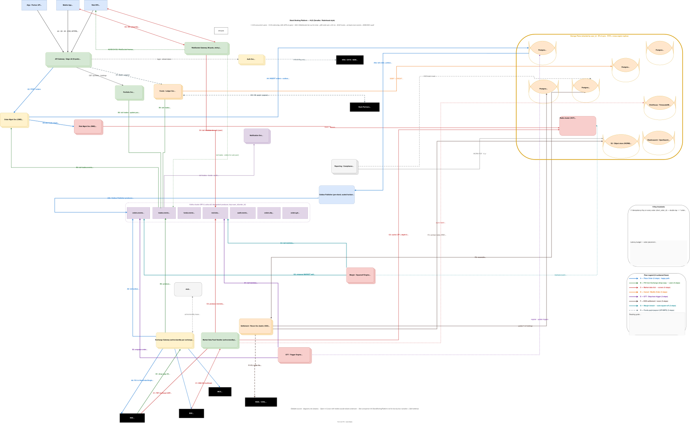

# Design a Stock Broking Platform (Zerodha / Robinhood / Groww)

> **Difficulty:** Hard &nbsp;|&nbsp; **Frequency:** ★★★★☆ &nbsp;|&nbsp; **Companies:** Zerodha (Kite), Upstox, Groww, Angel One, ICICI Direct, Robinhood, E-Trade, Charles Schwab, Interactive Brokers, Fidelity, Coinbase (crypto-broker shape).
>
> **Real-world analogues:** retail equity brokerage (NSE/BSE/MCX in India · NYSE/NASDAQ/CBOE in the US), commodity & FX brokers, crypto exchanges acting as broker-custodian, fund-aggregator platforms (mutual funds + IPO + bonds).

> **A note on scope.** This problem is the **broker** — it sits *between* retail users and the **exchange's matching engine**. It does **not** match orders itself. (For the exchange / matching-engine side, see [`../06-DesignHard/06-StockExchange.md`](../06-DesignHard/06-StockExchange.md).) The interviewer will probe the line where your responsibility ends and the exchange's begins; be very precise about it.

> **Acronym reference.** This document uses a lot of trading and engineering acronyms (NSE, BSE, FIX, OMS, RMS, RPO, RTO, SPAN, MTM, T+1, …). **Every** acronym is expanded in [§23 — Acronyms & Abbreviations Cheat-Sheet](#23-acronyms--abbreviations--cheat-sheet) with a one-line meaning and a forward-link to the full discussion. Bookmark it.

---

## Table of Contents

1. [Problem Statement](#1-problem-statement)
2. [Clarifying Questions](#2-clarifying-questions-always-ask-these-first)
3. [Requirements (FR + NFR)](#3-requirements)
4. [Capacity Estimation](#4-capacity-estimation-back-of-the-envelope)
5. [The Latency Budget — Order Placement](#5-the-latency-budget--order-placement)
6. [Why *Not* Just One Big Database / Skip Kafka / Direct Exchange](#6-why-not-just-one-big-database--skip-kafka--direct-exchange)
7. [Data Model — including full SQL DDL in §7.7](#7-data-model)
8. [High-Level Architecture (HLD) — incl. §8.6 Cache Invalidation & Global Registry](#8-high-level-architecture-hld)
9. [Component Deep-Dives](#9-component-deep-dives)
10. [Order State Machine](#10-order-state-machine)
11. [End-to-End Flows](#11-end-to-end-flows)
12. [Market-Data Fan-out at 1 Million WebSocket Sessions](#12-market-data-fan-out-at-1-million-websocket-sessions)
13. [Funds, Ledger & Settlement (T+1 / T+2)](#13-funds-ledger--settlement-t1--t2)
14. [Risk Management (RMS) & Margin](#14-risk-management-rms--margin)
15. [Edge Cases & Gotchas](#15-edge-cases--gotchas)
    - 15A. [Consistency Checks, Reconciliation & Repair](#15a-consistency-checks-reconciliation--repair)
16. [Security, Compliance & Audit (SEBI / SEC)](#16-security-compliance--audit-sebi--sec)
17. [Observability](#17-observability)
18. [Technology Choices — Final Verdict](#18-technology-choices--final-verdict)
19. [Extensions the Interviewer Will Push On](#19-extensions-the-interviewer-will-push-on)
20. [Interview One-Liner](#20-interview-one-liner)
21. [Q&A Defense — Top 25 Tough Interview Questions](#21-qa-defense--top-25-tough-interview-questions)
22. [Concept Glossary — Every Pattern, In Plain English](#22-concept-glossary--every-pattern-in-plain-english) — incl. §22.9.1–.3 Split-brain prevention vs resolution
23. [Acronyms & Abbreviations — Cheat-Sheet](#23-acronyms--abbreviations--cheat-sheet)

---

## 1. Problem Statement

Design a retail **stock-broking platform** that lets millions of users place equity, futures and options (F&O), commodity, and mutual-fund orders into the underlying **exchange** (NSE / BSE / MCX in India, or NYSE / NASDAQ in the US), see real-time quotes, manage their portfolio, and settle funds and securities — while staying compliant with regulator (SEBI / SEC) rules.

**Concrete SLOs:**

- **Concurrency:** ~1–1.5 M concurrent **WebSocket** sessions during market hours; 5–10 M registered users.
- **Throughput (orders):** ~10 M orders/day; sustained ~1 K orders/sec; **bursts to 30–50 K orders/sec** at market open (09:15 IST) and at 3:20 PM intraday close.
- **Throughput (market-data fan-out):** ~5 M instruments * 1–4 ticks/sec each at peak ≈ ~10–20 M ticks/s ingested; per-user fan-out limited to the user's watch-list (~100 instruments).
- **Latency (order ack):** **p99 ≤ 100 ms** from `POST /orders` to `200 OK`; target p50 ≤ 50 ms. The exchange's own ack to FIX `NewOrderSingle` is ~5–20 ms in-cage; the broker's overhead is the rest.
- **Latency (tick → screen):** **p99 ≤ 200 ms** from exchange multicast to user's WebSocket frame.
- **Durability:** zero loss of orders or trades after `200 OK`; double-entry funds ledger is ACID; 8-year retention of every order, trade, fund event, and login (SEBI mandate).
- **Availability:** 99.95% of market hours (09:15–15:30 IST = 6h 15m × 250 days ≈ 1500 h/yr ⇒ ~45 min/yr error budget); near-100% during the open and close auctions.
- **Consistency contract:**
  - **Funds + positions + holdings** → **strong** (SERIALIZABLE in Postgres; the user's money is at stake).
  - **Order state** → strong on the writer (OMS), eventually consistent on the read replica.
  - **Market data** → best-effort, **fresh-or-die**: the WebSocket pushes the latest LTP only; older ticks for the same instrument are dropped.

> The interview-defining tension: **strong consistency on funds and orders, eventual consistency on quotes, all under 50 ms p50 with a thundering herd at the bell.** Every architectural decision below trades against one of those three.

---

## 2. Clarifying Questions (always ask these first)

Score points by asking these *before* drawing boxes:

1. **Where is the matching engine?** Inside our system or at the exchange? → *At the exchange — we are the **broker**, not the exchange. We submit FIX `NewOrderSingle` and listen on the drop-copy session for fills.*
2. **Which exchanges and product classes?** → *NSE + BSE + MCX. Equity (CNC, MIS), F&O, commodity, mutual funds. Crypto out of scope.*
3. **What order types?** → *MARKET, LIMIT, SL (stop-loss), SL-M (stop-loss-market), GTT (good-till-triggered), AMO (after-market), Cover Order, Bracket Order.*
4. **Does the user expect HFT-grade latency?** → *No. Retail. Sub-100 ms order ack is the goal, not microseconds.*
5. **What does "1 million concurrent users" mean?** → *Concurrent **WebSocket** sessions for market-data and order-status; not 1 M orders/sec. Order rate is much lower (1 K/s avg, 50 K/s peak).*
6. **Per-user instrument subscription?** → *Each user watches ~100 instruments (watch-list + holdings + positions). Total broker-wide subscription is not the union (that'd be the entire NIFTY-500 + options chain — millions).*
7. **Settlement model?** → *Indian SEBI: T+1 for equity, T+1 for F&O cash, depository (NSDL/CDSL) holds securities. Broker is a **trading + custodian aggregator**, not a primary depository.*
8. **Algo / API access?** → *Yes — Kite-Connect-style REST + WebSocket with OAuth2 access token; per-API-key rate limits.*
9. **Margin model?** → *SEBI peak-margin (computed by broker pre-trade, audited by exchange end-of-day). Block at order time; release on cancel; convert to debit on fill.*
10. **Multi-account / family accounts?** → *Out of scope. One PAN ↔ one trading-account.*
11. **Failover RTO / RPO?** → *RTO 1 minute during market hours, RPO 0 for orders (sync replication), RPO ≤ 1 s for market-data (replay from sequence).*
12. **Compliance: KYC, audit trail, contract notes?** → *SEBI mandates 2FA, every-API-call audit log retained 8 years, contract notes by EOD T+0, P&L + STT statements at year-end.*
13. **What about MTM / margin call / auto-square-off?** → *Yes — intraday MIS positions auto-squared at 03:20 PM; margin shortfall triggers cuts.*
14. **Exact-once order or at-least-once?** → *Each `POST /orders` carries a client-generated `idempotency_key`; the OMS deduplicates within 24 h. Exchange-side is exactly-once because the FIX `ClOrdID` is used as the dedupe key on *their* side too.*
15. **What if the exchange is down?** → *We accept AMO (after-market) orders into a queue and submit at next open; LIVE orders are rejected with a clear error. We do **not** internalise crosses (we are not the exchange).*

---

## 3. Requirements

### 3.1 Functional

- **F1.** **Onboarding & KYC** — PAN + Aadhaar OTP + bank-account link + e-sign (DigiLocker / NSDL). Open trading + demat account; activated within minutes (not days).
- **F2.** **Authentication** — email/phone + password + **mandatory 2FA** (TOTP or biometric); device-pin for mobile; session TTL 8 h.
- **F3.** **Order placement** — `POST /orders` with `(instrument, side, qty, type, price, validity)`. Order types: MARKET, LIMIT, SL, SL-M, GTT, AMO, CO, BO.
- **F4.** **Order management** — `GET /orders/{id}`, `PUT /orders/{id}` (modify), `DELETE /orders/{id}` (cancel). Modify/cancel allowed up to fill.
- **F5.** **Real-time market data** — WebSocket subscribe `(instrument_token, mode∈{ltp, quote, full})`. `ltp` = last traded price; `quote` = LTP + OHLC + volume; `full` = quote + 5-deep order book.
- **F6.** **Portfolio & holdings** — `GET /holdings` (T+2-settled equity), `GET /positions` (intraday + carry-forward F&O), real-time P&L.
- **F7.** **Funds & ledger** — `GET /funds/margin`, `POST /funds/payin`, `POST /funds/payout`. Bank-linked UPI / IMPS / NEFT.
- **F8.** **Charts & history** — OHLC candles (1 m, 5 m, 15 m, 1 h, 1 d) for the last 5 years; technical indicators computed client-side from server-supplied candles.
- **F9.** **Watchlists & alerts** — per-user watch-list of ~100 instruments; price-cross / volume-spike alerts via push / SMS / email.
- **F10.** **GTT / Cover / Bracket orders** — server-side trigger: place a real exchange order when a price condition becomes true.
- **F11.** **Reports** — daily contract notes (PDF), monthly P&L statement, annual tax (P&L + STT + GST + STCG/LTCG split for ITR).
- **F12.** **Mutual funds, IPO, bonds** — secondary catalog + order journey; uses BSE-StAR-MF or NSE-NMF backend (out of scope of the hot path here).
- **F13.** **Notifications** — order-fill, partial-fill, margin-call, alerts via FCM / APNS / SMS / email + WebSocket.
- **F14.** **Admin / RMS dashboard** — internal view of all open positions, exposure, broker net position; kill-switch for any user / instrument / segment.

### 3.2 Non-Functional

| Attribute             | Target                                                                                                 |
|-----------------------|--------------------------------------------------------------------------------------------------------|
| Concurrent users      | **1.5 M concurrent WebSocket sessions** during market hours; **5–10 M registered**                   |
| Throughput (orders)   | 1 K/s avg · **30–50 K/s peak** (market open, 3:20 PM close, F&O expiry day)                             |
| Throughput (ticks)    | ingest 10–20 M ticks/s · per-WS user gets only their subscriptions (~100 instruments)                  |
| Latency (order ack)   | **p99 ≤ 100 ms**, p50 ≤ 50 ms (`POST /orders` → `200 OK`)                                              |
| Latency (tick → screen) | **p99 ≤ 200 ms** (multicast → WS frame)                                                              |
| Durability            | RPO = 0 for orders & funds (sync RF=3); RPO ≤ 1 s for market data; RTO ≤ 1 min during market hours    |
| Availability          | **99.95%** during market hours; ~100% during open/close auctions                                      |
| Consistency           | Funds & positions & orders → strong (SERIALIZABLE); ticks → eventual                                   |
| Audit retention       | **8 years** (SEBI) — every order, trade, login, fund-event, change                                    |
| Multi-tenancy         | per-user rate limits + per-API-key; one greedy algo client must not starve retail                     |
| DR                    | Mumbai primary + DR (Bengaluru / Hyderabad). Active-passive at ExchangeGW; active-active for read APIs |
| Compliance            | SEBI Cybersecurity Framework 2018; mandatory 2FA; sensitive PII encrypted at rest (KMS / HSM)         |

---

## 4. Capacity Estimation (back of the envelope)

| Metric                                          | Calculation                                       | Value                              |
|-------------------------------------------------|---------------------------------------------------|------------------------------------|
| Active users (DAU during market hrs)            | 5 M registered × 30%                              | **1.5 M**                          |
| Concurrent WebSocket sessions                   | DAU                                               | **1.5 M**                          |
| Avg orders / DAU                                | ~7 orders / day                                   | 7                                  |
| Daily order volume                              | 1.5 M × 7                                         | **~10 M / day**                    |
| Average orders/s (over 6.25-h session)          | 10 M / 22 500 s                                   | ~440 /s                            |
| Peak burst (open: 09:15 first 60 s)             | 1 M users × 1 order × 1/60                        | **~30 K /s** (60 s sustained)      |
| Peak burst (3:20 PM intraday close auto-sqr)    | ~200 K MIS positions all squared                  | **~40 K /s** for ~5 s              |
| Trades / day (avg fill ratio 80%)               | ~8 M trades                                       | 8 M / day                           |
| Tick ingest rate (NSE TBT + BSE EQ + F&O)        | NSE: ~5–10 M ticks/s peak; BSE: ~2 M; F&O: ~3 M    | **~15 M ticks/s peak**             |
| Per-user subscription size                      | ~100 instruments (watchlist + holdings + positions)| 100                                |
| Per-user tick rate                              | ~5 ticks/s avg (mostly idle instruments)          | 5 ticks/s                          |
| **WebSocket egress total**                       | 1.5 M × 5 frames/s × ~80 B/frame                  | **~600 MB/s sustained, ~5 GB/s peak**|
| Order row size                                  | ~600 B                                            | 600 B                              |
| Daily orders DB growth                          | 10 M × 600 B                                      | **~6 GB/day**                      |
| Tick DB growth (1-min candles, not raw)         | 5 M instruments × 6 fields × 8 B × 375 candles/d   | **~90 GB/day** (raw ticks dropped after 24 h to S3) |
| 8-year orders + trades retention                | 6 GB × 250 days × 8 yr                            | **~12 TB hot** (Postgres partition + cold S3) |
| Funds ledger TPS                                | 2 entries / fill × 8 M fills / day                 | **~750 /s avg, 5 K/s peak**        |
| Postgres shards (orders)                        | hash(user_id) % 64                                | 64 shards                          |
| Kafka partitions (`orders.events`)              | peak 50 K/s ÷ ~1 K/s/partition                    | **48 partitions**                  |
| Kafka partitions (`md.ticks`)                   | 15 M/s ÷ ~120 K/s/partition                       | **128 partitions**                 |
| WS gateway pods                                 | 1.5 M / 7 K conns/pod                             | **~220 pods**                      |
| OMS pods                                        | 50 K/s ÷ ~3 K/s/pod                               | ~20 pods                            |
| Market-data feed handlers                       | active + standby per exchange                     | 6 (NSE×2, BSE×2, MCX×2)             |

The numbers are not exotic; the design pressure is **latency tail + tick fan-out + funds correctness**, not throughput.

---

## 5. The Latency Budget — Order Placement

**Total budget: 100 ms p99 from `POST /orders` to `200 OK` (i.e. *broker accepted, exchange acknowledged*).** Spend it explicitly:

| Stage                                                  | Target  | p99    | Notes                                                                 |
|--------------------------------------------------------|---------|--------|-----------------------------------------------------------------------|
| Client → API GW (TLS, WAN)                             | 10 ms   | 30 ms  | Edge close to user — Mumbai PoP                                       |
| API GW: TLS, JWT validate, rate-limit (Redis lookup)    | 2 ms    | 5 ms   | Token bucket in Redis; one round-trip                                 |
| OMS validate (schema, instrument exists, price tick-size)| 3 ms   | 8 ms   | All in-process; instrument metadata cached in OMS pod (~1 MB)          |
| RMS pre-trade check (margin, position, ban list)        | 5 ms    | 12 ms  | Reads `margin:{user}` Redis HASH; CAS-block margin atomically         |
| Postgres INSERT `orders` + `outbox` (single SERIALIZABLE txn) | 8 ms | 20 ms | RF=3 sync; in-AZ; row keyed by `(user_shard, order_id)`               |
| FIX produce to ExchangeGW (in-process queue)            | 1 ms    | 3 ms   | ExchangeGW co-located with OMS in same AZ                             |
| ExchangeGW → exchange FIX `NewOrderSingle` ack          | 10 ms   | 25 ms  | Cross-cage TCP; depends on exchange (NSE ~5 ms in-cage, ~25 ms cross-DC)|
| OMS UPDATE `orders SET status='OPEN', exchange_order_id=…`| 5 ms  | 15 ms  | second Postgres write; same shard                                     |
| API GW → client (200 OK + `order_id`)                   | 10 ms   | 30 ms  |                                                                       |
| **TOTAL p50 / p99**                                     | **~50 ms / ~100 ms** | | leaves ~50 ms headroom for tail (GC, replication slowness, network) |

> **Key insight — the exchange's FIX RTT is the immovable floor.** If the exchange ack is 25 ms p99 and the broker is doing ~25 ms of own-work either side of it, the budget is already tight. Co-locating the ExchangeGW pod in the **same data centre as the exchange's order-entry gateway** (NSE Colo at BKC, BSE Colo at PJT in Mumbai) is non-negotiable for any real broker.

### 5.1 What blows this budget in practice

- **Cold JVM / GC pause on the OMS** — use ZGC / Shenandoah, heap < 4 GB, off-heap caches; or write OMS in Go.
- **Postgres lock contention on `funds_ledger`** — the *funds row for the user* is the hot row at market open. Mitigation: per-user shard, RMS optimistic check + serializable retry, batched margin block (§14.4).
- **Kafka producer flush** — keep `linger.ms = 0` on the order-write path; `linger.ms = 5` only on the trades / audit consumers.
- **WebSocket gateway sticky-session lookup** — cache in-pod; one Redis hop adds ~1 ms.
- **Thundering herd at 09:15:00 sharp** — 1 M users, all looking at NIFTY, hitting "Buy" within the same second. See §15.1.

---

## 6. Why *Not* Just One Big Database / Skip Kafka / Direct Exchange

Interviewers will press on every short-cut. Honest comparison:

| Candidate shortcut                                          | What's tempting                       | Why it breaks at this scale                                                         |
|-------------------------------------------------------------|---------------------------------------|-------------------------------------------------------------------------------------|
| **One Postgres for orders + funds + holdings + ticks**       | one source of truth, easy txns        | 15 M ticks/s shreds the WAL; lock contention between tick writes and funds writes; impossible to scale read fan-out for live quotes |
| **Skip Kafka, OMS calls Funds + Portfolio + Notif synchronously** | simpler stack, no eventual consistency | the order ack now waits on N services; one slow downstream (notif → SMS provider) blows the SLO; adding a new consumer needs an OMS code change |
| **Direct browser → exchange (no broker layer)**              | lowest latency possible                | exchanges only accept FIX from registered members; you must do KYC, RMS, margin block, audit, settlement. The broker exists for a regulatory reason. |
| **Use Redis as the source of truth for orders**              | sub-ms reads                           | Redis is not a system of record; replication is async; SEBI requires durable, auditable order log. Redis is fine as a hot cache, not as the ledger. |
| **Kafka as the order log (`POST /orders` → produce → done`)** | massive throughput                    | (a) you can't return `order_id` synchronously without a follow-up read; (b) you've hidden the exchange ack from the user — they won't know if the exchange rejected the order; (c) cancel/modify becomes a saga |
| **Pull market data from a vendor REST API per request**      | no infra to run                        | latency 200 ms+, cost prohibitive, not real-time. You must consume the **multicast UDP** feed from the exchange's data centre. |
| **Internalise crosses ourselves**                            | save exchange fees                     | regulatory minefield (SEBI explicitly bars retail brokers from internalising). Routing decision is **never** the broker's; always go to the exchange. |
| **Single FIX session for all users**                         | simple                                 | head-of-line blocking — one slow user (algo client spamming) backs up everyone. Use a per-segment FIX session pool with a **persistent sequence number** managed by ExchangeGW. |
| **HTTP poll for order status / portfolio**                   | simple                                 | doesn't scale to 1.5 M sessions × 1 poll/s = 1.5 M req/s. WebSocket push is the only sane answer. |

### Final architectural decisions (consequence of the above)

- **System of record:** sharded **Postgres** (`orders`, `trades`, `funds_ledger`, `holdings`, `users`). RF=3, sync replication, SERIALIZABLE on funds.
- **Hot cache:** **Redis cluster** for LTP, depth, position, margin, session, rate-limit.
- **Async backbone:** **Kafka** with topics `orders.events`, `trades.events`, `funds.events`, `md.ticks`, `audit.events`, `orders.{gtt,amo,dlq}`. RF=3, idempotent producer, key=`user_id` (or `instrument_id` for ticks).
- **Real-time fan-out:** **WebSocket gateway** fleet (~220 pods) with sticky sessions, each tailing the Kafka topics relevant to its connected users.
- **Exchange leg:** **ExchangeGW** active-standby per exchange, co-located in the exchange data centre (NSE Colo / BSE PJT). FIX 4.4 / NSE-NNF / BSE-IML.
- **Time-series:** **ClickHouse** (or kdb+ / TimescaleDB) for OHLC candles and historical chart data.
- **Object store:** **S3 with WORM (Object Lock)** for contract notes, audit logs, KYC docs (8-year retention).

---

## 7. Data Model

### 7.1 Order (canonical, in `orders` table)

```
Order {
  string   order_id            // UUIDv7 — sortable, our PK
  string   exchange_order_id   // populated after exchange ack; nullable until OPEN
  string   client_order_id     // user-supplied idempotency key (also FIX ClOrdID)
  string   user_id
  int      user_shard          // hash(user_id) % 64
  string   instrument_token    // NSE/BSE token ("NSE:RELIANCE" or 738561)
  string   exchange            // "NSE" | "BSE" | "MCX" | "NFO" | "BFO" | "MCX-FO"
  string   product             // "CNC" (delivery) | "MIS" (intraday) | "NRML" (F&O carry) | "CO" | "BO"
  enum     side                // BUY | SELL
  enum     order_type          // MARKET | LIMIT | SL | SL-M | GTT | AMO
  enum     validity            // DAY | IOC | TTL
  long     quantity
  long     filled_quantity
  long     pending_quantity
  decimal  price               // for LIMIT / SL only
  decimal  trigger_price       // for SL / SL-M / GTT only
  decimal  avg_fill_price
  enum     status              // see §10 state machine
  string   reject_reason       // populated when REJECTED
  // Margin
  decimal  margin_blocked
  // Audit
  long     created_at_ms
  long     updated_at_ms
  long     placed_at_ms        // when sent to exchange
  long     filled_at_ms
  string   placed_via          // "web" | "ios" | "android" | "kite_connect" | "gtt_engine" | "squareoff"
  // Idempotency
  string   request_id          // OMS-internal request id
}
```

> **Postgres DDL sketch.**
>
> ```sql
> CREATE TABLE orders (
>   order_id           uuid PRIMARY KEY,
>   user_id            text NOT NULL,
>   user_shard         int  NOT NULL,
>   client_order_id    text NOT NULL,
>   exchange_order_id  text,
>   instrument_token   text NOT NULL,
>   exchange           text NOT NULL,
>   product            text NOT NULL,
>   side               text NOT NULL,
>   order_type         text NOT NULL,
>   validity           text NOT NULL,
>   quantity           bigint NOT NULL,
>   filled_quantity    bigint NOT NULL DEFAULT 0,
>   price              numeric(18,4),
>   trigger_price      numeric(18,4),
>   avg_fill_price     numeric(18,4),
>   status             text NOT NULL,
>   reject_reason      text,
>   margin_blocked     numeric(18,4) NOT NULL DEFAULT 0,
>   placed_via         text NOT NULL,
>   created_at_ms      bigint NOT NULL,
>   updated_at_ms      bigint NOT NULL,
>   placed_at_ms       bigint,
>   filled_at_ms       bigint,
>   UNIQUE (user_id, client_order_id)        -- idempotency
> ) PARTITION BY RANGE (created_at_ms);
>
> CREATE INDEX orders_user_status_idx ON orders (user_id, status, created_at_ms DESC)
>   WHERE status IN ('OPEN','TRIGGER_PENDING','PARTIALLY_FILLED');   -- partial index for hot reads
>
> CREATE TABLE order_outbox (
>   outbox_id   bigserial PRIMARY KEY,
>   order_id    uuid NOT NULL,
>   event_type  text NOT NULL,                -- ORDER_NEW | ORDER_MOD | ORDER_CXL
>   payload     jsonb NOT NULL,
>   status      text NOT NULL DEFAULT 'pending',
>   created_at_ms bigint NOT NULL
> );
> ```

### 7.2 Trade (immutable fill record)

```
Trade {
  string   trade_id            // exchange-issued
  string   order_id
  string   user_id
  string   instrument_token
  enum     side
  long     quantity            // this fill (≤ order.quantity)
  decimal  price               // execution price
  decimal  exchange_fee
  decimal  stt                 // securities transaction tax
  decimal  brokerage
  long     traded_at_ms
}
```

> Append-only. **The exchange's drop-copy is the source of truth** for `trade_id` — do not mint our own.

### 7.3 Funds Ledger (double-entry — the heart of compliance)

```
LedgerEntry {
  bigserial  entry_id
  string     user_id
  string     account_type     // 'CASH' | 'MARGIN' | 'COLLATERAL'
  decimal    debit             // either debit OR credit, never both
  decimal    credit
  decimal    balance_after     // cached; reconciled
  string     ref_type          // 'TRADE' | 'PAYIN' | 'PAYOUT' | 'BROKERAGE' | 'STT' | 'MARGIN_HOLD' | 'MARGIN_RELEASE'
  string     ref_id            // trade_id / payin_id / order_id
  long       created_at_ms
}
```

> **Invariant:** for every business event, `Σ debits == Σ credits`. The ledger is **append-only**; corrections are *reversing* entries, not edits.

### 7.4 Position vs Holding

```
Position {                       // intraday + carry-forward F&O — recomputed per fill
  string  user_id
  string  instrument_token
  string  product               // 'MIS' | 'NRML'
  long    net_qty               // signed: + long, - short
  decimal avg_buy_price
  decimal avg_sell_price
  decimal realised_pnl
  decimal unrealised_pnl        // recomputed from LTP
  long    updated_at_ms
}

Holding {                        // T+2 settled equity, in user's demat account
  string  user_id
  string  instrument_token
  long    qty
  decimal avg_buy_price          // weighted, includes brokerage + STT
  long    settled_at_ms
}
```

> **Why split?** Positions are *broker's view* (intraday + open F&O). Holdings are *depository's view* (NSDL/CDSL — what you actually own). They must reconcile at EOD T+2.

### 7.5 Instrument master (read-only catalog)

```
Instrument {
  string  instrument_token       // unique
  string  symbol                 // "RELIANCE", "NIFTY24DECFUT"
  string  exchange               // "NSE" | "BSE" | ...
  string  segment                // "EQ" | "FO" | "CDS" | "COM"
  decimal tick_size
  long    lot_size
  decimal upper_circuit          // updated daily
  decimal lower_circuit
  date    expiry                 // for derivatives
  decimal strike                 // for options
  string  option_type            // CE | PE | NULL
}
```

> ~5 million rows (every option strike for every expiry). Fits in a few GB. **Loaded into every OMS pod at startup** + refreshed on the half-hour. Static enough that this is fine.

### 7.6 Audit event (immutable)

```
AuditEvent {
  uuid   event_id
  long   ts_ms
  string user_id
  string actor                  // 'user' | 'system' | 'admin' | 'exchange_drop_copy'
  string action                 // 'login' | 'order_new' | 'order_mod' | 'order_cxl' | 'fund_payin' | 'kyc_update' | …
  jsonb  payload                // request body, IP, user agent, correlation_id
}
```

> Written to Kafka `audit.events` (append-only, RF=3, 90 d hot retention) and tiered to **S3 with Object Lock (WORM)** for the 8-year mandate.

### 7.7 Production SQL Schema (DDL) — what the tables actually look like

> The shapes in §7.1 – §7.6 were pseudo-types for the narrative. This subsection is the **real DDL** you would deploy: column types, primary keys, unique constraints, foreign keys, indexes, partitioning, generated columns, and constraint-checks. Every choice has a rationale comment beside it. Postgres 15+ syntax; assumes one logical schema per OMS/funds shard (`hash(user_id) % 64`).

#### 7.7.1 `orders` — the order state table (sharded by `user_id`, monthly partition)

```sql
-- One row per order. Lives in the OMS Postgres cluster, sharded ×64 by hash(user_id).
-- Within each shard, partitioned by created_at_ms month for cheap pruning.

CREATE TABLE orders (
    -- Identity
    order_id              UUID            NOT NULL,            -- our internal id (UUIDv7 for time-ordering)
    user_id               TEXT            NOT NULL,            -- shard key
    client_order_id       TEXT            NOT NULL,            -- client-minted UUID for idempotency

    -- Routing / instrument
    instrument_token      BIGINT          NOT NULL,            -- FK to instrument_master.instrument_token
    exchange              TEXT            NOT NULL CHECK (exchange IN ('NSE','BSE','MCX','NFO','BFO','CDS')),
    segment               TEXT            NOT NULL CHECK (segment IN ('EQ','FO','CDS','COM','MF')),
    symbol                TEXT            NOT NULL,            -- denormalised for ops queries

    -- Order shape
    side                  TEXT            NOT NULL CHECK (side IN ('BUY','SELL')),
    order_type            TEXT            NOT NULL CHECK (order_type IN ('LIMIT','MARKET','SL','SL-M','GTT','AMO')),
    product               TEXT            NOT NULL CHECK (product IN ('CNC','MIS','NRML','CO','BO','MF')),
    validity              TEXT            NOT NULL CHECK (validity IN ('DAY','IOC','GTT')),
    quantity              INTEGER         NOT NULL CHECK (quantity > 0),
    disclosed_quantity    INTEGER             NULL CHECK (disclosed_quantity IS NULL OR disclosed_quantity <= quantity),
    price                 NUMERIC(18,4)       NULL,            -- NULL for MARKET orders
    trigger_price         NUMERIC(18,4)       NULL,            -- for SL / SL-M / GTT

    -- State machine (driven by OMS only; see §10)
    status                TEXT            NOT NULL CHECK (status IN (
                                                'RECEIVED','QUEUED','OPEN','PARTIALLY_FILLED',
                                                'COMPLETE','CANCELLED','REJECTED','TRIGGER_PENDING')),
    status_message        TEXT                NULL,            -- exchange reject reason, etc.

    -- Fill aggregation (recomputed from trades; see §10 CAS rules)
    filled_quantity       INTEGER         NOT NULL DEFAULT 0 CHECK (filled_quantity >= 0 AND filled_quantity <= quantity),
    avg_fill_price        NUMERIC(18,4)       NULL,
    applied_trades        JSONB           NOT NULL DEFAULT '[]'::jsonb,   -- [trade_id, ...] for idempotency on redelivery

    -- Exchange linkage (filled in by OMS on FIX New ack)
    exchange_order_id     TEXT                NULL,            -- exchange-issued OrderID
    fix_clord_id          TEXT                NULL,            -- the ClOrdID we sent (broker-prefixed)

    -- Margin
    margin_blocked        NUMERIC(18,4)   NOT NULL DEFAULT 0,  -- reversed on REJECTED / CANCELLED / settlement

    -- Provenance
    placed_via            TEXT            NOT NULL DEFAULT 'user'
                                          CHECK (placed_via IN ('user','algo','gtt_engine','squareoff','admin')),
    api_key_id            TEXT                NULL,            -- for algo orders
    request_id            UUID                NULL,            -- trace id from API GW
    ip_address            INET                NULL,

    -- Timestamps (epoch millis to keep math simple cross-language)
    created_at_ms         BIGINT          NOT NULL,
    updated_at_ms         BIGINT          NOT NULL,

    -- Composite primary key includes created_at_ms because of partitioning
    PRIMARY KEY (order_id, created_at_ms),

    -- The single most important constraint in the system:
    -- prevents a duplicate order from the same user with the same client-side idempotency key.
    UNIQUE (user_id, client_order_id),

    -- Exchange OrderID, when present, is unique per exchange
    UNIQUE (exchange, exchange_order_id)
)
PARTITION BY RANGE (created_at_ms);

-- Monthly partitions, created by pg_partman ahead of time:
CREATE TABLE orders_2026_05 PARTITION OF orders
    FOR VALUES FROM (1746057600000) TO (1748736000000);   -- ms epoch for May 2026
-- ... etc.

-- Indexes (partition-local; declared on parent for child inheritance)
CREATE INDEX orders_user_status_idx
    ON orders (user_id, status, created_at_ms DESC);                   -- "open orders for this user"

CREATE INDEX orders_user_created_idx
    ON orders (user_id, created_at_ms DESC);                           -- "orderbook view, last N"

CREATE INDEX orders_instrument_status_idx
    ON orders (instrument_token, status)
    WHERE status IN ('OPEN','PARTIALLY_FILLED','TRIGGER_PENDING');     -- partial index, only for live orders

CREATE INDEX orders_exchange_oid_idx
    ON orders (exchange, exchange_order_id) WHERE exchange_order_id IS NOT NULL;
```

**Design notes.**

- `order_id` is **UUIDv7** so it sorts roughly by time without revealing user identity (UUIDv4 would be unsortable; serial would expose throughput to anyone with two consecutive ids).
- The `applied_trades JSONB` array is the **idempotency vault for fill events** — the OMS appends `trade_id` only after the UPDATE; if the same `trades.events` message redelivers, the OMS sees the trade_id already in the array and no-ops. Capped at ~200 entries (orders rarely fill in more than ~50 partial trades).
- `status_message` is `TEXT` not `TEXT NOT NULL` because most orders never fail.
- The `exchange_order_id` UNIQUE constraint must be a **partial unique** in practice (because pre-ack orders have NULL); we declare it without the partial because a full UNIQUE on `(exchange, NULL)` allows duplicates — that's exactly the behaviour we want.

#### 7.7.2 `order_outbox` — the transactional outbox (paired with `orders` in the same transaction)

```sql
-- Written in the SAME txn as orders. Drained by the Outbox Publisher (Debezium CDC).
-- Same shard as orders so the txn is local; same monthly partitioning.

CREATE TABLE order_outbox (
    outbox_id             BIGSERIAL       NOT NULL,
    order_id              UUID            NOT NULL,
    user_id               TEXT            NOT NULL,
    event_type            TEXT            NOT NULL CHECK (event_type IN ('ORDER_NEW','ORDER_MOD','ORDER_CXL')),
    payload               JSONB           NOT NULL,            -- full FIX-translatable order representation
    kafka_topic           TEXT            NOT NULL DEFAULT 'orders.events',
    kafka_key             TEXT            NOT NULL,            -- = user_id (preserves per-user ordering)

    status                TEXT            NOT NULL DEFAULT 'pending'
                                          CHECK (status IN ('pending','sent','failed')),
    sent_at_ms            BIGINT              NULL,
    retry_count           SMALLINT        NOT NULL DEFAULT 0,
    last_error            TEXT                NULL,

    created_at_ms         BIGINT          NOT NULL,
    PRIMARY KEY (outbox_id, created_at_ms)
)
PARTITION BY RANGE (created_at_ms);

CREATE TABLE order_outbox_2026_05 PARTITION OF order_outbox
    FOR VALUES FROM (1746057600000) TO (1748736000000);

-- Hot index: the publisher's "give me the next batch of pending rows"
CREATE INDEX order_outbox_pending_idx
    ON order_outbox (created_at_ms)
    WHERE status = 'pending';                                  -- partial: only pending rows

-- For Debezium CDC we don't need this index (CDC reads the WAL),
-- but for the polling-based publisher fallback we use:
--   SELECT * FROM order_outbox WHERE status='pending'
--   ORDER BY created_at_ms LIMIT 200 FOR UPDATE SKIP LOCKED;
```

**Design notes.**

- `BIGSERIAL` is chosen over UUID here because the publisher's polling fallback reads in `created_at_ms` order — sequential ids cluster nicely on disk.
- `payload JSONB` is the full FIX-translatable representation; the Exchange Gateway never re-fetches the order from the `orders` table, it just deserialises this. Keeps the publisher / ExchangeGW path stateless against `orders`.
- After 24 h, `status='sent'` rows are eligible for partition pruning; we drop month partitions that are entirely sent + audited. This keeps the table small even at 30 K orders/sec sustained.
- `retry_count` + `last_error` exist because Kafka produce *can* fail (broker outage); the publisher backs off and retries; if `retry_count > 10` we move to `'failed'` and page on-call.

#### 7.7.3 `trades` — append-only fill log (sharded by `user_id`, monthly partition)

```sql
CREATE TABLE trades (
    trade_id              TEXT            NOT NULL,            -- exchange-issued; SOURCE OF TRUTH
    order_id              UUID            NOT NULL,
    user_id               TEXT            NOT NULL,            -- shard key
    exchange              TEXT            NOT NULL,
    instrument_token      BIGINT          NOT NULL,
    side                  TEXT            NOT NULL CHECK (side IN ('BUY','SELL')),
    quantity              INTEGER         NOT NULL CHECK (quantity > 0),
    price                 NUMERIC(18,4)   NOT NULL CHECK (price > 0),

    -- Charges (computed at fill-time from active fee_schedule version)
    exchange_fee          NUMERIC(18,4)   NOT NULL DEFAULT 0,
    stt                   NUMERIC(18,4)   NOT NULL DEFAULT 0,  -- Securities Transaction Tax (India)
    gst                   NUMERIC(18,4)   NOT NULL DEFAULT 0,
    sebi_charges          NUMERIC(18,4)   NOT NULL DEFAULT 0,
    stamp_duty            NUMERIC(18,4)   NOT NULL DEFAULT 0,
    brokerage             NUMERIC(18,4)   NOT NULL DEFAULT 0,
    fee_schedule_version  INTEGER         NOT NULL,            -- which version of the schedule applied

    traded_at_ms          BIGINT          NOT NULL,
    received_at_ms        BIGINT          NOT NULL,            -- when our drop-copy received it

    PRIMARY KEY (trade_id, traded_at_ms),
    UNIQUE (exchange, trade_id)                                -- exchange's id is globally unique
)
PARTITION BY RANGE (traded_at_ms);

CREATE INDEX trades_order_idx       ON trades (order_id, traded_at_ms);
CREATE INDEX trades_user_idx        ON trades (user_id, traded_at_ms DESC);
CREATE INDEX trades_instrument_idx  ON trades (instrument_token, traded_at_ms DESC);
```

**Design notes.**

- `trade_id` is the **exchange's** identifier — never minted by us. The `UNIQUE (exchange, trade_id)` constraint is what makes `trades.events` Kafka redelivery safe (second insert fails on the unique).
- All charges are denormalised onto the row at fill-time using the active fee_schedule version. Schedule changes are versioned (a new schedule never modifies historical rows); EOD reconciliation can recompute charges from `fee_schedule_version` if needed.
- Append-only — no UPDATE permission granted to any service principal; corrections are reversing entries via `trade_busts` (separate table) plus a flag.

#### 7.7.4 `funds_summary` — per-user margin row (the row that gets `FOR UPDATE`-locked)

```sql
-- ONE row per user. Lives in the FUNDS Postgres cluster (separate from orders).
-- This is the row OMS row-locks inside its SERIALIZABLE txn during pre-trade RMS.

CREATE TABLE funds_summary (
    user_id               TEXT            NOT NULL PRIMARY KEY,

    -- Cash buckets (in INR paise; integer arithmetic avoids float drift)
    cash_balance_paise    BIGINT          NOT NULL DEFAULT 0 CHECK (cash_balance_paise >= 0),
    margin_blocked_paise  BIGINT          NOT NULL DEFAULT 0 CHECK (margin_blocked_paise >= 0),
    free_margin_paise     BIGINT          NOT NULL DEFAULT 0,   -- cash_balance - margin_blocked + collateral

    -- Collateral (pledged holdings haircut-adjusted by depository)
    collateral_value_paise BIGINT         NOT NULL DEFAULT 0 CHECK (collateral_value_paise >= 0),

    -- Accounting metadata
    last_ledger_entry_id  BIGINT              NULL,             -- last entry that updated this row
    updated_at_ms         BIGINT          NOT NULL,
    version               BIGINT          NOT NULL DEFAULT 0,   -- optimistic concurrency tag

    -- Hard invariant: the cached free_margin must equal cash + collateral - blocked
    CONSTRAINT free_margin_consistent CHECK
        (free_margin_paise = cash_balance_paise + collateral_value_paise - margin_blocked_paise)
);

-- No secondary indexes — every access is by primary key (user_id).
```

**Design notes.**

- **Money is stored in paise** (1/100 of a rupee), as `BIGINT`. `NUMERIC` is fine but slower for the hot-path arithmetic; integer paise eliminates any rounding ambiguity.
- The `CHECK (free_margin_consistent)` is a **deferrable invariant** asserted by the database itself — if the application code ever forgets to update one of the fields, the txn fails at commit, not at user-noticed-discrepancy time three weeks later.
- The `version` column is for **optimistic concurrency** when SERIALIZABLE-with-FOR-UPDATE is too heavy (e.g., a read-only "show me my balance" can do `WHERE version = ?` on a subsequent write, retry on mismatch).
- This is the **hottest single row in the system per user** — under 30 K orders/sec at open from 1.5 M users it is ~0.02 writes/sec/row average — totally fine. The danger is a single user spamming orders; mitigated by API-GW rate limit (10 orders/s/user).

#### 7.7.5 `funds_ledger` — the double-entry ledger (sharded by `user_id`, monthly partition, append-only)

```sql
CREATE TABLE funds_ledger (
    entry_id              BIGSERIAL       NOT NULL,
    user_id               TEXT            NOT NULL,            -- shard key

    account_type          TEXT            NOT NULL
                          CHECK (account_type IN ('CASH','MARGIN_HOLD','COLLATERAL','HOLDINGS',
                                                 'BANK_RECV','BANK_OUT','BROKERAGE_INCOME',
                                                 'STT_PAYABLE','GST_PAYABLE','SEBI_PAYABLE',
                                                 'STAMP_DUTY_PAYABLE','EXCHANGE_FEE_PAYABLE')),

    -- Either DEBIT > 0 with CREDIT = 0, or CREDIT > 0 with DEBIT = 0. Never both.
    debit_paise           BIGINT          NOT NULL DEFAULT 0 CHECK (debit_paise  >= 0),
    credit_paise          BIGINT          NOT NULL DEFAULT 0 CHECK (credit_paise >= 0),
    CONSTRAINT exactly_one_side CHECK ((debit_paise = 0) <> (credit_paise = 0)),

    -- Cached running balance for this account on this user, updated atomically with the insert
    balance_after_paise   BIGINT          NOT NULL,

    -- What business event caused this entry
    ref_type              TEXT            NOT NULL
                          CHECK (ref_type IN ('TRADE','PAYIN','PAYOUT','BROKERAGE','STT','GST',
                                              'SEBI_FEE','STAMP_DUTY','MARGIN_HOLD','MARGIN_RELEASE',
                                              'CORPORATE_ACTION','MANUAL_ADJUSTMENT','REVERSAL')),
    ref_id                TEXT                NULL,            -- order_id / trade_id / payin_id

    -- The 'business event' grouping: every event ⇒ ≥ 2 rows that sum to zero, all with the same business_event_id
    business_event_id     UUID            NOT NULL,

    -- For corrections: this entry reverses entry_id reversed_entry_id
    reversed_entry_id     BIGINT              NULL,

    created_at_ms         BIGINT          NOT NULL,

    PRIMARY KEY (entry_id, created_at_ms)
)
PARTITION BY RANGE (created_at_ms);

CREATE INDEX funds_ledger_user_acct_idx ON funds_ledger (user_id, account_type, created_at_ms DESC);
CREATE INDEX funds_ledger_business_idx  ON funds_ledger (business_event_id);
CREATE INDEX funds_ledger_ref_idx       ON funds_ledger (ref_type, ref_id);

-- A daily reconciliation job runs:
--   SELECT business_event_id, SUM(debit_paise) - SUM(credit_paise) AS imbalance
--   FROM funds_ledger
--   WHERE created_at_ms >= :today_start
--   GROUP BY business_event_id
--   HAVING SUM(debit_paise) <> SUM(credit_paise);
-- Any rows in the result page on-call. MUST always be empty.
```

**Design notes.**

- `business_event_id` is the **glue that makes double-entry checkable**: every business event (a fill, a payin, a brokerage debit) emits ≥ 2 rows with the same `business_event_id`. The reconciliation query above is the regulator's nightmare prevention.
- `balance_after_paise` is **denormalised but assertable** — the application computes it on insert; a separate weekly job rebuilds it from scratch (`SUM(credit) - SUM(debit) GROUP BY user, account`) and asserts equality.
- Corrections **never** UPDATE; they insert a `reversed_entry_id` row of the opposite sign, preserving the audit trail. The `reversal` ref_type makes them obvious in queries.
- Append-only at the role level: the application service principal has `INSERT, SELECT` but **not** `UPDATE` or `DELETE`.

#### 7.7.6 `positions` — intraday + open F&O positions (sharded by `user_id`)

```sql
CREATE TABLE positions (
    user_id               TEXT            NOT NULL,
    instrument_token      BIGINT          NOT NULL,
    product               TEXT            NOT NULL CHECK (product IN ('MIS','NRML','CNC')),

    net_quantity          INTEGER         NOT NULL,                       -- signed: + long, - short
    avg_buy_price_paise   BIGINT          NOT NULL DEFAULT 0,
    avg_sell_price_paise  BIGINT          NOT NULL DEFAULT 0,
    realised_pnl_paise    BIGINT          NOT NULL DEFAULT 0,

    -- Recomputed continuously from LTP — NOT a source of truth, just a cache for fast reads
    last_ltp_paise        BIGINT              NULL,
    unrealised_pnl_paise  BIGINT              NULL
                          GENERATED ALWAYS AS (
                              CASE WHEN last_ltp_paise IS NULL THEN NULL
                                   ELSE (last_ltp_paise - avg_buy_price_paise) * net_quantity
                              END
                          ) STORED,

    updated_at_ms         BIGINT          NOT NULL,

    PRIMARY KEY (user_id, instrument_token, product)
);

CREATE INDEX positions_user_idx ON positions (user_id) WHERE net_quantity <> 0;  -- only open positions
```

**Design notes.**

- `unrealised_pnl_paise` is a **`GENERATED ALWAYS AS … STORED`** column — Postgres recomputes it on every UPDATE of the contributing columns; no application bug can let it drift. (Trade-off: requires `last_ltp_paise` to be UPDATEd, which is a separate write per tick — in practice we only refresh it when the user opens the positions screen, *not* on every tick.)
- The partial index on `WHERE net_quantity <> 0` keeps it small: most users have ~5 open positions, the table can have years of dead rows from closed positions.

#### 7.7.7 `holdings` — T+2 settled equity (sharded by `user_id`)

```sql
CREATE TABLE holdings (
    user_id               TEXT            NOT NULL,
    instrument_token      BIGINT          NOT NULL,
    quantity              INTEGER         NOT NULL CHECK (quantity > 0),
    avg_buy_price_paise   BIGINT          NOT NULL,            -- weighted avg incl. brokerage + STT
    isin                  CHAR(12)        NOT NULL,            -- depository identifier
    depository            TEXT            NOT NULL CHECK (depository IN ('NSDL','CDSL')),
    settled_at_ms         BIGINT          NOT NULL,
    updated_at_ms         BIGINT          NOT NULL,

    PRIMARY KEY (user_id, instrument_token)
);
```

**Design notes.**

- Holdings are the **depository's view** — what NSDL/CDSL says you actually own. The `Settlement Service` reconciles this nightly with depository snapshots; any divergence is a P0.
- `quantity > 0` constraint means a fully-sold holding row is DELETEd, not zeroed — keeps the table small.

#### 7.7.8 `users`, `accounts`, `kyc` — identity + bank/demat linkage (separate cluster, multi-region replica)

```sql
CREATE TABLE users (
    user_id               TEXT            NOT NULL PRIMARY KEY,
    email                 TEXT            NOT NULL UNIQUE,
    phone                 TEXT            NOT NULL UNIQUE,        -- E.164 format
    full_name             TEXT            NOT NULL,
    pan                   BYTEA           NOT NULL,               -- KMS-encrypted
    pan_hash              CHAR(64)        NOT NULL UNIQUE,        -- SHA-256 of PAN for dedup without decrypt
    aadhaar_last_4        CHAR(4)             NULL,               -- only last 4 stored, ever
    date_of_birth         DATE            NOT NULL,

    -- Account state
    status                TEXT            NOT NULL DEFAULT 'active'
                          CHECK (status IN ('pending_kyc','active','suspended','closed')),
    trading_disabled      BOOLEAN         NOT NULL DEFAULT FALSE,
    trading_disabled_until TIMESTAMPTZ        NULL,            -- compliance blackout
    insider_company_isin  CHAR(12)            NULL,            -- if listed-company employee

    -- Auth
    password_hash         TEXT            NOT NULL,            -- argon2id
    totp_secret_encrypted BYTEA               NULL,            -- KMS-encrypted; NULL means TOTP not set up
    biometric_pubkey      TEXT                NULL,            -- device-bound

    created_at_ms         BIGINT          NOT NULL,
    updated_at_ms         BIGINT          NOT NULL
);

CREATE TABLE accounts (
    account_id            UUID            NOT NULL PRIMARY KEY,
    user_id               TEXT            NOT NULL REFERENCES users(user_id),
    account_type          TEXT            NOT NULL CHECK (account_type IN ('BANK','DEMAT')),

    -- Bank account fields (NULL when account_type='DEMAT')
    bank_name             TEXT                NULL,
    bank_account_no_enc   BYTEA               NULL,            -- KMS-encrypted
    bank_account_hash     CHAR(64)            NULL,            -- for dedup
    ifsc                  CHAR(11)            NULL,
    upi_handle            TEXT                NULL,

    -- Demat fields (NULL when account_type='BANK')
    demat_id              TEXT                NULL,            -- e.g. CDSL BO ID
    depository            TEXT                NULL CHECK (depository IS NULL OR depository IN ('NSDL','CDSL')),

    is_primary            BOOLEAN         NOT NULL DEFAULT FALSE,
    verified              BOOLEAN         NOT NULL DEFAULT FALSE,

    created_at_ms         BIGINT          NOT NULL,
    -- Nucleus-level guard: changing a primary bank account requires a 24h cool-off + fresh OTP
    last_changed_ms       BIGINT          NOT NULL,
    UNIQUE (user_id, account_type, is_primary) DEFERRABLE INITIALLY DEFERRED
);

CREATE TABLE kyc (
    kyc_id                UUID            NOT NULL PRIMARY KEY,
    user_id               TEXT            NOT NULL REFERENCES users(user_id),
    document_type         TEXT            NOT NULL CHECK (document_type IN ('PAN','AADHAAR','PASSPORT','UTILITY_BILL','BANK_STATEMENT','SELFIE')),
    s3_key                TEXT            NOT NULL,           -- pointer; bucket has Object Lock
    s3_bucket             TEXT            NOT NULL,
    sha256                CHAR(64)        NOT NULL,           -- tamper detection
    verification_status   TEXT            NOT NULL DEFAULT 'pending'
                          CHECK (verification_status IN ('pending','verified','rejected','expired')),
    verified_by           TEXT                NULL,           -- admin user id, audit-logged
    verified_at_ms        BIGINT              NULL,
    expires_at_ms         BIGINT              NULL,           -- e.g., bank statement valid 6 months
    uploaded_at_ms        BIGINT          NOT NULL
);

CREATE INDEX kyc_user_status_idx ON kyc (user_id, verification_status);
```

**Design notes.**

- **PII (`pan`, `bank_account_no`) is stored encrypted with KMS** (`BYTEA` of ciphertext); a parallel `*_hash` column stores SHA-256 of the cleartext for dedup queries (so we can detect "two users with the same PAN" without decrypting). Decryption requires the KMS key; access is RBAC-gated and logged.
- `aadhaar_last_4` is the only Aadhaar field we may store (UIDAI rule); the full Aadhaar is forwarded to KYC partners but never persisted.
- `accounts` uses a `DEFERRABLE INITIALLY DEFERRED` UNIQUE so we can update `is_primary` on two rows in one transaction (set old to false + new to true) without violating uniqueness mid-transaction.

#### 7.7.9 `instrument_master` — the catalog (~5M rows; loaded into every OMS pod's memory)

```sql
CREATE TABLE instrument_master (
    instrument_token      BIGINT          NOT NULL PRIMARY KEY,    -- exchange-issued unique id
    symbol                TEXT            NOT NULL,                -- "RELIANCE", "NIFTY24DECFUT"
    name                  TEXT                NULL,                -- "Reliance Industries Ltd"
    exchange              TEXT            NOT NULL CHECK (exchange IN ('NSE','BSE','MCX','NFO','BFO','CDS')),
    segment               TEXT            NOT NULL CHECK (segment IN ('EQ','FO','CDS','COM','MF')),
    isin                  CHAR(12)            NULL,
    instrument_type       TEXT            NOT NULL CHECK (instrument_type IN ('EQ','FUT','CE','PE','MF','BOND')),

    -- Trading parameters
    tick_size_paise       INTEGER         NOT NULL DEFAULT 5,        -- e.g. 0.05 = 5 paise
    lot_size              INTEGER         NOT NULL DEFAULT 1,
    upper_circuit_paise   BIGINT              NULL,                  -- daily, refreshed at 09:00
    lower_circuit_paise   BIGINT              NULL,
    last_price_close_paise BIGINT             NULL,                  -- prior day's close

    -- Derivatives only
    expiry_date           DATE                NULL,
    strike_paise          BIGINT              NULL,
    underlying_token      BIGINT              NULL REFERENCES instrument_master(instrument_token),

    -- Market state
    is_tradable           BOOLEAN         NOT NULL DEFAULT TRUE,
    is_banned_today       BOOLEAN         NOT NULL DEFAULT FALSE,    -- T2T / GSM / surveillance ban
    ban_reason            TEXT                NULL,

    updated_at_ms         BIGINT          NOT NULL
);

CREATE INDEX instrument_symbol_idx          ON instrument_master (exchange, symbol);
CREATE INDEX instrument_isin_idx            ON instrument_master (isin) WHERE isin IS NOT NULL;
CREATE INDEX instrument_underlying_expiry   ON instrument_master (underlying_token, expiry_date) WHERE expiry_date IS NOT NULL;
```

**Design notes.**

- ~5M rows because every option strike for every expiry is its own row.
- Loaded into every OMS pod's in-process map at startup (~2 GB RAM); refreshed every 30 minutes via a Postgres LISTEN/NOTIFY signal when admin updates a row. The DB is the source of truth; the in-memory map is a read cache.
- `is_banned_today` is set by an EOD job that ingests NSE's GSM / T2T / ASM lists; RMS short-circuits orders for banned instruments at the pre-trade check.

#### 7.7.10 `triggers` — GTT, stop-loss, target legs

```sql
CREATE TABLE triggers (
    trigger_id            UUID            NOT NULL PRIMARY KEY,
    user_id               TEXT            NOT NULL,                -- shard key
    instrument_token      BIGINT          NOT NULL,
    trigger_type          TEXT            NOT NULL CHECK (trigger_type IN ('GTT','SL','SL_M','TARGET','OCO_LEG_A','OCO_LEG_B')),

    -- The condition: fire when LTP {>=,<=} threshold
    condition             TEXT            NOT NULL CHECK (condition IN ('GTE','LTE')),
    threshold_paise       BIGINT          NOT NULL,

    -- The order to place when fired (template; rendered into a real order)
    side                  TEXT            NOT NULL CHECK (side IN ('BUY','SELL')),
    quantity              INTEGER         NOT NULL CHECK (quantity > 0),
    order_type            TEXT            NOT NULL CHECK (order_type IN ('MARKET','LIMIT','SL','SL_M')),
    limit_price_paise     BIGINT              NULL,
    product               TEXT            NOT NULL,
    validity              TEXT            NOT NULL DEFAULT 'DAY',

    -- For OCO (one-cancels-other) pairs: the other leg's id
    paired_trigger_id     UUID                NULL,

    -- Lifecycle
    status                TEXT            NOT NULL DEFAULT 'ACTIVE'
                          CHECK (status IN ('ACTIVE','EXECUTED','CANCELLED','EXPIRED')),
    fires_until_ms        BIGINT              NULL,                -- NULL for GTT (1 year), epoch for SL (today's close)
    executed_order_id     UUID                NULL,                -- the order created on fire
    executed_at_ms        BIGINT              NULL,

    created_at_ms         BIGINT          NOT NULL,
    updated_at_ms         BIGINT          NOT NULL
);

CREATE INDEX triggers_active_instr_idx
    ON triggers (instrument_token, condition, threshold_paise)
    WHERE status = 'ACTIVE';                                       -- the GTT engine's hot read

CREATE INDEX triggers_user_idx
    ON triggers (user_id, status);
```

**Design notes.**

- The partial index `WHERE status = 'ACTIVE'` is what makes the GTT engine's per-tick check fast: at any moment maybe ~5M triggers are registered but only ~500K are ACTIVE on actively-traded instruments.
- Firing is a CAS UPDATE: `UPDATE triggers SET status='EXECUTED', executed_order_id=?, executed_at_ms=? WHERE trigger_id=? AND status='ACTIVE'` — guarantees one trigger fires at most one order, even if two GTT-engine pods race.

#### 7.7.11 `fix_session_state` — for ExchangeGW failover

```sql
-- ONE row per (exchange, segment). The whole table is ~10 rows total. Lives in a tiny dedicated
-- PG cluster (or just the orders cluster) — failover-time read only.

CREATE TABLE fix_session_state (
    exchange              TEXT            NOT NULL,
    segment               TEXT            NOT NULL,
    senders_seq_num       BIGINT          NOT NULL DEFAULT 1,    -- next OUTGOING msg seq
    targets_seq_num       BIGINT          NOT NULL DEFAULT 1,    -- next INCOMING msg seq we expect
    last_logon_at_ms      BIGINT              NULL,
    last_heartbeat_at_ms  BIGINT              NULL,
    active_pod_id         TEXT                NULL,              -- diagnostic only; truth is in etcd lease
    updated_at_ms         BIGINT          NOT NULL,
    PRIMARY KEY (exchange, segment)
);

-- The active ExchangeGW pod writes here every 100 messages and on graceful shutdown.
-- The standby reads here on lease-acquisition before sending Logon { ResetSeqNumFlag=N }.
```

#### 7.7.12 `processed_event_ids` — Kafka consumer idempotency vault

```sql
-- Each consumer (OMS, Funds, Portfolio, Notification) keeps a rolling window of event_ids it has applied.
-- On Kafka redelivery, the consumer SETNX-checks here before applying.

CREATE TABLE processed_event_ids (
    consumer_name         TEXT            NOT NULL,            -- 'oms', 'funds', 'notif', etc.
    user_id               TEXT            NOT NULL,            -- shard key (rows live with consumer's shard)
    event_id              UUID            NOT NULL,
    topic                 TEXT            NOT NULL,
    processed_at_ms       BIGINT          NOT NULL,
    PRIMARY KEY (consumer_name, event_id)
)
PARTITION BY RANGE (processed_at_ms);

-- Daily partition; auto-drop after 7 days (no reasonable Kafka redelivery exceeds 7 days)
CREATE TABLE processed_event_ids_d2026_05_02 PARTITION OF processed_event_ids
    FOR VALUES FROM (1746144000000) TO (1746230400000);

CREATE INDEX processed_user_event_idx ON processed_event_ids (user_id, event_id);
```

**Design notes.**

- For high-throughput consumers, we use **Redis SETNX** as a fast-path idempotency check (sub-ms) and write to this Postgres table only as a **durability fallback** (Redis flush-on-restart would lose the dedupe set).
- Daily partitions, dropped at 7 days. Total footprint stays bounded even at 10 M events/day.

#### 7.7.13 `audit_events` — immutable audit log (separate cluster + S3 WORM tier)

```sql
CREATE TABLE audit_events (
    event_id              UUID            NOT NULL,
    ts_ms                 BIGINT          NOT NULL,
    user_id               TEXT                NULL,            -- NULL for system actions
    actor                 TEXT            NOT NULL CHECK (actor IN ('user','system','admin','exchange_drop_copy','scheduler')),
    actor_id              TEXT                NULL,            -- admin user, system process name
    action                TEXT            NOT NULL,            -- 'login_success','login_fail','order_new','order_mod','order_cxl','fund_payin','kyc_update','password_reset','admin_freeze',...
    target_type           TEXT                NULL,            -- 'order','fund_event','user',...
    target_id             TEXT                NULL,
    payload               JSONB           NOT NULL,            -- request body, IP, UA, correlation_id, before/after state
    ip_address            INET                NULL,
    user_agent            TEXT                NULL,
    correlation_id        UUID                NULL,            -- traceparent root
    PRIMARY KEY (event_id, ts_ms)
)
PARTITION BY RANGE (ts_ms);

CREATE INDEX audit_user_ts_idx     ON audit_events (user_id, ts_ms DESC);
CREATE INDEX audit_action_ts_idx   ON audit_events (action, ts_ms DESC);
CREATE INDEX audit_correlation_idx ON audit_events (correlation_id) WHERE correlation_id IS NOT NULL;

-- The application service principal has ONLY:
--   GRANT INSERT, SELECT ON audit_events TO app_role;
-- No UPDATE, no DELETE. This is the table the regulator subpoenas.
```

**Design notes.**

- After 90 days, partitions are exported to S3 with Object Lock (compliance mode) and dropped from Postgres. This is the **8-year retention** mandated by SEBI.
- `correlation_id` ties together the entire life of one user action — login → order place → fill → notification — so support / forensics can reconstruct any incident from a single id.

#### 7.7.14 `fee_schedule` — versioned charges (read at fill-time only)

```sql
CREATE TABLE fee_schedule (
    version               INTEGER         NOT NULL PRIMARY KEY,
    effective_from_ms     BIGINT          NOT NULL,
    effective_until_ms    BIGINT              NULL,           -- NULL = current
    config                JSONB           NOT NULL,           -- per-segment per-side rates
    created_by            TEXT            NOT NULL,
    created_at_ms         BIGINT          NOT NULL
);

-- Example config:
-- {
--   "EQ_INTRADAY":  { "brokerage_pct": 0.03,  "stt_pct_buy": 0,      "stt_pct_sell": 0.025 },
--   "EQ_DELIVERY":  { "brokerage_pct": 0.0,   "stt_pct_buy": 0.1,    "stt_pct_sell": 0.1   },
--   "FO_FUTURES":   { "brokerage_flat": 20,   "stt_pct_sell": 0.0125 },
--   "FO_OPTIONS":   { "brokerage_flat": 20,   "stt_pct_sell": 0.0625 }
-- }
```

Schedule **never changes retroactively** — every trade row carries the `fee_schedule_version` it was settled under. New schedules close out the previous one (`UPDATE fee_schedule SET effective_until_ms=now WHERE version=last`) and insert a new row.

#### 7.7.15 Cross-cutting conventions

| Rule | Why |
|---|---|
| **All money in `BIGINT` paise** (1/100 INR) | Eliminates float drift; integer arithmetic is faster and exact |
| **All timestamps in `BIGINT` epoch milliseconds** | Cross-language (Java, Go, JS) without timezone confusion; sortable in indexes; `created_at_ms BIGINT` indexes are smaller than `TIMESTAMPTZ` |
| **`UNIQUE (user_id, client_idempotency_key)` on every "command-style" table** | Clients retry; we must dedupe |
| **Partition by `created_at_ms` monthly (or daily for high-volume)** | Cheap pruning of old data; `ALTER TABLE … DETACH PARTITION` is instant |
| **Append-only tables: no UPDATE/DELETE grants to app service principal** | Enforced at DB role level; ops uses break-glass account with audit |
| **PII columns: `BYTEA` ciphertext + `_hash CHAR(64)` SHA-256** | Encrypted-at-rest with KMS; dedup queries don't need decryption |
| **Every insert that crosses systems has an `event_id UUID`** | Idempotency for at-least-once Kafka delivery |
| **`CHECK` constraints encode business invariants** | The DB itself rejects illegal states; one less app-bug class |
| **Generated columns (`STORED`) for derived values** | Cannot drift from the source columns |

---

## 8. High-Level Architecture (HLD)



> **Editable source:** [`assets/04-stock-broking-platform-hld.drawio.svg`](./assets/04-stock-broking-platform-hld.drawio.svg). The SVG above is rendered by GitHub *and* carries the editable draw.io XML inside it — open the same file with the *Draw.io Integration* extension in Cursor / VS Code, or in [diagrams.net](https://app.diagrams.net/) (`File → Open from device`), and you can edit it in place.
>
> The diagram is laid out top-to-bottom along the **request flow**: clients at the top, edge / WS gateway, core services row, Kafka backbone, exchange + market-data pipes, external systems. The right-hand panels are the storage plane, the 9 invariants, the 8 numbered/colour-coded flows, and a latency-budget callout. Each step in §11 is annotated with the matching arrow id (e.g. `A4`).

### 8.1 Component roster (every box on the canvas)

#### Edge plane

| Component | Role |
|-----------|------|
| **Mobile App / Web SPA / Algo client** | end-user surfaces; mobile uses biometrics + device-pin, algo clients hit REST + WS over OAuth2 |
| **API Gateway** *(N pods)*             | TLS terminate, OAuth2/JWT validate, **per-user + per-API-key rate-limit**, **idempotency-key dedupe** (24 h Redis), WAF / DDoS shield, route to REST services |
| **WebSocket Gateway** *(M pods, sticky)* | long-lived TCP, 5–10 K conns/pod, **sticky on `user_id`**, subscribes to MD pub/sub topics user cares about, heartbeat 15 s, **resume-on-reconnect** with last-seq cursor |
| **Auth Svc**                            | login + refresh, mandatory 2FA (TOTP / biometric / device-pin), sessions in Redis with TTL 8 h |

#### Core service row (user-facing)

| Component | Role |
|-----------|------|
| **Order Mgmt Svc (OMS)**       | the **only writer** to the `orders` table; owns the order state machine; writes order + outbox in one Postgres txn; sharded by `user_id` |
| **Risk Mgmt Svc (RMS)**        | pre-trade margin / position / circuit / ban-list check; in-memory user-state cache backed by Redis; co-located with OMS for ≤ 5 ms p99 |
| **Portfolio Svc**              | reads positions, holdings, MTM; subscribes to `trades.events` + `md.ticks` to push real-time P&L over WebSocket |
| **Funds / Ledger Svc**         | double-entry ledger over Postgres SERIALIZABLE; payin/payout via bank APIs; hold / release / debit on order lifecycle events |
| **Notification Svc**           | push (FCM / APNS), SMS, email; per-user preferences; consumes `trades.events`, `funds.events`, alerts; idempotent on `event_id` |
| **Reporting / Compliance Svc** | EOD batch — contract notes (PDF), monthly P&L, tax statements; writes to S3 WORM; reads Postgres replicas |

#### Hot-path / market machinery

| Component | Role |
|-----------|------|
| **Exchange Gateway**           | persistent FIX 4.4 / NSE-NNF / BSE-IML session per exchange; **active/standby** via etcd lease; sequence-number persistence; drop-copy listener for fills |
| **Market Data Feed Handler**   | NSE TBT + BSE EQ multicast UDP ingest; sequence-gap detection; normalize → produce `md.ticks` Kafka; cache LTP + depth-5 in Redis |
| **GTT / Trigger Engine**       | tails `md.ticks` and evaluates user-registered triggers (stop-loss, target, GTT, AMO); on trigger → enqueue real order via `orders.events` |
| **Margin / Squareoff Engine**  | intraday MTM monitor; detects margin breach; auto-square-off MIS positions at 03:20 PM; cuts via OMS as MARKET orders |
| **Settlement / Recon Svc**     | EOD batch — ingest exchange trade-file, reconcile against `trades` table, T+1 funds debit, depository pledge via DP-API |

#### Async backbone (Kafka)

| Topic               | Partitions | Producer | Consumer | Notes |
|---------------------|-----------|----------|----------|-------|
| `orders.events`     | 48        | OMS, GTT, Squareoff | ExchangeGW, Notif, Audit | NEW / MODIFY / CANCEL; key = `user_id` (preserves per-user ordering) |
| `trades.events`     | 48        | ExchangeGW (drop-copy)| OMS, Funds, Portfolio, Notif, Audit | FILLED / PARTIAL_FILL; key = `user_id` |
| `funds.events`      | 24        | Funds Svc | Portfolio, Notif, Audit | HOLD / RELEASE / DEBIT / CREDIT; key = `user_id` |
| `md.ticks`          | 128       | MD Feed | WS GW, GTT, Squareoff, Portfolio | normalised LTP + depth-5; key = `instrument_id` |
| `audit.events`      | 32        | every service | Audit ingestor → S3 WORM | append-only; 90 d hot, 8 y cold |
| `orders.{gtt,amo}`  | 16        | OMS / GTT | GTT engine, ExchangeGW | deferred orders |
| `*.dlq`             | 8         | every consumer | manual triage | poison messages |

#### Storage plane

| Store | What | Why |
|-------|------|-----|
| **Postgres `orders` / `order_outbox`** | order state, outbox for ExchangeGW | OLTP with serial consistency; sharded by `user_id`, partitioned by `created_at_ms` (monthly) |
| **Postgres `trades`**                  | immutable fill log              | append-mostly; same shard key |
| **Postgres `funds_ledger`**            | double-entry ledger             | **separate cluster** for SERIALIZABLE isolation; SOX-style audit |
| **Postgres `users` / `kyc` / `accounts`** | low write rate                | PII columns encrypted with KMS; 2-region replica |
| **Postgres `holdings` / `positions`**  | T+2 settled holdings + intraday positions | recomputed from trades + md.ticks |
| **Redis cluster (HOT)**                | `ltp:{instr}`, `depth:{instr}`, `pos:{user}`, `margin:{user}`, `sub:{user}`, `session:{token}`, `ratelimit:{user}` | sub-ms reads on the hot path |
| **ClickHouse / TimescaleDB**           | OHLC candles (1 m / 5 m / 1 h / 1 d) | columnar, billions of rows, per-day partitions |
| **S3 (WORM, Object Lock)**             | contract notes, audit logs, KYC docs, exchange trade files | 8-year immutable retention; Glacier after 1 yr |
| **Elasticsearch / OpenSearch**         | order / trade search, instrument search | full-text + multi-attribute filters for support / admin |
| **etcd**                               | exchange-gateway active/standby leases, cluster config | strongly-consistent control plane |

### 8.2 Layered view (ASCII, for the whiteboard)

```
┌────────────────────────────────────────────────────────────────────────────────┐
│                       STOCK BROKING PLATFORM                                    │
│                                                                                 │
│   Mobile · Web · Algo                                                            │
│        │                                                                         │
│        ▼  HTTPS + WSS                                                             │
│  ┌───────────┐    ┌──────────────────┐                                           │
│  │ API GW    │    │ WebSocket GW     │  sticky on user_id; tails md.ticks +      │
│  │ (N pods)  │    │ (M pods, sticky) │   trades.events for subscriptions          │
│  └─────┬─────┘    └─────┬────────────┘                                           │
│        │                │ ▲                                                       │
│        ▼                │ │ WS frames                                              │
│  ┌──────────────┐   ┌───┴─┴──────────────────────────────────────────────────┐   │
│  │ OMS · RMS ·  │   │            Kafka backbone (RF=3)                          │   │
│  │ Portfolio ·  │◄──┤ orders.events · trades.events · funds.events · md.ticks │   │
│  │ Funds · Notif│   └─────────┬───────────────────────────┬──────────────────┘   │
│  └──┬───────┬───┘             │                           │                       │
│     │ txn   │ outbox          │ produce                   │ produce                │
│     ▼       ▼                  ▼                           ▼                       │
│  ┌──────────────┐    ┌────────────────────┐    ┌────────────────────────┐        │
│  │ Postgres     │    │ Exchange Gateway   │    │ Market Data Feed       │        │
│  │ orders/funds │    │ (FIX, drop-copy,   │    │ Handler (multicast UDP │        │
│  │ /holdings    │    │  active/standby)   │    │  → normalize → Kafka)  │        │
│  └──────────────┘    └─────────┬──────────┘    └─────────┬──────────────┘        │
│                                │ FIX                       │ multicast              │
│                                ▼                           ▼                        │
│                         ┌──────────────────────────────────────────┐               │
│                         │  NSE / BSE / MCX  (matching engines)     │               │
│                         └──────────────────────────────────────────┘               │
│                                ▲                                                   │
│                                │ DP-API                                             │
│                       ┌──────────────────┐                                         │
│                       │ NSDL / CDSL      │   ⇦ Settlement Svc (T+1 / T+2 batch)    │
│                       └──────────────────┘                                         │
└────────────────────────────────────────────────────────────────────────────────┘
```

### 8.3 The control plane (etcd)

`etcd` (3-node cluster) holds **only**:

- Exchange-gateway active/standby leases (`/broking/exchange/{nse,bse,mcx}/leader`).
- Settlement-job leader election.
- Feature-flag config & per-tenant kill-switches (read-cached in every pod).

It is **not** on the order-write path. ExchangeGW pods periodically renew the leader lease; on lease loss, the standby promotes itself within 3 s and **reuses the same FIX session sequence number** (persisted in Postgres `fix_session_state`) so the exchange does not see a session disconnect.

### 8.4 The 9 invariants (printed on the diagram, panel "9 Key Invariants")

If you can rattle off these nine on a whiteboard you have narrated the entire correctness story:

1. **Idempotency-Key on every order.** `client_order_id` (UUID) is unique per `(user_id, client_order_id)`. Double-tap on "Buy" → 1 order, not 2. The same key flows to FIX as `ClOrdID`, so the exchange also dedupes.
2. **RMS check + margin block + order INSERT are atomic** in a single Postgres SERIALIZABLE transaction. Two parallel `POST /orders` from the same user cannot both pass margin if the second one would overdraw.
3. **OMS is the only writer to `orders`.** ExchangeGW only produces FIX and consumes drop-copy; it never UPDATEs an order itself. (It produces a `trades.events`; OMS consumes that and updates the order.)
4. **Exchange drop-copy is the source of truth for fills**, not the FIX `ExecutionReport` on the order-entry session. (The session that placed the order may disconnect; drop-copy survives.)
5. **Funds ledger is SERIALIZABLE.** No read-modify-write outside a transaction. The ledger is append-only; corrections are reversing entries.
6. **Every order ↔ trade ↔ funds-event reconciles EOD against the exchange's trade file.** Any break > 0 pages the on-call.
7. **Market data is best-effort eventual; orders & trades are strongly consistent.** Document the asymmetry to the interviewer in the first 60 s.
8. **At-least-once Kafka + idempotent consumers.** Every consumer dedupes by `event_id` (UUID). The OMS writes a `processed_event_ids` set per user-shard.
9. **All API calls produce an `audit.event`.** Immutable. 8-year retention. Search-indexed in OpenSearch for support / regulator queries.

### 8.5 Plain-English Walkthrough — Every Box on the Diagram

> The tables in §8.1 list *what* each component is. This subsection is the **prose** version: for **every box on the canvas**, what it actually does in human terms, **why it exists**, the **architectural concept** it embodies, and **what would silently break** if you removed it. Read this section once and you can defend the diagram top-to-bottom on the whiteboard.

#### 8.5.1 The Edge Plane — where users meet the system

##### Mobile App / Web SPA / Algo Client (top of the diagram)

These are the three faces of the same broker. The **mobile app** is what 90 % of retail users actually use; it talks to the backend over HTTPS for orders and over WebSocket Secure (WSS) for real-time quotes and order updates. The **Web SPA** is the desktop equivalent — same APIs, same WS contract. The **algo client** is the institutional / power-user surface: REST + WS over OAuth2 with an API key that has its own per-key rate limit and per-day spending cap.

The reason all three exist on the diagram is to make the trust boundary visible. Everything *above* the API Gateway is untrusted user code; everything *below* is ours. Treating the mobile app as the same trust tier as the algo client (not "more trusted because we wrote it") is what keeps the security model clean.

##### API Gateway (REST entrypoint, "N pods")

This is the front door for *every non-streaming* request — placing an order, fetching the portfolio, requesting a payin, looking up an order's status. Everyone calls it; it never calls itself. Conceptually it does **five jobs in one process**:

1. **TLS termination.** Inbound HTTPS is decrypted here so internal services can talk plaintext (or mTLS within the mesh) at much lower CPU cost.
2. **Authentication and authorisation.** It validates the JWT against the Auth Service's JWKS, rejects expired or tampered tokens, and adds the `user_id` to a trusted internal header that downstream services believe.
3. **Rate-limiting.** A token-bucket per user (`ratelimit:{user}`, 10 orders/sec default) and per API-key (`ratelimit:apikey:{key}`) lives in Redis. The bucket is the **first line of defence** against retail spam, runaway algos, and credential-stuffing — without it, one buggy script can take down the order path for everybody.
4. **Idempotency-key dedupe.** Every `POST /orders` carries an `Idempotency-Key` header (a UUID minted on the device). The gateway does `SETNX idem:{user}:{key} EX 86400` in Redis: first request wins and is forwarded; the second request (the user's panicked second tap, the network retry) finds the key already set and returns the **cached response** of the first request — same `order_id`, same status — *without* forwarding to the OMS. This is the **single most important user-protection in the entire system**: it is what prevents one tap on "Buy" from ever turning into two orders at the exchange. (See §22 for why we don't trust DB uniqueness alone.)
5. **WAF / DDoS shield.** Blocks known-bad UAs, scrapers hammering the chart endpoint, and the L7 abuse patterns Cloudflare publishes weekly.

If you removed the API Gateway, every backend service would have to re-implement all five jobs and they would diverge. That is precisely the kind of drift that ends in CVEs.

##### WebSocket Gateway (streaming entrypoint, "M pods, sticky")

The mobile app opens **one** long-lived WSS connection to this tier and keeps it open for the user's entire session — could be 6 hours during market hours. Over this socket the user **subscribes** to instruments they care about (their watch-list, their holdings, their open positions), and the gateway pushes them three things:

- **Market-data ticks** for subscribed instruments (LTP + order-book depth-5).
- **Order updates** as the user's own orders move through the state machine (QUEUED → OPEN → PARTIALLY_FILLED → COMPLETE).
- **Portfolio P&L updates** computed by the Portfolio Service.

There are roughly **220 pods**, each holding ~7 K connections, totalling ~1.5 M live sockets. The "sticky on `user_id`" annotation is the load-balancer rule: **all of one user's reconnects land on the same pod**. This is critical — see §9.2 and §12.7. The pod keeps a **per-user in-memory ring buffer** of the last 30 seconds of frames keyed by sequence number; on reconnect the client says `RESUME { last_seq=42 }` and the pod replays everything after seq 42 from memory, no Kafka round-trip required. Without sticky sessions, every reconnect would have to either rebuild this state from scratch (slow, wastes Kafka) or accept "you missed some ticks; here's a fresh snapshot" (which is exactly what we *fall back to* when sticky fails — see §12.7).

The **conceptual lesson** in this box: **WebSocket is the right transport for any "many subscriptions, low frame size, the freshest value matters most" workload**. It is not just "HTTP that doesn't close" — it is the substrate that makes the per-pod inverted-index fan-out (§12.3) feasible.

##### Auth Service

Stateless, horizontally scaled, owns login, refresh tokens, password reset, and the **mandatory 2FA** dance (TOTP / biometric / device-pin — SEBI mandates 2FA for retail brokers). User sessions are stored in Redis as `session:{token}` with a TTL of 8 hours. The Auth Svc publishes a JWKS endpoint so every other service can validate JWTs without calling back. The reason it is its own service (and not a library) is that it owns the **password store**, the **MFA secret store**, and the **device-binding registry** — three categories of secret that we want under one team, one access policy, and one audit trail.

#### 8.5.2 The Service Plane — the user-facing business logic

##### Order Management Service (OMS) — the **only** writer to `orders`

If the system has a heart, this is it. Detailed deep-dive in §9.3 and the box itself was unpacked in your earlier OMS question. To recap in one paragraph:

The OMS is where a user's intent ("buy 10 RELIANCE @ 2500") becomes a row in the `orders` table and an event on Kafka — **atomically**, in **one Postgres SERIALIZABLE transaction**, including the margin block on the funds ledger and the outbox row that will eventually become a FIX `NewOrderSingle`. It is **sharded by `user_id`** so any one user's orders are owned by exactly one OMS shard (= one Postgres primary, one Kafka consumer-group partition assignment) — this eliminates cross-shard coordination on the hot path. It is the **only** writer to `orders`; even the Exchange Gateway, when it gets a fill, doesn't UPDATE the row directly — it produces a `trades.events` Kafka message and lets OMS apply it (with a CAS). This single-writer rule is what keeps the order state machine sane: there is exactly one piece of code in the entire system that knows how to legally transition an order, and every consumer redelivery is idempotent.

The architectural concept here is **single-writer per aggregate, sharded for scale**. It is the same pattern as DynamoDB's per-key serialisation, just spelled out manually with Postgres + Kafka. Without it, two services racing to UPDATE the same order (e.g., a fill event and a user cancel arriving in different orders on different consumers) will eventually leave the row in an illegal state.

##### Outbox Publisher — the bridge between the OMS transaction and Kafka

This is the box on the diagram (added in the latest revision) that sits between the `Postgres orders / order_outbox` cylinder and the Kafka `orders.events` topic. Its sole job is to take the rows the OMS commits to `order_outbox` and reliably produce them to Kafka, marking them `status='sent'` only after the broker acks. It exists as its **own deployable** for three reasons:

1. **Independent failure domain.** If Kafka is briefly unavailable, the OMS's transactions still commit (they only depend on Postgres); the outbox table accumulates a backlog that the Publisher drains when Kafka returns. If the OMS were producing to Kafka inline, every Kafka blip would translate into order-placement failures visible to users.
2. **Independent scaling.** The Publisher is single-threaded per Postgres shard (to preserve per-shard order); we run one Publisher pod per shard. The OMS scales by user concurrency; the Publisher scales by shard count. Decoupling them lets each follow its own scaling axis.
3. **Independent monitoring.** A dedicated `outbox_lag_seconds` metric per Publisher makes the "is Kafka publish keeping up with order writes?" question observable as a single number. If it spikes, that's the on-call's signal — *before* the user notices.

**Implementation.** Two valid choices, both deployed in production at real brokers:

- **Debezium CDC** (preferred): a Kafka Connect connector that reads Postgres's logical replication slot. ~50 ms tail latency, zero application code, no polling load on Postgres.
- **Polling worker** (fallback): a tiny Go service that runs `SELECT … FROM order_outbox WHERE status='pending' ORDER BY created_at_ms LIMIT 200 FOR UPDATE SKIP LOCKED;` on a 100 ms loop, produces the rows, and updates `status='sent'`. The `SKIP LOCKED` clause lets multiple workers cooperate without explicit coordination.

The architectural concept is **the transactional outbox pattern** (§22.2): write the side-effect intent in the same DB transaction as the business state, then publish it asynchronously, eliminating the "database OR message broker, never both" failure mode.

If you removed this box and had OMS produce to Kafka directly after committing the transaction, you would silently re-introduce the "OMS commits, then crashes before Kafka publish" lost-order bug — exactly the bug the outbox pattern exists to prevent.

##### Risk Management Service (RMS) — the gatekeeper

RMS sits **inline** between OMS and the database, in the same pod, on the same hot path. Its job is to answer one question in **≤ 5 ms p99**: "is this user allowed to place this order right now?" That question decomposes into nine sub-checks listed in §9.4.1: enough margin, position within limit, instrument not banned, price within circuit, tick-size legal, holdings sufficient (for SELL), user not flagged for compliance, market open for the segment, and the requested quantity is non-zero.

The hard part is **margin under concurrency** — two parallel orders from the same user that each individually fit margin but together overdraw. The fix (§9.4) is a Postgres `SELECT … FOR UPDATE` row-lock on `funds_summary` inside the same SERIALIZABLE transaction that inserts the order. The two parallel transactions queue on the row; the second one observes the first one's debit and rejects. This is **the** correctness story of the broker; if you get this wrong, you owe users money you don't have.

The concept is **pre-trade gating with strong consistency**. Post-trade reconciliation is too late — the order is already on the exchange.

##### Portfolio Service — the read-side projection

Portfolio is a **derived view**, never a source of truth. It tails three Kafka topics — `trades.events` (per-user), `funds.events` (per-user), `md.ticks` (per-instrument the user subscribes to) — and rebuilds three things in real time: **positions** (live intraday + carry-forward F&O), **holdings** (T+2 settled, what NSDL/CDSL says you actually own), and **mark-to-market P&L** (`Σ (ltp − avg_buy) × net_qty`). It pushes a `portfolio.update` event whenever any of these change; the WebSocket Gateway tails it and forwards to the user's open socket so the P&L number on screen ticks in real time as the underlying instruments move.

The concept is **CQRS** (Command-Query Responsibility Segregation): writes go through OMS + Funds; reads go through Portfolio. Portfolio can be rebuilt from scratch by replaying `trades.events` from the start of day — so it can be lossy, can be down, can be re-sharded freely without endangering money. That makes it the right place to do expensive things (Greeks, MTM, what-if scenarios) without slowing the order path.

##### Funds / Ledger Service — the money authority

This is the boring, safety-critical one. It owns the **double-entry ledger** in a **separate Postgres cluster** (separate from `orders`) running at SERIALIZABLE isolation. Every business event — payin, margin block, order fill, brokerage, STT, payout, settlement — produces **at least two rows** that sum to zero (debit one account, credit another). A daily reconciliation job sums debits and credits across the day and asserts they are equal; any non-zero pages on-call **immediately**. The full table of typical events is in §13.1; the principle is auditor-friendly accounting, not application convenience.

The concept is **double-entry accounting + serialisable isolation = provable correctness over money**. Single-column "balance" plus optimistic CAS is the failure mode every broker post-mortem starts with.

##### Notification Service

Consumes `trades.events`, `funds.events`, and the alert subset of `audit.events`; per-user channel preference says whether each event type goes to push (FCM/APNS), SMS, or email. The single architectural rule is **idempotent on `event_id`** — a Kafka redelivery must not produce two notifications. Implementation is a Redis `SETNX notif:{event_id} EX 21600` (6-hour TTL): the second consumer of the same event sees the key and skips the send.

This box's existence on the diagram is a reminder: **every event-driven side-effect needs its own idempotency story**, and "we'll just deduplicate at the Kafka layer" is not one. Kafka is at-least-once; consumers must be idempotent.

##### Reporting / Compliance Service

EOD batch jobs: contract notes (one PDF per user with trades that day), monthly P&L statements, capital-gains reports for tax filing. Reads Postgres replicas (so it doesn't compete with the hot path), writes outputs to S3 with **Object Lock in compliance mode** (immutable for the SEBI-mandated 8-year retention), and emails users a link the next morning. The compliance regulation is the *reason* this box exists; without the compliance regulation we would happily generate these on-demand from the trade log.

#### 8.5.3 The Hot-path / Market Machinery — talking to the exchange

##### Exchange Gateway — our voice to NSE / BSE / MCX

This is the only component that holds an open **FIX 4.4 session** to the exchange's matching engine. It is **active/standby per (exchange × segment)** — one pod is the active leader and holds an `etcd` lease (`/broking/exchange/nse/eq/leader`, TTL 5 s, renewed every 1.5 s); a standby pod sits hot, reading the same FIX session-state row in Postgres but not sending. If the active loses the lease (process death, network partition, GC pause), the standby promotes within ~3 s, sends a `Logon { ResetSeqNumFlag=N }` with the persisted sequence number, and the exchange continues the session as if nothing happened — **the matching engine never even notices the failover** because the FIX seq number is unbroken.

It does three things:

1. **Tail the orders.events Kafka topic** (or the outbox table directly via Debezium) and translate each event to a FIX message: `ORDER_NEW → NewOrderSingle (D)`, `ORDER_MOD → OrderCancelReplaceRequest (G)`, `ORDER_CXL → OrderCancelRequest (F)`. The `ClOrdID` is our `client_order_id`, which means the exchange itself dedupes if we accidentally resend.
2. **Listen on a separate FIX drop-copy session** for fills — every `ExecutionReport (8)` with `ExecType=Trade (F)` becomes a `trades.events` Kafka message keyed by `user_id`. The drop-copy session is **independent** of the order-entry session; if the order-entry session disconnects, drop-copy keeps delivering, so we never miss a fill.
3. **Persist FIX sequence numbers** to Postgres (`fix_session_state` table) every 100 messages and on graceful shutdown. This is what makes the failover above possible.

The architectural concept is **at-most-one writer (active/standby with lease)** for stateful protocols, plus **independent observability channel (drop-copy)** for source-of-truth events. If you remove the drop-copy and rely only on the order-entry session's acks, **one disconnect at the wrong moment loses fills**, which is a regulatory incident.

##### Market Data Feed Handler — the firehose ingestor

This component reads the exchange's **multicast UDP** feed — NSE Tick-By-Tick (TBT, level-3) on one set of multicast groups, BSE EQ (level-2) on another, both on a **dedicated VLAN inside the exchange colo** with sub-100-µs network latency to the matching engine. It does three things at line rate (~15 M packets/sec at peak):

1. **Detect sequence gaps.** Every TBT packet has a per-channel sequence number; a missing number triggers a TCP-based recovery request to the exchange's retransmission service.
2. **Normalise.** Exchange-specific binary protocols → a canonical `Tick { instrument_token, ltp, ltt, depth_5, ohlc, volume }`.
3. **Fan out to two destinations:**
   - **Redis HOT cache** — `ltp:{instrument}` STRING and `depth:{instrument}` HASH, batched into Redis pipelines of 1000 ops at a time (Redis can swallow ~1 M ops/sec per shard but only if you batch). RMS, the Squareoff engine, the GTT engine, and the API GW chart endpoints all read LTP from here in sub-millisecond.
   - **Kafka `md.ticks`** — keyed by `instrument_id` (so all ticks for one instrument hit the same partition, preserving per-instrument ordering), 128 partitions, `linger.ms=2`, `compression=lz4`.

The concept is **ingest once, fan-out many times** with two complementary stores: **Redis for read-now** (small, latest-only, microsecond reads) and **Kafka for stream-everywhere** (durable, replayable, multi-consumer-group fan-out). Without the Kafka leg, the WebSocket gateway and the GTT engine would have to poll Redis at high frequency, which is wasteful. Without the Redis leg, RMS would have to read LTP from Kafka, which is non-deterministic latency.

##### GTT / Trigger Engine

GTT = "Good Till Triggered". The user says: "buy 10 RELIANCE if its price drops to 2400" and walks away for a week. We owe them the **promise** that, the moment the price condition fires, a real order goes to the exchange. This service is what keeps that promise.

It tails `md.ticks` and maintains an in-memory map `trigger:{instrument} → list of registered trigger_ids` plus the trigger conditions. For each tick, it does an O(triggers-on-this-instrument) check — for popular instruments like NIFTY this is thousands but still microseconds in memory. When a trigger fires it does **exactly two things**: marks the trigger row as `EXECUTED` in Postgres with a CAS (`WHERE status='PENDING'` so two consumers can't double-fire it), and **enqueues a normal order** through the regular OMS path. From that moment the order is indistinguishable from a user-placed one — same FIX, same drop-copy, same audit.

The concept here is **event-driven temporal predicates**, and the rule is: **never** make this engine talk directly to the exchange. The GTT engine is a producer of orders; the OMS owns *all* orders. This makes the audit trail uniform and the rollback story trivial (just cancel the resulting order, no special paths).

##### Margin / Squareoff Engine

The market is volatile. A user holds 10 NIFTY calls bought at ₹100 each; NIFTY drops, premium goes to ₹40, the user is now down ₹60 × 75 (lot size) = ₹4500 unrealised. If their margin available drops below their margin required, two things happen: a **margin call** notification fires (push + email); if it's MIS (intraday product) and 15:20 IST has passed, the engine **automatically squares off** the position by placing a MARKET sell through OMS.

It subscribes to `md.ticks` and a snapshot of every user's positions from `pos:{user}` Redis. Once a second per user with open MIS positions, it computes MTM and compares to margin available. The 15:20 IST cut-off is **10 minutes before the NSE intraday close at 15:30** — leaves enough time for the MARKET orders to actually fill before close, otherwise we'd be stuck holding the position overnight (which is what MIS forbids).

The concept is **continuous post-trade risk** layered on top of pre-trade RMS. RMS gates *new* orders; Squareoff polices *existing* positions. Together they enforce SEBI's "peak-margin" rule that says we must have sufficient margin **at every moment** of the trading day, not just at order time.

##### Settlement / Recon Service

Runs **after market close**. Three jobs in sequence:

1. **At 16:00 IST**, SFTP-fetch the day's exchange trade file (NSE's `RKW_*.zip`) and reconcile it against our `trades` table line by line. Any break — a trade in the file but not in our DB, or vice versa, or a quantity / price mismatch — opens a JIRA ticket and pages compliance.
2. **At T+1 morning**, settle funds with NSCCL (the clearing corp): pay net debit for buys, receive net credit for sells, update `cash_balance`.
3. **At T+2 morning**, the **depository pledges**: bought stocks appear in the user's NSDL/CDSL demat account as `holdings`; sold stocks leave it.

The concept is **eventual reconciliation against an authoritative outside source**. We are not the source of truth for trades — the exchange is. We are not the source of truth for holdings — the depository is. Our entire job at EOD is to prove our books match theirs, and to file the tiny corrections (reversing entries) when they don't.

#### 8.5.4 The Async Backbone — Kafka topics

Kafka is the spinal cord. Every interesting event in the system flows over one of these topics:

- **`orders.events`** (48 partitions, key=`user_id`) — produced by OMS (after the SERIALIZABLE txn commits, via the outbox publisher), consumed by Exchange Gateway (to translate to FIX), Notification (to push "order placed" to the user), and Audit. Keying by `user_id` preserves per-user ordering: the user's NEW always reaches the exchange before their MODIFY of that order does.

- **`trades.events`** (48 partitions, key=`user_id`) — produced **only** by Exchange Gateway from the drop-copy stream (this is non-negotiable; nobody else writes here), consumed by OMS (UPDATE the order to FILLED), Funds (debit cash + brokerage + STT), Portfolio (recompute position), Notification (push fill to user), Audit.

- **`funds.events`** (24 partitions, key=`user_id`) — produced by Funds Svc on every ledger entry, consumed by Portfolio (refresh free margin), Notification (push payin/payout confirmation), Audit.

- **`md.ticks`** (128 partitions, key=`instrument_id`) — produced by Market Data Feed Handler at ~15 M msgs/sec peak, consumed by WebSocket Gateway pods (for fan-out), GTT engine, Squareoff engine, Portfolio (to recompute MTM). **Keyed by instrument** because we never want to fan out at the broker level — that's an N×M explosion. Per-user filtering happens in-memory on the WS pod (§12.3).

- **`audit.events`** (32 partitions) — every service writes here; one consumer (the audit ingestor) tiers it to S3 with Object Lock for the 8-year retention.

- **`orders.gtt` / `orders.amo`** (16 partitions each) — deferred orders. AMO (After-Market Order) sits here overnight; the Exchange Gateway drains it during the **pre-open window** (09:00 – 09:14:50) before the 09:15 bell, deliberately staggered to avoid the open-bell stampede.

- **`*.dlq`** (8 partitions per topic) — dead-letter queues for poison messages. A message that has been redelivered N times without the consumer making progress lands here; a human triages.

The concept that ties all of this together is **at-least-once delivery + idempotent consumers + ordered-by-key partitioning**. Once you accept that every consumer must dedupe by `event_id`, Kafka becomes a forgiving substrate; without that acceptance, every Kafka outage becomes a duplicate-event crisis.

#### 8.5.5 The Storage Plane — where bytes actually live

| Store | What's in it | Why this technology |
|-------|--------------|---------------------|
| **Postgres `orders` cluster** (sharded ×64 by `user_id`) | order rows + outbox + per-user margin summary | OLTP, SERIALIZABLE on the writer, sync replicas for HA — we need ACID transactions to make "INSERT order + INSERT outbox + UPDATE margin" atomic |
| **Postgres `funds` cluster** (separate, sharded ×64 by `user_id`) | double-entry ledger + holdings + positions | separate cluster to isolate the SLA — a tick-storm overload of `orders` cannot affect funds reads; auditors get their own access policy on this one |
| **Postgres `users / kyc`** (1 cluster, multi-region replica) | PII (PAN, Aadhaar, bank acct) | low write rate, KMS-encrypted columns, residency-pinned to India |
| **Redis Cluster (HOT)** | `ltp:{instr}`, `depth:{instr}`, `pos:{user}`, `margin:{user}`, `sub:{user}`, `idem:{user}:{key}`, `ratelimit:{user}` | sub-millisecond reads, pipelining + Lua scripting, hash-slot sharding for horizontal scale |
| **ClickHouse / TimescaleDB** | OHLC candles at 1m / 5m / 1h / 1d granularity | columnar engine — chart queries are "one instrument, last N candles", which scans 1 column for N rows; row-store DBs would scan whole tuples |
| **S3 (Object Lock = WORM)** | contract notes, audit log archive, KYC documents, exchange trade files | cheap, durable, **immutable** (compliance mode prevents *anyone* — even root — from deleting before retention expires); Glacier after 1 year |
| **OpenSearch** | indexed view of orders, trades, instruments | full-text + multi-attribute filter queries needed by support / admin / regulators |
| **etcd** (3 nodes) | exchange-gateway leader leases, settlement-job leader, feature flags | strongly-consistent control plane — you only need it for "who's the leader right now?", not for high-throughput data |

The rule of thumb encoded here: **pick the store that matches the access pattern, not the most familiar one**. Postgres is a fantastic OLTP store but a terrible chart-data store; ClickHouse is the inverse. Redis is unmatched for sub-ms hot-path reads but is *not* a system of record (don't let auditors near it). S3 is the only sane home for 8-year immutable audit data.

#### 8.5.6 The Control Plane (etcd) — small but critical

`etcd` is on the diagram in the right-side panel labelled "Control Plane". It is **not** on the order hot-path. Its job is to answer three questions, all of which need to be **strongly consistent**:

1. **Which Exchange Gateway pod owns the active FIX session for NSE-EQ right now?** Stored as a 5-second lease at `/broking/exchange/nse/eq/leader`. The active pod renews every 1.5 s; if it dies, the lease expires and standby grabs it. This is the **active/standby pattern** — exactly one writer for stateful protocols (like a FIX session that has a sequence number).
2. **Which Settlement Service pod is running tonight's batch?** Same lease pattern, prevents two pods from double-debiting funds.
3. **Are any kill-switches flipped?** Per-tenant feature flags; read-cached in every pod with a 30-s TTL.

The architectural concept is **separating control plane from data plane**. etcd handles decisions that must be globally consistent (who's leader); Kafka handles decisions that must be globally ordered (who got their order in first); Postgres handles decisions that must be transactionally atomic (debit + credit + insert). Three substrates, three roles, no overlap.

#### 8.5.7 Why the diagram is laid out top-to-bottom along the request flow

Read the canvas top to bottom:

- **Top row** (clients) is the user; **middle rows** are our services; **bottom rows** are the exchange and depository (external systems we don't own).
- **Arrows pointing down** = a request travelling toward the exchange.
- **Arrows pointing up** = a response or event coming back (drop-copy fill, market-data tick, settlement file).
- **Horizontal Kafka arrows** = the async fan-out across services.

This layout makes it visually obvious where the **trust boundaries** are (the API GW band) and where the **latency budget** is consumed (each row burns part of the 100 ms p99 — see the latency-budget callout panel on the right of the canvas). It also makes the **single-writer rule** visible: the only arrow that ever writes to `Postgres orders` comes from OMS; nothing else has an arrow pointing into that box.

If you can stand at the whiteboard and trace a finger from the mobile-app box at the top, down through API GW → OMS → RMS → Postgres → outbox → Kafka → ExchangeGW → exchange, then back up via drop-copy → Kafka → OMS / Funds / Portfolio / Notif → WS GW → mobile app, you have narrated **the entire system in 30 seconds** and the interviewer knows you understand it.

### 8.6 Cache Invalidation & The Global Registry

> **Why this section exists.** The system has at least eight distinct caches, several of them safety-critical (a stale `instrument.banned` flag can leak an order onto a banned scrip; a stale `kill_switch` can keep accepting orders for 30 s after compliance has flipped the switch). In a trading system, **caches are correctness-critical, not just performance-critical** — invalidation is a first-class subsystem, not an afterthought TTL. This subsection names the strategy.

#### 8.6.1 The cache inventory — what gets cached, where, and what stale-data costs

| # | Cache | Location | Source-of-truth | What "stale" costs |
|---|---|---|---|---|
| 1 | Instrument master (lot size, tick-size, circuit, ban-list) | In-process map in **every OMS pod** (~2 GB) | Postgres `instruments` | OMS accepts an order on a banned scrip → exchange rejects → SLO blown |
| 2 | LTP / depth-5 | Redis `ltp:{instr}`, `depth:{instr}` | Exchange multicast feed (live) | RMS computes margin on stale price → under-margined order leaks through |
| 3 | User margin | Redis `margin:{user}` HASH | Postgres `funds` cluster | Over-debit, double-spend, or false rejection |
| 4 | User position | Redis `pos:{user}` HASH | Postgres `positions` + `trades` | Wrong square-off decision; wrong P&L on the user's screen |
| 5 | Account permissions (segments, F&O enabled) | Redis HASH (TTL 5 min) | Postgres `accounts` | User trades a segment they were just suspended from |
| 6 | Feature flags / kill-switches | In-pod cache (TTL 30 s) | etcd | Kill-switch flip propagates in 30 s — at the open, that is *catastrophic* |
| 7 | JWKS (auth keys) | API GW (TTL 10 min) | Auth Service `/.well-known/jwks.json` | Key rotation can lock users out for up to 10 min |
| 8 | Idempotency response | Redis `idem:{user}:{key}` (TTL 24 h) | (write-once, no source-of-truth) | Wrong cached response would cause a double-order |

The first two columns make a point the interviewer should hear out loud: **the same cache pattern (Redis HASH) is doing very different jobs** (#3 protects money; #4 drives the screen; #2 absorbs a firehose). They cannot share an invalidation strategy. We need three of them, picked deliberately.

#### 8.6.2 Three invalidation strategies — when to use which

| Strategy | Latency to propagate | Where used | Why |
|---|---|---|---|
| **Push: etcd `Watch`** (versioned config + watch channel) | < 100 ms | Feature flags, kill-switches, ban-list, RMS limit overrides | Correctness-critical, low write rate, every pod must react fast. etcd already runs for leader leases — reuse it. |
| **Push: Postgres `LISTEN/NOTIFY`** (per-table channel) | < 200 ms | Instrument master in OMS pods, fee-schedule version | Source-of-truth is Postgres; we need fan-out to ~200 pods on rare admin updates (a few times/day). NOTIFY is built into Postgres, no extra infra. |
| **Push: Kafka `cache.invalidate` topic** (single partition, every pod consumes) | < 200 ms | Account permissions, user-level overrides, KYC status | Source-of-truth is OMS/Auth's own DB; we already have Kafka consumers in every pod, so adding one more topic costs nothing. |
| **Pull: write-through from OMS txn** | 0 (synchronous with the write) | Margin (`margin:{user}`), position (`pos:{user}`) | The writer (OMS) updates Postgres and Redis in the same code path; correctness depends on the write succeeding atomically. (Failure mode handled in §15A.) |
| **Pull: read-through with single-flight + short TTL** | TTL-bounded (1–10 s) | LTP / depth-5 (sort of — actually push-on-tick) | Used for **non-correctness** caches where stale-by-1-tick is acceptable and we'd rather absorb misses than push every change. |

The **rule of thumb** to state on the whiteboard: *push for correctness, pull for performance.* Anything where stale data could move money or violate compliance gets push-based invalidation. Anything where stale data only annoys the user (a 1-second-old chart) can use TTL-based pull.

#### 8.6.3 Versioned-key pattern (the global registry)

What we *don't* want is a Redis-flavoured `DEL` storm — point-deletes of cached keys after every config change. That is fragile (one missed key and a pod stays poisoned forever) and brittle to refactor.

Instead: **every cacheable entity has a `(key, version)` pair in etcd**. Pods cache `instrument:RELIANCE@v=42`. When admin updates the instrument, a job bumps `etcd: /config/instruments/RELIANCE/version → 43`. Every OMS pod is `Watch`-ing `/config/instruments/`; on the change event, the pod invalidates `instrument:RELIANCE` from its in-process map and lazy-loads `v=43` on next access (or eagerly preloads if hot). The version is also encoded into log lines and metric tags, so a stale pod is observable: `cache_version{entity=instrument, key=RELIANCE} = 42` while the registry says `43`.

```text
# etcd layout (the "global registry")
/config/
├── instruments/{symbol}/version          # bumped by admin tools
├── feature_flags/{tenant}/{flag}/version
├── kill_switches/{segment}/version
└── rms_overrides/{user}/version
```

The architectural concept: **separate the trigger (version bump) from the data (lazy-loaded from source of truth)**. This avoids putting actual config payloads through etcd (which is not designed for high write volume), keeps Postgres / the source-of-truth authoritative, and gives every pod a single Watch handler instead of N separate notification channels.

#### 8.6.4 What we deliberately *don't* try to do

- **No "global cache coherence protocol"** (MESI-style). The trading-system caches are not write-shared between processes; each cache has a single source of truth and pods are read-only consumers. Coherence overkill = latency cost, no correctness gain.
- **No cache-aside-with-DEL across the cluster.** Point deletions race with ongoing reads (TOCTOU). Versioned keys don't race — readers either see the old version (and re-load on next access) or the new one; never an inconsistent middle state.
- **No "rebuild Redis from Postgres on every change".** We *do* run a 60-second sweeper that rebuilds `pos:{user}` and `margin:{user}` from Postgres for divergence repair (§15A.2), but that is a **safety net**, not the propagation mechanism.

#### 8.6.5 The interview one-liner

> *"Caches in a trading system are correctness-critical, not performance-critical. We use **etcd Watch** for kill-switches and ban-lists (sub-100 ms propagation), **Postgres LISTEN/NOTIFY** for instrument master (rare admin writes, fan-out to OMS pods), **write-through** for `margin:{user}` and `pos:{user}` (the OMS owns both writes), and **TTL pull** only for things where staleness annoys but cannot harm — like the 1-second-old chart. Every cacheable entity is keyed `(entity, version)` in a global etcd registry, so a stale pod is observable instead of silent."*

---

## 9. Component Deep-Dives

### 9.1 API Gateway

- Stateless Go / Envoy / Kong; behind a global L7 LB (CloudFront / Cloudflare / homemade Nginx).
- **TLS terminate** with KMS-managed certs.
- **OAuth2 / JWT validate** against the Auth Svc's JWKS endpoint; cache JWKS for 10 min.
- **Per-user + per-API-key rate limit** in Redis with token-bucket (`ratelimit:{user}` and `ratelimit:apikey:{key}` — see [`07-SystemDesignAlgorithms/01-RateLimitingAlgorithms.md`](../07-SystemDesignAlgorithms/01-RateLimitingAlgorithms.md)). Defaults: 10 orders/sec/user, 100/s/algo-key, burst 30.
- **`Idempotency-Key` header dedupe** in Redis with TTL 24 h. Critical for the "user double-tapped Buy on a flaky network" case.
- **WAF / bot detection** — blocks scraping of public chart endpoints.
- Routes:
  - `POST /orders` → OMS
  - `GET /orders/{id}` → OMS read replica or Redis
  - `GET /portfolio/holdings` → Portfolio
  - `POST /funds/payin` → Funds
  - `wss://api.broker.in/ws` → WebSocket Gateway

### 9.2 WebSocket Gateway

The hardest scaling problem in the system after market-data fan-out. See §12 for the full deep-dive. In one paragraph:

> 1.5 M long-lived TCP connections, **sticky** on `user_id` so reconnects land back on the same pod (faster resume), grouped into ~220 pods of ~7 K conns each. Each pod **subscribes to Kafka `md.ticks` for the union of `instrument_ids` its connected users care about**, plus `trades.events` and `orders.events` filtered on its connected `user_id`s. Heartbeat every 15 s; on missed heartbeat, the client reconnects with a `last_seq` cursor and the pod replays from in-memory ring buffer (or from Kafka if older than ring).

### 9.3 Order Management Service (OMS)

The **only writer** to `orders`. Sharded by `user_id` so any single user's order stream is owned by one OMS shard, eliminating cross-shard coordination.

```python
# pseudocode: POST /orders critical path
def place_order(req):
    # ① idempotency check  — Redis SETNX
    key = f"idem:{req.user_id}:{req.client_order_id}"
    if not redis.set(key, NX=True, EX=86400, value=req.request_id):
        return load_existing_order(req.user_id, req.client_order_id)   # 200, prior result

    # ② instrument validation (in-process cache)
    instr = INSTRUMENT_MASTER[req.instrument_token]
    validate_tick_size(req.price, instr.tick_size)
    validate_circuit(req.price, instr.upper_circuit, instr.lower_circuit)

    # ③ + ④ + ⑤  RMS check + margin block + INSERT in ONE serializable txn
    with pg.txn(isolation=SERIALIZABLE) as tx:
        margin_required = rms.compute_margin(req, instr)
        rms.check_and_block(tx, req.user_id, margin_required)   # raises if insufficient
        order = insert_order(tx, req, status='QUEUED', margin_blocked=margin_required)
        tx.insert_outbox(event='ORDER_NEW', payload=fix_payload(order))
        # commit ⇒ outbox publisher will pick up in <50 ms

    return 200, order        # client gets an order_id back synchronously
```

- **Sharding scheme:** `user_shard = hash(user_id) % 64`. Each shard is one Postgres primary + 2 sync replicas (RF=3, in-AZ for write quorum, cross-AZ replica for reads + failover).
- **Outbox pattern, not direct Kafka produce.** A separate **Outbox Publisher** tails the `order_outbox` table (Debezium CDC or polled `FOR UPDATE SKIP LOCKED`) and produces to `orders.events`. This makes the order INSERT and the Kafka publish one transactional unit ⇒ no orphan FIX submits.
- **State machine** lives in OMS (see §10). All state transitions go through a single function with a CAS guard on the previous state.
- **`trades.events` consumer:** OMS subscribes (with consumer group per shard, partition assigned to its shard's `user_id` hash) and updates the order on FILLED / PARTIAL_FILL.

### 9.4 Risk Management Service (RMS)

Hardest correctness piece in the system. Two reasons:

- **Tight latency budget** (≤ 5 ms p99): blocking on Postgres for every check loses the budget.
- **Two parallel orders from same user must serialise on margin** — otherwise the user can place two BUYs that *individually* fit margin but *together* overdraw.

Solution = **co-located with OMS** (same pod or same node) + **per-user serialised margin block in Postgres SERIALIZABLE**:

```sql
-- Inside the OMS POST /orders transaction (SERIALIZABLE)
SELECT free_margin
  FROM funds_summary
 WHERE user_id = :uid
  FOR UPDATE;                         -- row-lock the user's margin row

-- in app:  if free_margin >= margin_required, proceed; else 400

UPDATE funds_summary
   SET margin_blocked = margin_blocked + :margin_required,
       free_margin     = free_margin    - :margin_required,
       updated_at_ms   = :now
 WHERE user_id = :uid;

INSERT INTO funds_ledger (user_id, debit, credit, ref_type, ref_id, ...)
VALUES (:uid, :margin_required, 0, 'MARGIN_HOLD', :order_id, ...);
```

The `FOR UPDATE` in the same txn as the `orders` INSERT serialises **per-user** writes — concurrent orders from *different* users do not contend (different rows) but two from the same user serialise correctly. SERIALIZABLE additionally protects against phantom reads if an admin is reconciling at the same time.

> **Why not optimistic CAS via `WHERE free_margin >= …`?** Two concurrent orders that both individually pass `free_margin >= 1000` but together require 1500 would both succeed under naive CAS. SERIALIZABLE + row lock is the correct primitive.

#### 9.4.1 What RMS actually checks

| Check                          | Source                                 | Failure mode                       |
|--------------------------------|----------------------------------------|------------------------------------|
| Sufficient margin              | `funds_summary.free_margin`            | `INSUFFICIENT_MARGIN`             |
| Position limit per instrument  | `pos:{user}:{instr}` Redis (then PG)   | `POSITION_LIMIT_BREACH`           |
| Per-instrument quantity limit  | regulator + broker policy               | `QTY_LIMIT_BREACH`                |
| Instrument banned (T2T, GSM)   | exchange daily ban-list (refreshed)     | `INSTRUMENT_BANNED`               |
| Outside circuit limits         | `instrument_master.{upper,lower}_circuit`| `PRICE_OUTSIDE_CIRCUIT`         |
| Tick-size violation            | `instrument_master.tick_size`           | `TICK_SIZE_INVALID`               |
| Sell more than holdings (CNC)  | `holdings` table                        | `INSUFFICIENT_HOLDINGS`           |
| Ban on user (compliance)       | `users.trading_disabled`                | `USER_DISABLED`                   |
| Market closed for this segment | `market_status` Redis key               | `MARKET_CLOSED`                   |

### 9.5 Exchange Gateway

The component that talks FIX to the exchange. **Active/standby per exchange × per segment**, with the active pod holding an etcd lease.

- **Persistent FIX session.** Sequence number is **persisted in Postgres** every 100 messages (and on shutdown). On fail-over, the standby reads the last sequence, sends `Logon { ResetSeqNumFlag=N }`, and resumes.
- **Outbox tail.** ExchangeGW reads `order_outbox` (or consumes `orders.events`) and translates each event to a FIX message:
  - `ORDER_NEW` → `NewOrderSingle (D)` with `ClOrdID = client_order_id`.
  - `ORDER_MOD` → `OrderCancelReplaceRequest (G)`.
  - `ORDER_CXL` → `OrderCancelRequest (F)`.
- **Drop-copy listener.** A separate FIX session (drop-copy) for fills. Every `ExecutionReport` (8) with `ExecType=Trade (F)` becomes a `trades.events` Kafka message keyed by `user_id`.
- **No state for orders.** ExchangeGW only knows `(client_order_id ↔ exchange_order_id)`. The full order state lives in the OMS.
- **Heartbeat (35 s default for FIX).** On gap, `ResendRequest` to fetch missed messages.
- **Co-location.** Pods run inside the exchange's data centre (NSE Colo at BKC, BSE PJT). Network hop to matcher: <500 µs.

### 9.6 Market Data Feed Handler

Ingests the exchange's **multicast UDP** feed (NSE TBT level-3, BSE EQ level-2). One pod per exchange, **active/standby** (only the active publishes to Kafka; the standby ingests and discards).

- **UDP socket on a dedicated VLAN.** Multicast group address provided by the exchange.
- **Sequence-number gap detection.** TBT messages carry per-channel sequence numbers; on gap, request retransmission via TCP recovery channel.
- **Normalisation.** Exchange-specific protocol → canonical `Tick { instrument_token, ltp, ltt, depth_5, ohlc, volume }`.
- **Two outputs:**
  1. **Redis cache** — `ltp:{instrument}` STRING (1-day TTL), `depth:{instrument}` HASH. Updated on every tick (~15 M updates/s peak, batched as Redis pipelines of 100). Used by RMS, GTT engine, Squareoff, anyone needing a sub-ms LTP read.
  2. **Kafka `md.ticks`** — keyed by `instrument_id` so all ticks for one instrument land on the same partition (preserves per-instrument ordering). Used by the WebSocket gateway for fan-out, and downstream batch jobs (candle aggregator).
- **Backpressure.** If Kafka producer can't keep up, drop **older ticks for the same instrument** (LTP only — book depth is not a stream of deltas, it's a snapshot per tick). Never drop the *latest* tick.
- **Candle aggregator.** A separate Kafka Streams / Flink job folds `md.ticks` into 1-min, 5-min, 1-h, 1-d OHLC and writes to ClickHouse.

### 9.7 Funds & Ledger Service

- **Postgres separate cluster** (different from `orders`) so a hot trades-write storm can't contend with funds reads.
- **SERIALIZABLE** isolation by default. Yes, this costs throughput; it pays for it in correctness.
- **Double-entry invariant**: every business event creates ≥ 2 rows that sum to zero. Asserted by a daily reconciliation job.

```
Example: BUY 10 RELIANCE @ ₹2500, brokerage ₹20, STT ₹3
─────────────────────────────────────────────────────────
1) MARGIN_HOLD on order_new      DEBIT 25000  (CASH)         CREDIT 25000  (MARGIN_HOLD)
2) On fill: convert hold→debit    DEBIT 25000  (MARGIN_HOLD) CREDIT 25000  (CASH)        ← reverse
                                  DEBIT 25000  (CASH)        CREDIT 25000  (HOLDINGS)    ← settle (T+1)
3) Brokerage                      DEBIT    20  (CASH)        CREDIT    20  (BROKERAGE_INCOME)
4) STT                            DEBIT     3  (CASH)        CREDIT     3  (STT_PAYABLE)
```

- **Bank integrations** for payin (UPI collect, IMPS, NEFT) and payout. Webhooks from bank → Funds Svc → ledger CREDIT.
- **Idempotency** on bank webhooks via `(bank_ref_id, our_user_id)` UNIQUE constraint.

### 9.8 Portfolio Service

- **Reads** holdings, positions, MTM. Never writes the canonical row — that's the Funds + OMS responsibility.
- **Real-time P&L** — subscribes to `trades.events` (per-user) and `md.ticks` (per-subscribed-instrument) and emits `portfolio.update` events that the WebSocket gateway tails.
- **Cache** in Redis HASH `pos:{user}` with TTL 1 day (refreshed continuously); on cache miss, recomputes from `trades` over the day.
- **Holdings = T+2 settled.** Updated by Settlement Svc nightly batch.

### 9.9 GTT / Trigger Engine

A separate Kafka consumer of `md.ticks` that evaluates **server-side triggers** (Good-Till-Triggered orders, AMOs that need to fire at 09:00:30, stop-loss/target legs of Cover/Bracket orders).

- **Trigger registry** in Postgres (`triggers` table) + hot index in Redis (`trigger:{instrument} → list of trigger_ids`).
- For each tick, `O(triggers_for_instrument)` evaluation. Most instruments have zero triggers; high-interest ones (NIFTY, RELIANCE) may have thousands — fine, all in-memory.
- On trigger:
  1. Insert a real `Order` row (status `QUEUED`) and produce `orders.events` (`placed_via='gtt_engine'`).
  2. Mark the trigger as `EXECUTED` in Postgres + Redis.
  3. From here it is **identical to a user-placed order** — same ExchangeGW, same fills, same drop-copy.

### 9.10 Margin / Squareoff Engine

- Subscribes to `md.ticks` and a snapshot of `pos:{user}` (Redis).
- Computes **MTM** per user: `Σ (ltp - avg_price) × net_qty` for all open positions.
- If `(margin_used + max(0, -MTM)) > margin_available`, generates a **margin call** (notification + email) and, if MIS and 03:20 PM passed, places a MARKET sell via OMS as `placed_via='squareoff'`.
- Auto-square-off at **3:20 PM IST** (NSE intraday close) for all unspoken-for MIS positions.

### 9.11 Settlement / Recon Service

- **EOD** (post-15:30): downloads exchange trade file (`NSE` provides `RKW_*` files via SFTP) and reconciles against our `trades` table. Any break opens a JIRA ticket.
- **T+1 morning**: funds debit on bought stocks, funds credit on sold; updates `holdings` table.
- **Pledge/un-pledge** to depositories (NSDL/CDSL) for collateral margin.

### 9.12 Notification Service

- Consumes `trades.events`, `funds.events`, `audit.events.alerts`.
- Per-user channel preference (`ORDER_FILL=push+email, MARGIN_CALL=push+sms+email`).
- **Idempotent on `event_id`** (Redis SETNX dedup with 6 h TTL — same trade event consumed twice ⇒ one notification).
- Push via FCM (Android) / APNS (iOS); SMS via Twilio / Kaleyra; email via SES.

---

## 10. Order State Machine

Every order moves through a finite state machine owned by the OMS:

```
                   ┌──────────────────┐
                   │     RECEIVED     │   client req validated, idempotency held
                   └─────────┬────────┘
                             │ RMS pass + margin blocked + INSERT
                             ▼
                   ┌──────────────────┐
                   │     QUEUED       │   in outbox, not yet on FIX
                   └────┬─────────┬───┘
                        │         │
                        │ FIX ack │ FIX reject (8 with OrdStatus=8)
                        ▼         ▼
              ┌──────────────┐  ┌──────────────┐
              │     OPEN     │  │   REJECTED   │  margin released
              └──┬───┬────┬──┘  └──────────────┘
                 │   │    │
   PARTIAL fill  │   │    │ user CANCEL / MODIFY → exchange ack
                 ▼   │    ▼
        ┌──────────┐ │ ┌─────────────────┐
        │PARTIALLY │ │ │ CANCELLED       │  margin released for unfilled qty
        │ FILLED   │ │ └─────────────────┘
        └────┬─────┘ │
             │       │ full fill
             ▼       ▼
        ┌──────────────────┐
        │     COMPLETE     │  margin → debit on settlement
        └──────────────────┘

   ┌───────────────────────┐
   │  TRIGGER_PENDING      │  GTT / SL / SL-M waiting for price
   └────────┬──────────────┘
            │ GTT engine fires
            ▼
        re-enters at QUEUED
```

**Transition rules (every transition is a CAS in OMS):**

| From → To              | Trigger                                  | DB write                                            |
|------------------------|------------------------------------------|-----------------------------------------------------|
| RECEIVED → QUEUED      | RMS pass + INSERT done                   | one txn: orders + outbox + funds_summary block      |
| QUEUED → OPEN          | ExchangeGW reports FIX `ExecType=New` (0)| `UPDATE orders SET status='OPEN', exchange_order_id WHERE order_id=? AND status='QUEUED'` |
| QUEUED → REJECTED      | FIX `ExecType=Rejected` (8)              | UPDATE + release margin                             |
| OPEN → PARTIALLY_FILLED| `trades.events` arrived, `filled_qty < qty` | UPDATE `filled_quantity, avg_fill_price`         |
| OPEN/PARTIAL → COMPLETE | `filled_quantity = quantity`            | UPDATE + release residual margin                    |
| OPEN/PARTIAL → CANCELLED| user `DELETE /orders/{id}` and exchange acks `Cancelled` (4) | UPDATE + release unfilled-margin |
| TRIGGER_PENDING → QUEUED | GTT engine fires                       | new order row (or transition)                       |

> **Why CAS on every transition?** Two consumers may legitimately deliver the same event twice (Kafka at-least-once). The CAS makes the second one a no-op (`0 rows updated → ignore`), preserving exactly-once *effective* state.

---

## 11. End-to-End Flows

> Each flow corresponds to a numbered, colour-coded arrow set on the diagram. The arrow id (e.g. `A4`) is shown on the canvas and again here.

### 11.1 Flow A — Place a market-hours order (the canonical happy path)

> **In plain English.** A user taps "Buy 10 RELIANCE @ ₹2500" on their phone at 11:03 AM. In the next ~50 milliseconds the system has to: prove they are who they claim, prove this isn't a duplicate of their *previous* tap, prove the instrument and price are valid, prove they have enough money, **block** that money atomically, write the order to disk, write an outbox row in the same transaction, return `200 OK { order_id, status: 'QUEUED' }` to the phone, then asynchronously hand the order to the FIX gateway, send `NewOrderSingle` to NSE, receive `ExecutionReport (New)` back, transition the order to `OPEN`, and push that status change to the user's open WebSocket so the order pill on their screen flips from grey "Queued" to green "Open" — all without ever risking a double-place, an over-debit, or a lost order. The story below is how each of those guarantees is delivered.

```
[Client] ──A1──▶ [API GW] ──A2──▶ [OMS] ──A3──▶ [RMS]   (margin block in Redis + PG row-lock)
                                     │
                                     │ A4: INSERT orders + INSERT outbox
                                     │     (SAME serializable txn)
                                     ▼
                                  [Postgres orders]
                                     │
                                     │ A5: outbox publisher → produce orders.events
                                     ▼
                                  [Kafka orders.events]
                                     │
                                     │ A6: ExchangeGW consumes
                                     ▼
                                [ExchangeGW] ──A6──▶ [NSE matching engine]   (FIX NewOrderSingle)
                                                          │
                                                          │ A7: ExecutionReport (ack)
                                                          ▼
                                [ExchangeGW] (drop-copy) ─▶ produce trades.events (only on fill)
                                                          │
                                                          │ ack also flows back via the order-entry session
                                                          ▼
                                                 [OMS] UPDATE OPEN
                                                          │
                                                          │ A8: WS push to user
                                                          ▼
                                                 [WS GW] ──▶ [Client]
```

**Step-by-step:**

1. **A1** — Client (mobile) submits `POST /orders` with `Idempotency-Key: <uuid>`, body `{instr, side, qty, type=LIMIT, price, validity=DAY}`. TLS, JWT.
2. **A2** — API GW: validates JWT, checks rate limit (`ratelimit:{user}` token bucket in Redis, 1 hop), checks `Idempotency-Key` (`SETNX idem:{user}:{key} EX 86400`). Forwards to OMS.
3. **A3** — OMS validates the body (instrument exists, tick-size OK, price within circuit). Calls RMS in-process; RMS computes margin (LIMIT BUY @ ₹p × qty + leverage), opens a Postgres SERIALIZABLE txn, locks the user's `funds_summary` row, asserts `free_margin >= margin_required`, debits the margin, inserts a `MARGIN_HOLD` ledger entry.
4. **A4** — In the same txn: `INSERT INTO orders … status='QUEUED'`, `INSERT INTO order_outbox … event='ORDER_NEW'`. Commit.
5. **A5** — In two sub-steps shown explicitly on the diagram now:
   - **A5a** — The dedicated **Outbox Publisher** (a Debezium CDC connector running in Kafka Connect, or a polling worker doing `SELECT … FOR UPDATE SKIP LOCKED` against `order_outbox`) **tails the row** the OMS just inserted in step A4. With Debezium this happens via Postgres logical replication (no polling, ~50 ms tail latency); the Outbox Publisher box on the diagram exists for exactly this reason — it is its own scalable, monitorable failure domain, separate from the OMS.
   - **A5b** — The Outbox Publisher **produces** the event to Kafka `orders.events` with `key=user_id` (preserves per-user ordering — see §22.7) and an idempotent producer (so retries don't double-publish). On Kafka broker ack, the publisher updates `outbox.status='sent'`.
6. **A6** — ExchangeGW (active for NSE, holding the etcd lease) **consumes** `orders.events`, looks up the FIX session, sends `NewOrderSingle (D)` with `ClOrdID = "{broker_id}:{order_id}"`. Exchange returns `ExecutionReport (8)` with `ExecType=New (0)` ⇒ ExchangeGW emits an internal "order ack" event on a dedicated topic (or directly publishes a tiny "exchange_order_id received" event on `orders.events`).
7. **A7** — OMS consumes the ack (or peeks the order's `exchange_order_id` returned synchronously by ExchangeGW), CAS `UPDATE orders SET status='OPEN', exchange_order_id=… WHERE order_id=? AND status='QUEUED'`.
8. **A8** — WS gateway tails `orders.events` for connected users, pushes the new status frame.
9. **HTTP response** — meanwhile, the API GW returned `200 OK { order_id, status: 'QUEUED' }` after step A4 (~50 ms p50). The OPEN status is delivered over WS within another ~30 ms.

> **Critical subtlety.** The HTTP `200 OK` is returned at the **commit of A4**, *before* the FIX ack arrives. The user gets a synchronous `order_id`, status `QUEUED`. The actual exchange acceptance (status `OPEN`) is pushed asynchronously over WS. This decoupling is what hits the 50 ms p50; coupling them would make the SLO depend on the exchange round-trip + GC variability.

### 11.2 Flow B — Fill from exchange (drop-copy → user)

> **In plain English.** Some milliseconds (or seconds, or minutes) after the order goes OPEN at the exchange, a counterparty's matching SELL appears and the exchange fills the trade. **The exchange is the source of truth here, not us** — until they confirm, no fill exists. The confirmation arrives **twice over**: once on the order-entry FIX session as an `ExecutionReport`, and once on a completely independent **drop-copy** session that exists for exactly this reason — so that if the order-entry session is disconnected at the wrong second, we still hear about the fill. The drop-copy event becomes a Kafka message that **four services consume in parallel**: OMS updates the order to FILLED/PARTIALLY_FILLED, Funds reverses the margin hold and converts it to a cash debit + brokerage + STT entries, Portfolio updates the live position and pushes new MTM to the user's chart, and Notification fires a push that says "Buy 10 RELIANCE @ ₹2503". The whole story takes ~150 ms from exchange fill to phone vibration.

```
[NSE matching engine]  ──B1── drop-copy fill ──▶ [ExchangeGW]
                                                       │
                                                       │ B2: produce trades.events (key=user_id)
                                                       ▼
                                                  [Kafka trades.events]
                                              ┌────────┼─────────┬──────────────┐
                                              ▼        ▼         ▼              ▼
                                        [OMS]    [Funds Svc]  [Portfolio]    [Notif Svc]
                                        UPDATE   double-entry update pos/PnL   push/SMS
                                        FILLED   ledger debits  push WS frame
                                                                                ▼
                                                                            [User]
```

1. **B1** — NSE confirms a fill on the order (could be partial). The exchange writes it to its drop-copy stream, which our **drop-copy FIX session** receives.
2. **B2** — ExchangeGW transforms the `ExecutionReport(F=Trade)` into a `trades.events` message with `key=user_id` (so all events for one user land on the same Kafka partition; preserves per-user ordering).
3. **B3** — OMS consumer applies the fill: `UPDATE orders SET filled_quantity += :qty, avg_fill_price = ((current_avg×filled)+(:price×:qty))/(filled+:qty), status = (filled_quantity = quantity ? 'COMPLETE' : 'PARTIALLY_FILLED')` — CAS-guarded by `lease_owner` and `expected_status`.
4. **B4** — Funds Svc consumer:
   - Reverses the `MARGIN_HOLD` for `:qty/order.qty × margin_blocked`.
   - Debits cash, credits brokerage, debits STT.
   - Inserts a `TRADE_DEBIT` ledger entry (or `TRADE_CREDIT` for SELLs).
5. **B5** — Portfolio Svc consumer updates `pos:{user}` Redis HASH (net qty, avg price, MTM with current LTP from `ltp:{instr}`); pushes a `portfolio.update` event tailed by WS gateway → user.
6. **B-Notif** — Notification Svc consumer pushes "Buy 10 RELIANCE @ ₹2503" to mobile via FCM/APNS, with idempotency on `trade_id`.

> **Order ↔ trade relationship.** An order can have N trades (partial fills). Each trade gets a unique exchange-issued `trade_id`. The OMS tolerates re-delivery: every UPDATE is conditional on `trade_id NOT IN order.applied_trades` (stored as a JSONB array, capped to last 100 trade-ids per order — orders rarely have more partial fills than that).

### 11.3 Flow C — Market data tick → user screen

> **In plain English.** Every time *any* trade happens on NSE — anywhere, between any two parties on any of ~5 million instruments — the exchange broadcasts the new price as a **multicast UDP** packet on its colo network. Our Market-Data Feed Handler, sitting in the same colo, catches the packet within microseconds, normalises the binary format to our internal `Tick` shape, writes the new LTP to Redis (so RMS, GTT, and chart endpoints can read it in sub-millisecond), and produces a Kafka message keyed by the instrument id. Every WebSocket Gateway pod that is consuming that Kafka partition gets the tick, looks up — **in memory, O(1)** — the set of its connected users who subscribed to that instrument, and writes the tick frame to each one's socket. Total budget from the exchange's matching engine to the pixel changing colour on the user's phone: **≤ 200 ms p99**, of which ~50 ms is the wireless network on the user's end. The **trick that makes this scale** is that fan-out happens in-memory inside the WS pod, not by re-publishing N times in Kafka — see §12 for why this is the only design that survives 1.5 M sockets × 100 subscriptions each.

```
[NSE matching engine] ──C1── multicast UDP ──▶ [MD Feed Handler]
                                                       │
                                                       ├─ C2: cache LTP+depth in Redis (HOT)
                                                       │
                                                       │ C3: produce md.ticks (key=instrument_id)
                                                       ▼
                                                  [Kafka md.ticks]
                                                       │
                                                       │ C4: WS GW tails partitions for sub:{user}
                                                       ▼
                                                 [WS Gateway] ──▶ [User]
```

1. **C1** — NSE TBT multicast packet arrives on dedicated VLAN at the MD Feed Handler (running in Colo).
2. **C2** — Feed handler updates `ltp:{instr}` STRING and `depth:{instr}` HASH in Redis (pipelined batch of 1000 updates, ~10 ms p99 to Redis cluster).
3. **C3** — Feed handler produces to `md.ticks` Kafka with `key=instrument_id`; `linger.ms=2`, `compression=lz4`.
4. **C4** — WS gateway pods consume the partitions covering instruments their connected users care about (more in §12.3). For each tick, look up the *set of connected users subscribed to that instrument*, push a frame.
5. **End-to-end p99 budget:** multicast→handler 1 ms, handler→Redis 5 ms, handler→Kafka 10 ms, Kafka→WS GW 30 ms, WS GW→user 50 ms = **~100 ms p99**. SLO is 200 ms.

### 11.4 Flow D — Cancel / Modify

> **In plain English.** The user changes their mind. They tap "Cancel" on an OPEN order. The request flows through the same API Gateway, hits the same OMS (the *same shard* — sticky-by-`user_id`), and the OMS does a **conditional CAS UPDATE** that means "set the status to `CANCEL_REQUESTED` only if it's currently `OPEN` or `PARTIALLY_FILLED`". If the CAS finds the order in some other state (already FILLED, already CANCELLED), it does nothing and we tell the user "too late". If the CAS succeeds, we write an outbox row, the publisher produces to `orders.events`, the Exchange Gateway translates it to a FIX `OrderCancelRequest`, and the exchange decides — and **only the exchange's decision matters**: if it acks `Cancelled` the order is gone; if it responds `OrderCancelReject` because it filled in the meantime, we keep the (now-completed) order and tell the user "could not cancel — already filled". The lesson is that we are not the authority on whether an open order can be cancelled; the matching engine is. Modify follows the exact same pattern with `OrderCancelReplaceRequest`.

```
[Client] ──D1──▶ [API GW] ──▶ [OMS]
                                │
                                │ CAS UPDATE orders SET status='CANCEL_REQUESTED'
                                │      WHERE order_id=? AND status IN ('OPEN','PARTIALLY_FILLED')
                                ▼
                            [Postgres]                     INSERT outbox event 'ORDER_CXL'
                                │
                                │ outbox publisher
                                ▼
                          [Kafka orders.events]
                                │
                                ▼
                          [ExchangeGW] ──D2──▶ [NSE]   (FIX OrderCancelRequest)
                                                  │
                                                  │ D3: ExecutionReport Cancelled (4)
                                                  ▼
                                          [OMS] UPDATE 'CANCELLED' + release margin
```

**Race on cancel-vs-fill:** the user clicks cancel at the exact moment the exchange fills. Two outcomes:

- Exchange acks `Cancelled` *before* it fills — happy path; OMS marks CANCELLED.
- Exchange fills *before* it processes our cancel — exchange responds `OrderCancelReject (9)` with `CxlRejReason=Too late to cancel` ⇒ OMS keeps the order in its current state (FILLED / PARTIALLY_FILLED). The user sees a "could not cancel" toast and the (possibly partial) fill notification.

This race is **the exchange's authoritative decision** — we just propagate.

### 11.5 Flow E — GTT / Stop-loss trigger

> **In plain English.** A user puts their phone away and goes to lunch with a standing instruction: "if RELIANCE drops to 2400, buy me 10". They do not need to be online for this to happen — the broker has to keep watching the price and act on their behalf. That's the GTT engine's job. It tails the market-data Kafka stream and, for every tick, checks the small list of triggers registered against that instrument. The moment the LTP crosses the threshold, the engine **does not call the exchange itself**. Instead it (a) marks the trigger row as `EXECUTED` with a CAS so the same trigger can never fire twice, and (b) submits a normal order to the OMS as if a logged-in human had pressed Buy. From there the order is **completely indistinguishable** from a user-placed one — same FIX, same fills, same drop-copy, same audit log. This uniformity is what makes the rest of the system simple: the GTT engine is one of many *producers* of orders; the OMS is the only owner.

```
[GTT Engine] ──E1── tail md.ticks ──▶ in-memory check: if ltp ≤ trigger_price for SL-BUY:
                                              │
                                              │ E2: trigger fires
                                              ▼
                                       atomic UPDATE triggers SET status='EXECUTED' WHERE id=?
                                       AND status='PENDING'                             ← idempotency
                                              │
                                              │ E3: enqueue real order
                                              ▼
                                       reuse Flow A from A4 onwards
```

> The GTT engine **never** talks to the exchange directly. It enqueues a normal order and lets the OMS / ExchangeGW handle it. This makes auditing identical to a user-placed order.

### 11.6 Flow F — EOD settlement & reconciliation

> **In plain English.** The market closes at 15:30 IST. Half an hour later, the exchange publishes its **official record of every trade that happened that day** — the `RKW` file on SFTP. Our Settlement Service downloads it and does the most important nightly job in the system: **reconcile our `trades` table line-by-line against the exchange's file**. Any difference — a trade we have but they don't, a trade they have but we don't, a quantity or price mismatch — is a **break**, opens a JIRA ticket, and pages compliance. The next morning (T+1) we settle funds with NSCCL: net debit for buys, net credit for sells; the user's withdrawable balance is updated accordingly. The morning after that (T+2) the bought stocks actually appear in the user's NSDL/CDSL demat account as `holdings`. The whole flow is the broker honouring the Indian regulatory promise: by T+2 morning, **everything you bought today is provably yours, and everything you sold is provably the cash equivalent in your bank account**. The contract notes (PDFs) for the day land in S3 with WORM lock and are emailed to every user who traded.

```
[Settlement Svc cron 16:00] ── F1 ──▶ SFTP fetch NSE trade-file
                                            │
                                            │ F2: SELECT * FROM trades WHERE date=today + JOIN exchange file
                                            │     report any breaks  →  alert + JIRA
                                            ▼
                                       reconciled trades
                                            │
                                            │ T+1 morning: payouts to bank
                                            │ T+2: holdings updated, depository pledge
                                            ▼
                                       [Funds Svc + Holdings table]
                                            │
                                            │ F3: contract notes (PDF) → S3 WORM → email
                                            ▼
                                       [User inbox]
```

### 11.7 Flow G — Margin breach → auto-square-off

> **In plain English.** A user took a leveraged intraday (MIS) position this morning — 100 NIFTY calls, betting NIFTY would rise. NIFTY drops sharply mid-day. The user's unrealised loss eats into their margin. If the margin available falls below the margin required, **two things happen, in order**: the Squareoff engine sends a **margin call** notification (push + SMS + email) — "your position is under-margined; deposit funds or trim the position by 15:20"; and if the user does nothing and 15:20 IST passes, the engine itself **places a MARKET sell** through the regular OMS path to flatten the position before the 15:30 NSE close. The reason this happens at 15:20 — ten minutes early — is so the MARKET orders actually fill before close; if we waited until 15:29:59 we'd be stuck holding the position overnight, which MIS forbids. The **safety valve** is that even the auto-squareoff goes through OMS as a normal order (with `placed_via='squareoff'`) — same audit, same risk checks, same FIX path; if anything goes wrong it can be cancelled like any other order.

```
[Squareoff Engine] ── G1 ── tail md.ticks  ──▶  for each user with MIS positions:
                                                      compute MTM = Σ (ltp - avg) × net_qty
                                                      if (margin_used - MTM) > margin_available:
                                                            G2: produce 'margin_call' notification
                                                            if 15:20 IST passed AND product='MIS':
                                                                G3: enqueue MARKET sell via OMS
                                                                    (placed_via='squareoff')
                                                                    → reuse Flow A from A2
```

### 11.8 Flow H — Funds payin (UPI collect)

> **In plain English.** A new user wants to start trading — they need money in their broker account first. They tap "Add ₹50 000", choose UPI, and our Funds Service calls the bank partner's **UPI Collect** API. The bank pings the user's GPay/PhonePe app; the user opens it, sees "ProBroker is requesting ₹50 000", enters their UPI PIN, approves. The bank moves the money from their account to ours, then **calls our webhook** with a `bank_ref_id`. The webhook handler is **idempotent on `bank_ref_id`** — a `UNIQUE` constraint in Postgres means even if the bank retries the webhook three times, we only ever credit the user's ledger once. The credit is a **double-entry** transaction: `DEBIT BANK_RECV ₹50 000`, `CREDIT CASH ₹50 000` — the user's withdrawable cash balance goes up by ₹50 000 and our internal "money owed by bank" account goes down by the same amount, summing to zero, exactly the way an accountant would book it. We then produce a `funds.events` Kafka message; Notification fires "₹50 000 added"; Portfolio refreshes the user's free-margin display. The whole thing takes ~5 seconds end-to-end, most of which is the user fumbling for their UPI PIN.

```
[Client] ── H1 ──▶ [API GW] ──▶ [Funds Svc] "request payin ₹50 000"
                                       │
                                       │ H2: bank UPI collect API
                                       ▼
                               [Bank partner]
                                       │
                                       │ user approves on GPay/PhonePe
                                       │
                                       │ H3: webhook   POST /webhooks/bank/{bank_ref_id}
                                       ▼
                                [Funds Svc]
                                       │
                                       │ idempotent on bank_ref_id (UNIQUE constraint)
                                       │ DEBIT (BANK_RECV) + CREDIT (CASH) — double-entry
                                       │ produce funds.events
                                       ▼
                                  [Postgres ledger]                  [Notif] → push "₹50 000 added"
```

---

## 12. Market-Data Fan-out at 1 Million WebSocket Sessions

The hardest scaling problem in this system after order correctness. Three sub-problems:

### 12.1 The shape of the load

- 1.5 M concurrent WS sessions; each connected to **one** WS gateway pod (sticky on `user_id`).
- Each user subscribes to ~100 instruments (watchlist + holdings + positions).
- The **union** of all users' subscriptions is roughly the entire NSE+BSE universe (~5 M instruments incl. options) — but only ~10 K instruments have any meaningful tick rate at any moment.
- Tick volume: ~15 M ticks/s peak (most are dead options chains; the live action is in maybe 2 K instruments).
- WS egress: ~1.5 M users × 5 frames/s avg × 80 B/frame ≈ **600 MB/s sustained, 5 GB/s peak**.

### 12.2 Per-user partition assignment doesn't scale

If we keyed `md.ticks` by `user_id`, we'd have to re-publish each tick N times (once per subscribed user), exploding writes by ~100×. Wrong.

If we keyed by `instrument_id`, the WS gateway needs to figure out **which of its 7 K connected users care about this tick**. We need a fast in-pod index.

### 12.3 The pattern: per-pod inverted index + Kafka partition routing

Each WS gateway pod maintains in memory:

```
subscribers : Map<instrument_id, Set<user_id>>     // per-pod inverted index
user_conn   : Map<user_id, WSConn>                  // active connection
```

Built incrementally as users connect:

1. User connects, sends `SUBSCRIBE [instrument_1, …, instrument_100]`.
2. Pod adds `(instr → user_id)` to `subscribers` and `(user_id → conn)` to `user_conn`.
3. Pod ensures it is consuming the Kafka partitions that contain those instruments (`partition = hash(instr) % 128`).

**Tick handling:**

```
on each Kafka md.ticks message (key=instrument_id):
    users = subscribers[instr]                        # O(1) lookup
    if not users: continue                             # nobody on this pod cares
    frame = serialize(tick, mode='ltp')                # 12 bytes binary
    for u in users:
        conn = user_conn[u]
        if conn: conn.write_async(frame)               # non-blocking; drops oldest in queue if backed up
```

**Why this works:**

- **Fan-out is local** — the heavy work (replicating the tick to N users) happens *after* Kafka, in-memory, where it costs ~50 ns per write.
- **No tick fan-out via Kafka** — Kafka sees one message per tick per partition; all per-user replication is post-Kafka.
- **Sticky sessions** — Reconnects land on the same pod, so the in-memory state survives the reconnect without re-fetching.

### 12.4 What if a popular instrument's subscribers don't fit on one pod?

Not a problem. Each WS pod has only its **own** `subscribers[instr]` set. The same instrument's subscribers may be split across all 220 pods; each pod only fans out to its own slice. Total per-tick work is `Σ pods (|subscribers_on_pod[instr]|)` which equals total subscribers globally — no overhead vs the lower bound.

### 12.5 What if every WS pod consumes every Kafka partition?

128 partitions × 220 pods × ~120 K msgs/s/partition = wasted CPU. So we use **partition-aware sub-grouping**:

- Kafka `md.ticks` has 128 partitions.
- Group WS pods into 8 sub-groups of ~28 pods each. Each sub-group is a Kafka **consumer group**, so each partition is consumed by exactly one pod *per group*. 8 groups means each partition is read 8 times.
- A user is steered (via consistent hash on `user_id`) to a specific sub-group at connect time.

Total Kafka consumer load = 8 × 128 partitions × 120 K = ~120 MB/s ingest into the gateway tier. Manageable.

### 12.6 Slow consumer / TCP back-pressure

If a user's WS write blocks (slow phone, congested network), we don't want to back up the whole pod's tick loop. Two defences:

- **Bounded per-conn write queue** (e.g., 1 MB). On overflow, drop the **oldest LTP for the same instrument** (LTP is a snapshot, older values are stale anyway).
- **Disconnect the slow client** after 30 s of sustained back-pressure; force them to reconnect (which will resume cleanly).

### 12.7 Resume on reconnect

- WS frames carry a per-connection monotonically-increasing `seq`.
- Pod keeps a 30-second ring buffer of the last-N frames per user.
- On reconnect: client sends `RESUME { last_seq }` ⇒ pod replays everything after; if older than ring, downgrade to "snapshot now" (send fresh LTP for all subscribed instruments from Redis) and drop the gap.

---

## 13. Funds, Ledger & Settlement (T+1 / T+2)

### 13.1 The double-entry ledger

The single most non-negotiable design choice: **one money event = ≥ 2 ledger rows summing to zero**. This is what auditors, regulators, and reconciliation jobs depend on.

| Business event                | Debit                  | Credit                   |
|-------------------------------|-----------------------|--------------------------|
| Payin (UPI collect ₹10 000)   | BANK_RECV ₹10 000     | CASH ₹10 000             |
| Order placed (margin block)   | CASH ₹25 000          | MARGIN_HOLD ₹25 000      |
| Order filled (margin → debit) | MARGIN_HOLD ₹25 000   | CASH ₹25 000  *(reverse)*|
|                               | CASH ₹25 000          | HOLDINGS ₹25 000         |
| Brokerage on trade            | CASH ₹20              | BROKERAGE_INCOME ₹20     |
| STT                           | CASH ₹3               | STT_PAYABLE ₹3           |
| Sell on T+0                   | HOLDINGS ₹25 200      | CASH ₹25 200             |
| Cash payout to bank           | CASH ₹10 000          | BANK_OUT ₹10 000         |

Balance of `BANK_OUT` at EOD = total payouts to the bank that day.

### 13.2 SERIALIZABLE isolation

Every funds-changing operation runs in `SERIALIZABLE` (`SET TRANSACTION ISOLATION LEVEL SERIALIZABLE`). In Postgres this is `SSI` (Serializable Snapshot Isolation), which uses optimistic concurrency: on conflict, one txn aborts with `40001` and is **retried by the application** (3 attempts, then surface as 503).

Why not READ COMMITTED? Phantom reads. Two parallel orders from same user could both succeed because each sees the *other's* margin block as not yet committed.

### 13.3 Settlement timeline

```
Day T (today, market hours):
  09:15 — market opens
  10:30 — user BUYs 10 RELIANCE @ ₹2500
           → MARGIN_HOLD ₹25 000 (pre-trade margin blocked)
           → trade executes
           → MARGIN_HOLD reversed; margin converted to obligation
  15:30 — market closes
  16:00 — Settlement Svc fetches exchange trade file (RKW)
           → reconciles every trade against our log
           → any breaks → page on-call
  17:00 — generate contract notes (PDF) for every user with trades today
           → S3 WORM
           → email to user

Day T+1:
  Morning — funds debited (₹25 000 to NSE clearing corp); broker net debit settled with NSCCL
           → user's CASH balance updated to reflect the obligation
           → user can withdraw remaining

Day T+2:
  Morning — RELIANCE shares appear in user's depository (NSDL/CDSL) demat account
           → HOLDINGS row inserted
           → user can sell as CNC (delivery)
```

### 13.4 Reconciliation breaks

**Break categories:**

| Break                                                          | Cause                                            | Fix                                                                    |
|----------------------------------------------------------------|--------------------------------------------------|------------------------------------------------------------------------|
| Trade in our DB but not in exchange file                       | drop-copy delivered phantom (very rare)          | manual review; if exchange confirms no trade, reverse our entries     |
| Trade in exchange file but not in our DB                       | drop-copy missed it; OMS UPDATE failed           | replay from exchange file; insert + propagate                          |
| Quantity mismatch                                              | partial fill split-event lost                    | replay from exchange file                                              |
| Price mismatch                                                 | catastrophic — should never happen               | investigate immediately                                                |

**Tooling:** an internal "Recon Console" UI lets compliance staff approve reversing entries; every reversal itself is a double-entry audit row.

### 13.5 Why a separate Postgres cluster for funds

- **Different SLA.** Funds reads/writes must be SERIALIZABLE; orders can run at READ COMMITTED.
- **Blast radius.** If the orders DB melts under tick storm, funds remain accessible to support team.
- **Different access pattern.** Funds is a "few writes per user per day"; orders is "burst writes at open".
- **Compliance.** Auditors want a separate database with separate access controls.

---

## 14. Risk Management (RMS) & Margin

### 14.1 Pre-trade vs post-trade margin

| Pre-trade (broker — what we do)                                            | Post-trade (exchange — SPAN/VAR)                                |
|----------------------------------------------------------------------------|------------------------------------------------------------------|
| Block enough margin **before** order goes to exchange                       | Compute true risk **after** trade, exchange peak-margin reporting|
| Approximate (uses static formula: `qty × price × leverage_factor`)         | Exact (SPAN for derivatives, VAR for cash)                       |
| Latency-critical (≤ 5 ms p99)                                               | Batch (EOD)                                                     |
| Failure → reject the order                                                 | Failure → user owes broker money; broker chases                 |

### 14.2 Per-instrument margin formulas (sketch)

| Product  | Margin                                                  |
|----------|---------------------------------------------------------|
| Equity CNC (delivery)            | 100% of value (no leverage)                |
| Equity MIS (intraday)            | 5× leverage by SEBI peak-margin rules      |
| F&O futures                      | SPAN + Exposure margin (~10–15% of contract value) |
| F&O options (buy)                | premium × qty (full premium)                |
| F&O options (sell — naked short) | SPAN + Exposure (~20% of underlying value) |

### 14.3 The shared-state problem

Two parallel orders from same user need to serialise on margin. Three approaches, in increasing correctness:

| Approach | Latency | Correctness | Verdict |
|----------|---------|-------------|---------|
| (a) Optimistic CAS in Redis (`HINCRBY margin:{user}:used :amt`) and check after | sub-ms | **Wrong** — over-debit possible | Don't use |
| (b) Redis Lua atomic check-and-increment | ~2 ms | Correct *if Redis is the source of truth*, but Redis isn't durable | Use as fast-path **complemented by** (c) |
| (c) Postgres `FOR UPDATE` row-lock + SERIALIZABLE | ~8 ms | Correct, durable, source of truth | Mandatory for the canonical write |

**Production approach:** (b) Redis Lua for the optimistic fast-path read (return early if obviously insufficient — saves the Postgres txn for ~95% of clearly-OK orders), then (c) for the actual block. The Redis Lua is updated by the same OMS txn after Postgres commit; on Redis-vs-Postgres divergence, a sweeper job rebuilds Redis from Postgres every minute.

### 14.4 Margin call & auto-square-off

The Squareoff engine subscribes to `md.ticks` and (every ~1 s) for each user with open MIS positions:

```python
mtm = sum((ltp[instr] - pos.avg_buy) * pos.net_qty for pos in user.positions)
required = sum(initial_margin(pos) for pos in user.positions)
available = funds.cash_balance + funds.collateral_value + max(0, mtm)

if available < required:
    notify(user, type='MARGIN_CALL', shortfall=required - available)

if now() > 15:20 and any(p.product == 'MIS' for p in user.positions):
    for p in mis_positions:
        oms.place_order(user, side=opposite(p.side), qty=abs(p.net_qty),
                        type='MARKET', placed_via='squareoff')
```

> **Why 15:20 IST?** NSE intraday close is 15:30 — auto-square-off at 15:20 leaves 10 minutes of buffer for the orders to actually fill before the close.

---

## 15. Edge Cases & Gotchas

1. **The 09:15 IST market-open thundering herd.** 1 M users open the app at 09:14:50; AMO orders queued overnight all submit at 09:15:00.000. **Mitigations:**
   - **AMO submission window jitter** — the ExchangeGW submits the AMO queue between 09:00 and 09:14:50 (not at 09:15) so the 09:15 user-orders have headroom.
   - **Pre-warm everything** — JIT compile JVM, primer Redis caches with hot LTPs, max out connection pools 10 minutes before open.
   - **Circuit breaker on RMS** — if margin DB latency spikes above 50 ms p99, **reject new orders for 1 s** with `503 RETRY` instead of letting the queue back up.
   - **Static fall-back margin** — if RMS can't reach Postgres for the user's exact margin, use a *conservative cached* value from 1 min ago (errs on the side of rejecting).
2. **Same-user double-tap on Buy.** Idempotency key on the request body. If the client retries with same key, OMS returns the *prior* result, not a new order.
3. **Cancel-vs-fill race.** §11.4 — exchange decides. We propagate.
4. **Exchange disconnect mid-session.** ExchangeGW reconnects with persisted seq number; sends `Logon ResetSeqNumFlag=N`; replays missed orders from outbox if they aren't already at exchange.
5. **Drop-copy delays a fill by 30 s.** Order remains `OPEN` until drop-copy. Don't resend the order to exchange — the same `ClOrdID` is treated as duplicate. Wait for drop-copy.
6. **Order status divergence: OMS says OPEN, exchange already filled.** The fill will arrive on drop-copy soon; OMS converges. If divergence > 60 s, ops alerts.
7. **User logs out while order is open.** Order remains active at exchange; user's notifications go to all configured channels (push offline → SMS).
8. **Stop-loss on circuit-locked stock.** If LTP hits trigger but exchange is locked at lower-circuit, the SL order goes through but doesn't execute; sits at exchange until circuit opens.
9. **Mutual fund order — different settlement (T+3 / T+5).** Routed via BSE-StAR-MF; not on the equity hot path. Use the same OMS state machine but `placed_via='mf'`.
10. **Bonus / split / dividend.** Corporate action processor adjusts holdings overnight; `holdings.qty` updated, `avg_buy_price` adjusted (split-adjusted).
11. **Trade cancelled by exchange (rare — fat-finger reversal).** The exchange sends a `TradeBust` message; ExchangeGW emits a reversing `trades.events` event; Funds reverses ledger entries; Notif tells user.
12. **User loses phone — recovery.** Auth Svc supports forgot-password + KYC re-verification (PAN OTP). 2FA reset is manual via call-centre with PAN + last-trade verification.
13. **Insider-trading window restriction.** Compliance flag on `users.trading_disabled_until` prevents listed-company employees from trading during blackout.
14. **OFAC / sanctions screening.** On every payin, screen against FATF lists; reject + report to FIU-IND.
15. **Daily limit on transferable funds (banking regulation).** UPI ₹1 L/day; IMPS ₹5 L/day. Enforce in Funds Svc.
16. **WebSocket gateway pod dies during market hours.** Sticky sessions land on **next** pod (k8s service discovery + connection-draining LB). Reconnect-with-resume gives the user a fresh stream within ~2 s.
17. **Exchange fee schedule changes.** Versioned in `fee_schedule` table; brokerage/STT computed at fill time using the schedule version active on `traded_at`.
18. **Algo client misuse — 1000 orders/sec from one key.** Rate-limit at API GW (per-key bucket, 100/s default); auto-shutdown the API key on detected abuse.
19. **Half-day on Diwali Muhurat trading.** Operationally: change market-status calendar in `market_status` Redis; everything else just works.

---

## 15A. Consistency Checks, Reconciliation & Repair

> **Why this section exists.** A broker has at least **six places where the same logical fact is recorded** — Postgres `orders`, Postgres `order_outbox`, Kafka `orders.events`, Exchange order-entry session, Exchange drop-copy, Redis `pos:`/`margin:` cache, and the clearing-corp's books. The interesting question is not "can these drift?" (yes) but "**how do you detect and repair drift before a regulator notices?**" In a real broker this is an entire team. On the whiteboard it deserves its own first-class subsystem. Treat what follows as a checklist you can defend top-to-bottom.

### 15A.1 The drift map — every pair that can disagree, and what causes it

| # | Source of truth | Replica / cache / downstream | What causes them to drift |
|---|---|---|---|
| 1 | Postgres `orders` (per-shard primary) | Kafka `orders.events` | Outbox publisher down, Kafka unavailable, manual intervention |
| 2 | Postgres `orders` | Exchange (FIX session) | Exchange GW crash between PG commit and FIX send; exchange-side reject not propagated back |
| 3 | Exchange drop-copy | Postgres `trades` | drop-copy session disconnect during trading hours, message lost in Kafka path |
| 4 | Postgres `funds_ledger` | Postgres `accounts.balance_after` (cached running balance) | Application bug skipping the balance update on a rare codepath |
| 5 | Postgres `funds_ledger` | Redis `margin:{user}` | Redis failover; OMS crashed between PG commit and Redis SET |
| 6 | Postgres `trades` | Postgres `positions` (derived) | Position-projector bug or lag |
| 7 | Postgres `positions` | Redis `pos:{user}` | Same as #5 |
| 8 | Our books | Clearing Corp (NSCCL/ICCL) trade file | Trade-busts, last-second exchange amends, fee-schedule mismatch |
| 9 | Our books | Depository (NSDL/CDSL) DP statement | T+2 settlement timing, corporate-action processing differences |

The single most important thing to say out loud about this table: **only #1, #4, #5, #7 can be auto-repaired**. The rest (#2, #3, #6, #8, #9) require **human approval**, because the resolution might involve booking a trade we didn't know about — and a rogue insertion into `trades` is a SEBI-reportable incident even if it's the right thing to do.

### 15A.2 Continuous (online) checkers — run every 1–5 minutes

These are tiny worker pods (Go / Python), each owning one invariant. They produce a `consistency_break_count{check}` metric; **any non-zero value pages the on-call within 5 minutes**.

#### 15A.2.1 Outbox lag check (#1)

```sql
SELECT count(*)
FROM order_outbox
WHERE status = 'pending'
  AND created_at_ms < extract(epoch from now()) * 1000 - 30000;  -- 30 s old
```

- **Threshold:** 0 rows tolerated for > 2 minutes. Above that → page.
- **Auto-repair:** none needed if the publisher is running — the rows will drain. If the metric is climbing, the alert fires the **publisher health runbook** (restart, check Kafka cluster, check PG WAL lag).
- **Why this is the single most important continuous check:** every minute that orders sit in `order_outbox` is a minute of orders **not at the exchange**. The user clicked Buy and got a `200 OK` because the row is in Postgres — but no one has told the exchange yet. SLO violation in slow motion.

#### 15A.2.2 Funds ledger invariant (#4)

```sql
-- Per-user, per-account-type, sum of all journal entries must equal the cached balance.
SELECT user_id, account_type
FROM (
  SELECT user_id, account_type,
         SUM(amount * CASE WHEN dr_cr='DR' THEN -1 ELSE 1 END) AS computed_balance,
         (SELECT balance_after FROM accounts a
          WHERE a.user_id = e.user_id AND a.account_type = e.account_type
          ORDER BY updated_at DESC LIMIT 1) AS cached_balance
  FROM funds_ledger_entries e
  GROUP BY user_id, account_type
) x
WHERE computed_balance <> cached_balance;
```

- **Threshold:** **must return zero rows.** Any row → P0 page, **trading is halted for that user immediately** (kill-switch in §8.6).
- **Auto-repair:** never. A drift here means either an application bug (the most likely cause), a missed journal entry, or fraud. Compliance + finance both manually investigate before the cached balance is corrected.
- The DDL-level `CHECK (free_margin_consistent)` (line 604) catches a *related* invariant at write-time inside the txn; this query catches the *historical* invariant across the entire ledger, run periodically.

#### 15A.2.3 Funds double-entry balance (#4 — the global invariant)

```sql
-- For every transaction id, sum of debits across all legs must equal sum of credits.
SELECT txn_id
FROM funds_ledger_entries
GROUP BY txn_id
HAVING SUM(CASE WHEN dr_cr='DR' THEN amount ELSE 0 END)
    <> SUM(CASE WHEN dr_cr='CR' THEN amount ELSE 0 END);
```

- **Threshold:** zero. Pages on > 0.
- **Auto-repair:** never. This is the **double-entry contract** (§22.5). If it ever fails, every dollar in the system is suspect until a human signs off.

#### 15A.2.4 Redis-vs-Postgres sweep for `pos:{user}` and `margin:{user}` (#5, #7)

Run a low-priority sweeper once per minute that picks **1 % of active users at random** and recomputes the canonical position/margin from Postgres, then compares to Redis.

```python
for user_id in random.sample(active_users(), k=int(0.01 * len(active_users))):
    pg_pos     = postgres.compute_position(user_id)         # SELECT FROM positions
    redis_pos  = redis.hgetall(f"pos:{user_id}")
    if pg_pos != redis_pos:
        metrics.inc("redis_pg_drift", labels={"key": "pos"})
        if abs_diff(pg_pos, redis_pos) < TOLERANCE:
            redis.hmset(f"pos:{user_id}", pg_pos)            # auto-repair
            audit.log("auto_repair", user=user_id, kind="pos", from=redis_pos, to=pg_pos)
        else:
            kill_switch.flip(user_id, reason="material_pos_drift")
            page("redis_pg_drift_material", user_id, pg_pos, redis_pos)
```

- **Tolerance:** small drift (e.g., 1 share, ₹0.01 in margin) is allowed and silently auto-repaired. Material drift trips the user's kill-switch and pages.
- **Cost:** sampling 1 % keeps the load low; over an hour we cover ~60 % of active users; the remaining 40 % converge over 2 hours. Acceptable for a non-money invariant.

#### 15A.2.5 Position vs Trades (#6)

```sql
-- positions.qty must equal sum of (signed) trade qty for that user × instrument since position open
SELECT user_id, instrument_id
FROM positions p
WHERE p.qty <> (
  SELECT COALESCE(SUM(CASE WHEN side='BUY' THEN qty ELSE -qty END), 0)
  FROM trades t
  WHERE t.user_id = p.user_id
    AND t.instrument_id = p.instrument_id
    AND t.traded_at >= p.opened_at
);
```

- **Threshold:** zero. Pages on > 0.
- **Auto-repair:** **automatic for intraday positions** — the position projector simply rebuilds from `trades`. **Manual for carry-forward F&O** because the rebuild touches margin liability for tomorrow.

#### 15A.2.6 FIX sequence-gap monitor (covers #2, #3)

The exchange tells us, on every message, the next expected `MsgSeqNum`. A gap means we missed one. The drop-copy gap monitor is the **first signal** that fills are missing from our `trades` table.

- Metric: `fix_session_seqnum_gap{exchange, segment, session_type}` — must be 0.
- On gap > 0: ExchangeGW issues `ResendRequest (2)`; if the exchange can't fulfil (gap too old), we **stop accepting new orders** on that session and run an emergency drop-copy reconciliation against the exchange's downloadable file.

### 15A.3 End-of-day (offline) reconciliation — the regulatory checkpoint

After close (16:00 IST), before the next trading day opens, three offline jobs run **in sequence**. Each must complete with zero unresolved breaks before the next can start; failure of any blocks the next morning's market-open.

#### 15A.3.1 Trade reconciliation (covers #2, #3, #8)

1. SFTP-fetch the exchange's daily trade file (NSE: `RKW_*.zip`, BSE: equivalent).
2. Stream-join against our `trades` table on `(exchange_trade_id, exchange)`. Three classes of break:
   - **In file, not in our DB** (we missed a fill): if the user is one of ours and the order is in our `orders` table, we **insert the trade with a manually-approved repair flag** and re-run the funds debit. Compliance signs off in writing (literally — wet signature, kept for 8 years).
   - **In our DB, not in file** (we have a phantom fill): much rarer; almost always means exchange amended/busted the trade. Look for a corresponding `TradeBust` message and reverse our entry.
   - **In both, but mismatched** (price or qty differs): exchange always wins. Reverse our entry, book the exchange's version, recompute funds.
3. Output: a per-user reconciliation summary that gets written to S3 (Object Lock, 8-year retention) and a JIRA ticket per break for compliance.

#### 15A.3.2 Funds reconciliation (covers #8)

1. Fetch the clearing-corp obligation file (NSCCL settlement obligation report).
2. Sum our `funds_ledger_entries` for `STT, BROKERAGE, EXCHANGE_FEE, GST, STAMP_DUTY` per user; compare to obligation.
3. Reconcile with the day's **payin/payout bank-statement** from our nostro/escrow accounts.
4. Any net-shortfall against clearing corp must be funded **before 11:00 IST T+1** or we get a SEBI fine + brokerage suspension.

#### 15A.3.3 Holdings reconciliation (covers #9)

1. Fetch CDSL/NSDL daily DP statement.
2. Compare to our `holdings` table.
3. Two-day lag is normal (T+2 settlement); only break is when settled-trade quantity ≠ holdings delta. Resolution: corporate-action processor adjustment or manual booking.

### 15A.4 Repair worker — the one place writes-outside-the-normal-path live

Auto-repairs (the green-tick cases above) are performed by a single, separate **Repair Worker** service. Concentrating these writes in one place gives:

- **One audit table** (`repair_actions`) — every auto-repair logged with before/after, source check, operator (= "system"), timestamp, and a sign-off chain for any human-approved repair.
- **One permission boundary** — the Repair Worker is the **only** service besides OMS allowed to UPDATE `orders` (with a special `repair_token` column on the row), the only one besides Funds Service allowed to insert into `funds_ledger_entries` (with `entry_type='REPAIR'`).
- **One kill-switch** — flipping `repair.enabled = false` halts all auto-repair across the system. Used during SEBI audits ("show me only the trades that came from real exchange messages, not from your repair worker").

The architectural concept: **bend the single-writer rule (§22.15) only here, only with maximum visibility**.

### 15A.5 Continuous-check observability dashboard

A dedicated "Consistency" Grafana dashboard, on the same wall as the trading-floor dashboard, shows:

| Panel | Metric | Health |
|---|---|---|
| Outbox lag | `max(outbox_lag_seconds)` per shard | green < 1 s, red ≥ 30 s |
| Ledger imbalance | `funds_ledger_imbalance_count` | must be 0; red on any value |
| Cached-balance drift | `accounts_balance_drift_count` | must be 0; red on any value |
| Redis-vs-PG drift | `redis_pg_drift_count{key}` | green < 0.1 % of users |
| Position-vs-trades | `position_drift_count` | green = 0; yellow ≤ 5 (intraday auto-repair); red > 5 |
| FIX seqnum gap | `fix_session_seqnum_gap` per session | must be 0 |
| Drop-copy lag | `dropcopy_lag_seconds` | green < 2 s, red ≥ 30 s |
| Repair actions today | `count(repair_actions{auto=true}) [24h]` | informational; spike → investigation |
| EOD recon status | last-run status of trade / funds / holdings recon | green = clean, red = unresolved breaks |

The single rule: **if any of these is red, market-open is delayed**. There has never been a SEBI complaint about a 5-minute delayed open; there have been many about reconciliation failures.

### 15A.6 The interview one-liner

> *"Six caches and replicas in this system can drift from the source of truth. We run nine continuous invariant checks (every 1–5 min) and three EOD reconciliation jobs (trade, funds, holdings). The funds invariants — `Σ debits = Σ credits` and `cached_balance = SUM(ledger_entries)` — must be zero at all times; any non-zero pages the on-call and trips the user's kill-switch. Auto-repair is allowed only for derivative caches (Redis position/margin, position-from-trades). Anything that touches money requires a human-signed repair action booked through a single Repair Worker service with its own audit table. The whole thing exists because a single un-reconciled trade is a SEBI-reportable incident, regardless of the dollar amount."*

---

## 16. Security, Compliance & Audit (SEBI / SEC)

### 16.1 SEBI Cybersecurity Framework essentials

- **Mandatory 2FA.** TOTP / biometric / device-pin. SEBI explicitly requires it.
- **Encryption at rest** for PII (PAN, Aadhaar, bank account numbers). Use cloud KMS / on-prem HSM.
- **Encryption in transit** — TLS 1.2+ everywhere; mTLS between internal services (Istio / Linkerd).
- **Access control** — RBAC; least privilege; 4-eyes principle on prod DB writes.
- **Separation of duties** — devs do not access prod customer data.
- **Audit trail** — every login, order, modification, fund movement, KYC change → immutable log → 8-year retention. Enforce via S3 Object Lock (compliance mode).
- **Annual VAPT** (vulnerability assessment + pen test) by CERT-In empanelled auditor.
- **Quarterly system audit** by SEBI-empanelled auditor.
- **Incident reporting** to SEBI within 6 hours of any cyber-incident.
- **Data residency** — all customer data within India.

### 16.2 Per-feature security checklist

| Feature           | Risk                                              | Control                                                         |
|-------------------|---------------------------------------------------|-----------------------------------------------------------------|
| Login             | Credential stuffing                               | Mandatory 2FA + per-IP rate-limit + Have-I-Been-Pwned check     |
| `POST /orders`    | CSRF / clickjacking                               | JWT in Authorization header + SameSite=strict cookie + HSTS     |
| Algo API key      | Stolen → unbounded loss                           | Per-key spending cap + IP whitelist + auto-revoke on suspicious |
| Funds payout      | Account takeover → drain                           | Bank-account change requires fresh OTP + 24 h cool-off          |
| Admin console     | Insider abuse                                     | mTLS + audit log of every action + 4-eyes for sensitive ops     |
| KYC docs          | Leak                                              | At-rest encryption with per-user key (KMS); access logged       |
| Production access | Insider                                            | Bastion + just-in-time access via service mesh; session recorded|

### 16.3 SEBI peak-margin enforcement

SEBI mandates (since 2021) that brokers verify that **at every point during the day** the user has sufficient margin for the **peak** position they hold. Practically:

- Exchange snapshots open positions at 4–6 random times per day; broker must show enough margin at each snapshot.
- Any shortfall → broker fined per shortfall day.
- Implementation: RMS computes margin **at order time** using the *future* projected position, not just current. Squareoff engine triggers if margin drops below threshold during the day.

---

## 17. Observability

### 17.1 Golden signals

| Metric                                                        | Why you care                                            |
|---------------------------------------------------------------|---------------------------------------------------------|
| `order_ack_latency_ms{p50,p99}` (per exchange)                | The SLO itself                                           |
| `tick_to_screen_ms{p99}`                                      | MD fan-out SLO                                           |
| `fix_session_status{exchange,segment}`                         | Connection health to exchange                            |
| `fix_session_seqnum_gap`                                       | Drop-copy or order-entry gap (must be 0)                 |
| `oms_pg_txn_retry_rate`                                        | Serializable conflicts; spike = hot-row contention       |
| `rms_reject_rate{reason}`                                      | Insufficient margin / position breach / circuit          |
| `funds_ledger_imbalance_count`                                 | **Must be 0**; pages on >0                               |
| `ws_active_connections` per pod                                | Pod load                                                 |
| `ws_send_drop_count` (slow clients dropped)                    | TCP back-pressure                                        |
| `kafka_lag{topic, group}`                                      | Consumer keep-up; orders.events must be < 200 ms          |
| `md_feed_seqnum_gap`                                           | Multicast packet loss                                    |
| `recon_break_count` (EOD)                                      | Settlement integrity                                     |
| `auto_squareoff_count` per minute                              | Spike = exchange volatility / margin issue                |

### 17.2 Distributed tracing

- Trace context (`traceparent`) generated at API GW; carried as Kafka header through orders → ExchangeGW → trades → Funds → Notif.
- Spans: `http.req` → `oms.place` → `rms.check` → `pg.txn` → `outbox.publish` → `exgw.fix.send` → `exchange.ack` → `trade.fill` → `funds.debit` → `ws.push`.
- The full life-cycle of an order is reconstructible from a single trace id.

### 17.3 Alerting

- **PAGE** (P0): exchange FIX session down, order_ack p99 > 1 s, recon break > 0, funds ledger imbalance > 0, WS connection drop rate > 10%/min.
- **WARN** (P1): OMS PG retry rate > 5%, MD feed seqnum gap > 0 in last 5 min, Kafka consumer lag > 10 s, auto-square-off count > 1000/min.
- **INFO** (P2): cache hit rate < 90%, slow-client disconnect > 100/min.

### 17.4 Dashboards

- **Trading Floor** (NOC): exchange status, FIX seq numbers, current ticks/sec, current orders/sec, top instruments by order rate, top users by order rate.
- **Compliance**: open recon breaks, audit log volume, 2FA-fail rate, suspicious-payin alerts.
- **Eng SLO**: per-service p50/p99 latency, error rate, saturation (cf. USE method).

---

## 18. Technology Choices — Final Verdict

| Layer                       | Pick                                         | Why                                                                                  |
|-----------------------------|----------------------------------------------|--------------------------------------------------------------------------------------|
| API Gateway                 | Envoy / Kong / Nginx + custom auth filter    | proven at edge; rich rate-limit + header filtering                                   |
| OMS                         | **Go** (or Java with ZGC)                    | low GC, easy concurrency; latency-critical path                                       |
| RMS                         | Go, co-located with OMS                       | shaves a network hop                                                                  |
| Funds / Ledger              | Java Spring + Postgres SERIALIZABLE          | mature ACID; auditor-friendly                                                         |
| Portfolio / Notif           | Go or Node.js                                 | I/O-bound, mostly Kafka consume + push                                               |
| WebSocket Gateway           | **Go** (`gorilla/websocket`) or **Rust** (`tokio-tungstenite`) | needs to handle 1.5 M conns; GC matters                                  |
| Postgres                    | Postgres 15+ with logical replication + Patroni HA | sharded; SERIALIZABLE                                                          |
| Hot cache                   | Redis Cluster with `cluster-enabled yes`     | sub-ms reads; Lua scripting; hash-slot sharding                                       |
| Async backbone              | **Kafka** (RF=3, idempotent producer)        | proven 10 M msg/s; replay + multi-consumer-group fan-out                              |
| Exchange Gateway            | C++ or Java (FIX vendor lib: QuickFIX/J)     | latency + battle-tested FIX libs                                                      |
| MD Feed Handler             | C++ (zero-copy + kernel bypass: DPDK)        | UDP at 15 M pkts/s needs handcrafted parsers                                          |
| Time-series                 | **ClickHouse** (or kdb+ for premium)         | columnar, billions of rows, fast OHLC queries                                        |
| Object store                | S3 with **Object Lock** (compliance mode)    | 8-year WORM retention                                                                 |
| Search                      | OpenSearch                                   | full-text + filters for support / admin                                              |
| Coordination                | etcd                                          | active/standby leases for ExchangeGW + leader election                                |
| Container / orchestration   | Kubernetes + Istio service mesh              | mTLS, traffic policy, canary deploys                                                 |
| Monitoring                  | Prometheus + Grafana + OpenTelemetry         | golden signals + distributed tracing                                                 |
| CI/CD                       | GitHub Actions / Jenkins + ArgoCD            | GitOps; per-PR canary on staging                                                     |

### 18.1 Trade-offs the interviewer will probe

- **Postgres sharded vs CockroachDB** — Postgres sharded is operator-heavier but hits the SERIALIZABLE latency targets; CockroachDB gives global txns at the cost of higher tail latency. For India-only deployments, Postgres wins.
- **Kafka vs Pulsar vs RedPanda** — pick whatever your ops team knows; Kafka is the safe default. RedPanda is interesting for sub-ms tail.
- **WebSocket vs Server-Sent Events** — WS allows bidirectional (subscribe / unsubscribe over the same socket) which we need.
- **Redis Cluster vs Memcached** — Redis: data structures (HASH, ZSET) + Lua. Memcached has nothing useful here.
- **Multi-region active-active** — pointless: there's one set of exchanges in Mumbai. Active-passive (Mumbai prod + Bengaluru DR) is the right shape.

### 18.2 What real systems look like

- **Zerodha Kite** — Postgres + Redis + Kafka (rumoured), Go services, ClickHouse for ticks, in-house FIX adapters; Kite Connect API documents the same pattern publicly.
- **Robinhood** — PostgreSQL on RDS + Kafka + Cassandra for time-series; outage post-mortems describe similar OMS / RMS split.
- **Interactive Brokers** — proprietary FIX-like protocol (TWS API), heavy use of in-memory state with periodic disk snapshots.
- **Coinbase (crypto-broker mode)** — same shape: OMS + RMS + Custodian + Settlement, just with on-chain instead of NSDL/CDSL.

You are essentially rebuilding **Zerodha Kite** for the interview. Say so out loud.

---

## 19. Extensions the Interviewer Will Push On

1. **How do you support smart order routing across NSE + BSE?** — Add an SOR layer in the OMS: query both venues' best-bid/ask via Redis cache, route to the better one; for large orders, **slice** into child orders per venue.
2. **What about derivatives (F&O)?** — Same OMS state machine, different RMS margin formula (SPAN + Exposure), `expires_on` field, lot-size validation.
3. **Algo trading platform on top?** — Expose Kite-Connect-style REST + WebSocket. Per-key spending cap. Orders flow through the same path. (Differentiator: dedicated low-latency FIX session per institutional client.)
4. **How do you support a new exchange (e.g. NSE-IFSC GIFT City)?** — Add a new ExchangeGW pod with its FIX session; new entries in `instrument_master`; market-data handler with new feed; everything else is unchanged. *That's* the value of the hexagonal architecture here.
5. **Mutual funds, IPO, SGB, bonds.** — Routed via BSE-StAR-MF / NSE-NMF; same OMS state machine, longer settlement (T+3, T+5).
6. **Margin pledge (collateral funding for F&O).** — User pledges holdings to depository (NSDL/CDSL) via DP-API; broker receives a haircut-adjusted margin credit.
7. **Direct market access for HFT.** — Out of scope of retail broker; built as a separate co-located product with kernel bypass + custom FIX.
8. **Multi-region active-active for retail.** — Doesn't help (single exchange in Mumbai), but the read-only side (chart data, instrument master) can be CDNed globally.
9. **Self-clearing.** — Become a clearing member at NSCCL; eliminates intermediate clearing broker; takes years of regulatory approval.
10. **What if regulators allow algo-on-mobile?** — Need very low latency from mobile to OMS; but mobile networks are 50 ms+ — bottleneck moves to the user, not us.

---

## 20. Interview One-Liner

> I'd build it as four planes. **Edge plane**: API Gateway + WebSocket Gateway sticky on `user_id`, ~220 WS pods for 1.5 M conns. **Service plane**: OMS (only writer to `orders`, sharded by user) + RMS (co-located, ≤ 5 ms p99 margin block via Postgres SERIALIZABLE row-lock) + Funds (separate PG cluster, double-entry SERIALIZABLE) + Portfolio + Notification. **Async plane**: Kafka with `orders.events` (keyed by user), `trades.events` (from exchange drop-copy), `funds.events`, `md.ticks` (keyed by instrument, 128 partitions, fanned out **inside the WS pod via in-memory inverted index** — tick-to-screen ≤ 200 ms p99). **Exchange plane**: ExchangeGW per exchange, active-standby via etcd lease, persistent FIX 4.4 session with on-disk seq numbers, drop-copy as the source of truth for fills. Order ack: client → API GW → OMS → RMS → PG SERIALIZABLE INSERT (orders + outbox + ledger margin-hold) → outbox → Kafka → ExchangeGW → FIX `NewOrderSingle` → exchange ack → OMS UPDATE OPEN → WS push. End-to-end p99 ≤ 100 ms. Funds ledger is double-entry, ACID, reconciled EOD against the exchange trade file. Audit every API call to S3 WORM with 8-year retention (SEBI). Auto-square-off MIS positions at 15:20. The hard parts are **idempotent orders under double-tap, atomic margin block under concurrent orders, market-data fan-out at 1.5 M WS sessions, and EOD reconciliation with the exchange.**

---

## 21. Q&A Defense — Top 25 Tough Interview Questions

> Use this as a rapid-fire defense checklist before the interview. Each answer is self-contained.

### Round 1 — Order correctness

**Q1. User double-taps "Buy" on a flaky network. Two `POST /orders` arrive. How do you avoid 2 orders?**

**A.** `Idempotency-Key` header, generated client-side as a UUID. API GW writes `SETNX idem:{user}:{key} EX 86400` — if the key already exists, look up and return the prior result instead of forwarding. Inside OMS, the `orders` table has `UNIQUE (user_id, client_order_id)` so even if the API GW dedup misses, the DB rejects the second insert. The same `client_order_id` flows through to the exchange as FIX `ClOrdID`, so the exchange *also* dedupes — three layers of defence.

**Q2. Two parallel orders from the same user; both individually fit margin but together overdraw. Naive CAS would let both pass. How do you serialise correctly?**

**A.** SERIALIZABLE Postgres txn that does `SELECT funds_summary FOR UPDATE WHERE user_id=:uid`. The row-lock serialises the two txns; the second one waits, sees the updated `free_margin`, and rejects. Optimistic CAS in Redis is **not** sufficient. We additionally use a Redis fast-path read for *clearly-OK* cases to skip the full txn for ~95% of orders.

**Q3. The OMS commits the order INSERT, but crashes before producing to Kafka. What happens to the order?**

**A.** Transactional outbox. `INSERT orders` and `INSERT order_outbox` are in the same Postgres txn. A separate Outbox Publisher (Debezium CDC or polled) tails the outbox and produces to Kafka with at-least-once semantics; sets `outbox.status='sent'` on Kafka ack. If OMS crashes after commit, the outbox row survives; another Outbox Publisher reads it and produces. Combined with the exchange's own dedupe on `ClOrdID`, double-publish is harmless.

**Q4. Exchange returns `ExecutionReport` with `OrdStatus=Filled` to ExchangeGW, but the OMS UPDATE for "FILLED" fails (DB blip). How do you not lose the fill?**

**A.** Two safety nets: (1) **drop-copy is the source of truth** — even if the order-entry session's ack is lost, the drop-copy session delivers the same fill independently. (2) The OMS consumer is on a Kafka topic with consumer-group offset: if the UPDATE fails, the offset is *not* committed, the message redelivers, the UPDATE retries. The CAS guard (`WHERE status IN ('OPEN','PARTIALLY_FILLED')`) makes redelivery idempotent.

**Q5. User cancels an order at the exact moment the exchange fills it. Who wins?**

**A.** **The exchange decides, we propagate.** When OMS gets the cancel, it sends `OrderCancelRequest` to the exchange. The exchange responds with either `OrderCancelReject` (it's already filled — too late) or `Cancelled`. Whatever the exchange says, OMS updates accordingly. The user sees either "Order cancelled" or "Could not cancel; partially/fully filled".

**Q6. ExchangeGW's FIX session disconnects mid-day. What's the recovery?**

**A.** ExchangeGW persists its `MsgSeqNum` to Postgres every 100 messages (and on graceful shutdown). On reconnect, it sends `Logon` with `ResetSeqNumFlag=N` and the saved sequence; the exchange then replays any messages we missed via `ResendRequest`. If the gap is large (we were down for minutes), we read our `order_outbox` for any `status='sent'` orders that have no exchange-side ack and resend them — exchange dedupes on `ClOrdID`. Active-standby via etcd lease: if the active pod can't reconnect, standby picks up within 3 s using the same persisted seq.

**Q7. How do you handle a fat-finger order — user accidentally types 100 000 shares of RELIANCE?**

**A.** Multi-layer:
1. **Client-side warning** if order value > ₹1 L.
2. **API GW config** — per-user `max_order_value` (default ₹10 L for retail, configurable).
3. **RMS check** — order value > 95% of available margin → require explicit confirmation flag.
4. **Exchange-side fat-finger check** — exchanges have their own limits; massive orders get rejected with `RiskCheckFailed`.

**Q8. Can the same `client_order_id` ever map to two different `exchange_order_id`s?**

**A.** No. The exchange treats `ClOrdID` as the dedupe key. If we (broker) replay the same order, exchange returns the **same** `OrderID` from the original. So `(client_order_id) → (exchange_order_id)` is a function, not a relation. Our `orders` table enforces this with `UNIQUE (user_id, client_order_id)`.

### Round 2 — Real-time market data

**Q9. 1.5 M concurrent WebSocket sessions. How do you fan out 15 M ticks/s without re-publishing per user?**

**A.** Three-layer split:
1. Kafka `md.ticks` is **keyed by `instrument_id`**, not user — one tick per instrument per partition.
2. WS gateway pods build an in-memory inverted index `instrument → set<user_conn>` as users connect. On each tick, look up users on this pod, send frame. O(N_subscribers_per_pod) per tick.
3. WS pods are grouped into ~8 sub-groups (consumer-group per group), so each Kafka partition is consumed at most 8× — keeps Kafka cost bounded while distributing the in-memory fan-out work.

**Q10. A user subscribed to NIFTY, but their phone is on a slow network. Their write queue fills up. What do you do?**

**A.** **Drop, don't block.** The per-conn write queue is bounded (e.g. 1 MB). On overflow, drop the **oldest LTP for the same instrument** (LTP is a snapshot — older values are stale). Depth deltas can't be dropped silently; for them we drop and force a *snapshot resend* on next packet. If the conn is still backed up after 30 s, **disconnect the client** and force a reconnect-with-resume.

**Q11. A user reconnects after a Wi-Fi drop. How do you resume their tick stream cleanly without missing or duplicating?**

**A.** Per-connection monotonic `seq` on each frame. Client tracks `last_seen_seq` and on reconnect sends `RESUME { last_seq }`. The pod has a 30-s ring buffer per user; replays everything after `last_seq`. If older than ring → "snapshot" mode: send fresh LTP for all subscribed instruments from Redis and a new `seq=base+1`.

**Q12. What if a single WS pod handles 7 K connections and one of them is consuming 100 MB/s of ticks (subscribed to 5 K instruments)?**

**A.** **Quota at subscribe-time.** Per-user max subscriptions = 200 (configurable per tier — retail 200, paid 1000, algo 5000). If a user tries to subscribe to more, the new sub is rejected with `QUOTA_EXCEEDED`. Plus, the WS pod's outgoing bandwidth is capped at the load-balancer level so a single bad pod can't take down the network.

### Round 3 — Funds & ledger

**Q13. Why double-entry ledger? Can't we just have a `cash_balance` column?**

**A.** Three reasons.
1. **Auditability.** Every change is an entry with a `ref_type` and `ref_id` — you can answer "why did the balance change here?" by reading the ledger row, not by guessing.
2. **Reconciliation.** Sum of debits = sum of credits per business event. Daily recon job asserts this and pages on mismatch.
3. **Reversals.** Errors are corrected by reversing entries (`DEBIT` matched by an opposite `CREDIT`), preserving the audit trail. Single-column balance has no way to express "this was a correction of last Tuesday's entry."

Regulators (SEBI, RBI for the bank-link side) explicitly require double-entry ledgers for broker funds.

**Q14. Why SERIALIZABLE on funds ledger? It's expensive.**

**A.** Phantom reads. A user runs `GET /funds` while a payin webhook is updating their balance; without SERIALIZABLE the user can see an inconsistent intermediate state. More critically, two parallel orders (or order + payout) need to **serialise on the same row** — anything weaker allows over-debits. The cost is ~5–10 ms per txn; we accept it because the funds path is not the 30 K/s order-burst path. Funds writes are ~1 K/s peak, easy for SERIALIZABLE on a single Postgres primary per shard.

**Q15. The ledger reports a ₹1 imbalance at EOD. What do you do?**

**A.** **Page immediately. Halt new payouts for that user. Open a P0 ticket.** Then trace: Σ debits − Σ credits, group by `ref_type` and `created_at_ms`. The break is almost always a missed reversing entry (e.g. order rejected by exchange but `MARGIN_HOLD` not released). The fix is *another* ledger entry (the reversing one), never an UPDATE. Then write a regression test for the exact scenario.

### Round 4 — Risk & margin

**Q16. SEBI peak-margin: how do you guarantee margin at every moment of the day, not just at order time?**

**A.** Three things:
1. **At order time** — RMS uses the *projected post-fill position* to compute margin, not just the current; blocks atomically.
2. **Continuous monitoring** — Squareoff engine scans `pos:{user}` every ~1 s against current LTP; if margin drops, sends margin call + (after grace) auto-cuts.
3. **EOD reconciliation** — exchange snapshots are matched against our position log; any shortfall surfaces and is logged (broker pays the SEBI fine for the day).

**Q17. RMS pre-trade check needs ≤ 5 ms p99 but reads from Postgres. How?**

**A.** Hot user state in Redis — `margin:{user}` HASH with `{used, available, free}`. Fast-path read in Redis (~1 ms); if "obviously sufficient" (e.g., `free > 2× requested`), skip the full Postgres txn for the read; still take the `FOR UPDATE` for the write inside the OMS txn. The Redis cache is updated in the same OMS txn after Postgres commit (write-through). On Redis-vs-Postgres divergence, a 1-min sweeper rebuilds Redis from Postgres.

**Q18. What stops the auto-square-off engine from going haywire on a flash crash and selling everything?**

**A.** Three guards:
1. **Per-instrument circuit-breaker awareness** — if instrument is at lower-circuit, don't try to sell (it won't trade); wait for circuit to open.
2. **Throughput cap** — Squareoff produces at most N `MARKET` orders/s (≈ 200/s); so a flash crash queues, doesn't burst.
3. **Manual kill-switch** — operator can pause Squareoff via etcd flag; OMS continues normal user orders.

### Round 5 — Exchange integration

**Q19. The same `client_order_id` is used by two different users. Conflict?**

**A.** No. Our `UNIQUE (user_id, client_order_id)` means the *same user* can't dup, but different users can collide on the string. **However**, the exchange's `ClOrdID` namespace is per-broker, not per-user. So we send `ClOrdID = "{broker_id}:{order_id}"` (using our internal `order_id` UUID, not the client-provided string). The client_order_id is only for *client-side dedup at our edge*.

**Q20. What if NSE goes down for 30 min mid-day?**

**A.** ExchangeGW for NSE marks itself unhealthy. New `POST /orders` for NSE instruments are rejected with `MARKET_UNAVAILABLE` at the OMS level (it queries `market_status` Redis); orders for BSE/MCX continue. Existing OPEN orders at NSE remain in their last known state; no spurious re-submits. When NSE returns, ExchangeGW reconnects, resyncs sequence numbers, fetches outstanding `ExecutionReport`s via `ResendRequest`. Drop-copy delivers any missed fills.

**Q21. The exchange's drop-copy delivers a `TradeBust` (the trade was reversed, e.g. fat-finger by counter-party). How do you handle it?**

**A.** ExchangeGW emits a `trades.events.reverse` event (different event type from `FILL`). Funds Svc reverses every ledger entry tied to that `trade_id` with new opposite entries (audit-preserving, never UPDATE). OMS reduces `filled_quantity`. Notif tells the user. If the trade's settlement already debited cash, the reversal credits it back; if not, the holding amount is reduced.

### Round 6 — Scaling & operations

**Q22. 30 K orders/s at 09:15:00 sharp. Postgres `SELECT funds_summary FOR UPDATE` becomes a hot row per user. How do you survive?**

**A.** The hot row is **per-user**, not global, so 30 K/s spread over 1.5 M users = no single row hot. The contention is on the *funds_summary table itself*, but Postgres handles ~10 K writes/s/shard easily; with 64 shards we're at ~470 writes/s/shard at peak — comfortable. The concern is the *order_outbox* table — same shard. Mitigation: pre-warm Postgres connection pools 10 min before open; use `pgbouncer` in transaction mode; use `unlogged` sequence for `outbox_id`.

**Q23. The outbox publisher is 30 s behind, so orders are delayed by 30 s. What do you do?**

**A.** Three levers:
1. **Scale outbox publisher pods** (one per Postgres shard).
2. **CDC instead of polling** — Debezium tails Postgres logical replication slot; <100 ms latency.
3. **Direct OMS produce to Kafka** as a *fast path*, with the outbox as a *failsafe*. The OMS produces to Kafka **after** the txn commits; if the produce fails or OMS dies, the outbox publisher catches up. Idempotent producer + ExchangeGW dedupe on `ClOrdID` make the duplicate harmless.

**Q24. Cold start: a new WS pod joins the ring. How long before users connect to it and start receiving ticks?**

**A.** ~5 s.
- Pod registers with k8s service; LB starts routing new connections.
- Each new connection sends `SUBSCRIBE`; pod registers in `subscribers` map.
- Pod joins Kafka consumer group; rebalance assigns partitions (~3 s with cooperative-sticky assignor).
- First ticks for newly subscribed instruments arrive within ~100 ms once partitions are assigned.

The key is **cooperative-sticky** Kafka partition assignor, not the legacy `range` one — avoids the 10 s "stop-the-world" rebalance.

**Q25. Disaster recovery: Mumbai DC catches fire at 11:00 AM IST. What's the runbook?**

**A.** Hard truth: **we cannot fail the exchange leg over to another region** — there's only one NSE/BSE in Mumbai. So:
1. **Kill all open orders** at the exchange via the standby ExchangeGW (still running in Mumbai DR site within the same DC complex).
2. If the entire Mumbai region is down, **trading is halted** — there's nothing else to do. The exchange is also down.
3. **Flip read traffic** (chart history, instrument master, holdings view) to Bengaluru DR site within ~5 min. Users can see their portfolio frozen; no new orders.
4. **When Mumbai recovers**, replay missed fills from drop-copy (which has 7-day retention at exchange); reconcile; resume trading.

The honest answer: SEBI's own DR mandate is "RTO 4 h, RPO 30 min" for retail brokers, and that's because the underlying exchanges have similar limits. (For a refresher on what RTO and RPO mean and how they map to each component in this design, see [§22.18](#2218-rpo-and-rto--the-two-numbers-every-dr-plan-signs-up-to).)

---

## 22. Concept Glossary — Every Pattern, In Plain English

> Every architectural decision in §8 – §17 leans on one of these patterns. Each entry below explains the **what**, the **why** (the failure mode the pattern prevents), the **how** (the concrete implementation in this design), and a **gotcha** that shows you've actually used it in production.

### 22.1 Idempotency / `client_order_id` / `Idempotency-Key`

**What.** Sending the same operation twice produces the same result as sending it once. There is one outcome no matter how many retries you make.

**Why we need it.** The user's network drops mid-`POST /orders`. The mobile client retries. The server responded successfully the first time but the response was lost on the wire. Without idempotency, the server now creates a **second** order. The user pays twice for the same buy. Career-ending.

**How we implement it (three layers of defence):**

1. **Client-minted UUID per operation** — the mobile client generates `Idempotency-Key: <uuid>` when the user taps Buy and reuses the same UUID on every retry of *that* tap. A new tap = new UUID.
2. **API Gateway dedupe in Redis** — `SETNX idem:{user}:{key} EX 86400`. First request: key didn't exist, set it, forward to OMS, cache the response. Second request: key exists, return the cached response **without forwarding**. 24-hour TTL covers any human-scale retry window.
3. **Database `UNIQUE` constraint** — `UNIQUE (user_id, client_order_id)` on the `orders` table is the last-line guarantee. Even if the Redis dedupe is somehow bypassed (Redis flushed, key TTL expired in 25 hours), the DB rejects the second insert.
4. **Exchange-level dedupe** — we send `ClOrdID = client_order_id` on the FIX `NewOrderSingle`; the exchange itself dedupes on `ClOrdID` per-broker. Even if our outbox publisher accidentally produces twice, the exchange returns the same `OrderID` and we are safe.

**Gotcha.** Don't reuse the same `Idempotency-Key` across **different** orders. The semantics are "same key = same outcome", not "same key = please do this thing once". A buggy client that hashes the key from `(symbol, qty)` will silently turn the second day's `BUY 10 RELIANCE` into a no-op replay of yesterday's. The key must be a fresh UUID per *intent*.

### 22.2 Transactional Outbox

**What.** A way to **atomically** "write to the database AND publish to a message broker" without distributed transactions across heterogeneous systems.

**Why we need it.** The OMS commits the order INSERT to Postgres, then tries to produce to Kafka, then crashes. The order exists in Postgres but the exchange never hears about it — a **lost order**. Or the inverse: produce to Kafka first, then crash before the Postgres commit — a **phantom order** at the exchange that we have no record of. Both are bad. Distributed transactions (XA) across Postgres and Kafka are theoretically possible and operationally a nightmare.

**How we implement it.**

1. **Same Postgres transaction** writes both the `orders` row and a row in `order_outbox { event_type, payload, status='pending' }`. Either both commit or both don't — that's the database's atomicity guarantee, no XA required.
2. A separate **Outbox Publisher** process tails the outbox table — either by polling (`SELECT … WHERE status='pending' FOR UPDATE SKIP LOCKED LIMIT 100`) or via Postgres logical replication using **Debezium CDC** (lower latency).
3. The publisher produces to Kafka and on success updates `status='sent'`.

**The guarantee.** At-least-once delivery to Kafka, with the source of truth being Postgres. If the publisher dies after producing but before updating, the next publisher reads the same row and produces again — **duplicate** message. That's why every consumer must be idempotent (§22.3).

**Gotcha.** The outbox table is in the same shard as `orders`. On 30 K orders/sec at market open, the outbox table also gets 30 K inserts/sec. Use `pg_partman` to partition the outbox by hour; truncate old partitions; do **not** let it grow unbounded.

### 22.3 At-least-once Delivery + Idempotent Consumers

**What.** Kafka guarantees a message is delivered at least once. The consumer is responsible for handling duplicates so the **effective** outcome is exactly-once.

**Why "exactly-once delivery" is a lie.** If the consumer commits the offset before processing, it can crash and lose the message. If it processes before committing, it can crash after processing and reprocess the message on restart. There is no way to make these atomic without a distributed transaction. So Kafka picks **at-least-once** and pushes the duplicate-handling problem to you.

**How every consumer in this system handles it.**

- **By natural unique key.** Trade events have an exchange-issued `trade_id`; the OMS keeps `applied_trades JSONB` per order and skips any event whose `trade_id` is already in the array.
- **By CAS on state transitions.** `UPDATE orders SET status='OPEN' WHERE order_id=? AND status='QUEUED'` — if the row is already OPEN (because we processed this event before), the UPDATE affects 0 rows and we no-op.
- **By Redis SETNX dedupe.** `SETNX consumed:{event_id} EX 86400` for events that don't have a natural unique key (e.g., notifications).

**Gotcha.** Idempotency is per-consumer-group, not per-message. Two different consumer groups (OMS and Funds Svc) **both legitimately** consume the same `trades.events` message; that's not a duplicate, that's the design. Duplicates are within a single consumer group.

### 22.4 SERIALIZABLE Isolation in Postgres (SSI)

**What.** The strongest SQL isolation level. Concurrent transactions execute as if they had run one after the other in some order.

**Why we need it.** Two parallel orders from the same user. Each reads `free_margin = 10000`. Each individually requires 8000 of margin. Each individually passes "is 10000 ≥ 8000? yes!". Both commit. Now the user has -6000 free margin. Disaster. Under SERIALIZABLE, Postgres detects the read-write conflict (both txns saw the same `free_margin` value but both modified it) and aborts one with `40001 — could not serialize access due to read/write dependencies`. The application retries (3 attempts, then 503).

**How we implement it.**

```sql
SET TRANSACTION ISOLATION LEVEL SERIALIZABLE;
BEGIN;
  -- For the funds_summary case we additionally take a row-lock to make
  -- the conflict deterministic (no retry storm under heavy contention):
  SELECT free_margin FROM funds_summary WHERE user_id = ? FOR UPDATE;
  -- ... compute, then UPDATE ...
COMMIT;
```

`FOR UPDATE` on the user's row makes the second txn **wait** rather than **abort and retry**, which is much friendlier under contention. SERIALIZABLE alone (no row-lock) would work correctness-wise but would have the second txn abort and retry — 30 K orders/sec at open would burn the retry budget.

**Gotcha.** SERIALIZABLE in Postgres is **SSI** (Serializable Snapshot Isolation), which is *optimistic* — it lets writes proceed and detects conflicts at commit time. So even with `FOR UPDATE`, you can occasionally get a `40001` from an unrelated read-write dependency. The application must catch that and retry.

### 22.5 Double-Entry Ledger

**What.** Every business event creates **at least two ledger entries** that sum to zero — one debit, one credit, on different accounts.

**Why we need it.** Auditors and regulators demand it. Single-column "balance" plus optimistic CAS makes it impossible to answer the question "why did this user's balance change at 14:32:07?" — you have to reconstruct from a transaction log that may not exist or may not be complete. A double-entry ledger **is** the transaction log, by construction. And the daily reconciliation job (`assert Σ debits == Σ credits per business event`) catches bugs that are otherwise invisible.

**How we implement it.** Every funds-changing event generates ≥ 2 rows:

```
Buy 10 RELIANCE @ 2500 (margin block)
  → DEBIT  CASH         25000  ref_type=ORDER  ref_id=order_42
  → CREDIT MARGIN_HOLD  25000  ref_type=ORDER  ref_id=order_42
```

When the order fills, the hold is reversed and a new pair is written:

```
  → DEBIT  MARGIN_HOLD  25000  ref_type=TRADE  ref_id=trade_99   (reverse the hold)
  → CREDIT CASH         25000  ref_type=TRADE  ref_id=trade_99
  → DEBIT  CASH         25000  ref_type=TRADE  ref_id=trade_99   (the actual buy)
  → CREDIT HOLDINGS     25000  ref_type=TRADE  ref_id=trade_99
```

Net effect on the user's CASH account: -25000 (debit), exactly matching the trade. Net effect on HOLDINGS: +25000. Books balance.

**Gotcha.** **Never** correct a ledger entry by UPDATEing or DELETEing it. Always write a **reversing entry** (an opposite-direction pair) and a new corrected entry. The audit trail is the ledger; mutating it destroys the trail.

### 22.6 Compare-and-Swap (CAS) on State Transitions

**What.** Update only if the row is currently in the expected state. The DB returns the number of affected rows; 0 means somebody else already changed it.

**Why we need it.** Two consumers redeliver the same `trades.events` message (Kafka at-least-once). Both try to do `UPDATE orders SET status='COMPLETE'`. Without CAS, the second one might transition out of a state that the first one already moved on from (e.g., the order has already been CANCELLED). With CAS, the guard makes the second a no-op:

```sql
UPDATE orders
   SET status='COMPLETE', filled_quantity=quantity
 WHERE order_id=? AND status IN ('OPEN','PARTIALLY_FILLED');
-- If 0 rows affected → no-op, log and skip
```

**How.** Every state transition in OMS is wrapped in this pattern. The set of legal previous states for each transition is defined by the state machine in §10.

**Gotcha.** CAS is enough for *state* but not enough for *aggregation*. `UPDATE orders SET filled_quantity = filled_quantity + ?` will double-add on redelivery. You need either a unique constraint on `(order_id, trade_id)` in a child table, or an `applied_trades` set on the order row that you check before adding.

### 22.7 Sharding by `user_id`

**What.** All data and processing for one user lives on one shard. Different users live on different shards. Sharding function: `shard = hash(user_id) % N` (we use N=64).

**Why we need it.** The hot path — placing an order, blocking margin, updating positions — needs **per-user serialisation** (§22.4). If user A's data is on shard 1 and you must coordinate with shard 2 for some part of A's operation, you've reintroduced distributed transactions and lost the serial guarantee. Pinning everything for one user to one shard means the coordination problem reduces to a single Postgres transaction on a single primary.

**How.** Sharded by `user_id` (consistently hashed) across:

- 64 Postgres `orders` shards
- 64 Postgres `funds` shards
- Kafka partition assignment (`key = user_id`)
- OMS pod consumer-group subscription
- Redis hash-slot routing (`{user_id}` hash tag in keys)

The same `hash(user_id) % 64` function is used everywhere, so all of one user's data is co-located.

**Gotcha.** Hot users. A celebrity day-trader places 100 orders/sec from one user_id. That's all on one shard. Mitigation: **shuffle-sharding** for power users (their writes go to a small pool of shards, not just one) — out of scope here but covered in `08-CommonProblems/21-CellBasedAndShuffleSharding.md`.

### 22.8 FIX Protocol (`NewOrderSingle`, `ExecutionReport`, drop-copy)

**What.** Financial Information eXchange. The standard text-based binary-tagged protocol every retail broker uses to talk to every exchange. FIX 4.4 is the most common retail variant.

**Why we use it.** The exchange dictates the protocol. We don't choose; we conform. NSE supports FIX 4.4 + their proprietary NNF; we use FIX. The benefit is that FIX libraries (QuickFIX/J, OnixS) are mature and battle-tested, and the protocol has a well-defined session layer with sequence numbers and resend semantics.

**The four messages we care about:**

- **`NewOrderSingle (D)`** — "place this order". Carries `ClOrdID` (our `client_order_id`), `Symbol`, `Side`, `OrderQty`, `OrdType`, `Price`, `TimeInForce`.
- **`OrderCancelRequest (F)`** — "cancel this order". References the `ClOrdID` of the order being cancelled.
- **`OrderCancelReplaceRequest (G)`** — "modify this order". Same as cancel but with new fields.
- **`ExecutionReport (8)`** — exchange's response. The `ExecType` field tells us what happened: `New (0)` = ack of placement, `Trade (F)` = a fill, `Cancelled (4)` = cancel ack, `Rejected (8)` = order rejected.

**Drop-copy.** A *separate* FIX session that delivers a **copy** of every `ExecutionReport`. The order-entry session and the drop-copy session can disconnect independently. Drop-copy is **the source of truth for fills** — even if our order-entry session is dead at the moment of fill, the drop-copy session delivers the fill and we update the order. Without drop-copy, one disconnect at the wrong moment = lost fill = regulatory incident.

**Gotcha.** FIX session sequence numbers. The exchange tracks the next expected `MsgSeqNum` per session; if you reconnect and your `MsgSeqNum` is wrong, the exchange tears the session down. We persist `MsgSeqNum` to Postgres every 100 messages so we can reconnect cleanly after a crash.

### 22.9 Active/Standby with `etcd` Lease

**What.** A leader-election pattern where one process is "active" and others are "standby"; if the active dies or pauses, a standby is elected within seconds.

**Why we need it for Exchange Gateway.** The FIX session is **stateful** — there is exactly one expected `MsgSeqNum` and one connection. Two pods writing to the same FIX session would garble the sequence numbers and disconnect. So we need exactly one pod active at a time, with fast failover.

**How.** etcd has native lease primitives:

```python
lease = etcd.lease(ttl=5)            # 5-second lease
etcd.put('/broking/exchange/nse/eq/leader', pod_id, lease=lease)
# Renew every 1.5 s in a background thread
```

If the active pod dies, the lease expires in ≤ 5 s. A standby is watching the key; on expiry, it tries to acquire the same key with its own lease. Whichever standby wins becomes the new leader. The FIX session sequence number is read from Postgres (not etcd) and the new leader sends `Logon { ResetSeqNumFlag=N }` with that number; the exchange continues the session as if nothing happened.

**Gotcha.** Lease TTL trades availability vs. duplicate-leader risk. TTL=5s means up to 5s of downtime on failover. TTL=1s means more frequent renewal traffic and more sensitivity to network blips that could trigger spurious failovers. 3–5 s is the sweet spot for FIX.

#### 22.9.1 Split-brain prevention vs split-brain resolution — the distinction

> The lease-based pattern above is **prevention**. In a real production system you also need to think about **resolution**: what happens *after* a network partition heals and you have two sides of the system that both took writes? The answer differs per component, and an interviewer who asks "what about split-brain?" is asking for both halves of the story.

| Component | Prevention | Resolution (after partition heals) |
|---|---|---|
| **Exchange Gateway** (FIX session) | etcd lease + fencing token. Old leader's writes carry a stale lease ID; downstream rejects. | Old leader **must self-fence**: on losing the lease, immediately stop sending FIX messages and disconnect. On reconnect-as-standby, it reads the FIX seqnum from Postgres (now owned by the new leader) and waits. **No state to merge** because there's only one truth: the exchange's view of the session. (See 22.9.2.) |
| **Postgres primary per shard** | Patroni + DCS-based leader election (etcd or Consul) + STONITH. | Demoted old primary's diverged WAL is **thrown away** (`pg_rewind`). Any txns that committed locally during the partition window but did not replicate are **lost**. Mitigation: **synchronous replication on the funds shard** (`synchronous_commit = remote_apply`, at least one sync standby) so a commit only succeeds if a replica has it. We accept the ~1–2 ms latency cost on funds because a lost debit is unacceptable. The orders shard runs async replication (preferred latency) and accepts a tiny RPO (recovery-point objective) of ~1 s of orders on a primary failure. |
| **Kafka consumer group** (e.g., OMS consuming `trades.events`) | Group coordinator + session timeouts + heartbeats. Stop-the-world GC pause on a consumer → coordinator rebalances → next consumer takes over. | The next consumer reads from the **last committed offset**. The original (paused) consumer may wake up and try to commit work it already did — **idempotent consumers** (§22.3) make the duplicate processing safe. Resolution = "at-least-once + dedupe on `event_id`". |
| **Settlement job leader** | etcd lease, same as ExchangeGW. | If the old leader was mid-batch when the partition began: every settlement step is **idempotent on `txn_id`** (uses `INSERT ... ON CONFLICT DO NOTHING` for ledger writes), so the new leader can safely re-run the batch from the last checkpointed step. If we suspect duplicate work, the EOD ledger imbalance check (§15A.2.3) catches it. |
| **GTT / Trigger engine** | Stateless workers; idempotency on `trigger_id` (CAS `WHERE status='PENDING'`). | A double-fire from two split workers loses the CAS race for the second worker. Even if both managed to enqueue OMS orders, the OMS dedupes on `client_order_id` (which is deterministically derived from `trigger_id`). End result: at most one order at the exchange per trigger. |
| **WebSocket Gateway** | No leader; pods are independent; sticky sessions just route consistently. | A pod that came back from a partition with stale subscription state simply forces all its connected users to **re-subscribe** (a broadcast `RESYNC` frame on reconnect). The user pays a 1–2 s glitch; no money state is involved. |

The pattern across the table: **for any stateful singleton (FIX session, settlement leader), prevention is the lease and resolution is "self-fence + read shared state from the canonical store on rejoin." For any stateless multi-writer (Kafka consumers, GTT triggers), prevention is unnecessary and resolution is idempotency.**

#### 22.9.2 The Exchange-Gateway restart playbook (the most-tested split-brain story)

The single most likely real-world split-brain in this system is: ExchangeGW had sent `NewOrderSingle` to the exchange, then crashed (or got partitioned) before receiving the `ExecutionReport`. The standby promotes itself. **What does the new active do?**

The wrong answer (and the most common interview trap) is "resend the order from the outbox." That risks **duplicate fills** at the exchange.

The right playbook, executed at startup of the newly-promoted leader, before consuming any new outbox rows:

1. **Read the FIX session state from Postgres** (`fix_session_state` table — `last_sent_seqnum`, `last_received_seqnum`, last successful `Logon` timestamp).
2. **`Logon { ResetSeqNumFlag=N, MsgSeqNum=last_sent_seqnum+1 }`** — the exchange replays everything from the last known seqnum, plugging the gap.
3. **For every order in our DB in state `SENT_TO_EXCHANGE`** (i.e., we sent it but never got a terminal status): issue a FIX **`OrderStatusRequest (H)`**, *not* a resend. The exchange responds with the order's current state — `NEW`, `PARTIALLY_FILLED`, `FILLED`, `REJECTED`, or "unknown" (if the original `NewOrderSingle` never arrived).
4. **Apply the response:**
   - "unknown" → safe to resend the original `NewOrderSingle` (the original `ClOrdID` makes the exchange dedupe even if it now arrives twice).
   - Any other state → update our `orders` row from the exchange's response, do not resend.
5. **Wait for drop-copy** to catch up to the last `traded_at` timestamp before declaring the gateway "open for new orders" — this guarantees we have the full fill history before producing any new instructions.

The whole playbook takes ~3–5 s for an active gateway with normal trade volume. The **hard rule** is: **never blindly replay the outbox after a crash; always reconcile state with the exchange first**.

#### 22.9.3 The fencing-token detail (why etcd alone isn't sufficient)

A lease tells you "you used to be the leader." It does **not** tell downstream systems "this write came from the current leader." Without a fencing token, a process that paused for 6 seconds (GC), woke up still believing it owns the lease, and immediately wrote to Postgres or sent a FIX message would corrupt state — even though etcd had already given the lease to someone else.

The fix: **etcd's `lease_id` is monotonically increasing across acquisitions.** Every write the active leader performs carries the current `lease_id` as a fencing token (in our case: a `lease_id` column on `fix_session_state` and on `repair_actions`; a header on FIX messages produced via the dedicated outbox path). The recipient of the write checks: `incoming.lease_id >= stored.lease_id`. A stale leader's `lease_id` is smaller than the new leader's, so its write is **rejected at the storage layer**, not just by social contract.

This is the **canonical Martin-Kleppmann fencing-token pattern** (Designing Data-Intensive Applications, ch. 8) and it is the difference between "we *think* we have one writer" and "we *prove* we have one writer."

### 22.10 WebSocket Sticky Sessions

**What.** A load-balancer rule: all of one user's connections route to the same backend pod.

**Why we need it.** The WS gateway holds **per-user state in memory** — the in-memory subscription map (`user_id → Set<instrument_id>`) and the per-user ring buffer of recent frames for resume-on-reconnect. If user A connects to pod-1, then disconnects, then reconnects to pod-2, pod-2 has no idea what A subscribed to or what frames A already received. The user sees a glitch (their watch-list goes blank for a second) and they re-issue all their subscribes.

**How.** Cookie-based or hash-based stickiness at the L7 LB. We hash `user_id` (carried in JWT) modulo pod count → user always lands on the same pod. On graceful pod drain, the LB stops sending new connections to that pod but keeps existing ones; on hard pod death, k8s reroutes — see §15 gotcha 16.

**Gotcha.** Sticky != strict. A pod death does send the user to a different pod, and the resume-on-reconnect protocol must handle that gracefully (snapshot fallback when `last_seq` is older than the new pod's ring).

### 22.11 In-Memory Inverted Index (the WS fan-out trick)

**What.** Inside each WS gateway pod: `subscribers : Map<instrument_id, Set<user_conn>>`. For each Kafka tick, look up the set of subscribers and write to each socket.

**Why we need it.** Naive design: key Kafka by `user_id`, replicate each tick N times for N subscribed users. With 1.5 M users × 100 subscriptions each, that's 150 M tick-publishes per second through Kafka. **Wrong.** Right design: key by `instrument_id` (one tick per instrument per partition); fan out **after** Kafka, in-memory, where it costs ~50 ns per write.

**How.** As users connect, the pod registers `(instrument_id → user_conn)`. On each Kafka message, do an O(1) hash lookup, iterate the set, push frames. Total per-tick work across the cluster equals total subscribers — the theoretical lower bound.

**Gotcha.** When a user unsubscribes (or disconnects), you must remove them from **every** `subscribers[instr]` set they were in. A naive `for instr in user.subs: subscribers[instr].remove(user)` works but is O(N_subs); we keep the reverse map `user_conn → Set<instrument_id>` for O(1) cleanup per user.

### 22.12 Multicast UDP for Market Data

**What.** UDP packets sent to a multicast group address; every subscriber on the local network receives the packet without the sender having to know who they are.

**Why exchanges use it.** Market data has thousands of subscribers per instrument inside the colo — every algo, every broker, every market-maker. Unicast TCP would mean the exchange replicating each tick N thousand times. Multicast lets the exchange's network switch fan out the packet at line rate; the exchange CPU only sends each packet once.

**Why we accept the lossiness of UDP.** Exchanges send sequence numbers in every packet. We detect gaps and request retransmission via a TCP-based recovery channel for the missing range. This is cheaper than running TCP for the firehose itself.

**Gotcha.** Multicast doesn't cross routers without explicit IGMP configuration. This is why we **must run the MD Feed Handler inside the exchange colo** — the multicast feed never leaves the exchange's switch fabric.

### 22.13 OHLC Candles & Why ClickHouse

**What.** OHLC = Open / High / Low / Close. The four prices that summarise a time bucket (1 minute, 5 minutes, 1 hour, 1 day) for an instrument. The candlestick chart on every trading screen is a sequence of OHLC values.

**Why we need a separate store.** A query like "give me the last 1000 1-minute candles for RELIANCE" reads 1000 rows × 4 columns. A row-store (Postgres) reads the entire row including all the columns we don't need. A columnar store (ClickHouse) reads just the 4 columns and skips the rest — order of magnitude faster for this exact pattern.

**How.** A Kafka Streams (or Flink) job consumes `md.ticks` and aggregates 1-minute, 5-minute, 1-hour, 1-day candles, writing them to ClickHouse partitioned by day. Chart endpoints read from ClickHouse directly.

**Gotcha.** Candles are **derived data**. If you change the aggregation logic (e.g., handle a corporate action split retroactively), you re-run the job from scratch over the day's `md.ticks`. ClickHouse is so fast at this that a full day's re-aggregation for all instruments takes minutes.

### 22.14 S3 with Object Lock (WORM, "Compliance Mode")

**What.** Objects in an S3 bucket can be marked **write-once-read-many** for a fixed retention period. In Compliance Mode, **nobody — not even the AWS root account** — can delete or overwrite the object before the retention expires.

**Why we need it.** SEBI mandates 8-year retention of every order, trade, fund event, login, KYC change. The regulator must be able to audit any of these at any point in those 8 years and get the **original**, untampered record. A regular S3 bucket with delete protection is not enough — an insider threat (or a cloud account compromise) could destroy the audit trail.

**How.** Bucket created with `ObjectLockEnabled=True, Mode=COMPLIANCE`; every object PUT specifies `Retain-Until-Date = now + 8 years`. After 1 year, lifecycle policy moves objects to S3 Glacier (10× cheaper, retrieval takes hours — fine for a 7-year-old audit query).

**Gotcha.** Compliance mode means **truly** immutable. If you accidentally write the wrong object (e.g., a contract note with a typo), you cannot delete it; you can only write a **superseding** version. Be extra careful with what you commit to compliance-locked buckets.

### 22.15 The "OMS is the Only Writer to `orders`" Rule

**What.** Exactly one service in the entire architecture is allowed to UPDATE the `orders` table. Everyone else (Exchange Gateway, Settlement, Squareoff) **produces events** that OMS consumes and applies.

**Why we need it.** State machines need a **single owner**. If the Exchange Gateway directly updates orders to FILLED on receiving a drop-copy message, and the OMS also updates orders on its own consumer of `trades.events`, the two paths can race and produce illegal transitions (e.g., the order goes from CANCELLED to FILLED). With one writer (OMS) and a single state-machine function with CAS guards, the transition graph in §10 is the truth.

**How.** Permission boundary at the database level: the `orders` table grants UPDATE only to the OMS service principal. ExchangeGW has SELECT but not UPDATE. Even if a developer wires up an UPDATE statement in ExchangeGW by accident, the connection string is wrong and the UPDATE fails at the DB layer.

**Gotcha.** This rule must be defended in code reviews. The temptation to "just UPDATE from the Settlement Service for this one edge case" is the start of a bug that will eventually corrupt order state. Always go through OMS.

### 22.16 Pre-trade vs Post-trade Risk

**What.** Two timings of risk checks: **pre-trade** = before the order goes to the exchange (synchronous, blocking, ≤ 5 ms); **post-trade** = after the order has executed (asynchronous, batch, EOD).

**Why both.** Pre-trade is approximate and fast — uses simple formulas like `qty × price × leverage_factor`. It catches the obvious failures (insufficient margin, banned instrument) and rejects them before the exchange sees the order. Post-trade is exact but slow — uses the exchange's official SPAN/VAR margin model and reconciles. If post-trade finds a shortfall, the user owes us money (we chase them; if they don't pay, we square off and SEBI fines us per shortfall day).

**How.** RMS does pre-trade in OMS's hot path. The Settlement Service's reconciler does post-trade against the exchange trade file. Both are mandatory.

**Gotcha.** Post-trade-only is the failure mode of unsophisticated brokers. They let orders through, then discover at EOD that users overdrew. By then the trades are settled; the broker eats the loss.

### 22.17 The 09:15 Thundering Herd

**What.** At 09:15:00 IST sharp, NSE opens. Every overnight Algo Order (AMO) tries to submit; every retail user opens their app to "see what's happening"; the order rate goes from ~100/sec (pre-open) to ~30 K – 50 K /sec for the first few seconds.

**Why it's a hard problem.** The 30 K/sec doesn't decompose into "30 K independent events" — they all hit the same code path, contend on the same Redis keys (per-user margin), the same Postgres `funds_summary` row-locks (for users who are placing multiple orders), and the same Kafka partitions. A 100 ms p99 latency at 1 K/sec can become a 5 s p99 at 30 K/sec under contention.

**How we survive it.**

1. **Pre-warm everything 10 minutes before open** — JIT compile, prime Redis caches with last-known LTPs, max out connection pools. No cold starts at 09:15.
2. **Pre-drain AMOs between 09:00 and 09:14:50** — don't submit them at 09:15 with the user orders.
3. **Circuit-breaker on RMS** — if Postgres p99 spikes above 50 ms, **reject new orders for 1 s** with `503 RETRY` instead of letting the queue back up. Backed-up queues are how outages cascade.
4. **Static fallback margin** — if RMS can't reach Postgres for an exact margin number, use a *conservative cached value* from 1 minute ago (errs on the side of rejecting; never lets through an under-margined order).

**Gotcha.** The herd does not just hit OMS. It hits **every component on the order path simultaneously**. Capacity planning must be per-component, not aggregate.

### 22.18 RPO and RTO — the two numbers every DR plan signs up to

**What.** Two independent numbers that any system signs up to as part of its Disaster Recovery (DR) contract:

- **RPO** — *Recovery **Point** Objective* — "**how much data loss** is acceptable." A window of time **before** the disaster — anything written in this window can legitimately be lost on recovery.
- **RTO** — *Recovery **Time** Objective* — "**how much downtime** is acceptable." A window of time **after** the disaster — by the end of which we must be back online and serving traffic.

A useful mnemonic: **RPO is about the past** (how far back you accept losing); **RTO is about the future** (how soon you must be back).

**Why we need them.** "What happens if the data centre catches fire?" is not a yes/no question; it is a *trade-off*. Every step of "less data loss" costs money (synchronous replication, multi-region writes); every step of "shorter downtime" costs money (warm standbys, automated failover). RPO and RTO are how the business and engineering negotiate that trade-off as concrete numbers, not vague aspirations.

**How they map to architecture.**

| Target | RPO drives | RTO drives |
|---|---|---|
| **0** | Synchronous replication to a second DC (every commit waits for the second DC to ack) — adds 5–20 ms per write | Active-active deployment in two DCs serving simultaneously |
| **30 sec** | Async replication with sub-second lag monitoring | Hot standby with health-check-driven DNS / Anycast failover |
| **5 min** | Async replication that catches up every few minutes | Warm standby promoted to primary on failover |
| **30 min** *(SEBI mandate for retail brokers)* | Standard async replication + hourly snapshots | Documented runbook + manual failover with on-call SRE |
| **4 h**  *(SEBI mandate)* | Daily snapshots + nightly logical backup | Cold-start of standby region |

**How the numbers map to the components in this design.**

| Component | RPO it provides | RTO it provides | How |
|---|---|---|---|
| **Postgres orders / funds** (sync replicas in-AZ + async cross-AZ) | ≈ **0** within AZ; ≈ **15 sec** cross-AZ | ≈ **30 sec** within AZ; ≈ **5 min** cross-AZ | Patroni HA + sync replicas |
| **Kafka** (RF=3, `acks=all`) | ≈ **0** | ≈ **0** | RF=3 across AZs; one broker dies without data loss |
| **Redis HOT cache** | n/a (not a source of truth) | ≈ **2 min** | Rebuilds from Postgres on cold start |
| **S3 (audit, contract notes)** | ≈ **0** (11 nines durability) | ≈ **0** (always available) | S3 is multi-AZ by default |
| **Exchange Gateway** (active/standby with etcd lease) | ≈ **0** for FIX seq numbers | ≈ **3 sec** | etcd lease expiry + standby promote (§22.9) |
| **WebSocket Gateway** (sticky sessions) | n/a (sessions are reconstructible) | ≈ **2 sec/pod** | k8s reschedules dead pods; clients reconnect-with-resume (§22.10) |
| **Whole Mumbai region** | ≈ **30 min** to Bengaluru DR | ≈ **4 h** | Async cross-region replication — matches SEBI mandate exactly |

**What SEBI mandates and why.** SEBI's retail-broker DR floor is **RTO 4 h, RPO 30 min**. The numbers are paced for "something blew up at 11:00 IST, we recover by 15:00, *before* the trading day's 15:30 close." 30-min RPO works because the exchange retains drop-copy fills for 7 days, so even if our trades log loses 30 minutes we can re-ingest the exchange file at EOD and reconcile (§13.4); funds reconciliation against the bank catches the rest.

**The hard physical truth this design embeds.** The matching engine itself is in Mumbai. Even with perfect cross-region DR for our broker, the exchange's own RTO is *also* in the same region. **An RTO better than the exchange's own RTO is wasted engineering** — there's nothing to match against during the outage. This is why §21 Q25 commits to **Mumbai prod + Bengaluru DR (active-passive), not active-active**. Active-active retail brokerage in India is theatre.

**Gotchas.**

- **They're independent.** You can have RPO=0 with RTO=4 h (synchronous replication but slow failover) or RPO=24 h with RTO=1 min (no replication but fast cold-start). Don't conflate them.
- **Quote different RPO/RTO per component.** Funds ledger is much stricter than chart history. Putting a single number on the entire system is a red flag in interviews.
- **"RPO=0" without sync replication is a lie.** RPO=0 strictly requires synchronous commit to ≥ 2 DCs. Async replication ⇒ RPO > 0, period.
- **RTO is not MTTR.** RTO is the *target* you sign up to; MTTR (Mean Time To Recover) is what you actually measure. RTO is the SLA; MTTR is whether you're meeting it. A team can have RTO=5 min and MTTR=22 min — that's a missed SLA, not a redefinition.
- **DR drills are mandatory.** A DR plan never tested is a DR plan that doesn't work. Run the failover at 3 AM on a Saturday once a quarter; if you don't, your real RTO is "however long it takes to figure out the runbook is wrong."

### 22.19 The Single Diagram-Reading Mental Model

A useful one-line summary you can hold in your head: **the diagram is laid out like a request, with three "rings" of services — synchronous (OMS / RMS / API GW; latency-critical), asynchronous (Kafka backbone; throughput + replay), and batch (Settlement / Reporting; correctness + audit) — coordinated by a control plane (etcd).** Every box on the diagram belongs to exactly one of these four. Knowing which ring a component is in tells you its SLA, its failure mode, and its testing strategy.

### 22.20 LTP — Last Traded Price (the headline number)

**What.** **LTP = Last Traded Price** = the price at which the most recent trade for an instrument actually executed. It is the *only* number on the screen that represents money that actually changed hands; everything else (bid, ask, mid, VWAP) is either an *intention* or a *derived statistic*.

**Why it's not "the price".** A stock has many simultaneous numbers, and "price" is ambiguous:

| Field | Meaning |
|---|---|
| **Bid** | Highest price a buyer is currently willing to pay |
| **Ask / Offer** | Lowest price a seller is currently willing to accept |
| **Spread** | Ask − Bid (how far apart the two sides are) |
| **LTP** | The price of the **last actual trade** that happened |
| **LTQ** | Last Traded Quantity (size of that last trade) |
| **LTT** | Last Traded Time (timestamp of that last trade) |
| **VWAP** | Volume-Weighted Average Price across the day |
| **Mid** | (Bid + Ask) / 2 — synthetic "fair" price |

LTP is the one number that says "this much money moved between two parties at this exact instant."

**Concrete snapshot for `RELIANCE` at 11:32:14 IST:**

```
Bid:  2499.80 × 1200      Ask:  2500.20 × 800
LTP:  2500.00             LTQ:  47          LTT: 11:32:13.847 IST
```

The next trade might happen at 2499.80 (someone hits the bid) or 2500.20 (someone lifts the ask), but until the next trade prints, **LTP stays at 2500.00** even if bid/ask move all over the place.

**Where LTP flows in our HLD.** LTP is the single most important value flowing through the market-data pipe (§11 / §12):

```
NSE TBT/Multicast → MD Feed Handler → Kafka md.ticks → WS GW → mobile app
                                                  └─→ Redis snapshot (HSET ticks:NSE:RELIANCE ltp 2500.00)
```

Every "blinking number" in a watchlist tile, every green/red flash, is an LTP delta.

**Where LTP is *used* (not just displayed).**

| Use case | How LTP is consumed |
|---|---|
| **Watchlist / chart tile** | The big number on screen |
| **Mark-to-Market (MTM)** | `MTM = (LTP − avg_buy_price) × qty` for unrealised P&L (§22.16) |
| **Trigger / Stop-loss firing** | Compare incoming LTP to `trigger_price`; cross → fire order (§11.3) |
| **Margin recompute (intraday)** | SPAN/VAR margins recomputed continuously against LTP |
| **Circuit-breaker check** | Exchange rejects orders priced too far from LTP (5 / 10 / 20 % bands) |
| **Pre-trade RMS fat-finger** | OMS sanity-checks `|limit_price − LTP| / LTP < threshold` before sending (§22.21) |
| **Holdings page valuation** | Total portfolio value = Σ(holding_qty × LTP) |
| **Live candle on chart** | Current minute's candle uses LTP as the running close |

**Common gotchas.**

- **LTP can be stale.** Illiquid scrip → last trade was 10 minutes ago → LTP shown is 10 min old. Always pair LTP with **LTT** in the UI; show a "last traded N min ago" badge for stale ones.
- **LTP vs Mid for derivatives.** Options often haven't traded recently; LTP can be wildly off the bid/ask mid. Quants prefer **mid** for fair-value calculations and use LTP only for display.
- **LTP at pre-open.** During the pre-open auction (09:00–09:15 IST), LTP shows **previous day's close** until the discovered open price prints at 09:15. Mobile apps must label this clearly.
- **We don't store every LTP tick in Postgres.** 10–20 M ticks/s would explode storage. LTP lives in **Redis** for hot reads, **Kafka** (7-day retention) for replay, and **TimescaleDB / Parquet on S3** as 1-min OHLC bars for historical charts (§22.13).

### 22.21 RMS Deep Dive — the 10 pre-trade checks

**What.** **RMS = Risk Management System** is the synchronous gatekeeper that runs on **every single order, every single time, in 3–8 ms** before the order is allowed to leave our servers for the exchange. It is the single most important defensive layer in the broker stack: a single buggy or malicious order that bypasses RMS can blow out a user's account, drain the broker's capital, or trigger a SEBI fine.

**Why it exists.** A broker has three things to protect, and RMS is the only thing standing between a click and a catastrophe:

1. **The user from themselves** — fat-finger qty (1000 instead of 100), insufficient funds, accidental short-sell.
2. **The broker from the user** — if the user can't pay, the broker is on the hook to settle with the exchange (default risk).
3. **The market from systemic abuse** — algos gone wild, circular trading, market manipulation. SEBI fines you if you let any of this through.

Without RMS, a single mobile-app bug could fire a buy of 10 crore TCS at ₹1 — exchange happily accepts (it's a valid order), some seller hits it, and now you owe crores you don't have.

**The 10 checks RMS runs (in order).** All must pass; ANY failure → reject with a specific reason code.

| # | Check | What it computes | What it rejects |
|---|---|---|---|
| **1** | KYC / Account active | Real verified customer? Not frozen / dormant? | Unverified, suspended, dormant accounts |
| **2** | Trading permission | User permitted to trade this **segment** (Equity / F&O / CDS / MCX each separately activated)? | Newbie tries to buy options without F&O activation |
| **3** | Instrument tradability | Live today? Not suspended, not in T2T, not in ASM/GSM? | Stock that exchange suspended this morning |
| **4** | Order-level fat-finger | `qty ≤ max_qty_per_order`, `price within ±X% of LTP`, `value ≤ max_order_value` | "Buy 10,00,000 shares at 1 paisa" → blocked |
| **5** | **Margin / fund availability** (the big one) | Enough free margin to take this position? (full breakdown below) | Insufficient funds → ~80 % of all rejects |
| **6** | Position limits | User exposure ≤ user limit; firm ≤ broker limit; market-wide ≤ MWPL (F&O) | Breach of any tier |
| **7** | Circuit-breaker / price band | Order price inside today's allowed circuit (5/10/20 % UCB/LCB) | Limit at ₹200 when LCB is ₹240 → blocked |
| **8** | Risk profile | CNC user can't intraday short; MIS user gets force-square at 15:20 | Short-sell on CNC product type |
| **9** | Surveillance / pattern detection | Wash trades, self-trades (buy + sell at same px within ms), high order-to-trade ratio | Self-trade pattern → flag and block |
| **10** | Velocity / rate limit | Per-user order rate (e.g., 200/sec max) — stops runaway algos | Algo bug fires 10K cancels/sec |

If **all 10 pass**, RMS atomically **blocks the required margin** in the funds ledger inside the **same Postgres transaction** that writes `orders` + `order_outbox`.

**The margin check (#5) — deep formula.** The formula depends on **product type**:

| Product | Segment | Margin formula |
|---|---|---|
| **CNC** (Cash & Carry — delivery) | Equity | `100 % of (qty × price)` — full payment |
| **MIS** (intraday with leverage) | Equity | `(qty × price) / leverage_factor` (e.g., 5× → 20 % of value) |
| **NRML / CO** (overnight F&O) | F&O | **SPAN + Exposure margin** computed per exchange formula on full portfolio |
| **MIS** | F&O | SPAN + Exposure × intraday discount (e.g., 50 %) |

Single equity buy CNC, in code:

```python
required = qty * limit_price + brokerage + STT + GST + stamp_duty
free     = funds_summary.available_balance - funds_summary.blocked_margin
if required > free:
    return REJECT("INSUFFICIENT_FUNDS")
```

For F&O the **SPAN engine** simulates 16 scenarios (price up/down × volatility up/down × inter-month spread) and picks the worst case. Most brokers license the SPAN parameter file from the exchange daily and recompute portfolio margin in-process per order. This is why F&O OMS+RMS is significantly more compute-intensive than equity.

**Where RMS lives — service vs library.**

| Pattern | Pros | Cons |
|---|---|---|
| **A. Separate microservice** (drawn in HLD for clarity) | Clean separation; reusable across web/mobile/algo APIs | Extra network hop adds 2–5 ms per order |
| **B. Library inside OMS** (what production brokers actually run) | Zero network hop, p99 ~3 ms; single PG txn across check + block + outbox | RMS coupled to OMS deploy cycle |

In our HLD we drew it as a service for clarity, but in production it's typically pattern B for the equity hot path, with a **separate batch RMS service** doing slow heavy work (overnight risk, EOD MTM, MWPL recompute, SEBI position-limit reports).

**Data sources RMS reads (every check, every order, in < 8 ms).**

| Data | Source | Refresh |
|---|---|---|
| Free margin / available balance | Postgres `funds_summary` (with `FOR UPDATE`) | Read fresh per order |
| Open positions | Postgres `positions` (with `FOR UPDATE`) | Read fresh per order |
| Holdings (for sells) | Postgres `holdings` | Read fresh per order |
| Instrument master (lot size, tick size, segment) | Redis hash `instrument:{symbol}` | Loaded SOD; hot-reload on update |
| LTP (for fat-finger) | Redis snapshot (§22.20) | Real-time (~50–100 ticks/sec) |
| Today's UCB/LCB | Redis (loaded from NSE bhavcopy at 08:30) | Once per day |
| SPAN parameters (F&O) | In-process map (loaded from exchange SPAN file) | Multiple times/day |
| Broker-level exposure | Redis counter `broker:exposure:{seg}` | Atomic INCRBY |
| Suspended scrips | Redis set `suspended:today` | Hot-reload on exchange notice |
| User trading permissions | Postgres `accounts` (cached in Redis, 5-min TTL) | Mostly static |

**Pre-trade vs post-trade RMS.**

| Phase | What it does | Latency budget |
|---|---|---|
| **Pre-trade** (synchronous) | The 10 checks above | 3–8 ms p99 |
| **Real-time MTM** (async) | Continuously revalues open positions vs LTP; if user's loss > available margin → fires square-off MARKET orders | Sub-second loop |
| **End-of-day** (batch) | Computes next-day margin, generates shortfall reports, files with exchange/SEBI | After 15:30 close |
| **Auto square-off** (event-driven) | At 15:20 IST all MIS positions auto-squared if user hasn't closed | 15:20–15:30 window |

**Reject reason codes (must surface to the user verbatim — critical for support).**

```
INSUFFICIENT_FUNDS        → "You need ₹X more to place this order"
INSUFFICIENT_HOLDINGS     → "You don't own enough shares to sell"
SEGMENT_NOT_ACTIVATED     → "Activate F&O to trade options"
SCRIP_SUSPENDED           → "Trading in this scrip is suspended today"
PRICE_OUTSIDE_BAND        → "Limit price outside today's circuit (₹A – ₹B)"
ORDER_QTY_EXCEEDS_LIMIT   → "Max 10,000 shares per order in this scrip"
RATE_LIMIT_EXCEEDED       → "Too many orders too fast — slow down"
MWPL_BREACH               → "Market-wide position limit reached"
RMS_INTERNAL_ERROR        → escalate to on-call; do NOT pass through
```

The last one is the rule: **fail closed**. If RMS itself errors, **reject the order**. Failing open in RMS is a career-ending bug.

**RMS + Outbox atomicity.** The margin block happens in the **same Postgres transaction** as the `orders` and `order_outbox` writes:

```sql
BEGIN;
  SELECT available_balance FROM funds_summary
    WHERE user_id = $1 FOR UPDATE;            -- serialise concurrent orders/user
  -- (in-app: verify available >= required)
  UPDATE funds_summary
    SET blocked_margin = blocked_margin + $required;
  INSERT INTO orders (...)            VALUES (...);
  INSERT INTO order_outbox (event_type, payload, ...) VALUES ('NEW', ...);
COMMIT;
```

This atomicity is non-negotiable: margin blocked but no order = user's money frozen for nothing; order placed but no margin block = user can place infinite orders.

**RMS at scale — the hard parts at 30K–50K orders/sec peak.**

- **Hot users.** A single algo trader at 200 orders/sec → `FOR UPDATE` on their `funds_summary` row becomes the bottleneck. Mitigation: shard funds by `(user_id, day)`, or optimistic concurrency with retry.
- **Hot scrips.** Index rebalance → everyone trades RELIANCE → Redis `broker:exposure:RELIANCE` becomes hot. Mitigation: partition counters by hash bucket, sum on read.
- **SPAN compute.** F&O recompute per order is expensive. Mitigation: incremental SPAN (only delta), or conservative pre-block (slightly over-margined).
- **LTP staleness.** If MD pipeline lags 500 ms, RMS rejects valid orders (price moved into band but stale LTP says outside). Mitigation: track LTP freshness, widen tolerance band when stale.

### 22.22 Outbox Publisher Outage — what happens when it's down

**What this section answers.** The honest one-line answer: **orders pile up in `order_outbox` but nothing is lost.** The user can still place orders (API returns 200 OK with `status=QUEUED`); those orders just don't reach the exchange until the publisher recovers. This is **the entire point of the outbox pattern** (§22.2): publisher down is a *delay*, not *data loss*.

**Phase-by-phase failure timeline (typical pod-crash scenario):**

```
t = 0       Publisher pod dies (kernel panic / OOM / Kafka unreachable)
t = 0..5s   k8s liveness probe fails 1–2 times → no action yet
            OMS continues to commit orders normally (decoupled from publisher)
            order_outbox table starts accumulating rows with status='pending'
t = 5..30s  Liveness probe trips → k8s restarts pod
            New pod resumes (FOR UPDATE SKIP LOCKED ensures no double-publish)
            Backlog drains at ~2K rows/sec (200/batch × 10 batches/sec)
t = ~30s    Steady state restored
            User-visible impact: their order showed "QUEUED" for ~30s longer than usual
```

With **2 replicas per shard** (the recommended HA topology), the second pod was already draining the outbox the entire time → even t=0..30s downtime is only a 50 % throughput dip per shard, not a full stop.

**What's still working while the publisher is down** (the magic of the pattern):

| Component | Status during outage |
|---|---|
| API Gateway | ✅ Accepting requests |
| OMS (`POST /orders`) | ✅ Validates, RMS-checks, commits to PG, writes outbox. Returns `200 OK { status: 'QUEUED' }` |
| User UI | ✅ Shows order as QUEUED (correctly!) |
| RMS pre-trade checks | ✅ Margin blocked atomically in same txn |
| Cancel via `DELETE /orders/{id}` | ✅ Accepted; cancel row added to outbox (also queued) |
| Market data → user | ✅ Fully unaffected (different code path entirely) |
| Drop-copy fills (orders placed earlier) | ✅ Unaffected — fills still arrive, OMS still updates orders |
| Portfolio reads, holdings, WS pushes | ✅ Unaffected |

The user can still **see** their order, **cancel** it, **see fills** for orders placed earlier, **see live prices**. Only **new outbound orders for this shard** are stalled.

**What's stalled:**

| Component | Status |
|---|---|
| Kafka `orders.events` from this shard | ⛔ Receiving no new messages from this shard |
| Exchange Gateway | ⛔ Has nothing new to translate to FIX (for users on this shard) |
| New `NewOrderSingle` to NSE | ⛔ Not sent |
| Order state QUEUED → OPEN transitions | ⛔ Frozen until publisher recovers |

Users on **other shards** are completely unaffected (their publisher is fine).

**Detection — the four signals that fire (in order of speed):**

| Signal | Threshold | Time to fire |
|---|---|---|
| Pod liveness probe | 3 consecutive fails | ~10 s → k8s restart |
| `outbox_publish_latency_seconds{p99}` spike | > 1 s | ~30 s |
| Kafka publish rate from shard = 0 | absolute | ~30 s |
| `outbox_pending_rows` (gauge) growth | rate > 100/s sustained | ~1 min |
| Orders sitting at QUEUED > 60 s | count > 100 | ~2 min |

The first one usually fires before a human even sees the dashboard wobble — typical incident is a Slack ping saying "outbox-publisher-shard-7 restarted, recovered, 1247 rows redelivered."

**Recovery scenarios — by outage duration:**

| Duration | Behaviour | User impact |
|---|---|---|
| **< 30 s** (single pod crash) | Other replica picks up via SKIP LOCKED; k8s restarts dead pod within 10 s | Invisible — p50 unchanged; p99 might bump from 50 ms to ~30 s for unlucky orders |
| **30 s – 5 min** (both replicas dead, rare) | k8s reconciles within ~30 s; outbox grows ~14K rows on shard at peak; drain in ~7 s after restart | Orders take 30–60 s to reach OPEN; "Queued…" spinner; no order lost |
| **5 min – 1 h** (poison-pill pinning all replicas) | k8s keeps restarting; pod keeps crashing; on-call must identify bad row, fix code or skip row, redeploy | Noticeable; orders stuck at QUEUED for duration; cancels also stuck; support phones light up |
| **Hours** (catastrophic) | Outbox grows to GB range; partition pruning lags. **Break-glass switch** (etcd flag) flips OMS to dual-publish (outbox AND direct-to-Kafka). Exchange `ClOrdID` dedupe makes duplicates harmless | Service degrades; emergency declared; potentially reject new orders at API GW with `MARKET_UNAVAILABLE` |

**What the user actually sees in the app (60-s outage example):**

| Time | User action | What they see |
|---|---|---|
| t = 0    | Taps "Buy 10 RELIANCE @ 2500" | Spinner → green tick → grey "Queued" pill in orderbook |
| t = 30 s | Refreshes orderbook | Still grey "Queued" (normally green "Open" within 100 ms) |
| t = 60 s | Notices, taps "Cancel" | Button disabled; banner: "Order pending exchange acknowledgement" |
| t = 75 s | Publisher recovers | Order transitions to "Open" (or directly "Filled"). Push notification fires |
| t = 75–90s | Backed-up cancels also process | Late cancels go through if order hadn't filled |

User is **annoyed but not damaged** — money never moved into a bad state, no duplicate orders placed.

**Compare to alternative designs (why outbox wins):**

| Design | Behaviour during Kafka/publisher outage |
|---|---|
| **No outbox; OMS produces inline to Kafka** | API returns **500** to user. Order **lost** (or split-brain — PG has it, Kafka doesn't). User retries 5× → 5 phantom orders on recovery. **Career-ending** |
| **OMS writes to PG, then async produces (no outbox)** | OMS commits to PG, then dies before producing → order in PG with no Kafka event → **silent lost order**, no way to detect |
| **OMS produces to Kafka first, then commits PG** | Order goes to exchange, fills, OMS crashes before commit → fill we don't know about → **books out of sync with NSE** → reconciliation hell |
| **Outbox pattern (what we have)** | Publisher down → orders **delayed**, not lost. Money safe, books consistent. Recovery automatic and undramatic |

The pattern *deliberately* trades a small amount of **latency under failure** (orders take 30 s instead of 100 ms) for **provable durability** (we never lose an order).

**Cascading failure cases:**

| Combined failure | Outcome |
|---|---|
| Publisher down + Postgres down | Total broker outage; API GW returns 503 to writes. Reads still work from replicas |
| Publisher down + Kafka down | Outbox grows; publisher backs off and retries; OMS keeps working; same as publisher-down |
| Publisher down + ExchangeGW down | No worse than either alone; orders queue at outbox; drain when both recover |
| Publisher down + NSE down | Already in MARKET_UNAVAILABLE; outbox can grow indefinitely; trading paused for everyone |

**The architectural lesson.** Publisher-down is the **clean failure** the system is designed for. Compare: if **OMS itself** were down, users get 500s on `POST /orders`, no orders accepted, margin can't be blocked, immediate user-visible outage. With publisher-down: users get 200 OK, orders durable, money safe, just take ~30 s longer to reach exchange. **The outbox pattern converts a high-blast-radius failure (Kafka outage = 500s + lost orders) into a low-blast-radius one (delayed orders in a known-safe queue).**

### 22.23 WebSocket Ring Buffer — RAM sizing per pod

**What.** Each WebSocket Gateway pod holds a **per-user 30-second ring buffer** of recently-pushed frames so that on reconnect (bad network, app backgrounded, subway exit) the client sends `RESUME { last_seq }` and the pod replays exactly the missed frames. If the gap is older than 30 s → fall back to **snapshot mode** (read fresh LTPs from Redis). Reference §10/§22.10.

**The math from first principles.**

```
ring_bytes_per_user = frame_rate_per_user × ring_seconds × avg_frame_bytes
```

Three inputs:

**1. `frame_rate_per_user` — frames/sec per WebSocket.** A user subscribes to ~100 instruments. Each ticks at very different rates:

| Instrument type | Tick rate | Example |
|---|---|---|
| Hot index futures (NIFTY, BANKNIFTY) | 100–500 ticks/s | Index spot |
| Hot equity (top-50 by liquidity) | 50–100 ticks/s | RELIANCE, HDFCBANK |
| Mid-cap equity | 5–20 ticks/s | Most NIFTY 500 |
| Small-cap / illiquid | 0.1–1 tick/s | Long tail |

Realistic mix for 100 subscribed instruments → raw rate **~2,500 ticks/s/user** at market hours (way more during open burst). We **never** push 2,500 frames/s to a mobile WS — we **coalesce** in 100 ms windows:

```
coalesce_window  = 100 ms  →  10 frames/sec/user (each frame batches all updates in window)
```

**2. `ring_seconds`** = 30 s (given).

**3. `avg_frame_bytes` — size of one delta frame.** A binary-encoded tick (protobuf or custom flat):

| Field | Bytes |
|---|---|
| symbol_id (uint32, dictionary-encoded) | 4 |
| LTP (int32, fixed-point) | 4 |
| LTQ (uint32) | 4 |
| LTT (uint32 epoch-sec offset) | 4 |
| Bid / Ask / BidQty / AskQty | 16 |
| Volume, OI, Day-OHLC (optional) | ~16 |
| **Per-tick total** | **~50 bytes** |

If 25 instruments updated in our 100 ms window (realistic for a 100-instrument watchlist):

```
frame_payload = 25 × 50 = 1,250 bytes
+ frame header (seq, ts, batch count) = 12 bytes
+ WebSocket frame overhead = 4–14 bytes
≈ ~1.3 KB per frame    (round to ~1 KB working average)
```

**Plug it in:**

```
ring_bytes_per_user = 10 frames/s × 30 s × 1 KB = ~300 KB per user
```

**Per-pod totals — three sizing scenarios.** A pod has more than just the ring in RAM:

| Per-user component | Cost | Notes |
|---|---|---|
| Ring buffer | ~300 KB | The number we just computed |
| TCP socket + TLS state | ~80 KB | Linux socket buffers + TLS context |
| WebSocket framer state | ~16 KB | In-progress frame, mask buffer, send queue |
| Subscription map | ~5 KB | Which 100 instruments user listens to |
| Goroutine/thread stack | ~8 KB (Go) / ~512 KB (JVM) | Big delta between Go and Java |
| Auth context / session | ~4 KB | JWT claims, user metadata |
| **Per-user total (Go)** | **~415 KB** |  |
| **Per-user total (JVM)** | **~920 KB** |  |

Plus **fixed pod overhead**:

| Component | Cost |
|---|---|
| Runtime baseline (JVM heap / Go runtime) | 200–500 MB |
| Inverted index (instrument_id → subscribers) — §22.11 | 50–200 MB |
| LTP snapshot cache (read-through from Redis) | 20–50 MB |
| Instrument master in memory | ~10 MB |
| OS, container overhead, GC headroom (~20 %) | 200–500 MB |
| **Total fixed** | **~600 MB – 1.2 GB** |

**Three sizing scenarios:**

| Scenario | Conns/pod | Ring | Other per-user | Fixed | Total RAM | Provisioned pod | # pods for 1.5M users |
|---|---|---|---|---|---|---|---|
| **A — small** | 1,000 | 300 MB | 115 MB | 800 MB | **~1.2 GB** | 4 GB req / 6 GB lim | 1,500 |
| **B — sweet spot** | 5,000 | 1.5 GB | 575 MB | 800 MB | **~2.9 GB** | 8 GB req / 12 GB lim | **300** |
| **C — high density** | 10,000 | 3.0 GB | 1.15 GB | 800 MB | **~5.0 GB** | 12 GB req / 16 GB lim | 150 |

**Recommended: Scenario B** (5K conns/pod, ~3 GB RAM, 8 GB pod, ~300 pods). Best ops/cost balance — what most production trading platforms run. Whole-fleet RAM ≈ **870 GB across the WS GW tier**.

**Important caveats.**

- **Ring grows ~4× under burst.** At market open (09:15 IST) tick rate spikes 10–20×. Coalescing still caps at 10 frames/s, but each frame fattens to 3–5 KB. Burst ring per user = `10 × 30 × 4 KB = 1.2 MB`. **Size pods for burst, not steady state** — the 8 GB / 12 GB sizing in Scenario B absorbs this.
- **Ring trimming must be aggressive.** Without it, RAM grows unbounded. Pre-allocate slice capacity (`make([]Frame, 0, 320)`) to dodge GC pressure in Go.
- **Disconnected sessions still cost RAM.** With 1 % disconnect/min × 1.5 M users → 15K orphan rings × 300 KB = ~4.5 GB of "ghost" buffers across fleet at any instant. Accept this cost; it's the price of fast resume.
- **RAM, not disk — and not Redis.** Resume must feel *instant* (mobile reconnect on subway exit). Redis adds 1–3 ms RTT × 300 frames = 5–10 ms per resume; SSD adds 10–50 ms — defeats the optimisation. If a pod dies → sessions on it lose the ring → fall through to snapshot mode (Redis LTP read), which is the safety net.
- **Sticky sessions are mandatory.** Without `user_id`-hashed sticky LB routing, every reconnect lands on a different pod that has no buffer for that user → snapshot mode every time → 870 GB of RAM wasted.
- **How to shrink if memory tight.**

| Knob | Saving | Cost |
|---|---|---|
| Cut ring to 10 s | 3× | More users hit snapshot on reconnect |
| Coalesce in 200 ms windows (5 frames/s) | 2× | 100 ms more lag |
| LZ4-compress old frames in ring | 2–3× | CPU on resume; complexity |
| Cap delta-batch to 100 instruments | 1.5× | Some updates dropped → force snapshot |

### 22.24 RPO 30 min in practice — what "last 30 min lost" actually looks like

> Companion to §22.18, which defines RPO/RTO. This section is the *concrete-example* version: the worst-case timeline, what data is actually lost, and why "lost" doesn't mean "gone forever" in a SEBI-regulated broker.

**The promise restated.** "RPO = 30 min" is the broker's commitment to SEBI / customers / itself: **in the absolute worst case after a disaster, no more than the last 30 minutes of writes will be lost, and no more.**

**Where the 30 min comes from.** The number equals **how stale the DR copy is at the moment of disaster** — i.e., the replication lag from Mumbai primary → Bengaluru/Hyderabad DR.

| Replication style | RPO it provides | Write-latency cost |
|---|---|---|
| **Synchronous (sync standby)** | **0** | +5–10 ms intra-region, +50–100 ms cross-region |
| **Semi-sync (1 of N)** | < 1 s | +5–15 ms |
| **Streaming async** *(what we use)* | 5–60 s typical, alert at 30 min | +0 ms (decoupled) |
| **Periodic WAL ship** | 5–30 min | +0 ms |
| **Daily backup** | 24 h | +0 ms |

A broker can't afford synchronous cross-region writes (50–100 ms RTT × 30K orders/sec → OMS dies) but also can't lose hours of trades. **30-min RPO is the regulatory & business compromise**: SEBI accepts it, async replication delivers it cheaply, exchange-side reconciliation mops up the residual.

**Concrete worst-case timeline.**

```
13:30:00  Replication starts struggling (network blip, DR PG slow)
          Lag begins climbing: 1 min → 5 min → 10 min → 25 min...
14:00:00  Lag is now 28 min (DR is at 13:32). On-call paged but not yet responded
14:00:00  💥 Mumbai DC catches fire RIGHT NOW
          DR is at 13:32 — 28 min behind primary
14:10:00  Failover complete; DR (Bengaluru) promoted to primary
          Data lost: everything between 13:32 and 14:00 = 28 min worth
          of orders, fills, cancels, fund movements
```

That 28 min of lost data is **inside** the 30-min RPO promise → still SLA-compliant. Anything beyond 30 min would be a **breach** to SEBI and users.

**Compare to a "happy path" failure:**

```
14:00:00  Last successful WAL ship to DR: 13:59:55 (5s lag)
14:30:00  User Riya places order #50001 (₹2L of RELIANCE)
14:30:01  Order committed in Mumbai PG; outbox row written
14:30:02  Replication lag: 5s — DR has order #50001
14:40:00  💥 Mumbai DC catches fire; replication frozen at 14:39:55
14:50:00  DR promoted to primary; world frozen at 14:39:55
          Actual data lost: 5 seconds — well inside 30-min budget
```

**What "30 min of data lost" actually means in a broker:**

| Lost data category | Concrete consequence |
|---|---|
| Orders placed in last 30 min | DR doesn't know they exist. **But the exchange does.** |
| Fills received in last 30 min | DR's `trades` table missing them; **NSE has them in their books** |
| Margin blocks in last 30 min | User's `funds_summary.blocked_margin` is wrong |
| Cancels in last 30 min | DR thinks order is still live; **NSE has already cancelled** |
| Fund deposits / withdrawals in last 30 min | Bank-side reconciliation needed |
| KYC updates / password changes | User has to re-do them |

The horrifying part: **you and the exchange now disagree about reality.** This is why the **first thing** the recovery team does after DR failover is **reconcile with the exchange**:

1. Pull the **drop-copy fill log** from NSE (independent FIX session — §11.2 / §22.8).
2. Pull the **end-of-day exchange trade file** (NSE TR03/TR04).
3. **Diff** against DR's `trades` table → identify trades the broker doesn't know about.
4. **Replay** missing trades into DR's books via OMS.
5. Reconcile margin/funds against bank statements.
6. Notify affected users.

**The crucial truth:** in a SEBI-regulated broker, the **exchange is the source of truth** for trades, so reconciliation is always possible. **You don't lose money; you lose your private record of trades, but the exchange's record survives.** The reconciliation takes hours of operational work, but money flows are recoverable.

**How RPO is enforced (not hoped for).**

```
1. Replication lag metric (pg_stat_replication.replay_lag) emitted every 10 s
2. Alert thresholds:
       Warn  at  5 min   → on-call gets Slack ping
       Page  at 15 min   → on-call must respond
       SEV-1 at 25 min   → trading halt considered
3. Auto-mitigation:
       At 25 min lag → throttle writes on primary (cap at 50 % throughput)
       At 30 min lag → REJECT new orders (return MARKET_UNAVAILABLE)
                       This keeps RPO bounded EVEN if replication is broken
4. Daily DR drill:    Force a full failover in staging weekly
5. Quarterly real DR test: Drain Mumbai → run prod from Bengaluru for a day
                          (announced maintenance window)
```

The killer line: **at 30 min lag, you stop accepting new writes.** That single piece of code is what lets you legally promise "RPO ≤ 30 min" — without it the promise is a wish, not a guarantee.

**The three honest answers to "is the last 30 min lost?"**

| Truth level | Answer |
|---|---|
| **Worst-case promise** (to SEBI, customers, CEO) | "Yes — up to 30 min may be lost." |
| **Typical reality** | "Probably 5–60 seconds lost." 30 min is the ceiling, not expectation |
| **What's truly unrecoverable** | "Trades aren't really lost — they're at NSE. Reconciliation pulls them back. What's truly lost is local-only state: failed RMS attempts, audit logs of rejected requests, partial UI states" |

---

## 23. Acronyms & Abbreviations — Cheat-Sheet

> Every acronym used anywhere in this document, expanded once. Bookmark this section — flip back here whenever you hit an unfamiliar term. Where the concept has a deeper write-up elsewhere in the doc, the rightmost column links to it.

### 23.1 Indian markets, exchanges, depositories

| Acronym | Full form | One-line meaning |
|---|---|---|
| **NSE**       | National Stock Exchange of India          | Main equity exchange (Mahape, Mumbai); ~85 % of equity volume |
| **BSE**       | Bombay Stock Exchange                     | Asia's oldest exchange (PJ Towers, Mumbai); secondary equity venue |
| **MCX**       | Multi Commodity Exchange                  | Commodity derivatives (gold, silver, crude) |
| **NCDEX**     | National Commodity & Derivatives Exchange | Agri-commodity derivatives |
| **NFO**       | NSE Futures & Options segment             | NSE's derivatives segment code |
| **BFO**       | BSE Futures & Options segment             | BSE's derivatives segment code |
| **CDS**       | Currency Derivatives Segment              | FX derivatives (USD-INR, EUR-INR) on NSE/BSE |
| **NSDL**      | National Securities Depository Limited    | One of two depositories holding demat shares |
| **CDSL**      | Central Depository Services Limited       | The other depository (more retail-focused) |
| **NSCCL**     | National Securities Clearing Corporation  | NSE's clearing arm; broker net-settles funds with them |
| **DP**        | Depository Participant                    | Bank/broker that interfaces with NSDL/CDSL on user's behalf |
| **NSE-NNF**   | NSE New Neat Front-end                    | NSE's proprietary low-latency binary protocol (alternative to FIX — see §22.8) |
| **BSE-IML**   | BSE Inter-Mediator Layer                  | BSE's proprietary protocol |

### 23.2 Regulators & compliance

| Acronym | Full form | What it covers |
|---|---|---|
| **SEBI**    | Securities & Exchange Board of India        | India's market regulator; mandates broker-side rules |
| **SEC**     | (US) Securities & Exchange Commission       | US equivalent of SEBI |
| **RBI**     | Reserve Bank of India                       | Banking + payments + forex regulator |
| **FIU-IND** | Financial Intelligence Unit – India         | AML / suspicious-transaction reporting |
| **AML**     | Anti-Money Laundering                       | Compliance regime for fund flows |
| **OFAC**    | (US) Office of Foreign Assets Control       | Sanctions screening list |
| **FATF**    | Financial Action Task Force                 | Global AML standard-setter |
| **KYC**     | Know Your Customer                          | Identity-verification regime (PAN + Aadhaar + bank proof) |
| **VAPT**    | Vulnerability Assessment & Penetration Testing | SEBI-mandated annual security audit |
| **CERT-In** | Indian Computer Emergency Response Team     | Empanelled-auditor body for VAPT |
| **PAN**     | Permanent Account Number                    | India's tax identifier (10-char alphanumeric) |
| **PII**     | Personally Identifiable Information         | Anything that can identify a person (PAN, Aadhaar, bank acct) |
| **SOX**     | (US) Sarbanes-Oxley Act                     | US corporate-finance audit law (informal analogue we follow) |
| **WORM**    | Write-Once-Read-Many                        | Immutable storage retention model (S3 Object Lock — §22.14) |
| **IST**     | India Standard Time                         | UTC+5:30; NSE/BSE trading day 09:15–15:30 IST |

### 23.3 Order types, products & exchange terminology

| Acronym | Full form | Meaning |
|---|---|---|
| **LTP**    | Last Traded Price            | The most recent transaction price; "current price" — deep dive in §22.20 |
| **LTT**    | Last Traded Time             | Timestamp of the most recent trade — see §22.20 |
| **OHLC**   | Open · High · Low · Close    | The four prices that summarise a time bucket (a candlestick — §22.13) |
| **MTM**    | Mark to Market               | Re-pricing open positions at current LTP for unrealised P&L |
| **P&L**    | Profit and Loss              | Earnings on a position or portfolio |
| **F&O**    | Futures and Options          | Derivatives segment |
| **CE / PE**| Call (European) / Put (European) | The two option types |
| **MIS**    | Margin Intraday Square-off   | Intraday-only product with leverage; auto-square-off at 15:20 IST |
| **CNC**    | Cash and Carry               | Delivery product; full payment, T+2 settlement |
| **NRML**   | Normal                       | Carry-forward F&O product (no auto-square-off) |
| **CO**     | Cover Order                  | Order with built-in stop-loss leg |
| **BO**     | Bracket Order                | Order with both stop-loss + target legs |
| **OCO**    | One-Cancels-Other            | Two linked orders; one fills → the other cancels |
| **AMO**    | After-Market Order           | Order placed after 15:30; submitted at next pre-open |
| **GTT**    | Good Till Triggered          | Conditional order valid up to 1 year |
| **GTC**    | Good Till Cancelled          | Order valid until manually cancelled |
| **GTD**    | Good Till Date               | Order valid until a specific date |
| **DAY**    | Day order                    | Order valid only for current trading day |
| **IOC**    | Immediate Or Cancel          | Fill what you can right now; cancel the rest |
| **SL**     | Stop-Loss                    | Trigger order at a price (becomes a LIMIT) |
| **SL-M**   | Stop-Loss Market             | Trigger order at a price (becomes a MARKET) |
| **EOD**    | End of Day                   | Post-market-close batch processing |
| **T+1, T+2**| Trade plus 1 / 2 days       | Settlement timeline (funds T+1, securities T+2) |
| **STT**    | Securities Transaction Tax   | Indian transaction tax on equities/derivatives |
| **GST**    | Goods and Services Tax       | 18 % tax on brokerage + exchange fees |
| **SPAN**   | Standard Portfolio Analysis of Risk | Exchange's official derivatives margin calc |
| **VAR**    | Value at Risk                | Statistical risk measure for cash equities |
| **T2T**    | Trade-to-Trade               | Surveillance segment (no intraday allowed) |
| **GSM**    | Graded Surveillance Measure  | NSE/BSE surveillance escalation framework |
| **ASM**    | Additional Surveillance Measure | Stricter version of GSM |
| **TBT**    | Tick-by-Tick                 | NSE's high-resolution market-data feed |
| **ISIN**   | International Securities Identification Number | 12-char unique id per security |

### 23.4 India payments

| Acronym | Full form | Meaning |
|---|---|---|
| **UPI**  | Unified Payments Interface       | India's instant inter-bank payment rail (Flow H) |
| **IMPS** | Immediate Payment Service        | 24×7 inter-bank fund transfer |
| **NEFT** | National Electronic Funds Transfer | Batched inter-bank transfer |
| **RTGS** | Real Time Gross Settlement       | Instant high-value (>₹2 L) inter-bank transfer |
| **IFSC** | Indian Financial System Code     | 11-char bank-branch identifier |

### 23.5 Engineering — services & APIs

| Acronym | Full form | Meaning |
|---|---|---|
| **HLD**         | High-Level Design                       | This document |
| **API**         | Application Programming Interface       | The contract one service exposes to others |
| **REST**        | Representational State Transfer         | HTTP-based API style |
| **RPC**         | Remote Procedure Call                   | Function-call-style cross-service API (e.g. gRPC) |
| **HTTP / HTTPS**| HyperText Transfer Protocol / Secure    | Web request protocol |
| **WS / WSS**    | WebSocket / WebSocket Secure            | Long-lived bidirectional connection (§22.10) |
| **TCP / UDP**   | Transmission Control / User Datagram Protocol | Reliable / unreliable network transports |
| **TLS / mTLS**  | Transport Layer Security / mutual TLS   | Encryption-in-transit (mTLS = both sides authenticate) |
| **JWT**         | JSON Web Token                          | Signed token carrying user identity / claims |
| **JWKS**        | JSON Web Key Set                        | The public keys used to verify JWTs |
| **OAuth2**      | Open Authorization 2.0                  | Auth-token framework |
| **CDN**         | Content Delivery Network                | Edge cache for static content |
| **LB**          | Load Balancer                           | Traffic distributor across pods |
| **GeoDNS**      | Geographic DNS                          | Region-aware DNS resolution |
| **WAF**         | Web Application Firewall                | Application-layer attack filter |
| **DDoS**        | Distributed Denial of Service           | Mass-traffic attack pattern |
| **FIX**         | Financial Information eXchange          | The standard exchange-protocol (§22.8) |

### 23.6 Engineering — data & storage

| Acronym | Full form | Meaning |
|---|---|---|
| **OLTP**  | Online Transaction Processing                              | Many small writes/reads (Postgres) |
| **OLAP**  | Online Analytical Processing                               | Few big aggregations (ClickHouse) |
| **PG**    | Postgres                                                   | PostgreSQL relational DB |
| **CDC**   | Change Data Capture                                        | Reading DB changes (e.g., Postgres WAL via Debezium — §22.2) |
| **WAL**   | Write-Ahead Log                                            | Postgres's append-only commit log |
| **DLQ**   | Dead Letter Queue                                          | Topic for messages a consumer can't process |
| **RF**    | Replication Factor                                         | Number of copies of each Kafka partition |
| **TTL**   | Time To Live                                               | Auto-expiry duration for a key |
| **CAS**   | Compare-and-Swap                                           | Conditional update primitive (§22.6) |
| **ACID**  | Atomicity, Consistency, Isolation, Durability              | Strong-consistency guarantees |
| **BASE**  | Basically Available, Soft state, Eventual consistency      | The eventual-consistency cousin of ACID |
| **SSI**   | Serializable Snapshot Isolation                            | Postgres's SERIALIZABLE implementation (§22.4) |
| **CAP**   | Consistency, Availability, Partition-tolerance             | Brewer's distributed-systems trilemma |
| **CQRS**  | Command-Query Responsibility Segregation                   | Split write & read paths |
| **UUID**  | Universally Unique Identifier                              | 128-bit id (UUIDv4 = random; UUIDv7 = time-sortable) |
| **KMS**   | Key Management Service                                     | Cloud-managed encryption-key store |
| **HSM**   | Hardware Security Module                                   | Tamper-resistant on-prem key store |
| **OHLC**  | Open / High / Low / Close                                  | Time-bucket price summary (chart candles) |

### 23.7 Engineering — networking & protocols

| Acronym | Full form | Meaning |
|---|---|---|
| **TCP**       | Transmission Control Protocol           | Reliable, ordered byte stream |
| **UDP**       | User Datagram Protocol                  | Unreliable datagram (used for market multicast — §22.12) |
| **IP**        | Internet Protocol                       | Network-layer addressing |
| **VLAN**      | Virtual LAN                             | Network segmentation at L2 |
| **IGMP**      | Internet Group Management Protocol      | Multicast group membership signalling |
| **DPDK**      | Data Plane Development Kit              | Kernel-bypass networking for HFT |
| **BPF / eBPF**| (extended) Berkeley Packet Filter       | Kernel-programmable filtering |
| **RTT**       | Round-Trip Time                         | Network latency one-way × 2 |
| **L4 / L7**   | Layer 4 / Layer 7                       | OSI transport / application layer |
| **AZ**        | Availability Zone                       | One independent fault domain inside a cloud region |
| **DC**        | Data Centre                             | A physical building of servers |
| **SFTP**      | Secure File Transfer Protocol           | Encrypted file-transfer (used to fetch NSE trade files — §11.6) |
| **VPC**       | Virtual Private Cloud                   | Logically isolated network in a cloud account |

### 23.8 Reliability & operations

| Acronym | Full form | Meaning |
|---|---|---|
| **DR**      | Disaster Recovery               | Plan to recover from regional-scale disasters |
| **HA**      | High Availability               | Resilience to small in-region failures (pod death, single-AZ outage) |
| **BCP**     | Business Continuity Plan        | Org-wide umbrella over DR + people + processes |
| **RTO**     | Recovery Time Objective         | "How long can we be down?" (target) — see §22.18 |
| **RPO**     | Recovery Point Objective        | "How much data loss can we accept?" (target) — see §22.18 + concrete timeline in §22.24 |
| **MTTR**    | Mean Time To Recover            | Measured average recovery time |
| **MTBF**    | Mean Time Between Failures      | Measured failure rate |
| **SLO**     | Service Level Objective         | Internal target (e.g., p99 ≤ 100 ms) |
| **SLA**     | Service Level Agreement         | External commitment (often = SLO − a buffer) |
| **SLI**     | Service Level Indicator         | The metric you measure against the SLO |
| **p50 / p99**| 50th / 99th percentile         | Latency measure (50 % / 99 % of requests faster than X) |
| **NOC**     | Network Operations Centre       | The on-call control room ("Trading Floor" dashboard) |
| **CI / CD** | Continuous Integration / Continuous Deployment | Build & deploy automation |
| **k8s**     | Kubernetes                      | Container orchestrator |

### 23.9 Identity & security

| Acronym | Full form | Meaning |
|---|---|---|
| **IAM**   | Identity & Access Management            | Permission-management framework |
| **RBAC**  | Role-Based Access Control               | Permissions granted via roles |
| **ABAC**  | Attribute-Based Access Control          | Permissions granted via attributes |
| **2FA**   | Two-Factor Authentication               | Two independent auth factors (TOTP / biometric / OTP) |
| **MFA**   | Multi-Factor Authentication             | Generalisation of 2FA |
| **TOTP**  | Time-Based One-Time Password            | 6-digit codes from Google Authenticator etc. |
| **SSO**   | Single Sign-On                          | One login, many services |
| **OTP**   | One-Time Password                       | Single-use code sent via SMS / email |

### 23.10 Push / notification / mobile

| Acronym | Full form | Meaning |
|---|---|---|
| **FCM**  | Firebase Cloud Messaging       | Google's push-notification service for Android |
| **APNS** | Apple Push Notification Service| Apple's push-notification service for iOS |
| **SES**  | (AWS) Simple Email Service     | Bulk transactional email |
| **SMS**  | Short Message Service          | Text message |
| **SDK**  | Software Development Kit       | Library/tools to build on a platform |

### 23.11 Time

| Acronym | Full form | Meaning |
|---|---|---|
| **UTC** | Coordinated Universal Time     | Global reference time |
| **IST** | India Standard Time            | UTC+5:30 |
| **NTP** | Network Time Protocol          | Clock-sync protocol |
| **PTP** | Precision Time Protocol        | Sub-microsecond clock sync (used in colo / HFT) |

### 23.12 Internal-to-this-doc

| Acronym | Full form | Where defined |
|---|---|---|
| **OMS**       | Order Management Service          | §9.3 — the only writer to `orders` |
| **RMS**       | Risk Management Service           | §9.4 — pre-trade gating; deep dive of all 10 checks in §22.21 |
| **GTT (engine)** | Good-Till-Triggered engine     | §9.9 — server-side trigger evaluator |
| **MD Feed Handler** | Market Data Feed Handler    | §9.6 — multicast UDP ingestor |
| **ExchangeGW**| Exchange Gateway                  | §9.5 — FIX-talking adapter |
| **WS GW**     | WebSocket Gateway                 | §9.2 — sticky long-lived sockets; ring-buffer RAM sizing in §22.23 |
| **DLQ**       | Dead Letter Queue                 | §8.1 — `*.dlq` Kafka topics |
| **outbox**    | Transactional Outbox              | §22.2 — atomic DB-write + Kafka-publish; failure-mode analysis in §22.22 |
| **drop-copy** | (FIX drop-copy session)           | §9.5, §22.8 — independent fill-delivery channel |

---

## Related Material in This Repo

- **[06-DesignHard/06-StockExchange.md](../06-DesignHard/06-StockExchange.md)** — the exchange / matching-engine side (what NSE / BSE actually do).
- **[06-DesignHard/03-PaymentSystem.md](../06-DesignHard/03-PaymentSystem.md)** — for the payin/payout integration patterns and idempotency-key defence.
- **[03-HighPrecisionDistributedJobScheduler.md](./03-HighPrecisionDistributedJobScheduler.md)** — the GTT / AMO / Squareoff engines are timer-based; the same precision techniques apply.
- **[07-SystemDesignAlgorithms/01-RateLimitingAlgorithms.md](../07-SystemDesignAlgorithms/01-RateLimitingAlgorithms.md)** — token-bucket per-user / per-API-key rate-limit at the API GW.
- **[07-SystemDesignAlgorithms/02-HashingAndPartitioning.md](../07-SystemDesignAlgorithms/02-HashingAndPartitioning.md)** — sharding by `user_id`.
- **[07-SystemDesignAlgorithms/10-ConsensusAndLeadership.md](../07-SystemDesignAlgorithms/10-ConsensusAndLeadership.md)** — etcd-based active-standby for ExchangeGW.
- **[08-CommonProblems/03-HotKeysAndHotPartitions.md](../08-CommonProblems/03-HotKeysAndHotPartitions.md)** — the 09:15 IST thundering herd.
- **[08-CommonProblems/05-RetryStormsAndCircuitBreakers.md](../08-CommonProblems/05-RetryStormsAndCircuitBreakers.md)** — back-pressure on RMS and Funds under burst.
- **[08-CommonProblems/06-IdempotencyAndDeduplication.md](../08-CommonProblems/06-IdempotencyAndDeduplication.md)** — the `client_order_id` contract.
- **[08-CommonProblems/08-DistributedLocksAndLeases.md](../08-CommonProblems/08-DistributedLocksAndLeases.md)** — exchange-gateway lease mechanics.
- **[08-CommonProblems/21-CellBasedAndShuffleSharding.md](../08-CommonProblems/21-CellBasedAndShuffleSharding.md)** — Postgres user-shard isolation; one shard's tantrum doesn't break the others.
- **[03-AdvancedConcepts/02-Consensus.md](../03-AdvancedConcepts/02-Consensus.md)** — etcd / Raft for control-plane leases.
- **[Components/](../Components/)** — Kafka, Postgres, Redis, ClickHouse deep-dives.
