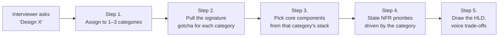

# HLD Interview Problems — Taxonomy & Index

A practical categorisation of system-design interview problems. Every real problem maps to **one or two of ~16 canonical patterns**. Figure out the pattern first, and the building blocks, failure modes, and "interview gotcha" fall out almost automatically.

> **How to read this page**
> - **Pattern** — the architectural shape the problem takes.
> - **Signature gotcha** — the one thing the interviewer is usually fishing for. Say it out loud early.
> - **Core stack** — the components that tend to dominate the whiteboard.
> - **Problems** — concrete questions. Links point to write-ups in this repo. `TODO` marks questions worth adding.
>
> **Diagrams:** architecture diagrams live in [`./assets/`](./assets/README.md) as editable `.drawio` / `.drawio.svg` files. Open them in Cursor/VS Code (the workspace recommends the `hediet.vscode-drawio` extension) or in [diagrams.net](https://app.diagrams.net/).

## Table of Contents

| # | Category | Signature gotcha |
|---|----------|------------------|
| 1 | [URL / ID / Key Generation](#1-url--id--key-generation-services) | Uniqueness at scale |
| 2 | [Storage & Caching Primitives](#2-storage--caching-primitives) | Consistency vs availability (CAP) |
| 3 | [Rate Limiting & Quotas](#3-rate-limiting-throttling--quotas) | Algorithm choice + distributed counter |
| 4 | [Social / Feed / Timeline](#4-social--feed--timeline-systems) | Fan-out on write vs read (celebrity) |
| 5 | [Real-Time Messaging & Presence](#5-real-time-messaging--presence) | Long-lived connections + multi-device sync |
| 6 | [Pub-Sub / Notifications](#6-push--pub-sub--notification-systems) | Retry, DLQ, idempotency |
| 7 | [Streaming & Real-Time Analytics](#7-streaming-analytics--real-time-aggregation) | Event-time + exactly-once state |
| 8 | [Search / Ranking / Recommendation](#8-search-ranking--recommendation) | Indexing pipeline + freshness vs accuracy |
| 9 | [Location / Proximity / Geo](#9-location--proximity--geo-services) | Geo-indexing + matching |
| 10 | [Media Storage & Delivery](#10-media--large-object-storage--delivery) | Chunked upload + CDN + transcoding |
| 11 | [Collaboration (Strong Ordering)](#11-collaboration--consistency-heavy-systems) | OT vs CRDT, conflict resolution |
| 12 | [Financial / Transactional](#12-financial--transactional-systems) | Idempotency + audit + ACID |
| 13 | [Booking / Inventory](#13-booking--inventory--reservation-systems) | Race conditions, overbooking |
| 14 | [Scheduling / Workflow / Orchestration](#14-scheduling--workflow--orchestration) | Durable execution, retries |
| 15 | [Infrastructure / Platform Services](#15-infrastructure--platform-services) | Multi-tenancy, isolation |
| 16 | [Security & Identity](#16-security--identity) | Revocation, session storage |

---

## 1. URL / ID / Key Generation Services

- **Pattern:** Tiny input → short unique output → read-heavy traffic.
- **Signature gotcha:** Uniqueness at scale (hash + collision vs counter vs Snowflake).
- **Core stack:** base62 encoder, Snowflake/ZooKeeper, Redis cache, KV store.

| Problem | Difficulty | File |
|---------|-----------|------|
| URL Shortener | Easy | [04-DesignEasy/01-URLShortener.md](../04-DesignEasy/01-URLShortener.md) |
| Pastebin | Easy | [04-DesignEasy/02-PasteBin.md](../04-DesignEasy/02-PasteBin.md) |
| Distributed Unique ID Generator (Snowflake) | Easy | [04-DesignEasy/04-UniqueIDGenerator.md](../04-DesignEasy/04-UniqueIDGenerator.md) |
| Short-code / Coupon generator | Easy | _TODO_ |
| OTP / One-time-token service | Easy | _TODO_ |

---

## 2. Storage & Caching Primitives

- **Pattern:** Build the building block itself.
- **Signature gotcha:** Consistency model, partitioning, replication, eviction policy.
- **Core stack:** consistent hashing, quorum R/W, gossip, LRU/LFU, hinted handoff.

| Problem | Difficulty | File |
|---------|-----------|------|
| Distributed Key-Value Store (Dynamo-style) | Easy | [04-DesignEasy/05-KeyValueStore.md](../04-DesignEasy/05-KeyValueStore.md) |
| Distributed Cache (Redis-like) | Medium | [05-DesignMedium/09-DistributedCache.md](../05-DesignMedium/09-DistributedCache.md) |
| Content Delivery Network (CDN) | Medium | _TODO_ |
| Distributed File System (GFS / HDFS) | Hard | _TODO_ |
| Object / Blob Store (S3) | Hard | _TODO_ |
| Message Broker (Kafka-like) | Hard | _TODO_ |
| Time-Series Database | Hard | _TODO_ |

---

## 3. Rate Limiting, Throttling & Quotas

- **Pattern:** Per-key bounded decision on every request in sub-ms.
- **Signature gotcha:** Token bucket vs leaky bucket vs sliding window; distributed counter atomicity.
- **Core stack:** Redis + Lua, sidecar, consistent hashing.

| Problem | Difficulty | File |
|---------|-----------|------|
| Rate Limiter | Easy | [04-DesignEasy/03-RateLimiter.md](../04-DesignEasy/03-RateLimiter.md) |
| API Gateway | Medium | _TODO_ |
| WAF / Anti-abuse | Medium | _TODO_ |
| Quota / Billing meter | Medium | _TODO_ |

---

## 4. Social / Feed / Timeline Systems

- **Pattern:** Many-to-many graph + personalized ordered feed.
- **Signature gotcha:** Push vs pull vs hybrid fan-out; the "celebrity problem".
- **Core stack:** Graph store, Redis lists/sorted-sets, Kafka for fan-out, ML ranker.

| Problem | Difficulty | File |
|---------|-----------|------|
| News Feed (Facebook) | Medium | [05-DesignMedium/03-NewsFeed.md](../05-DesignMedium/03-NewsFeed.md) |
| Twitter / X | Medium | [05-DesignMedium/08-Twitter.md](../05-DesignMedium/08-Twitter.md) |
| Instagram | Medium | [05-DesignMedium/07-Instagram.md](../05-DesignMedium/07-Instagram.md) |
| LinkedIn feed | Medium | _TODO_ |
| Reddit / TikTok feed | Medium | _TODO_ |
| "People You May Know" | Medium | _TODO_ |

---

## 5. Real-Time Messaging & Presence

- **Pattern:** Long-lived connections, low-latency delivery, multi-device sync.
- **Signature gotcha:** WebSocket gateway sharding, presence, offline queues, read receipts.
- **Core stack:** WebSocket/gRPC bidi, Kafka, Redis for presence, device registry.

| Problem | Difficulty | File |
|---------|-----------|------|
| Chat / WhatsApp / FB Messenger | Medium | [05-DesignMedium/01-ChatSystem.md](../05-DesignMedium/01-ChatSystem.md) |
| Zoom / Video conferencing | Hard | [06-DesignHard/05-Zoom.md](../06-DesignHard/05-Zoom.md) |
| Slack | Medium | _TODO_ |
| Discord / voice chat | Hard | _TODO_ |
| Live-stream chat (Twitch) | Hard | _TODO_ |

---

## 6. Push / Pub-Sub / Notification Systems

- **Pattern:** One event → N downstream consumers; at-least-once delivery; huge fan-out.
- **Signature gotcha:** Retry strategy, DLQ, dedup, topic/priority design.
- **Core stack:** Kafka/SNS/SQS, outbox pattern, delivery scheduler, provider adapters (APNS, FCM, Twilio, SES).

| Problem | Difficulty | File |
|---------|-----------|------|
| Notification service (email/SMS/push) | Medium | [05-DesignMedium/02-NotificationSystem.md](../05-DesignMedium/02-NotificationSystem.md) |
| Webhook delivery system | Medium | _TODO_ |
| Email service (ESP / Mailgun-like) | Hard | _TODO_ |
| Cron-at-scale / distributed scheduler | Hard | _TODO_ |

---

## 7. Streaming, Analytics & Real-Time Aggregation

- **Pattern:** Event firehose → windowed aggregates → alerts / dashboards.
- **Signature gotcha:** Event-time vs processing-time, watermarks, keyed state, exactly-once, hot keys.
- **Core stack:** Kafka, Flink / Spark Structured Streaming / Kafka Streams, RocksDB state, Druid / ClickHouse.

| Problem | Difficulty | File |
|---------|-----------|------|
| Telecom CDR Spike / Fraud Detection | Hard | [InterviewProblems/01-TelecomCDRSpikeDetection.md](01-TelecomCDRSpikeDetection.md) |
| Real-Time Analytics (Google Analytics / Mixpanel) | Hard | _TODO_ |
| Trending Topics / Top-K | Hard | _TODO_ |
| Credit-card Fraud Detection | Hard | _TODO_ |
| Ad Click Counter / Attribution | Hard | _TODO_ |
| Metrics / Monitoring backend (Prometheus-like) | Hard | _TODO_ |
| Log aggregation (ELK / Splunk) | Hard | _TODO_ |

---

## 8. Search, Ranking & Recommendation

- **Pattern:** Inverted or vector index + ranker + query-time aggregation.
- **Signature gotcha:** Indexing pipeline, term-sharding vs doc-sharding, freshness vs accuracy, ranking features.
- **Core stack:** Elasticsearch / Lucene, vector DB (FAISS, Milvus, pgvector), feature store, Kafka for updates.

| Problem | Difficulty | File |
|---------|-----------|------|
| Search Engine (Google) | Hard | [06-DesignHard/07-SearchEngine.md](../06-DesignHard/07-SearchEngine.md) |
| Web Crawler | Medium | [05-DesignMedium/04-WebCrawler.md](../05-DesignMedium/04-WebCrawler.md) |
| Autocomplete / Typeahead | Medium | [05-DesignMedium/05-Autocomplete.md](../05-DesignMedium/05-Autocomplete.md) |
| Recommendation System (Netflix / YouTube) | Hard | _TODO_ |
| Semantic / Vector Search (RAG retrieval) | Hard | _TODO_ |
| E-commerce Product Search (Amazon) | Hard | _TODO_ |

---

## 9. Location / Proximity / Geo Services

- **Pattern:** Geo-indexing + real-time position updates + nearest-neighbor queries + routing.
- **Signature gotcha:** Geohash / S2 / quadtree partitioning, driver-rider matching, ETA, surge pricing.
- **Core stack:** Redis Geo, PostGIS, S2, Kafka for location stream, graph-based routing.

| Problem | Difficulty | File |
|---------|-----------|------|
| Google Maps / Routing | Hard | [06-DesignHard/01-GoogleMaps.md](../06-DesignHard/01-GoogleMaps.md) |
| Uber / Lyft | Hard | [06-DesignHard/04-Uber.md](../06-DesignHard/04-Uber.md) |
| Food Delivery (DoorDash) | Hard | [06-DesignHard/08-FoodDelivery.md](../06-DesignHard/08-FoodDelivery.md) |
| Nearby Friends | Medium | _TODO_ |
| Parking / Hotel / Flight search | Medium | _TODO_ |
| Fleet / IoT tracking | Hard | _TODO_ |

---

## 10. Media / Large-Object Storage & Delivery

- **Pattern:** Very large blobs, chunked upload, CDN delivery, transcoding pipeline.
- **Signature gotcha:** Multipart / resumable upload, dedup, signed URLs, adaptive bitrate streaming (HLS/DASH).
- **Core stack:** S3, CDN, transcoding workers (FFmpeg), job queue, metadata DB.

| Problem | Difficulty | File |
|---------|-----------|------|
| YouTube / Netflix | Medium | [05-DesignMedium/06-YouTube.md](../05-DesignMedium/06-YouTube.md) |
| Google Drive / Dropbox | Hard | [06-DesignHard/09-GoogleDrive.md](../06-DesignHard/09-GoogleDrive.md) |
| Image host (Imgur) | Medium | _TODO_ |
| Podcast platform (Spotify) | Hard | _TODO_ |
| Live-streaming platform (Twitch) | Hard | _TODO_ |

---

## 11. Collaboration & Consistency-Heavy Systems

- **Pattern:** Multiple writers on shared state with strong ordering.
- **Signature gotcha:** OT vs CRDT, cursor sync, presence, offline edits, conflict resolution.
- **Core stack:** WebSocket, OT/CRDT library, document store, presence service.

| Problem | Difficulty | File |
|---------|-----------|------|
| Google Docs / collaborative editor | Hard | [06-DesignHard/02-GoogleDocs.md](../06-DesignHard/02-GoogleDocs.md) |
| Figma / whiteboard | Hard | _TODO_ |
| Git / version control | Hard | _TODO_ |
| Trello / Jira / Notion | Medium | _TODO_ |

---

## 12. Financial / Transactional Systems

- **Pattern:** Strong consistency, ACID, exactly-once, audit, regulatory compliance.
- **Signature gotcha:** Idempotency keys, 2PC / Saga, double-entry ledger, reconciliation.
- **Core stack:** Relational DB with strict serializable, Kafka event log, saga orchestrator, HSM for keys.

| Problem | Difficulty | File |
|---------|-----------|------|
| Payment System (Stripe) | Hard | [06-DesignHard/03-PaymentSystem.md](../06-DesignHard/03-PaymentSystem.md) |
| Stock Exchange / Matching Engine | Hard | [06-DesignHard/06-StockExchange.md](../06-DesignHard/06-StockExchange.md) |
| Digital Wallet (PayPal / Paytm) | Hard | _TODO_ |
| Ledger / accounting system | Hard | _TODO_ |
| Cryptocurrency exchange | Hard | _TODO_ |
| Ads Billing / RTB bidding | Hard | _TODO_ |

---

## 13. Booking / Inventory / Reservation Systems

- **Pattern:** Scarce resources, race conditions, holds/locks, cancellation.
- **Signature gotcha:** Overbooking vs underbooking, optimistic vs pessimistic locking, seat-map sharding.
- **Core stack:** Relational DB + row-locks, Redis-based hold locks, Kafka for expiry.

| Problem | Difficulty | File |
|---------|-----------|------|
| Ticketmaster / BookMyShow | Hard | _TODO_ |
| Airline reservation | Hard | _TODO_ |
| Hotel booking | Medium | _TODO_ |
| E-commerce checkout / flash sale | Hard | _TODO_ |
| Warehouse inventory | Medium | _TODO_ |

---

## 14. Scheduling / Workflow / Orchestration

- **Pattern:** DAGs of tasks, retries, time-based triggers, durable execution.
- **Signature gotcha:** At-least-once + idempotent steps, leader election, time skew.
- **Core stack:** Durable queue, workflow engine (Temporal / Airflow / Step Functions), leader election.

| Problem | Difficulty | File |
|---------|-----------|------|
| High-Precision Distributed Job Scheduler (10K/s, ±2s) | Hard | [InterviewProblems/03-HighPrecisionDistributedJobScheduler.md](03-HighPrecisionDistributedJobScheduler.md) |
| Distributed Job Scheduler (Airflow / Temporal) | Hard | _TODO_ |
| Cron service at scale | Medium | _TODO_ |
| CI/CD system (Jenkins / GitHub Actions) | Hard | see [02-DesignVercel.md §7.2](02-DesignVercel.md#72-cicd--build-pipeline) |
| Background-job queue (Sidekiq / Celery) | Medium | _TODO_ |

---

## 15. Infrastructure / Platform Services

- **Pattern:** Internal building blocks used by other engineers.
- **Signature gotcha:** Multi-tenancy, isolation, quotas, SDK design, client-side caching.
- **Core stack:** Raft/Paxos for consensus, gRPC, etcd/ZooKeeper.

| Problem | Difficulty | File |
|---------|-----------|------|
| Frontend Cloud / Deployment Platform (Vercel) | Hard | [InterviewProblems/02-DesignVercel.md](02-DesignVercel.md) |
| Feature-Flag service (LaunchDarkly) | Medium | _TODO_ |
| Configuration service (Consul / etcd client) | Medium | _TODO_ |
| Service Registry / Discovery | Medium | _TODO_ |
| Secrets Manager (Vault) | Hard | _TODO_ |
| Distributed Lock service | Hard | _TODO_ |
| Load Balancer | Medium | _TODO_ |

---

## 16. Security & Identity

- **Pattern:** Authn/authz on the critical path of every request.
- **Signature gotcha:** Token lifetime, revocation, MFA, session storage, ACL evaluation at scale.
- **Core stack:** OAuth2 / OIDC, JWT / opaque tokens, ReBAC (Zanzibar), HSM.

| Problem | Difficulty | File |
|---------|-----------|------|
| Authentication service (OAuth / OIDC) | Hard | _TODO_ |
| Authorization service (Zanzibar-style) | Hard | _TODO_ |
| Single Sign-On (SSO) | Hard | _TODO_ |
| Password-reset flow | Medium | _TODO_ |
| Audit-log service | Medium | _TODO_ |

---

## How to Use This Taxonomy in an Interview

1. **Assign the problem to 1–3 categories.** Most real problems are mashups.
2. **Pull the signature gotcha.** That's the sentence that earns you the first "senior engineer" signal.
3. **Start drawing from that category's core stack.** You are not inventing architecture from scratch; you are adapting a pattern you already know.
4. **State the NFR priority.** Latency (category 5), consistency (12), freshness (7), durability (10), availability (6, 15) — each category has a dominant one.
5. **Call out trade-offs explicitly.** Push vs pull (4), sync vs async (6), OT vs CRDT (11), token bucket vs sliding window (3) — the interviewer wants the conversation, not just the answer.

### Real problems as mashups of categories

| Interview question      | Primary categories |
|-------------------------|--------------------|
| Uber                    | Geo (9) + Real-time messaging (5) + Payments (12) |
| YouTube                 | Media (10) + Search/recommendation (8) + Feed (4) |
| WhatsApp                | Real-time messaging (5) + Notifications (6) + Media (10) |
| Telecom CDR spike alert | Streaming (7) + Notifications (6) + Storage tiering (2) |
| E-commerce checkout     | Inventory (13) + Payments (12) + Notifications (6) |
| Google Docs             | Collaboration (11) + Real-time messaging (5) + Storage (2) |
| Netflix                 | Media (10) + Recommendation (8) + CDN / Storage (2) |
| Stripe                  | Financial (12) + Scheduling (14) + Notifications (6) |
| Vercel / Netlify        | Platform (15) + CI/CD & Workflow (14) + CDN & Storage (2, 10) + Observability (7) |

---

## Related Material in This Repo

- **[src/HLD/01-Fundamentals/](../01-Fundamentals/)** — CAP, PACELC, consistency models, consistent hashing.
- **[src/HLD/02-BuildingBlocks/](../02-BuildingBlocks/)** — databases, caches, queues, load balancers.
- **[src/HLD/03-AdvancedConcepts/](../03-AdvancedConcepts/)** — sagas, CRDTs, quorum, Raft/Paxos.
- **[src/HLD/Components/](../Components/)** — deep dives on Kafka, SQS, SNS, Kinesis, S3, etc. with runnable Java demos.
- **[src/HLD/04-DesignEasy/](../04-DesignEasy/)**, **[05-DesignMedium/](../05-DesignMedium/)**, **[06-DesignHard/](../06-DesignHard/)** — problems organised by difficulty.
- **[src/HLD/InterviewProblems/](.)** — real interview transcripts and deep-dives. Start with [01-TelecomCDRSpikeDetection.md](01-TelecomCDRSpikeDetection.md), [02-DesignVercel.md](02-DesignVercel.md), and [03-HighPrecisionDistributedJobScheduler.md](03-HighPrecisionDistributedJobScheduler.md).
